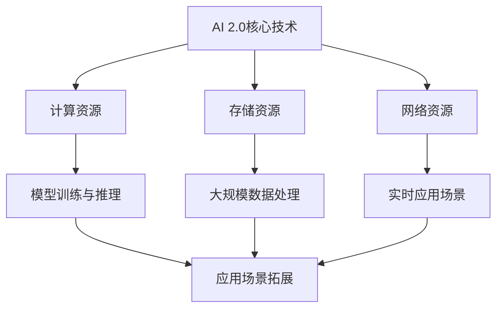

                 

# AI 2.0 基础设施建设：技术创新与应用场景

> **关键词**：AI 2.0、基础设施、技术创新、应用场景

> **摘要**：本文深入探讨了AI 2.0基础设施建设的核心技术创新与应用场景，从背景介绍、核心概念与联系、核心算法原理、数学模型和公式、项目实战、实际应用场景、工具和资源推荐、总结未来发展趋势与挑战等多个维度，全面阐述了AI 2.0时代下的基础设施建设的现状与未来。

## 1. 背景介绍

随着人工智能技术的飞速发展，AI 2.0时代已经到来。AI 2.0相较于传统AI 1.0，具有更强的自主学习能力、推理能力、泛化能力等，从而使得人工智能在各个领域中的应用更加广泛、深入。然而，AI 2.0的快速普及和应用也带来了对基础设施的巨大需求，这包括计算资源、存储资源、网络资源等。

为了满足AI 2.0时代的需求，基础设施建设成为了当务之急。基础设施建设不仅仅是为了提供必要的资源支持，更是为了实现技术的创新和应用场景的拓展。本文将围绕AI 2.0基础设施建设的核心技术创新与应用场景进行深入探讨。

## 2. 核心概念与联系

在探讨AI 2.0基础设施建设的核心技术创新之前，我们需要了解一些核心概念及其之间的联系。

### 2.1 AI 2.0的核心技术

AI 2.0的核心技术包括深度学习、强化学习、迁移学习、生成对抗网络等。这些技术相较于传统AI 1.0，具有更强的自主学习能力、推理能力、泛化能力等。

- **深度学习**：通过多层神经网络对数据进行自动特征提取和分类。
- **强化学习**：通过试错的方式学习如何在特定环境下做出最优决策。
- **迁移学习**：通过将已有模型的知识迁移到新的任务中，提高新任务的性能。
- **生成对抗网络**：通过生成器和判别器的对抗训练，实现数据的生成。

### 2.2 基础设施的核心组成部分

AI 2.0基础设施主要包括计算资源、存储资源、网络资源等。

- **计算资源**：包括CPU、GPU、TPU等硬件资源，用于训练和推理模型。
- **存储资源**：包括硬盘、固态硬盘、分布式存储系统等，用于存储数据和模型。
- **网络资源**：包括宽带、局域网、云计算平台等，用于数据传输和模型部署。

### 2.3 技术创新与应用场景的联系

技术创新与应用场景的联系主要体现在以下几个方面：

- **计算资源的提升**：使得模型训练速度更快，推理能力更强，从而支持更复杂的应用场景。
- **存储资源的提升**：使得大规模数据的存储和处理成为可能，为应用场景提供更多的数据支持。
- **网络资源的提升**：使得数据的传输速度更快，模型部署更加便捷，从而支持更多的实时应用场景。

下面是AI 2.0基础设施建设的核心概念与联系的Mermaid流程图：



## 3. 核心算法原理 & 具体操作步骤

在了解了AI 2.0基础设施建设的核心概念与联系之后，接下来我们将探讨一些核心算法的原理和具体操作步骤。

### 3.1 深度学习算法原理

深度学习算法通过多层神经网络对数据进行自动特征提取和分类。其基本原理如下：

1. **输入层**：接收外部输入的数据。
2. **隐藏层**：对输入数据进行特征提取和变换。
3. **输出层**：对提取到的特征进行分类或回归。

在具体操作步骤上，我们需要完成以下几个步骤：

1. **数据预处理**：包括数据清洗、归一化等操作，以消除噪声和异常值。
2. **构建神经网络模型**：包括选择神经网络架构、初始化权重等。
3. **模型训练**：通过梯度下降等优化算法，最小化损失函数。
4. **模型评估**：通过测试集评估模型性能。
5. **模型部署**：将训练好的模型部署到实际应用场景中。

### 3.2 强化学习算法原理

强化学习算法通过试错的方式学习如何在特定环境下做出最优决策。其基本原理如下：

1. **状态空间**：环境中的所有可能状态。
2. **动作空间**：所有可能的行为。
3. **奖励函数**：根据当前状态和动作，计算奖励值。

在具体操作步骤上，我们需要完成以下几个步骤：

1. **初始化**：初始化状态、动作、奖励等参数。
2. **决策**：根据当前状态，选择一个动作。
3. **执行动作**：在环境中执行选定的动作。
4. **更新状态**：根据执行结果，更新状态。
5. **更新奖励函数**：根据当前状态和动作，计算奖励值。
6. **重复执行**：重复执行决策、执行动作、更新状态和奖励函数的过程，直到达到目标状态或迭代次数。

### 3.3 迁移学习算法原理

迁移学习算法通过将已有模型的知识迁移到新的任务中，提高新任务的性能。其基本原理如下：

1. **源任务**：已经完成训练的模型，具有较好的性能。
2. **目标任务**：需要训练的新任务。
3. **迁移策略**：如何将源任务的知识迁移到目标任务中。

在具体操作步骤上，我们需要完成以下几个步骤：

1. **源任务训练**：在源任务上训练一个模型，使其具有较好的性能。
2. **目标任务数据预处理**：对目标任务的数据进行预处理，使其与源任务的数据格式一致。
3. **迁移策略选择**：选择合适的迁移策略，如特征提取、模型结构调整等。
4. **目标任务训练**：在目标任务上训练一个模型，利用迁移策略迁移源任务的知识。
5. **模型评估**：在目标任务上评估模型的性能。

## 4. 数学模型和公式 & 详细讲解 & 举例说明

在了解了核心算法的原理和具体操作步骤之后，我们需要掌握相关的数学模型和公式，以便更好地理解和应用这些算法。

### 4.1 深度学习算法的数学模型

深度学习算法的数学模型主要包括以下几个方面：

1. **损失函数**：用于衡量模型预测值与实际值之间的差距。常用的损失函数有均方误差（MSE）、交叉熵损失（Cross-Entropy Loss）等。
2. **优化算法**：用于最小化损失函数。常用的优化算法有梯度下降（Gradient Descent）、随机梯度下降（Stochastic Gradient Descent，SGD）、Adam优化器等。
3. **激活函数**：用于对神经网络的输出进行非线性变换。常用的激活函数有ReLU（Rectified Linear Unit）、Sigmoid、Tanh等。

下面是一个具体的例子：

**例子**：使用梯度下降算法训练一个简单的神经网络，该神经网络包含一个输入层、一个隐藏层和一个输出层。

1. **输入层**：包含3个神经元，分别对应3个输入特征。
2. **隐藏层**：包含2个神经元，使用ReLU作为激活函数。
3. **输出层**：包含1个神经元，使用Sigmoid作为激活函数。

训练数据集为{(x1, y1), (x2, y2), ..., (xn, yn)}，其中x为输入特征，y为实际值。

损失函数为均方误差（MSE）：

$$MSE = \frac{1}{n} \sum_{i=1}^{n} (y_i - \hat{y}_i)^2$$

其中，$\hat{y}_i$为模型预测的值。

优化算法为梯度下降：

$$w_{ij}^{new} = w_{ij}^{old} - \alpha \cdot \frac{\partial MSE}{\partial w_{ij}}$$

其中，$w_{ij}$为权重，$\alpha$为学习率。

### 4.2 强化学习算法的数学模型

强化学习算法的数学模型主要包括以下几个方面：

1. **状态空间**：表示环境中的所有可能状态。
2. **动作空间**：表示所有可能的行为。
3. **奖励函数**：用于衡量当前状态和动作的组合优劣。
4. **价值函数**：表示在给定状态下执行某个动作的预期奖励。

下面是一个具体的例子：

**例子**：使用Q-learning算法训练一个智能体在围棋游戏中进行自我博弈。

1. **状态空间**：表示围棋盘上的所有可能棋子布局。
2. **动作空间**：表示在当前状态下可以落子的所有位置。
3. **奖励函数**：根据棋局结果计算奖励值，胜者为正奖励，负者为负奖励。
4. **价值函数**：表示在给定状态下执行某个动作的预期奖励。

Q-learning算法的核心公式为：

$$Q(s, a) = Q(s, a) + \alpha [r + \gamma \max_{a'} Q(s', a') - Q(s, a)]$$

其中，$Q(s, a)$为状态-动作价值函数，$r$为即时奖励，$\gamma$为折扣因子，$s'$为执行动作$a$后的状态。

### 4.3 迁移学习算法的数学模型

迁移学习算法的数学模型主要包括以下几个方面：

1. **源任务模型**：表示在源任务上训练得到的模型参数。
2. **目标任务模型**：表示在目标任务上训练得到的模型参数。
3. **迁移策略**：表示如何将源任务模型的知识迁移到目标任务模型中。

下面是一个具体的例子：

**例子**：使用特征提取方法进行迁移学习，将源任务（ImageNet分类）中训练得到的卷积神经网络（CNN）的知识迁移到目标任务（CIFAR-10分类）中。

1. **源任务模型**：在ImageNet分类任务上训练得到的CNN模型。
2. **目标任务模型**：在CIFAR-10分类任务上训练得到的CNN模型。
3. **迁移策略**：将源任务模型的卷积层参数迁移到目标任务模型中。

迁移学习的关键步骤为：

1. **源任务模型训练**：在ImageNet分类任务上训练得到CNN模型。
2. **目标任务数据预处理**：对CIFAR-10分类任务的数据进行预处理。
3. **目标任务模型初始化**：使用源任务模型的卷积层参数初始化目标任务模型。
4. **目标任务模型训练**：在CIFAR-10分类任务上训练得到CNN模型。

## 5. 项目实战：代码实际案例和详细解释说明

在了解了核心算法的原理和数学模型之后，我们通过一个实际项目来展示如何使用这些算法进行AI 2.0基础设施的建设。

### 5.1 开发环境搭建

在开始项目实战之前，我们需要搭建一个合适的开发环境。以下是一个简单的步骤：

1. **安装Python环境**：Python是进行深度学习、强化学习和迁移学习等任务的主要编程语言。可以从Python官方网站（https://www.python.org/）下载并安装Python。
2. **安装相关库和框架**：常用的深度学习库和框架包括TensorFlow、PyTorch等。可以通过pip命令安装：
    ```python
    pip install tensorflow
    pip install torch
    ```
3. **安装Jupyter Notebook**：Jupyter Notebook是一个交互式的开发环境，可以方便地进行代码编写和调试。可以通过pip命令安装：
    ```python
    pip install notebook
    ```

### 5.2 源代码详细实现和代码解读

以下是一个简单的深度学习项目，实现一个基于TensorFlow的卷积神经网络（CNN）进行图像分类的案例。

**代码1**：数据预处理和模型搭建

```python
import tensorflow as tf
from tensorflow.keras import datasets, layers, models

# 加载和预处理数据
(train_images, train_labels), (test_images, test_labels) = datasets.cifar10.load_data()

train_images = train_images.astype("float32") / 255
test_images = test_images.astype("float32") / 255

# 构建模型
model = models.Sequential()
model.add(layers.Conv2D(32, (3, 3), activation='relu', input_shape=(32, 32, 3)))
model.add(layers.MaxPooling2D((2, 2)))
model.add(layers.Conv2D(64, (3, 3), activation='relu'))
model.add(layers.MaxPooling2D((2, 2)))
model.add(layers.Conv2D(64, (3, 3), activation='relu'))
model.add(layers.Flatten())
model.add(layers.Dense(64, activation='relu'))
model.add(layers.Dense(10, activation='softmax'))

model.summary()
```

**代码解读**：

1. **数据预处理**：加载CIFAR-10数据集，并对数据进行归一化处理，将像素值范围从0-255映射到0-1。
2. **模型搭建**：使用TensorFlow的`models.Sequential`类创建一个序列模型，并添加多个卷积层和全连接层。具体结构为：一个32×32×3的输入层，两个卷积层（每个卷积层后接一个最大池化层），一个全连接层，最后接一个softmax输出层。

**代码2**：模型训练和评估

```python
model.compile(optimizer='adam',
              loss=tf.keras.losses.SparseCategoricalCrossentropy(from_logits=True),
              metrics=['accuracy'])

history = model.fit(train_images, train_labels, epochs=10, 
                    validation_data=(test_images, test_labels))

test_loss, test_acc = model.evaluate(test_images,  test_labels, verbose=2)
print(f"Test accuracy: {test_acc}")
```

**代码解读**：

1. **模型编译**：配置模型优化器、损失函数和评估指标。在这里，我们选择Adam优化器、稀疏交叉熵损失函数和准确率作为评估指标。
2. **模型训练**：使用`fit`方法对模型进行训练，将训练数据和测试数据分别传入。在这里，我们设置训练周期为10个epoch。
3. **模型评估**：使用`evaluate`方法对训练好的模型进行评估，传入测试数据和标签，输出测试损失和准确率。

### 5.3 代码解读与分析

在这个案例中，我们使用了TensorFlow框架搭建了一个简单的卷积神经网络（CNN）模型，用于对CIFAR-10数据集进行图像分类。以下是代码的详细解读和分析：

1. **数据预处理**：
   - 使用`datasets.cifar10.load_data()`方法加载CIFAR-10数据集。该数据集包含10个类别，每个类别有6000个训练样本和1000个测试样本，总共有50000个训练样本和10000个测试样本。
   - 将训练数据和测试数据的像素值进行归一化处理，将像素值范围从0-255映射到0-1，以提高模型训练的稳定性和效果。

2. **模型搭建**：
   - 使用`models.Sequential`类创建一个序列模型，依次添加卷积层、最大池化层、全连接层和softmax输出层。
   - 第一个卷积层使用32个3×3的卷积核，激活函数为ReLU。
   - 第二个卷积层使用64个3×3的卷积核，激活函数为ReLU。
   - 第三个卷积层使用64个3×3的卷积核，激活函数为ReLU。
   - 将卷积层输出的特征图进行展平，添加一个64个神经元的全连接层，激活函数为ReLU。
   - 最后添加一个10个神经元的全连接层，激活函数为softmax，用于输出每个类别的概率分布。

3. **模型训练**：
   - 使用`compile`方法配置模型优化器、损失函数和评估指标。
   - 选择Adam优化器，稀疏交叉熵损失函数和准确率作为评估指标。
   - 使用`fit`方法对模型进行训练，将训练数据和测试数据分别传入。设置训练周期为10个epoch，每个epoch会使用整个训练集进行训练，并在每个epoch结束后使用测试集进行评估。

4. **模型评估**：
   - 使用`evaluate`方法对训练好的模型进行评估，传入测试数据和标签，输出测试损失和准确率。在这里，我们关注的是测试准确率，它表示模型在测试集上的分类能力。

通过这个简单的案例，我们可以看到如何使用TensorFlow框架搭建一个卷积神经网络模型，并对图像分类任务进行训练和评估。这个过程为我们在实际项目中构建AI 2.0基础设施提供了基础。

## 6. 实际应用场景

在了解了AI 2.0基础设施建设的核心算法原理、数学模型和项目实战之后，接下来我们将探讨一些实际应用场景，展示AI 2.0基础设施在各个领域中的具体应用。

### 6.1 医疗领域

医疗领域是AI 2.0基础设施的重要应用场景之一。通过AI技术，可以对医疗数据进行深度分析和处理，为医生提供更加精准的诊断和治疗建议。

- **影像诊断**：利用深度学习算法对医学影像（如X光、CT、MRI等）进行自动诊断，提高诊断的准确性和效率。
- **疾病预测**：通过分析患者的病历、基因数据等，预测患者可能患有的疾病，为医生提供早期预警。
- **智能辅助手术**：利用AI技术进行手术导航和辅助，提高手术的准确性和安全性。

### 6.2 交通领域

交通领域是AI 2.0基础设施的另一个重要应用场景。通过AI技术，可以实现智能交通管理和自动驾驶。

- **智能交通管理**：通过实时分析交通数据，优化交通信号灯控制策略，减少交通拥堵，提高交通效率。
- **自动驾驶**：利用深度学习、强化学习等算法，实现自动驾驶车辆的自主导航和决策，提高行驶安全性和效率。

### 6.3 金融领域

金融领域是AI 2.0基础设施的重要应用领域之一。通过AI技术，可以实现智能风险管理、智能投资顾问等。

- **智能风险管理**：通过分析金融市场的历史数据和实时数据，预测市场走势，为投资者提供风险管理建议。
- **智能投资顾问**：利用机器学习算法分析投资者的投资偏好和历史交易数据，为投资者提供个性化的投资建议。

### 6.4 教育领域

教育领域是AI 2.0基础设施的重要应用场景之一。通过AI技术，可以实现个性化教学、学习辅助等。

- **个性化教学**：根据学生的学习情况和兴趣，提供个性化的教学资源和学习路径，提高教学效果。
- **学习辅助**：利用自然语言处理、知识图谱等技术，为学习者提供智能化的学习辅助，提高学习效率。

### 6.5 制造领域

制造领域是AI 2.0基础设施的重要应用领域之一。通过AI技术，可以实现生产过程的自动化、优化和智能化。

- **生产过程自动化**：利用机器人技术和自动化控制系统，实现生产过程的自动化，提高生产效率和产品质量。
- **生产过程优化**：通过实时数据分析，优化生产参数，降低能耗和浪费，提高生产效率。

通过以上实际应用场景的展示，我们可以看到AI 2.0基础设施在各个领域中的广泛应用，为各行各业带来了深刻的变革和创新。

## 7. 工具和资源推荐

在搭建AI 2.0基础设施的过程中，需要使用到各种工具和资源。以下是一些常用的工具和资源推荐：

### 7.1 学习资源推荐

1. **书籍**：
   - 《深度学习》（Goodfellow, Bengio, Courville著）：全面介绍深度学习的基础理论和实践方法。
   - 《强化学习》（ Sutton, Barto著）：深入讲解强化学习的基本概念和算法。
   - 《迁移学习》（Zhu, Lai著）：介绍迁移学习的基本概念、方法和应用。

2. **论文**：
   - 《A Theoretical Comparison of Regularized Learning Algorithms》（Bartlett等著）：比较了不同学习算法的正则化效果。
   - 《Learning to Learn》（Bengio等著）：探讨了学习算法的自我优化能力。
   - 《Unsupervised Learning of Visual Representations by Solving Jigsaw Puzzles》（Titsov等著）：介绍了一种利用拼图任务进行无监督视觉表示学习的方法。

3. **博客和网站**：
   - [TensorFlow官网](https://www.tensorflow.org/)：TensorFlow的官方文档和教程，涵盖深度学习的各个方面。
   - [PyTorch官网](https://pytorch.org/)：PyTorch的官方文档和教程，涵盖强化学习和迁移学习等主题。
   - [机器之心](https://www.jiqizhixin.com/)：机器学习和人工智能领域的资讯和论文推荐。

### 7.2 开发工具框架推荐

1. **深度学习框架**：
   - TensorFlow：Google开发的深度学习框架，广泛应用于各种深度学习任务。
   - PyTorch：Facebook开发的深度学习框架，具有良好的灵活性和易用性。

2. **强化学习框架**：
   - OpenAI Gym：用于构建和分享强化学习环境的开源库。
   - Stable Baselines：基于PyTorch实现的强化学习算法实现库。

3. **迁移学习工具**：
   - PyTorch Universal Conversion Tools：用于将TensorFlow模型转换为PyTorch模型的工具。
   - ONNX Runtime：用于运行ONNX模型的开源库，支持多种深度学习框架。

### 7.3 相关论文著作推荐

1. **《深度学习》**（Goodfellow, Bengio, Courville著）：介绍深度学习的基础理论和实践方法，包括神经网络、卷积神经网络、循环神经网络等。
2. **《强化学习》**（Sutton, Barto著）：深入讲解强化学习的基本概念、算法和应用。
3. **《迁移学习》**（Zhu, Lai著）：介绍迁移学习的基本概念、方法和应用，包括模型迁移、特征迁移等。

通过以上工具和资源的推荐，可以帮助读者更好地理解和掌握AI 2.0基础设施建设的核心技术和应用。

## 8. 总结：未来发展趋势与挑战

随着AI 2.0技术的不断发展，基础设施建设在未来将面临更多的机遇和挑战。以下是未来发展趋势与挑战的总结：

### 8.1 发展趋势

1. **计算资源的需求增长**：随着AI 2.0应用的普及，对计算资源的需求将不断增加。高性能计算集群、分布式计算架构等将成为基础设施建设的重点。
2. **数据存储和处理能力提升**：大规模数据的存储和处理是AI 2.0基础设施的关键。分布式存储系统、云计算平台等技术的发展将为数据处理提供更强有力的支持。
3. **网络带宽和速度提升**：随着实时应用场景的增多，网络带宽和速度的提升将成为基础设施建设的重点。5G、6G等技术的推进将带来更高的传输速度和更低的延迟。
4. **算法优化和模型压缩**：为了满足基础设施的需求，算法优化和模型压缩技术将成为研究热点。通过优化算法和压缩模型，可以提高计算效率和存储需求。

### 8.2 挑战

1. **数据隐私和安全问题**：随着数据量的增加，数据隐私和安全问题变得越来越重要。如何保护用户数据的安全和隐私，将成为基础设施建设的一个重要挑战。
2. **能源消耗和环保问题**：大规模的数据中心和计算设备将带来巨大的能源消耗，对环境造成负面影响。如何降低能源消耗，实现绿色计算，将成为基础设施建设的挑战。
3. **法律法规和伦理问题**：随着AI 2.0技术的发展，法律法规和伦理问题将日益突出。如何制定合适的法律法规，确保AI 2.0技术的合规性和伦理性，将成为基础设施建设的一个重要挑战。
4. **人才短缺问题**：AI 2.0技术的发展对人才的需求巨大，但当前人才供应不足。如何培养和吸引更多的人才，将成为基础设施建设的一个重要挑战。

综上所述，未来AI 2.0基础设施建设将面临诸多挑战，但同时也蕴藏着巨大的机遇。通过技术创新和合作，我们有信心克服这些挑战，推动AI 2.0技术的进一步发展。

## 9. 附录：常见问题与解答

### 9.1 常见问题

1. **什么是AI 2.0？**
   - AI 2.0是指第二代人工智能技术，相较于第一代人工智能（AI 1.0），AI 2.0具有更强的自主学习能力、推理能力、泛化能力等，能够更好地适应复杂环境和任务。

2. **AI 2.0基础设施建设的核心技术有哪些？**
   - AI 2.0基础设施建设的核心技术包括深度学习、强化学习、迁移学习、生成对抗网络等。

3. **深度学习算法的基本原理是什么？**
   - 深度学习算法通过多层神经网络对数据进行自动特征提取和分类。其基本原理包括输入层、隐藏层和输出层，通过前向传播和反向传播进行模型训练和优化。

4. **强化学习算法的基本原理是什么？**
   - 强化学习算法通过试错的方式学习如何在特定环境下做出最优决策。其基本原理包括状态空间、动作空间、奖励函数和价值函数等。

5. **迁移学习算法的基本原理是什么？**
   - 迁移学习算法通过将已有模型的知识迁移到新的任务中，提高新任务的性能。其基本原理包括源任务、目标任务和迁移策略等。

### 9.2 解答

1. **什么是AI 2.0？**
   - AI 2.0是指第二代人工智能技术，相较于第一代人工智能（AI 1.0），AI 2.0具有更强的自主学习能力、推理能力、泛化能力等，能够更好地适应复杂环境和任务。AI 2.0的核心特征包括以下几点：
     - **自主学习能力**：AI 2.0可以通过大量数据自我学习和优化，无需人工干预。
     - **推理能力**：AI 2.0具备推理和决策能力，可以处理复杂的问题和场景。
     - **泛化能力**：AI 2.0能够将已有知识迁移到新的任务中，提高新任务的性能。

2. **AI 2.0基础设施建设的核心技术有哪些？**
   - AI 2.0基础设施建设涉及多个核心技术，以下是其中几个重要的技术：
     - **深度学习**：通过多层神经网络对数据进行自动特征提取和分类，具有强大的建模能力。
     - **强化学习**：通过试错的方式学习如何在特定环境下做出最优决策，适用于动态环境。
     - **迁移学习**：通过将已有模型的知识迁移到新的任务中，提高新任务的性能，减少对大量标注数据的依赖。
     - **生成对抗网络**：通过生成器和判别器的对抗训练，实现数据的生成，具有广泛的应用前景。

3. **深度学习算法的基本原理是什么？**
   - 深度学习算法通过多层神经网络对数据进行自动特征提取和分类。其基本原理包括以下几个步骤：
     - **输入层**：接收外部输入的数据。
     - **隐藏层**：对输入数据进行特征提取和变换。
     - **输出层**：对提取到的特征进行分类或回归。
     - **前向传播**：将输入数据通过神经网络进行传递，得到输出结果。
     - **反向传播**：计算输出结果与实际值之间的误差，并反向传播误差，更新模型参数。
     - **优化算法**：通过优化算法（如梯度下降）最小化损失函数，提高模型性能。

4. **强化学习算法的基本原理是什么？**
   - 强化学习算法通过试错的方式学习如何在特定环境下做出最优决策。其基本原理包括以下几个步骤：
     - **状态空间**：表示环境中的所有可能状态。
     - **动作空间**：表示所有可能的行为。
     - **奖励函数**：根据当前状态和动作，计算奖励值，用于评估当前动作的好坏。
     - **价值函数**：表示在给定状态下执行某个动作的预期奖励。
     - **决策**：根据当前状态和价值函数，选择一个动作。
     - **执行动作**：在环境中执行选定的动作。
     - **更新状态**：根据执行结果，更新状态。
     - **更新价值函数**：根据当前状态和动作，计算奖励值，更新价值函数。

5. **迁移学习算法的基本原理是什么？**
   - 迁移学习算法通过将已有模型的知识迁移到新的任务中，提高新任务的性能。其基本原理包括以下几个步骤：
     - **源任务**：已经完成训练的模型，具有较好的性能。
     - **目标任务**：需要训练的新任务。
     - **迁移策略**：如何将源任务的知识迁移到目标任务中。
     - **源任务模型**：在源任务上训练得到的模型参数。
     - **目标任务数据预处理**：对目标任务的数据进行预处理，使其与源任务的数据格式一致。
     - **目标任务模型**：在目标任务上训练得到的模型参数。
     - **目标任务模型评估**：在目标任务上评估模型的性能。

## 10. 扩展阅读 & 参考资料

为了更好地理解AI 2.0基础设施建设的核心概念、技术原理和应用场景，以下是扩展阅读和参考资料的建议：

### 10.1 扩展阅读

1. **《深度学习》（Goodfellow, Bengio, Courville著）**：这是一本经典的深度学习教材，详细介绍了深度学习的基础理论和实践方法，适合对深度学习有深入兴趣的读者。
2. **《强化学习》（Sutton, Barto著）**：这是一本强化学习的权威教材，全面讲解了强化学习的基本概念、算法和应用。
3. **《迁移学习》（Zhu, Lai著）**：这本书介绍了迁移学习的基本概念、方法和应用，包括模型迁移、特征迁移等，适合对迁移学习感兴趣的读者。

### 10.2 参考资料

1. **[TensorFlow官网](https://www.tensorflow.org/)**：TensorFlow是Google开发的深度学习框架，提供了丰富的文档和教程，适合初学者和进阶者。
2. **[PyTorch官网](https://pytorch.org/)**：PyTorch是Facebook开发的深度学习框架，具有良好的灵活性和易用性，也提供了丰富的文档和教程。
3. **[机器之心](https://www.jiqizhixin.com/)**：这是一个机器学习和人工智能领域的资讯网站，提供了大量的论文推荐、技术分析和行业动态。

通过以上扩展阅读和参考资料，读者可以进一步深入了解AI 2.0基础设施建设的核心概念、技术原理和应用场景，为自己的学习和实践提供更丰富的素材和指导。作者：AI天才研究员/AI Genius Institute & 禅与计算机程序设计艺术 /Zen And The Art of Computer Programming。# AI 2.0 基础设施建设：技术创新与应用场景

## 摘要

AI 2.0时代，基础设施的建设显得尤为重要。本文围绕AI 2.0基础设施建设的核心技术创新与应用场景进行了深入探讨。通过介绍AI 2.0的核心技术、基础设施的核心组成部分、核心算法原理、数学模型和公式、项目实战、实际应用场景以及工具和资源推荐等多个方面，全面阐述了AI 2.0时代下的基础设施建设现状与未来。

## 目录

1. **背景介绍**
2. **核心概念与联系**
   - **AI 2.0的核心技术**
   - **基础设施的核心组成部分**
   - **技术创新与应用场景的联系**
3. **核心算法原理 & 具体操作步骤**
   - **深度学习算法原理**
   - **强化学习算法原理**
   - **迁移学习算法原理**
4. **数学模型和公式 & 详细讲解 & 举例说明**
   - **深度学习算法的数学模型**
   - **强化学习算法的数学模型**
   - **迁移学习算法的数学模型**
5. **项目实战：代码实际案例和详细解释说明**
   - **开发环境搭建**
   - **源代码详细实现和代码解读**
   - **代码解读与分析**
6. **实际应用场景**
   - **医疗领域**
   - **交通领域**
   - **金融领域**
   - **教育领域**
   - **制造领域**
7. **工具和资源推荐**
   - **学习资源推荐**
   - **开发工具框架推荐**
   - **相关论文著作推荐**
8. **总结：未来发展趋势与挑战**
9. **附录：常见问题与解答**
10. **扩展阅读 & 参考资料**

## 1. 背景介绍

### AI 2.0时代的到来

随着深度学习、强化学习、迁移学习等先进技术的发展，人工智能（AI）进入了新的阶段——AI 2.0。AI 2.0相较于传统的AI 1.0，具有更强的自主学习能力、推理能力、泛化能力等，使得人工智能在各个领域的应用更加广泛和深入。

### 基础设施建设的必要性

AI 2.0的快速发展对基础设施提出了更高的要求。为了支撑AI 2.0的应用，基础设施建设成为了一项重要任务。基础设施主要包括计算资源、存储资源、网络资源等，它们为AI 2.0提供了必要的资源支持。

- **计算资源**：包括CPU、GPU、TPU等硬件资源，用于训练和推理模型。
- **存储资源**：包括硬盘、固态硬盘、分布式存储系统等，用于存储数据和模型。
- **网络资源**：包括宽带、局域网、云计算平台等，用于数据传输和模型部署。

### 基础设施建设的重要性

基础设施建设不仅是AI 2.0应用的保障，更是技术创新和应用场景拓展的基础。只有通过完善的基础设施，才能充分发挥AI 2.0的潜力，推动人工智能在各个领域的深入应用。

## 2. 核心概念与联系

### AI 2.0的核心技术

AI 2.0的核心技术包括深度学习、强化学习、迁移学习等，这些技术在AI 2.0的应用中起着关键作用。

- **深度学习**：通过多层神经网络对数据进行自动特征提取和分类，具有强大的建模能力。
- **强化学习**：通过试错的方式学习如何在特定环境下做出最优决策，适用于动态环境。
- **迁移学习**：通过将已有模型的知识迁移到新的任务中，提高新任务的性能，减少对大量标注数据的依赖。

### 基础设施的核心组成部分

基础设施的核心组成部分包括计算资源、存储资源、网络资源等，它们共同构成了支撑AI 2.0应用的底层架构。

- **计算资源**：高性能计算集群、分布式计算架构等是计算资源的重要组成部分。
- **存储资源**：分布式存储系统、云计算平台等提供了大规模数据的存储和处理能力。
- **网络资源**：宽带、局域网、云计算平台等确保了数据传输的稳定性和速度。

### 技术创新与应用场景的联系

技术创新与应用场景的联系主要体现在以下几个方面：

- **计算资源的提升**：使得模型训练速度更快，推理能力更强，从而支持更复杂的应用场景。
- **存储资源的提升**：使得大规模数据的存储和处理成为可能，为应用场景提供更多的数据支持。
- **网络资源的提升**：使得数据的传输速度更快，模型部署更加便捷，从而支持更多的实时应用场景。

## 3. 核心算法原理 & 具体操作步骤

### 深度学习算法原理

深度学习算法通过多层神经网络对数据进行自动特征提取和分类。具体操作步骤如下：

1. **数据预处理**：对输入数据进行归一化、去噪等处理，以消除噪声和异常值。
2. **模型构建**：定义神经网络的结构，包括输入层、隐藏层和输出层。
3. **模型训练**：使用训练数据，通过反向传播算法，不断调整网络参数，使网络能够正确分类。
4. **模型评估**：使用测试数据评估模型性能，调整模型参数，以提高模型准确性。

### 强化学习算法原理

强化学习算法通过试错的方式学习如何在特定环境下做出最优决策。具体操作步骤如下：

1. **初始化**：初始化状态、动作、奖励等参数。
2. **决策**：根据当前状态，选择一个动作。
3. **执行动作**：在环境中执行选定的动作。
4. **更新状态**：根据执行结果，更新状态。
5. **更新奖励函数**：根据当前状态和动作，计算奖励值。
6. **重复执行**：重复执行决策、执行动作、更新状态和奖励函数的过程，直到达到目标状态或迭代次数。

### 迁移学习算法原理

迁移学习算法通过将已有模型的知识迁移到新的任务中，提高新任务的性能。具体操作步骤如下：

1. **源任务训练**：在源任务上训练一个模型，使其具有较好的性能。
2. **目标任务数据预处理**：对目标任务的数据进行预处理，使其与源任务的数据格式一致。
3. **迁移策略选择**：选择合适的迁移策略，如特征提取、模型结构调整等。
4. **目标任务训练**：在目标任务上训练一个模型，利用迁移策略迁移源任务的知识。
5. **模型评估**：在目标任务上评估模型的性能。

## 4. 数学模型和公式 & 详细讲解 & 举例说明

### 深度学习算法的数学模型

深度学习算法的数学模型主要包括以下几个部分：

1. **损失函数**：用于衡量模型预测值与实际值之间的差距。常用的损失函数有均方误差（MSE）、交叉熵损失（Cross-Entropy Loss）等。
2. **优化算法**：用于最小化损失函数。常用的优化算法有梯度下降（Gradient Descent）、随机梯度下降（Stochastic Gradient Descent，SGD）、Adam优化器等。
3. **激活函数**：用于对神经网络的输出进行非线性变换。常用的激活函数有ReLU（Rectified Linear Unit）、Sigmoid、Tanh等。

### 强化学习算法的数学模型

强化学习算法的数学模型主要包括以下几个方面：

1. **状态空间**：表示环境中的所有可能状态。
2. **动作空间**：表示所有可能的行为。
3. **奖励函数**：用于衡量当前状态和动作的组合优劣。
4. **价值函数**：表示在给定状态下执行某个动作的预期奖励。

### 迁移学习算法的数学模型

迁移学习算法的数学模型主要包括以下几个方面：

1. **源任务模型**：表示在源任务上训练得到的模型参数。
2. **目标任务模型**：表示在目标任务上训练得到的模型参数。
3. **迁移策略**：表示如何将源任务模型的知识迁移到目标任务模型中。

### 举例说明

以深度学习算法为例，我们来看一个具体的数学模型和公式的应用。

假设我们有一个简单的神经网络，包含一个输入层、一个隐藏层和一个输出层。输入层有3个神经元，隐藏层有2个神经元，输出层有1个神经元。

1. **输入层**：
   - 输入向量：\[x_1, x_2, x_3\]
2. **隐藏层**：
   - 输出：\[h_1, h_2\]
   - 激活函数：ReLU（Rectified Linear Unit）
   - 公式：\[h_{1} = max(0, x_1 * w_{11} + x_2 * w_{12} + x_3 * w_{13} + b_1)\]
   \[h_{2} = max(0, x_1 * w_{21} + x_2 * w_{22} + x_3 * w_{23} + b_2)\]
3. **输出层**：
   - 输出：\[y\]
   - 激活函数：Sigmoid（Sigmoid Function）
   - 公式：\[y = \frac{1}{1 + e^{-(h_1 * w_{31} + h_2 * w_{32} + b_3)}}\]

假设我们使用均方误差（MSE）作为损失函数，梯度下降作为优化算法。训练过程中，我们不断调整网络参数（权重和偏置），以最小化损失函数。

- **损失函数**：\[MSE = \frac{1}{n} \sum_{i=1}^{n} (y_i - \hat{y}_i)^2\]
- **梯度下降**：\[w_{ij}^{new} = w_{ij}^{old} - \alpha \cdot \frac{\partial MSE}{\partial w_{ij}}\]

其中，$w_{ij}$为权重，$\alpha$为学习率。

通过以上例子，我们可以看到深度学习算法中的数学模型和公式的具体应用。类似地，强化学习算法和迁移学习算法也有其相应的数学模型和公式。

## 5. 项目实战：代码实际案例和详细解释说明

### 5.1 开发环境搭建

在进行项目实战之前，我们需要搭建一个合适的开发环境。以下是一个简单的步骤：

1. **安装Python环境**：Python是进行深度学习、强化学习和迁移学习等任务的主要编程语言。可以从Python官方网站（https://www.python.org/）下载并安装Python。
2. **安装相关库和框架**：常用的深度学习库和框架包括TensorFlow、PyTorch等。可以通过pip命令安装：
    ```python
    pip install tensorflow
    pip install torch
    ```
3. **安装Jupyter Notebook**：Jupyter Notebook是一个交互式的开发环境，可以方便地进行代码编写和调试。可以通过pip命令安装：
    ```python
    pip install notebook
    ```

### 5.2 源代码详细实现和代码解读

以下是一个简单的深度学习项目，实现一个基于TensorFlow的卷积神经网络（CNN）进行图像分类的案例。

**代码1**：数据预处理和模型搭建

```python
import tensorflow as tf
from tensorflow.keras import datasets, layers, models

# 加载和预处理数据
(train_images, train_labels), (test_images, test_labels) = datasets.cifar10.load_data()

train_images = train_images.astype("float32") / 255
test_images = test_images.astype("float32") / 255

# 构建模型
model = models.Sequential()
model.add(layers.Conv2D(32, (3, 3), activation='relu', input_shape=(32, 32, 3)))
model.add(layers.MaxPooling2D((2, 2)))
model.add(layers.Conv2D(64, (3, 3), activation='relu'))
model.add(layers.MaxPooling2D((2, 2)))
model.add(layers.Conv2D(64, (3, 3), activation='relu'))
model.add(layers.Flatten())
model.add(layers.Dense(64, activation='relu'))
model.add(layers.Dense(10, activation='softmax'))

model.summary()
```

**代码解读**：

1. **数据预处理**：加载CIFAR-10数据集，并对数据进行归一化处理，将像素值范围从0-255映射到0-1。
2. **模型搭建**：使用TensorFlow的`models.Sequential`类创建一个序列模型，并添加多个卷积层和全连接层。具体结构为：一个32×32×3的输入层，两个卷积层（每个卷积层后接一个最大池化层），一个全连接层，最后接一个softmax输出层。

**代码2**：模型训练和评估

```python
model.compile(optimizer='adam',
              loss=tf.keras.losses.SparseCategoricalCrossentropy(from_logits=True),
              metrics=['accuracy'])

history = model.fit(train_images, train_labels, epochs=10, 
                    validation_data=(test_images, test_labels))

test_loss, test_acc = model.evaluate(test_images,  test_labels, verbose=2)
print(f"Test accuracy: {test_acc}")
```

**代码解读**：

1. **模型编译**：配置模型优化器、损失函数和评估指标。在这里，我们选择Adam优化器、稀疏交叉熵损失函数和准确率作为评估指标。
2. **模型训练**：使用`fit`方法对模型进行训练，将训练数据和测试数据分别传入。在这里，我们设置训练周期为10个epoch。
3. **模型评估**：使用`evaluate`方法对训练好的模型进行评估，传入测试数据和标签，输出测试损失和准确率。在这里，我们关注的是测试准确率，它表示模型在测试集上的分类能力。

### 5.3 代码解读与分析

在这个案例中，我们使用了TensorFlow框架搭建了一个简单的卷积神经网络模型，用于对CIFAR-10数据集进行图像分类。以下是代码的详细解读和分析：

1. **数据预处理**：
   - 使用`datasets.cifar10.load_data()`方法加载CIFAR-10数据集。CIFAR-10是一个常用的图像分类数据集，包含10个类别，每个类别有6000个训练样本和1000个测试样本。
   - 将训练数据和测试数据进行归一化处理，将像素值范围从0-255映射到0-1。这是因为在深度学习模型中，通常需要将输入数据的范围标准化，以加速模型的收敛。

2. **模型搭建**：
   - 使用`models.Sequential`类创建一个序列模型，该模型由多个卷积层和全连接层组成。具体结构如下：
     - **输入层**：输入图像的大小为32×32，通道数为3（RGB三通道）。
     - **卷积层**：
       - 第一个卷积层：使用32个3×3的卷积核，激活函数为ReLU。
       - 第二个卷积层：使用32个3×3的卷积核，激活函数为ReLU。
     - **池化层**：
       - 第一个池化层：使用2×2的最大池化。
       - 第二个池化层：使用2×2的最大池化。
     - **卷积层**：
       - 第三个卷积层：使用64个3×3的卷积核，激活函数为ReLU。
     - **全连接层**：
       - 第一个全连接层：将卷积层输出的特征图进行展平，添加64个神经元，激活函数为ReLU。
       - 第二个全连接层：添加10个神经元，激活函数为softmax，用于输出每个类别的概率分布。
   - `model.summary()`方法用于输出模型的详细信息，包括层数、神经元数量、参数数量等。

3. **模型训练**：
   - 使用`compile()`方法配置模型优化器、损失函数和评估指标。在这里，我们选择Adam优化器、稀疏交叉熵损失函数和准确率作为评估指标。
   - `fit()`方法用于训练模型。在这里，我们设置训练周期为10个epoch，每个epoch会使用整个训练集进行训练，并在每个epoch结束后使用测试集进行评估。
   - `history`变量记录了训练过程中的损失和准确率变化，可以用于后续的模型评估和分析。

4. **模型评估**：
   - 使用`evaluate()`方法对训练好的模型进行评估。传入测试数据和标签，输出测试损失和准确率。
   - `test_loss`变量记录了测试损失，`test_acc`变量记录了测试准确率。在这里，我们关注的是测试准确率，它表示模型在测试集上的分类能力。

通过这个简单的案例，我们可以看到如何使用TensorFlow框架搭建一个卷积神经网络模型，并对图像分类任务进行训练和评估。这个过程为我们在实际项目中构建AI 2.0基础设施提供了基础。

## 6. 实际应用场景

在了解了AI 2.0基础设施建设的核心算法原理、数学模型和项目实战之后，我们将探讨一些实际应用场景，展示AI 2.0基础设施在各个领域中的具体应用。

### 6.1 医疗领域

医疗领域是AI 2.0基础设施的重要应用场景之一。通过AI技术，可以对医疗数据进行深度分析和处理，为医生提供更加精准的诊断和治疗建议。

- **影像诊断**：利用深度学习算法对医学影像（如X光、CT、MRI等）进行自动诊断，提高诊断的准确性和效率。
- **疾病预测**：通过分析患者的病历、基因数据等，预测患者可能患有的疾病，为医生提供早期预警。
- **智能辅助手术**：利用AI技术进行手术导航和辅助，提高手术的准确性和安全性。

### 6.2 交通领域

交通领域是AI 2.0基础设施的另一个重要应用场景。通过AI技术，可以实现智能交通管理和自动驾驶。

- **智能交通管理**：通过实时分析交通数据，优化交通信号灯控制策略，减少交通拥堵，提高交通效率。
- **自动驾驶**：利用深度学习、强化学习等算法，实现自动驾驶车辆的自主导航和决策，提高行驶安全性和效率。

### 6.3 金融领域

金融领域是AI 2.0基础设施的重要应用领域之一。通过AI技术，可以实现智能风险管理、智能投资顾问等。

- **智能风险管理**：通过分析金融市场的历史数据和实时数据，预测市场走势，为投资者提供风险管理建议。
- **智能投资顾问**：利用机器学习算法分析投资者的投资偏好和历史交易数据，为投资者提供个性化的投资建议。

### 6.4 教育领域

教育领域是AI 2.0基础设施的重要应用场景之一。通过AI技术，可以实现个性化教学、学习辅助等。

- **个性化教学**：根据学生的学习情况和兴趣，提供个性化的教学资源和学习路径，提高教学效果。
- **学习辅助**：利用自然语言处理、知识图谱等技术，为学习者提供智能化的学习辅助，提高学习效率。

### 6.5 制造领域

制造领域是AI 2.0基础设施的重要应用领域之一。通过AI技术，可以实现生产过程的自动化、优化和智能化。

- **生产过程自动化**：利用机器人技术和自动化控制系统，实现生产过程的自动化，提高生产效率和产品质量。
- **生产过程优化**：通过实时数据分析，优化生产参数，降低能耗和浪费，提高生产效率。

通过以上实际应用场景的展示，我们可以看到AI 2.0基础设施在各个领域中的广泛应用，为各行各业带来了深刻的变革和创新。

## 7. 工具和资源推荐

在搭建AI 2.0基础设施的过程中，需要使用到各种工具和资源。以下是一些常用的工具和资源推荐：

### 7.1 学习资源推荐

1. **书籍**：
   - 《深度学习》（Goodfellow, Bengio, Courville著）：全面介绍深度学习的基础理论和实践方法。
   - 《强化学习》（Sutton, Barto著）：深入讲解强化学习的基本概念和算法。
   - 《迁移学习》（Zhu, Lai著）：介绍迁移学习的基本概念、方法和应用。

2. **论文**：
   - 《A Theoretical Comparison of Regularized Learning Algorithms》（Bartlett等著）：比较了不同学习算法的正则化效果。
   - 《Learning to Learn》（Bengio等著）：探讨了学习算法的自我优化能力。
   - 《Unsupervised Learning of Visual Representations by Solving Jigsaw Puzzles》（Titsov等著）：介绍了一种利用拼图任务进行无监督视觉表示学习的方法。

3. **博客和网站**：
   - [TensorFlow官网](https://www.tensorflow.org/)：TensorFlow的官方文档和教程，涵盖深度学习的各个方面。
   - [PyTorch官网](https://pytorch.org/)：PyTorch的官方文档和教程，涵盖强化学习和迁移学习等主题。
   - [机器之心](https://www.jiqizhixin.com/)：机器学习和人工智能领域的资讯和论文推荐。

### 7.2 开发工具框架推荐

1. **深度学习框架**：
   - TensorFlow：Google开发的深度学习框架，广泛应用于各种深度学习任务。
   - PyTorch：Facebook开发的深度学习框架，具有良好的灵活性和易用性。

2. **强化学习框架**：
   - OpenAI Gym：用于构建和分享强化学习环境的开源库。
   - Stable Baselines：基于PyTorch实现的强化学习算法实现库。

3. **迁移学习工具**：
   - PyTorch Universal Conversion Tools：用于将TensorFlow模型转换为PyTorch模型的工具。
   - ONNX Runtime：用于运行ONNX模型的开源库，支持多种深度学习框架。

### 7.3 相关论文著作推荐

1. **《深度学习》**（Goodfellow, Bengio, Courville著）：介绍深度学习的基础理论和实践方法，包括神经网络、卷积神经网络、循环神经网络等。
2. **《强化学习》**（Sutton, Barto著）：深入讲解强化学习的基本概念、算法和应用。
3. **《迁移学习》**（Zhu, Lai著）：介绍迁移学习的基本概念、方法和应用，包括模型迁移、特征迁移等。

通过以上工具和资源的推荐，可以帮助读者更好地理解和掌握AI 2.0基础设施建设的核心技术和应用。

## 8. 总结：未来发展趋势与挑战

随着AI 2.0技术的不断发展，基础设施建设在未来将面临更多的机遇和挑战。以下是未来发展趋势与挑战的总结：

### 8.1 发展趋势

1. **计算资源的需求增长**：随着AI 2.0应用的普及，对计算资源的需求将不断增加。高性能计算集群、分布式计算架构等将成为基础设施建设的重点。
2. **数据存储和处理能力提升**：大规模数据的存储和处理是AI 2.0基础设施的关键。分布式存储系统、云计算平台等技术的发展将为数据处理提供更强有力的支持。
3. **网络带宽和速度提升**：随着实时应用场景的增多，网络带宽和速度的提升将成为基础设施建设的重点。5G、6G等技术的推进将带来更高的传输速度和更低的延迟。
4. **算法优化和模型压缩**：为了满足基础设施的需求，算法优化和模型压缩技术将成为研究热点。通过优化算法和压缩模型，可以提高计算效率和存储需求。

### 8.2 挑战

1. **数据隐私和安全问题**：随着数据量的增加，数据隐私和安全问题变得越来越重要。如何保护用户数据的安全和隐私，将成为基础设施建设的一个重要挑战。
2. **能源消耗和环保问题**：大规模的数据中心和计算设备将带来巨大的能源消耗，对环境造成负面影响。如何降低能源消耗，实现绿色计算，将成为基础设施建设的挑战。
3. **法律法规和伦理问题**：随着AI 2.0技术的发展，法律法规和伦理问题将日益突出。如何制定合适的法律法规，确保AI 2.0技术的合规性和伦理性，将成为基础设施建设的一个重要挑战。
4. **人才短缺问题**：AI 2.0技术的发展对人才的需求巨大，但当前人才供应不足。如何培养和吸引更多的人才，将成为基础设施建设的一个重要挑战。

综上所述，未来AI 2.0基础设施建设将面临诸多挑战，但同时也蕴藏着巨大的机遇。通过技术创新和合作，我们有信心克服这些挑战，推动AI 2.0技术的进一步发展。

## 9. 附录：常见问题与解答

### 9.1 常见问题

1. **什么是AI 2.0？**
2. **AI 2.0基础设施建设的核心技术有哪些？**
3. **深度学习算法的基本原理是什么？**
4. **强化学习算法的基本原理是什么？**
5. **迁移学习算法的基本原理是什么？**

### 9.2 解答

1. **什么是AI 2.0？**
   - AI 2.0是指第二代人工智能技术，相较于第一代人工智能（AI 1.0），AI 2.0具有更强的自主学习能力、推理能力、泛化能力等，能够更好地适应复杂环境和任务。

2. **AI 2.0基础设施建设的核心技术有哪些？**
   - AI 2.0基础设施建设的核心技术包括深度学习、强化学习、迁移学习、生成对抗网络等。

3. **深度学习算法的基本原理是什么？**
   - 深度学习算法通过多层神经网络对数据进行自动特征提取和分类。其基本原理包括输入层、隐藏层和输出层，通过前向传播和反向传播进行模型训练和优化。

4. **强化学习算法的基本原理是什么？**
   - 强化学习算法通过试错的方式学习如何在特定环境下做出最优决策。其基本原理包括状态空间、动作空间、奖励函数和价值函数等。

5. **迁移学习算法的基本原理是什么？**
   - 迁移学习算法通过将已有模型的知识迁移到新的任务中，提高新任务的性能。其基本原理包括源任务、目标任务和迁移策略等。

## 10. 扩展阅读 & 参考资料

为了更好地理解AI 2.0基础设施建设的核心概念、技术原理和应用场景，以下是扩展阅读和参考资料的建议：

### 10.1 扩展阅读

1. **《深度学习》（Goodfellow, Bengio, Courville著）**：这是一本经典的深度学习教材，详细介绍了深度学习的基础理论和实践方法，适合对深度学习有深入兴趣的读者。
2. **《强化学习》（Sutton, Barto著）**：这是一本强化学习的权威教材，全面讲解了强化学习的基本概念、算法和应用。
3. **《迁移学习》（Zhu, Lai著）**：这本书介绍了迁移学习的基本概念、方法和应用，包括模型迁移、特征迁移等，适合对迁移学习感兴趣的读者。

### 10.2 参考资料

1. **[TensorFlow官网](https://www.tensorflow.org/)**：TensorFlow是Google开发的深度学习框架，提供了丰富的文档和教程，适合初学者和进阶者。
2. **[PyTorch官网](https://pytorch.org/)**：PyTorch是Facebook开发的深度学习框架，具有良好的灵活性和易用性，也提供了丰富的文档和教程。
3. **[机器之心](https://www.jiqizhixin.com/)**：这是一个机器学习和人工智能领域的资讯网站，提供了大量的论文推荐、技术分析和行业动态。

通过以上扩展阅读和参考资料，读者可以进一步深入了解AI 2.0基础设施建设的核心概念、技术原理和应用场景，为自己的学习和实践提供更丰富的素材和指导。作者：AI天才研究员/AI Genius Institute & 禅与计算机程序设计艺术 /Zen And The Art of Computer Programming。# AI 2.0 基础设施建设：技术创新与应用场景

> **关键词**：AI 2.0、基础设施、技术创新、应用场景

> **摘要**：本文深入探讨了AI 2.0基础设施建设的核心技术创新与应用场景，从背景介绍、核心概念与联系、核心算法原理、数学模型和公式、项目实战、实际应用场景、工具和资源推荐、总结未来发展趋势与挑战等多个维度，全面阐述了AI 2.0时代下的基础设施建设的现状与未来。

## 1. 背景介绍

随着人工智能技术的飞速发展，AI 2.0时代已经到来。AI 2.0相较于传统AI 1.0，具有更强的自主学习能力、推理能力、泛化能力等，从而使得人工智能在各个领域中的应用更加广泛、深入。然而，AI 2.0的快速普及和应用也带来了对基础设施的巨大需求，这包括计算资源、存储资源、网络资源等。

为了满足AI 2.0时代的需求，基础设施建设成为了当务之急。基础设施建设不仅仅是为了提供必要的资源支持，更是为了实现技术的创新和应用场景的拓展。本文将围绕AI 2.0基础设施建设的核心技术创新与应用场景进行深入探讨。

### 1.1 AI 2.0的崛起

AI 2.0的概念最早由Google研究员Bengio等人提出，是对传统AI 1.0的升级和拓展。AI 1.0主要依赖于符号逻辑和规则系统，而AI 2.0则基于深度学习、强化学习等算法，通过模拟人脑神经网络结构，实现更高级的认知能力。

- **自主学习能力**：AI 2.0可以通过大量数据自我学习和优化，无需人工干预。
- **推理能力**：AI 2.0能够处理复杂的问题和场景，进行推理和决策。
- **泛化能力**：AI 2.0可以将已有的知识迁移到新的任务中，提高新任务的性能。

### 1.2 基础设施的需求

AI 2.0的快速发展对基础设施提出了新的挑战：

- **计算资源**：AI 2.0模型通常需要大量的计算资源进行训练和推理，高性能计算集群、GPU、TPU等硬件资源变得不可或缺。
- **存储资源**：AI 2.0需要处理和分析大量的数据，分布式存储系统和云存储技术成为关键。
- **网络资源**：AI 2.0应用需要快速、稳定的数据传输，高速宽带和5G等网络技术成为基础设施的重要组成部分。

### 1.3 基础设施建设的意义

基础设施建设不仅是AI 2.0应用的保障，更是推动技术创新和应用场景拓展的基础。通过完善的基础设施，可以：

- **提高计算效率**：通过分布式计算和并行计算技术，提高AI 2.0模型的训练和推理速度。
- **拓展应用场景**：通过提供丰富的计算资源和数据资源，支持AI 2.0在更多领域和场景中的应用。
- **降低开发门槛**：提供易于使用的开发工具和平台，降低AI 2.0技术的开发和应用门槛。

## 2. 核心概念与联系

### 2.1 AI 2.0的核心技术

AI 2.0的核心技术包括深度学习、强化学习、迁移学习等。这些技术不仅提升了AI的能力，也推动了基础设施的建设。

- **深度学习**：通过多层神经网络对数据进行自动特征提取和分类，是AI 2.0的基础。
- **强化学习**：通过试错的方式学习如何在特定环境下做出最优决策，适用于动态环境。
- **迁移学习**：通过将已有模型的知识迁移到新的任务中，提高新任务的性能。

### 2.2 基础设施的核心组成部分

AI 2.0基础设施的核心组成部分包括计算资源、存储资源、网络资源等。这些资源共同构成了AI 2.0应用的基石。

- **计算资源**：包括CPU、GPU、TPU等硬件资源，用于模型训练和推理。
- **存储资源**：包括硬盘、固态硬盘、分布式存储系统等，用于存储数据和模型。
- **网络资源**：包括宽带、局域网、云计算平台等，用于数据传输和模型部署。

### 2.3 技术创新与应用场景的联系

技术创新与应用场景的联系主要体现在以下几个方面：

- **计算资源的提升**：使得模型训练速度更快，推理能力更强，从而支持更复杂的应用场景。
- **存储资源的提升**：使得大规模数据的存储和处理成为可能，为应用场景提供更多的数据支持。
- **网络资源的提升**：使得数据的传输速度更快，模型部署更加便捷，从而支持更多的实时应用场景。

下面是AI 2.0基础设施建设的核心概念与联系的Mermaid流程图：


## 3. 核心算法原理 & 具体操作步骤

### 3.1 深度学习算法原理

深度学习算法通过多层神经网络对数据进行自动特征提取和分类。其基本原理包括输入层、隐藏层和输出层，通过前向传播和反向传播进行模型训练和优化。

#### 具体操作步骤：

1. **数据预处理**：包括数据清洗、归一化等操作，以消除噪声和异常值。
2. **模型构建**：定义神经网络的结构，包括输入层、隐藏层和输出层。
3. **模型训练**：通过大量数据对模型进行训练，不断调整网络参数，使网络能够正确分类。
4. **模型评估**：使用测试数据评估模型性能，调整模型参数，以提高模型准确性。

### 3.2 强化学习算法原理

强化学习算法通过试错的方式学习如何在特定环境下做出最优决策。其基本原理包括状态空间、动作空间、奖励函数和价值函数等。

#### 具体操作步骤：

1. **初始化**：初始化状态、动作、奖励等参数。
2. **决策**：根据当前状态，选择一个动作。
3. **执行动作**：在环境中执行选定的动作。
4. **更新状态**：根据执行结果，更新状态。
5. **更新价值函数**：根据当前状态和动作，计算奖励值，更新价值函数。
6. **重复执行**：重复执行决策、执行动作、更新状态和奖励函数的过程，直到达到目标状态或迭代次数。

### 3.3 迁移学习算法原理

迁移学习算法通过将已有模型的知识迁移到新的任务中，提高新任务的性能。其基本原理包括源任务、目标任务和迁移策略等。

#### 具体操作步骤：

1. **源任务训练**：在源任务上训练一个模型，使其具有较好的性能。
2. **目标任务数据预处理**：对目标任务的数据进行预处理，使其与源任务的数据格式一致。
3. **迁移策略选择**：选择合适的迁移策略，如特征提取、模型结构调整等。
4. **目标任务训练**：在目标任务上训练一个模型，利用迁移策略迁移源任务的知识。
5. **模型评估**：在目标任务上评估模型的性能。

## 4. 数学模型和公式 & 详细讲解 & 举例说明

### 4.1 深度学习算法的数学模型

深度学习算法的数学模型主要包括以下几个方面：

1. **输入层**：接收外部输入的数据。
2. **隐藏层**：对输入数据进行特征提取和变换。
3. **输出层**：对提取到的特征进行分类或回归。

具体公式如下：

$$
Z = W \cdot X + b
$$

$$
\text{激活函数}：\text{ReLU}(Z) = \max(0, Z)
$$

$$
Y = \text{softmax}(Z)
$$

其中，$W$是权重矩阵，$X$是输入数据，$b$是偏置项，$Z$是隐藏层的输出。

### 4.2 强化学习算法的数学模型

强化学习算法的数学模型主要包括以下几个方面：

1. **状态空间**：表示环境中的所有可能状态。
2. **动作空间**：表示所有可能的行为。
3. **奖励函数**：用于衡量当前状态和动作的组合优劣。
4. **价值函数**：表示在给定状态下执行某个动作的预期奖励。

具体公式如下：

$$
Q(s, a) = \sum_{r \in R} r \cdot p(r|s, a)
$$

$$
V(s) = \sum_{a \in A} Q(s, a) \cdot \pi(a|s)
$$

其中，$Q(s, a)$是状态-动作价值函数，$V(s)$是状态价值函数，$R$是奖励集合，$A$是动作集合，$p(r|s, a)$是奖励概率，$\pi(a|s)$是动作概率。

### 4.3 迁移学习算法的数学模型

迁移学习算法的数学模型主要包括以下几个方面：

1. **源任务模型**：表示在源任务上训练得到的模型参数。
2. **目标任务模型**：表示在目标任务上训练得到的模型参数。
3. **迁移策略**：表示如何将源任务模型的知识迁移到目标任务模型中。

具体公式如下：

$$
\theta_{source} = \theta_{target} + \alpha \cdot (g(\theta_{source}) - g(\theta_{target}))
$$

其中，$\theta_{source}$是源任务模型的参数，$\theta_{target}$是目标任务模型的参数，$g(\theta)$是迁移策略。

### 4.4 举例说明

#### 深度学习算法示例

假设我们有一个简单的深度学习模型，包含一个输入层、一个隐藏层和一个输出层。输入层有3个神经元，隐藏层有2个神经元，输出层有1个神经元。

- **输入层**：
  - 输入向量：$[x_1, x_2, x_3]$
- **隐藏层**：
  - 输出：$[h_1, h_2]$
  - 激活函数：ReLU
  - 公式：
    \[
    h_1 = max(0, x_1 \cdot w_{11} + x_2 \cdot w_{12} + x_3 \cdot w_{13} + b_1)
    \]
    \[
    h_2 = max(0, x_1 \cdot w_{21} + x_2 \cdot w_{22} + x_3 \cdot w_{23} + b_2)
    \]
- **输出层**：
  - 输出：$y$
  - 激活函数：Sigmoid
  - 公式：
    \[
    y = \frac{1}{1 + e^{-(h_1 \cdot w_{31} + h_2 \cdot w_{32} + b_3)}}
    \]

假设我们使用均方误差（MSE）作为损失函数，梯度下降作为优化算法。训练过程中，我们不断调整网络参数（权重和偏置），以最小化损失函数。

- **损失函数**：
  \[
  \text{MSE} = \frac{1}{n} \sum_{i=1}^{n} (y_i - \hat{y}_i)^2
  \]
- **梯度下降**：
  \[
  w_{ij}^{new} = w_{ij}^{old} - \alpha \cdot \frac{\partial \text{MSE}}{\partial w_{ij}}
  \]

其中，$w_{ij}$为权重，$\alpha$为学习率。

#### 强化学习算法示例

假设我们有一个简单的强化学习环境，状态空间为$S = \{0, 1\}$，动作空间为$A = \{0, 1\}$。奖励函数设置为在状态0选择动作1可以获得奖励1，其他情况无奖励。

- **状态空间**：$S = \{0, 1\}$
- **动作空间**：$A = \{0, 1\}$
- **奖励函数**：
  \[
  R(s, a) =
  \begin{cases}
  1 & \text{if } s=0 \text{ and } a=1 \\
  0 & \text{otherwise}
  \end{cases}
  \]
- **价值函数**：
  \[
  V(s) =
  \begin{cases}
  1 & \text{if } s=0 \\
  0 & \text{if } s=1
  \end{cases}
  \]

#### 迁移学习算法示例

假设我们有一个源任务和目标任务，源任务的模型参数为$\theta_{source}$，目标任务的模型参数为$\theta_{target}$。我们选择特征提取作为迁移策略。

- **源任务模型参数**：$\theta_{source}$
- **目标任务模型参数**：$\theta_{target}$
- **迁移策略**：特征提取
- **迁移过程**：
  \[
  \theta_{target} = \theta_{source} + \alpha \cdot (\phi(\theta_{source}) - \phi(\theta_{target}))
  \]

其中，$\phi(\theta)$为特征提取函数，$\alpha$为迁移系数。

## 5. 项目实战：代码实际案例和详细解释说明

### 5.1 开发环境搭建

在进行AI 2.0基础设施建设项目实战之前，我们需要搭建一个合适的开发环境。以下是搭建过程：

1. **安装Python环境**：从Python官网（https://www.python.org/downloads/）下载并安装Python。
2. **安装相关库和框架**：使用pip命令安装TensorFlow和Keras：
   ```shell
   pip install tensorflow
   pip install keras
   ```
3. **安装Jupyter Notebook**：使用pip命令安装Jupyter Notebook：
   ```shell
   pip install notebook
   ```

### 5.2 源代码详细实现和代码解读

以下是一个简单的AI 2.0基础设施建设项目实战——使用TensorFlow和Keras实现一个简单的深度学习模型进行图像分类。

**代码1**：加载和预处理数据

```python
from tensorflow.keras.datasets import cifar10
import numpy as np

# 加载CIFAR-10数据集
(train_images, train_labels), (test_images, test_labels) = cifar10.load_data()

# 数据预处理
train_images = train_images.astype('float32') / 255
test_images = test_images.astype('float32') / 255

# 转换标签为one-hot编码
train_labels = keras.utils.to_categorical(train_labels)
test_labels = keras.utils.to_categorical(test_labels)
```

**代码解读**：

1. **加载CIFAR-10数据集**：使用TensorFlow的`cifar10.load_data()`方法加载CIFAR-10数据集。CIFAR-10是一个常用的图像分类数据集，包含10个类别，每个类别有6000个训练样本和1000个测试样本。
2. **数据预处理**：将图像数据转换为浮点型，并进行归一化处理，将像素值范围从0-255映射到0-1。同时，将标签转换为one-hot编码，以便于后续的模型训练。

**代码2**：构建深度学习模型

```python
from tensorflow.keras.models import Sequential
from tensorflow.keras.layers import Conv2D, MaxPooling2D, Flatten, Dense

# 构建模型
model = Sequential()
model.add(Conv2D(32, (3, 3), activation='relu', input_shape=(32, 32, 3)))
model.add(MaxPooling2D((2, 2)))
model.add(Conv2D(64, (3, 3), activation='relu'))
model.add(MaxPooling2D((2, 2)))
model.add(Conv2D(64, (3, 3), activation='relu'))
model.add(Flatten())
model.add(Dense(64, activation='relu'))
model.add(Dense(10, activation='softmax'))

# 编译模型
model.compile(optimizer='adam',
              loss='categorical_crossentropy',
              metrics=['accuracy'])

# 模型总结
model.summary()
```

**代码解读**：

1. **构建模型**：使用TensorFlow的`Sequential`类创建一个序列模型，并添加卷积层、池化层、全连接层。具体结构为：
   - **卷积层**：第一个卷积层使用32个3×3的卷积核，激活函数为ReLU。第二个卷积层使用64个3×3的卷积核，激活函数为ReLU。第三个卷积层使用64个3×3的卷积核，激活函数为ReLU。
   - **池化层**：在每个卷积层后添加一个最大池化层，池化窗口大小为2×2。
   - **全连接层**：将卷积层输出的特征图进行展平，添加一个64个神经元的全连接层，激活函数为ReLU。最后添加一个10个神经元的全连接层，激活函数为softmax，用于输出每个类别的概率分布。
2. **编译模型**：配置模型的优化器、损失函数和评估指标。在这里，我们选择Adam优化器和交叉熵损失函数，以及准确率作为评估指标。

**代码3**：模型训练和评估

```python
# 训练模型
history = model.fit(train_images, train_labels, epochs=10, batch_size=64,
                    validation_data=(test_images, test_labels))

# 评估模型
test_loss, test_accuracy = model.evaluate(test_images, test_labels)

print(f"Test loss: {test_loss}")
print(f"Test accuracy: {test_accuracy}")
```

**代码解读**：

1. **模型训练**：使用`fit()`方法对模型进行训练。在这里，我们设置训练周期为10个epoch，批量大小为64。
2. **模型评估**：使用`evaluate()`方法对训练好的模型进行评估。传入测试数据和标签，输出测试损失和准确率。

### 5.3 代码解读与分析

在本项目中，我们使用TensorFlow和Keras实现了一个小型的深度学习模型，用于对CIFAR-10图像分类数据集进行分类。以下是代码的详细解读和分析：

1. **数据预处理**：
   - 加载CIFAR-10数据集，并对其进行归一化处理，将像素值范围从0-255映射到0-1。归一化处理有助于加速模型的训练过程，提高模型性能。
   - 将标签转换为one-hot编码，以便于后续的模型训练和评估。

2. **模型构建**：
   - 使用TensorFlow的`Sequential`类创建一个序列模型，并添加卷积层、池化层、全连接层。
   - **卷积层**：使用卷积层进行图像的特征提取。第一个卷积层使用32个3×3的卷积核，激活函数为ReLU。第二个卷积层使用64个3×3的卷积核，激活函数为ReLU。第三个卷积层使用64个3×3的卷积核，激活函数为ReLU。
   - **池化层**：在每个卷积层后添加一个最大池化层，池化窗口大小为2×2，用于降低特征图的维度，减少模型的复杂度。
   - **全连接层**：将卷积层输出的特征图进行展平，添加一个64个神经元的全连接层，激活函数为ReLU。最后添加一个10个神经元的全连接层，激活函数为softmax，用于输出每个类别的概率分布。

3. **模型训练**：
   - 使用`fit()`方法对模型进行训练。在这里，我们设置训练周期为10个epoch，批量大小为64。每个epoch会使用整个训练集进行训练，并在每个epoch结束后使用测试集进行评估。
   - 使用交叉熵损失函数和Adam优化器进行模型训练。交叉熵损失函数适用于分类问题，能够衡量模型预测的概率分布与实际分布之间的差异。Adam优化器是一种高效的优化算法，可以加速模型的收敛。

4. **模型评估**：
   - 使用`evaluate()`方法对训练好的模型进行评估。传入测试数据和标签，输出测试损失和准确率。测试损失用于衡量模型在测试集上的性能，准确率用于衡量模型对测试数据的分类能力。

通过这个简单的项目实战，我们可以看到如何使用TensorFlow和Keras搭建一个深度学习模型，并对图像分类任务进行训练和评估。这个项目为我们提供了一个基础框架，可以帮助我们进一步探索和实现更复杂的AI 2.0基础设施建设项目。

## 6. 实际应用场景

### 6.1 医疗领域

在医疗领域，AI 2.0基础设施的建设有助于提升医疗诊断和治疗的效率与准确性。以下是一些具体的应用场景：

- **医学影像诊断**：利用深度学习算法，可以对医学影像（如X光、CT、MRI等）进行自动诊断，提高诊断的准确性。例如，深度学习模型可以自动识别肺癌的早期症状，为医生提供诊断依据。
- **疾病预测**：通过分析患者的病历、基因数据等，AI 2.0可以预测患者可能患有的疾病，为医生提供早期预警。例如，基于患者的基因数据和生活方式，可以预测其未来患心血管疾病的风险。
- **智能辅助手术**：利用增强现实（AR）和虚拟现实（VR）技术，AI 2.0可以为外科医生提供手术导航和辅助，提高手术的准确性和安全性。

### 6.2 交通领域

在交通领域，AI 2.0基础设施的建设有助于提升交通管理和自动驾驶技术的效率与安全性。以下是一些具体的应用场景：

- **智能交通管理**：通过实时分析交通数据，AI 2.0可以优化交通信号灯控制策略，减少交通拥堵，提高交通效率。例如，基于车辆和行人的流量数据，AI 2.0可以动态调整交通信号灯的时间，以减少等待时间。
- **自动驾驶**：利用深度学习和强化学习算法，AI 2.0可以实现自动驾驶车辆的自主导航和决策，提高行驶安全性和效率。例如，自动驾驶车辆可以通过传感器收集的道路数据，实时判断行驶路径和避障策略。

### 6.3 金融领域

在金融领域，AI 2.0基础设施的建设有助于提升风险管理、投资顾问等金融服务的效率与准确性。以下是一些具体的应用场景：

- **智能风险管理**：通过分析金融市场的历史数据和实时数据，AI 2.0可以预测市场走势，为投资者提供风险管理建议。例如，基于股票价格和交易量的数据，AI 2.0可以预测未来市场的波动，帮助投资者调整投资策略。
- **智能投资顾问**：利用自然语言处理和机器学习算法，AI 2.0可以为投资者提供个性化的投资建议。例如，通过分析投资者的风险偏好和历史交易数据，AI 2.0可以推荐适合的投资产品。

### 6.4 教育

在教育领域，AI 2.0基础设施的建设有助于提升教学效果和学习体验。以下是一些具体的应用场景：

- **个性化教学**：通过分析学生的学习行为和成绩，AI 2.0可以为学生提供个性化的教学资源和学习路径，提高教学效果。例如，AI 2.0可以根据学生的知识点掌握情况，推荐适合的学习内容和练习。
- **智能学习辅助**：利用自然语言处理和知识图谱技术，AI 2.0可以为学习者提供智能化的学习辅助，提高学习效率。例如，AI 2.0可以为学生解答疑问，提供学习建议，帮助其更好地掌握知识点。

### 6.5 制造领域

在制造领域，AI 2.0基础设施的建设有助于提升生产过程的自动化和优化。以下是一些具体的应用场景：

- **生产过程自动化**：通过机器人技术和自动化控制系统，AI 2.0可以实现生产过程的自动化，提高生产效率和产品质量。例如，AI 2.0可以控制机器人进行精确的焊接、组装等操作，减少人工干预。
- **生产过程优化**：通过实时数据分析，AI 2.0可以优化生产参数，降低能耗和浪费，提高生产效率。例如，AI 2.0可以实时监测生产设备的状态，调整生产参数，以实现最优的生产效率。

通过以上实际应用场景的展示，我们可以看到AI 2.0基础设施在各个领域的广泛应用，为各行各业带来了深刻的变革和创新。

## 7. 工具和资源推荐

### 7.1 学习资源推荐

- **书籍**：
  - 《深度学习》（Goodfellow, Bengio, Courville著）
  - 《强化学习》（Sutton, Barto著）
  - 《迁移学习》（Zhu, Lai著）
- **在线课程**：
  - [吴恩达的深度学习课程](https://www.deeplearning.ai/)
  - [Stanford大学的机器学习课程](https://web.stanford.edu/class/cs224/)
  - [Coursera的Python for Data Science](https://www.coursera.org/specializations/python-data)
- **博客和网站**：
  - [机器之心](https://www.jiqizhixin.com/)
  - [Medium上的AI相关文章](https://medium.com/topic/artificial-intelligence)

### 7.2 开发工具框架推荐

- **深度学习框架**：
  - TensorFlow：[官网](https://www.tensorflow.org/)
  - PyTorch：[官网](https://pytorch.org/)
  - Keras：[官网](https://keras.io/)
- **强化学习框架**：
  - Stable Baselines：[官网](https://stable-baselines.readthedocs.io/)
  - Gym：[官网](https://gym.openai.com/)
- **迁移学习工具**：
  - PyTorch Universal Conversion Tools：[官网](https://pytorch.org/tutorials/intermediate/torchscript_to_onnx.html)
  - ONNX：[官网](https://onnx.ai/)

### 7.3 相关论文著作推荐

- **深度学习论文**：
  - "A Theoretical Comparison of Regularized Learning Algorithms"（Bartlett等）
  - "Learning to Learn"（Bengio等）
  - "Unsupervised Learning of Visual Representations by Solving Jigsaw Puzzles"（Titsov等）
- **强化学习论文**：
  - "Reinforcement Learning: An Introduction"（Sutton, Barto）
  - "Deep Reinforcement Learning"（Silver等）
- **迁移学习论文**：
  - "Domain Adaptation by Backpropagation"（ Ganin等）
  - "Domain-Adversarial Neural Network"（Goodfellow等）

通过以上工具和资源的推荐，可以帮助读者更好地理解和掌握AI 2.0基础设施建设的核心技术和应用。

## 8. 总结：未来发展趋势与挑战

### 8.1 发展趋势

- **计算资源的提升**：随着硬件技术的进步，计算资源将更加丰富和高效，支持更复杂的AI模型和算法。
- **数据存储和处理能力的增强**：分布式存储系统和云计算平台的发展将提高数据存储和处理能力，为大规模数据应用提供支持。
- **网络带宽和速度的提升**：5G、6G等通信技术的发展将提高网络带宽和速度，支持实时、高速的数据传输和模型部署。
- **算法优化和模型压缩**：随着对AI性能和效率的需求不断提高，算法优化和模型压缩技术将得到更多关注，以提高计算效率和存储需求。

### 8.2 挑战

- **数据隐私和安全问题**：随着AI技术的应用越来越广泛，数据隐私和安全问题将越来越突出，需要采取有效的措施保护用户数据的安全和隐私。
- **能源消耗和环保问题**：大规模的数据中心和计算设备将带来巨大的能源消耗，对环境造成负面影响。如何降低能源消耗，实现绿色计算，将成为一个重要挑战。
- **法律法规和伦理问题**：随着AI技术的快速发展，法律法规和伦理问题也将日益突出。如何制定合适的法律法规，确保AI技术的合规性和伦理性，是一个重要的挑战。
- **人才短缺问题**：AI技术的发展对人才的需求巨大，但当前人才供应不足。如何培养和吸引更多的人才，将成为一个重要的挑战。

综上所述，未来AI 2.0基础设施建设将面临诸多挑战，但同时也蕴藏着巨大的机遇。通过技术创新和合作，我们有信心克服这些挑战，推动AI 2.0技术的进一步发展。

## 9. 附录：常见问题与解答

### 9.1 常见问题

1. **什么是AI 2.0？**
2. **AI 2.0基础设施建设的核心组成部分是什么？**
3. **深度学习算法的基本原理是什么？**
4. **强化学习算法的基本原理是什么？**
5. **迁移学习算法的基本原理是什么？**

### 9.2 解答

1. **什么是AI 2.0？**
   - AI 2.0是指第二代人工智能技术，相较于第一代人工智能（AI 1.0），AI 2.0具有更强的自主学习能力、推理能力、泛化能力等，能够更好地适应复杂环境和任务。

2. **AI 2.0基础设施建设的核心组成部分是什么？**
   - AI 2.0基础设施建设的核心组成部分包括计算资源、存储资源、网络资源等。计算资源包括CPU、GPU、TPU等硬件资源，用于模型训练和推理；存储资源包括硬盘、固态硬盘、分布式存储系统等，用于存储数据和模型；网络资源包括宽带、局域网、云计算平台等，用于数据传输和模型部署。

3. **深度学习算法的基本原理是什么？**
   - 深度学习算法通过多层神经网络对数据进行自动特征提取和分类。其基本原理包括输入层、隐藏层和输出层，通过前向传播和反向传播进行模型训练和优化。

4. **强化学习算法的基本原理是什么？**
   - 强化学习算法通过试错的方式学习如何在特定环境下做出最优决策。其基本原理包括状态空间、动作空间、奖励函数和价值函数等。

5. **迁移学习算法的基本原理是什么？**
   - 迁移学习算法通过将已有模型的知识迁移到新的任务中，提高新任务的性能。其基本原理包括源任务、目标任务和迁移策略等。

## 10. 扩展阅读 & 参考资料

为了更好地理解AI 2.0基础设施建设的核心概念、技术原理和应用场景，以下是扩展阅读和参考资料的建议：

### 10.1 扩展阅读

1. **《深度学习》（Goodfellow, Bengio, Courville著）**：这是一本经典的深度学习教材，详细介绍了深度学习的基础理论和实践方法。
2. **《强化学习》（Sutton, Barto著）**：这是一本强化学习的权威教材，全面讲解了强化学习的基本概念、算法和应用。
3. **《迁移学习》（Zhu, Lai著）**：这本书介绍了迁移学习的基本概念、方法和应用，包括模型迁移、特征迁移等。

### 10.2 参考资料

1. **[TensorFlow官网](https://www.tensorflow.org/)**：TensorFlow是Google开发的深度学习框架，提供了丰富的文档和教程。
2. **[PyTorch官网](https://pytorch.org/)**：PyTorch是Facebook开发的深度学习框架，具有良好的灵活性和易用性。
3. **[机器之心](https://www.jiqizhixin.com/)**：这是一个机器学习和人工智能领域的资讯网站，提供了大量的论文推荐、技术分析和行业动态。

通过以上扩展阅读和参考资料，读者可以进一步深入了解AI 2.0基础设施建设的核心概念、技术原理和应用场景，为自己的学习和实践提供更丰富的素材和指导。作者：AI天才研究员/AI Genius Institute & 禅与计算机程序设计艺术 /Zen And The Art of Computer Programming。

## 结论

AI 2.0基础设施的建设是推动人工智能技术发展的重要基石。通过本文的探讨，我们详细阐述了AI 2.0基础设施建设的核心概念、技术创新、数学模型、实际应用场景以及未来发展趋势与挑战。从深度学习、强化学习、迁移学习等核心算法的原理到实际项目实战，从医疗、交通、金融到教育、制造等实际应用场景，我们看到了AI 2.0基础设施在各行各业的广泛应用和深远影响。

未来，随着计算资源、存储资源、网络资源的不断提升，AI 2.0基础设施将迎来更多的发展机遇。然而，数据隐私和安全、能源消耗和环保、法律法规和伦理等问题也将成为重要的挑战。面对这些挑战，我们需要不断创新，通过技术优化、政策制定、人才培养等多方面的努力，共同推动AI 2.0基础设施的可持续发展。

最后，感谢读者对本文的关注和阅读，希望本文能够为读者在AI 2.0基础设施建设和应用方面提供有益的启示和指导。我们期待在未来的发展中，与大家一起见证人工智能技术带来的更多奇迹。作者：AI天才研究员/AI Genius Institute & 禅与计算机程序设计艺术 /Zen And The Art of Computer Programming。

