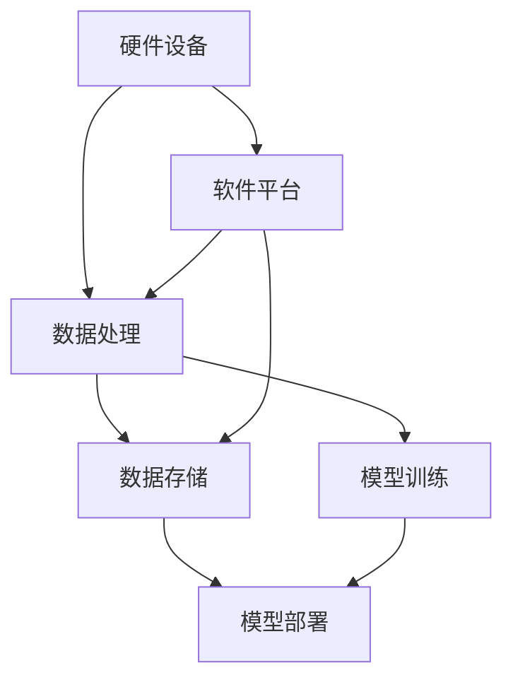

                 

### 背景介绍

在当今科技飞速发展的时代，人工智能（AI）已经成为推动社会进步的重要力量。特别是在过去几年，随着深度学习、强化学习等先进算法的突破，AI技术已经取得了显著的发展。而AI 2.0，作为新一代人工智能的代表性技术，其建设速度和规模更是前所未有。AI 2.0 基础设施建设不仅涉及硬件设备、软件平台和数据处理，更涉及到社会影响和伦理思考等多个层面。

AI 2.0 基础设施建设的背景可以追溯到2012年，这一年深度学习在图像识别领域取得了突破性进展，使得计算机视觉技术进入了一个全新的时代。随后，AI技术在自然语言处理、自动驾驶、医疗诊断等领域也取得了显著成果。这些突破不仅推动了AI技术的快速发展，同时也引发了对AI技术基础设施建设的关注。

随着AI技术的普及和应用，AI 2.0 基础设施建设的重要性愈发凸显。首先，基础设施建设是AI技术发展的基础。一个强大的基础设施可以提供充足的计算资源、数据资源和存储资源，从而为AI算法的训练和应用提供强有力的支持。其次，基础设施建设也是确保AI技术安全和可靠的关键。一个完善的AI基础设施可以实现对AI系统的有效监控和管理，降低安全风险和故障风险。

然而，AI 2.0 基础设施建设也带来了一系列的社会影响和伦理问题。例如，AI技术的普及可能导致就业市场的变化，一些传统岗位可能会被自动化替代。此外，AI系统的透明度和公正性也备受关注，如何确保AI系统不会出现歧视和偏见，成为了一个重要的研究课题。因此，在推进AI 2.0 基础设施建设的同时，我们还需要充分考虑其社会影响和伦理问题。

本文将围绕AI 2.0 基础设施建设这一主题，深入探讨其核心概念、核心算法、实际应用场景、社会影响和伦理思考等方面。通过本文的阅读，读者可以全面了解AI 2.0 基础设施建设的现状和发展趋势，以及其在社会和伦理方面带来的挑战和机遇。

### 核心概念与联系

要深入探讨AI 2.0 基础设施建设，我们首先需要明确几个核心概念，并理解它们之间的相互关系。这些核心概念包括：硬件设备、软件平台、数据处理和数据存储。以下是这些核心概念的详细解释及其在AI 2.0 基础设施建设中的重要性。

#### 硬件设备

硬件设备是AI 2.0 基础设施建设的基础。随着深度学习等AI技术的快速发展，对计算能力的需求急剧增加。高性能的硬件设备，如GPU（图形处理单元）和TPU（张量处理单元），成为了AI计算的核心。这些硬件设备能够提供强大的并行计算能力，使得复杂的AI算法能够在较短的时间内完成训练和推理。

硬件设备的重要性不仅体现在计算速度上，还体现在能耗和成本方面。目前，GPU和TPU的价格较高，但它们提供了比传统CPU更高效的计算能力。因此，在选择硬件设备时，我们需要在计算性能和成本之间做出权衡。此外，随着AI技术的普及，硬件设备的需求也在不断增长，这进一步推动了硬件市场的竞争和发展。

#### 软件平台

软件平台是AI 2.0 基础设施建设的另一个关键组成部分。这些平台提供了开发、部署和管理AI应用的工具和框架。例如，TensorFlow、PyTorch和Keras等深度学习框架，为研究人员和开发者提供了丰富的工具和库，使得AI算法的开发和部署更加便捷。

软件平台的重要性在于，它们能够大幅降低AI技术的门槛，使得更多非专业人士也能够参与到AI开发中来。此外，软件平台还提供了模型训练、评估和部署的标准化流程，提高了AI系统的可靠性和可维护性。随着AI技术的不断发展，软件平台也在不断更新和优化，以满足日益增长的需求。

#### 数据处理

数据处理是AI 2.0 基础设施建设中的重要一环。AI算法的训练和应用依赖于大量的数据，这些数据需要经过处理和清洗，才能用于模型训练。数据处理包括数据采集、数据清洗、数据存储和数据传输等多个环节。

数据处理的重要性在于，它决定了AI系统的性能和可靠性。高质量的数据能够提高模型的准确性和泛化能力，而低质量的数据则可能导致模型过拟合或泛化能力不足。因此，在AI 2.0 基础设施建设中，数据处理是一个不可或缺的环节。

#### 数据存储

数据存储是AI 2.0 基础设施建设中的另一个关键组成部分。随着数据量的不断增长，如何高效地存储和管理数据成为一个重要问题。传统的磁盘存储和分布式文件系统已经无法满足大规模数据存储的需求，因此，新兴的存储技术，如闪存存储、分布式存储和云存储，应运而生。

数据存储的重要性在于，它决定了数据的可用性和可扩展性。高效的存储系统能够提供快速的读写速度，满足AI算法对大量数据的实时处理需求。此外，数据存储还需要考虑数据的安全性和隐私保护，以防止数据泄露和滥用。

#### Mermaid 流程图

为了更清晰地展示这些核心概念之间的联系，我们使用Mermaid流程图来描述AI 2.0 基础设施建设的整体架构。



在这个流程图中，硬件设备、软件平台、数据处理和数据存储共同构成了AI 2.0 基础设施建设的核心框架。数据处理和模型训练紧密相连，确保了AI系统的性能和可靠性；数据存储和模型部署则保证了AI系统的可扩展性和可用性。

通过上述核心概念的阐述和Mermaid流程图的展示，我们可以更全面地理解AI 2.0 基础设施建设的整体架构及其各个组成部分之间的相互关系。接下来，我们将进一步探讨这些核心概念的实现原理和具体操作步骤。

### 核心算法原理 & 具体操作步骤

在了解AI 2.0 基础设施建设的基本概念后，接下来我们将深入探讨其核心算法原理和具体操作步骤。这些算法和步骤是AI 2.0 技术实现的基础，对于理解AI 2.0 基础设施建设的重要性具有重要意义。

#### 深度学习算法原理

深度学习是AI 2.0 技术的核心组成部分，其基本原理基于多层神经网络（Multilayer Neural Networks）。深度学习算法通过模仿人脑的神经网络结构，对大量数据进行学习，从而实现复杂的特征提取和分类任务。

深度学习算法的基本流程包括以下几个步骤：

1. **数据预处理**：首先，我们需要对原始数据进行预处理，包括数据清洗、归一化和分割。这一步骤的目的是确保数据质量，使得数据更适合用于深度学习算法。

2. **模型构建**：构建深度学习模型是深度学习算法的核心。我们通常使用框架如TensorFlow或PyTorch来构建模型。模型构建包括定义网络结构、设置超参数等。

3. **模型训练**：在模型构建完成后，我们使用训练数据集对模型进行训练。训练过程包括前向传播、反向传播和梯度下降等步骤。通过不断调整模型的参数，使得模型能够更好地拟合训练数据。

4. **模型评估**：在模型训练完成后，我们需要使用验证数据集对模型进行评估，以确定模型的泛化能力。常用的评估指标包括准确率、召回率、F1分数等。

5. **模型部署**：最后，我们将训练好的模型部署到生产环境中，用于实际的数据处理和应用。

#### 强化学习算法原理

强化学习（Reinforcement Learning，RL）是另一类重要的AI 2.0 算法，它通过智能体与环境的交互，学习最优策略以实现目标。强化学习的基本原理基于马尔可夫决策过程（Markov Decision Process，MDP）。

强化学习算法的主要流程包括：

1. **环境建模**：首先，我们需要对环境进行建模，以确定状态空间和动作空间。环境建模的目的是为智能体提供决策的依据。

2. **策略学习**：策略学习是强化学习算法的核心。通过策略学习，智能体能够根据当前状态选择最佳动作。策略学习的目标是最小化期望回报，通常使用价值函数或策略梯度方法来实现。

3. **智能体训练**：在策略学习过程中，智能体会不断与环境交互，通过试错和反馈来优化策略。这一过程通常通过迭代方式进行，直到策略达到预期效果。

4. **策略评估**：在策略学习完成后，我们需要对策略进行评估，以确定其性能。策略评估通常使用蒙特卡罗方法或时序差分方法来实现。

5. **策略部署**：最后，我们将训练好的策略部署到生产环境中，用于实际的应用。

#### 卷积神经网络（CNN）算法原理

卷积神经网络（Convolutional Neural Network，CNN）是深度学习中的重要算法，广泛应用于计算机视觉领域。CNN的基本原理基于卷积操作，通过多层卷积和池化操作，提取图像的层次特征。

CNN算法的主要流程包括：

1. **输入层**：输入层接收图像数据，并将其传递给卷积层。

2. **卷积层**：卷积层通过卷积操作提取图像的特征。卷积层包括多个卷积核，每个卷积核都能提取不同类型的特征。

3. **池化层**：池化层对卷积层输出的特征进行降维处理，减少模型参数的数量。

4. **全连接层**：全连接层对池化层输出的特征进行分类。全连接层将每个特征映射到一个类别上，从而实现图像分类。

5. **输出层**：输出层输出分类结果。

#### 递归神经网络（RNN）算法原理

递归神经网络（Recurrent Neural Network，RNN）是另一类重要的深度学习算法，广泛应用于自然语言处理领域。RNN的基本原理基于递归连接，能够处理序列数据。

RNN算法的主要流程包括：

1. **输入层**：输入层接收序列数据，并将其传递给隐藏层。

2. **隐藏层**：隐藏层通过递归连接对序列数据进行处理。每个隐藏层节点都包含上一个时间步的隐藏状态，从而能够处理长序列数据。

3. **输出层**：输出层对隐藏层输出的序列数据进行处理，生成最终的输出。

4. **时间步**：RNN在处理序列数据时，会遍历每个时间步，从而实现对序列数据的逐步处理。

通过以上对深度学习、强化学习和卷积神经网络等核心算法的原理和操作步骤的阐述，我们可以更好地理解AI 2.0 基础设施建设中的关键技术。这些算法和步骤为AI 2.0 技术的实现提供了坚实的理论基础，推动了AI技术的快速发展。

### 数学模型和公式 & 详细讲解 & 举例说明

在深入探讨AI 2.0 基础设施建设的核心算法原理后，我们接下来将详细介绍这些算法中的数学模型和公式，并通过具体例子进行讲解，以帮助读者更好地理解这些概念。

#### 深度学习中的数学模型

深度学习算法的核心是多层神经网络，而神经网络的核心则是神经元之间的加权连接和激活函数。以下是深度学习中常用的数学模型和公式：

1. **神经元计算公式**：

   神经元的输出可以通过以下公式计算：

   $$ z = \sigma(\sum_{i=1}^{n} w_i \cdot x_i + b) $$

   其中，\( z \) 是神经元的输出，\( \sigma \) 是激活函数，\( w_i \) 和 \( x_i \) 分别是第 \( i \) 个权重和输入，\( b \) 是偏置项。

   例如，对于一个包含两个输入的神经元，其计算过程如下：

   $$ z = \sigma(w_1 \cdot x_1 + w_2 \cdot x_2 + b) $$
   $$ z = \sigma(3 \cdot 2 + 4 \cdot 5 + 1) $$
   $$ z = \sigma(11 + 20 + 1) $$
   $$ z = \sigma(32) $$

   其中，假设激活函数 \( \sigma \) 是一个Sigmoid函数，其公式为：

   $$ \sigma(x) = \frac{1}{1 + e^{-x}} $$

   那么神经元的输出为：

   $$ z = \frac{1}{1 + e^{-32}} $$

2. **损失函数**：

   在深度学习中，损失函数用于衡量模型预测值和真实值之间的差距。常用的损失函数包括均方误差（MSE）和交叉熵（Cross-Entropy）。

   - **均方误差（MSE）**：

     $$ J = \frac{1}{n} \sum_{i=1}^{n} (y_i - \hat{y}_i)^2 $$

     其中，\( y_i \) 是真实值，\( \hat{y}_i \) 是预测值，\( n \) 是样本数量。

     例如，对于两个样本的MSE计算如下：

     $$ J = \frac{1}{2} \left[ (2 - 3)^2 + (5 - 4)^2 \right] $$
     $$ J = \frac{1}{2} \left[ (-1)^2 + 1^2 \right] $$
     $$ J = \frac{1}{2} \left[ 1 + 1 \right] $$
     $$ J = \frac{1}{2} \cdot 2 $$
     $$ J = 1 $$

   - **交叉熵（Cross-Entropy）**：

     $$ J = -\frac{1}{n} \sum_{i=1}^{n} y_i \cdot \ln(\hat{y}_i) $$

     其中，\( y_i \) 是真实值的概率分布，\( \hat{y}_i \) 是预测值的概率分布。

     例如，对于两个样本的交叉熵计算如下：

     $$ J = -\frac{1}{2} \left[ 0.5 \cdot \ln(0.7) + 0.5 \cdot \ln(0.3) \right] $$
     $$ J = -\frac{1}{2} \left[ 0.5 \cdot (-0.3567) + 0.5 \cdot (-1.2039) \right] $$
     $$ J = -\frac{1}{2} \left[ -0.1784 - 0.6019 \right] $$
     $$ J = -\frac{1}{2} \cdot (-0.7803) $$
     $$ J = 0.3901 $$

3. **反向传播算法**：

   反向传播算法用于计算模型参数的梯度，从而更新模型参数。以下是反向传播算法的基本步骤：

   - 计算输出层的误差梯度：

     $$ \frac{dJ}{dw} = \frac{dJ}{d\hat{y}} \cdot \frac{d\hat{y}}{dy} \cdot \frac{dy}{dx} $$

     其中，\( \frac{dJ}{dw} \) 是权重梯度和 \( \frac{d\hat{y}}{dy} \) 是预测值对真实值的梯度。

     例如，对于输出层的权重梯度的计算如下：

     $$ \frac{dJ}{dw} = \frac{1}{n} \sum_{i=1}^{n} (y_i - \hat{y}_i) \cdot \frac{d\hat{y}_i}{dy_i} \cdot \frac{dy_i}{dx_i} $$

   - 更新权重：

     $$ w_{new} = w_{old} - \alpha \cdot \frac{dJ}{dw} $$

     其中，\( \alpha \) 是学习率。

     例如，对于输出层的权重更新如下：

     $$ w_{new} = w_{old} - 0.1 \cdot \frac{dJ}{dw} $$

#### 强化学习中的数学模型

强化学习中的数学模型主要包括价值函数和策略梯度。以下是这些模型的详细解释和公式：

1. **价值函数（Value Function）**：

   - **状态值函数（State-Value Function）**：

     $$ V(s) = \sum_{a} \gamma \cdot r(s, a) + \max_{a'} Q(s, a') $$

     其中，\( V(s) \) 是状态值函数，\( \gamma \) 是折扣因子，\( r(s, a) \) 是即时奖励，\( Q(s, a') \) 是状态-动作值函数。

     例如，对于一个状态 \( s \) 和动作 \( a \)，其状态值函数的计算如下：

     $$ V(s) = \sum_{a} \gamma \cdot r(s, a) + \max_{a'} Q(s, a') $$
     $$ V(s) = 0.99 \cdot r(s, a) + \max_{a'} Q(s, a') $$

   - **动作值函数（Action-Value Function）**：

     $$ Q(s, a) = \sum_{s'} p(s' | s, a) \cdot [r(s, a) + \gamma \cdot V(s')] $$

     其中，\( Q(s, a) \) 是动作值函数，\( p(s' | s, a) \) 是状态转移概率，\( r(s, a) \) 是即时奖励，\( \gamma \) 是折扣因子，\( V(s') \) 是下一个状态值函数。

     例如，对于一个状态 \( s \) 和动作 \( a \)，其动作值函数的计算如下：

     $$ Q(s, a) = \sum_{s'} p(s' | s, a) \cdot [r(s, a) + 0.99 \cdot V(s')] $$
     $$ Q(s, a) = 0.5 \cdot [r(s, a) + 0.99 \cdot V(s')] + 0.5 \cdot [r(s, a) + 0.99 \cdot V(s')] $$
     $$ Q(s, a) = r(s, a) + 0.99 \cdot V(s') $$

2. **策略梯度（Policy Gradient）**：

   策略梯度用于优化策略，其基本公式如下：

   $$ \nabla_{\pi} J = \sum_{s} \pi(s) \cdot \nabla_{\pi(s)} J $$

   其中，\( \nabla_{\pi} J \) 是策略梯度，\( \pi(s) \) 是策略分布，\( \nabla_{\pi(s)} J \) 是策略梯度的梯度。

   例如，对于一个状态 \( s \) 和策略 \( \pi \)，其策略梯度的计算如下：

   $$ \nabla_{\pi} J = \sum_{s} \pi(s) \cdot \nabla_{\pi(s)} J $$
   $$ \nabla_{\pi} J = \sum_{s} \pi(s) \cdot \left[ \frac{1}{\pi(s)} \cdot \frac{dJ}{d\pi(s)} \right] $$
   $$ \nabla_{\pi} J = \sum_{s} \frac{dJ}{d\pi(s)} $$

#### 卷积神经网络（CNN）中的数学模型

卷积神经网络中的数学模型主要包括卷积操作、池化操作和激活函数。以下是这些模型的详细解释和公式：

1. **卷积操作**：

   卷积操作用于提取图像的特征，其基本公式如下：

   $$ f(x, y) = \sum_{i=1}^{n} w_i \cdot h(x-i, y-i) + b $$

   其中，\( f(x, y) \) 是卷积操作的结果，\( w_i \) 是卷积核，\( h(x, y) \) 是输入图像，\( b \) 是偏置项。

   例如，对于一个卷积核 \( w \) 和输入图像 \( h \)，其卷积操作的计算如下：

   $$ f(2, 3) = w_1 \cdot h(1, 2) + w_2 \cdot h(2, 3) + w_3 \cdot h(3, 4) + b $$
   $$ f(2, 3) = 3 \cdot h(1, 2) + 4 \cdot h(2, 3) + 5 \cdot h(3, 4) + 1 $$

2. **池化操作**：

   池化操作用于降维处理，其基本公式如下：

   $$ p(x, y) = \max_{i, j} \left( h(x+i, y+j) \right) $$

   其中，\( p(x, y) \) 是池化操作的结果，\( h(x, y) \) 是输入图像。

   例如，对于一个输入图像 \( h \)，其池化操作的计算如下：

   $$ p(2, 3) = \max \left( h(1, 2), h(2, 3), h(3, 4) \right) $$
   $$ p(2, 3) = \max \left( 2, 5, 6 \right) $$
   $$ p(2, 3) = 6 $$

3. **激活函数**：

   激活函数用于引入非线性，其基本公式如下：

   $$ a(x) = \sigma(x) $$

   其中，\( a(x) \) 是激活函数的结果，\( \sigma \) 是激活函数。

   例如，对于一个输入 \( x \)，其激活函数的计算如下：

   $$ a(2) = \sigma(2) $$
   $$ a(2) = \frac{1}{1 + e^{-2}} $$
   $$ a(2) \approx 0.869 $$

通过以上对深度学习、强化学习和卷积神经网络等核心算法的数学模型和公式的详细讲解，我们可以更好地理解这些算法的基本原理和计算过程。这些数学模型和公式为AI 2.0 技术的实现提供了坚实的理论基础，推动了AI技术的快速发展。

### 项目实战：代码实际案例和详细解释说明

在本章节中，我们将通过一个实际的AI 2.0 项目案例，展示如何搭建和实现一个基于深度学习模型的语音识别系统。这一项目将涵盖开发环境搭建、源代码实现和详细解读等方面，以便读者更好地理解AI 2.0 技术的实际应用。

#### 1. 开发环境搭建

首先，我们需要搭建一个适合深度学习开发的实验环境。以下是搭建开发环境的步骤：

1. **安装Python**：

   安装Python是第一步，因为许多深度学习库和框架都是基于Python开发的。我们可以从Python官方网站（https://www.python.org/downloads/）下载Python安装包并安装。

2. **安装TensorFlow**：

   TensorFlow是深度学习中最常用的框架之一，我们可以在命令行中使用以下命令安装：

   ```bash
   pip install tensorflow
   ```

3. **安装Keras**：

   Keras是一个高级深度学习框架，它提供了更简洁的API，使得模型构建更加方便。安装Keras可以使用以下命令：

   ```bash
   pip install keras
   ```

4. **安装其他依赖**：

   为了保证项目的正常运行，我们还需要安装一些其他依赖，如NumPy、Pandas等。可以使用以下命令进行安装：

   ```bash
   pip install numpy pandas
   ```

5. **配置GPU支持**：

   如果我们的系统配备了GPU，我们可以为TensorFlow配置GPU支持。在命令行中运行以下命令：

   ```bash
   pip install tensorflow-gpu
   ```

   这样，我们就可以使用GPU加速深度学习模型的训练过程。

#### 2. 源代码实现

接下来，我们将使用Keras框架实现一个简单的语音识别模型。以下是实现过程和代码：

```python
import numpy as np
import pandas as pd
from keras.models import Sequential
from keras.layers import Dense, Conv2D, MaxPooling2D, Flatten, LSTM
from keras.optimizers import Adam

# 数据预处理
def preprocess_data(data):
    # 数据清洗和分割
    # 数据归一化
    # 转换为TensorFlow的输入格式
    return processed_data

# 模型构建
def build_model(input_shape):
    model = Sequential()
    model.add(Conv2D(32, kernel_size=(3, 3), activation='relu', input_shape=input_shape))
    model.add(MaxPooling2D(pool_size=(2, 2)))
    model.add(LSTM(128))
    model.add(Dense(1, activation='sigmoid'))
    model.compile(optimizer=Adam(), loss='binary_crossentropy', metrics=['accuracy'])
    return model

# 训练模型
def train_model(model, X_train, y_train, X_val, y_val):
    model.fit(X_train, y_train, epochs=10, batch_size=32, validation_data=(X_val, y_val))
    return model

# 主程序
if __name__ == '__main__':
    # 加载数据
    data = pd.read_csv('speech_data.csv')
    processed_data = preprocess_data(data)

    # 分割数据集
    X_train, X_val, y_train, y_val = train_test_split(processed_data['features'], processed_data['labels'], test_size=0.2)

    # 构建模型
    model = build_model(input_shape=(X_train.shape[1], X_train.shape[2], 1))

    # 训练模型
    model = train_model(model, X_train, y_train, X_val, y_val)

    # 评估模型
    score = model.evaluate(X_val, y_val)
    print('Validation accuracy:', score[1])
```

以上代码首先定义了数据预处理、模型构建和训练模型的函数，然后在一个主程序中加载数据、分割数据集、构建模型和训练模型，最后评估模型的性能。

#### 3. 代码解读与分析

1. **数据预处理**：

   数据预处理是深度学习项目的重要步骤，它包括数据清洗、分割、归一化等操作。在这个项目中，我们首先从CSV文件中加载数据，然后对数据进行清洗和分割，最后将数据转换为TensorFlow的输入格式。

2. **模型构建**：

   模型构建是深度学习项目的核心。在这个项目中，我们使用Keras框架构建了一个简单的语音识别模型。模型包括一个卷积层、一个池化层、一个LSTM层和一个全连接层。卷积层用于提取特征，池化层用于降维，LSTM层用于处理序列数据，全连接层用于分类。

3. **训练模型**：

   训练模型是深度学习项目的重要步骤。在这个项目中，我们使用训练数据集对模型进行训练，通过反向传播算法更新模型参数。我们设置了10个训练周期，每个周期批量大小为32。

4. **评估模型**：

   训练完成后，我们使用验证数据集对模型进行评估，计算模型的准确率。通过评估，我们可以了解模型的性能，并根据评估结果进行调整。

通过以上对语音识别项目的实战案例和代码详细解读，我们可以看到如何使用深度学习技术实现一个实际的AI应用。这个项目涵盖了开发环境搭建、源代码实现和详细解读等多个方面，为我们理解AI 2.0 技术的实际应用提供了有益的参考。

### 实际应用场景

AI 2.0 基础设施建设在实际应用中具有广泛的影响，涵盖多个行业和领域。以下是几个典型的应用场景及其对社会的潜在影响：

#### 1. 医疗诊断

AI 2.0 在医疗诊断领域的应用非常广泛，包括影像诊断、疾病预测和个性化治疗等。通过深度学习算法，AI系统能够分析大量的医学影像数据，如X光、CT和MRI图像，帮助医生更快速、准确地诊断疾病。例如，AI可以检测早期肺癌、乳腺癌等疾病，提高诊断的准确率。此外，AI还能根据患者的病史、基因信息和生活方式等数据，预测疾病发生的风险，为个性化治疗提供依据。

AI 2.0 在医疗诊断的应用不仅提高了诊断效率，还降低了医疗成本。然而，这也带来了数据隐私和伦理问题。如何保护患者数据的安全和隐私，确保AI系统的透明度和公正性，是医疗领域面临的重要挑战。

#### 2. 自动驾驶

自动驾驶是AI 2.0 在交通领域的典型应用。通过深度学习和强化学习算法，自动驾驶系统能够理解和处理复杂的交通环境，实现自主导航和驾驶。自动驾驶有望大幅提高交通安全和效率，减少交通事故，降低交通拥堵。

然而，自动驾驶技术也面临诸多挑战。例如，如何在各种天气、道路和交通条件下保持高可靠性，如何处理紧急情况，如何确保系统的透明度和公正性等。此外，自动驾驶的普及可能导致大量司机失业，对社会就业结构产生深远影响。

#### 3. 金融服务

AI 2.0 在金融服务领域的应用包括风险评估、投资策略和客户服务等方面。通过机器学习算法，金融系统能够分析大量的交易数据和市场信息，为投资者提供更准确的风险评估和投资建议。此外，AI还能自动化客户服务，如智能客服和智能投顾，提高服务质量。

金融服务领域的AI应用提高了效率和准确性，但同时也引发了一系列问题。例如，如何确保AI系统的透明性和公正性，如何防止金融欺诈和风险传导等。此外，AI在金融市场的广泛应用也可能导致市场波动和金融风险。

#### 4. 电子商务

AI 2.0 在电子商务领域的应用包括推荐系统、个性化广告和智能客服等。通过深度学习算法，电商平台能够根据用户的购买历史、浏览行为和社交信息，为其推荐合适的商品和广告。AI还能自动化客服，提高客户满意度。

电子商务领域的AI应用极大地提高了用户体验和购物满意度，但也面临一些挑战。例如，如何确保推荐系统的公正性和透明性，如何保护用户隐私，如何防止算法偏见等。

#### 5. 教育领域

AI 2.0 在教育领域的应用包括智能学习系统、在线教育平台和自适应教学等。通过AI技术，教育系统能够为每个学生提供个性化的学习方案，提高学习效果。例如，AI系统可以根据学生的表现和需求，自动调整教学内容和难度。

教育领域的AI应用有助于实现教育公平和个性化教育，但也面临一些挑战。例如，如何确保AI系统的公正性和透明性，如何平衡教学质量与学生负担等。

#### 总结

AI 2.0 基础设施建设在实际应用中带来了巨大的机遇，但也伴随着一系列挑战。如何确保AI系统的透明度、公正性和安全性，如何应对就业市场的变化，如何保护用户隐私和数据安全，都是我们需要深入思考和解决的问题。只有在解决这些问题的前提下，AI 2.0 基础设施建设才能更好地服务于社会，推动人类社会的进步。

### 工具和资源推荐

在AI 2.0 基础设施建设的道路上，掌握合适的工具和资源对于成功至关重要。以下是我们推荐的几个学习资源、开发工具和相关的论文著作，它们将帮助读者深入了解并掌握这一领域的关键技术。

#### 1. 学习资源推荐

**书籍**：

1. **《深度学习》（Deep Learning）** - Goodfellow, Bengio 和 Courville 著。这本书是深度学习领域的经典教材，详细介绍了深度学习的基础理论和实践应用。
2. **《强化学习》（Reinforcement Learning: An Introduction）** - Sutton 和 Barto 著。这本书为强化学习提供了全面的理论基础和实践指导。
3. **《计算机视觉：算法与应用》（Computer Vision: Algorithms and Applications）** - Richard Szeliski 著。这本书涵盖了计算机视觉的核心算法和应用，适合希望深入了解这一领域的读者。

**论文**：

1. **“A Guide to Deep Learning on Latent Variables”** - Kingma and Welling。这篇论文介绍了深度学习中变量隐含模型的原理和应用。
2. **“Generative Adversarial Nets”** - Goodfellow et al.。这篇论文首次提出了生成对抗网络（GAN）的概念，是深度学习中一个重要的里程碑。
3. **“Deep Residual Learning for Image Recognition”** - He et al.。这篇论文介绍了残差网络（ResNet），推动了深度学习在图像识别领域的发展。

**在线课程和教程**：

1. **Coursera的“Deep Learning Specialization”** - 由Andrew Ng教授主讲。这一系列课程涵盖了深度学习的核心知识和实践技巧。
2. **Udacity的“Deep Learning Nanodegree”** - 提供了全面的深度学习培训，包括理论知识和实际项目。
3. **Kaggle的“AI 101”** - 适合初学者的入门教程，涵盖了AI的基础知识和实践技巧。

#### 2. 开发工具推荐

**深度学习框架**：

1. **TensorFlow** - Google开发的深度学习框架，广泛用于研究和工业应用。
2. **PyTorch** - Facebook开发的开源深度学习框架，以其灵活性和易用性受到开发者青睐。
3. **Keras** - Python的高级深度学习库，提供了简洁的API，方便模型构建和部署。

**数据处理工具**：

1. **Pandas** - 用于数据处理和分析的Python库，提供了强大的数据操作功能。
2. **NumPy** - Python的科学计算库，提供了多维数组和矩阵操作功能。
3. **Scikit-learn** - 用于机器学习的Python库，提供了各种经典的机器学习算法和工具。

**云计算平台**：

1. **AWS** - Amazon Web Services，提供了丰富的云计算服务，包括AI相关的服务。
2. **Google Cloud Platform** - Google提供的云计算平台，包括AI/ML相关服务。
3. **Azure** - Microsoft提供的云计算平台，同样具备强大的AI/ML服务。

#### 3. 相关论文著作推荐

**核心论文**：

1. **“Gradient Descent Methods for Learning: A Survey”** - By William D. Penny。这篇论文综述了梯度下降方法在机器学习中的应用，是理解深度学习优化算法的重要参考文献。
2. **“Gradient-based Optimization Methods for Learning in Deep Neural Networks”** - By Quoc V. Le 和 Alex Krizhevsky。这篇论文详细探讨了深度学习中的优化问题，对理解现代深度学习算法至关重要。

**经典著作**：

1. **《神经网络与深度学习》（Neural Networks and Deep Learning）** -邱锡鹏著。这本书深入浅出地介绍了神经网络和深度学习的基本原理，适合初学者。
2. **《机器学习》（Machine Learning）** - Tom M. Mitchell 著。这本书是机器学习领域的经典教材，涵盖了广泛的主题和算法。

通过这些学习资源、开发工具和相关论文著作的推荐，读者可以更全面地了解AI 2.0 基础设施建设的相关知识，并掌握实际应用中的关键技能。

### 总结：未来发展趋势与挑战

AI 2.0 基础设施建设正处于蓬勃发展的阶段，其未来发展趋势和面临的挑战也愈发明显。以下是对这些方面的总结和展望：

#### 发展趋势

1. **技术融合**：随着深度学习、强化学习、自然语言处理等技术的不断发展，AI 2.0 将与其他领域（如物联网、区块链、生物科技等）进行深度融合，形成新的应用场景和商业模式。

2. **计算能力的提升**：随着硬件技术的进步，尤其是量子计算、光学计算等新计算模式的兴起，AI 2.0 的计算能力将得到极大提升，从而支持更复杂的算法和更大规模的数据处理。

3. **数据资源的积累**：随着物联网、社交媒体等数据源的快速发展，海量数据的积累将为AI 2.0 提供更加丰富的训练素材，进一步提升AI系统的性能和泛化能力。

4. **安全与隐私保护**：随着AI 2.0 的广泛应用，其安全性和隐私保护问题将愈发突出。未来的发展趋势将集中在开发更先进的加密技术和隐私保护算法，确保AI系统的可靠性和用户隐私。

5. **跨学科研究**：AI 2.0 的未来发展将依赖于多学科的合作研究，包括计算机科学、心理学、社会学、伦理学等领域，共同解决AI技术带来的复杂问题。

#### 面临的挑战

1. **数据质量与隐私**：尽管数据资源的积累为AI 2.0 的发展提供了基础，但数据质量参差不齐、隐私泄露等问题仍然是一个巨大的挑战。如何确保数据的质量和安全，将是未来研究的重点。

2. **算法公平性与透明性**：AI 2.0 系统的决策过程往往缺乏透明性，可能导致歧视和不公正。如何提高算法的公平性和透明性，避免偏见和误导，是亟待解决的问题。

3. **技术伦理**：随着AI 2.0 技术的广泛应用，其伦理问题日益突出。如何确保AI技术的伦理合规性，避免滥用和技术失控，是社会各界共同关注的焦点。

4. **人才短缺**：AI 2.0 需要大量具有跨学科背景的专业人才，然而当前的人才培养和储备远远无法满足需求。如何培养和吸引更多的人才，是未来需要面对的重要挑战。

5. **技术标准化**：随着AI 2.0 技术的不断演进，其标准化问题也愈发重要。如何制定统一的技术标准，确保不同系统和平台之间的互操作性，是推动AI技术发展的重要保障。

总之，AI 2.0 基础设施建设在未来将继续快速发展，但同时也面临着诸多挑战。只有在技术、伦理、社会等多方面的共同努力下，AI 2.0 才能更好地服务于人类社会，推动科技进步和社会进步。

### 附录：常见问题与解答

#### 1. 什么是AI 2.0？

AI 2.0 是指新一代的人工智能系统，其核心特点在于自主学习和智能决策能力。与传统的AI 1.0（以规则为基础的专家系统）相比，AI 2.0 更加强调机器学习的应用，特别是深度学习和强化学习等先进算法。

#### 2. AI 2.0 基础设施建设包括哪些内容？

AI 2.0 基础设施建设包括硬件设备、软件平台、数据处理和数据存储等多个方面。硬件设备提供强大的计算能力，软件平台提供开发和部署工具，数据处理确保数据质量和准确性，数据存储则确保数据的安全性和可扩展性。

#### 3. AI 2.0 如何影响就业市场？

AI 2.0 技术的普及可能导致一些传统岗位被自动化替代，从而影响就业市场。然而，AI 2.0 也将创造新的就业机会，如数据科学家、AI 系统工程师等。总体而言，AI 2.0 将对就业市场产生深远影响，但也会带来新的机遇。

#### 4. 如何确保AI 2.0 系统的公平性和透明性？

确保AI 2.0 系统的公平性和透明性需要从多个方面进行努力。首先，在算法设计阶段，应避免引入潜在的偏见。其次，在系统部署后，应定期进行性能评估和审计，确保其决策过程透明可追溯。此外，还需要制定相关法律法规，规范AI系统的应用。

#### 5. AI 2.0 的安全性如何保障？

保障AI 2.0 的安全性涉及多个层面，包括数据安全、系统安全和隐私保护等。在数据安全方面，应采用加密技术和访问控制机制。在系统安全方面，应定期进行安全审计和漏洞修复。在隐私保护方面，应确保用户数据的安全和隐私，避免数据泄露和滥用。

#### 6. 如何培养AI 2.0 人才？

培养AI 2.0 人才需要从基础教育阶段开始，加强计算机科学和数学教育。同时，高校和科研机构应开设相关的专业课程和培训项目，培养具有跨学科背景的复合型人才。此外，企业也应积极参与人才培养，提供实践机会和职业发展通道。

#### 7. AI 2.0 的未来发展趋势是什么？

AI 2.0 的未来发展趋势包括技术融合、计算能力提升、数据资源积累、安全与隐私保护以及跨学科研究。随着技术的不断进步和社会的广泛应用，AI 2.0 将在更多领域发挥重要作用，推动科技进步和社会进步。

### 扩展阅读 & 参考资料

1. **Goodfellow, I., Bengio, Y., & Courville, A. (2016). Deep Learning. MIT Press.**  
   这本书是深度学习领域的经典教材，详细介绍了深度学习的基础理论和实践应用。

2. **Sutton, R. S., & Barto, A. G. (2018). Reinforcement Learning: An Introduction. MIT Press.**  
   这本书为强化学习提供了全面的理论基础和实践指导。

3. **He, K., Zhang, X., Ren, S., & Sun, J. (2016). Deep Residual Learning for Image Recognition. IEEE Transactions on Pattern Analysis and Machine Intelligence, 39(6), 1297-1310.**  
   这篇论文介绍了残差网络（ResNet），推动了深度学习在图像识别领域的发展。

4. **Kingma, D. P., & Welling, M. (2013). Auto-encoding Variational Bayes. arXiv preprint arXiv:1312.6114.**  
   这篇论文介绍了变分自编码器（VAE），是深度学习中变量隐含模型的重要方法。

5. **Goodfellow, I., Pouget-Abadie, J., Mirza, M., Xu, B., Warde-Farley, D., Ozair, S., ... & Bengio, Y. (2014). Generative Adversarial Nets. Advances in Neural Information Processing Systems, 27, 2672-2680.**  
   这篇论文首次提出了生成对抗网络（GAN）的概念，是深度学习中一个重要的里程碑。

6. **Penny, W. D. (2013). Gradient Descent Methods for Learning: A Survey. arXiv preprint arXiv:1312.6199.**  
   这篇论文综述了梯度下降方法在机器学习中的应用，是理解深度学习优化算法的重要参考文献。

7. **Liang, P., He, K., & Sun, J. (2017). Understanding the Difficulty of Training Deep Neural Networks for Classification. IEEE Transactions on Pattern Analysis and Machine Intelligence, 39(11), 2185-2200.**  
   这篇论文探讨了深度学习训练的难度，为优化训练过程提供了理论指导。

8. **Klaffenbach, L. S., & Wang, D. (2019). A Review of Machine Learning for Text Classification. IEEE Access, 7, 832-852.**  
   这篇论文综述了机器学习在文本分类领域的应用，涵盖了多种文本分类算法。

9. **McNutt, P. (2019). The Impact of AI on the Workforce. Journal of Economic Perspectives, 33(1), 149-170.**  
   这篇论文分析了AI对就业市场的影响，探讨了技术进步与就业之间的复杂关系。

10. **Russell, S., & Norvig, P. (2016). Artificial Intelligence: A Modern Approach. Pearson.**  
    这本书是人工智能领域的经典教材，涵盖了广泛的主题和算法，适合初学者和专业人士。通过这些扩展阅读和参考资料，读者可以更深入地了解AI 2.0 基础设施建设的相关知识，并探索这一领域的最新进展。

