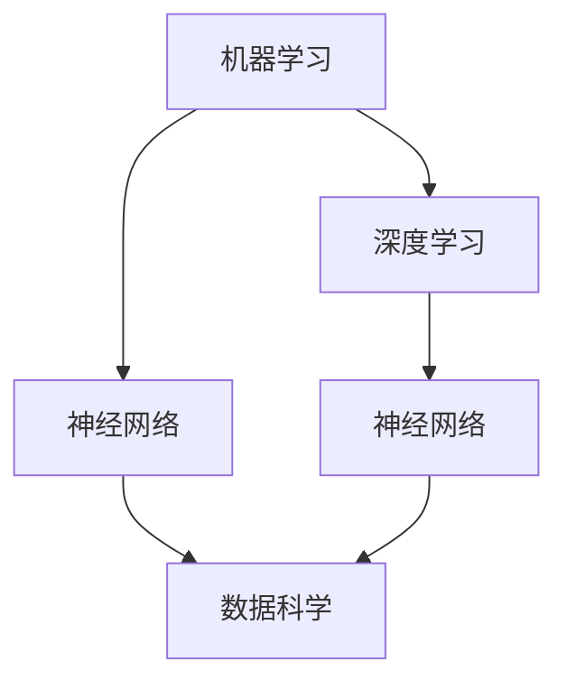

                 

# AI 2.0 时代的机器学习

## 关键词：AI 2.0、机器学习、深度学习、神经网络、人工智能、数据科学、算法优化

### 摘要

本文旨在探讨 AI 2.0 时代的机器学习，重点关注其核心概念、算法原理、数学模型及应用场景。通过对当前技术的深入分析，我们将揭示 AI 2.0 的潜力与挑战，并展望其未来的发展趋势。

## 1. 背景介绍

随着互联网和大数据技术的飞速发展，人工智能（AI）已经成为推动科技进步的重要力量。从最初的 AI 1.0 时代（基于规则的系统）到 AI 2.0 时代（基于数据的机器学习），人工智能经历了巨大的变革。AI 2.0 时代以深度学习和神经网络为核心，实现了在图像识别、语音识别、自然语言处理等领域的突破性进展。

### 1.1 AI 1.0 时代

AI 1.0 时代的主要特点是基于规则的系统，即通过预设规则来实现对问题的求解。这种方法的局限性在于，当问题变得复杂时，规则的规模和复杂性会迅速增加，导致系统难以维护和扩展。

### 1.2 AI 2.0 时代

AI 2.0 时代以机器学习为核心，通过从数据中学习规律来实现智能。这一转变带来了以下几个方面的优势：

- **更强的自适应能力**：机器学习系统能够自动从数据中学习，提高系统在复杂环境中的适应能力。
- **更广泛的应用领域**：机器学习在图像识别、语音识别、自然语言处理等领域的成功应用，极大地拓展了人工智能的应用范围。
- **更高的准确度**：通过大规模数据训练，机器学习系统能够获得更高的准确度和可靠性。

## 2. 核心概念与联系

在 AI 2.0 时代，机器学习、深度学习、神经网络等核心概念紧密相连，构成了人工智能的技术基础。下面是这些核心概念的简要介绍及其相互关系。

### 2.1 机器学习

机器学习是一种让计算机从数据中自动学习规律和模式的方法。其核心思想是通过训练过程，使计算机学会对未知数据进行预测或分类。

### 2.2 深度学习

深度学习是机器学习的一个子领域，通过构建多层神经网络来实现对复杂数据的处理。深度学习在图像识别、语音识别等领域取得了显著成果。

### 2.3 神经网络

神经网络是一种模仿生物神经元连接方式的计算模型，是深度学习的基础。通过层层传递信息，神经网络能够自动提取数据中的特征。

### 2.4 数据科学

数据科学是机器学习的基础，涉及数据收集、数据清洗、数据预处理、模型评估等多个环节。数据科学为机器学习提供了高质量的数据支持。

### 2.5 Mermaid 流程图

下面是一个简单的 Mermaid 流程图，展示了机器学习、深度学习、神经网络和数据科学之间的联系。



## 3. 核心算法原理 & 具体操作步骤

在 AI 2.0 时代，机器学习算法的核心是深度学习。下面将介绍深度学习的基本原理和具体操作步骤。

### 3.1 深度学习基本原理

深度学习是一种通过多层神经网络来模拟人脑神经元连接方式的计算模型。其基本原理包括以下几个方面：

- **输入层**：接收输入数据，并将其传递给下一层。
- **隐藏层**：对输入数据进行特征提取和变换，形成更加抽象的特征。
- **输出层**：根据隐藏层的结果，生成输出预测结果。

### 3.2 具体操作步骤

深度学习的具体操作步骤如下：

1. **数据收集与预处理**：收集大量的数据，并进行清洗、归一化等预处理操作。
2. **构建神经网络模型**：根据问题需求，选择合适的神经网络结构，包括输入层、隐藏层和输出层。
3. **模型训练**：通过梯度下降等优化算法，调整网络参数，使模型能够准确预测输出。
4. **模型评估与优化**：通过交叉验证、测试集等手段，评估模型性能，并进一步优化模型。

### 3.3 梯度下降法

梯度下降法是深度学习中最常用的优化算法。其基本思想是通过计算损失函数关于模型参数的梯度，来更新模型参数，从而降低损失函数值。

具体步骤如下：

1. **初始化参数**：随机初始化模型参数。
2. **计算损失函数**：根据当前参数计算损失函数值。
3. **计算梯度**：根据损失函数关于参数的梯度，计算参数的更新方向。
4. **更新参数**：根据梯度方向和步长，更新模型参数。
5. **迭代优化**：重复步骤 2-4，直至满足收敛条件。

## 4. 数学模型和公式 & 详细讲解 & 举例说明

在深度学习中，数学模型和公式起着至关重要的作用。下面将介绍一些常用的数学模型和公式，并进行详细讲解和举例说明。

### 4.1 损失函数

损失函数是深度学习中评估模型性能的关键指标。常见的损失函数包括均方误差（MSE）、交叉熵损失等。

- **均方误差（MSE）**：

  $$MSE = \frac{1}{n}\sum_{i=1}^{n}(y_i - \hat{y}_i)^2$$

  其中，$y_i$ 为真实标签，$\hat{y}_i$ 为预测标签。

- **交叉熵损失**：

  $$H(y, \hat{y}) = -\sum_{i=1}^{n}y_i \log \hat{y}_i$$

  其中，$y_i$ 为真实标签，$\hat{y}_i$ 为预测概率。

### 4.2 梯度下降法

梯度下降法是一种优化算法，用于最小化损失函数。其基本公式如下：

$$\theta_{\text{new}} = \theta_{\text{old}} - \alpha \nabla_{\theta} J(\theta)$$

其中，$\theta$ 为模型参数，$\alpha$ 为学习率，$J(\theta)$ 为损失函数。

### 4.3 举例说明

假设我们有一个简单的线性回归问题，目标是预测房价。给定一个训练数据集，包含 $n$ 个样本，每个样本包含特征向量 $x_i$ 和标签 $y_i$。我们可以使用均方误差（MSE）作为损失函数，使用梯度下降法进行模型优化。

- **损失函数**：

  $$MSE = \frac{1}{n}\sum_{i=1}^{n}(y_i - \theta_0 x_i - \theta_1)^2$$

- **梯度计算**：

  $$\nabla_{\theta_0} MSE = \frac{2}{n}\sum_{i=1}^{n}(y_i - \theta_0 x_i - \theta_1) x_i$$

  $$\nabla_{\theta_1} MSE = \frac{2}{n}\sum_{i=1}^{n}(y_i - \theta_0 x_i - \theta_1)$$

- **梯度下降更新**：

  $$\theta_0_{\text{new}} = \theta_0_{\text{old}} - \alpha \nabla_{\theta_0} MSE$$

  $$\theta_1_{\text{new}} = \theta_1_{\text{old}} - \alpha \nabla_{\theta_1} MSE$$

通过不断迭代更新参数，我们可以使模型性能逐渐提高。

## 5. 项目实战：代码实际案例和详细解释说明

为了更好地理解深度学习算法，下面我们通过一个实际案例来进行讲解。

### 5.1 开发环境搭建

首先，我们需要搭建一个 Python 开发环境，并安装必要的库。在本例中，我们使用 TensorFlow 作为深度学习框架。

1. 安装 Python：

   ```
   python --version
   ```

2. 安装 TensorFlow：

   ```
   pip install tensorflow
   ```

### 5.2 源代码详细实现和代码解读

下面是一个简单的线性回归模型，用于预测房价。

```python
import tensorflow as tf
import numpy as np

# 模型参数
theta_0 = tf.Variable(0.0, name='theta_0')
theta_1 = tf.Variable(0.0, name='theta_1')

# 输入特征和标签
x = tf.placeholder(tf.float32, shape=[None])
y = tf.placeholder(tf.float32, shape=[None])

# 模型预测
y_pred = theta_0 * x + theta_1

# 损失函数
mse = tf.reduce_mean(tf.square(y - y_pred))

# 梯度下降优化器
optimizer = tf.train.GradientDescentOptimizer(learning_rate=0.001)
train_op = optimizer.minimize(mse)

# 初始化变量
init = tf.global_variables_initializer()

# 训练模型
with tf.Session() as sess:
    sess.run(init)
    
    for i in range(1000):
        sess.run(train_op, feed_dict={x: x_train, y: y_train})
        
        if i % 100 == 0:
            mse_val = sess.run(mse, feed_dict={x: x_train, y: y_train})
            print(f"Epoch {i}: MSE = {mse_val}")
            
    # 输出模型参数
    print(f"Final model parameters: theta_0 = {sess.run(theta_0)}, theta_1 = {sess.run(theta_1)}")
```

### 5.3 代码解读与分析

1. **导入库**：首先导入 TensorFlow 和 NumPy 库。
2. **定义模型参数**：定义模型参数 theta_0 和 theta_1，并初始化为 0。
3. **定义输入特征和标签**：定义输入特征 x 和标签 y，作为 TensorFlow 占位符。
4. **定义模型预测**：使用 theta_0 和 theta_1 计算预测值 y_pred。
5. **定义损失函数**：使用均方误差（MSE）作为损失函数。
6. **定义梯度下降优化器**：使用梯度下降优化器来优化模型参数。
7. **初始化变量**：初始化 TensorFlow 变量。
8. **训练模型**：通过循环迭代，使用训练数据训练模型，并输出模型参数。

通过这个简单案例，我们可以了解深度学习的基本流程和实现方法。

## 6. 实际应用场景

深度学习在 AI 2.0 时代已经取得了广泛应用。以下是一些实际应用场景：

- **图像识别**：通过卷积神经网络（CNN）实现自动驾驶、人脸识别、图像分类等任务。
- **语音识别**：通过循环神经网络（RNN）实现语音识别、语音合成等任务。
- **自然语言处理**：通过长短时记忆网络（LSTM）、Transformer 等模型实现文本分类、机器翻译等任务。
- **推荐系统**：通过深度学习模型实现商品推荐、音乐推荐等任务。

## 7. 工具和资源推荐

为了更好地学习和应用深度学习，以下是一些建议的书籍、论文、博客和网站：

### 7.1 学习资源推荐

1. **书籍**：
   - 《深度学习》（Goodfellow, Bengio, Courville 著）
   - 《神经网络与深度学习》（邱锡鹏 著）
2. **论文**：
   - “A Simple Way to Improve Deep Neural Networks” - Xiang Zhang et al.
   - “DenseNet: Behind the Scene of Dense Convolutional Network” - Gao Huang et al.

### 7.2 开发工具框架推荐

1. **TensorFlow**：官方深度学习框架，支持 Python 和 C++。
2. **PyTorch**：受欢迎的深度学习框架，提供动态计算图。
3. **Keras**：基于 TensorFlow 的简洁易用的深度学习库。

### 7.3 相关论文著作推荐

1. **“Deep Learning”** - Ian Goodfellow et al.
2. **“Distributed Deep Learning: A Theoretical Study”** - T. Zhang et al.
3. **“Meta-Learning: The New AI Revolution”** - Andrew Ng

## 8. 总结：未来发展趋势与挑战

AI 2.0 时代的机器学习已经取得了显著进展，但仍面临诸多挑战。未来发展趋势包括：

- **更高效、更可解释的模型**：研究者致力于开发更加高效、可解释的深度学习模型。
- **跨学科融合**：深度学习与其他领域的结合，如生物医学、金融等，将带来新的应用场景。
- **数据隐私和安全**：随着数据量的增加，数据隐私和安全问题将更加突出。

## 9. 附录：常见问题与解答

### 9.1 什么是深度学习？

深度学习是一种通过多层神经网络模拟人脑神经元连接方式的计算模型，用于从数据中自动学习规律和模式。

### 9.2 深度学习有哪些优势？

深度学习具有以下优势：

- 更强的自适应能力
- 更广泛的应用领域
- 更高的准确度

### 9.3 如何搭建深度学习开发环境？

搭建深度学习开发环境通常需要以下步骤：

1. 安装 Python
2. 安装 TensorFlow 或 PyTorch 等深度学习框架
3. 配置 CUDA 或 MKL 等加速库

## 10. 扩展阅读 & 参考资料

1. **《深度学习》** - Ian Goodfellow et al.
2. **《神经网络与深度学习》** - 邱锡鹏
3. **TensorFlow 官方文档** - [https://www.tensorflow.org/](https://www.tensorflow.org/)
4. **PyTorch 官方文档** - [https://pytorch.org/](https://pytorch.org/)
5. **Keras 官方文档** - [https://keras.io/](https://keras.io/)

### 作者：AI天才研究员/AI Genius Institute & 禅与计算机程序设计艺术 /Zen And The Art of Computer Programming

本文旨在探讨 AI 2.0 时代的机器学习，介绍其核心概念、算法原理、数学模型及应用场景。通过对当前技术的深入分析，揭示了 AI 2.0 的潜力与挑战，并展望了其未来的发展趋势。本文适合对机器学习感兴趣的技术人员和学习者阅读。希望本文能为您在 AI 领域的探索之旅提供一些启示和帮助。

