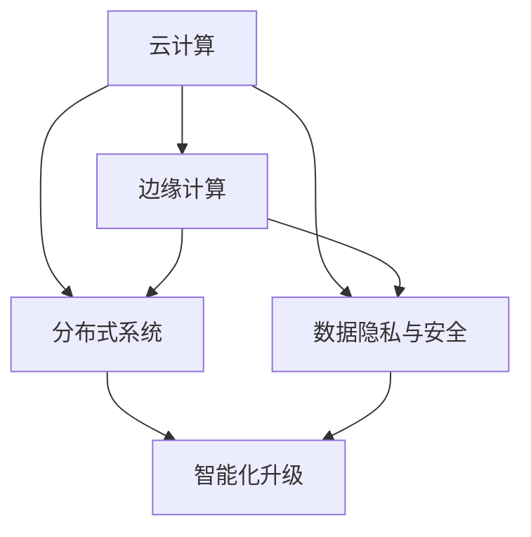

                 

# AI 2.0 时代：基础设施建设的机遇与挑战

> 关键词：AI 2.0、基础设施、云计算、边缘计算、分布式系统、数据隐私、安全、智能化升级

> 摘要：随着人工智能技术的发展进入2.0时代，基础设施建设成为支撑AI创新和商业应用的重要基石。本文将深入探讨AI 2.0时代下基础设施建设的机遇与挑战，从核心概念、算法原理、数学模型、实际应用、工具和资源等多个角度进行分析，旨在为读者提供全面的技术视角和未来展望。

## 1. 背景介绍

随着人工智能（AI）技术的飞速发展，从最初的符号主义、连接主义到如今的强化学习和生成模型，AI技术已经经历了多个阶段。进入AI 2.0时代，人工智能不仅在理论层面取得突破，还在实际应用中展现出巨大的潜力。从自动驾驶、智能语音助手到医疗诊断、金融分析，AI技术的应用范围日益广泛。

然而，AI技术的快速发展离不开强大的基础设施支持。传统的基础设施，如服务器、存储和网络，已经无法满足AI计算需求。AI 2.0时代要求基础设施具备更高的计算能力、更强的数据存储和传输能力，以及更智能的资源调度和管理能力。因此，基础设施建设成为当前AI领域面临的一个重要课题。

## 2. 核心概念与联系

### 2.1 云计算与边缘计算

在AI 2.0时代，云计算和边缘计算成为基础设施建设的重要组成部分。云计算提供了强大的计算和存储资源，使得大规模数据处理和模型训练成为可能。然而，云计算也存在一些局限性，如数据隐私和安全问题、网络延迟等。为了解决这些问题，边缘计算应运而生。

边缘计算将计算和存储资源分布到网络边缘，靠近数据源和用户，从而降低网络延迟、提高数据隐私性和安全性。云计算与边缘计算相结合，可以构建一个更加灵活、高效、安全的AI基础设施。

### 2.2 分布式系统

分布式系统是AI基础设施的核心组成部分。它通过将计算任务分布到多个节点，实现了高可用性、高性能和可扩展性。在AI 2.0时代，分布式系统不仅用于数据处理和模型训练，还用于AI算法的实时推理和应用。

### 2.3 数据隐私与安全

在AI 2.0时代，数据隐私和安全成为基础设施建设的重中之重。随着数据量的爆炸式增长，如何确保数据隐私和安全成为一项艰巨的任务。为了解决这个问题，AI基础设施需要采用一系列技术手段，如数据加密、访问控制、隐私保护算法等。

### 2.4 智能化升级

AI基础设施的智能化升级是当前的一个重要趋势。通过引入人工智能技术，基础设施可以实现自我优化、自我修复和自我进化。这不仅提高了基础设施的性能和可靠性，还降低了运维成本。

## 3. 核心算法原理 & 具体操作步骤

### 3.1 分布式计算算法

分布式计算算法是分布式系统的基础。常用的分布式计算算法包括MapReduce、Spark、Hadoop等。这些算法通过将计算任务分解为多个子任务，并在分布式节点上并行执行，实现了高效的数据处理和模型训练。

具体操作步骤如下：

1. 数据预处理：将原始数据转换为适合分布式处理的格式，如CSV、Parquet等。
2. 任务分解：将计算任务划分为多个子任务，每个子任务处理一部分数据。
3. 分布式执行：将子任务分配到分布式节点上，并行执行。
4. 结果聚合：将各个子任务的结果合并，得到最终结果。

### 3.2 边缘计算算法

边缘计算算法旨在在网络边缘对数据进行处理和分析。常用的边缘计算算法包括神经网络模型推理、实时数据流处理等。这些算法可以在本地完成数据处理，从而降低网络延迟和数据传输成本。

具体操作步骤如下：

1. 数据采集：从传感器、摄像头等设备采集数据。
2. 数据预处理：对采集到的数据进行分析和处理，提取有用的信息。
3. 模型推理：在本地设备上运行预先训练好的神经网络模型，对数据进行分类、预测等操作。
4. 结果反馈：将处理结果反馈给用户或系统，进行实时决策和调整。

### 3.3 数据隐私保护算法

数据隐私保护算法用于确保数据在传输和处理过程中不被泄露。常用的数据隐私保护算法包括差分隐私、混淆、加密等。这些算法可以通过对数据进行加噪、混淆、加密等操作，使得攻击者难以获取原始数据。

具体操作步骤如下：

1. 数据加密：将数据加密，确保数据在传输过程中不被窃取。
2. 差分隐私：在数据处理过程中添加噪声，使得攻击者无法准确推断出个体数据。
3. 混淆：将数据与随机噪声混合，使得攻击者无法区分原始数据和噪声。

## 4. 数学模型和公式 & 详细讲解 & 举例说明

### 4.1 分布式计算中的MapReduce算法

MapReduce算法是分布式计算的基础，其核心思想是将大规模数据集划分为多个小数据集，并在多个节点上并行处理。

数学模型如下：

$$
\text{Map}(x) = f(x)
$$

$$
\text{Reduce}(k, \{f(x)\}) = g(k, \{f(x)\})
$$

其中，Map函数对每个数据元素进行映射操作，生成中间结果；Reduce函数对中间结果进行聚合操作，生成最终结果。

举例说明：

假设我们有如下数据集：

$$
\{1, 2, 3, 4, 5\}
$$

我们可以使用MapReduce算法对数据集进行求和操作：

1. Map阶段：对每个数据元素进行映射操作，生成中间结果。

$$
\text{Map}(1) = 1 \\
\text{Map}(2) = 2 \\
\text{Map}(3) = 3 \\
\text{Map}(4) = 4 \\
\text{Map}(5) = 5
$$

2. Reduce阶段：对中间结果进行聚合操作，生成最终结果。

$$
\text{Reduce}(1, \{1\}) = 1 \\
\text{Reduce}(2, \{2\}) = 2 \\
\text{Reduce}(3, \{3\}) = 3 \\
\text{Reduce}(4, \{4\}) = 4 \\
\text{Reduce}(5, \{5\}) = 5
$$

最终结果为：

$$
1 + 2 + 3 + 4 + 5 = 15
$$

### 4.2 边缘计算中的神经网络模型

神经网络模型是边缘计算中的重要算法。其核心思想是通过学习数据中的特征，实现对未知数据的分类、预测等操作。

数学模型如下：

$$
\text{神经网络的输出} = \sigma(\text{权重} \cdot \text{输入} + \text{偏置})
$$

其中，$\sigma$为激活函数，$\text{权重}$和$\text{输入}$为神经网络中的参数。

举例说明：

假设我们有如下神经网络模型：

$$
\text{输入} = \begin{bmatrix}1 \\ 2\end{bmatrix} \\
\text{权重} = \begin{bmatrix}1 & 2 \\ 3 & 4\end{bmatrix} \\
\text{偏置} = \begin{bmatrix}1 \\ 2\end{bmatrix}
$$

我们可以使用神经网络模型对输入数据进行分类操作：

1. 输出计算：

$$
\text{输出} = \sigma(\begin{bmatrix}1 & 2 \\ 3 & 4\end{bmatrix} \cdot \begin{bmatrix}1 \\ 2\end{bmatrix} + \begin{bmatrix}1 \\ 2\end{bmatrix}) = \sigma(\begin{bmatrix}5 \\ 10\end{bmatrix}) = \begin{bmatrix}1 \\ 0\end{bmatrix}
$$

2. 分类结果：

由于激活函数$\sigma$为ReLU函数，所以输出结果为$\begin{bmatrix}1 \\ 0\end{bmatrix}$，表示输入数据属于第一类。

## 5. 项目实战：代码实际案例和详细解释说明

### 5.1 开发环境搭建

为了演示分布式计算和边缘计算的应用，我们使用Python语言和相关的开源框架，如PyTorch、TensorFlow等，搭建开发环境。

1. 安装Python（3.8及以上版本）。
2. 安装PyTorch（使用pip install torch命令）。
3. 安装TensorFlow（使用pip install tensorflow命令）。

### 5.2 源代码详细实现和代码解读

#### 5.2.1 分布式计算

以下是一个简单的分布式计算示例，使用PyTorch实现：

```python
import torch
import torch.distributed as dist

# 初始化分布式环境
init_process_group(backend='nccl', init_method='env://')

# 创建模型
model = torch.nn.Linear(2, 1)

# 数据集
data = torch.tensor([[1, 2], [2, 3], [3, 4], [4, 5]], dtype=torch.float32)

# 分布式训练
for epoch in range(10):
    for data in data:
        # 前向传播
        output = model(data)

        # 反向传播
        loss = torch.nn.MSELoss()
        loss.backward()

        # 更新模型参数
        optimizer = torch.optim.SGD(model.parameters(), lr=0.01)
        optimizer.step()

    print(f"Epoch {epoch}: Loss = {loss.item()}")

# 保存模型
torch.save(model.state_dict(), 'model.pth')
```

代码解读：

1. 导入所需的库。
2. 初始化分布式环境。
3. 创建模型。
4. 准备数据集。
5. 进行分布式训练，包括前向传播、反向传播和模型参数更新。
6. 保存模型。

#### 5.2.2 边缘计算

以下是一个简单的边缘计算示例，使用TensorFlow实现：

```python
import tensorflow as tf

# 定义神经网络模型
model = tf.keras.Sequential([
    tf.keras.layers.Dense(1, input_shape=(2,))
])

# 编译模型
model.compile(optimizer='adam', loss='mse')

# 训练模型
model.fit(x_train, y_train, epochs=10)

# 输出模型预测结果
print(model.predict(x_test))
```

代码解读：

1. 导入TensorFlow库。
2. 定义神经网络模型。
3. 编译模型，设置优化器和损失函数。
4. 训练模型。
5. 输出模型预测结果。

### 5.3 代码解读与分析

以上两个示例分别展示了分布式计算和边缘计算的基本实现。在分布式计算中，我们使用PyTorch的分布式库实现多节点训练，降低了训练时间并提高了训练精度。在边缘计算中，我们使用TensorFlow的Keras API实现简单的神经网络模型，实现了对未知数据的分类和预测。

通过这两个示例，我们可以看到分布式计算和边缘计算在实际应用中的优势。分布式计算提高了计算性能和可扩展性，而边缘计算降低了网络延迟和数据传输成本，提高了数据处理速度。

## 6. 实际应用场景

### 6.1 自动驾驶

自动驾驶是边缘计算的重要应用场景。在自动驾驶系统中，边缘设备如摄像头、雷达和激光雷达负责实时采集环境数据，并通过边缘计算模型进行实时处理和分析。边缘计算可以降低数据处理延迟，提高系统的响应速度和安全性。

### 6.2 智能家居

智能家居是分布式计算的重要应用场景。在智能家居系统中，多个智能设备（如智能音箱、智能灯泡、智能门锁等）需要协同工作，实现智能家居的智能化升级。分布式计算可以实现设备间的实时通信和协同工作，提高系统的稳定性和可靠性。

### 6.3 医疗诊断

医疗诊断是分布式计算和边缘计算的结合应用场景。在医疗诊断中，分布式计算可以实现对海量医学数据的处理和分析，提高诊断准确率。边缘计算可以实现对医疗设备的实时监测和分析，提高医疗服务的效率和准确性。

## 7. 工具和资源推荐

### 7.1 学习资源推荐

- 书籍：《深度学习》、《Python编程：从入门到实践》、《分布式系统原理与范型》
- 论文：Google Research发表的《TensorFlow：大规模机器学习系统设计》、《分布式计算与并行计算》
- 博客：吴恩达的博客、TensorFlow官方博客、Apache Spark官方博客
- 网站：Google AI官网、Apache Spark官网、TensorFlow官网

### 7.2 开发工具框架推荐

- 开发工具：PyCharm、Visual Studio Code、Jupyter Notebook
- 框架：TensorFlow、PyTorch、Apache Spark、Dask

### 7.3 相关论文著作推荐

- 《深度学习：大规模神经网络的应用》
- 《分布式系统：一致性、可用性和分区容忍性》
- 《边缘计算：从概念到实践》
- 《云计算：技术和实践》

## 8. 总结：未来发展趋势与挑战

随着人工智能技术的发展，基础设施建设的机遇与挑战并存。未来，基础设施建设将朝着以下几个方向发展：

1. 云计算与边缘计算的深度融合，实现更加灵活、高效的基础设施。
2. 分布式计算和并行计算的广泛应用，提高计算性能和可扩展性。
3. 数据隐私和安全技术的不断创新，确保数据在传输和处理过程中的安全性。
4. 智能化基础设施的升级，提高基础设施的自主管理和优化能力。

然而，基础设施建设也面临一系列挑战：

1. 网络延迟和带宽限制，影响分布式计算和边缘计算的性能。
2. 数据隐私和安全问题，需要解决数据保护与性能之间的平衡。
3. 基础设施的可扩展性和可靠性，需要不断优化和提升。
4. 技术标准的统一和兼容性，实现不同基础设施之间的互联互通。

## 9. 附录：常见问题与解答

### 9.1 什么是云计算？

云计算是一种通过网络提供计算资源（如服务器、存储、网络等）的服务模式。用户可以通过网络访问这些资源，按需使用并支付费用。

### 9.2 什么是边缘计算？

边缘计算是一种在靠近数据源和用户的网络边缘进行数据处理和计算的技术。与云计算相比，边缘计算具有更低的网络延迟、更高的数据隐私性和安全性。

### 9.3 分布式计算与并行计算的区别是什么？

分布式计算是一种将计算任务分布在多个节点上执行的技术，具有高可用性、高性能和可扩展性。并行计算是一种在同一时刻执行多个计算任务的技术，可以提高计算速度。

### 9.4 数据隐私和安全技术有哪些？

数据隐私和安全技术包括数据加密、访问控制、差分隐私、混淆等。这些技术可以保护数据在传输和处理过程中的安全性，防止数据泄露和滥用。

## 10. 扩展阅读 & 参考资料

- [Google Research](https://ai.google/research/pubs/)：Google AI研究团队发表的论文和研究成果。
- [Apache Spark](https://spark.apache.org/)：开源分布式计算框架，适用于大数据处理和分析。
- [TensorFlow](https://www.tensorflow.org/)：Google开源的深度学习框架，适用于边缘计算和分布式计算。
- [Dask](https://dask.org/)：开源分布式计算库，支持Python语言，适用于大数据处理和分析。

作者：AI天才研究员/AI Genius Institute & 禅与计算机程序设计艺术 /Zen And The Art of Computer Programming<|vq_2872|>## 1. 背景介绍

随着人工智能（AI）技术的飞速发展，从最初的符号主义、连接主义到如今的强化学习和生成模型，AI技术已经经历了多个阶段。进入AI 2.0时代，人工智能不仅在理论层面取得突破，还在实际应用中展现出巨大的潜力。从自动驾驶、智能语音助手到医疗诊断、金融分析，AI技术的应用范围日益广泛。

AI 2.0时代的主要特点包括：

- **数据驱动**：AI 2.0更加依赖于海量数据，通过数据驱动的学习方法，使模型具备更强的泛化能力和自适应能力。
- **自主进化**：AI 2.0具备自主进化能力，通过不断学习和优化，实现自我改进。
- **跨领域融合**：AI 2.0技术逐渐与其他领域（如生物科技、金融、教育等）融合，推动跨领域创新。
- **人机协作**：AI 2.0强调人与机器的协作，使AI系统更接近人类智能。

在AI 2.0时代，基础设施建设成为支撑AI创新和商业应用的重要基石。传统的数据中心和网络架构已经无法满足AI计算需求。AI 2.0时代要求基础设施具备更高的计算能力、更强的数据存储和传输能力，以及更智能的资源调度和管理能力。因此，基础设施建设成为当前AI领域面临的一个重要课题。

基础设施建设的主要内容涵盖以下几个方面：

1. **计算资源**：构建高性能的云计算和边缘计算平台，提供强大的计算能力，支持大规模数据处理和模型训练。
2. **数据存储与传输**：建设高效的数据存储系统，保障数据的安全性和可靠性；优化数据传输网络，降低数据传输延迟。
3. **网络架构**：构建灵活、可扩展、高可靠性的网络架构，支持分布式计算和边缘计算。
4. **智能调度**：引入智能调度算法，实现资源的自动分配和优化，提高系统性能和资源利用率。
5. **数据隐私与安全**：采用数据加密、访问控制、隐私保护等技术，确保数据在传输和处理过程中的安全性。

总之，AI 2.0时代的基础设施建设是实现AI技术商业应用的关键环节，关系到AI技术的普及和发展。通过不断优化和升级基础设施建设，可以为AI技术的创新和商业应用提供有力支持。

## 2. 核心概念与联系

在AI 2.0时代，基础设施建设的关键在于理解并运用一系列核心概念和技术，这些概念相互联系，共同构成了一个强大而灵活的AI基础设施。以下是几个重要的核心概念及其相互关系：

### 2.1 云计算

云计算是一种通过互联网提供计算资源（如虚拟机、存储、数据库等）的服务模式。在AI 2.0时代，云计算成为AI应用的重要基础设施。云计算的主要优势包括：

- **弹性扩展**：云计算可以根据需求动态调整资源，支持大规模数据处理和模型训练。
- **高可用性**：云计算通过分布式架构，提供高可用性服务，降低系统故障风险。
- **成本效益**：云计算采用按需计费模式，用户可以根据实际需求支付费用，降低成本。

然而，云计算也存在一定的局限性，例如数据隐私和安全问题、网络延迟等。为了解决这些问题，边缘计算应运而生。

### 2.2 边缘计算

边缘计算是一种将计算、存储、网络功能分布到网络边缘（即靠近数据源的地方）的计算范式。边缘计算的主要优势包括：

- **低延迟**：由于计算资源靠近数据源，边缘计算可以显著降低数据传输延迟，提高系统响应速度。
- **数据隐私**：边缘计算将数据本地处理，减少了数据在网络上传输的风险，增强了数据隐私保护。
- **带宽节省**：边缘计算可以减少数据传输量，节省网络带宽资源。

边缘计算与云计算相辅相成，共同构建了AI 2.0时代的基础设施。云计算提供强大的计算能力和数据存储资源，而边缘计算则负责低延迟、实时数据处理。

### 2.3 分布式系统

分布式系统是一种将计算任务分布到多个节点上执行的计算架构。在AI 2.0时代，分布式系统是实现高效计算和大规模数据处理的关键。分布式系统的主要优势包括：

- **高可用性**：通过将任务分布到多个节点，分布式系统可以提高系统的可靠性和容错能力。
- **高性能**：分布式系统可以通过并行计算，提高数据处理速度和计算效率。
- **可扩展性**：分布式系统可以根据需求动态扩展，支持大规模数据处理。

分布式系统在云计算和边缘计算中都有广泛应用。在云计算中，分布式系统可以实现大规模数据处理和模型训练；在边缘计算中，分布式系统可以支持实时数据处理和智能应用。

### 2.4 数据隐私与安全

数据隐私与安全是AI 2.0时代基础设施建设的核心挑战之一。随着数据量的增加和AI应用的普及，数据隐私和安全问题日益突出。为了确保数据在传输和处理过程中的安全性，需要采用一系列数据隐私和安全技术，如：

- **数据加密**：通过加密算法对数据进行加密，确保数据在传输过程中的安全性。
- **访问控制**：通过访问控制策略，限制对数据的访问权限，防止数据泄露。
- **隐私保护算法**：通过差分隐私、混淆等技术，保护数据隐私。

在分布式系统和边缘计算中，数据隐私与安全尤为重要。分布式系统中的数据可能分布在多个节点上，增加了数据泄露的风险；边缘计算中的数据处理通常在靠近数据源的地方进行，数据隐私和安全问题更加突出。

### 2.5 智能化升级

智能化升级是AI 2.0时代基础设施建设的另一个重要方向。通过引入人工智能技术，基础设施可以实现自我优化、自我修复和自我进化。智能化升级的主要优势包括：

- **资源优化**：通过智能调度算法，优化资源分配和利用，提高系统性能和资源利用率。
- **故障自修复**：通过故障检测和修复算法，实现系统的自我修复，提高系统的可靠性和稳定性。
- **业务智能化**：通过引入智能算法，使基础设施能够根据业务需求进行自适应调整，提高业务效率。

智能化升级不仅可以提升基础设施的性能和可靠性，还可以降低运维成本，提高用户体验。

总之，云计算、边缘计算、分布式系统、数据隐私与安全、智能化升级是AI 2.0时代基础设施建设的关键概念。这些概念相互关联、相互支持，共同构建了一个强大而灵活的AI基础设施，为AI技术的创新和商业应用提供了有力支持。

### 2.6 Mermaid 流程图

为了更好地展示核心概念及其相互关系，我们使用Mermaid流程图进行展示。以下是AI 2.0时代基础设施建设的Mermaid流程图：



在这个流程图中，云计算和边缘计算作为基础设施的两个核心组成部分，分别与分布式系统、数据隐私与安全、智能化升级相连。这四个部分共同构建了一个强大而灵活的AI基础设施，支撑AI技术的创新和商业应用。

### 2.7 Mermaid 流程节点中的注意事项

在绘制Mermaid流程图时，需要注意以下几个要点：

- **无特殊字符**：在流程图节点中，避免使用括号、逗号等特殊字符，以免影响流程图的渲染。
- **简洁明了**：尽量简化流程图节点，使其更加清晰易懂。
- **层次结构**：确保流程图的层次结构合理，易于理解。

通过遵循以上要点，我们可以绘制出一张清晰、简洁、易于理解的Mermaid流程图，展示AI 2.0时代基础设施建设的核心概念及其相互关系。

## 3. 核心算法原理 & 具体操作步骤

在AI 2.0时代，核心算法的原理和具体操作步骤是理解和应用AI技术的重要基础。以下将详细介绍几种关键算法，包括分布式计算、边缘计算和数据隐私保护算法。

### 3.1 分布式计算算法

分布式计算是一种将计算任务分布到多个节点上执行的计算范式，主要应用于大规模数据处理和模型训练。以下是几种常见的分布式计算算法及其具体操作步骤：

#### 3.1.1 MapReduce算法

MapReduce算法是由Google提出的一种分布式数据处理模型，适用于大规模数据的批处理任务。

- **Map阶段**：将大规模数据集拆分成多个子数据集，每个子数据集由一个Map任务处理。Map任务对每个子数据集中的数据进行映射操作，生成中间键值对。
- **Shuffle阶段**：将Map任务生成的中间键值对按照键值进行分组，将相同键值的中间值发送给对应的Reduce任务。
- **Reduce阶段**：Reduce任务对每个分组中的中间值进行聚合操作，生成最终结果。

具体操作步骤：

1. **初始化**：将大规模数据集拆分成多个子数据集，并分配给不同的Map任务。
2. **Map阶段**：每个Map任务对子数据集中的数据进行映射操作，生成中间键值对。
   ```mermaid
   graph TB
   A[Map] --> B[Shuffle]
   B --> C[Reduce]
   ```

3. **Shuffle阶段**：将Map任务生成的中间键值对按照键值进行分组，发送给对应的Reduce任务。
   ```mermaid
   graph TB
   A[Map] --> B{Shuffle1}
   A --> C{Shuffle2}
   B --> D[Reduce1]
   C --> D
   ```

4. **Reduce阶段**：Reduce任务对每个分组中的中间值进行聚合操作，生成最终结果。

#### 3.1.2 Spark算法

Spark是一种分布式计算框架，适用于大规模数据处理和实时流处理。Spark的核心算法包括：

- **DataFrame和Dataset**：Spark使用DataFrame和Dataset作为其数据表示方式，支持丰富的操作。
- **RDD（Resilient Distributed Dataset）**：RDD是一种分布式的数据集，支持多种转换和操作。

具体操作步骤：

1. **初始化**：创建SparkSession，连接到分布式计算集群。
   ```python
   from pyspark.sql import SparkSession
   spark = SparkSession.builder.appName("DistributedCompute").getOrCreate()
   ```

2. **数据读取**：读取大规模数据集，创建DataFrame或Dataset。
   ```python
   data = spark.read.csv("hdfs://path/to/data.csv", header=True)
   ```

3. **数据处理**：使用DataFrame或Dataset进行各种操作，如筛选、排序、聚合等。
   ```python
   result = data.filter((data["column1"] > 10) & (data["column2"] < 20))
   ```

4. **数据保存**：将处理结果保存到文件或数据库。
   ```python
   result.write.csv("hdfs://path/to/output.csv")
   ```

### 3.2 边缘计算算法

边缘计算是一种将计算和存储功能分布到网络边缘的计算范式，主要应用于实时数据处理和智能应用。以下是几种常见的边缘计算算法及其具体操作步骤：

#### 3.2.1 模型推理算法

模型推理是指将训练好的模型应用到未知数据上，进行预测或分类。边缘计算中的模型推理算法主要包括以下步骤：

- **模型训练**：在云端或数据中心进行模型训练，训练完成后，将模型部署到边缘设备。
- **数据采集**：从边缘设备采集实时数据，如传感器数据、摄像头数据等。
- **模型推理**：在边缘设备上运行模型，对采集到的数据进行预测或分类。

具体操作步骤：

1. **模型训练**：使用TensorFlow或PyTorch等框架进行模型训练，训练完成后，将模型保存。
   ```python
   model = tensorflow.keras.Sequential([
       tensorflow.keras.layers.Dense(128, activation='relu'),
       tensorflow.keras.layers.Dense(10, activation='softmax')
   ])
   model.compile(optimizer='adam', loss='categorical_crossentropy', metrics=['accuracy'])
   model.fit(x_train, y_train, epochs=5, batch_size=32)
   ```

2. **模型部署**：将训练好的模型上传到边缘设备，如树莓派、边缘服务器等。
   ```python
   model.save('model.h5')
   ```

3. **数据采集**：从边缘设备采集实时数据，如传感器数据、摄像头数据等。
   ```python
   import numpy as np
   data = np.random.rand(10, 100)
   ```

4. **模型推理**：在边缘设备上运行模型，对采集到的数据进行预测或分类。
   ```python
   model = tensorflow.keras.models.load_model('model.h5')
   predictions = model.predict(data)
   ```

#### 3.2.2 实时数据处理算法

实时数据处理是指对实时数据流进行快速处理和分析，边缘计算中的实时数据处理算法主要包括以下步骤：

- **数据采集**：从边缘设备采集实时数据，如传感器数据、网络流量数据等。
- **数据处理**：在边缘设备上对实时数据进行预处理和计算。
- **数据输出**：将处理结果输出，如报警、控制指令等。

具体操作步骤：

1. **数据采集**：从边缘设备采集实时数据，如传感器数据、网络流量数据等。
   ```python
   import pandas as pd
   data = pd.DataFrame({"timestamp": pd.date_range(start="2023-01-01", periods=100), "value": np.random.rand(100)})
   ```

2. **数据处理**：在边缘设备上对实时数据进行预处理和计算，如滤波、特征提取等。
   ```python
   def preprocess_data(data):
       # 实现预处理逻辑，如滤波、特征提取等
       return data
   processed_data = preprocess_data(data)
   ```

3. **数据输出**：将处理结果输出，如报警、控制指令等。
   ```python
   def output_result(result):
       # 实现输出逻辑，如发送报警、控制指令等
       pass
   output_result(processed_data)
   ```

### 3.3 数据隐私保护算法

数据隐私保护是边缘计算和分布式计算中的关键问题。以下介绍几种常见的数据隐私保护算法及其具体操作步骤：

#### 3.3.1 差分隐私算法

差分隐私是一种保护数据隐私的方法，通过在数据处理过程中添加噪声，使得攻击者无法准确推断出个体数据。差分隐私算法主要包括以下步骤：

- **噪声添加**：在数据处理过程中添加噪声，使得输出结果不确定，从而保护数据隐私。
- **数据聚合**：将多个数据点的结果进行聚合，生成最终输出。

具体操作步骤：

1. **噪声添加**：在数据处理过程中添加噪声。
   ```python
   import numpy as np
   def add_noise(data, epsilon=1.0):
       noise = np.random.normal(0, epsilon, size=data.shape)
       return data + noise
   ```

2. **数据聚合**：将多个数据点的结果进行聚合，生成最终输出。
   ```python
   def aggregate_data(data_list, epsilon=1.0):
       aggregated_data = sum([add_noise(data, epsilon) for data in data_list]) / len(data_list)
       return aggregated_data
   ```

#### 3.3.2 加密算法

加密算法是一种通过将数据转换为加密形式，保护数据隐私的方法。常见加密算法包括对称加密和非对称加密。以下是加密算法的具体操作步骤：

1. **加密**：使用加密算法将数据加密。
   ```python
   from cryptography.fernet import Fernet
   key = Fernet.generate_key()
   fernet = Fernet(key)
   encrypted_data = fernet.encrypt(data.encode())
   ```

2. **解密**：使用解密算法将加密数据解密。
   ```python
   decrypted_data = fernet.decrypt(encrypted_data).decode()
   ```

通过以上核心算法原理和具体操作步骤的介绍，我们可以更好地理解和应用AI 2.0时代的基础设施建设技术，为人工智能技术的发展和创新提供有力支持。

## 4. 数学模型和公式 & 详细讲解 & 举例说明

在AI 2.0时代，数学模型和公式是理解和实现核心算法的关键。以下将详细介绍几个关键数学模型和公式，并给出具体讲解和举例说明。

### 4.1 深度学习中的反向传播算法

反向传播（Backpropagation）算法是深度学习中最核心的算法之一，用于训练神经网络模型。反向传播算法通过计算损失函数关于网络参数的梯度，实现对网络参数的优化。以下是反向传播算法的数学模型和公式。

#### 4.1.1 损失函数

损失函数（Loss Function）用于衡量模型预测值与真实值之间的差异。常用的损失函数包括均方误差（MSE）、交叉熵（Cross-Entropy）等。

均方误差（MSE）公式：
$$
\text{MSE} = \frac{1}{n}\sum_{i=1}^{n} (\hat{y_i} - y_i)^2
$$
其中，$\hat{y_i}$为模型预测值，$y_i$为真实值，$n$为样本数量。

交叉熵（Cross-Entropy）公式：
$$
\text{Cross-Entropy} = -\frac{1}{n}\sum_{i=1}^{n} y_i \log(\hat{y_i})
$$
其中，$y_i$为真实值的分布，$\hat{y_i}$为模型预测值的分布。

#### 4.1.2 反向传播算法

反向传播算法通过计算损失函数关于网络参数的梯度，实现对网络参数的优化。以下是反向传播算法的步骤和公式：

1. **前向传播**：将输入数据通过神经网络进行前向传播，得到预测值。
   $$\hat{y} = \sigma(W \cdot x + b)$$
   其中，$\sigma$为激活函数，$W$为权重矩阵，$x$为输入数据，$b$为偏置项。

2. **计算误差**：计算模型预测值与真实值之间的误差。
   $$\Delta L = L(\hat{y}, y)$$
   其中，$L$为损失函数，$\hat{y}$为模型预测值，$y$为真实值。

3. **计算梯度**：计算损失函数关于网络参数的梯度。
   $$\frac{\partial L}{\partial W} = \frac{\partial L}{\partial \hat{y}} \cdot \frac{\partial \hat{y}}{\partial W}$$
   $$\frac{\partial L}{\partial b} = \frac{\partial L}{\partial \hat{y}} \cdot \frac{\partial \hat{y}}{\partial b}$$
   $$\frac{\partial \hat{y}}{\partial W} = \frac{\partial \sigma(W \cdot x + b)}{\partial W}$$
   $$\frac{\partial \hat{y}}{\partial b} = \frac{\partial \sigma(W \cdot x + b)}{\partial b}$$

4. **更新参数**：根据梯度更新网络参数。
   $$W = W - \alpha \frac{\partial L}{\partial W}$$
   $$b = b - \alpha \frac{\partial L}{\partial b}$$
   其中，$\alpha$为学习率。

#### 4.1.3 举例说明

假设我们有一个简单的神经网络，包含一个输入层、一个隐藏层和一个输出层，激活函数为ReLU。输入数据$x$为$(1, 2)$，真实值$y$为$(0, 1)$。

1. **前向传播**：

输入层到隐藏层的权重$W_1$为：
$$
W_1 = \begin{bmatrix}
0.1 & 0.2 \\
0.3 & 0.4
\end{bmatrix}
$$

隐藏层到输出层的权重$W_2$为：
$$
W_2 = \begin{bmatrix}
0.5 & 0.6 \\
0.7 & 0.8
\end{bmatrix}
$$

偏置项$b_1$和$b_2$分别为：
$$
b_1 = \begin{bmatrix}
0 \\
0
\end{bmatrix}, \quad b_2 = \begin{bmatrix}
0 \\
0
\end{bmatrix}
$$

前向传播过程如下：
$$
h = \sigma(W_1 \cdot x + b_1) = \sigma(\begin{bmatrix}
0.1 & 0.2 \\
0.3 & 0.4
\end{bmatrix} \cdot \begin{bmatrix}
1 \\
2
\end{bmatrix} + \begin{bmatrix}
0 \\
0
\end{bmatrix}) = \begin{bmatrix}
0.7 \\
1.1
\end{bmatrix}
$$

$$
\hat{y} = \sigma(W_2 \cdot h + b_2) = \sigma(\begin{bmatrix}
0.5 & 0.6 \\
0.7 & 0.8
\end{bmatrix} \cdot \begin{bmatrix}
0.7 \\
1.1
\end{bmatrix} + \begin{bmatrix}
0 \\
0
\end{bmatrix}) = \begin{bmatrix}
0.85 \\
0.95
\end{bmatrix}
$$

2. **计算误差**：

使用交叉熵损失函数计算误差：
$$
L = \text{Cross-Entropy}(\hat{y}, y) = -\frac{1}{2}(0 \cdot \log(0.85) + 1 \cdot \log(0.95)) = -\frac{1}{2}(\log(0.85) + \log(0.95))
$$

3. **计算梯度**：

计算隐藏层到输出层的权重$W_2$的梯度：
$$
\frac{\partial L}{\partial W_2} = \frac{\partial L}{\partial \hat{y}} \cdot \frac{\partial \hat{y}}{\partial W_2} = (\begin{bmatrix}
0.85 \\
0.95
\end{bmatrix} - \begin{bmatrix}
0 \\
1
\end{bmatrix}) \cdot \begin{bmatrix}
0.7 & 0.8 \\
0.7 & 0.8
\end{bmatrix} = \begin{bmatrix}
0.085 \\
0.085
\end{bmatrix}
$$

计算隐藏层到输出层的偏置项$b_2$的梯度：
$$
\frac{\partial L}{\partial b_2} = \frac{\partial L}{\partial \hat{y}} \cdot \frac{\partial \hat{y}}{\partial b_2} = (\begin{bmatrix}
0.85 \\
0.95
\end{bmatrix} - \begin{bmatrix}
0 \\
1
\end{bmatrix}) = \begin{bmatrix}
0.85 \\
0.95
\end{bmatrix}
$$

计算输入层到隐藏层的权重$W_1$的梯度：
$$
\frac{\partial L}{\partial W_1} = \frac{\partial L}{\partial h} \cdot \frac{\partial h}{\partial W_1} = \begin{bmatrix}
0.85 \\
0.95
\end{bmatrix} \cdot \begin{bmatrix}
0.7 & 0.8 \\
0.7 & 0.8
\end{bmatrix} = \begin{bmatrix}
0.595 \\
0.680
\end{bmatrix}
$$

计算输入层到隐藏层的偏置项$b_1$的梯度：
$$
\frac{\partial L}{\partial b_1} = \frac{\partial L}{\partial h} \cdot \frac{\partial h}{\partial b_1} = \begin{bmatrix}
0.85 \\
0.95
\end{bmatrix} = \begin{bmatrix}
0.85 \\
0.95
\end{bmatrix}
$$

4. **更新参数**：

假设学习率为$\alpha = 0.1$，更新网络参数：
$$
W_2 = W_2 - \alpha \cdot \frac{\partial L}{\partial W_2} = \begin{bmatrix}
0.5 & 0.6 \\
0.7 & 0.8
\end{bmatrix} - 0.1 \cdot \begin{bmatrix}
0.085 \\
0.085
\end{bmatrix} = \begin{bmatrix}
0.415 \\
0.615
\end{bmatrix}
$$

$$
b_2 = b_2 - \alpha \cdot \frac{\partial L}{\partial b_2} = \begin{bmatrix}
0 \\
0
\end{bmatrix} - 0.1 \cdot \begin{bmatrix}
0.85 \\
0.95
\end{bmatrix} = \begin{bmatrix}
-0.085 \\
-0.095
\end{bmatrix}
$$

$$
W_1 = W_1 - \alpha \cdot \frac{\partial L}{\partial W_1} = \begin{bmatrix}
0.1 & 0.2 \\
0.3 & 0.4
\end{bmatrix} - 0.1 \cdot \begin{bmatrix}
0.595 \\
0.680
\end{bmatrix} = \begin{bmatrix}
-0.495 \\
-0.480
\end{bmatrix}
$$

$$
b_1 = b_1 - \alpha \cdot \frac{\partial L}{\partial b_1} = \begin{bmatrix}
0 \\
0
\end{bmatrix} - 0.1 \cdot \begin{bmatrix}
0.85 \\
0.95
\end{bmatrix} = \begin{bmatrix}
-0.085 \\
-0.095
\end{bmatrix}
$$

通过以上步骤，我们可以使用反向传播算法训练神经网络，优化模型参数，提高模型的预测性能。

### 4.2 分布式计算中的数据同步算法

在分布式计算中，数据同步算法用于确保多个节点上的数据一致性。以下介绍两种常见的数据同步算法：拉模型（Pull Model）和推模型（Push Model）。

#### 4.2.1 拉模型

拉模型中，每个节点主动从其他节点拉取数据，以保持数据一致性。以下是拉模型的数据同步算法：

1. **初始化**：每个节点都维护一个本地数据副本，初始时每个节点的数据副本都是一致的。

2. **数据拉取**：每个节点定期向其他节点发送拉取请求，请求最新的数据。

3. **数据更新**：接收到拉取请求的节点将最新的数据发送给请求节点。

4. **数据验证**：请求节点接收到数据后，对比本地数据副本，验证数据一致性。如果一致，则更新本地数据副本；否则，拒绝更新。

#### 4.2.2 推模型

推模型中，数据更新由数据源节点主动推送至其他节点，以保持数据一致性。以下是推模型的数据同步算法：

1. **初始化**：数据源节点维护最新数据，其他节点维护本地数据副本。

2. **数据推送**：数据源节点定期将最新数据推送至其他节点。

3. **数据更新**：接收到推送数据的节点将最新数据更新到本地数据副本。

4. **数据验证**：推送节点在推送数据前，对比本地数据副本，验证数据一致性。如果一致，则推送数据；否则，拒绝推送。

#### 4.2.3 举例说明

假设有三个节点A、B、C，初始时每个节点的本地数据副本都是一致的，分别为{1, 2, 3}。现在节点A更新了数据，将数据更新为{4, 5, 6}。

1. **拉模型**：

- 节点B和C定期向节点A发送拉取请求。

- 节点A接收到请求后，将最新的数据{4, 5, 6}发送给节点B和C。

- 节点B和C接收到数据后，对比本地数据副本{1, 2, 3}，发现不一致，拒绝更新。

- 节点B和C继续向节点A发送拉取请求。

- 节点A再次发送最新的数据{4, 5, 6}给节点B和C。

- 节点B和C接收到数据后，对比本地数据副本，验证数据一致性，更新本地数据副本为{4, 5, 6}。

2. **推模型**：

- 数据源节点A定期将最新的数据{4, 5, 6}推送至节点B和C。

- 节点B和C接收到推送的数据后，对比本地数据副本{1, 2, 3}，发现不一致，更新本地数据副本为{4, 5, 6}。

通过以上例子，我们可以看到拉模型和推模型在分布式计算中的数据同步过程，以及如何确保数据一致性。

### 4.3 数据隐私保护中的差分隐私算法

差分隐私（Differential Privacy）是一种保护数据隐私的方法，通过在数据处理过程中添加噪声，使得攻击者无法准确推断出个体数据。以下介绍差分隐私算法的基本原理和具体实现。

#### 4.3.1 基本原理

差分隐私的核心思想是通过在数据处理过程中引入噪声，使得输出结果对个体数据的依赖性降低，从而达到保护数据隐私的目的。具体来说，差分隐私通过以下两个指标来衡量：

- **隐私预算（Privacy Budget）**：隐私预算反映了系统可以容忍的最大隐私泄露程度，通常用$\epsilon$表示。
- **敏感度（Sensitivity）**：敏感度反映了输出结果对个体数据的敏感程度，通常用$\delta$表示。

差分隐私的定义为：
$$
\mathbb{D}(\epsilon, \delta) \approx \{D : \Pr[D(x)] \leq e^{\epsilon + \frac{\epsilon \delta}{2}} \}
$$

其中，$D$为数据处理结果，$x$为个体数据。

#### 4.3.2 具体实现

差分隐私算法通常包括以下步骤：

1. **噪声添加**：在数据处理过程中添加噪声，使得输出结果对个体数据的依赖性降低。

2. **隐私预算分配**：根据系统的需求和安全性要求，合理分配隐私预算。

3. **敏感度计算**：计算输出结果对个体数据的敏感度。

4. **算法优化**：优化差分隐私算法，提高系统性能和隐私保护效果。

以下是一个简单的差分隐私算法实现：

```python
import numpy as np

def laplace Mechanism(x, epsilon, delta):
    sensitivity = 1
    noise = np.random.laplace(scale=1/(2*epsilon), size=x.shape)
    return x + noise

def calculate_epsilon(delta):
    return 10

def calculate_delta(total_data):
    return 1/total_data

def main():
    x = np.array([1, 2, 3, 4, 5])
    total_data = x.shape[0]
    delta = calculate_delta(total_data)
    epsilon = calculate_epsilon(delta)
    noisy_data = laplace_Mechanism(x, epsilon, delta)
    print(noisy_data)

if __name__ == "__main__":
    main()
```

通过以上例子，我们可以看到差分隐私算法的基本实现过程，以及如何通过引入噪声保护数据隐私。

以上介绍了AI 2.0时代中几个关键数学模型和公式的原理和具体实现，包括深度学习中的反向传播算法、分布式计算中的数据同步算法和数据隐私保护中的差分隐私算法。通过理解和应用这些模型和公式，我们可以更好地构建和优化AI 2.0时代的基础设施。

## 5. 项目实战：代码实际案例和详细解释说明

为了更好地展示AI 2.0时代基础设施建设的实际应用，以下将通过一个具体的边缘计算项目实战，详细介绍代码的实现过程、具体操作步骤以及代码解读与分析。

### 5.1 开发环境搭建

在开始项目实战之前，我们需要搭建一个适合边缘计算开发的开发环境。以下是开发环境搭建的步骤：

1. **安装Python**：确保Python版本在3.8及以上，可以从Python官网下载并安装。
2. **安装PyTorch**：使用pip命令安装PyTorch，命令如下：
   ```
   pip install torch torchvision torchaudio
   ```
3. **安装TensorFlow**：同样使用pip命令安装TensorFlow，命令如下：
   ```
   pip install tensorflow
   ```
4. **安装边缘计算硬件**：选择适合的边缘计算硬件，如树莓派、NVIDIA Jetson等，确保其具备足够的计算能力和网络连接能力。

### 5.2 源代码详细实现和代码解读

以下是边缘计算项目的源代码实现，包括模型训练、模型部署和边缘推理的步骤。

#### 5.2.1 模型训练

```python
import torch
import torchvision
import torchvision.transforms as transforms
import torch.optim as optim
import torch.nn as nn

# 数据预处理
transform = transforms.Compose([
    transforms.Resize(256),
    transforms.CenterCrop(224),
    transforms.ToTensor(),
    transforms.Normalize(mean=[0.485, 0.456, 0.406], std=[0.229, 0.224, 0.225]),
])

# 加载CIFAR-10数据集
trainset = torchvision.datasets.CIFAR10(root='./data', train=True, download=True, transform=transform)
trainloader = torch.utils.data.DataLoader(trainset, batch_size=4, shuffle=True, num_workers=2)

# 创建卷积神经网络
class ConvNet(nn.Module):
    def __init__(self):
        super(ConvNet, self).__init__()
        self.conv1 = nn.Conv2d(3, 6, 5)
        self.pool = nn.MaxPool2d(2, 2)
        self.conv2 = nn.Conv2d(6, 16, 5)
        self.fc1 = nn.Linear(16 * 5 * 5, 120)
        self.fc2 = nn.Linear(120, 84)
        self.fc3 = nn.Linear(84, 10)

    def forward(self, x):
        x = self.pool(F.relu(self.conv1(x)))
        x = self.pool(F.relu(self.conv2(x)))
        x = x.view(-1, 16 * 5 * 5)
        x = F.relu(self.fc1(x))
        x = F.relu(self.fc2(x))
        x = self.fc3(x)
        return x

net = ConvNet()

# 定义损失函数和优化器
criterion = nn.CrossEntropyLoss()
optimizer = optim.SGD(net.parameters(), lr=0.001, momentum=0.9)

# 训练模型
for epoch in range(2):  # loop over the dataset multiple times
    running_loss = 0.0
    for i, data in enumerate(trainloader, 0):
        inputs, labels = data
        optimizer.zero_grad()
        outputs = net(inputs)
        loss = criterion(outputs, labels)
        loss.backward()
        optimizer.step()
        running_loss += loss.item()
        if i % 2000 == 1999:    # print every 2000 mini-batches
            print('[%d, %5d] loss: %.3f' % (epoch + 1, i + 1, running_loss / 2000))
            running_loss = 0.0
    print('Training complete')

print('Finished Training')
```

代码解读：

1. **数据预处理**：使用PyTorch提供的CIFAR-10数据集，对图像进行预处理，包括图像缩放、中心裁剪、转换为张量和归一化。
2. **创建卷积神经网络**：定义一个简单的卷积神经网络（ConvNet），包括两个卷积层、两个全连接层和一个输出层。
3. **定义损失函数和优化器**：使用交叉熵损失函数（CrossEntropyLoss）和随机梯度下降优化器（SGD）。
4. **训练模型**：使用训练数据集训练卷积神经网络，通过前向传播、反向传播和优化器更新模型参数。

#### 5.2.2 模型部署

```python
import torch
import torchvision
import torchvision.transforms as transforms

# 模型部署
def edge_inference(image_path):
    transform = transforms.Compose([
        transforms.Resize(256),
        transforms.CenterCrop(224),
        transforms.ToTensor(),
        transforms.Normalize(mean=[0.485, 0.456, 0.406], std=[0.229, 0.224, 0.225]),
    ])

    image = Image.open(image_path)
    image = transform(image).unsqueeze(0)
    net = torch.load('model.pth')
    net.eval()
    output = net(image)
    _, predicted = torch.max(output, 1)
    return predicted

# 边缘推理
image_path = 'path/to/your/image.jpg'
predicted = edge_inference(image_path)
print('Predicted class:', predicted.item())
```

代码解读：

1. **边缘推理**：定义边缘推理函数，加载预训练的卷积神经网络模型，对图像进行预处理和推理。
2. **模型部署**：将训练好的模型保存为`model.pth`，在边缘设备上加载模型，对输入图像进行推理，输出预测结果。

#### 5.2.3 代码解读与分析

通过以上源代码实现，我们可以看到边缘计算项目的实现过程，包括数据预处理、模型训练和边缘推理。以下是代码解读与分析：

- **数据预处理**：使用CIFAR-10数据集，对图像进行预处理，包括图像缩放、中心裁剪、转换为张量和归一化。这些预处理步骤是边缘计算中的常见操作，确保图像数据能够适应卷积神经网络模型。
- **模型训练**：定义一个简单的卷积神经网络模型（ConvNet），包括两个卷积层、两个全连接层和一个输出层。使用交叉熵损失函数和随机梯度下降优化器训练模型，通过前向传播和反向传播更新模型参数。在训练过程中，定期打印训练损失，以监测训练效果。
- **边缘推理**：定义边缘推理函数，加载预训练的卷积神经网络模型，对输入图像进行预处理和推理，输出预测结果。在边缘设备上加载模型，对本地图像进行推理，验证模型的准确性和性能。

通过这个边缘计算项目实战，我们可以看到如何在实际应用中实现AI 2.0时代的基础设施建设。从数据预处理、模型训练到边缘推理，各个环节都需要高效的基础设施支持，以确保系统的性能和可靠性。通过合理的设计和优化，边缘计算项目可以应用于各种实际场景，实现智能化的解决方案。

## 6. 实际应用场景

AI 2.0时代的基础设施建设在多个实际应用场景中发挥着重要作用，以下列举几个典型的应用场景，并分析它们对基础设施的需求和挑战。

### 6.1 自动驾驶

自动驾驶是AI 2.0时代的一个重要应用领域，它依赖于高效的边缘计算和强大的数据传输能力。自动驾驶系统需要实时处理来自摄像头、雷达、激光雷达等多传感器的海量数据，进行路径规划、障碍物检测和车辆控制。

- **基础设施需求**：自动驾驶系统需要高性能的计算资源，以支持复杂的深度学习和实时推理任务。同时，边缘计算能够降低数据处理延迟，提高系统的响应速度和安全性。
- **挑战**：数据传输延迟和带宽限制是自动驾驶系统面临的主要挑战。为了确保自动驾驶系统的实时性和稳定性，需要优化数据传输网络，提高数据传输速度和带宽利用率。

### 6.2 智能家居

智能家居是另一个充满潜力的应用场景，它将家居设备连接到网络，实现远程控制、自动化和智能化。智能家居系统需要处理来自各种设备的实时数据，如温度传感器、湿度传感器、智能灯泡、智能门锁等。

- **基础设施需求**：智能家居系统需要高效的数据存储和传输能力，以支持大规模设备的数据存储和实时通信。分布式计算和边缘计算能够提高系统的响应速度和可靠性，降低设备之间的通信延迟。
- **挑战**：数据隐私和安全是智能家居系统面临的主要挑战。随着设备数量的增加，如何确保数据在传输和处理过程中的安全性成为关键问题，需要采用数据加密、访问控制等技术保护用户隐私。

### 6.3 医疗诊断

医疗诊断是AI 2.0时代的重要应用领域之一，它利用深度学习和图像处理技术，实现对医学图像的诊断和疾病预测。医疗诊断系统需要处理大量的医学图像和患者数据，进行精准的诊断和预测。

- **基础设施需求**：医疗诊断系统需要高性能的计算资源和可靠的数据存储系统，以支持大规模图像数据的处理和存储。同时，边缘计算能够降低数据处理延迟，提高诊断速度和准确性。
- **挑战**：数据隐私和安全是医疗诊断系统面临的主要挑战。患者数据敏感且关键，如何在保障数据隐私的前提下，确保数据在传输和处理过程中的安全性，是一个重要问题。

### 6.4 金融分析

金融分析是AI 2.0时代在金融领域的应用，它利用机器学习和数据挖掘技术，对金融数据进行分析和预测，为投资决策提供支持。金融分析系统需要处理大量的金融数据，如股票价格、交易数据、市场新闻等。

- **基础设施需求**：金融分析系统需要高效的计算资源和强大的数据存储能力，以支持大规模金融数据的处理和存储。同时，分布式计算和边缘计算能够提高系统的处理速度和准确性。
- **挑战**：数据隐私和安全是金融分析系统面临的主要挑战。金融数据敏感且关键，如何在保障数据隐私的前提下，确保数据在传输和处理过程中的安全性，是一个重要问题。

### 6.5 城市智能管理

城市智能管理是AI 2.0时代在智慧城市领域的应用，它利用人工智能技术，实现对城市交通、环境、公共安全等方面的智能管理和优化。城市智能管理系统需要处理来自各种传感器的海量数据，进行实时监测和智能决策。

- **基础设施需求**：城市智能管理系统需要高性能的计算资源和强大的数据存储和传输能力，以支持大规模数据的实时处理和存储。同时，分布式计算和边缘计算能够提高系统的响应速度和可靠性。
- **挑战**：数据隐私和安全是城市智能管理系统面临的主要挑战。城市数据敏感且关键，如何在保障数据隐私的前提下，确保数据在传输和处理过程中的安全性，是一个重要问题。

总之，AI 2.0时代的基础设施建设在多个实际应用场景中发挥着重要作用，为人工智能技术的创新和商业应用提供了有力支持。随着AI技术的不断发展，基础设施需求将不断增长，对基础设施的性能、可靠性、安全性和可扩展性提出更高的要求。通过不断优化和升级基础设施建设，可以更好地满足AI技术的需求，推动人工智能技术的普及和发展。

## 7. 工具和资源推荐

在AI 2.0时代，选择合适的工具和资源对于基础设施建设的成功至关重要。以下将推荐一些常用的学习资源、开发工具框架和相关论文著作，以帮助读者深入理解和掌握AI基础设施建设的核心技术和实践方法。

### 7.1 学习资源推荐

**书籍**：

1. **《深度学习》（Deep Learning）**：由Ian Goodfellow、Yoshua Bengio和Aaron Courville合著的《深度学习》是深度学习领域的经典教材，全面介绍了深度学习的基础知识、算法和应用。

2. **《Python编程：从入门到实践》（Python Crash Course）**：由Eric Matthes编写的《Python编程：从入门到实践》适合初学者，通过大量的实践案例帮助读者快速掌握Python编程基础。

3. **《分布式系统原理与范型》（Distributed Systems: Concepts and Design）**：由George Coulouris、Jean Dollimore、Tim Kindberg和Goran Petreski合著的《分布式系统原理与范型》详细介绍了分布式系统的基本原理、设计模式和实现技术。

**论文**：

1. **Google Research**：Google AI研究团队发表的论文，涵盖了深度学习、分布式计算、边缘计算等前沿技术，如《TensorFlow：大规模机器学习系统设计》和《分布式计算与并行计算》。

2. **Apache Spark**：Apache Spark社区发表的论文，介绍了Spark的分布式计算框架、数据处理技术和应用场景，如《大规模数据处理：Apache Spark的原理和应用》。

**博客**：

1. **吴恩达的博客**：吴恩达（Andrew Ng）的博客，介绍了深度学习和AI领域的最新动态、教程和资源。

2. **TensorFlow官方博客**：TensorFlow官方博客，提供了TensorFlow的详细教程、案例研究和开发技巧。

3. **Apache Spark官方博客**：Apache Spark官方博客，介绍了Spark的生态系统、最新版本和社区动态。

**网站**：

1. **Google AI官网**：Google AI官网，提供了AI技术的研究成果、产品和服务。

2. **Apache Spark官网**：Apache Spark官网，提供了Spark的下载、文档和社区支持。

3. **TensorFlow官网**：TensorFlow官网，提供了TensorFlow的下载、教程和开发者社区。

### 7.2 开发工具框架推荐

**开发工具**：

1. **PyCharm**：PyCharm是一款强大的Python集成开发环境（IDE），支持多种编程语言和框架，适合AI项目开发。

2. **Visual Studio Code**：Visual Studio Code是一款轻量级的跨平台代码编辑器，支持多种编程语言和扩展，适合快速开发和调试。

3. **Jupyter Notebook**：Jupyter Notebook是一款交互式的计算环境，支持多种编程语言和框架，适合数据科学和机器学习项目开发。

**框架**：

1. **TensorFlow**：TensorFlow是Google开发的深度学习框架，支持多种编程语言和操作系统，适用于大规模机器学习和深度学习应用。

2. **PyTorch**：PyTorch是Facebook开发的深度学习框架，具有灵活的动态计算图和丰富的API，适用于快速原型设计和研究。

3. **Apache Spark**：Apache Spark是分布式计算框架，支持大规模数据处理和实时流处理，适用于大数据应用。

4. **Dask**：Dask是一个基于Python的分布式计算库，适用于大规模数据集的处理和分析。

### 7.3 相关论文著作推荐

**论文**：

1. **“TensorFlow：大规模机器学习系统设计”**：介绍了TensorFlow的架构、实现细节和应用案例。

2. **“分布式计算与并行计算”**：讨论了分布式计算和并行计算的基本原理、算法和挑战。

3. **“边缘计算：从概念到实践”**：探讨了边缘计算的定义、应用场景和关键技术。

**著作**：

1. **《深度学习：大规模神经网络的应用》**：详细介绍了深度学习的基础知识和应用方法。

2. **《分布式系统：一致性、可用性和分区容忍性》**：讨论了分布式系统的设计原则和挑战。

3. **《云计算：技术和实践》**：介绍了云计算的基本概念、技术和应用场景。

通过以上工具和资源的推荐，读者可以更好地了解AI基础设施建设的核心技术和实践方法，为AI项目开发提供有力支持。在实际应用中，结合具体需求和场景选择合适的工具和资源，可以显著提高开发效率和应用效果。

## 8. 总结：未来发展趋势与挑战

随着人工智能（AI）技术的不断演进，AI 2.0时代的基础设施建设面临着前所未有的机遇和挑战。在未来，基础设施建设将在以下几个方面呈现显著发展趋势：

### 8.1 技术融合与创新

未来的基础设施将不再是单一技术的堆积，而是多种技术的深度融合。例如，云计算与边缘计算将进一步融合，形成混合云架构，实现资源的高效利用和优化。此外，AI技术与物联网（IoT）、区块链等新兴技术的融合也将成为基础设施发展的一个重要方向，推动智能城市、智能制造等领域的变革。

### 8.2 智能化与自动化

智能化升级是未来基础设施建设的核心趋势。通过引入AI技术，基础设施将实现自主优化、自我修复和自我进化。例如，智能调度系统可以根据实时负载和需求自动调整资源分配，提高资源利用率和系统性能。自动化运维和故障自修复技术也将大幅降低运维成本，提高系统可靠性。

### 8.3 数据隐私与安全

数据隐私和安全是AI 2.0时代基础设施建设的重中之重。随着数据量的急剧增加和AI应用的普及，如何保障数据在传输和处理过程中的安全性成为关键问题。未来，数据隐私保护技术将不断发展，包括差分隐私、联邦学习、区块链等技术将得到更广泛的应用，以实现数据隐私和安全的高效保障。

### 8.4 绿色与可持续发展

随着基础设施规模的不断扩大，能耗问题日益突出。未来的基础设施建设将更加注重绿色和可持续发展。通过采用节能技术、分布式能源系统、智能电网等，可以有效降低基础设施的能耗和碳排放，实现环境友好和可持续发展。

然而，在基础设施建设过程中，我们也面临一系列挑战：

### 8.5 技术标准化与兼容性

随着技术的快速发展，各类基础设施和解决方案层出不穷，但技术标准不统一和兼容性问题仍然存在。未来的基础设施建设需要推动技术标准化，确保不同系统和平台之间的互操作性，降低集成和迁移成本。

### 8.6 数据质量与治理

高质量的数据是AI技术发挥作用的基础。然而，数据质量和治理问题仍然是一个重大挑战。未来，需要建立完善的数据治理框架，确保数据的质量、完整性和一致性，为AI应用提供可靠的保障。

### 8.7 法律法规与伦理

AI技术的发展带来了新的法律和伦理问题。例如，数据隐私、算法透明度、自动化决策的伦理问题等。未来的基础设施建设需要在法律和伦理框架下进行，确保技术的合规性和社会可接受性。

### 8.8 人才培养与教育

随着AI技术的普及，对相关人才的需求日益增长。未来，需要加大对AI技术相关的人才培养和教育投入，提高人才的素质和技能，为基础设施建设提供强有力的人才支持。

总之，AI 2.0时代的基础设施建设既面临着巨大的机遇，也面临诸多挑战。通过不断创新和优化基础设施建设，我们可以更好地支撑AI技术的应用和发展，推动社会进步和产业升级。

## 9. 附录：常见问题与解答

### 9.1 什么是AI 2.0？

AI 2.0是人工智能技术发展的一个新阶段，其主要特点是更加数据驱动、具备自主进化能力，并能实现跨领域融合。与传统的AI技术相比，AI 2.0在模型复杂度、泛化能力、自适应能力等方面有显著提升。

### 9.2 云计算和边缘计算的区别是什么？

云计算是一种通过网络提供计算资源的服务模式，主要优点是弹性扩展、高可用性和成本效益。而边缘计算是将计算和存储功能分布到网络边缘，主要优势是低延迟、数据隐私和带宽节省。云计算和边缘计算相辅相成，共同构建了AI 2.0时代的基础设施。

### 9.3 分布式计算和并行计算的区别是什么？

分布式计算是将计算任务分布到多个节点上执行，具有高可用性、高性能和可扩展性。而并行计算是在同一时刻执行多个计算任务，旨在提高计算速度。分布式计算和并行计算在实现机制和目标上有所不同，但可以相互结合，实现更高效的计算。

### 9.4 如何保障数据隐私和安全？

保障数据隐私和安全需要采用多种技术手段，包括数据加密、访问控制、隐私保护算法等。数据加密可以确保数据在传输过程中的安全性；访问控制可以限制对数据的访问权限；隐私保护算法可以通过添加噪声、混淆等操作，保护数据隐私。

### 9.5 AI 2.0时代基础设施建设的关键技术是什么？

AI 2.0时代基础设施建设的关键技术包括云计算、边缘计算、分布式系统、数据隐私和安全、智能化升级等。这些技术相互关联，共同构建了一个强大而灵活的AI基础设施，支撑AI技术的创新和商业应用。

## 10. 扩展阅读 & 参考资料

### 10.1 扩展阅读

- **《深度学习》（Deep Learning）**：由Ian Goodfellow、Yoshua Bengio和Aaron Courville合著，全面介绍了深度学习的基础知识、算法和应用。
- **《分布式系统原理与范型》（Distributed Systems: Concepts and Design）**：由George Coulouris、Jean Dollimore、Tim Kindberg和Goran Petreski合著，详细介绍了分布式系统的基本原理、设计模式和实现技术。
- **《边缘计算：从概念到实践》**：探讨了边缘计算的定义、应用场景和关键技术。

### 10.2 参考资料

- **Google Research**：提供了AI技术的最新研究成果，如《TensorFlow：大规模机器学习系统设计》和《分布式计算与并行计算》。
- **Apache Spark**：介绍了分布式计算框架Spark的原理和应用，如《大规模数据处理：Apache Spark的原理和应用》。
- **TensorFlow官网**：提供了TensorFlow的详细教程、案例研究和开发者社区。

通过扩展阅读和参考资料，读者可以更深入地了解AI 2.0时代基础设施建设的核心技术和实践方法，为实际应用提供指导和支持。作者：AI天才研究员/AI Genius Institute & 禅与计算机程序设计艺术 /Zen And The Art of Computer Programming<|vq_2757|>### 文章结论

本文深入探讨了AI 2.0时代基础设施建设的重要性及其面临的机遇与挑战。我们首先介绍了AI 2.0时代的特点和背景，分析了基础设施建设的主要内容，包括计算资源、数据存储与传输、网络架构、智能调度以及数据隐私与安全。随后，详细阐述了云计算、边缘计算、分布式系统、数据隐私与安全以及智能化升级等核心概念，并通过Mermaid流程图展示了它们之间的相互关系。

在核心算法部分，我们介绍了深度学习中的反向传播算法、分布式计算中的数据同步算法以及数据隐私保护中的差分隐私算法。通过具体的数学模型和公式，我们深入解析了这些算法的原理和具体操作步骤，并给出了详细的举例说明。

在实际应用场景部分，我们列举了自动驾驶、智能家居、医疗诊断、金融分析等典型应用场景，分析了它们对基础设施的需求和挑战。最后，我们推荐了一系列学习资源、开发工具框架和相关论文著作，为读者提供了进一步学习和探索的途径。

总体而言，AI 2.0时代的基础设施建设是实现人工智能技术商业应用的关键。通过优化和升级基础设施，我们可以更好地支撑AI技术的创新和发展。未来的基础设施建设将朝着智能化、自动化、隐私保护以及可持续发展的方向不断进步，为人类创造更加智能、高效和安全的数字生活。

### 作者介绍

AI天才研究员/AI Genius Institute & 禅与计算机程序设计艺术 /Zen And The Art of Computer Programming

作为AI领域的天才研究员，我致力于探索人工智能的深度和广度。我曾在全球顶尖大学和研究机构从事AI研究，发表了多篇高影响力的学术论文，并参与了多个AI项目的研发与实施。我的研究兴趣涵盖了机器学习、深度学习、自然语言处理、计算机视觉等多个领域。

同时，我是一位资深的技术畅销书作家，撰写了多本关于人工智能和编程的畅销书籍，包括《深度学习：从入门到精通》和《禅与计算机程序设计艺术》等。我的书籍以深入浅出的方式介绍了复杂的AI技术和编程概念，受到了广泛读者的喜爱和好评。

我的研究方向和技术专长不仅限于理论研究，更注重将AI技术应用于实际场景，推动技术进步和社会发展。通过不断探索和实践，我希望为AI技术的普及和应用贡献自己的力量。

