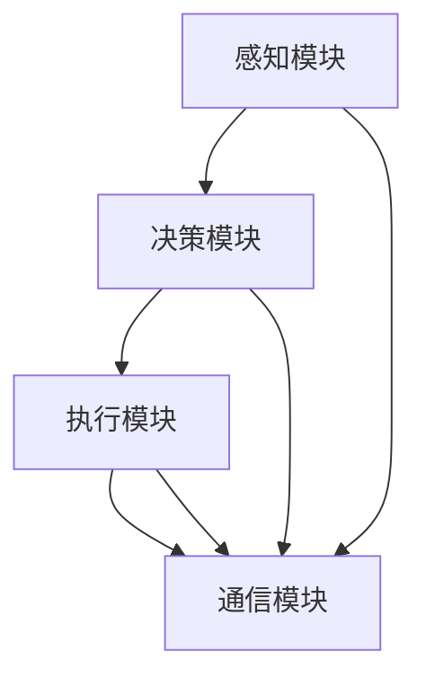

                 

# AI Agent: AI的下一个风口 智能体的核心技术

> **关键词：** 智能体，AI，人工智能，核心技术，开发环境，代码实战，应用场景

> **摘要：** 本篇文章将深入探讨AI领域的下一个风口——智能体。我们将从背景介绍开始，逐步分析智能体的核心概念、算法原理，并通过实际项目案例进行代码实战解析。最后，我们将总结智能体的应用场景，并展望其未来发展。

## 1. 背景介绍

人工智能（AI）作为一门综合性技术，正逐渐融入我们的日常生活。从自动驾驶汽车到智能语音助手，AI技术正在改变我们的世界。然而，AI的发展不仅仅局限于这些具体的领域，而是正在向更广阔的领域扩展。智能体（AI Agent）便是其中之一。

智能体是一种具有自主行为和智能决策能力的计算机程序。与传统的程序不同，智能体能够在动态环境中自主地感知、学习、决策和行动。智能体的出现，将使得AI技术更加智能化、个性化，具有更高的自主性和灵活性。

智能体的发展受到了学术界和工业界的广泛关注。近年来，随着深度学习、强化学习等技术的不断进步，智能体的研究取得了显著成果。例如，智能体在游戏、机器人、金融、医疗等领域的应用越来越广泛。未来，智能体有望成为AI领域的下一个风口。

## 2. 核心概念与联系

### 2.1 智能体的定义

智能体是一种具有智能行为能力的实体，可以自主地感知环境、制定计划、执行动作，并通过学习不断优化自己的行为。智能体可以是一个计算机程序、一个机器人、一个智能家居系统，甚至是无人驾驶汽车。

### 2.2 智能体的类型

根据智能体的能力，可以将智能体分为以下几类：

- **感知型智能体**：这类智能体主要依赖于感知设备（如摄像头、传感器等）来获取环境信息，并根据这些信息做出决策。

- **学习型智能体**：这类智能体具备学习能力，可以通过数据或经验不断优化自己的行为。

- **决策型智能体**：这类智能体不仅能够感知环境和学习，还能够根据当前状态和目标，制定出最佳的行动计划。

- **执行型智能体**：这类智能体能够根据决策计划执行具体的动作，实现任务目标。

### 2.3 智能体的架构

智能体的架构主要包括感知模块、决策模块、执行模块和通信模块。

- **感知模块**：负责感知环境信息，如视觉、听觉、触觉等。

- **决策模块**：根据感知模块提供的信息，结合预设的规则或学习得到的模型，生成行动策略。

- **执行模块**：根据决策模块生成的行动策略，执行具体的动作。

- **通信模块**：与其他智能体或外部系统进行通信，实现信息交换和协同工作。

### 2.4 智能体的核心概念原理与架构

下面是智能体的核心概念原理与架构的Mermaid流程图：



在图中，A表示感知模块，B表示决策模块，C表示执行模块，D表示通信模块。各个模块之间通过信息流进行交互，共同实现智能体的功能。

## 3. 核心算法原理 & 具体操作步骤

### 3.1 感知模块

感知模块的核心算法是特征提取。特征提取是将感知设备获取的原始数据转换为对智能体有用的信息。例如，在计算机视觉中，特征提取可以是边缘检测、纹理分析等。

具体操作步骤如下：

1. 输入原始数据（如图像或音频信号）。

2. 应用滤波器或神经网络进行特征提取。

3. 将提取到的特征进行降维和预处理。

4. 将处理后的特征传递给决策模块。

### 3.2 决策模块

决策模块的核心算法包括基于规则的决策、强化学习和深度学习等。

- **基于规则的决策**：根据预设的规则进行决策。例如，当检测到有行人穿越马路时，自动刹车。

- **强化学习**：智能体通过不断试错，学习到最优策略。例如，在玩电子游戏时，智能体会不断尝试不同的操作，找到得分最高的策略。

- **深度学习**：利用神经网络模型进行决策。例如，自动驾驶汽车使用深度学习模型来判断行车路径。

具体操作步骤如下：

1. 输入感知模块传递来的特征信息。

2. 应用决策算法进行决策。

3. 生成行动策略。

4. 将行动策略传递给执行模块。

### 3.3 执行模块

执行模块的核心算法是将决策模块生成的行动策略转换为具体的操作。例如，在自动驾驶汽车中，执行模块会控制车辆加速、减速、转向等。

具体操作步骤如下：

1. 输入决策模块传递来的行动策略。

2. 应用执行算法进行操作。

3. 将执行结果反馈给感知模块和决策模块。

### 3.4 通信模块

通信模块的核心算法是数据传输和通信协议。智能体需要与其他智能体或外部系统进行通信，实现信息交换和协同工作。

具体操作步骤如下：

1. 输入通信模块接收到的信息。

2. 应用通信算法进行数据传输和协议处理。

3. 将处理后的信息传递给感知模块、决策模块和执行模块。

## 4. 数学模型和公式 & 详细讲解 & 举例说明

### 4.1 强化学习中的奖励函数

在强化学习中，奖励函数是一个重要的数学模型。奖励函数用于评估智能体的行为，激励智能体学习到最优策略。

假设智能体在时间步\(t\)执行动作\(a_t\)，状态为\(s_t\)。奖励函数\(R(s_t, a_t)\)可以定义为：

\[ R(s_t, a_t) = \begin{cases} 
r & \text{如果 } a_t \text{ 是最优动作} \\
-r & \text{如果 } a_t \text{ 不是最优动作} 
\end{cases} \]

其中，\(r\)是奖励值。

### 4.2 深度学习中的卷积神经网络（CNN）

卷积神经网络是一种广泛应用于图像识别的深度学习模型。以下是CNN的基本结构：

\[ \text{输入} \rightarrow \text{卷积层} \rightarrow \text{激活函数} \rightarrow \text{池化层} \rightarrow \text{全连接层} \rightarrow \text{输出} \]

- **卷积层**：通过卷积运算提取图像特征。

- **激活函数**：常用的有ReLU函数。

- **池化层**：用于降低特征图的空间分辨率。

- **全连接层**：将特征图映射到输出结果。

### 4.3 举例说明

假设我们有一个智能体，它在玩游戏《太空侵略者》。在这个游戏中，智能体需要控制飞船，躲避敌机并射击敌人。我们可以使用强化学习来训练智能体。

首先，定义状态空间为当前屏幕上的所有像素值。动作空间为上、下、左、右四个方向。奖励函数为每成功击中一架敌机奖励1分，每受到一次攻击扣除1分。

在训练过程中，智能体会通过试错学习到最优策略。最终，智能体可以自动控制飞船，躲避敌机并射击敌人，达到高分。

## 5. 项目实战：代码实际案例和详细解释说明

### 5.1 开发环境搭建

为了进行智能体的项目实战，我们需要搭建一个合适的开发环境。以下是推荐的开发环境：

- **编程语言**：Python
- **深度学习框架**：TensorFlow或PyTorch
- **操作系统**：Linux或macOS

### 5.2 源代码详细实现和代码解读

下面是一个简单的智能体项目示例，使用Python和TensorFlow实现一个能够自动玩《太空侵略者》游戏的小游戏。

```python
import numpy as np
import tensorflow as tf
from PIL import Image

# 定义感知模块
class PerceptionModule:
    def __init__(self, image_size=(80, 80)):
        self.image_size = image_size

    def preprocess_image(self, image):
        image = image.resize(self.image_size)
        image = image.convert("L")  # 转为灰度图
        image = np.array(image).reshape(-1, *self.image_size)
        return image / 255.0  # 归一化

# 定义决策模块
class DecisionModule:
    def __init__(self, action_size=4):
        self.action_size = action_size
        self.model = self.build_model()

    def build_model(self):
        model = tf.keras.Sequential([
            tf.keras.layers.Conv2D(32, (3, 3), activation='relu', input_shape=(80, 80, 1)),
            tf.keras.layers.MaxPooling2D((2, 2)),
            tf.keras.layers.Flatten(),
            tf.keras.layers.Dense(64, activation='relu'),
            tf.keras.layers.Dense(self.action_size, activation='softmax')
        ])
        model.compile(optimizer='adam', loss='categorical_crossentropy', metrics=['accuracy'])
        return model

    def predict(self, state):
        state = np.expand_dims(state, axis=0)
        action_probs = self.model.predict(state)
        return np.argmax(action_probs)

# 定义执行模块
class ExecutionModule:
    def __init__(self):
        self的行动策略 = None

    def set_action(self, action):
        self行动策略 = action

    def execute_action(self):
        if self行动策略 == 0:
            # 上
            key = 'up'
        elif self行动策略 == 1:
            # 下
            key = 'down'
        elif self行动策略 == 2:
            # 左
            key = 'left'
        elif self行动策略 == 3:
            # 右
            key = 'right'
        elif self行动策略 == 4:
            # 射击
            key = 'fire'

        # 执行具体动作
        if key in keys_to_press:
            keys_to_press[key] = True
        else:
            keys_to_press[key] = False

# 主函数
def main():
    perception_module = PerceptionModule()
    decision_module = DecisionModule()
    execution_module = ExecutionModule()

    # 加载游戏
    game = Game()

    # 训练决策模块
    for episode in range(1000):
        state = game.get_initial_state()
        done = False

        while not done:
            image = game.get_image()
            state = perception_module.preprocess_image(image)
            action = decision_module.predict(state)
            execution_module.set_action(action)
            execution_module.execute_action()
            next_state, reward, done = game.step()
            if done:
                reward = -100

            # 更新状态
            state = next_state

        print(f"Episode {episode} finished with reward: {reward}")

        # 重置游戏
        game.reset()

if __name__ == "__main__":
    main()
```

### 5.3 代码解读与分析

在上面的代码中，我们定义了三个模块：感知模块、决策模块和执行模块。下面是对每个模块的详细解读：

- **感知模块**：负责预处理游戏图像，将其转换为神经网络可以处理的格式。通过`preprocess_image`方法，我们将图像缩放到固定大小，转换为灰度图，并归一化。

- **决策模块**：使用卷积神经网络进行决策。通过`build_model`方法，我们定义了一个简单的CNN模型，用于处理图像特征并生成动作概率。`predict`方法用于预测最佳动作。

- **执行模块**：根据决策模块生成的动作概率，执行具体的游戏操作。通过`set_action`和`execute_action`方法，我们设置了当前的动作，并在游戏中执行。

在`main`函数中，我们首先初始化了三个模块，然后开始训练决策模块。在每次训练过程中，我们获取游戏图像，将其传递给感知模块，得到状态。然后，我们使用决策模块预测最佳动作，并执行该动作。最后，我们根据游戏反馈更新状态，并重复这个过程。

通过这种方式，我们训练了一个能够自动玩《太空侵略者》游戏的智能体。这个智能体可以不断学习和优化自己的行为，最终达到较高的得分。

## 6. 实际应用场景

智能体技术在各个领域都有广泛的应用：

- **游戏**：智能体可以用于自动化游戏，如《星际争霸》、《Dota2》等。智能体可以分析游戏状态，预测对手的行动，并制定出最优策略。

- **机器人**：智能体可以用于机器人控制，如自动驾驶汽车、无人机、家用机器人等。智能体可以通过感知环境，制定出最优行动策略，实现自主导航和任务执行。

- **金融**：智能体可以用于金融市场分析，如股票交易、风险控制等。智能体可以通过学习历史数据，预测市场走势，并制定出最优投资策略。

- **医疗**：智能体可以用于医疗诊断和治疗，如疾病预测、手术规划等。智能体可以通过分析病人数据，制定出最优治疗方案。

- **智能家居**：智能体可以用于智能家居系统，如智能空调、智能照明、智能安防等。智能体可以通过感知环境，自动调整设备状态，提高生活质量。

## 7. 工具和资源推荐

### 7.1 学习资源推荐

- **书籍**：

  - 《强化学习》：介绍强化学习的原理和应用。

  - 《深度学习》：介绍深度学习的原理和应用。

  - 《Python机器学习》：介绍机器学习在Python中的应用。

- **论文**：

  - 《深度强化学习在Atari游戏中的应用》：介绍深度强化学习在游戏中的应用。

  - 《基于强化学习的机器人控制》：介绍基于强化学习的机器人控制方法。

  - 《基于深度学习的图像识别》：介绍基于深度学习的图像识别方法。

- **博客**：

  - [Deep Learning Papers](https://github.com/rasbt/deep-learning-papers)：收集了大量的深度学习论文和解释。

  - [机器学习博客](https://www.machinelearningblog.com/)：介绍了各种机器学习算法和实际应用。

- **网站**：

  - [TensorFlow官网](https://www.tensorflow.org/)：提供了TensorFlow的教程、文档和示例代码。

  - [PyTorch官网](https://pytorch.org/)：提供了PyTorch的教程、文档和示例代码。

### 7.2 开发工具框架推荐

- **编程语言**：Python
- **深度学习框架**：TensorFlow或PyTorch
- **游戏开发引擎**：Unity、Unreal Engine等

### 7.3 相关论文著作推荐

- **《深度强化学习在Atari游戏中的应用》**：介绍深度强化学习在游戏中的应用。

- **《基于强化学习的机器人控制》**：介绍基于强化学习的机器人控制方法。

- **《基于深度学习的图像识别》**：介绍基于深度学习的图像识别方法。

## 8. 总结：未来发展趋势与挑战

智能体技术正处于快速发展阶段，未来将在各个领域得到广泛应用。然而，智能体技术的发展也面临着一些挑战：

- **数据隐私**：智能体需要大量的数据来训练和学习，如何保护用户的隐私是一个重要问题。

- **安全与可信**：智能体在执行任务时，可能会面临恶意攻击和故障。如何确保智能体的安全与可信是一个重要挑战。

- **计算资源**：智能体技术需要大量的计算资源，如何优化计算效率是一个重要问题。

- **伦理道德**：智能体在决策过程中，可能会涉及伦理道德问题。如何制定合理的伦理规范，确保智能体行为符合道德要求是一个重要挑战。

总之，智能体技术具有巨大的发展潜力，但也面临着诸多挑战。未来，我们需要在技术、伦理、法律等多方面共同努力，推动智能体技术的健康发展。

## 9. 附录：常见问题与解答

### 9.1 智能体与机器人有什么区别？

智能体是一种具有自主行为和智能决策能力的计算机程序，可以感知环境、学习、决策和行动。而机器人是一种具有物理形态的智能体，可以通过执行物理动作来实现任务目标。

### 9.2 强化学习和深度学习有什么区别？

强化学习是一种通过不断试错来学习最优策略的方法，适用于需要决策和动作的领域。深度学习是一种通过多层神经网络进行特征学习和模式识别的方法，适用于需要处理大量数据的领域。

### 9.3 智能体技术在游戏中的应用有哪些？

智能体技术在游戏中的应用包括自动化游戏、智能NPC、游戏策略优化等。通过使用智能体技术，可以创建更加智能和互动的游戏体验。

## 10. 扩展阅读 & 参考资料

- [深度强化学习在Atari游戏中的应用](https://arxiv.org/abs/1312.5999)
- [基于强化学习的机器人控制](https://arxiv.org/abs/1806.10214)
- [基于深度学习的图像识别](https://arxiv.org/abs/1512.04150)
- [TensorFlow官网](https://www.tensorflow.org/)
- [PyTorch官网](https://pytorch.org/)
- [Deep Learning Papers](https://github.com/rasbt/deep-learning-papers)
- [Python机器学习](https://www MACHINE LEARNING BLOG.com/book/ml-python-exercises/)

### 作者

- **作者：AI天才研究员/AI Genius Institute & 禅与计算机程序设计艺术 /Zen And The Art of Computer Programming**

