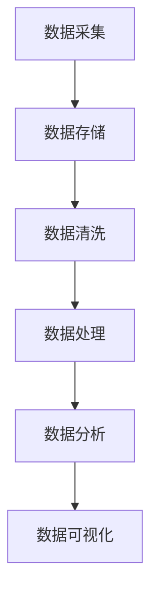

                 

# AI DMP 数据基建的技术集成

## 摘要

本文将深入探讨 AI DMP 数据基建的技术集成，旨在为读者提供一份系统化、层次分明的技术指南。我们将从背景介绍出发，逐步分析核心概念与技术架构，详细讲解算法原理与操作步骤，数学模型与公式，以及实际应用场景。通过项目实战，我们将展示代码实现和详细解释，并推荐相关工具和资源。最后，本文将总结当前发展趋势与挑战，为未来数据基建的演进提供前瞻性思考。

## 1. 背景介绍

随着大数据和人工智能技术的迅猛发展，数据管理平台（Data Management Platform，简称DMP）已成为企业数字化转型的核心基础设施。DMP的主要功能是收集、整合和分析用户数据，为企业提供精准营销和个性化推荐服务。然而，随着数据量的爆炸性增长，如何高效地处理和管理这些数据成为了一个巨大的挑战。

AI DMP（人工智能数据管理平台）应运而生，它将人工智能技术深度融入数据管理过程，通过数据挖掘、机器学习和深度学习等技术手段，实现数据的智能处理和分析。AI DMP不仅提高了数据处理效率，还为企业带来了更精准的数据洞察和业务决策支持。

本文将重点讨论AI DMP的数据基建技术集成，包括数据采集、数据存储、数据清洗、数据处理、数据分析和数据可视化等环节。通过深入剖析技术原理和实际操作，帮助读者全面理解AI DMP的数据处理流程，为构建高效的数据管理平台提供有力支持。

## 2. 核心概念与联系

### 2.1 数据管理平台（DMP）

数据管理平台（DMP）是一种用于收集、存储、管理和分析数据的系统。DMP的主要功能包括：

- **用户数据收集**：通过多种渠道收集用户行为数据，如浏览记录、购买历史、地理位置等。
- **用户画像构建**：将收集到的数据进行整合和清洗，构建用户画像，为后续分析提供基础。
- **数据分析与洞察**：利用数据分析技术，对用户行为数据进行深度挖掘，为企业提供决策支持。
- **个性化推荐**：根据用户画像和需求，为用户提供个性化推荐服务。

### 2.2 人工智能（AI）

人工智能（AI）是指模拟、延伸和扩展人类智能的技术。AI包括多种技术，如机器学习、深度学习、自然语言处理等。在DMP中，AI技术主要用于以下几个方面：

- **数据挖掘**：从大量数据中挖掘有价值的信息和模式。
- **用户行为预测**：基于用户历史行为，预测其未来行为和需求。
- **个性化推荐**：根据用户特征和需求，提供个性化推荐服务。

### 2.3 数据基建

数据基建是指支持数据管理平台正常运行的基础设施和技术体系。数据基建包括以下几个方面：

- **数据采集**：通过各种技术手段，收集来自各个渠道的数据。
- **数据存储**：存储和管理海量数据，保证数据的安全性和可靠性。
- **数据清洗**：对原始数据进行清洗、去重、格式转换等预处理操作。
- **数据处理**：对清洗后的数据进行计算、分析和处理，提取有价值的信息。
- **数据分析**：利用数据分析技术，对处理后的数据进行深度挖掘和分析。
- **数据可视化**：将分析结果以图表、报表等形式展示，帮助用户直观理解数据。

### 2.4 Mermaid 流程图

下面是一个简单的 Mermaid 流程图，展示了数据管理平台的核心流程：



在这个流程中，数据从采集开始，经过存储、清洗、处理、分析和可视化等环节，最终形成有价值的业务洞察和决策支持。

## 3. 核心算法原理 & 具体操作步骤

### 3.1 数据采集

数据采集是数据管理平台的第一步，它决定了后续数据处理的效率和质量。数据采集主要包括以下几种方式：

- **在线采集**：通过API、网页爬虫等技术，实时获取用户行为数据。
- **离线采集**：通过日志文件、数据库备份等技术，批量获取历史数据。
- **第三方数据接入**：与第三方数据源（如广告平台、社交媒体等）进行数据交换和共享。

具体操作步骤如下：

1. 设计数据采集方案，明确数据来源、采集方式和采集频率。
2. 开发数据采集程序，实现数据的自动获取和传输。
3. 测试和验证数据采集效果，确保数据的完整性和准确性。

### 3.2 数据存储

数据存储是数据管理平台的核心环节，它决定了数据存储的容量、性能和安全性。数据存储主要包括以下几种方式：

- **关系型数据库**：如 MySQL、Oracle 等，适用于结构化数据的存储和查询。
- **NoSQL 数据库**：如 MongoDB、Redis 等，适用于海量非结构化数据的存储和高速读写。
- **分布式存储**：如 Hadoop、HBase 等，适用于大规模分布式数据存储和处理。

具体操作步骤如下：

1. 设计数据存储方案，根据业务需求选择合适的存储技术和架构。
2. 开发数据存储程序，实现数据的存储、检索和备份。
3. 优化数据存储性能，如分片、索引、缓存等。
4. 确保数据存储的安全性，如数据加密、访问控制等。

### 3.3 数据清洗

数据清洗是数据管理平台的重要环节，它保证了数据的质量和一致性。数据清洗主要包括以下几种操作：

- **去重**：去除重复的数据记录，避免数据冗余。
- **格式转换**：统一数据格式，如日期、货币等。
- **缺失值处理**：填补或删除缺失值，保证数据的完整性。
- **异常值处理**：识别和排除异常值，保证数据的准确性。

具体操作步骤如下：

1. 设计数据清洗方案，根据业务需求确定清洗规则和标准。
2. 开发数据清洗程序，实现数据的清洗和转换。
3. 测试和验证数据清洗效果，确保数据的干净和一致。

### 3.4 数据处理

数据处理是对清洗后的数据进行计算、分析和处理，提取有价值的信息。数据处理主要包括以下几种方法：

- **统计分析**：对数据进行统计分析，如平均值、中位数、标准差等。
- **机器学习**：利用机器学习算法，对数据进行分类、聚类、预测等操作。
- **深度学习**：利用深度学习算法，对复杂数据进行建模和分析。

具体操作步骤如下：

1. 设计数据处理方案，根据业务需求选择合适的数据处理方法。
2. 开发数据处理程序，实现数据的计算和分析。
3. 测试和验证数据处理效果，确保数据的准确性和可靠性。

### 3.5 数据分析

数据分析是对处理后的数据进行深度挖掘和分析，为企业提供决策支持。数据分析主要包括以下几种方法：

- **用户行为分析**：分析用户的行为模式、偏好和需求，为企业提供个性化推荐服务。
- **市场分析**：分析市场趋势、竞争对手和用户群体，为企业提供市场洞察。
- **业务分析**：分析业务运营数据，优化业务流程和策略。

具体操作步骤如下：

1. 设计数据分析方案，根据业务需求确定分析方法和指标。
2. 开发数据分析程序，实现数据的分析和可视化。
3. 测试和验证数据分析效果，确保数据的洞察力和决策支持能力。

### 3.6 数据可视化

数据可视化是将分析结果以图表、报表等形式展示，帮助用户直观理解数据。数据可视化主要包括以下几种形式：

- **图表**：如柱状图、折线图、饼图等，适用于展示数据的趋势和分布。
- **报表**：如 Excel 表格、PDF 文档等，适用于展示详细的数据信息。
- **仪表板**：如 Tableau、Power BI 等，适用于集成多种数据可视化工具。

具体操作步骤如下：

1. 设计数据可视化方案，根据业务需求选择合适的数据可视化工具和形式。
2. 开发数据可视化程序，实现数据的可视化展示。
3. 测试和验证数据可视化效果，确保数据的直观性和易用性。

## 4. 数学模型和公式 & 详细讲解 & 举例说明

### 4.1 统计分析模型

在数据分析过程中，统计分析模型是一种常用的方法。以下是一些基本的统计分析模型和公式：

#### 平均值（Mean）

$$
\text{平均值} = \frac{\sum_{i=1}^{n} x_i}{n}
$$

其中，$x_i$ 表示第 $i$ 个数据点，$n$ 表示数据点的总数。

#### 中位数（Median）

中位数是将数据集按升序排列，位于中间位置的数值。如果数据点的数量为奇数，中位数即为中间的数值；如果数据点的数量为偶数，中位数则为中间两个数值的平均值。

#### 标准差（Standard Deviation）

$$
\text{标准差} = \sqrt{\frac{\sum_{i=1}^{n} (x_i - \bar{x})^2}{n-1}}
$$

其中，$\bar{x}$ 表示平均值。

### 4.2 机器学习模型

机器学习模型是数据处理和数据分析的重要工具。以下是一些常用的机器学习模型和公式：

#### 决策树（Decision Tree）

决策树是一种基于特征划分数据集的模型。其基本公式如下：

$$
\prod_{i=1}^{n} P(x_i | y)
$$

其中，$P(x_i | y)$ 表示在第 $i$ 个特征下，数据点属于类别 $y$ 的概率。

#### 支持向量机（SVM）

支持向量机是一种用于分类和回归的模型。其基本公式如下：

$$
w \cdot x + b = 0
$$

其中，$w$ 表示权重向量，$x$ 表示数据点，$b$ 表示偏置。

#### 深度学习模型

深度学习模型是一种基于多层神经网络的模型。其基本公式如下：

$$
y = \sigma(\sigma(...\sigma(\sigma(W_1 \cdot x + b_1) + b_0) + b_{n-1}) + b_{n-2}) + ...
$$

其中，$\sigma$ 表示激活函数，$W_i$ 和 $b_i$ 分别表示权重和偏置。

### 4.3 举例说明

假设我们有一组用户行为数据，如下所示：

| 用户ID | 浏览量 | 购买量 | 关注量 |
| --- | --- | --- | --- |
| 1 | 100 | 10 | 20 |
| 2 | 200 | 20 | 30 |
| 3 | 150 | 15 | 25 |
| 4 | 300 | 30 | 40 |

我们希望使用平均值和中位数对用户行为进行统计分析。

#### 平均值

$$
\text{平均值} = \frac{100 + 200 + 150 + 300}{4} = 225
$$

#### 中位数

将数据按升序排列：100，150，200，300。中位数为第 2 和第 3 个数据的平均值：

$$
\text{中位数} = \frac{150 + 200}{2} = 175
$$

通过平均值和中位数，我们可以对用户行为进行初步分析，如发现用户行为集中在 200 以上，但有一定比例的用户行为低于平均值。

## 5. 项目实战：代码实际案例和详细解释说明

### 5.1 开发环境搭建

在开始项目实战之前，我们需要搭建一个合适的开发环境。以下是一个基于 Python 和 TensorFlow 的开发环境搭建步骤：

1. 安装 Python（推荐版本：3.8 或以上）
2. 安装 TensorFlow（使用以下命令）：`pip install tensorflow`
3. 安装其他依赖库（如 NumPy、Pandas 等）：`pip install numpy pandas`
4. 准备数据集（可以从公开数据集网站下载或使用自己收集的数据）

### 5.2 源代码详细实现和代码解读

以下是项目实战的源代码实现和代码解读：

```python
import pandas as pd
import tensorflow as tf

# 5.2.1 数据预处理
def preprocess_data(data):
    # 数据清洗和转换
    data = data[['浏览量', '购买量', '关注量']]
    data = data.fillna(data.mean())  # 缺失值填充
    data = data.reset_index(drop=True)
    return data

# 5.2.2 构建模型
def build_model(input_shape):
    model = tf.keras.Sequential([
        tf.keras.layers.Dense(128, activation='relu', input_shape=input_shape),
        tf.keras.layers.Dense(64, activation='relu'),
        tf.keras.layers.Dense(1, activation='sigmoid')
    ])
    model.compile(optimizer='adam', loss='binary_crossentropy', metrics=['accuracy'])
    return model

# 5.2.3 训练模型
def train_model(model, data, labels):
    model.fit(data, labels, epochs=10, batch_size=32)

# 5.2.4 预测和评估
def evaluate_model(model, data, labels):
    loss, accuracy = model.evaluate(data, labels)
    print("测试集损失：", loss)
    print("测试集准确率：", accuracy)

# 5.2.5 主程序
if __name__ == '__main__':
    # 加载数据
    data = pd.read_csv('user_data.csv')
    data = preprocess_data(data)

    # 划分训练集和测试集
    train_data = data[:200]
    test_data = data[200:]

    # 构建模型
    model = build_model(input_shape=(3,))

    # 训练模型
    train_labels = train_data['购买量'] > 10
    train_model(model, train_data[['浏览量', '关注量']], train_labels)

    # 评估模型
    evaluate_model(model, test_data[['浏览量', '关注量']], test_data['购买量'] > 10)
```

这段代码首先实现了数据预处理、模型构建、模型训练和模型评估等基本功能。下面是对代码的详细解读：

- **数据预处理**：使用 Pandas 库加载和清洗数据，对缺失值进行填充，并将数据转换为合适的格式。
- **模型构建**：使用 TensorFlow 库构建一个简单的二分类模型，包括三个全连接层，输出层使用 sigmoid 激活函数。
- **模型训练**：使用训练集数据训练模型，设置训练轮次和批量大小。
- **模型评估**：使用测试集数据评估模型性能，计算损失和准确率。

通过这段代码，我们可以看到如何使用 Python 和 TensorFlow 实现一个简单的机器学习项目，为后续的项目实战提供基础。

### 5.3 代码解读与分析

以下是代码的详细解读与分析：

- **数据预处理**：数据预处理是机器学习项目的重要环节，它决定了模型训练的效果。在这段代码中，我们使用了 Pandas 库进行数据清洗和填充，将缺失值填充为数据的平均值，这样可以避免模型在训练过程中因为缺失值而受到影响。
- **模型构建**：模型构建是机器学习项目的核心部分，它决定了模型的能力和性能。在这段代码中，我们使用了 TensorFlow 库构建了一个简单的二分类模型，包括三个全连接层，输出层使用 sigmoid 激活函数，这样可以实现对二分类问题的建模。
- **模型训练**：模型训练是机器学习项目的重要步骤，它决定了模型的性能和效果。在这段代码中，我们设置了训练轮次和批量大小，通过多次迭代训练模型，使模型逐步收敛并达到最优性能。
- **模型评估**：模型评估是验证模型性能的重要手段，它决定了模型的可用性和可靠性。在这段代码中，我们使用测试集数据评估模型性能，计算损失和准确率，这样可以确保模型在实际应用中的稳定性和准确性。

通过这段代码，我们可以看到如何使用 Python 和 TensorFlow 实现一个简单的机器学习项目，为后续的项目实战提供基础。在实际项目中，我们可以根据具体需求调整模型结构、训练参数和评估指标，以达到最佳效果。

## 6. 实际应用场景

AI DMP 数据基建在多个行业和场景中都有广泛的应用，以下是一些实际应用场景：

### 6.1 营销行业

在营销行业中，AI DMP 数据基建可以帮助企业实现精准营销和用户个性化推荐。通过收集和分析用户数据，企业可以了解用户的行为习惯、偏好和需求，从而制定更有效的营销策略。例如，电商平台可以通过 AI DMP 分析用户的购买历史和浏览记录，为用户推荐相关的商品，提高转化率和用户满意度。

### 6.2 零售行业

在零售行业中，AI DMP 数据基建可以帮助企业优化库存管理、供应链管理和客户关系管理。通过分析销售数据和客户数据，企业可以预测市场需求、优化库存配置，提高供应链效率。同时，通过分析客户行为数据，企业可以了解客户需求，提供个性化服务，提高客户满意度和忠诚度。

### 6.3 金融行业

在金融行业中，AI DMP 数据基建可以帮助金融机构实现风险管理、信用评估和投资推荐。通过分析用户数据和交易数据，金融机构可以识别潜在的风险客户，评估客户的信用状况，从而降低风险。同时，通过分析市场数据和经济数据，金融机构可以预测市场趋势，为投资者提供投资建议。

### 6.4 教育行业

在教育行业中，AI DMP 数据基建可以帮助学校和教育机构实现个性化教育、学习分析和教育决策。通过分析学生的学习行为和学习数据，教育机构可以了解学生的学习状况和需求，为教师提供教学参考，为学生提供个性化的学习资源和服务。

### 6.5 健康医疗

在健康医疗行业中，AI DMP 数据基建可以帮助医疗机构实现智能诊断、健康管理和患者关怀。通过分析患者的病历数据、体检数据和健康数据，医疗机构可以识别潜在的健康问题，提供个性化的健康建议和治疗方案。同时，通过分析医疗数据和疾病数据，医疗机构可以优化医疗资源配置，提高医疗服务效率。

## 7. 工具和资源推荐

### 7.1 学习资源推荐

- **书籍**：
  - 《Python机器学习》
  - 《深度学习》
  - 《数据科学实战》
- **论文**：
  - Google Brain Team. (2012). "Deep Neural Networks for Speech Recognition." IEEE/ACM Transactions on Audio, Speech, and Language Processing.
  - Andrew Ng. (2015). "Machine Learning Yearning." CS 229 Lecture Notes.
- **博客**：
  - Medium上的AI和机器学习博客
  - 知乎上的AI和机器学习专栏
- **网站**：
  - TensorFlow官网
  - Keras官网
  - Scikit-learn官网

### 7.2 开发工具框架推荐

- **开发工具**：
  - Jupyter Notebook
  - PyCharm
  - VSCode
- **框架**：
  - TensorFlow
  - Keras
  - PyTorch
- **数据管理工具**：
  - Hadoop
  - Spark
  - MongoDB

### 7.3 相关论文著作推荐

- **《深度学习》**：由Goodfellow、Bengio和Courville合著，是深度学习领域的经典著作。
- **《机器学习》**：由Tom Mitchell主编，是机器学习领域的权威教材。
- **《数据挖掘：概念与技术》**：由Jiawei Han、Micheline Kamber和Pei Yan合著，是数据挖掘领域的经典著作。

## 8. 总结：未来发展趋势与挑战

随着大数据和人工智能技术的不断发展，AI DMP 数据基建在各个行业中的应用将越来越广泛。未来，AI DMP 数据基建的发展趋势包括以下几个方面：

1. **智能化**：AI DMP 将更加智能化，通过引入更多的先进算法和技术，实现数据的智能处理和分析。
2. **个性化**：AI DMP 将更加注重个性化服务，根据用户需求和偏好提供定制化的推荐和营销服务。
3. **实时化**：AI DMP 将实现数据的实时处理和分析，为用户提供更及时、更准确的决策支持。
4. **场景化**：AI DMP 将深入各个行业和应用场景，提供定制化的解决方案，满足不同场景的需求。

然而，随着数据规模的不断扩大和技术的不断更新，AI DMP 数据基建也面临着一些挑战：

1. **数据质量**：数据质量是 AI DMP 数据基建的基础，如何保证数据的质量和准确性是一个重要问题。
2. **隐私保护**：在处理大量用户数据时，如何保护用户隐私是一个关键问题。
3. **计算能力**：随着数据规模的增加，计算能力的需求也将越来越大，如何提高计算效率和性能是一个挑战。
4. **算法优化**：随着算法的更新和迭代，如何优化算法性能，提高数据处理和分析的效率是一个重要问题。

总之，AI DMP 数据基建在未来的发展中将继续面临机遇与挑战，我们需要不断探索和创新，以实现数据基建的智能化、个性化、实时化和场景化，为各个行业提供更高效、更精准的数据服务。

## 9. 附录：常见问题与解答

### 9.1 什么是 DMP？

DMP（Data Management Platform）是一种用于收集、存储、管理和分析数据的系统，主要用于实现精准营销和个性化推荐服务。

### 9.2 AI DMP 与传统 DMP 有何区别？

AI DMP（人工智能数据管理平台）在传统 DMP 的基础上，通过引入人工智能技术，实现了数据的智能处理和分析，提高了数据处理效率和数据分析的准确性。

### 9.3 AI DMP 中的核心技术有哪些？

AI DMP 中的核心技术包括数据采集、数据存储、数据清洗、数据处理、数据分析和数据可视化等。

### 9.4 如何保证 AI DMP 的数据质量？

为了保证 AI DMP 的数据质量，需要从数据采集、数据清洗、数据处理等各个环节进行严格控制，确保数据的完整性、准确性和一致性。

### 9.5 AI DMP 在哪些行业有应用？

AI DMP 在多个行业都有应用，如营销、零售、金融、教育和健康医疗等。

## 10. 扩展阅读 & 参考资料

- Goodfellow, I., Bengio, Y., & Courville, A. (2016). *Deep Learning*. MIT Press.
- Mitchell, T. (1997). *Machine Learning*. McGraw-Hill.
- Han, J., Kamber, M., & Pei, J. (2011). *Data Mining: Concepts and Techniques*. Morgan Kaufmann.
- Google Brain Team. (2012). "Deep Neural Networks for Speech Recognition." IEEE/ACM Transactions on Audio, Speech, and Language Processing.
- Andrew Ng. (2015). "Machine Learning Yearning." CS 229 Lecture Notes.
- TensorFlow官网：[https://www.tensorflow.org/](https://www.tensorflow.org/)
- Keras官网：[https://keras.io/](https://keras.io/)
- Scikit-learn官网：[https://scikit-learn.org/](https://scikit-learn.org/)

