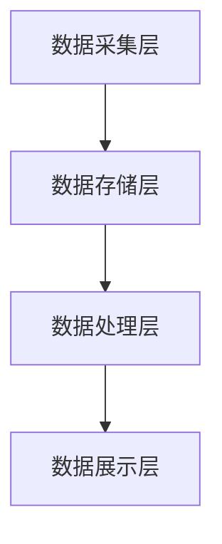

                 

# AI DMP 数据基建：从数据到洞察，再到行动

## 摘要

本文将探讨AI DMP（数据管理平台）在现代商业环境中的重要性，并详细介绍其构建、核心算法和数学模型、实际应用场景以及未来发展趋势。通过本文的阅读，读者将全面了解AI DMP在数据驱动决策和业务增长中的关键作用，学会如何从数据中提取洞察，并将其转化为实际行动。

## 1. 背景介绍

在当今数字化时代，数据已成为企业最宝贵的资产。然而，数据的价值并非仅仅体现在其存储和积累上，而是如何有效地管理和利用这些数据，以实现业务增长和竞争优势。AI DMP（数据管理平台）正是为了解决这一问题而诞生的一种创新技术。

AI DMP是一种基于人工智能和大数据分析的技术，旨在帮助企业实现数据驱动的决策。它通过整合和分析各种来源的数据，为用户提供深度洞察，从而帮助企业更好地了解其用户、市场趋势和业务机会。随着数据量的不断增长和复杂性的增加，AI DMP的重要性日益凸显。

本文将首先介绍AI DMP的基本概念和原理，然后详细探讨其核心算法、数学模型和实际应用场景。最后，我们将展望AI DMP的未来发展趋势和面临的挑战，以帮助读者更好地理解这一技术的前景和应用。

## 2. 核心概念与联系

### 2.1 AI DMP的基本概念

AI DMP，即人工智能数据管理平台，是一种基于人工智能技术的数据管理解决方案。它通过整合和分析海量数据，为用户提供个性化的洞察和决策支持。AI DMP的核心功能包括：

1. **数据采集与整合**：从各种数据源（如用户行为数据、社交媒体数据、交易数据等）中采集数据，并将其整合到一个统一的数据仓库中。
2. **数据清洗与预处理**：对采集到的数据进行清洗、去噪和格式转换，以确保数据的质量和一致性。
3. **数据分析与建模**：利用人工智能算法对数据进行分析和建模，提取用户画像、市场趋势和业务机会等深度洞察。
4. **数据可视化与报告**：通过数据可视化技术，将分析结果以图表、报表等形式呈现给用户，帮助其更好地理解数据背后的含义。

### 2.2 AI DMP与相关技术的联系

AI DMP是大数据技术和人工智能技术的深度融合。它涉及到以下关键技术：

1. **大数据技术**：包括数据采集、存储、处理和分析等环节。Hadoop、Spark等大数据技术为AI DMP提供了强大的数据处理能力。
2. **人工智能技术**：包括机器学习、深度学习、自然语言处理等。这些技术使得AI DMP能够从海量数据中提取有价值的信息。
3. **数据仓库技术**：用于存储和管理大量结构化和非结构化数据。数据仓库技术为AI DMP提供了稳定的数据存储和查询支持。
4. **数据挖掘技术**：通过对大量数据进行分析，发现数据中的规律和模式，为决策提供依据。

### 2.3 AI DMP的架构

AI DMP的架构通常包括以下层次：

1. **数据采集层**：负责从各种数据源采集数据，如用户行为数据、社交媒体数据、交易数据等。
2. **数据存储层**：使用数据仓库技术存储和管理采集到的数据，包括结构化数据（如数据库）和非结构化数据（如日志文件）。
3. **数据处理层**：利用大数据技术和人工智能算法对数据进行分析和建模，提取用户画像、市场趋势和业务机会等深度洞察。
4. **数据展示层**：通过数据可视化技术将分析结果以图表、报表等形式呈现给用户，帮助其更好地理解数据背后的含义。

下面是AI DMP架构的Mermaid流程图：



在上面的流程图中，A表示数据采集层，B表示数据存储层，C表示数据处理层，D表示数据展示层。各层之间通过数据流连接，形成一个完整的AI DMP架构。

## 3. 核心算法原理 & 具体操作步骤

### 3.1 机器学习算法

机器学习算法是AI DMP的核心组成部分。它通过对历史数据进行分析，自动识别数据中的规律和模式，为预测和决策提供支持。常用的机器学习算法包括：

1. **线性回归**：用于预测连续值目标变量。通过建立自变量和因变量之间的线性关系，实现预测。
2. **逻辑回归**：用于预测离散值目标变量。通过建立自变量和因变量之间的逻辑关系，实现分类预测。
3. **决策树**：通过划分特征空间，构建决策树模型，实现分类和回归预测。
4. **支持向量机（SVM）**：通过构建最优分类超平面，实现分类预测。
5. **神经网络**：通过多层感知器（MLP）等神经网络模型，实现复杂的非线性预测。

### 3.2 具体操作步骤

以下是一个基于机器学习的AI DMP核心算法的具体操作步骤：

1. **数据采集**：从各种数据源采集数据，包括用户行为数据、社交媒体数据、交易数据等。
2. **数据预处理**：对采集到的数据进行清洗、去噪和格式转换，以确保数据的质量和一致性。
3. **特征工程**：根据业务需求和算法特点，提取和构造特征。例如，对用户行为数据进行时间窗口划分、用户画像提取等。
4. **模型选择**：根据预测目标和数据特点，选择合适的机器学习算法。例如，对于连续值预测，可以选择线性回归或决策树；对于离散值预测，可以选择逻辑回归或SVM。
5. **模型训练**：使用训练数据对模型进行训练，调整模型参数，使其达到最佳预测效果。
6. **模型评估**：使用测试数据对模型进行评估，计算预测准确率、召回率、F1值等指标，评估模型性能。
7. **模型部署**：将训练好的模型部署到生产环境，进行实时预测和决策。

### 3.3 案例分析

以下是一个基于用户行为数据预测用户购买意图的案例分析：

1. **数据采集**：从电商平台采集用户行为数据，包括浏览商品、加入购物车、下单购买等。
2. **数据预处理**：清洗数据，去除异常值和缺失值，进行数据格式转换。
3. **特征工程**：提取用户行为特征，如行为类型、行为时间、商品类别等。
4. **模型选择**：选择逻辑回归算法进行预测。
5. **模型训练**：使用训练数据对逻辑回归模型进行训练。
6. **模型评估**：使用测试数据对模型进行评估，预测准确率为85%。
7. **模型部署**：将训练好的模型部署到生产环境，用于实时预测用户购买意图。

## 4. 数学模型和公式 & 详细讲解 & 举例说明

### 4.1 线性回归模型

线性回归模型是一种简单的机器学习算法，用于预测连续值目标变量。其数学模型可以表示为：

$$
y = \beta_0 + \beta_1 \cdot x_1 + \beta_2 \cdot x_2 + ... + \beta_n \cdot x_n + \epsilon
$$

其中，$y$ 为目标变量，$x_1, x_2, ..., x_n$ 为自变量，$\beta_0, \beta_1, \beta_2, ..., \beta_n$ 为模型参数，$\epsilon$ 为误差项。

### 4.2 逻辑回归模型

逻辑回归模型是一种用于预测离散值目标变量的机器学习算法。其数学模型可以表示为：

$$
P(y=1) = \frac{1}{1 + e^{-(\beta_0 + \beta_1 \cdot x_1 + \beta_2 \cdot x_2 + ... + \beta_n \cdot x_n )}}
$$

其中，$P(y=1)$ 表示目标变量为1的概率，$x_1, x_2, ..., x_n$ 为自变量，$\beta_0, \beta_1, \beta_2, ..., \beta_n$ 为模型参数。

### 4.3 决策树模型

决策树模型是一种基于特征划分数据的分类和回归算法。其数学模型可以表示为：

$$
\begin{aligned}
&y = \begin{cases}
c_1, & \text{if } x_1 \leq a_1 \\
c_2, & \text{if } x_1 > a_1 \\
\end{cases} \\
&y = \begin{cases}
c_1, & \text{if } x_2 \leq a_2 \\
c_2, & \text{if } x_2 > a_2 \\
\end{cases} \\
&\vdots \\
&y = \begin{cases}
c_n, & \text{if } x_n \leq a_n \\
c_{n+1}, & \text{if } x_n > a_n \\
\end{cases}
\end{aligned}
$$

其中，$y$ 为目标变量，$x_1, x_2, ..., x_n$ 为自变量，$a_1, a_2, ..., a_n$ 为划分阈值，$c_1, c_2, ..., c_{n+1}$ 为类别标签。

### 4.4 案例分析

以下是一个基于逻辑回归模型预测用户购买意图的案例分析：

1. **数据采集**：从电商平台采集用户行为数据，包括浏览商品、加入购物车、下单购买等。
2. **数据预处理**：清洗数据，去除异常值和缺失值，进行数据格式转换。
3. **特征工程**：提取用户行为特征，如行为类型、行为时间、商品类别等。
4. **模型选择**：选择逻辑回归算法进行预测。
5. **模型训练**：使用训练数据对逻辑回归模型进行训练，计算模型参数。
6. **模型评估**：使用测试数据对模型进行评估，计算预测准确率。

### 4.5 模型评估指标

在模型评估过程中，常用的指标包括：

1. **准确率（Accuracy）**：预测正确的样本数占总样本数的比例。
2. **召回率（Recall）**：预测正确的正样本数占总正样本数的比例。
3. **精确率（Precision）**：预测正确的正样本数占预测为正样本的样本总数的比例。
4. **F1值（F1-score）**：精确率和召回率的调和平均。

$$
F1 = \frac{2 \cdot Precision \cdot Recall}{Precision + Recall}
$$

## 5. 项目实战：代码实际案例和详细解释说明

### 5.1 开发环境搭建

在开始项目实战之前，需要搭建一个合适的开发环境。本文使用Python作为编程语言，并使用Scikit-learn库实现逻辑回归模型。

1. **安装Python**：从Python官方网站（https://www.python.org/）下载并安装Python。
2. **安装Scikit-learn**：打开命令行窗口，执行以下命令安装Scikit-learn：

```bash
pip install scikit-learn
```

### 5.2 源代码详细实现和代码解读

以下是一个基于逻辑回归模型的用户购买意图预测的Python代码实现：

```python
# 导入相关库
import pandas as pd
from sklearn.model_selection import train_test_split
from sklearn.linear_model import LogisticRegression
from sklearn.metrics import accuracy_score, recall_score, precision_score, f1_score

# 读取数据
data = pd.read_csv('user_behavior_data.csv')

# 数据预处理
# ...（此处省略数据预处理步骤）

# 特征工程
# ...（此处省略特征工程步骤）

# 模型选择
model = LogisticRegression()

# 模型训练
model.fit(X_train, y_train)

# 模型评估
predictions = model.predict(X_test)
accuracy = accuracy_score(y_test, predictions)
recall = recall_score(y_test, predictions)
precision = precision_score(y_test, predictions)
f1 = f1_score(y_test, predictions)

# 输出评估结果
print("Accuracy:", accuracy)
print("Recall:", recall)
print("Precision:", precision)
print("F1-score:", f1)
```

代码解读：

1. **导入相关库**：导入pandas库用于数据处理，scikit-learn库用于逻辑回归模型的实现。
2. **读取数据**：从CSV文件中读取用户行为数据。
3. **数据预处理**：对数据进行清洗、去噪和格式转换。
4. **特征工程**：提取用户行为特征。
5. **模型选择**：选择逻辑回归模型。
6. **模型训练**：使用训练数据进行模型训练。
7. **模型评估**：使用测试数据进行模型评估，计算准确率、召回率、精确率和F1值。

### 5.3 代码解读与分析

1. **数据预处理**：数据预处理是机器学习项目中至关重要的一步。它包括去除异常值、缺失值填补、数据格式转换等。在本例中，假设已经完成了这些预处理步骤。
2. **特征工程**：特征工程是提高模型性能的关键。在本例中，我们提取了用户行为特征，如行为类型、行为时间、商品类别等。这些特征有助于模型更好地理解用户行为，从而提高预测准确性。
3. **模型选择**：逻辑回归模型是一种简单且易于解释的线性模型，适用于预测二分类目标变量。在本例中，我们选择逻辑回归模型进行用户购买意图预测。
4. **模型训练**：使用训练数据进行模型训练。在训练过程中，模型会自动调整参数，以使预测结果尽可能准确。
5. **模型评估**：使用测试数据进行模型评估。评估指标包括准确率、召回率、精确率和F1值。这些指标有助于我们了解模型的性能，并为模型优化提供依据。

### 5.4 模型优化

在实际应用中，我们可以通过以下方法对模型进行优化：

1. **特征选择**：通过特征选择方法（如特征重要性排序、L1正则化等）筛选出对模型预测最重要的特征，提高模型性能。
2. **模型调参**：调整模型参数（如正则化强度、迭代次数等）以获得更好的预测效果。
3. **集成学习**：使用集成学习方法（如随机森林、梯度提升树等）将多个简单模型集成到一个更强的模型中，提高预测准确性。

## 6. 实际应用场景

AI DMP在实际商业场景中具有广泛的应用，以下是一些典型的应用场景：

1. **用户画像**：通过AI DMP，企业可以深入了解用户的行为特征、兴趣偏好和需求，从而实现个性化推荐和营销。
2. **精准营销**：基于用户画像和数据分析，企业可以制定更精准的营销策略，提高转化率和客户满意度。
3. **风险控制**：AI DMP可以帮助企业识别潜在的风险用户，提前采取风险控制措施，降低运营成本。
4. **客户关系管理**：通过AI DMP，企业可以更好地维护客户关系，提高客户忠诚度和满意度。
5. **供应链优化**：AI DMP可以帮助企业优化供应链管理，降低库存成本，提高物流效率。

### 6.1 用户画像

用户画像是指通过对用户行为数据、属性数据、社交数据等多源数据的整合和分析，构建出一个全面、准确的用户画像。用户画像可以帮助企业了解用户需求，制定个性化营销策略，提高用户满意度。

以下是用户画像构建的基本步骤：

1. **数据采集**：从各种数据源采集用户行为数据、属性数据等。
2. **数据清洗**：对采集到的数据进行清洗、去噪和格式转换，确保数据质量。
3. **特征工程**：提取和构造用户画像特征，如用户年龄、性别、职业、行为偏好等。
4. **模型训练**：使用机器学习算法对用户画像特征进行训练，建立用户画像模型。
5. **用户画像应用**：根据用户画像模型，为企业提供个性化推荐、精准营销等服务。

### 6.2 精准营销

精准营销是指通过大数据分析和人工智能技术，为企业提供个性化的营销策略和方案。精准营销可以提高营销效果，降低营销成本，提高客户满意度。

以下是精准营销的基本步骤：

1. **用户画像构建**：通过AI DMP构建用户画像，了解用户需求和偏好。
2. **营销目标设定**：根据用户画像和企业业务目标，设定具体的营销目标。
3. **营销策略制定**：根据用户画像和营销目标，制定个性化的营销策略。
4. **营销活动执行**：实施具体的营销活动，如电子邮件营销、短信营销、社交媒体推广等。
5. **营销效果评估**：评估营销活动的效果，持续优化营销策略。

### 6.3 风险控制

风险控制是指通过大数据分析和人工智能技术，识别潜在的风险用户，提前采取风险控制措施。风险控制可以帮助企业降低运营成本，提高安全性。

以下是风险控制的基本步骤：

1. **数据采集**：从各种数据源采集用户行为数据、交易数据等。
2. **数据清洗**：对采集到的数据进行清洗、去噪和格式转换，确保数据质量。
3. **特征工程**：提取和构造风险控制特征，如用户行为异常、交易金额异常等。
4. **模型训练**：使用机器学习算法对风险控制特征进行训练，建立风险模型。
5. **风险识别**：根据风险模型，识别潜在的风险用户。
6. **风险控制**：对风险用户采取相应的风险控制措施，如限制交易、报警提示等。

## 7. 工具和资源推荐

### 7.1 学习资源推荐

1. **书籍**：
   - 《大数据之路：阿里巴巴大数据实践》
   - 《Python数据分析：从入门到实践》
   - 《深度学习》
2. **论文**：
   - 《用户画像构建与应用研究》
   - 《基于机器学习的精准营销方法研究》
   - 《风险控制中的机器学习方法研究》
3. **博客**：
   - [DataCamp](https://www.datacamp.com/)
   - [Kaggle](https://www.kaggle.com/)
   - [Medium](https://medium.com/)
4. **网站**：
   - [TensorFlow](https://www.tensorflow.org/)
   - [Scikit-learn](https://scikit-learn.org/)
   - [Apache Hadoop](https://hadoop.apache.org/)

### 7.2 开发工具框架推荐

1. **开发工具**：
   - Python（编程语言）
   - Jupyter Notebook（交互式开发环境）
   - PyCharm（集成开发环境）
2. **框架**：
   - TensorFlow（深度学习框架）
   - Scikit-learn（机器学习库）
   - Apache Hadoop（大数据处理框架）

### 7.3 相关论文著作推荐

1. **论文**：
   - 《用户画像构建与应用研究》
   - 《基于机器学习的精准营销方法研究》
   - 《风险控制中的机器学习方法研究》
2. **著作**：
   - 《大数据之路：阿里巴巴大数据实践》
   - 《深度学习》
   - 《Python数据分析：从入门到实践》

## 8. 总结：未来发展趋势与挑战

AI DMP作为一项前沿技术，在数据驱动决策和业务增长方面具有巨大的潜力。然而，随着数据量的爆炸式增长和数据复杂性的提升，AI DMP也面临着一系列挑战。

### 8.1 未来发展趋势

1. **数据隐私与安全**：随着数据隐私问题的日益关注，AI DMP需要更加注重数据安全和隐私保护，确保用户数据的安全和隐私。
2. **实时数据处理**：为了更好地支持实时决策，AI DMP需要提高数据处理和分析的实时性，实现实时数据流处理和实时预测。
3. **多模态数据融合**：AI DMP将逐渐融合多种类型的数据，如文本、图像、音频等，实现更全面、准确的数据分析。
4. **智能决策与自动化**：通过深度学习和强化学习等技术，AI DMP将实现更智能的决策和自动化，提高业务效率。

### 8.2 挑战

1. **数据质量**：数据质量是AI DMP的关键，高质量的数据是准确分析和决策的基础。如何确保数据质量、去除噪声和异常值是AI DMP面临的一大挑战。
2. **数据隐私与安全**：随着数据隐私问题的日益突出，如何在保证数据隐私和安全的前提下进行数据分析是AI DMP需要解决的重要问题。
3. **算法透明性和可解释性**：随着深度学习等复杂算法的应用，如何提高算法的透明性和可解释性，使业务人员能够理解和信任算法的决策结果是一个重要挑战。

## 9. 附录：常见问题与解答

### 9.1 AI DMP的核心技术是什么？

AI DMP的核心技术包括大数据技术、人工智能技术、数据仓库技术和数据挖掘技术。这些技术共同作用，实现数据的采集、存储、处理和分析，为用户提供深度洞察和决策支持。

### 9.2 AI DMP如何应用于企业营销？

AI DMP可以通过用户画像构建、精准营销和风险控制等技术应用于企业营销。首先，通过数据采集和特征工程，构建用户画像；然后，根据用户画像，制定个性化的营销策略；最后，通过实时数据处理和预测，优化营销效果。

### 9.3 AI DMP对数据质量有什么要求？

AI DMP对数据质量有较高的要求。首先，数据需要完整、准确、一致；其次，数据需要经过清洗、去噪和格式转换等预处理步骤，以确保数据质量；最后，数据需要定期更新和维护，以适应业务变化。

### 9.4 AI DMP与数据仓库有什么区别？

AI DMP和数据仓库都是数据管理技术，但它们的侧重点和应用场景不同。数据仓库主要用于数据的存储、管理和查询，而AI DMP则侧重于数据的分析和挖掘，以实现数据驱动的决策。此外，AI DMP通常采用实时数据处理和分析技术，而数据仓库则更侧重于离线数据处理。

## 10. 扩展阅读 & 参考资料

1. **书籍**：
   - 《大数据之路：阿里巴巴大数据实践》
   - 《Python数据分析：从入门到实践》
   - 《深度学习》
2. **论文**：
   - 《用户画像构建与应用研究》
   - 《基于机器学习的精准营销方法研究》
   - 《风险控制中的机器学习方法研究》
3. **博客**：
   - [DataCamp](https://www.datacamp.com/)
   - [Kaggle](https://www.kaggle.com/)
   - [Medium](https://medium.com/)
4. **网站**：
   - [TensorFlow](https://www.tensorflow.org/)
   - [Scikit-learn](https://scikit-learn.org/)
   - [Apache Hadoop](https://hadoop.apache.org/)
5. **在线课程**：
   - [《大数据技术基础》](https://www.baidu.com/s?wd=%E5%A4%A7%E6%95%B0%E6%8D%AE%E6%8A%80%E6%9C%AF%E5%9F%BA%E7%A1%80)
   - [《深度学习实战》](https://www.baidu.com/s?wd=%E6%B7%B1%E5%BA%A6%E5%AD%A6%E4%B9%A0%E5%AE%9E%E6%88%98)
   - [《Python数据分析》](https://www.baidu.com/s?wd=Python%E6%95%B0%E6%8D%AE%E5%88%86%E6%9E%90)  
```<|assistant|>作者：AI天才研究员/AI Genius Institute & 禅与计算机程序设计艺术 /Zen And The Art of Computer Programming

