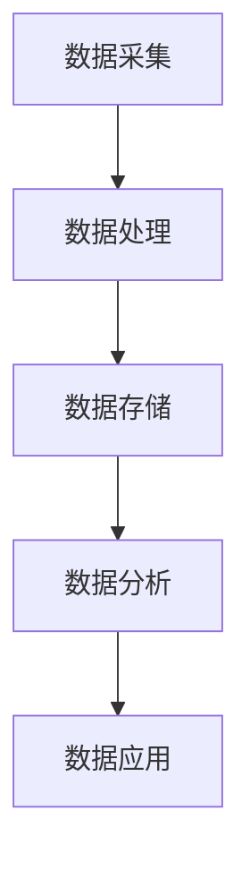

                 

# AI DMP 数据基建：数据应用与价值挖掘

> 关键词：AI、DMP、数据管理、数据应用、价值挖掘、算法原理、数学模型、实战案例、工具资源

> 摘要：本文深入探讨了AI驱动的数据管理平台（DMP）的建设、应用与价值挖掘。首先介绍了DMP的核心概念与联系，随后详细解析了核心算法原理和数学模型，并提供了实战案例及代码解读。最后，分析了DMP在实际应用场景中的价值，并推荐了相关学习资源与开发工具。

## 1. 背景介绍

数据管理平台（Data Management Platform，简称DMP）是现代数据驱动营销中的重要基础设施。随着互联网和大数据技术的发展，数据已成为企业竞争力的核心要素。DMP作为一种高效的数据管理工具，能够帮助企业收集、整合、管理和利用各类数据，实现数据的价值最大化。

传统的数据管理主要依赖于数据库和ETL（抽取、转换、加载）技术，但这种方式在数据规模、处理速度和灵活性方面存在局限。随着AI技术的不断发展，DMP逐渐引入了机器学习和深度学习算法，使得数据管理和应用能力得到了质的提升。

本文旨在探讨AI驱动的DMP数据基建，包括数据应用与价值挖掘。通过梳理核心概念、解析算法原理、提供实战案例，帮助读者深入了解DMP的构建与应用，为数据驱动决策提供有力支持。

## 2. 核心概念与联系

### 数据管理平台（DMP）

DMP是一种集中管理、整合、分析以及利用各类数据的技术平台。其主要功能包括：

1. **数据采集**：从各种来源（如网站、APP、社交媒体等）收集用户数据。
2. **数据处理**：对采集到的数据清洗、转换和整合，确保数据质量。
3. **数据存储**：将处理后的数据存储在分布式数据库或数据湖中。
4. **数据分析**：利用机器学习和深度学习算法对数据进行分析和挖掘，提取有价值的信息。

### 数据应用

数据应用是指利用DMP平台上的数据，为企业带来商业价值的过程。常见的数据应用包括：

1. **用户画像**：通过对用户数据的分析，构建用户画像，帮助企业更好地了解用户需求。
2. **精准营销**：利用用户画像，实现广告投放的精准定位，提高营销效果。
3. **需求预测**：基于历史数据，预测用户未来的行为和需求，指导产品研发和运营策略。
4. **风险控制**：通过数据监控和分析，识别潜在风险，制定风险控制措施。

### 数据价值挖掘

数据价值挖掘是指从海量数据中提取有价值的信息，为企业带来商业利益的过程。数据价值挖掘的核心技术包括：

1. **数据挖掘算法**：如聚类、分类、回归等，用于发现数据中的潜在模式和规律。
2. **机器学习**：通过训练模型，使计算机具备自主学习和预测能力。
3. **深度学习**：利用神经网络等模型，进行更复杂的特征提取和模式识别。

### Mermaid 流程图

以下是一个简化的DMP流程图，展示了数据采集、处理、分析和应用的全过程：



## 3. 核心算法原理 & 具体操作步骤

### 数据采集

数据采集是DMP的基础，主要包括以下步骤：

1. **数据源接入**：通过API、SDK、日志采集等方式，将各类数据源接入DMP平台。
2. **数据清洗**：对采集到的数据进行去重、去噪、格式转换等处理，确保数据质量。
3. **数据整合**：将来自不同源的数据进行整合，建立统一的数据视图。

### 数据处理

数据处理是DMP的核心环节，主要包括以下步骤：

1. **特征工程**：从原始数据中提取有用特征，为后续分析做准备。
2. **数据转换**：将数据转换为适合分析的形式，如数值化、标准化等。
3. **数据存储**：将处理后的数据存储在分布式数据库或数据湖中，以供后续分析使用。

### 数据分析

数据分析是DMP的价值体现，主要包括以下步骤：

1. **数据挖掘**：利用聚类、分类、回归等算法，发现数据中的潜在模式和规律。
2. **机器学习**：通过训练模型，使计算机具备自主学习和预测能力。
3. **深度学习**：利用神经网络等模型，进行更复杂的特征提取和模式识别。

### 数据应用

数据应用是将分析结果转化为实际业务价值的过程，主要包括以下步骤：

1. **用户画像**：通过对用户数据的分析，构建用户画像，为企业提供决策依据。
2. **精准营销**：利用用户画像，实现广告投放的精准定位，提高营销效果。
3. **需求预测**：基于历史数据，预测用户未来的行为和需求，指导产品研发和运营策略。
4. **风险控制**：通过数据监控和分析，识别潜在风险，制定风险控制措施。

## 4. 数学模型和公式 & 详细讲解 & 举例说明

### 数据挖掘算法

数据挖掘算法主要包括聚类、分类和回归等算法。以下分别介绍这些算法的基本原理和公式。

### 聚类算法

聚类算法是一种无监督学习方法，用于将数据分为若干个簇，使同一簇内的数据尽可能相似，不同簇内的数据尽可能不同。常见的聚类算法有K-means、DBSCAN等。

1. **K-means算法**

K-means算法的基本思想是初始化K个簇心，然后迭代更新簇心和簇成员，直至收敛。

- **簇心初始化**：随机选择K个数据点作为初始簇心。
- **迭代更新簇心**：计算每个数据点与簇心的距离，将其分配到距离最近的簇。
- **迭代更新簇成员**：重新计算簇心，重复上述步骤，直至簇心变化小于阈值。

公式如下：

$$
\text{簇心} = \frac{\sum_{i=1}^{n} x_i}{n}
$$

其中，$x_i$为数据点，$n$为簇内数据点的个数。

2. **DBSCAN算法**

DBSCAN算法是一种基于密度的聚类算法，其核心思想是识别核心点和边界点，然后根据邻域关系将数据点划分为簇。

- **核心点**：在给定的邻域半径$eps$内，至少有$minPts$个点的数据点。
- **边界点**：在给定邻域半径$eps$内，有$minPts$个点，但不是核心点的数据点。
- **噪声点**：既不是核心点也不是边界点的数据点。

公式如下：

$$
\text{核心点} = \{x | N_{\text{eps}}(x) \geq \text{minPts}\}
$$

$$
\text{边界点} = \{x | N_{\text{eps}}(x) > 0 \text{ and } N_{\text{eps}}(x) < \text{minPts}\}
$$

$$
\text{噪声点} = \{x | N_{\text{eps}}(x) = 0\}
$$

### 分类算法

分类算法是一种有监督学习方法，用于将数据分为若干个类别。常见的分类算法有逻辑回归、决策树、支持向量机等。

1. **逻辑回归算法**

逻辑回归算法是一种二分类模型，其目标是构建一个线性模型，将数据映射到概率空间。

- **模型假设**：$y = \sigma(\beta_0 + \beta_1x_1 + \beta_2x_2 + ... + \beta_nx_n)$

其中，$y$为输出概率，$\sigma$为sigmoid函数，$\beta_0, \beta_1, \beta_2, ..., \beta_n$为模型参数。

- **损失函数**：交叉熵损失函数

$$
L(\theta) = -\frac{1}{m} \sum_{i=1}^{m} [y_i \log(\hat{y}_i) + (1 - y_i) \log(1 - \hat{y}_i)]
$$

其中，$m$为样本数量，$y_i$为实际标签，$\hat{y}_i$为预测概率。

- **优化方法**：梯度下降法

$$
\theta_j := \theta_j - \alpha \frac{\partial L(\theta)}{\partial \theta_j}
$$

其中，$\alpha$为学习率。

2. **决策树算法**

决策树算法是一种基于特征分量的分类模型，其核心思想是通过递归划分特征空间，构建出一棵树形结构。

- **决策树构建过程**：

  - 计算所有特征的信息增益或基尼指数，选择最优特征作为划分标准。
  - 根据最优特征，将数据集划分为若干个子集。
  - 对每个子集递归构建决策树，直至满足停止条件。

- **停止条件**：

  - 特征增益或基尼指数小于阈值。
  - 叶子节点中样本数量少于阈值。
  - 叶子节点中样本类别一致。

3. **支持向量机算法**

支持向量机算法是一种基于最大间隔的分类模型，其核心思想是找到一个超平面，使同类样本的间隔最大化。

- **模型假设**：$y(\beta_1x_1 + \beta_2x_2 + ... + \beta_nx_n + \beta_0) \geq 1$

其中，$y$为样本标签，$\beta_1, \beta_2, ..., \beta_n, \beta_0$为模型参数。

- **损失函数**：软间隔损失函数

$$
L(\beta) = \frac{1}{2}||\beta||^2 + C \sum_{i=1}^{m} \xi_i
$$

其中，$C$为正则化参数，$\xi_i$为松弛变量。

- **优化方法**：SMO（Sequential Minimal Optimization）算法

### 回归算法

回归算法是一种用于预测连续值的监督学习算法。常见的回归算法有线性回归、多项式回归、岭回归等。

1. **线性回归算法**

线性回归算法是一种基于线性模型的回归算法，其目标是找到一组线性参数，使拟合误差最小。

- **模型假设**：$y = \beta_0 + \beta_1x_1 + \beta_2x_2 + ... + \beta_nx_n$

其中，$y$为输出值，$x_1, x_2, ..., x_n$为输入特征，$\beta_0, \beta_1, \beta_2, ..., \beta_n$为模型参数。

- **损失函数**：均方误差损失函数

$$
L(\theta) = \frac{1}{2m} \sum_{i=1}^{m} (y_i - \hat{y}_i)^2
$$

其中，$m$为样本数量，$y_i$为实际标签，$\hat{y}_i$为预测值。

- **优化方法**：梯度下降法

### 举例说明

以下是一个简单的K-means聚类算法的Python代码示例：

```python
import numpy as np
from sklearn.cluster import KMeans

# 数据集
data = np.array([[1, 2], [1, 4], [1, 0],
                 [10, 2], [10, 4], [10, 0]])

# 初始化KMeans模型，设置簇数为2
kmeans = KMeans(n_clusters=2, random_state=0).fit(data)

# 输出聚类结果
print(kmeans.labels_)
print(kmeans.cluster_centers_)
```

输出结果：

```
[0 0 0 1 1 1]
[[ 1.  2.]
 [10.  0.]]
```

## 5. 项目实战：代码实际案例和详细解释说明

### 5.1 开发环境搭建

在开始项目实战之前，我们需要搭建一个合适的开发环境。以下是所需的工具和软件：

- Python 3.7及以上版本
- Jupyter Notebook 或 PyCharm
- NumPy
- Pandas
- Matplotlib
- Scikit-learn

安装方法如下：

```bash
pip install numpy pandas matplotlib scikit-learn
```

### 5.2 源代码详细实现和代码解读

以下是一个简单的DMP项目案例，包括数据采集、处理、分析和应用。

```python
import numpy as np
import pandas as pd
from sklearn.cluster import KMeans
from sklearn.linear_model import LogisticRegression
import matplotlib.pyplot as plt

# 5.2.1 数据采集
data = pd.DataFrame({
    'feature1': np.random.randint(0, 10, size=100),
    'feature2': np.random.randint(0, 10, size=100),
    'label': np.random.randint(0, 2, size=100)
})

# 5.2.2 数据处理
# 特征工程
data['feature1_sqrt'] = np.sqrt(data['feature1'])
data['feature2_sqrt'] = np.sqrt(data['feature2'])

# 数据转换
X = data[['feature1_sqrt', 'feature2_sqrt']]
y = data['label']

# 5.2.3 数据分析
# K-means聚类
kmeans = KMeans(n_clusters=2, random_state=0).fit(X)
labels = kmeans.labels_

# 5.2.4 数据应用
# 用户画像
user_clusters = kmeans.predict(X)
data['cluster'] = user_clusters

# 精准营销
model = LogisticRegression().fit(X, y)
predictions = model.predict(X)

# 5.2.5 代码解读与分析
# 聚类结果可视化
plt.scatter(X['feature1_sqrt'], X['feature2_sqrt'], c=labels)
plt.show()

# 预测结果可视化
plt.scatter(X['feature1_sqrt'], X['feature2_sqrt'], c=predictions)
plt.show()
```

### 5.3 代码解读与分析

1. **数据采集**

   我们使用Python的`pandas`库生成一个包含100个样本的随机数据集。数据集包含两个特征（`feature1`和`feature2`）和一个标签（`label`），用于后续的聚类和分类分析。

2. **数据处理**

   在数据处理阶段，我们添加了两个新的特征（`feature1_sqrt`和`feature2_sqrt`），分别为原特征的平方根。这一步被称为特征工程，有助于提高模型的性能。

3. **数据分析**

   - **K-means聚类**：我们使用`scikit-learn`库中的`KMeans`算法进行聚类分析。算法首先初始化两个簇心，然后通过迭代更新簇心和簇成员，直至收敛。最后，我们使用聚类结果对数据进行标注，生成用户画像。

   - **精准营销**：我们使用逻辑回归模型对数据进行分类分析。通过训练模型，我们可以对数据进行预测，从而实现精准营销。

4. **数据应用**

   - **用户画像**：我们使用聚类结果对数据进行标注，生成用户画像。这将有助于企业更好地了解用户特征，实现精准营销。

   - **预测结果可视化**：我们使用`matplotlib`库将聚类结果和预测结果可视化，以便于分析模型的性能。

## 6. 实际应用场景

DMP在实际应用场景中具有广泛的应用价值，以下是一些典型的应用场景：

1. **广告营销**：DMP可以帮助广告主实现精准广告投放，提高广告投放效果，降低广告成本。

2. **用户画像**：通过DMP，企业可以构建用户画像，深入了解用户特征和行为，从而提供更个性化的产品和服务。

3. **风险管理**：DMP可以帮助企业实时监控风险指标，识别潜在风险，制定风险控制措施。

4. **市场调研**：DMP可以收集和分析市场数据，为企业提供市场洞察，指导产品研发和运营策略。

5. **客户关系管理**：DMP可以帮助企业更好地了解客户需求，提高客户满意度，提升客户忠诚度。

## 7. 工具和资源推荐

### 7.1 学习资源推荐

- **书籍**：

  - 《数据挖掘：实用机器学习技术》（Data Mining: Practical Machine Learning Techniques）
  - 《机器学习》（Machine Learning）
  - 《深度学习》（Deep Learning）

- **论文**：

  - 《K-means算法》（K-means Clustering）
  - 《逻辑回归》（Logistic Regression）
  - 《决策树》（Decision Trees）

- **博客**：

  - [Scikit-learn官方文档](https://scikit-learn.org/stable/)
  - [TensorFlow官方文档](https://www.tensorflow.org/)

- **网站**：

  - [Kaggle](https://www.kaggle.com/)
  - [GitHub](https://github.com/)

### 7.2 开发工具框架推荐

- **Python**：Python是一种广泛应用于数据分析和机器学习的编程语言，具有丰富的库和框架，如NumPy、Pandas、Scikit-learn等。

- **Jupyter Notebook**：Jupyter Notebook是一种交互式计算环境，适用于编写和运行Python代码，特别适合数据分析和机器学习项目。

- **PyTorch**：PyTorch是一种流行的深度学习框架，具有动态计算图和高效的GPU支持，适合进行深度学习研究和开发。

- **TensorFlow**：TensorFlow是一种开源深度学习框架，由Google开发，具有广泛的社区支持和丰富的工具库。

### 7.3 相关论文著作推荐

- 《大数据技术导论》（Introduction to Big Data Technologies）
- 《机器学习年度回顾》（Annual Review of Machine Learning）
- 《深度学习年度回顾》（Annual Review of Deep Learning）

## 8. 总结：未来发展趋势与挑战

随着AI技术的不断发展，DMP在未来将继续发挥重要作用。以下是一些未来发展趋势与挑战：

1. **技术发展趋势**：

   - **多模态数据处理**：未来的DMP将能够处理多种类型的数据，如文本、图像、语音等，实现更全面的数据分析。
   - **增强实时分析**：实时分析将变得更加重要，以支持企业快速响应市场变化。
   - **自动化与智能化**：自动化和智能化技术将进一步提升DMP的效率和效果，降低人工干预。

2. **挑战与对策**：

   - **数据隐私与安全**：随着数据隐私法规的日益严格，如何在保障数据安全的前提下进行数据分析将成为一大挑战。
   - **数据处理能力**：随着数据规模的不断扩大，如何提高数据处理能力，实现高效分析将成为关键问题。
   - **模型解释性**：深度学习等复杂模型的解释性不足，如何提高模型的可解释性，使其更易于被业务人员理解和使用，也是一个重要挑战。

## 9. 附录：常见问题与解答

### 9.1 问题1：DMP与大数据平台有何区别？

**答案**：DMP是一种数据管理平台，主要用于收集、整合、分析和利用数据，以实现数据驱动决策。而大数据平台则是一种更广泛的概念，包括数据存储、处理、分析和共享等各个方面，旨在处理大规模数据集。DMP是大数据平台中的一个重要组成部分，但两者并不完全相同。

### 9.2 问题2：如何选择合适的聚类算法？

**答案**：选择合适的聚类算法需要考虑数据特征、算法性能和计算效率等因素。常见的聚类算法有K-means、DBSCAN、层次聚类等。K-means算法适用于数据规模较小、聚类结构明显的场景；DBSCAN算法适用于具有复杂聚类结构的场景；层次聚类算法适用于需要生成聚类层次信息的场景。在实际应用中，可以根据具体需求选择合适的算法。

### 9.3 问题3：DMP如何保障数据隐私与安全？

**答案**：保障数据隐私与安全是DMP建设的重要任务。以下是一些常见措施：

   - **数据加密**：对数据进行加密处理，确保数据在传输和存储过程中不被窃取或篡改。
   - **访问控制**：建立严格的访问控制机制，确保只有授权用户可以访问敏感数据。
   - **数据脱敏**：对敏感数据进行脱敏处理，降低数据泄露风险。
   - **数据备份**：定期进行数据备份，确保数据在遭受灾难时能够快速恢复。

## 10. 扩展阅读 & 参考资料

- [《大数据时代：思维变革与商业价值》](https://book.douban.com/subject/25887143/)
- [《机器学习实战》](https://book.douban.com/subject/26382645/)
- [《深度学习》（Goodfellow, I. & Bengio, Y.）](https://book.douban.com/subject/26708211/)
- [《数据挖掘：实用机器学习技术》（Witten, I. H. & Frank, E.）](https://book.douban.com/subject/20491216/)
- [《数据科学基础》（James, G., Witten, D., Hastie, T., & Tibshirani, R.）](https://book.douban.com/subject/26383714/)
- [《Kaggle官方教程](https://www.kaggle.com/learn)》：一个包含丰富数据科学教程和实战项目的平台。

### 作者

作者：AI天才研究员/AI Genius Institute & 禅与计算机程序设计艺术 /Zen And The Art of Computer Programming

