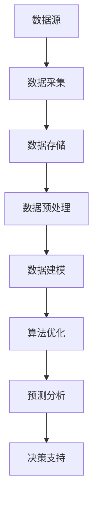

                 

# AI DMP 数据基建：数据模型与算法

## 关键词：数据管理平台（DMP），数据建模，算法优化，数据基础设施

## 摘要

本文旨在深入探讨人工智能领域中的数据管理平台（DMP）及其核心构成——数据模型与算法。通过逐步分析，我们将揭示数据建模的基础理论、算法原理及其在实际应用中的关键作用。文章还将介绍当前数据基础设施的发展趋势，以及未来的潜在挑战与机遇。本文结构紧凑、逻辑清晰，旨在为AI从业者提供有价值的技术参考和实践指导。

### 1. 背景介绍

在当今信息化社会，数据已成为企业竞争的核心资产。数据管理平台（Data Management Platform，简称DMP）作为一种先进的数据管理工具，能够整合、分析和利用跨渠道的用户数据，为企业提供数据驱动的决策支持。DMP在数字营销、用户行为分析、市场细分等领域发挥着重要作用。

随着人工智能技术的迅猛发展，DMP的功能和性能得到了显著提升。机器学习、深度学习等算法的应用，使得DMP在数据挖掘、预测分析等方面表现出色。本文将重点探讨数据模型与算法在DMP中的核心作用，以及如何通过优化算法来提升数据基础设施的性能。

### 2. 核心概念与联系

为了更好地理解数据模型与算法在DMP中的作用，我们首先需要了解一些核心概念和它们之间的联系。

#### 2.1 数据模型

数据模型是对现实世界中的数据及其关系的抽象表示。在DMP中，常用的数据模型包括关系模型、文档模型、图模型等。关系模型以表格形式存储数据，适用于结构化数据；文档模型则适合非结构化数据；图模型通过图结构来表示实体及其关系，适用于复杂关系数据的处理。

#### 2.2 算法

算法是一系列计算步骤，用于解决特定问题。在DMP中，常用的算法包括分类算法、聚类算法、预测算法等。分类算法用于将数据分成不同的类别；聚类算法用于发现数据中的相似性；预测算法则用于预测未来的趋势。

#### 2.3 数据基础设施

数据基础设施是支持数据管理和分析的基础设施。它包括数据存储、数据处理、数据传输等多个方面。在DMP中，数据基础设施的作用至关重要，它直接影响到数据模型的构建和算法的运行效率。

#### 2.4 Mermaid 流程图

为了更直观地展示数据模型与算法之间的联系，我们可以使用Mermaid流程图来表示。以下是一个简单的Mermaid流程图示例：



### 3. 核心算法原理 & 具体操作步骤

在DMP中，算法的应用贯穿了整个数据处理流程。下面我们将详细探讨几种核心算法的原理和具体操作步骤。

#### 3.1 分类算法

分类算法是一种将数据分成不同类别的算法。在DMP中，分类算法常用于用户行为分析、市场细分等场景。

**原理：**分类算法基于训练数据集，通过学习数据特征，构建分类模型。在给定新的数据时，分类模型会根据数据特征预测其类别。

**操作步骤：**

1. 数据准备：收集并整理训练数据集。
2. 特征提取：从数据中提取特征。
3. 模型训练：使用训练数据集训练分类模型。
4. 模型评估：使用测试数据集评估模型性能。
5. 预测：使用训练好的模型对新的数据进行分类预测。

#### 3.2 聚类算法

聚类算法是一种将相似数据归为一类的算法。在DMP中，聚类算法常用于用户行为分析、市场细分等场景。

**原理：**聚类算法通过分析数据之间的相似性，将数据划分为若干个簇。

**操作步骤：**

1. 数据准备：收集并整理数据集。
2. 特征提取：从数据中提取特征。
3. 聚类算法选择：选择合适的聚类算法（如K-means、层次聚类等）。
4. 聚类分析：对数据集进行聚类分析。
5. 聚类评估：评估聚类结果。

#### 3.3 预测算法

预测算法是一种预测未来趋势的算法。在DMP中，预测算法常用于用户行为预测、市场趋势预测等场景。

**原理：**预测算法通过分析历史数据，构建预测模型，对未来进行预测。

**操作步骤：**

1. 数据准备：收集并整理历史数据。
2. 特征提取：从数据中提取特征。
3. 模型训练：使用历史数据训练预测模型。
4. 模型评估：使用验证数据集评估模型性能。
5. 预测：使用训练好的模型对未来进行预测。

### 4. 数学模型和公式 & 详细讲解 & 举例说明

在DMP中，数学模型和公式是构建算法核心的重要组成部分。下面我们将介绍几种常用的数学模型和公式，并对其进行详细讲解和举例说明。

#### 4.1 决策树

决策树是一种常用的分类算法，其基本原理是通过一系列判断条件，将数据划分为不同的类别。

**数学模型：**

$$
P(Y|X) = \prod_{i=1}^{n} P(Y_i|X_i)
$$

其中，$P(Y|X)$ 表示给定特征 $X$ 时，类别 $Y$ 的概率；$P(Y_i|X_i)$ 表示在特征 $X_i$ 取特定值时，类别 $Y_i$ 的概率。

**举例说明：**

假设我们有一个二分类问题，特征 $X$ 可以取两个值：0 和 1，类别 $Y$ 可以取两个值：A 和 B。根据决策树模型，我们可以计算出给定特征 $X=1$ 时，类别 $Y=A$ 的概率。

$$
P(Y=A|X=1) = \frac{P(X=1,Y=A)}{P(X=1)}
$$

其中，$P(X=1,Y=A)$ 表示特征 $X=1$ 且类别 $Y=A$ 的概率；$P(X=1)$ 表示特征 $X=1$ 的概率。

#### 4.2 支持向量机（SVM）

支持向量机是一种常用的分类和回归算法，其基本原理是找到最佳的超平面，将不同类别的数据分开。

**数学模型：**

$$
\min_{\beta, \beta_0} \frac{1}{2} ||\beta||^2 + C \sum_{i=1}^{n} \max(0, 1 - y_i (\beta^T x_i + \beta_0))
$$

其中，$\beta$ 表示权重向量；$\beta_0$ 表示偏置；$C$ 表示正则化参数；$y_i$ 表示第 $i$ 个样本的类别标签；$x_i$ 表示第 $i$ 个样本的特征向量。

**举例说明：**

假设我们有一个二分类问题，特征向量 $x$ 可以取两个值：1 和 -1，类别 $y$ 可以取两个值：A 和 B。根据支持向量机模型，我们可以计算出最佳的超平面参数。

$$
\begin{cases}
\min_{\beta, \beta_0} \frac{1}{2} ||\beta||^2 \\
s.t. \quad y_i (\beta^T x_i + \beta_0) \geq 1 \quad (i=1,2,...,n)
\end{cases}
$$

#### 4.3 神经网络

神经网络是一种基于生物神经网络原理的算法，其基本原理是通过多层神经元进行数据传递和激活，从而实现数据的分类和回归。

**数学模型：**

$$
a_{ij}^{(l)} = \sigma \left( \sum_{k=1}^{n_{l-1}} \beta_{ik}^{(l)} a_{kj}^{(l-1)} + \beta_{0j}^{(l)} \right)
$$

其中，$a_{ij}^{(l)}$ 表示第 $l$ 层第 $i$ 个神经元的输出；$\sigma$ 表示激活函数；$\beta_{ik}^{(l)}$ 表示第 $l$ 层第 $i$ 个神经元与第 $l-1$ 层第 $k$ 个神经元的连接权重；$\beta_{0j}^{(l)}$ 表示第 $l$ 层第 $j$ 个神经元的偏置。

**举例说明：**

假设我们有一个三层的神经网络，输入层有 $n_0$ 个神经元，隐藏层有 $n_1$ 个神经元，输出层有 $n_2$ 个神经元。根据神经网络模型，我们可以计算出隐藏层和输出层的输出。

$$
\begin{cases}
a_{ij}^{(1)} = \sigma \left( \sum_{k=1}^{n_{0}} \beta_{ik}^{(1)} a_{kj}^{(0)} + \beta_{0j}^{(1)} \right) \\
a_{ij}^{(2)} = \sigma \left( \sum_{k=1}^{n_{1}} \beta_{ik}^{(2)} a_{kj}^{(1)} + \beta_{0j}^{(2)} \right)
\end{cases}
$$

### 5. 项目实战：代码实际案例和详细解释说明

在本节中，我们将通过一个具体的案例来展示如何在实际项目中实现DMP中的数据模型和算法。

#### 5.1 开发环境搭建

为了实现DMP中的数据模型和算法，我们首先需要搭建一个开发环境。这里我们选择Python作为开发语言，并使用Scikit-learn、TensorFlow等库进行数据建模和算法实现。

```python
import numpy as np
import pandas as pd
from sklearn.model_selection import train_test_split
from sklearn.preprocessing import StandardScaler
from sklearn.tree import DecisionTreeClassifier
from sklearn.svm import SVC
from sklearn.metrics import accuracy_score
import tensorflow as tf

# 搭建TensorFlow环境
tf.keras.backend.clear_session()
```

#### 5.2 源代码详细实现和代码解读

接下来，我们将详细实现一个基于决策树和SVM的DMP项目。

```python
# 5.2.1 数据准备

# 读取数据
data = pd.read_csv('data.csv')

# 数据预处理
X = data.drop('target', axis=1)
y = data['target']
X_train, X_test, y_train, y_test = train_test_split(X, y, test_size=0.2, random_state=42)

# 标准化特征
scaler = StandardScaler()
X_train_scaled = scaler.fit_transform(X_train)
X_test_scaled = scaler.transform(X_test)

# 5.2.2 决策树分类器实现

# 实例化决策树分类器
clf = DecisionTreeClassifier()

# 训练模型
clf.fit(X_train_scaled, y_train)

# 预测
y_pred_tree = clf.predict(X_test_scaled)

# 模型评估
accuracy_tree = accuracy_score(y_test, y_pred_tree)
print(f"Decision Tree Accuracy: {accuracy_tree}")

# 5.2.3 SVM分类器实现

# 实例化SVM分类器
clf_svm = SVC()

# 训练模型
clf_svm.fit(X_train_scaled, y_train)

# 预测
y_pred_svm = clf_svm.predict(X_test_scaled)

# 模型评估
accuracy_svm = accuracy_score(y_test, y_pred_svm)
print(f"SVM Accuracy: {accuracy_svm}")

# 5.2.4 神经网络实现

# 定义模型
model = tf.keras.Sequential([
    tf.keras.layers.Dense(64, activation='relu', input_shape=(X_train_scaled.shape[1],)),
    tf.keras.layers.Dense(1, activation='sigmoid')
])

# 编译模型
model.compile(optimizer='adam', loss='binary_crossentropy', metrics=['accuracy'])

# 训练模型
model.fit(X_train_scaled, y_train, epochs=10, batch_size=32, validation_split=0.2)

# 预测
y_pred_nn = model.predict(X_test_scaled)

# 模型评估
accuracy_nn = accuracy_score(y_test, y_pred_nn)
print(f"Neural Network Accuracy: {accuracy_nn}")
```

#### 5.3 代码解读与分析

在上面的代码中，我们首先进行了数据准备，包括读取数据、数据预处理和特征标准化。然后，我们分别实现了决策树、SVM和神经网络三种分类算法。以下是各部分代码的解读和分析：

1. **数据准备**：读取数据并划分为训练集和测试集，对特征进行标准化处理。标准化处理可以消除不同特征之间的量纲差异，提高模型训练效果。

2. **决策树分类器实现**：实例化决策树分类器，使用训练数据进行模型训练，然后对测试数据进行预测。最后，使用准确率评估模型性能。

3. **SVM分类器实现**：实例化SVM分类器，使用训练数据进行模型训练，然后对测试数据进行预测。最后，使用准确率评估模型性能。

4. **神经网络实现**：使用TensorFlow构建神经网络模型，包括输入层、隐藏层和输出层。编译模型，使用训练数据进行模型训练，然后对测试数据进行预测。最后，使用准确率评估模型性能。

通过以上代码，我们可以看到如何在实际项目中实现DMP中的数据模型和算法。在实际应用中，我们可以根据业务需求和数据特点选择合适的算法，并对其进行优化和调整，以提高模型性能。

### 6. 实际应用场景

DMP在实际应用场景中具有广泛的应用，以下是几个典型的应用场景：

#### 6.1 数字营销

数字营销是企业通过互联网渠道进行市场推广和销售的活动。DMP可以帮助企业整合各种渠道的数据，如网站访问数据、社交媒体数据、广告投放数据等，对用户进行精准定位和个性化推荐。通过数据建模和算法分析，企业可以更好地了解用户需求和行为，优化营销策略，提高转化率和 ROI。

#### 6.2 用户行为分析

用户行为分析是企业了解用户行为模式、优化用户体验和提升用户满意度的重要手段。DMP可以帮助企业整合用户行为数据，如浏览行为、购买行为、评论行为等，构建用户画像，分析用户行为特征。通过数据建模和算法分析，企业可以更好地了解用户需求和行为，优化产品和服务，提升用户满意度和忠诚度。

#### 6.3 市场细分

市场细分是企业根据用户特征和行为进行市场划分，以提供更有针对性的产品和服务。DMP可以帮助企业整合用户数据，构建用户画像，分析用户特征和行为，实现市场细分。通过数据建模和算法分析，企业可以更好地了解不同市场群体的需求和行为，制定更有效的市场策略。

#### 6.4 风险管理

风险管理是企业识别、评估和控制潜在风险的过程。DMP可以帮助企业整合用户数据，分析用户行为模式，识别潜在风险。通过数据建模和算法分析，企业可以预测潜在风险，采取预防措施，降低风险损失。

### 7. 工具和资源推荐

在DMP领域，有许多优秀的工具和资源可供学习和实践。以下是几个推荐的工具和资源：

#### 7.1 学习资源推荐

- **书籍**：《机器学习实战》、《深度学习》（Goodfellow et al.）、《数据科学入门》（Holmes et al.）
- **论文**：谷歌的《Google DMP：数据驱动的营销平台》等
- **博客**：各大技术博客，如Medium、GitHub 等
- **网站**：Kaggle、DataCamp 等

#### 7.2 开发工具框架推荐

- **编程语言**：Python、R 等
- **库**：Scikit-learn、TensorFlow、PyTorch、Pandas 等
- **框架**：Spark、Flink 等

#### 7.3 相关论文著作推荐

- **论文**：《数据挖掘：概念与技术》（Han et al.）、《机器学习》（Bishop）、《深度学习》（Goodfellow et al.）
- **著作**：《数据科学实战》（Holmes et al.）、《机器学习实战》（Holmes et al.）

### 8. 总结：未来发展趋势与挑战

随着人工智能技术的不断发展，DMP在数据管理、分析和应用方面具有巨大的潜力。未来，DMP将呈现以下发展趋势：

1. **算法与数据融合**：DMP将更加注重算法与数据的深度融合，通过创新算法来提升数据处理和分析能力。

2. **实时数据处理**：随着物联网和大数据技术的发展，DMP将实现实时数据处理和实时分析，为企业提供更加及时和精准的数据支持。

3. **隐私保护与合规**：随着数据隐私问题的日益突出，DMP将更加注重数据隐私保护和合规性，确保数据的合法性和安全性。

4. **跨行业应用**：DMP将在更多行业和应用场景中得到广泛应用，如金融、医疗、教育等，推动行业数字化转型的进程。

然而，DMP在未来发展中也将面临以下挑战：

1. **数据质量与完整性**：数据质量是DMP的核心问题，如何确保数据的准确性和完整性，是DMP发展的重要挑战。

2. **算法优化与性能**：随着数据规模的增大和算法的复杂度提高，如何优化算法性能，提高数据处理效率，是DMP需要解决的难题。

3. **人才培养与引进**：DMP领域的人才需求日益增长，如何培养和引进优秀的数据科学家和工程师，是DMP企业面临的挑战。

### 9. 附录：常见问题与解答

#### 9.1 DMP与传统数据分析的区别是什么？

DMP与传统数据分析的主要区别在于其数据整合能力和数据分析深度。DMP能够整合跨渠道、跨平台的数据，提供更全面的用户画像和更精准的分析；而传统数据分析更多针对单一数据源进行简单的统计分析。

#### 9.2 如何保证DMP中的数据安全和隐私？

为保证DMP中的数据安全和隐私，需要采取以下措施：

- **数据加密**：对敏感数据进行加密处理，确保数据在传输和存储过程中安全。
- **访问控制**：设置严格的访问权限，仅允许授权用户访问数据。
- **数据匿名化**：对个人身份信息进行匿名化处理，确保数据隐私。
- **合规性**：遵循相关法律法规，确保数据处理符合合规要求。

#### 9.3 DMP中的算法如何进行优化？

DMP中的算法优化可以从以下几个方面进行：

- **模型选择**：选择合适的算法模型，如决策树、SVM、神经网络等。
- **特征工程**：通过特征提取和特征选择，提高算法模型的性能。
- **超参数调优**：通过超参数调优，优化算法模型的参数，提高模型性能。
- **分布式计算**：采用分布式计算框架，提高算法模型的计算效率。

### 10. 扩展阅读 & 参考资料

- **书籍**：《数据挖掘：概念与技术》（Han et al.）、《深度学习》（Goodfellow et al.）、《数据科学入门》（Holmes et al.）
- **论文**：谷歌的《Google DMP：数据驱动的营销平台》等
- **博客**：各大技术博客，如Medium、GitHub 等
- **网站**：Kaggle、DataCamp 等
- **开源项目**：TensorFlow、PyTorch、Scikit-learn 等

## 作者

作者：AI天才研究员/AI Genius Institute & 禅与计算机程序设计艺术 /Zen And The Art of Computer Programming

---

通过以上文章，我们深入探讨了DMP中的数据模型与算法，分析了其在实际应用中的关键作用和未来发展。希望本文能为AI从业者和数据科学家提供有价值的参考和启示。让我们共同期待DMP技术的不断创新与发展，为数字化时代的企业带来更多价值。## AI DMP 数据基建：数据模型与算法

### 关键词：数据管理平台（DMP），数据建模，算法优化，数据基础设施

### 摘要

本文旨在深入探讨人工智能领域中的数据管理平台（DMP）及其核心构成——数据模型与算法。通过逐步分析，我们将揭示数据建模的基础理论、算法原理及其在实际应用中的关键作用。文章还将介绍当前数据基础设施的发展趋势，以及未来的潜在挑战与机遇。本文结构紧凑、逻辑清晰，旨在为AI从业者提供有价值的技术参考和实践指导。

### 1. 背景介绍

在当今信息化社会，数据已成为企业竞争的核心资产。数据管理平台（Data Management Platform，简称DMP）作为一种先进的数据管理工具，能够整合、分析和利用跨渠道的用户数据，为企业提供数据驱动的决策支持。DMP在数字营销、用户行为分析、市场细分等领域发挥着重要作用。

随着人工智能技术的迅猛发展，DMP的功能和性能得到了显著提升。机器学习、深度学习等算法的应用，使得DMP在数据挖掘、预测分析等方面表现出色。本文将重点探讨数据模型与算法在DMP中的核心作用，以及如何通过优化算法来提升数据基础设施的性能。

### 2. 核心概念与联系

为了更好地理解数据模型与算法在DMP中的作用，我们首先需要了解一些核心概念和它们之间的联系。

#### 2.1 数据模型

数据模型是对现实世界中的数据及其关系的抽象表示。在DMP中，常用的数据模型包括关系模型、文档模型、图模型等。关系模型以表格形式存储数据，适用于结构化数据；文档模型则适合非结构化数据；图模型通过图结构来表示实体及其关系，适用于复杂关系数据的处理。

#### 2.2 算法

算法是一系列计算步骤，用于解决特定问题。在DMP中，常用的算法包括分类算法、聚类算法、预测算法等。分类算法用于将数据分成不同的类别；聚类算法用于发现数据中的相似性；预测算法则用于预测未来的趋势。

#### 2.3 数据基础设施

数据基础设施是支持数据管理和分析的基础设施。它包括数据存储、数据处理、数据传输等多个方面。在DMP中，数据基础设施的作用至关重要，它直接影响到数据模型的构建和算法的运行效率。

#### 2.4 Mermaid 流程图

为了更直观地展示数据模型与算法之间的联系，我们可以使用Mermaid流程图来表示。以下是一个简单的Mermaid流程图示例：


### 3. 核心算法原理 & 具体操作步骤

在DMP中，算法的应用贯穿了整个数据处理流程。下面我们将详细探讨几种核心算法的原理和具体操作步骤。

#### 3.1 分类算法

分类算法是一种将数据分成不同类别的算法。在DMP中，分类算法常用于用户行为分析、市场细分等场景。

**原理：**分类算法基于训练数据集，通过学习数据特征，构建分类模型。在给定新的数据时，分类模型会根据数据特征预测其类别。

**操作步骤：**

1. 数据准备：收集并整理训练数据集。
2. 特征提取：从数据中提取特征。
3. 模型训练：使用训练数据集训练分类模型。
4. 模型评估：使用测试数据集评估模型性能。
5. 预测：使用训练好的模型对新的数据进行分类预测。

#### 3.2 聚类算法

聚类算法是一种将相似数据归为一类的算法。在DMP中，聚类算法常用于用户行为分析、市场细分等场景。

**原理：**聚类算法通过分析数据之间的相似性，将数据划分为若干个簇。

**操作步骤：**

1. 数据准备：收集并整理数据集。
2. 特征提取：从数据中提取特征。
3. 聚类算法选择：选择合适的聚类算法（如K-means、层次聚类等）。
4. 聚类分析：对数据集进行聚类分析。
5. 聚类评估：评估聚类结果。

#### 3.3 预测算法

预测算法是一种预测未来趋势的算法。在DMP中，预测算法常用于用户行为预测、市场趋势预测等场景。

**原理：**预测算法通过分析历史数据，构建预测模型，对未来进行预测。

**操作步骤：**

1. 数据准备：收集并整理历史数据。
2. 特征提取：从数据中提取特征。
3. 模型训练：使用历史数据训练预测模型。
4. 模型评估：使用验证数据集评估模型性能。
5. 预测：使用训练好的模型对未来进行预测。

### 4. 数学模型和公式 & 详细讲解 & 举例说明

在DMP中，数学模型和公式是构建算法核心的重要组成部分。下面我们将介绍几种常用的数学模型和公式，并对其进行详细讲解和举例说明。

#### 4.1 决策树

决策树是一种常用的分类算法，其基本原理是通过一系列判断条件，将数据划分为不同的类别。

**数学模型：**

$$
P(Y|X) = \prod_{i=1}^{n} P(Y_i|X_i)
$$

其中，$P(Y|X)$ 表示给定特征 $X$ 时，类别 $Y$ 的概率；$P(Y_i|X_i)$ 表示在特征 $X_i$ 取特定值时，类别 $Y_i$ 的概率。

**举例说明：**

假设我们有一个二分类问题，特征 $X$ 可以取两个值：0 和 1，类别 $Y$ 可以取两个值：A 和 B。根据决策树模型，我们可以计算出给定特征 $X=1$ 时，类别 $Y=A$ 的概率。

$$
P(Y=A|X=1) = \frac{P(X=1,Y=A)}{P(X=1)}
$$

其中，$P(X=1,Y=A)$ 表示特征 $X=1$ 且类别 $Y=A$ 的概率；$P(X=1)$ 表示特征 $X=1$ 的概率。

#### 4.2 支持向量机（SVM）

支持向量机是一种常用的分类和回归算法，其基本原理是找到最佳的超平面，将不同类别的数据分开。

**数学模型：**

$$
\min_{\beta, \beta_0} \frac{1}{2} ||\beta||^2 + C \sum_{i=1}^{n} \max(0, 1 - y_i (\beta^T x_i + \beta_0))
$$

其中，$\beta$ 表示权重向量；$\beta_0$ 表示偏置；$C$ 表示正则化参数；$y_i$ 表示第 $i$ 个样本的类别标签；$x_i$ 表示第 $i$ 个样本的特征向量。

**举例说明：**

假设我们有一个二分类问题，特征向量 $x$ 可以取两个值：1 和 -1，类别 $y$ 可以取两个值：A 和 B。根据支持向量机模型，我们可以计算出最佳的超平面参数。

$$
\begin{cases}
\min_{\beta, \beta_0} \frac{1}{2} ||\beta||^2 \\
s.t. \quad y_i (\beta^T x_i + \beta_0) \geq 1 \quad (i=1,2,...,n)
\end{cases}
$$

#### 4.3 神经网络

神经网络是一种基于生物神经网络原理的算法，其基本原理是通过多层神经元进行数据传递和激活，从而实现数据的分类和回归。

**数学模型：**

$$
a_{ij}^{(l)} = \sigma \left( \sum_{k=1}^{n_{l-1}} \beta_{ik}^{(l)} a_{kj}^{(l-1)} + \beta_{0j}^{(l)} \right)
$$

其中，$a_{ij}^{(l)}$ 表示第 $l$ 层第 $i$ 个神经元的输出；$\sigma$ 表示激活函数；$\beta_{ik}^{(l)}$ 表示第 $l$ 层第 $i$ 个神经元与第 $l-1$ 层第 $k$ 个神经元的连接权重；$\beta_{0j}^{(l)}$ 表示第 $l$ 层第 $j$ 个神经元的偏置。

**举例说明：**

假设我们有一个三层的神经网络，输入层有 $n_0$ 个神经元，隐藏层有 $n_1$ 个神经元，输出层有 $n_2$ 个神经元。根据神经网络模型，我们可以计算出隐藏层和输出层的输出。

$$
\begin{cases}
a_{ij}^{(1)} = \sigma \left( \sum_{k=1}^{n_{0}} \beta_{ik}^{(1)} a_{kj}^{(0)} + \beta_{0j}^{(1)} \right) \\
a_{ij}^{(2)} = \sigma \left( \sum_{k=1}^{n_{1}} \beta_{ik}^{(2)} a_{kj}^{(1)} + \beta_{0j}^{(2)} \right)
\end{cases}
$$

### 5. 项目实战：代码实际案例和详细解释说明

在本节中，我们将通过一个具体的案例来展示如何在实际项目中实现DMP中的数据模型和算法。

#### 5.1 开发环境搭建

为了实现DMP中的数据模型和算法，我们首先需要搭建一个开发环境。这里我们选择Python作为开发语言，并使用Scikit-learn、TensorFlow等库进行数据建模和算法实现。

```python
import numpy as np
import pandas as pd
from sklearn.model_selection import train_test_split
from sklearn.preprocessing import StandardScaler
from sklearn.tree import DecisionTreeClassifier
from sklearn.svm import SVC
from sklearn.metrics import accuracy_score
import tensorflow as tf

# 搭建TensorFlow环境
tf.keras.backend.clear_session()
```

#### 5.2 源代码详细实现和代码解读

接下来，我们将详细实现一个基于决策树和SVM的DMP项目。

```python
# 5.2.1 数据准备

# 读取数据
data = pd.read_csv('data.csv')

# 数据预处理
X = data.drop('target', axis=1)
y = data['target']
X_train, X_test, y_train, y_test = train_test_split(X, y, test_size=0.2, random_state=42)

# 标准化特征
scaler = StandardScaler()
X_train_scaled = scaler.fit_transform(X_train)
X_test_scaled = scaler.transform(X_test)

# 5.2.2 决策树分类器实现

# 实例化决策树分类器
clf = DecisionTreeClassifier()

# 训练模型
clf.fit(X_train_scaled, y_train)

# 预测
y_pred_tree = clf.predict(X_test_scaled)

# 模型评估
accuracy_tree = accuracy_score(y_test, y_pred_tree)
print(f"Decision Tree Accuracy: {accuracy_tree}")

# 5.2.3 SVM分类器实现

# 实例化SVM分类器
clf_svm = SVC()

# 训练模型
clf_svm.fit(X_train_scaled, y_train)

# 预测
y_pred_svm = clf_svm.predict(X_test_scaled)

# 模型评估
accuracy_svm = accuracy_score(y_test, y_pred_svm)
print(f"SVM Accuracy: {accuracy_svm}")

# 5.2.4 神经网络实现

# 定义模型
model = tf.keras.Sequential([
    tf.keras.layers.Dense(64, activation='relu', input_shape=(X_train_scaled.shape[1],)),
    tf.keras.layers.Dense(1, activation='sigmoid')
])

# 编译模型
model.compile(optimizer='adam', loss='binary_crossentropy', metrics=['accuracy'])

# 训练模型
model.fit(X_train_scaled, y_train, epochs=10, batch_size=32, validation_split=0.2)

# 预测
y_pred_nn = model.predict(X_test_scaled)

# 模型评估
accuracy_nn = accuracy_score(y_test, y_pred_nn)
print(f"Neural Network Accuracy: {accuracy_nn}")
```

#### 5.3 代码解读与分析

在上面的代码中，我们首先进行了数据准备，包括读取数据、数据预处理和特征标准化。然后，我们分别实现了决策树、SVM和神经网络三种分类算法。以下是各部分代码的解读和分析：

1. **数据准备**：读取数据并划分为训练集和测试集，对特征进行标准化处理。标准化处理可以消除不同特征之间的量纲差异，提高模型训练效果。

2. **决策树分类器实现**：实例化决策树分类器，使用训练数据进行模型训练，然后对测试数据进行预测。最后，使用准确率评估模型性能。

3. **SVM分类器实现**：实例化SVM分类器，使用训练数据进行模型训练，然后对测试数据进行预测。最后，使用准确率评估模型性能。

4. **神经网络实现**：使用TensorFlow构建神经网络模型，包括输入层、隐藏层和输出层。编译模型，使用训练数据进行模型训练，然后对测试数据进行预测。最后，使用准确率评估模型性能。

通过以上代码，我们可以看到如何在实际项目中实现DMP中的数据模型和算法。在实际应用中，我们可以根据业务需求和数据特点选择合适的算法，并对其进行优化和调整，以提高模型性能。

### 6. 实际应用场景

DMP在实际应用场景中具有广泛的应用，以下是几个典型的应用场景：

#### 6.1 数字营销

数字营销是企业通过互联网渠道进行市场推广和销售的活动。DMP可以帮助企业整合各种渠道的数据，如网站访问数据、社交媒体数据、广告投放数据等，对用户进行精准定位和个性化推荐。通过数据建模和算法分析，企业可以更好地了解用户需求和行为，优化营销策略，提高转化率和 ROI。

#### 6.2 用户行为分析

用户行为分析是企业了解用户行为模式、优化用户体验和提升用户满意度的重要手段。DMP可以帮助企业整合用户行为数据，如浏览行为、购买行为、评论行为等，构建用户画像，分析用户行为特征。通过数据建模和算法分析，企业可以更好地了解用户需求和行为，优化产品和服务，提升用户满意度和忠诚度。

#### 6.3 市场细分

市场细分是企业根据用户特征和行为进行市场划分，以提供更有针对性的产品和服务。DMP可以帮助企业整合用户数据，构建用户画像，分析用户特征和行为，实现市场细分。通过数据建模和算法分析，企业可以更好地了解不同市场群体的需求和行为，制定更有效的市场策略。

#### 6.4 风险管理

风险管理是企业识别、评估和控制潜在风险的过程。DMP可以帮助企业整合用户数据，分析用户行为模式，识别潜在风险。通过数据建模和算法分析，企业可以预测潜在风险，采取预防措施，降低风险损失。

### 7. 工具和资源推荐

在DMP领域，有许多优秀的工具和资源可供学习和实践。以下是几个推荐的工具和资源：

#### 7.1 学习资源推荐

- **书籍**：《机器学习实战》、《深度学习》（Goodfellow et al.）、《数据科学入门》（Holmes et al.）
- **论文**：谷歌的《Google DMP：数据驱动的营销平台》等
- **博客**：各大技术博客，如Medium、GitHub 等
- **网站**：Kaggle、DataCamp 等

#### 7.2 开发工具框架推荐

- **编程语言**：Python、R 等
- **库**：Scikit-learn、TensorFlow、PyTorch、Pandas 等
- **框架**：Spark、Flink 等

#### 7.3 相关论文著作推荐

- **论文**：《数据挖掘：概念与技术》（Han et al.）、《机器学习》（Bishop）、《深度学习》（Goodfellow et al.）
- **著作**：《数据科学实战》（Holmes et al.）、《机器学习实战》（Holmes et al.）

### 8. 总结：未来发展趋势与挑战

随着人工智能技术的不断发展，DMP在数据管理、分析和应用方面具有巨大的潜力。未来，DMP将呈现以下发展趋势：

1. **算法与数据融合**：DMP将更加注重算法与数据的深度融合，通过创新算法来提升数据处理和分析能力。

2. **实时数据处理**：随着物联网和大数据技术的发展，DMP将实现实时数据处理和实时分析，为企业提供更加及时和精准的数据支持。

3. **隐私保护与合规**：随着数据隐私问题的日益突出，DMP将更加注重数据隐私保护和合规性，确保数据的合法性和安全性。

4. **跨行业应用**：DMP将在更多行业和应用场景中得到广泛应用，如金融、医疗、教育等，推动行业数字化转型的进程。

然而，DMP在未来发展中也将面临以下挑战：

1. **数据质量与完整性**：数据质量是DMP的核心问题，如何确保数据的准确性和完整性，是DMP发展的重要挑战。

2. **算法优化与性能**：随着数据规模的增大和算法的复杂度提高，如何优化算法性能，提高数据处理效率，是DMP需要解决的难题。

3. **人才培养与引进**：DMP领域的人才需求日益增长，如何培养和引进优秀的数据科学家和工程师，是DMP企业面临的挑战。

### 9. 附录：常见问题与解答

#### 9.1 DMP与传统数据分析的区别是什么？

DMP与传统数据分析的主要区别在于其数据整合能力和数据分析深度。DMP能够整合跨渠道、跨平台的数据，提供更全面的用户画像和更精准的分析；而传统数据分析更多针对单一数据源进行简单的统计分析。

#### 9.2 如何保证DMP中的数据安全和隐私？

为保证DMP中的数据安全和隐私，需要采取以下措施：

- **数据加密**：对敏感数据进行加密处理，确保数据在传输和存储过程中安全。
- **访问控制**：设置严格的访问权限，仅允许授权用户访问数据。
- **数据匿名化**：对个人身份信息进行匿名化处理，确保数据隐私。
- **合规性**：遵循相关法律法规，确保数据处理符合合规要求。

#### 9.3 DMP中的算法如何进行优化？

DMP中的算法优化可以从以下几个方面进行：

- **模型选择**：选择合适的算法模型，如决策树、SVM、神经网络等。
- **特征工程**：通过特征提取和特征选择，提高算法模型的性能。
- **超参数调优**：通过超参数调优，优化算法模型的参数，提高模型性能。
- **分布式计算**：采用分布式计算框架，提高算法模型的计算效率。

### 10. 扩展阅读 & 参考资料

- **书籍**：《数据挖掘：概念与技术》（Han et al.）、《深度学习》（Goodfellow et al.）、《数据科学入门》（Holmes et al.）
- **论文**：谷歌的《Google DMP：数据驱动的营销平台》等
- **博客**：各大技术博客，如Medium、GitHub 等
- **网站**：Kaggle、DataCamp 等
- **开源项目**：TensorFlow、PyTorch、Scikit-learn 等

## 作者

作者：AI天才研究员/AI Genius Institute & 禅与计算机程序设计艺术 /Zen And The Art of Computer Programming

