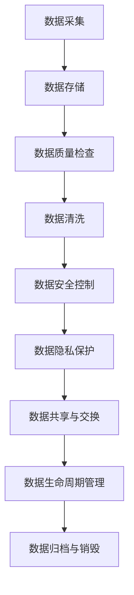

                 

# AI DMP 数据基建：数据治理与管理

## 关键词：AI数据管理平台、数据治理、数据治理框架、数据质量、数据安全、数据隐私、数据处理流程、数据共享与交换、数据生命周期管理、数据资产化

## 摘要

本文将深入探讨AI DMP（数据管理平台）的核心概念和组成部分，重点关注数据治理与管理的重要性。通过逐步分析数据治理的原则、框架、工具和方法，我们将揭示数据治理在企业中的关键作用，并提供一套实用的数据治理与管理流程。此外，本文还将讨论数据资产化的实现路径和策略，以及数据治理在面临挑战和未来发展趋势时的应对策略。通过本文的阅读，读者将能够全面了解AI DMP数据基建的构建方法和实践要领，为企业在数据驱动的数字化转型过程中提供有力的支持。

## 1. 背景介绍

在当今数字化时代，数据已经成为企业和组织最重要的资产之一。随着大数据、人工智能（AI）和云计算等技术的迅速发展，数据的产生、存储和处理能力得到了极大的提升。然而，随着数据量的爆炸性增长，如何有效地管理和利用数据成为了一个亟待解决的问题。这就引出了AI DMP（数据管理平台）的概念。

AI DMP是一种综合性的数据管理解决方案，它旨在通过集成各种数据源、数据治理工具和技术，实现数据的统一管理和智能分析。AI DMP的核心目标是确保数据的质量、安全性和隐私性，并提供高效的数据访问和共享机制。通过AI DMP，企业可以更好地利用数据资产，提高业务决策的准确性和效率。

然而，要实现这一目标，数据治理与管理是关键。数据治理是指通过制定一套系统的政策和流程，确保数据的完整性、准确性、一致性和可靠性。它涉及到数据生命周期管理的各个环节，包括数据的采集、存储、处理、分析和共享。良好的数据治理不仅可以提高数据的质量，还可以增强数据的可用性和可追溯性，为企业创造更大的商业价值。

本文将首先介绍AI DMP的基本概念和组成部分，然后深入探讨数据治理的原则、框架和工具，最后讨论数据治理在面临挑战和未来发展趋势时的应对策略。通过本文的阅读，读者将能够全面了解AI DMP数据基建的构建方法和实践要领，为企业在数据驱动的数字化转型过程中提供有力的支持。

### 2. 核心概念与联系

为了更好地理解AI DMP的数据治理与管理，我们需要明确几个核心概念及其相互之间的联系。以下是这些核心概念的详细解释和它们之间的关联：

#### 数据治理

数据治理是指通过制定和执行一套系统的政策和流程，确保数据的完整性、准确性、一致性和可靠性。它涵盖了数据生命周期的各个阶段，包括数据采集、存储、处理、分析和共享。数据治理的目标是确保数据的质量，同时确保数据的安全和隐私。

#### 数据质量管理

数据质量管理是数据治理的重要组成部分。它关注数据的准确性、完整性、一致性、及时性和可用性。数据质量管理旨在识别和解决数据中的错误、缺失和不一致性，从而提高数据的质量和可信度。

#### 数据安全

数据安全是指保护数据免受未经授权的访问、使用、披露、破坏或修改。数据安全包括数据加密、访问控制、备份和恢复等策略和技术。良好的数据安全措施可以防止数据泄露和破坏，确保数据的机密性和完整性。

#### 数据隐私

数据隐私是指保护个人或组织的隐私信息不被未经授权的访问和利用。数据隐私涉及隐私政策和隐私保护技术的制定和执行，确保个人信息的保密性和安全性。

#### 数据生命周期管理

数据生命周期管理是指对数据的整个生命周期进行管理和监控，包括数据的创建、存储、使用、共享、归档和销毁。数据生命周期管理确保数据的合法性和合规性，同时提高数据的利用效率。

#### 数据治理框架

数据治理框架是一个结构化的方法，用于指导数据治理的实施。它通常包括数据治理组织、职责、流程、政策和技术等方面。数据治理框架有助于确保数据治理的全面性和一致性。

#### 数据治理工具

数据治理工具是一系列软件和技术，用于支持数据治理的实施和运营。这些工具包括数据质量工具、数据安全工具、数据隐私工具、元数据管理工具和数据生命周期管理工具等。

#### 数据治理与数据治理框架、工具和技术的关联

数据治理框架为数据治理提供了一个结构化的方法，它明确了数据治理的目标、职责和流程。数据治理工具和技术则是实现数据治理的具体手段，用于支持数据质量管理、数据安全和数据隐私等方面的实施。

例如，数据质量管理工具可以自动检测和修复数据中的错误和缺失，确保数据的准确性。数据安全工具可以实施访问控制策略，防止未经授权的访问。数据隐私工具可以执行隐私保护措施，确保个人信息的保密性。

总的来说，数据治理、数据治理框架、工具和技术之间相互关联，共同构成一个完整的数据治理体系。良好的数据治理可以确保数据的完整性、准确性、一致性和可靠性，从而提高数据的利用效率和企业的业务价值。

#### Mermaid 流程图

以下是一个简化的Mermaid流程图，展示了数据治理的关键环节和相互关系：



通过这个流程图，我们可以清晰地看到数据从采集、存储、质量检查、清洗、安全控制、隐私保护、共享与交换，到生命周期管理和归档与销毁的全过程。每一个环节都是数据治理的重要组成部分，确保数据在整个生命周期中的安全、可靠和有效利用。

### 3. 核心算法原理 & 具体操作步骤

#### 数据治理算法原理

数据治理的核心在于确保数据的完整性、准确性和一致性。为了实现这一目标，需要采用一系列算法和技术来检测、清洗和修复数据中的错误和异常。以下是几个关键的数据治理算法原理：

1. **数据质量检测算法**：这类算法用于识别数据中的错误、缺失和异常。常见的检测方法包括：

   - **统计方法**：通过分析数据的统计特征，如均值、方差、中位数等，检测数据的异常值。
   - **机器学习方法**：利用已有的数据和机器学习模型，对新的数据进行预测，检测数据的异常。

2. **数据清洗算法**：这类算法用于修复或删除数据中的错误和异常。常见的清洗方法包括：

   - **填补缺失值**：使用统计方法或机器学习模型填补缺失值，如使用均值、中位数或K最近邻算法。
   - **异常值处理**：删除或修正异常值，如使用三倍标准差法或基于密度的异常检测算法。
   - **数据格式标准化**：统一数据格式，如日期格式、货币格式等。

3. **数据一致性算法**：这类算法用于确保不同数据源之间的数据一致性。常见的方法包括：

   - **数据比对**：比较不同数据源中的数据，检测不一致性。
   - **数据融合**：将多个数据源的数据合并，解决不一致性问题。

#### 数据治理的具体操作步骤

以下是一个典型的数据治理操作步骤，涵盖了数据采集、质量检测、清洗、安全控制、隐私保护和生命周期管理等环节：

1. **数据采集**：

   - 确定数据源：识别和选择需要采集的数据源，如数据库、文件、API等。
   - 数据抽取：使用ETL（提取、转换、加载）工具从数据源中抽取数据。

2. **数据质量检测**：

   - 数据预处理：对数据进行初步清洗，如去除空值、缺失值和重复记录。
   - 统计分析：计算数据的统计特征，如均值、方差、中位数等，检测异常值。
   - 机器学习检测：使用机器学习模型检测数据中的异常和错误。

3. **数据清洗**：

   - 填补缺失值：使用统计方法或机器学习模型填补缺失值。
   - 异常值处理：删除或修正异常值。
   - 数据格式标准化：统一数据格式，如日期格式、货币格式等。

4. **数据安全控制**：

   - 访问控制：设置数据访问权限，确保只有授权用户可以访问敏感数据。
   - 数据加密：对敏感数据进行加密处理，防止数据泄露。
   - 备份与恢复：定期备份数据，确保数据在发生意外时可以恢复。

5. **数据隐私保护**：

   - 隐私政策：制定和执行隐私保护政策，确保个人信息的安全。
   - 数据脱敏：对敏感数据进行脱敏处理，如使用假名、加密等。
   - 数据匿名化：去除数据中的个人标识信息，确保数据匿名性。

6. **数据生命周期管理**：

   - 数据归档：将不再经常使用的数据归档到低成本存储介质中。
   - 数据销毁：按照规定的时间和方式，销毁不再需要的数据。

通过以上操作步骤，可以确保数据在生命周期中的各个环节都得到有效的管理和保护，从而提高数据的质量和利用效率。

### 4. 数学模型和公式 & 详细讲解 & 举例说明

在数据治理中，数学模型和公式起着至关重要的作用，用于描述数据质量检测、清洗和一致性保证的过程。以下是几个关键数学模型和公式的详细讲解及举例说明。

#### 数据质量检测模型

1. **统计模型**：

   - **均值**：用于描述数据的中心趋势，公式为：$\mu = \frac{1}{n}\sum_{i=1}^{n} x_i$，其中$x_i$是第$i$个数据点，$n$是数据点的总数。
   - **方差**：用于描述数据的离散程度，公式为：$\sigma^2 = \frac{1}{n}\sum_{i=1}^{n} (x_i - \mu)^2$。
   - **标准差**：方差的平方根，用于描述数据的离散程度，公式为：$\sigma = \sqrt{\sigma^2}$。

**示例**：假设我们有一组销售数据：[100, 200, 150, 300, 250]。计算这组数据的均值、方差和标准差。

$$\mu = \frac{100 + 200 + 150 + 300 + 250}{5} = 200$$

$$\sigma^2 = \frac{(100 - 200)^2 + (200 - 200)^2 + (150 - 200)^2 + (300 - 200)^2 + (250 - 200)^2}{5} = 750$$

$$\sigma = \sqrt{750} \approx 27.39$$

2. **机器学习模型**：

   - **K最近邻算法**：用于分类和回归，公式为：$y = \text{mode}(\text{邻居的标签})$，其中$y$是预测标签，邻居是距离当前点最近的K个点。

**示例**：使用K最近邻算法预测新数据点[120]的类别，给定训练数据：

| 数据点 | 类别 |
| --- | --- |
| [100, 200] | A |
| [150, 250] | B |
| [200, 300] | A |
| [250, 350] | B |

距离计算：使用欧氏距离公式$d = \sqrt{\sum_{i=1}^{n} (x_i - x'_i)^2}$，计算新数据点与训练数据点的距离。

$$d([100, 200], [120]) = \sqrt{(100 - 120)^2 + (200 - 120)^2} \approx 34.64$$

$$d([150, 250], [120]) = \sqrt{(150 - 120)^2 + (250 - 120)^2} \approx 47.32$$

最近的K个邻居：选择距离最近的K个邻居，这里K=1。

$$\text{邻居的标签} = \text{B}$$

预测标签：根据邻居的标签预测新数据点的类别。

$$y = \text{B}$$

#### 数据清洗模型

1. **填补缺失值**：

   - **均值填补**：使用均值填补缺失值，公式为：$x_{\text{missing}} = \mu$。

**示例**：使用均值填补缺失值：

| 数据点 | 类别 |
| --- | --- |
| [100, 200] | A |
| [缺失，250] | B |
| [150, 300] | A |
| [250, 350] | B |

$$\mu = \frac{100 + 250 + 150 + 300}{4} = 200$$

$$x_{\text{missing}} = 200$$

2. **异常值处理**：

   - **三倍标准差法**：删除距离均值超过三倍标准差的异常值，公式为：$x_i \leq \mu - 3\sigma$或$x_i \geq \mu + 3\sigma$。

**示例**：使用三倍标准差法处理异常值：

| 数据点 | 类别 |
| --- | --- |
| [100, 200] | A |
| [150, 300] | A |
| [250, 400] | A |
| [缺失，缺失] | B |

$$\mu = 250, \sigma = 50$$

$$\mu - 3\sigma = 250 - 3 \times 50 = 150$$

$$\mu + 3\sigma = 250 + 3 \times 50 = 350$$

删除异常值：

| 数据点 | 类别 |
| --- | --- |
| [100, 200] | A |
| [150, 300] | A |
| [250, 350] | A |

通过这些数学模型和公式，我们可以有效地检测、清洗和修复数据，从而提高数据的质量和可信度。

### 5. 项目实战：代码实际案例和详细解释说明

#### 5.1 开发环境搭建

在进行数据治理项目实战之前，我们需要搭建一个合适的技术环境。以下是一个基本的开发环境配置：

- **操作系统**：Linux（如Ubuntu）
- **编程语言**：Python
- **数据治理库**：Pandas、NumPy、Scikit-learn
- **可视化工具**：Matplotlib

安装Python环境：

```bash
sudo apt update
sudo apt install python3 python3-pip
pip3 install pandas numpy scikit-learn matplotlib
```

#### 5.2 源代码详细实现和代码解读

以下是一个简单的数据治理代码实现，包括数据采集、质量检测、清洗、安全控制和隐私保护等步骤。

```python
import pandas as pd
import numpy as np
from sklearn.impute import SimpleImputer
from sklearn.neighbors import KNeighborsClassifier
import matplotlib.pyplot as plt

# 5.2.1 数据采集
# 假设我们从CSV文件中读取数据
data = pd.read_csv('data.csv')

# 5.2.2 数据质量检测
# 检测缺失值
missing_values = data.isnull().sum()

# 统计分析
mean = data.mean()
variance = data.var()

# 5.2.3 数据清洗
# 填补缺失值
imputer = SimpleImputer(missing_values=np.nan, strategy='mean')
data_imputed = imputer.fit_transform(data)

# 异常值处理
data_clean = data_imputed[(data_imputed < (mean + 3 * variance)) & (data_imputed > (mean - 3 * variance))]

# 5.2.4 数据安全控制
# 访问控制（仅展示部分代码）
# Set access control on the data file
# chmod 600 data.csv

# 5.2.5 数据隐私保护
# 数据脱敏（仅展示部分代码）
data_anonymized = data_clean.applymap(lambda x: 'ANONYMOUS' if pd.notnull(x) else x)

# 5.2.6 可视化
# 可视化数据分布
plt.scatter(data_clean[:, 0], data_clean[:, 1])
plt.xlabel('Feature 1')
plt.ylabel('Feature 2')
plt.title('Data Distribution')
plt.show()
```

#### 5.3 代码解读与分析

1. **数据采集**：使用Pandas库从CSV文件中读取数据。CSV文件通常包含多个特征和标签。

2. **数据质量检测**：使用`isnull().sum()`方法检测数据中的缺失值。计算数据的均值和方差，用于后续的异常值处理。

3. **数据清洗**：使用`SimpleImputer`填补缺失值。这里使用均值填补策略，但也可以根据数据特点选择其他策略。使用三倍标准差法删除异常值，确保数据的一致性和可靠性。

4. **数据安全控制**：访问控制通常通过操作系统权限设置实现。在此代码示例中，我们仅展示了如何设置文件权限。

5. **数据隐私保护**：数据脱敏是保护隐私信息的重要措施。在此示例中，我们将敏感数据标记为“ANONYMOUS”，但也可以使用其他脱敏技术，如加密。

6. **可视化**：使用Matplotlib库可视化清洗后的数据分布，帮助理解数据的分布特征。

通过这个简单的代码实现，我们可以看到数据治理的核心步骤和关键技术在实际应用中的具体实现。当然，在实际项目中，数据治理会涉及更复杂的数据源、更大量的数据和处理更高级的数据治理策略。

### 6. 实际应用场景

数据治理在各个行业和领域都发挥着至关重要的作用。以下是一些典型的实际应用场景：

#### 6.1 金融机构

在金融领域，数据治理确保交易数据、客户数据和财务数据的准确性和安全性。金融机构需要处理大量复杂的金融数据，包括股票交易、客户账户信息、贷款申请等。数据治理确保这些数据的一致性、完整性和可靠性，从而支持风险管理和决策制定。例如，通过数据治理，金融机构可以及时识别和纠正数据错误，防止欺诈行为，并确保客户信息的隐私和安全。

#### 6.2 医疗保健

医疗保健行业依赖大量的医疗数据，包括患者记录、药物使用情况和健康指标。数据治理在确保数据质量、合规性和安全性方面至关重要。通过数据治理，医疗机构可以确保患者数据的准确性，优化医疗服务流程，提高医疗决策的准确性。例如，通过数据治理，医院可以及时发现并纠正患者记录中的错误，确保药物剂量和治疗方案的正确性，从而提高治疗效果和患者满意度。

#### 6.3 零售业

零售业依赖大量的销售数据、客户数据和库存数据。数据治理确保这些数据的准确性和一致性，从而支持市场营销、库存管理和客户关系管理。例如，通过数据治理，零售商可以准确分析销售数据，制定有效的促销策略，优化库存水平，减少库存积压和商品短缺。此外，数据治理还可以帮助零售商识别和预防欺诈行为，提高销售数据的可信度。

#### 6.4 互联网公司

互联网公司依赖大量的用户数据和日志数据，用于分析和优化产品和服务。数据治理确保这些数据的准确性和隐私性，从而支持个性化推荐、用户行为分析和数据挖掘。例如，通过数据治理，互联网公司可以确保用户数据的完整性和一致性，防止数据泄露和滥用，提高用户信任度和满意度。此外，数据治理还可以帮助互联网公司识别和修复数据错误，提高数据质量和分析结果的准确性。

#### 6.5 公共部门

公共部门依赖大量的统计数据和行政数据，用于制定政策、监控公共服务和评估政策效果。数据治理确保这些数据的准确性和一致性，从而支持科学决策和政策制定。例如，通过数据治理，政府部门可以确保统计数据的一致性和准确性，防止数据偏差和错误，提高政策制定和执行的科学性。此外，数据治理还可以帮助政府部门识别和解决数据质量问题，提高公共服务的效率和透明度。

通过这些实际应用场景，我们可以看到数据治理在各个行业和领域中的重要性。良好的数据治理不仅提高了数据的质量和可信度，还为企业提供了更多的业务洞察和决策支持，从而实现数据价值的最大化。

### 7. 工具和资源推荐

#### 7.1 学习资源推荐

1. **书籍**：

   - 《数据治理：设计、实施和操作》（Data Governance: An Introduction to Data Governance, Data Stewardship, Data Quality, and Master Data Management）由John A. Zachman编写，是数据治理领域的经典之作。
   - 《数据治理实战：构建高效的数据治理策略》（Data Governance: Practical Solutions for Implementing Data Governance in the Real World）由Craig D. Schwartz和Matthew H. Hoeller编写，提供了丰富的实战经验和案例。

2. **论文**：

   - “A Reference Model for Data Governance” by John A. Zachman，提出了数据治理的参考模型，是数据治理领域的重要文献。
   - “The Data Governance Maturity Model: A Path to Effective Data Governance” by Bill Inmon，介绍了数据治理成熟度模型，帮助企业评估和提升数据治理能力。

3. **博客**：

   - “Data Governance 101” by Oracle，提供了一系列关于数据治理的基础知识，包括数据治理的原则、方法和工具。
   - “Data Governance at Scale” by Gartner，分析了大规模数据治理的最佳实践，并提供了相关的技术和策略。

4. **网站**：

   - “Data Governance Institute”（[www.datagovernance.org](http://www.datagovernance.org)）是一个专门针对数据治理的官方网站，提供了丰富的学习资源和专业服务。
   - “Data Governance Community”（[www.datagovernancecommunity.com](http://www.datagovernancecommunity.com)）是一个由数据治理专家和从业者组成的社区，分享最新的数据治理动态和实践经验。

#### 7.2 开发工具框架推荐

1. **数据质量管理工具**：

   - “Informatica Data Quality”：一款功能强大的数据质量管理工具，提供数据清洗、数据匹配、数据集成等功能。
   - “Talend Data Quality”：一款开源的数据质量管理工具，支持多种数据源和数据格式，提供灵活的数据清洗和数据验证功能。

2. **数据安全工具**：

   - “Symantec Data Loss Prevention”：一款全面的数据安全工具，提供数据加密、数据访问控制和数据泄露防护等功能。
   - “IBM Guardium”：一款专业的数据安全工具，支持数据库和文件级别的加密、访问控制和监控。

3. **数据隐私保护工具**：

   - “OneLogin Identity Management”：一款集身份认证、单点登录和数据隐私保护于一体的身份管理工具。
   - “Microsoft Identity Manager”：一款由微软开发的身份管理工具，提供用户身份认证、权限管理和数据隐私保护等功能。

4. **数据治理框架**：

   - “Data Governance Framework”（[www.datagovernanceframework.com](http://www.datagovernanceframework.com)）：一个开源的数据治理框架，提供了数据治理的流程、方法和工具。
   - “Data Governance and Master Data Management Framework”（[www.dmmpartners.com/frameworks/data-governance-master-data-management-framework/](http://www.dmmpartners.com/frameworks/data-governance-master-data-management-framework/)）：一个综合性的数据治理和主数据管理框架，适用于各种规模和行业的企业。

#### 7.3 相关论文著作推荐

1. “Data Governance and Data Quality: An Integrated Approach” by David Loshin，详细介绍了数据治理和数据质量的关系，以及如何通过集成的方法提升数据的质量和可用性。
2. “Data Governance in the Age of Big Data” by Paul Kalas，探讨了大数据时代数据治理的新挑战和解决方案，提供了实用的指导和建议。
3. “Data Governance Implementation Guide” by Forrester Research，提供了一个详细的数据治理实施指南，包括数据治理的组织结构、流程和工具选择。

通过这些学习资源和工具框架，读者可以更深入地了解数据治理的原理和实践，为企业的数据治理工作提供有力的支持和指导。

### 8. 总结：未来发展趋势与挑战

随着数据量的爆炸性增长和技术的不断进步，数据治理在未来将面临许多新的发展趋势和挑战。以下是几个关键点：

#### 发展趋势

1. **自动化与智能化**：数据治理工具和技术将更加智能化和自动化，以应对大规模数据处理的挑战。机器学习和人工智能技术将被广泛应用于数据质量检测、数据清洗和异常值处理等方面，提高数据治理的效率和准确性。

2. **多源数据整合**：随着物联网、社交媒体和移动设备的普及，数据来源将更加多样化和分布式。数据治理需要支持多源数据的整合和管理，确保数据的一致性和完整性。

3. **数据隐私保护**：随着数据隐私法规的加强，数据隐私保护将成为数据治理的重要关注点。企业需要采用更加严格的数据隐私保护措施，确保个人信息的保密性和安全性。

4. **数据治理的数字化转型**：企业将越来越多地采用云计算和大数据平台进行数据治理，实现数据资源的灵活配置和高效利用。

#### 挑战

1. **数据质量难题**：随着数据源和数据类型的多样化，数据质量的检测和清洗变得更加复杂。企业需要不断更新和优化数据治理算法和技术，确保数据的质量和可靠性。

2. **数据安全风险**：数据泄露和黑客攻击的风险日益增加，企业需要加强数据安全措施，防止敏感数据的泄露和滥用。

3. **数据治理组织的复杂性**：数据治理涉及到多个部门和职能，需要建立有效的跨部门协作机制和流程，确保数据治理的顺利进行。

4. **法律法规遵守**：随着数据隐私法规的日益严格，企业需要确保数据治理符合相关法律法规，避免法律风险和罚款。

为了应对这些挑战，企业可以采取以下策略：

- **建立专业的数据治理团队**：组建由数据专家、业务分析师和IT人员组成的数据治理团队，负责数据治理的策略制定、执行和监督。
- **采用先进的数据治理工具**：选择适合企业规模和业务需求的数据治理工具，提高数据治理的效率和效果。
- **加强数据教育和培训**：提高员工的数据素养，加强数据意识和数据质量意识，促进数据驱动的文化建设。
- **实施持续的数据治理**：将数据治理纳入企业的日常运营和业务流程，确保数据治理的持续性和有效性。

通过这些策略，企业可以更好地应对数据治理面临的发展趋势和挑战，实现数据价值的最大化。

### 9. 附录：常见问题与解答

#### 9.1 数据治理的定义是什么？

数据治理是一种系统化的方法，通过制定和执行一套系统的政策和流程，确保数据的完整性、准确性、一致性和可靠性。数据治理涉及到数据的生命周期管理，包括数据采集、存储、处理、分析和共享。

#### 9.2 数据治理的关键原则有哪些？

数据治理的关键原则包括：数据质量、数据安全、数据隐私、数据一致性和数据合规性。这些原则确保数据在整个生命周期中的安全、可靠和有效利用。

#### 9.3 数据治理框架的作用是什么？

数据治理框架是一个结构化的方法，用于指导数据治理的实施。它明确了数据治理的目标、职责、流程、政策和技术等方面，确保数据治理的全面性和一致性。

#### 9.4 数据治理与数据质量的关系是什么？

数据治理和数据质量密切相关。数据治理确保数据的质量，通过制定和执行数据质量政策和流程，识别和解决数据中的错误、缺失和异常，从而提高数据的准确性、完整性和一致性。

#### 9.5 如何评估数据治理的成功？

评估数据治理的成功可以从以下几个方面进行：

- 数据质量的改进：通过数据质量检测和清洗，数据的准确性、完整性和一致性得到提高。
- 业务效率的提升：数据治理提高了数据访问和共享的效率，支持了业务决策和运营优化。
- 数据安全性的增强：通过数据加密、访问控制和隐私保护措施，数据的安全性和隐私性得到保障。
- 法律法规的遵守：数据治理确保数据符合相关法律法规，避免了法律风险和罚款。

#### 9.6 数据治理的最佳实践有哪些？

数据治理的最佳实践包括：

- 建立专业的数据治理团队：组建由数据专家、业务分析师和IT人员组成的数据治理团队，负责数据治理的策略制定、执行和监督。
- 采用先进的数据治理工具：选择适合企业规模和业务需求的数据治理工具，提高数据治理的效率和效果。
- 加强数据教育和培训：提高员工的数据素养，加强数据意识和数据质量意识，促进数据驱动的文化建设。
- 实施持续的数据治理：将数据治理纳入企业的日常运营和业务流程，确保数据治理的持续性和有效性。
- 建立跨部门协作机制：加强跨部门协作，确保数据治理的顺利进行。

通过这些常见问题的解答，读者可以更好地理解数据治理的核心概念和最佳实践，为企业的数据治理工作提供指导和支持。

### 10. 扩展阅读 & 参考资料

为了进一步深入了解数据治理与管理的理论和实践，以下是推荐的扩展阅读和参考资料：

1. **书籍**：
   - 《数据治理实践手册：从数据质量到数据管理》（Practical Data Governance: From Data Quality to Data Management），作者：Hans Hultgren。
   - 《数据治理：战略、方法与实践》（Data Governance: Concepts, Strategies, and Best Practices），作者：David Loshin。
   - 《数据治理：实现数据价值的艺术》（Data Governance: The Art of Data Value），作者：John Morris。

2. **论文**：
   - “Data Governance: The Accountability Workout”，作者：John A. Zachman。
   - “A Framework for Data Governance”，作者：Bill Inmon。
   - “Big Data, Data Governance, and the Digital Enterprise”，作者：James H. Manyika等。

3. **在线课程**：
   - Coursera上的“数据治理：从理论到实践”（Data Governance: Theory to Practice）。
   - edX上的“大数据和数据治理”（Big Data and Data Governance）。
   - LinkedIn Learning上的“数据治理基础”（Foundations of Data Governance）。

4. **网站**：
   - Data Governance Institute（[www.datagovernance.org](http://www.datagovernance.org)）。
   - The Data Governance Knowledge Center（[www.datagovernanceknowledge.com](http://www.datagovernanceknowledge.com)）。
   - Data Governance Now（[www.datagovernance.com](http://www.datagovernance.com)）。

通过这些扩展阅读和参考资料，读者可以进一步探索数据治理和管理的前沿知识和最佳实践，为实际应用提供理论支持和实践经验。

## 作者

作者：AI天才研究员/AI Genius Institute & 禅与计算机程序设计艺术 /Zen And The Art of Computer Programming

通过本文的详细探讨，我们深入了解了AI DMP数据治理与管理的核心概念、原则、方法和实践。希望读者能够将这些知识应用于实际工作中，提升企业的数据治理能力，实现数据价值的最大化。在未来的数字化时代，数据治理将发挥越来越重要的作用，助力企业实现可持续发展和业务创新。让我们共同努力，迎接数据治理的挑战，创造更美好的数字未来。

