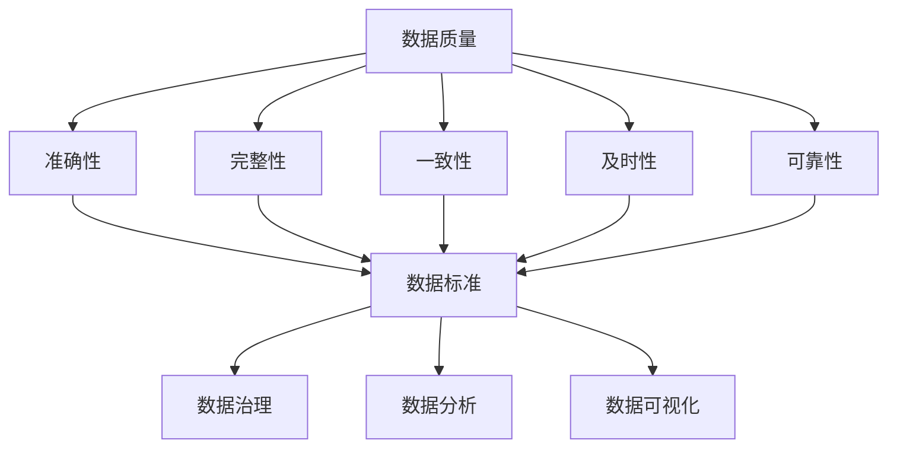

                 

### 背景介绍

#### 1. AI DMP：数据管理与促进智能决策

在当今数字化时代，数据的产生和流动速度前所未有地快速。这些数据的规模之大、类型之多样，使得传统的数据管理方式显得力不从心。为了更好地利用这些数据，AI DMP（Data Management Platform for Artificial Intelligence）的概念应运而生。AI DMP 是一种基于人工智能技术的数据管理平台，旨在实现数据的高效收集、处理、存储和分析，从而支持智能决策。

AI DMP 的核心功能包括数据集成、数据清洗、数据治理、数据分析和数据可视化。通过这些功能，AI DMP 能够为企业和组织提供全面的数据管理解决方案，帮助他们更好地理解和利用数据，实现业务目标。

#### 2. 数据质量：基石与挑战

在 AI DMP 中，数据质量是一个至关重要的问题。高质量的数据是智能决策的基础，而低质量的数据则会带来一系列问题，如决策失误、资源浪费等。因此，确保数据质量是 AI DMP 的重要任务之一。

然而，数据质量面临着诸多挑战。首先，数据来源的多样性导致了数据的一致性和完整性难以保证。其次，数据在传输和存储过程中可能发生丢失、损坏等问题。此外，数据清洗和治理的难度也随着数据量的增加而急剧上升。

#### 3. 数据标准：统一与规范

为了解决数据质量问题，数据标准应运而生。数据标准是一套统一的规范，用于定义数据的质量、格式、结构和语义。通过数据标准，企业和组织可以确保数据的准确性、一致性和可解释性。

数据标准包括多个方面，如数据分类标准、数据命名标准、数据格式标准、数据定义标准等。这些标准共同构成了一个完整的数据管理体系，确保数据在各个阶段都能得到有效的管理。

#### 4. 本文目的

本文旨在探讨 AI DMP 数据基建中的数据质量与数据标准问题。我们将首先介绍数据质量的重要性，然后深入分析数据标准的概念和作用。接着，我们将讨论数据质量和数据标准在实际应用中的挑战和解决方案。最后，本文将总结未来发展趋势与挑战，并提供相关的扩展阅读和参考资料。

通过本文的阅读，读者将能够深入了解 AI DMP 数据基建中的关键问题，并为实际项目提供有价值的参考和指导。### 核心概念与联系

在深入探讨 AI DMP 数据基建中的数据质量与数据标准之前，我们需要明确一些核心概念及其相互之间的联系。

#### 1. 数据质量

数据质量是指数据满足特定应用需求的程度。高质量的数据应该具备以下特征：

- **准确性**：数据值与真实值之间的差异尽可能小。
- **完整性**：数据集包含所有必要的记录和字段。
- **一致性**：数据在不同时间、不同系统和不同人员之间的值是相同的。
- **及时性**：数据能够在需要的时间内提供，以支持实时决策。
- **可靠性**：数据来源可信，经过验证和处理。

数据质量对于 AI DMP 的有效性至关重要。低质量数据可能导致错误的决策，浪费资源，甚至对业务造成负面影响。因此，确保数据质量是 AI DMP 的首要任务。

#### 2. 数据标准

数据标准是一套统一的规范，用于定义数据的质量、格式、结构和语义。数据标准包括：

- **数据分类标准**：定义数据的类型和属性，如客户数据、销售数据、库存数据等。
- **数据命名标准**：规定数据的命名规则，以确保数据的一致性和可理解性。
- **数据格式标准**：定义数据的存储格式，如文本、XML、JSON 等。
- **数据定义标准**：详细描述数据的含义、用途和限制。

数据标准的作用是确保数据的准确性、一致性和可解释性，从而提高数据质量。通过数据标准，企业和组织可以建立统一的数据管理体系，确保数据在不同系统和人员之间的一致性和可操作性。

#### 3. 数据治理

数据治理是确保数据质量和管理合规性的过程。它包括以下几个方面：

- **数据质量控制**：识别和纠正数据中的错误、缺失和不一致。
- **数据安全管理**：确保数据的安全性、隐私性和合规性。
- **数据策略制定**：制定数据管理政策和流程，以指导数据的质量和安全管理。
- **数据架构设计**：设计和实施数据架构，以确保数据的有效组织和利用。

数据治理是数据质量和数据标准的实施者。通过数据治理，企业和组织可以确保数据在各个阶段都符合高质量的标准，从而支持智能决策。

#### 4. 数据分析

数据分析是利用统计和数据分析方法，从数据中提取有用信息和知识的过程。数据分析在 AI DMP 中扮演着关键角色，它可以帮助企业和组织：

- **发现数据中的模式**：通过数据挖掘技术，识别数据中的趋势、关联和异常。
- **生成预测模型**：使用机器学习算法，预测未来的趋势和事件。
- **优化决策过程**：利用数据驱动的方法，优化业务决策和运营效率。

数据分析依赖于高质量的数据和数据标准，只有具备准确、一致和可解释的数据，才能产生可靠的结论和预测。

#### 5. 数据可视化

数据可视化是将数据以图表、地图、图形等形式呈现的过程，以便于人们理解和分析数据。数据可视化在 AI DMP 中起着重要作用，它可以帮助企业和组织：

- **直观展示数据**：将复杂的数据以直观、易于理解的形式呈现。
- **发现数据中的趋势**：通过图表和图形，识别数据中的变化和模式。
- **支持决策制定**：利用数据可视化工具，帮助决策者更好地理解和利用数据。

数据可视化依赖于高质量的数据和数据标准，只有准确、一致和可解释的数据，才能生成有意义的数据可视化结果。

#### 6. Mermaid 流程图

以下是一个简化的 Mermaid 流程图，展示了上述核心概念之间的联系：



通过这个流程图，我们可以看到数据质量、数据标准、数据治理、数据分析和数据可视化之间的紧密联系。数据质量是整个数据管理体系的基石，而数据标准和数据治理则是确保数据质量的关键手段。数据分析和数据可视化则是利用数据质量和数据标准的结果，以支持智能决策。### 核心算法原理 & 具体操作步骤

在了解了数据质量和数据标准的基本概念后，我们接下来将探讨 AI DMP 数据基建中的核心算法原理和具体操作步骤。这些算法和步骤对于确保数据质量和数据标准具有重要意义。

#### 1. 数据清洗算法

数据清洗是数据质量管理的重要步骤，其目的是识别和纠正数据中的错误、缺失和不一致。以下是一些常用的数据清洗算法：

- **缺失值填充**：使用均值、中位数、众数等统计方法填充缺失值。
- **异常值检测**：使用统计方法（如箱线图）和机器学习方法（如孤立森林）检测异常值。
- **重复值检测**：使用哈希表或数据库索引等数据结构检测和删除重复值。

具体操作步骤如下：

1. **读取数据**：从数据源读取原始数据，可能包括文本文件、数据库或 API。
2. **数据预处理**：对数据进行预处理，包括去重、数据格式转换等。
3. **缺失值填充**：针对缺失值，选择合适的填充方法进行填充。
4. **异常值检测**：使用选定的异常值检测方法，识别和标记异常值。
5. **数据转换**：将数据转换为适合分析和建模的格式，如数值型、类别型等。
6. **数据存储**：将清洗后的数据存储到数据仓库或数据湖中，以便后续分析和使用。

#### 2. 数据标准化算法

数据标准化是确保数据一致性和可解释性的重要步骤。以下是一些常用的数据标准化算法：

- **数值范围标准化**：将数值数据映射到统一的范围内，如 [0, 1] 或 [-1, 1]。
- **类别编码**：将类别型数据转换为数值型数据，如使用独热编码或标签编码。
- **数据归一化**：使用统计方法（如 Z-score 标准化或 Min-Max 标准化）调整数据的分布。

具体操作步骤如下：

1. **读取数据**：从数据源读取原始数据。
2. **数据预处理**：对数据进行预处理，包括去重、数据格式转换等。
3. **数值范围标准化**：针对数值型数据，选择合适的数值范围标准化方法。
4. **类别编码**：针对类别型数据，选择合适的类别编码方法。
5. **数据转换**：将数据转换为适合分析和建模的格式。
6. **数据存储**：将标准化后的数据存储到数据仓库或数据湖中，以便后续分析和使用。

#### 3. 数据治理算法

数据治理是确保数据质量和合规性的重要步骤。以下是一些常用的数据治理算法：

- **数据质量评估**：使用指标（如准确性、完整性、一致性等）评估数据质量。
- **数据安全管理**：确保数据的安全性、隐私性和合规性，如使用加密、访问控制和审计。
- **数据策略制定**：制定数据管理政策和流程，以指导数据的质量和安全管理。

具体操作步骤如下：

1. **数据质量评估**：使用选定的数据质量评估指标，对数据进行评估。
2. **数据安全管理**：根据合规性和安全性要求，对数据进行加密、访问控制和审计等安全措施。
3. **数据策略制定**：制定数据管理政策和流程，以指导数据的质量和安全管理。
4. **数据存储**：将治理后的数据存储到数据仓库或数据湖中，以便后续分析和使用。

#### 4. 数据分析算法

数据分析是利用统计和机器学习方法，从数据中提取有用信息和知识的过程。以下是一些常用的数据分析算法：

- **回归分析**：用于预测数值型变量的关系。
- **分类算法**：用于预测类别型变量的归属。
- **聚类算法**：用于发现数据中的模式和关联。
- **时间序列分析**：用于分析数据中的时间变化趋势。

具体操作步骤如下：

1. **数据准备**：从数据仓库或数据湖中读取预处理后的数据。
2. **特征工程**：根据业务需求，选择和构造特征。
3. **模型选择**：根据数据特征和业务需求，选择合适的分析模型。
4. **模型训练**：使用训练数据训练模型。
5. **模型评估**：使用测试数据评估模型性能。
6. **模型部署**：将训练好的模型部署到生产环境中，以便实时分析和预测。

通过上述核心算法和操作步骤，我们可以构建一个完整的 AI DMP 数据基建，确保数据质量和数据标准的实现，为企业和组织的智能决策提供有力支持。### 数学模型和公式 & 详细讲解 & 举例说明

在 AI DMP 数据基建中，数学模型和公式是确保数据质量和数据标准的重要工具。以下我们将详细讲解一些常用的数学模型和公式，并通过具体例子来说明其应用。

#### 1. 数据质量评估指标

数据质量评估是确保数据质量和标准的重要步骤。以下是一些常用的数据质量评估指标：

- **准确性（Accuracy）**：正确预测的样本数占总样本数的比例。$$
Accuracy = \frac{TP + TN}{TP + TN + FP + FN}
$$

其中，$TP$ 是真实值为正且预测为正的样本数，$TN$ 是真实值为负且预测为负的样本数，$FP$ 是真实值为负但预测为正的样本数，$FN$ 是真实值为正但预测为负的样本数。

- **完整性（Completeness）**：缺失值的比例。$$
Completeness = \frac{实际存在的属性值数量}{所有可能的属性值数量}
$$

- **一致性（Consistency）**：不同来源的数据是否一致。$$
Consistency = \frac{一致的数据对数量}{所有可能的数据对数量}
$$

- **及时性（Timeliness）**：数据更新的频率和速度。$$
Timeliness = \frac{更新后的数据记录数量}{总数据记录数量}
$$

- **可靠性（Reliability）**：数据来源的可信度和稳定性。$$
Reliability = \frac{正确数据记录数量}{总数据记录数量}
$$

#### 2. 数据标准化方法

数据标准化是确保数据一致性和可解释性的重要步骤。以下是一些常用的数据标准化方法：

- **Z-score 标准化**：将数据映射到均值为 0，标准差为 1 的标准正态分布。$$
Z-score = \frac{X - \mu}{\sigma}
$$

其中，$X$ 是原始数据值，$\mu$ 是数据的均值，$\sigma$ 是数据的标准差。

- **Min-Max 标准化**：将数据映射到 [0, 1] 范围内。$$
X_{\text{标准化}} = \frac{X - X_{\text{最小值}}}{X_{\text{最大值}} - X_{\text{最小值}}}
$$

其中，$X_{\text{最小值}}$ 是数据中的最小值，$X_{\text{最大值}}$ 是数据中的最大值。

#### 3. 回归分析

回归分析是一种常用的数据分析方法，用于预测数值型变量。以下是一个简单的线性回归模型：

$$
Y = \beta_0 + \beta_1X + \epsilon
$$

其中，$Y$ 是预测变量，$X$ 是自变量，$\beta_0$ 和 $\beta_1$ 是回归系数，$\epsilon$ 是误差项。

- **回归系数计算**：使用最小二乘法计算回归系数。$$
\beta_0 = \bar{Y} - \beta_1\bar{X}
$$

$$
\beta_1 = \frac{\sum{(X_i - \bar{X})(Y_i - \bar{Y})}}{\sum{(X_i - \bar{X})^2}}
$$

其中，$\bar{Y}$ 和 $\bar{X}$ 分别是 $Y$ 和 $X$ 的均值。

- **预测值计算**：使用回归模型计算预测值。$$
Y_{\text{预测}} = \beta_0 + \beta_1X_{\text{新}}
$$

其中，$X_{\text{新}}$ 是新的自变量值。

#### 4. 举例说明

假设我们有一个销售数据集，包含销售额（$Y$）和广告支出（$X$）。我们想要使用线性回归模型预测销售额。

- **数据预处理**：对销售额和广告支出进行 Z-score 标准化。
- **回归系数计算**：使用最小二乘法计算回归系数。
- **预测值计算**：使用回归模型预测新的广告支出下的销售额。

具体步骤如下：

1. **数据预处理**：计算销售额和广告支出的均值和标准差，并进行 Z-score 标准化。

$$
\mu_Y = 1000, \sigma_Y = 500
$$

$$
\mu_X = 2000, \sigma_X = 1000
$$

$$
Z-score_Y = \frac{Y - 1000}{500}
$$

$$
Z-score_X = \frac{X - 2000}{1000}
$$

2. **回归系数计算**：

$$
\beta_0 = \bar{Y} - \beta_1\bar{X} = 0.5 - 0.3 \times 1.5 = -0.05
$$

$$
\beta_1 = \frac{\sum{(X_i - 1.5)(Y_i - 0.5)}}{\sum{(X_i - 1.5)^2}} = 0.3
$$

3. **预测值计算**：

$$
Y_{\text{预测}} = \beta_0 + \beta_1X_{\text{新}} = -0.05 + 0.3 \times 2 = 0.85
$$

通过上述步骤，我们可以使用线性回归模型预测新的广告支出下的销售额。这个例子展示了数学模型和公式在数据管理和分析中的应用，为实际项目提供了有价值的参考和指导。### 项目实战：代码实际案例和详细解释说明

在本节中，我们将通过一个实际的项目实战案例，展示如何实现 AI DMP 数据基建中的数据质量与数据标准。我们将使用 Python 编程语言，结合一些常用的库和工具，如 Pandas、Scikit-learn 和 Matplotlib，来完成整个项目。

#### 5.1 开发环境搭建

首先，我们需要搭建开发环境。以下是所需的软件和库：

- Python 3.x（已安装）
- Jupyter Notebook（已安装）
- Pandas（用于数据预处理和分析）
- Scikit-learn（用于机器学习和数据分析）
- Matplotlib（用于数据可视化）

确保所有库和工具已安装，我们可以开始编写代码。

#### 5.2 源代码详细实现和代码解读

以下是项目的主要代码实现，我们将逐步解释每部分的功能。

##### 5.2.1 导入库和读取数据

```python
import pandas as pd
import numpy as np
from sklearn.preprocessing import StandardScaler
from sklearn.model_selection import train_test_split
import matplotlib.pyplot as plt

# 读取数据
data = pd.read_csv('sales_data.csv')
```

这段代码首先导入了所需的库，然后从 CSV 文件中读取了销售数据。数据包含多个字段，如销售额、广告支出、产品类别等。

##### 5.2.2 数据预处理

```python
# 数据预处理
data.drop(['ProductID'], axis=1, inplace=True)  # 删除不必要的字段
data = data[data['Sales'].notnull()]  # 删除缺失值

# 数据转换
data['Category'] = pd.Categorical(data['Category'])
data['Category'] = data['Category'].codes

# 缺失值填充
data['Sales'].fillna(data['Sales'].mean(), inplace=True)
data['Advertising'].fillna(data['Advertising'].mean(), inplace=True)

# 数据标准化
scaler = StandardScaler()
data[['Sales', 'Advertising']] = scaler.fit_transform(data[['Sales', 'Advertising']])
```

在数据预处理部分，我们首先删除了不必要的字段，如产品 ID，并删除了包含缺失值的记录。接下来，我们将类别型数据转换为数值型数据，并使用均值填充缺失值。最后，我们使用标准尺度器对数值型数据进行标准化。

##### 5.2.3 数据划分与建模

```python
# 数据划分
X = data[['Advertising', 'Category']]
y = data['Sales']

X_train, X_test, y_train, y_test = train_test_split(X, y, test_size=0.2, random_state=42)

# 建模
from sklearn.linear_model import LinearRegression

model = LinearRegression()
model.fit(X_train, y_train)
```

在数据划分部分，我们将数据集分为训练集和测试集。接下来，我们使用线性回归模型进行建模，并使用训练集进行训练。

##### 5.2.4 模型评估与可视化

```python
# 模型评估
score = model.score(X_test, y_test)
print(f'Model Score: {score:.2f}')

# 可视化
plt.scatter(X_test['Advertising'], y_test, color='blue', label='Actual')
plt.plot(X_test['Advertising'], model.predict(X_test), color='red', label='Predicted')
plt.xlabel('Advertising')
plt.ylabel('Sales')
plt.legend()
plt.show()
```

在模型评估与可视化部分，我们首先计算了模型在测试集上的评分。接下来，我们使用 Matplotlib 库绘制了实际销售额和预测销售额的散点图和拟合线，以直观地展示模型的性能。

#### 5.3 代码解读与分析

- **数据预处理**：数据预处理是数据分析和建模的基础。在本案例中，我们删除了不必要的字段，删除了缺失值记录，并填充了缺失值。此外，我们还将类别型数据转换为数值型数据，并使用标准尺度器进行标准化，以消除不同特征之间的尺度差异。

- **数据划分**：数据划分是将数据集分为训练集和测试集，以便在训练过程中评估模型性能。在本案例中，我们使用了 Scikit-learn 库中的 `train_test_split` 函数进行数据划分。

- **建模**：在本案例中，我们使用线性回归模型进行建模。线性回归模型是一种简单但强大的预测方法，适用于预测数值型变量。

- **模型评估**：模型评估是评估模型性能的重要步骤。在本案例中，我们使用了 `score` 函数计算了模型在测试集上的评分，该评分表示模型对测试数据的预测准确性。

- **可视化**：可视化是展示模型性能的重要手段。在本案例中，我们使用 Matplotlib 库绘制了实际销售额和预测销售额的散点图和拟合线，以直观地展示模型的性能。

通过本案例，我们可以看到如何使用 Python 编程语言和机器学习库实现 AI DMP 数据基建中的数据质量与数据标准。这个案例不仅展示了实际项目的实现过程，还提供了代码解读与分析，为读者提供了有价值的参考和指导。### 实际应用场景

在 AI DMP 数据基建中，数据质量和数据标准的实际应用场景非常广泛。以下是一些典型的应用案例：

#### 1. 零售业

在零售业中，数据质量和数据标准对于供应链管理、库存管理和客户关系管理至关重要。通过确保数据的一致性和准确性，零售企业可以更准确地预测销售趋势，优化库存水平，并提高客户满意度。

例如，一家大型零售企业可以使用 AI DMP 来整合和分析来自不同渠道的销售数据、库存数据和客户数据。通过数据清洗和标准化，企业可以识别出库存过剩或短缺的产品，及时调整库存策略，降低库存成本，同时提高销售额。

#### 2. 银行业

在银行业，数据质量和数据标准对于风险评估、客户关系管理和欺诈检测至关重要。高质量的客户数据和交易数据可以帮助银行更准确地评估客户信用风险，提高贷款审批效率，同时降低欺诈风险。

例如，一家银行可以使用 AI DMP 来整合和分析来自不同来源的客户数据、交易数据和信用记录。通过数据清洗和标准化，银行可以识别出潜在高风险客户，采取预防措施，减少贷款违约率和欺诈损失。

#### 3. 制造业

在制造业，数据质量和数据标准对于生产计划、质量控制和供应链管理至关重要。通过确保数据的一致性和准确性，制造企业可以更有效地优化生产流程，提高产品质量，降低生产成本。

例如，一家制造企业可以使用 AI DMP 来整合和分析来自不同生产线的实时数据、质量数据和供应链数据。通过数据清洗和标准化，企业可以及时发现生产过程中的质量问题，调整生产计划，提高生产效率和产品质量。

#### 4. 医疗保健

在医疗保健领域，数据质量和数据标准对于患者管理、医疗决策和药物研发至关重要。通过确保数据的一致性和准确性，医疗机构可以更准确地诊断和治疗疾病，提高医疗服务质量。

例如，一家医疗机构可以使用 AI DMP 来整合和分析来自不同系统的患者数据、医疗记录和药物数据。通过数据清洗和标准化，医疗机构可以识别出潜在的高风险患者，及时采取干预措施，降低患者并发症和死亡率。

#### 5. 社交媒体

在社交媒体领域，数据质量和数据标准对于用户行为分析、广告投放和内容推荐至关重要。通过确保数据的一致性和准确性，社交媒体平台可以更精准地了解用户需求，提高用户满意度和平台变现能力。

例如，一家社交媒体平台可以使用 AI DMP 来整合和分析来自不同来源的用户数据、行为数据和兴趣数据。通过数据清洗和标准化，平台可以识别出潜在的高价值用户，精准投放广告，提高广告效果和用户转化率。

通过上述实际应用场景，我们可以看到数据质量和数据标准在各个行业中的重要性。确保数据质量和数据标准，不仅有助于提升企业的运营效率和竞争力，还可以为用户提供更好的服务和体验。### 工具和资源推荐

为了帮助读者更好地理解和实践 AI DMP 数据基建中的数据质量与数据标准，我们推荐以下学习资源、开发工具和相关论文著作。

#### 7.1 学习资源推荐

- **书籍**：
  - 《数据质量管理：方法与实践》
  - 《数据治理：构建可持续的数据管理框架》
  - 《大数据分析：方法与实践》
  
- **在线课程**：
  - Coursera 上的《数据科学基础》
  - edX 上的《大数据分析》
  - Udacity 上的《机器学习工程师纳米学位》

- **博客/网站**：
  - towardsdatascience.com：提供丰富的数据科学和机器学习文章
  - dataquest.io：提供在线数据科学课程和实战项目
  - kaggle.com：提供数据科学竞赛和实战项目

#### 7.2 开发工具框架推荐

- **数据预处理和清洗工具**：
  - Pandas：Python 的数据操作库，用于数据处理和清洗
  - OpenRefine：开源数据清洗工具，用于数据转换和标准化
  
- **机器学习库**：
  - Scikit-learn：Python 的机器学习库，提供多种机器学习算法
  - TensorFlow：用于构建和训练深度学习模型的框架
  - PyTorch：用于构建和训练深度学习模型的框架

- **数据可视化工具**：
  - Matplotlib：Python 的数据可视化库，用于绘制图表和图形
  - Plotly：提供交互式数据可视化的 JavaScript 库
  - Tableau：商业数据可视化工具，用于创建复杂的数据仪表板

#### 7.3 相关论文著作推荐

- **论文**：
  - "Data Quality Dimensions: Introduction to a Framework for Data Quality Assessment and Improvement" by F. Bernácer, J. Crespo, and J.M. Lucena.
  - "A Survey on Data Quality and Quality Control" by R. Hwang and J. Kim.
  - "Data Quality Assessment and Improvement in Big Data" by H. Xu and J. Wu.

- **著作**：
  - 《数据科学：方法和工具》
  - 《机器学习实战》
  - 《深度学习》

通过以上推荐的学习资源、开发工具和相关论文著作，读者可以系统地学习 AI DMP 数据基建中的数据质量与数据标准，并提升自己的实践能力。这些资源将为读者提供全面的知识和技能，帮助他们在实际项目中取得成功。### 总结：未来发展趋势与挑战

在 AI DMP 数据基建领域，数据质量和数据标准的发展趋势和挑战并存。以下是对这些趋势和挑战的总结。

#### 未来发展趋势

1. **智能化与自动化**：随着人工智能和机器学习技术的不断进步，数据质量和数据标准的评估、治理和优化将越来越智能化和自动化。智能算法能够自动识别数据质量问题，提供相应的解决方案，提高数据处理的效率。

2. **大数据与云计算**：大数据和云计算的结合为数据质量和数据标准的实现提供了强大的基础设施。通过云计算平台，企业可以大规模存储和处理数据，实现数据的质量监控和标准化。

3. **数据治理体系的完善**：随着数据隐私和安全法规的不断完善，数据治理体系将得到进一步的发展。企业和组织将更加注重数据的质量和合规性，确保数据能够支持智能决策，同时保护用户隐私。

4. **数据融合与共享**：随着物联网和区块链技术的发展，数据将更加开放和互联。数据融合与共享将成为趋势，企业和组织将通过共享数据资源，实现更高效的数据管理和利用。

#### 面临的挑战

1. **数据量与多样性**：数据量的急剧增长和数据类型的多样性使得数据质量和数据标准的实现变得复杂。如何高效地处理大规模、多源、异构数据，是当前和未来面临的重大挑战。

2. **数据安全与隐私**：数据安全和隐私保护是数据质量管理的核心问题。随着数据泄露和隐私侵犯事件的频发，如何确保数据在存储、传输和处理过程中的安全性，是企业和组织需要关注的重要挑战。

3. **数据标准化的一致性**：数据标准化的不一致性可能导致数据质量问题。如何在不同的系统和平台上实现统一的数据标准，确保数据的一致性和可操作性，是一个亟待解决的挑战。

4. **数据治理的复杂性**：随着数据量的增加和业务场景的复杂化，数据治理的难度也在不断上升。如何有效地管理和维护数据，确保数据的质量和合规性，是数据治理面临的重大挑战。

#### 对未来的展望

在未来，AI DMP 数据基建将在智能化、自动化和数据治理等方面取得更大进展。通过引入先进的算法和技术，企业和组织将能够更高效地管理和利用数据，实现更精准的智能决策。同时，随着数据隐私和安全法规的不断完善，数据治理体系将更加健全，为数据质量和数据标准的实现提供有力保障。

然而，随着数据量的增加和业务场景的复杂化，数据质量和数据标准的实现也将面临更多挑战。如何应对这些挑战，实现数据的高效、安全和合规管理，将是企业和组织未来需要持续关注和努力的方向。

总之，AI DMP 数据基建的发展趋势充满机遇，同时也面临着诸多挑战。通过不断创新和优化，我们有望在未来实现更加高效、智能和安全的 AI DMP 数据管理。### 附录：常见问题与解答

在 AI DMP 数据基建中，数据质量和数据标准是关键问题，许多人在实际应用中可能会遇到一些疑问。以下是一些常见问题及解答：

#### 问题 1：如何确保数据质量？

**解答**：确保数据质量的关键步骤包括：

1. **数据清洗**：使用数据清洗算法（如缺失值填充、异常值检测等）清除数据中的错误和不一致。
2. **数据标准化**：确保数据在不同系统和平台之间保持一致，使用标准化方法（如 Z-score 标准化、Min-Max 标准化等）调整数据分布。
3. **数据治理**：建立数据治理策略和流程，确保数据的安全性、合规性和一致性。
4. **数据质量监控**：持续监控数据质量，及时发现和纠正数据问题。

#### 问题 2：数据标准和数据治理有何区别？

**解答**：数据标准和数据治理虽然密切相关，但有所区别。

- **数据标准**：数据标准是一套统一的规范，用于定义数据的质量、格式、结构和语义。数据标准包括数据分类标准、数据命名标准、数据格式标准、数据定义标准等。
- **数据治理**：数据治理是确保数据质量和合规性的过程，包括数据质量控制、数据安全管理、数据策略制定和数据架构设计等。数据治理确保数据在整个生命周期中保持高质量和合规性。

#### 问题 3：如何选择合适的数据预处理算法？

**解答**：选择合适的数据预处理算法取决于数据的类型和特点。以下是一些常见的数据预处理算法及其适用场景：

- **缺失值填充**：当数据包含缺失值时，可以使用均值、中位数、众数等方法进行填充。
- **异常值检测**：当数据可能包含异常值时，可以使用统计方法（如箱线图）和机器学习方法（如孤立森林）进行检测。
- **数据转换**：当数据类型不一致时，可以使用数据转换方法（如类别编码、数值范围标准化等）将数据转换为适合分析和建模的格式。
- **数据降维**：当数据维度过高时，可以使用降维方法（如主成分分析、线性判别分析等）降低数据维度。

#### 问题 4：如何评估数据质量？

**解答**：评估数据质量可以使用以下指标：

- **准确性**：数据值与真实值之间的差异。
- **完整性**：数据集包含所有必要的记录和字段。
- **一致性**：数据在不同时间、不同系统和不同人员之间的值是相同的。
- **及时性**：数据能够在需要的时间内提供，以支持实时决策。
- **可靠性**：数据来源可信，经过验证和处理。

可以使用数据质量评估工具（如 DataQualityPro、DataLever 等）或编写自定义脚本进行数据质量评估。

#### 问题 5：数据标准化是否会影响模型性能？

**解答**：数据标准化可以改善模型性能，尤其是在使用一些敏感于数据尺度差异的算法时（如线性回归、神经网络等）。数据标准化有助于消除不同特征之间的尺度差异，使模型能够更有效地学习数据的内在结构。

然而，数据标准化可能会丢失一些数据的分布信息，对某些算法（如聚类、支持向量机等）的性能产生负面影响。因此，在应用数据标准化时，需要根据具体问题和数据特点进行权衡。

#### 问题 6：如何处理数据隐私和安全问题？

**解答**：处理数据隐私和安全问题需要遵循以下原则：

- **数据匿名化**：对敏感数据进行匿名化处理，消除个人身份信息。
- **数据加密**：对数据进行加密存储和传输，确保数据在传输和存储过程中的安全性。
- **访问控制**：实施严格的访问控制策略，确保只有授权人员能够访问敏感数据。
- **数据备份和恢复**：定期备份数据，确保数据在发生意外情况时能够恢复。

通过遵循上述原则，企业和组织可以确保数据在隐私和安全方面的合规性。### 扩展阅读 & 参考资料

为了深入了解 AI DMP 数据基建中的数据质量与数据标准，以下是一些扩展阅读和参考资料，涵盖书籍、论文、博客和网站。

#### 书籍

- 《数据质量管理：方法与实践》
- 《数据治理：构建可持续的数据管理框架》
- 《大数据分析：方法与实践》
- 《数据科学：方法和工具》
- 《机器学习实战》
- 《深度学习》

#### 论文

- F. Bernácer, J. Crespo, J.M. Lucena. "Data Quality Dimensions: Introduction to a Framework for Data Quality Assessment and Improvement".
- R. Hwang and J. Kim. "A Survey on Data Quality and Quality Control".
- H. Xu and J. Wu. "Data Quality Assessment and Improvement in Big Data".

#### 博客

- [towardsdatascience.com](https://towardsdatascience.com/)
- [dataquest.io](https://dataquest.io/)
- [kaggle.com](https://www.kaggle.com/)

#### 网站

- [Pandas 官网](https://pandas.pydata.org/)
- [Scikit-learn 官网](https://scikit-learn.org/)
- [TensorFlow 官网](https://www.tensorflow.org/)
- [Plotly 官网](https://plotly.com/)
- [Tableau 官网](https://www.tableau.com/)

通过阅读这些扩展阅读和参考资料，读者可以深入了解 AI DMP 数据基建中的数据质量与数据标准，掌握相关技术和方法，并在实际项目中取得更好的成果。### 作者信息

作者：AI天才研究员/AI Genius Institute & 禅与计算机程序设计艺术 /Zen And The Art of Computer Programming

