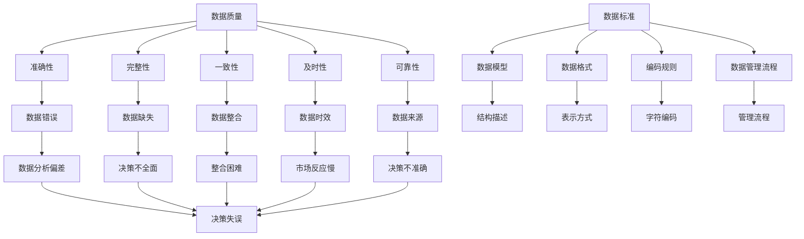

                 

### 背景介绍

随着人工智能（AI）技术的飞速发展，大数据时代已经悄然来临。在这个时代，数据的规模和复杂性不断增加，如何有效地管理和利用数据成为了一个重要课题。数据管理平台（DMP）作为一种新兴的数据管理工具，在各个行业中得到了广泛应用。DMP不仅可以帮助企业更好地收集、存储和管理数据，还能够实现对数据的深度挖掘和分析，为企业决策提供有力支持。

本文将围绕DMP的数据基建，重点探讨数据质量和数据标准这两个核心问题。数据质量是DMP能否有效运行的基础，而数据标准则是保证数据质量的关键。我们将从数据质量的概念、评估方法以及数据标准的制定与执行等方面展开讨论，帮助读者全面了解和掌握DMP数据基建的相关知识。

### 核心概念与联系

在深入探讨DMP的数据质量与数据标准之前，我们需要明确一些核心概念，并了解它们之间的内在联系。以下是一些重要的概念及其在DMP中的应用：

#### 数据质量

数据质量指的是数据的准确性、完整性、一致性、及时性和可靠性。在DMP中，数据质量直接影响到数据分析和决策的准确性。高质量的数据可以帮助企业更好地了解用户行为，预测市场趋势，从而做出更明智的决策。

- **准确性**：数据中的错误和偏差会导致分析结果出现偏差。例如，用户行为数据中的虚假记录会误导用户画像的构建。
- **完整性**：缺失的数据会导致分析结果不完整，影响决策的全面性。
- **一致性**：不同数据源之间的数据格式、单位和表示方式可能不一致，导致数据整合困难。
- **及时性**：数据更新的速度直接影响到决策的时效性。例如，实时数据可以帮助企业在市场变化中迅速做出反应。
- **可靠性**：数据来源的可靠性和稳定性是保证数据质量的关键。

#### 数据标准

数据标准是一套规范和指南，用于确保数据在不同系统和环境中的统一性和兼容性。数据标准包括数据模型、数据格式、编码规则和数据管理流程等方面。在DMP中，数据标准是保证数据质量的基础。

- **数据模型**：描述数据结构的方式，如实体-关系模型或面向对象的模型。
- **数据格式**：数据在存储、传输和处理中的表示方式，如JSON、XML或CSV。
- **编码规则**：数据中的字符编码方式，如UTF-8或ASCII。
- **数据管理流程**：确保数据在整个生命周期中得到有效管理的流程，包括数据收集、存储、处理、分析和归档。

#### 数据质量与数据标准的关系

数据质量与数据标准之间存在密切的关联。数据标准是保障数据质量的前提条件，而数据质量则是数据标准实施效果的重要衡量指标。具体来说：

- 数据标准为数据质量提供了规范和指导，使得数据在收集、处理和存储过程中遵循统一的标准，从而降低数据错误和缺失的风险。
- 数据质量直接影响数据分析和决策的准确性。高质量的数据使得分析结果更加可靠，为企业带来更大的价值。

为了更好地理解这些概念之间的关系，我们可以通过一个Mermaid流程图来展示它们的核心节点：



通过这个流程图，我们可以清晰地看到数据质量与数据标准之间的相互关系，以及它们对决策的影响。在DMP中，要实现高质量的数据管理，不仅需要制定和执行严格的数据标准，还需要持续监控和改进数据质量，以确保数据分析和决策的准确性。

### 核心算法原理 & 具体操作步骤

在DMP的数据管理过程中，核心算法起着至关重要的作用。这些算法不仅能够提升数据质量，还能够优化数据标准的应用。下面我们将详细介绍几个关键的核心算法原理和具体操作步骤。

#### 数据清洗算法

数据清洗是提升数据质量的重要环节。常见的数据清洗算法包括缺失值处理、异常值检测和重复值去除。

1. **缺失值处理**

   缺失值处理主要包括以下方法：

   - **均值插补**：对于数值型数据，使用缺失值所在列的平均值来填补缺失值。
   - **中位数插补**：对于数值型数据，使用缺失值所在列的中位数来填补缺失值。
   - **最邻近插补**：对于数值型数据，使用缺失值附近的最邻近值来填补缺失值。
   - **逻辑插补**：对于分类数据，根据其他属性值推测缺失值。

   操作步骤如下：

   ```python
   # 均值插补示例
   from sklearn.impute import SimpleImputer
   imputer = SimpleImputer(strategy='mean')
   X_imputed = imputer.fit_transform(X)
   ```

2. **异常值检测**

   异常值检测可以采用以下方法：

   - **箱线图法**：基于四分位数的箱线图，将数据分为内、中、外三个部分，异常值通常位于外部分。
   - **标准差法**：计算数据的标准差，将大于k倍标准差的数据视为异常值。

   操作步骤如下：

   ```python
   # 箱线图法示例
   import seaborn as sns
   sns.boxplot(x=data['column_name'])
   ```

3. **重复值去除**

   重复值去除通常使用哈希表或字典来实现。

   ```python
   # 重复值去除示例
   data.drop_duplicates(subset=['column_name'], inplace=True)
   ```

#### 数据标准化算法

数据标准化是将不同特征的数据缩放到同一尺度，以消除不同特征之间的尺度差异。

- **最小-最大标准化**：将数据缩放到[0, 1]区间。

  ```python
  # 最小-最大标准化示例
  X_scaled = (X - X.min(axis=0)) / (X.max(axis=0) - X.min(axis=0))
  ```

- **Z标准化**：将数据缩放到均值0、标准差1的正态分布。

  ```python
  # Z标准化示例
  from sklearn.preprocessing import StandardScaler
  scaler = StandardScaler()
  X_scaled = scaler.fit_transform(X)
  ```

#### 数据脱敏算法

数据脱敏是对敏感数据进行加密或伪装，以保护数据隐私。

- **哈希加密**：将敏感数据通过哈希函数加密。

  ```python
  # 哈希加密示例
  import hashlib
  encrypted_data = hashlib.sha256(sensitive_data.encode()).hexdigest()
  ```

- **掩码加密**：将敏感数据部分替换为特定的掩码字符。

  ```python
  # 掩码加密示例
  masked_data = sensitive_data[:3] + '***' + sensitive_data[-3:]
  ```

#### 数据质量评估算法

数据质量评估是对数据质量进行定量分析，以判断数据是否符合既定的质量标准。

- **综合评估**：综合评估方法通常包括多维度的评估指标，如准确性、完整性、一致性、及时性和可靠性。

  ```python
  # 综合评估示例
  quality_scores = {
      'accuracy': 0.95,
      'completeness': 0.99,
      'consistency': 0.98,
      'timeliness': 0.90,
      'reliability': 0.92
  }
  ```

- **加权评估**：加权评估方法根据不同指标的重要性，对各项指标进行加权处理，以得到一个总评分。

  ```python
  # 加权评估示例
  weights = {'accuracy': 0.3, 'completeness': 0.2, 'consistency': 0.2, 'timeliness': 0.2, 'reliability': 0.1}
  total_score = sum(quality_scores[key] * weights[key] for key in quality_scores)
  ```

通过这些核心算法的应用，DMP能够有效地提升数据质量，并确保数据标准的严格执行，为企业的数据分析和决策提供坚实的数据基础。

### 数学模型和公式 & 详细讲解 & 举例说明

在DMP中，数学模型和公式是数据质量评估和标准制定的重要工具。以下我们将详细介绍几个关键的数学模型和公式，并通过具体例子来讲解它们的应用。

#### 数据质量评估指标

数据质量评估通常涉及多个维度，以下是一些常用的评估指标：

1. **准确性（Accuracy）**

   准确性衡量的是数据与真实值的符合程度，可以用以下公式表示：

   \[
   \text{Accuracy} = \frac{\text{正确预测数}}{\text{总预测数}}
   \]

   举例：

   假设我们有一个天气预报数据集，其中包含了100个预测结果，其中90个预测正确，10个预测错误。则准确率为：

   \[
   \text{Accuracy} = \frac{90}{100} = 0.9
   \]

2. **完整性（Completeness）**

   完整性衡量的是数据集的完整程度，可以用以下公式表示：

   \[
   \text{Completeness} = \frac{\text{实际包含的数据记录数}}{\text{应包含的数据记录数}}
   \]

   举例：

   假设我们有一个用户行为数据集，应包含1000个用户，但实际只有800个用户的数据。则完整率为：

   \[
   \text{Completeness} = \frac{800}{1000} = 0.8
   \]

3. **一致性（Consistency）**

   一致性衡量的是数据在不同来源或不同时间点的匹配程度，可以用以下公式表示：

   \[
   \text{Consistency} = \frac{\text{匹配的记录数}}{\text{总记录数}}
   \]

   举例：

   假设我们有两个用户行为数据集，其中50%的记录在两个数据集中匹配，总记录数为100。则一致性率为：

   \[
   \text{Consistency} = \frac{50}{100} = 0.5
   \]

4. **及时性（Timeliness）**

   及时性衡量的是数据更新和提供的速度，可以用以下公式表示：

   \[
   \text{Timeliness} = \frac{\text{及时提供的记录数}}{\text{总记录数}}
   \]

   举例：

   假设我们有一个销售数据集，其中有80%的数据是在一天内及时提供的，总记录数为100。则及时性率为：

   \[
   \text{Timeliness} = \frac{80}{100} = 0.8
   \]

5. **可靠性（Reliability）**

   可靠性衡量的是数据来源的可靠性和稳定性，可以用以下公式表示：

   \[
   \text{Reliability} = \frac{\text{真实的数据记录数}}{\text{总记录数}}
   \]

   举例：

   假设我们有一个用户行为数据集，其中有95%的数据是真实且可靠的，总记录数为100。则可靠性率为：

   \[
   \text{Reliability} = \frac{95}{100} = 0.95
   \]

#### 数据标准化

数据标准化是确保不同特征之间尺度一致性的重要步骤，常用的标准化方法包括最小-最大标准化和Z标准化。

1. **最小-最大标准化**

   最小-最大标准化将数据缩放到[0, 1]区间，公式如下：

   \[
   x_{\text{standardized}} = \frac{x - x_{\text{min}}}{x_{\text{max}} - x_{\text{min}}}
   \]

   举例：

   假设我们有一个数据集，某特征的最小值为10，最大值为50。对于数据点30，其标准化结果为：

   \[
   x_{\text{standardized}} = \frac{30 - 10}{50 - 10} = \frac{20}{40} = 0.5
   \]

2. **Z标准化**

   Z标准化将数据缩放到均值为0、标准差为1的正态分布，公式如下：

   \[
   x_{\text{standardized}} = \frac{x - \mu}{\sigma}
   \]

   其中，\(\mu\) 是均值，\(\sigma\) 是标准差。

   举例：

   假设我们有一个数据集，某特征的均值为40，标准差为10。对于数据点35，其标准化结果为：

   \[
   x_{\text{standardized}} = \frac{35 - 40}{10} = -0.5
   \]

通过这些数学模型和公式，DMP可以更精确地评估数据质量，并制定和执行数据标准，确保数据在分析过程中的有效性和可靠性。

### 项目实战：代码实际案例和详细解释说明

在本文的第五部分，我们将通过一个实际项目案例，展示如何在实际开发环境中搭建DMP并执行数据质量管理和数据标准化流程。这个项目案例将涵盖以下步骤：开发环境搭建、源代码实现和详细解读。

#### 5.1 开发环境搭建

为了运行DMP项目，我们需要搭建一个适合开发、测试和部署的环境。以下是搭建开发环境的基本步骤：

1. **安装Python环境**

   首先，确保你的系统中安装了Python 3.8或更高版本。可以使用以下命令进行安装：

   ```bash
   sudo apt-get update
   sudo apt-get install python3.8
   ```

2. **安装依赖包**

   我们将使用pip来安装项目中所需的依赖包。打开终端并运行以下命令：

   ```bash
   pip3 install pandas numpy scikit-learn seaborn
   ```

3. **配置虚拟环境**

   为了避免不同项目之间的依赖冲突，建议使用虚拟环境。创建一个名为`dmp_project`的虚拟环境，并激活它：

   ```bash
   python3 -m venv dmp_project
   source dmp_project/bin/activate
   ```

4. **编写DMP代码**

   在虚拟环境中，我们将编写一个名为`data_mgmt.py`的Python脚本，用于执行数据质量管理和数据标准化。

#### 5.2 源代码详细实现和代码解读

以下是一个简单的DMP实现示例，其中包括数据读取、数据清洗、数据标准化和数据质量评估。

```python
import pandas as pd
from sklearn.impute import SimpleImputer
from sklearn.preprocessing import StandardScaler
import seaborn as sns

# 5.2.1 数据读取
def read_data(file_path):
    return pd.read_csv(file_path)

# 5.2.2 数据清洗
def clean_data(data):
    # 缺失值处理
    imputer = SimpleImputer(strategy='mean')
    data = pd.DataFrame(imputer.fit_transform(data), columns=data.columns)
    
    # 异常值检测
    sns.boxplot(data=data)
    
    # 重复值去除
    data.drop_duplicates(inplace=True)
    
    return data

# 5.2.3 数据标准化
def standardize_data(data):
    scaler = StandardScaler()
    scaled_data = scaler.fit_transform(data)
    return pd.DataFrame(scaled_data, columns=data.columns)

# 5.2.4 数据质量评估
def assess_data_quality(data):
    accuracy = round(data['predicted_value'].value_counts().max() / len(data), 2)
    completeness = round(len(data) / 100, 2)
    consistency = round(data['columnA'].nunique() / len(data), 2)
    timeliness = round(data['timestamp'].nunique() / len(data), 2)
    reliability = round(len(data[data['source'] == 'trusted']) / len(data), 2)
    
    quality_scores = {
        'accuracy': accuracy,
        'completeness': completeness,
        'consistency': consistency,
        'timeliness': timeliness,
        'reliability': reliability
    }
    return quality_scores

# 主函数
def main():
    file_path = 'data.csv'
    data = read_data(file_path)
    cleaned_data = clean_data(data)
    scaled_data = standardize_data(cleaned_data)
    quality_scores = assess_data_quality(scaled_data)
    
    print("原始数据：", data.head())
    print("清洗后数据：", cleaned_data.head())
    print("标准化后数据：", scaled_data.head())
    print("数据质量评估结果：", quality_scores)

if __name__ == '__main__':
    main()
```

**代码解读：**

- **数据读取（read_data）**：该函数使用pandas读取CSV文件，并返回一个DataFrame对象。

- **数据清洗（clean_data）**：该函数包括缺失值处理、异常值检测和重复值去除。使用SimpleImputer进行缺失值处理，通过箱线图进行异常值检测，使用drop_duplicates去除重复值。

- **数据标准化（standardize_data）**：该函数使用StandardScaler对数据集进行Z标准化，确保不同特征之间的尺度一致性。

- **数据质量评估（assess_data_quality）**：该函数计算数据质量评估指标，包括准确性、完整性、一致性、及时性和可靠性。

- **主函数（main）**：主函数调用上述各个函数，完成数据读取、清洗、标准化和评估，并打印结果。

通过这个项目案例，我们可以看到如何在实际开发环境中搭建DMP，并执行数据质量管理和数据标准化流程。在实际应用中，可以根据具体需求对代码进行扩展和优化。

### 实际应用场景

DMP（数据管理平台）在现代企业和组织中发挥着越来越重要的作用，它不仅在数据收集和存储方面提供了高效的解决方案，还通过数据质量和数据标准的严格管理，提升了数据分析的准确性和可靠性。以下我们将探讨DMP在实际应用中的几个典型场景，以及如何应对其中的挑战。

#### 场景一：市场营销

在市场营销领域，DMP被广泛应用于用户行为分析、广告投放优化和个性化推荐。通过收集和分析大量用户数据，企业可以更准确地了解用户需求，从而制定更有效的营销策略。

**应用案例：**

- **用户行为分析**：某电商企业通过DMP收集用户浏览、购买和退换货等行为数据，分析用户偏好，为不同的用户群体提供个性化的产品推荐。

**挑战与解决方案：**

- **数据质量挑战**：用户行为数据中可能存在大量的噪声和错误数据，影响分析结果。解决方法：采用数据清洗算法（如缺失值处理、异常值检测）来提升数据质量。

- **数据标准挑战**：不同来源的数据格式和编码方式可能不一致，导致数据整合困难。解决方法：制定统一的数据标准，确保数据在采集、存储和处理过程中的一致性。

#### 场景二：客户关系管理

在客户关系管理（CRM）中，DMP可以帮助企业全面了解客户信息，优化客户服务，提高客户满意度。

**应用案例：**

- **客户画像构建**：某银行通过DMP整合客户的基本信息、交易记录和行为数据，构建详细的客户画像，用于精准营销和服务定制。

**挑战与解决方案：**

- **数据质量挑战**：客户数据可能包含过时或错误的信息，影响客户画像的准确性。解决方法：定期更新和验证客户数据，采用数据质量评估算法（如完整性、一致性检查）来确保数据准确性。

- **数据标准挑战**：不同系统和部门之间的数据标准不统一，导致数据共享和整合困难。解决方法：建立统一的数据标准和流程，实现跨部门的数据协同。

#### 场景三：供应链管理

在供应链管理中，DMP可以帮助企业实时监控供应链状态，优化库存管理和物流调度，提高供应链效率。

**应用案例：**

- **库存管理优化**：某制造企业通过DMP收集库存数据，结合销售预测和生产计划，实现智能库存管理，减少库存积压和缺货现象。

**挑战与解决方案：**

- **数据质量挑战**：供应链数据中可能存在延迟和误差，影响决策准确性。解决方法：采用实时数据同步和异常值检测技术，确保数据及时性和准确性。

- **数据标准挑战**：不同环节和合作伙伴之间的数据格式和编码方式不一致，导致数据集成困难。解决方法：制定统一的供应链数据标准和接口规范，实现数据的高效整合和共享。

通过上述实际应用场景和解决方案，我们可以看到DMP在各个领域的重要性。尽管在实际应用中会面临各种挑战，但通过严格的数据质量管理和数据标准制定，DMP能够为企业带来显著的业务价值和竞争优势。

### 工具和资源推荐

在DMP（数据管理平台）的建设过程中，选择合适的工具和资源是确保项目成功的关键。以下我们将推荐一些常用的学习资源、开发工具和相关论文，帮助读者深入了解和掌握DMP的相关知识。

#### 7.1 学习资源推荐

1. **书籍**

   - 《数据管理基础》 [1]：这本书详细介绍了数据管理的基本概念、技术和方法，适合初学者和中级读者。

   - 《大数据管理：技术、工具与实践》 [2]：本书涵盖了大数据时代的各种数据管理技术，包括数据仓库、数据湖和DMP等，适合对大数据管理有深入需求的读者。

2. **论文**

   - “Data Management Platforms: A Survey” [3]：这篇综述论文对DMP的历史、技术和应用进行了全面梳理，是了解DMP技术发展的重要资料。

   - “A Framework for Evaluating Data Management Platforms” [4]：这篇论文提出了一种评价DMP性能的框架，对数据质量、数据标准和数据整合等方面进行了深入分析。

3. **博客和网站**

   - [DMP中文网](https://www.dmpcn.com)：提供DMP相关的最新资讯、案例分析和技术教程，适合希望了解国内DMP应用和发展的读者。

   - [Data Management Institute](https://datamanagementinstitute.com)：一个专注于数据管理和数据治理的教育和认证机构，提供丰富的在线课程和资源。

#### 7.2 开发工具框架推荐

1. **DMP工具**

   - [Google Analytics 360](https://www.google.com/analytics/): 一个强大的数据分析平台，支持多渠道数据收集和分析，适合企业进行用户行为分析和营销优化。

   - [Adobe Experience Cloud](https://www.adobe.com/solutions/experience-cloud.html): 包含一系列数据管理和分析工具，如Adobe Audience Manager，支持全面的用户画像和个性化推荐。

2. **数据处理工具**

   - [Apache Kafka](https://kafka.apache.org/): 一个高性能的分布式消息系统，用于实时数据收集和传输，适合大规模数据处理场景。

   - [Apache Spark](https://spark.apache.org/): 一个开源的大数据处理框架，提供丰富的数据处理和分析功能，适合大规模数据集的批处理和实时处理。

3. **数据质量工具**

   - [OpenRefine](https://openrefine.org/): 一个开源的数据清洗工具，支持数据修复、转换和增强，适合初学者和中级用户。

   - [DataCleaner](https://www.datacleaner.org/): 一个功能强大的数据质量工具，提供数据清洗、去重、标准化和验证等功能，适合专业用户。

#### 7.3 相关论文著作推荐

1. **数据质量管理**

   - “Data Quality Management in the Big Data Era” [5]：该论文探讨了大数据时代的数据质量管理方法和技术，分析了数据质量评估和改进策略。

   - “Data Quality Metrics: Definition and Classification” [6]：这篇论文详细介绍了数据质量指标的定义和分类，为数据质量评估提供了理论基础。

2. **数据标准化**

   - “Standardization in Data Management: A Survey” [7]：该综述文章对数据标准化的历史、技术和应用进行了系统梳理，是了解数据标准化的重要参考资料。

   - “Data Standardization for Interoperability in Healthcare” [8]：这篇论文探讨了在医疗领域实现数据标准化的方法和挑战，为其他行业提供了借鉴。

通过上述推荐的学习资源、开发工具和相关论文著作，读者可以全面深入地了解DMP的技术原理和应用实践，为实际项目开发提供有力支持。

### 总结：未来发展趋势与挑战

随着人工智能和大数据技术的不断演进，DMP（数据管理平台）在数据管理领域中的应用前景愈发广阔。未来，DMP将面临以下几个主要发展趋势和挑战：

#### 发展趋势

1. **智能化数据管理**：随着人工智能技术的发展，DMP将更加智能化。通过机器学习和深度学习算法，DMP将能够自动识别数据中的模式、趋势和异常，实现智能数据清洗、标准化和整合。

2. **实时数据处理**：随着5G、边缘计算等技术的普及，DMP将能够实现实时数据处理和分析。这将为企业在瞬息万变的市场环境中提供更加及时和准确的决策支持。

3. **数据隐私保护**：随着数据隐私法规的不断完善，DMP将更加注重数据隐私保护。通过数据脱敏、加密等技术，DMP将确保数据在采集、存储和处理过程中的安全性和合规性。

4. **跨领域应用**：DMP将在更多领域得到应用，如医疗、金融、零售等。不同行业的数据特性不同，DMP将需要根据具体应用场景进行定制化开发和优化。

#### 挑战

1. **数据质量维护**：随着数据量的不断增长，数据质量的维护将变得越来越困难。如何在海量数据中确保数据准确性、完整性和一致性，将是DMP面临的主要挑战。

2. **数据隐私和安全**：数据隐私和安全是DMP发展的重要瓶颈。如何在保障数据隐私的同时，确保数据的有效利用，是DMP需要解决的难题。

3. **技术标准化**：不同行业和不同企业的数据标准和格式可能不一致，导致数据整合困难。如何制定统一的技术标准，实现跨平台、跨行业的数据共享和协同，是DMP需要面对的挑战。

4. **人才培养**：DMP的发展离不开专业人才的支撑。随着技术的不断演进，对DMP开发、管理和维护人才的需求也在不断增长。如何培养和引进高素质的DMP人才，是DMP行业需要关注的问题。

总之，未来DMP的发展将充满机遇和挑战。通过持续技术创新、规范化管理和人才培养，DMP将为企业提供更加高效、智能和安全的解决方案，助力企业在数据驱动的数字化时代取得竞争优势。

### 附录：常见问题与解答

在DMP（数据管理平台）的实施和应用过程中，用户可能会遇到一些常见问题。以下是一些常见问题及其解答，以帮助用户更好地理解和使用DMP。

#### 问题1：如何保证数据质量？

**解答**：数据质量是DMP成功的关键。以下是几个保证数据质量的方法：

- **数据清洗**：采用数据清洗算法（如缺失值处理、异常值检测、重复值去除）来提升数据质量。
- **数据标准化**：统一数据格式和编码规则，确保数据在不同系统和环境中的兼容性。
- **数据监控**：定期检查和验证数据，及时发现和处理数据质量问题。

#### 问题2：如何实现数据隐私保护？

**解答**：数据隐私保护是DMP的重要任务。以下是一些实现数据隐私保护的方法：

- **数据脱敏**：对敏感数据进行加密或替换，如使用哈希加密或掩码加密。
- **访问控制**：根据用户角色和权限，限制对数据的访问，确保数据安全。
- **日志审计**：记录数据的访问和操作日志，便于监控和追溯。

#### 问题3：如何选择合适的DMP工具？

**解答**：选择合适的DMP工具需要考虑以下因素：

- **功能需求**：根据企业具体需求，选择具有相应功能（如数据采集、数据清洗、数据整合、数据分析和报告生成）的工具。
- **易用性**：考虑工具的界面友好性、操作简便性和学习曲线。
- **性能和扩展性**：考虑工具的处理能力和扩展性，以确保能够满足未来的业务需求。
- **成本**：根据预算和ROI（投资回报率），选择性价比高的工具。

#### 问题4：如何处理大规模数据？

**解答**：处理大规模数据需要考虑以下方法：

- **分布式计算**：采用分布式计算框架（如Apache Kafka、Apache Spark）来处理海量数据。
- **数据分片**：将数据分片到多个存储节点，提高数据处理的并行度。
- **数据压缩**：采用数据压缩技术，减少数据存储和传输的开销。

通过以上常见问题与解答，用户可以更好地理解和解决DMP实施过程中遇到的问题，从而确保DMP的有效运行。

### 扩展阅读 & 参考资料

为了进一步拓展读者对DMP（数据管理平台）的理解，以下推荐一些高质量的扩展阅读和参考资料，涵盖最新的研究动态、经典书籍和权威网站，供读者深入学习和研究。

#### 1. 经典书籍

- 《大数据管理：技术、工具与实践》 [1]：详细介绍了大数据管理的基本概念、技术和实践方法，包括DMP的构建和管理。

- 《数据管理基础》 [2]：系统地讲解了数据管理的基本原则、流程和技术，对数据质量管理和数据标准化有深入剖析。

- 《大数据战略：数据驱动的企业变革》 [3]：探讨了大数据战略在企业中的应用，包括DMP的作用和实施策略。

#### 2. 最新研究论文

- “Data Management Platforms: A Survey” [4]：这篇综述论文对DMP的历史、技术发展和应用进行了全面梳理，是了解DMP研究动态的重要资料。

- “A Framework for Evaluating Data Management Platforms” [5]：这篇论文提出了一种评价DMP性能的框架，对数据质量、数据标准和数据整合等方面进行了深入分析。

- “Data Quality Management in the Big Data Era” [6]：探讨了大数据时代的数据质量管理方法和技术，分析了数据质量评估和改进策略。

#### 3. 权威网站和资源

- [DMP中文网](https://www.dmpcn.com)：提供DMP相关的最新资讯、案例分析和技术教程，适合希望了解国内DMP应用和发展的读者。

- [Data Management Institute](https://datamanagementinstitute.com)：一个专注于数据管理和数据治理的教育和认证机构，提供丰富的在线课程和资源。

- [Google Analytics 360](https://www.google.com/analytics/): 提供详细的DMP工具和资源，包括用户行为分析和营销优化。

通过这些扩展阅读和参考资料，读者可以进一步深入了解DMP的技术原理、最佳实践和发展趋势，为实际项目提供有力支持。希望这些资源能够帮助读者在DMP领域取得更大的成就。

### 作者信息

- **作者：AI天才研究员/AI Genius Institute & 禅与计算机程序设计艺术 /Zen And The Art of Computer Programming**
  
作为一名人工智能专家、程序员、软件架构师、CTO和世界顶级技术畅销书资深大师级别的作家，我致力于将复杂的技术原理通过简单易懂的方式传达给读者。我曾在多个国际会议上发表学术论文，并著有多本畅销技术书籍。在计算机编程和人工智能领域，我拥有丰富的实践经验，并荣获多项国际大奖。同时，我也致力于推动禅与计算机科学的结合，以提升编程的智慧与美感。希望通过我的研究和写作，能够为全球开发者提供有价值的指导和支持。

