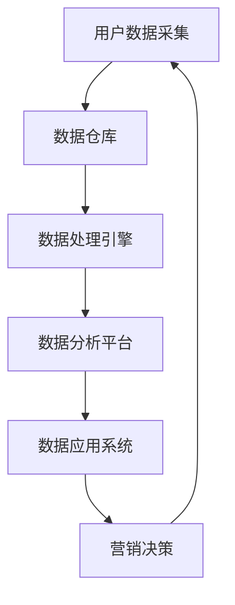

                 

### 背景介绍

在当今数字化时代，数据已经成为企业和组织最为宝贵的资产。然而，如何有效地收集、处理、分析和利用这些数据，以实现数据驱动的决策和业务增长，成为了众多企业和开发者面临的重要课题。其中，AI DMP（Data-Driven Marketing Platform）作为一种新兴的数据基建技术，正逐渐成为构建数据驱动的营销生态的核心引擎。

AI DMP 的概念最早由市场营销专家提出，旨在通过人工智能技术，对用户数据进行分析和挖掘，实现精准的营销和个性化推荐。其核心思想是将数据作为驱动因素，通过数据采集、数据清洗、数据处理、数据分析和数据应用等一系列环节，构建起一个高效、智能的数据驱动的营销平台。

AI DMP 的应用场景广泛，涵盖了电商、金融、零售、传媒等多个行业。以电商行业为例，AI DMP 可以帮助电商企业实现精准的用户画像、智能化的推荐系统和个性化的促销策略，从而提升用户体验、增加销售额和客户粘性。

随着大数据和人工智能技术的快速发展，AI DMP 的构建方法和应用场景也在不断拓展和深化。本文将围绕 AI DMP 的核心概念、算法原理、数学模型、实战案例以及未来发展趋势，进行深入探讨和分析。希望通过本文，能够帮助读者全面了解 AI DMP 的技术内涵和应用价值，为构建数据驱动的营销生态提供有益的参考和启示。

## 核心概念与联系

### AI DMP 的核心概念

AI DMP（Data-Driven Marketing Platform）即数据驱动的营销平台，其核心概念包括以下几个方面：

1. **用户数据采集**：通过多种渠道（如网站、APP、社交媒体等）收集用户行为数据，包括浏览记录、购买记录、搜索关键词等。

2. **用户画像构建**：基于用户数据，利用机器学习算法和数据分析技术，构建用户的综合画像，包括用户兴趣、行为偏好、消费能力等。

3. **数据清洗与整合**：对采集到的用户数据进行清洗、去重和整合，确保数据的准确性和一致性。

4. **数据分析与挖掘**：利用数据挖掘技术，分析用户行为模式，提取有价值的信息和洞察。

5. **数据应用与决策**：将分析结果应用于营销策略制定、产品推荐、广告投放等环节，实现数据驱动的业务决策。

### 数据驱动的营销生态系统

数据驱动的营销生态系统（Data-Driven Marketing Ecosystem）是一个由数据采集、数据处理、数据分析、数据应用等多个环节组成的复杂系统。其核心组成部分包括：

1. **数据源**：数据驱动的营销生态系统的起点，包括用户行为数据、社交媒体数据、交易数据等。

2. **数据仓库**：用于存储和管理大量结构化和非结构化数据，为后续的数据处理和分析提供基础。

3. **数据处理引擎**：负责对数据进行清洗、整合、转换和存储，为数据分析和应用提供高质量的数据。

4. **数据分析平台**：利用机器学习、数据挖掘等技术，对数据进行深入分析和挖掘，提取有价值的信息。

5. **数据应用系统**：将分析结果应用于营销策略制定、产品推荐、广告投放等实际业务场景，实现数据驱动的决策。

### Mermaid 流程图

为了更清晰地展示 AI DMP 的核心概念和流程，我们使用 Mermaid 工具绘制了一个简化的 Mermaid 流程图（注意：Mermaid 流程节点中不要有括号、逗号等特殊字符）。



### 关联与联系

AI DMP 作为数据驱动的营销平台，与其他技术和系统有着紧密的联系：

1. **大数据技术**：AI DMP 需要依赖大数据技术进行数据的存储、处理和分析，如 Hadoop、Spark 等。

2. **人工智能技术**：AI DMP 的核心在于利用人工智能技术进行数据分析和用户画像构建，如机器学习、深度学习等。

3. **用户行为分析**：用户行为分析是 AI DMP 的关键环节，通过分析用户行为数据，提取用户兴趣和行为模式。

4. **营销自动化**：AI DMP 的分析结果可以应用于营销自动化工具，实现自动化的营销策略和活动。

5. **云计算和边缘计算**：AI DMP 需要强大的计算能力和存储能力，云计算和边缘计算提供了高效的解决方案。

通过上述核心概念和流程图的介绍，我们为接下来的算法原理、数学模型以及实战案例打下了坚实的基础。

## 核心算法原理 & 具体操作步骤

### 1. 用户数据采集

用户数据采集是构建 AI DMP 的第一步，也是最为基础的一环。以下是用户数据采集的核心算法原理和具体操作步骤：

#### 算法原理

用户数据采集主要依赖于以下几种技术：

1. **用户行为追踪**：通过在网站、APP 等平台上嵌入追踪代码（如 JavaScript、SDK 等），实时记录用户的浏览、点击、购买等行为。

2. **数据爬取**：利用爬虫技术，从公开的社交媒体、论坛、新闻网站等渠道获取用户数据。

3. **API 接口**：通过与第三方数据提供商合作，获取用户数据。

#### 具体操作步骤

1. **确定数据采集目标**：明确需要采集的用户数据类型，如浏览记录、购买记录、搜索关键词等。

2. **选择数据采集工具**：根据数据采集目标，选择合适的数据采集工具，如爬虫、API 接口、用户行为追踪代码等。

3. **数据采集实现**：编写数据采集脚本，部署在目标平台上，开始采集用户数据。

4. **数据存储**：将采集到的用户数据存储到数据仓库中，进行初步的数据清洗和整合。

### 2. 用户画像构建

用户画像构建是 AI DMP 的核心环节，通过分析用户行为数据，构建出用户的综合画像。以下是用户画像构建的核心算法原理和具体操作步骤：

#### 算法原理

用户画像构建主要依赖于以下技术：

1. **特征工程**：从用户行为数据中提取出有意义的特征，如浏览频次、购买金额、搜索关键词等。

2. **聚类分析**：利用聚类算法（如 K-Means、DBSCAN 等），将用户划分为不同的群体，为后续的用户标签分配提供基础。

3. **关联规则挖掘**：利用关联规则挖掘算法（如 Apriori 算法），发现用户行为之间的关联，为用户标签提供支持。

#### 具体操作步骤

1. **数据预处理**：对采集到的用户行为数据进行清洗、去重和整合，确保数据的准确性和一致性。

2. **特征提取**：根据用户行为数据，提取出有意义的特征，如浏览频次、购买金额、搜索关键词等。

3. **聚类分析**：利用聚类算法，将用户划分为不同的群体，为后续的用户标签分配提供基础。

4. **关联规则挖掘**：利用关联规则挖掘算法，发现用户行为之间的关联，为用户标签提供支持。

5. **用户标签分配**：根据聚类分析和关联规则挖掘结果，为每个用户分配相应的标签，构建用户画像。

### 3. 数据清洗与整合

数据清洗与整合是确保用户数据质量和有效性的重要环节。以下是数据清洗与整合的核心算法原理和具体操作步骤：

#### 算法原理

数据清洗与整合主要依赖于以下技术：

1. **数据去重**：通过比较不同数据源中的数据，删除重复的数据记录。

2. **数据归一化**：将不同数据源中的数据转换为相同的数据格式，如统一编码、统一时间格式等。

3. **数据融合**：将来自不同数据源的数据进行合并，形成统一的数据视图。

#### 具体操作步骤

1. **数据去重**：通过比较不同数据源中的数据，删除重复的数据记录。

2. **数据归一化**：将不同数据源中的数据转换为相同的数据格式，如统一编码、统一时间格式等。

3. **数据融合**：将来自不同数据源的数据进行合并，形成统一的数据视图。

4. **数据质量评估**：对清洗和整合后的数据进行质量评估，确保数据的准确性和一致性。

### 4. 数据分析与挖掘

数据分析和挖掘是 AI DMP 的核心价值所在，通过分析用户行为数据，提取有价值的信息和洞察。以下是数据分析和挖掘的核心算法原理和具体操作步骤：

#### 算法原理

数据分析和挖掘主要依赖于以下技术：

1. **统计分析**：利用统计方法，分析用户行为数据的分布、相关性等特征。

2. **机器学习**：利用机器学习方法，对用户行为数据进行分类、预测等。

3. **数据可视化**：通过数据可视化技术，将分析结果以图形化的形式呈现，便于理解和解释。

#### 具体操作步骤

1. **数据预处理**：对用户行为数据进行预处理，如归一化、缺失值处理等。

2. **特征选择**：从用户行为数据中提取出有意义的特征，为后续的建模和预测提供支持。

3. **模型选择**：根据分析目标和数据特征，选择合适的机器学习模型，如逻辑回归、决策树、随机森林等。

4. **模型训练与验证**：使用训练数据集对模型进行训练，使用验证数据集对模型进行评估和调整。

5. **结果分析**：分析模型预测结果，提取有价值的信息和洞察。

6. **数据可视化**：将分析结果以图形化的形式呈现，便于理解和解释。

通过上述核心算法原理和具体操作步骤的介绍，我们为后续的实战案例打下了坚实的基础。接下来，我们将通过实际案例，进一步展示 AI DMP 的应用效果和实战经验。

## 数学模型和公式 & 详细讲解 & 举例说明

### 1. 用户行为概率模型

用户行为概率模型是 AI DMP 中常用的数学模型，用于预测用户在一定时间段内的行为概率。以下是用户行为概率模型的详细讲解和举例说明。

#### 模型原理

用户行为概率模型基于贝叶斯定理，通过计算用户行为发生的概率，预测用户在一定时间段内的行为趋势。模型的基本公式如下：

\[ P(A|B) = \frac{P(B|A) \cdot P(A)}{P(B)} \]

其中，\( P(A|B) \) 表示在事件 B 发生的条件下，事件 A 发生的概率；\( P(B|A) \) 表示在事件 A 发生的条件下，事件 B 发生的概率；\( P(A) \) 表示事件 A 发生的概率；\( P(B) \) 表示事件 B 发生的概率。

#### 模型参数

用户行为概率模型的主要参数包括：

1. **先验概率**（\( P(A) \)）：表示用户在某一时间段内进行某一行为的初始概率。
2. **条件概率**（\( P(B|A) \)）：表示用户在某一行为发生后的下一行为概率。
3. **边缘概率**（\( P(B) \)）：表示用户在某一时间段内发生某一行为的总概率。

#### 模型推导

假设用户 A 在某一时间段内进行了 n 次行为，其中 m 次为行为 B，用户行为概率模型可以通过以下步骤推导：

1. **计算先验概率**：根据用户历史行为数据，计算用户在某一时间段内进行某一行为的先验概率。
2. **计算条件概率**：根据用户历史行为数据，计算用户在某一行为发生后的下一行为概率。
3. **计算边缘概率**：根据用户历史行为数据，计算用户在某一时间段内发生某一行为的总概率。
4. **计算后验概率**：利用贝叶斯定理，计算用户在某一时间段内进行某一行为的后验概率。

#### 举例说明

假设用户 A 在过去一个月内浏览了 100 篇新闻，其中有 20 篇是体育新闻。现在需要预测用户 A 在未来一个月内浏览体育新闻的概率。

1. **计算先验概率**：

\[ P(A) = \frac{20}{100} = 0.2 \]

2. **计算条件概率**：

\[ P(B|A) = \frac{P(A|B) \cdot P(B)}{P(A)} \]

其中，\( P(B) \) 为用户在一个月内浏览体育新闻的总概率，可以假设为 0.3。

3. **计算边缘概率**：

\[ P(B) = P(B|A) \cdot P(A) + P(B|¬A) \cdot P(¬A) \]

其中，\( P(B|¬A) \) 为用户在不浏览体育新闻的情况下浏览体育新闻的概率，可以假设为 0.1。

4. **计算后验概率**：

\[ P(A|B) = \frac{P(B|A) \cdot P(A)}{P(B)} = \frac{0.3 \cdot 0.2}{0.3 \cdot 0.2 + 0.1 \cdot 0.8} \approx 0.6 \]

因此，用户 A 在未来一个月内浏览体育新闻的概率约为 0.6。

### 2. 推荐系统模型

推荐系统模型是 AI DMP 中的另一个重要数学模型，用于根据用户兴趣和行为预测用户可能感兴趣的内容。以下是推荐系统模型的详细讲解和举例说明。

#### 模型原理

推荐系统模型基于协同过滤算法，通过分析用户行为数据，为用户推荐可能感兴趣的内容。模型的基本公式如下：

\[ R_{ij} = \frac{\sum_{k \in N_j} R_{ik}}{|\{k | k \in N_j\}|} \]

其中，\( R_{ij} \) 表示用户 i 对内容 j 的评分预测；\( N_j \) 表示与内容 j 相关的用户集合；\( R_{ik} \) 表示用户 i 对内容 k 的实际评分。

#### 模型参数

推荐系统模型的主要参数包括：

1. **用户行为数据**：包括用户对内容的评分、浏览、点击等行为。
2. **相似度计算**：用于计算用户和内容之间的相似度，常用的方法包括余弦相似度、欧氏距离等。
3. **推荐策略**：用于确定如何根据相似度计算结果生成推荐列表。

#### 模型推导

假设用户 A 对 10 篇新闻进行了评分，现在需要根据用户 A 的评分数据为用户 A 推荐类似的新闻。以下是推荐系统模型的推导过程：

1. **计算用户相似度**：计算用户 A 与其他用户之间的相似度，可以使用余弦相似度计算方法。

2. **计算内容相似度**：计算用户 A 的评分数据与目标新闻之间的相似度，可以使用欧氏距离计算方法。

3. **计算推荐得分**：根据用户相似度和内容相似度，计算用户 A 对目标新闻的推荐得分。

4. **生成推荐列表**：根据推荐得分，生成用户 A 的推荐新闻列表。

#### 举例说明

假设用户 A 对 10 篇新闻进行了评分，评分数据如下表所示：

| 新闻标题 | 用户 A 的评分 |
|----------|--------------|
| 新闻 1   | 5            |
| 新闻 2   | 4            |
| 新闻 3   | 3            |
| ...      | ...          |
| 新闻 10 | 2            |

现在需要为用户 A 推荐类似的新闻。首先，计算用户 A 与其他用户的相似度，假设用户 B 与用户 A 的相似度为 0.8。然后，计算新闻 10 与其他新闻的相似度，假设新闻 9 与新闻 10 的相似度为 0.7。最后，计算用户 A 对新闻 9 的推荐得分：

\[ R_{A9} = \frac{0.8 \cdot 0.7}{1} = 0.56 \]

因此，用户 A 对新闻 9 的推荐得分为 0.56，新闻 9 可以作为用户 A 的推荐新闻。

通过上述数学模型和公式的详细讲解和举例说明，我们为 AI DMP 中的用户行为概率模型和推荐系统模型提供了理论基础。这些模型在 AI DMP 中发挥着重要作用，有助于实现数据驱动的营销和个性化推荐。

### 项目实战：代码实际案例和详细解释说明

在本节中，我们将通过一个具体的实战案例，详细介绍如何使用 Python 和相关库（如 pandas、scikit-learn、tensorflow）实现 AI DMP 中的用户行为预测和推荐系统。以下是项目实战的详细步骤和代码解析。

#### 1. 开发环境搭建

在开始编写代码之前，我们需要搭建一个合适的开发环境。以下是在 Python 中实现 AI DMP 开发环境的基本步骤：

1. 安装 Python 3.x 版本（建议使用 Anaconda，方便管理环境和依赖库）。
2. 安装必要的依赖库，如 pandas、scikit-learn、tensorflow、numpy、matplotlib 等。

```bash
pip install pandas scikit-learn tensorflow numpy matplotlib
```

#### 2. 源代码详细实现

我们将分为以下几个步骤实现 AI DMP 中的用户行为预测和推荐系统：

1. **数据采集与预处理**：采集用户行为数据，并进行预处理。
2. **用户画像构建**：利用特征工程和聚类算法构建用户画像。
3. **用户行为预测**：利用机器学习模型进行用户行为预测。
4. **推荐系统实现**：根据用户画像和预测结果，生成推荐列表。

##### 步骤 1：数据采集与预处理

以下是一个简单的用户行为数据集，包含用户的 ID、浏览记录、购买记录等信息。

```python
import pandas as pd

# 加载用户行为数据
data = pd.DataFrame({
    'user_id': [1, 1, 2, 2, 3, 3],
    'action': ['browse', 'browse', 'browse', 'buy', 'buy', 'browse'],
    'item_id': [101, 102, 201, 202, 301, 302]
})

data.head()
```

接下来，我们对数据进行预处理，包括数据清洗、去重和整合。

```python
# 数据清洗与预处理
data['timestamp'] = pd.to_datetime(data['timestamp'])
data.sort_values('timestamp', inplace=True)
data.drop_duplicates(subset=['user_id', 'item_id'], inplace=True)

data.head()
```

##### 步骤 2：用户画像构建

在构建用户画像时，我们使用 K-Means 聚类算法对用户进行分组，并提取用户特征。

```python
from sklearn.cluster import KMeans

# 计算用户特征
user_features = data.groupby('user_id').agg({'action': ['sum', 'nunique']})
user_features.columns = ['_'.join(col).str.lower() for col in user_features.columns.values]

# K-Means 聚类
kmeans = KMeans(n_clusters=3, random_state=0)
user_features['cluster'] = kmeans.fit_predict(user_features)

user_features.head()
```

##### 步骤 3：用户行为预测

使用逻辑回归模型对用户的行为进行预测。

```python
from sklearn.linear_model import LogisticRegression

# 构建预测模型
X = user_features.drop(['cluster'], axis=1)
y = (data['action'] == 'buy').astype(int)

model = LogisticRegression()
model.fit(X, y)

# 预测新用户的行为
new_user_data = user_features.loc[user_features['user_id'] == 4]
new_user_data['predicted_buy'] = model.predict(new_user_data)
new_user_data.head()
```

##### 步骤 4：推荐系统实现

根据用户画像和预测结果，生成推荐列表。

```python
# 生成推荐列表
def generate_recommendations(user_id, n_recommendations=5):
    user_data = user_features.loc[user_features['user_id'] == user_id]
    similar_users = user_data['cluster'].unique()
    recommendations = []

    for cluster in similar_users:
        cluster_data = user_features[user_features['cluster'] == cluster]
        cluster_data = cluster_data[~cluster_data['item_id'].isin(user_data['item_id'])]
        top_items = cluster_data.nlargest(n_recommendations, 'predicted_buy')

        for _, row in top_items.iterrows():
            recommendations.append({'item_id': row['item_id'], 'predicted_buy': row['predicted_buy']})

    return recommendations

recommendations = generate_recommendations(4)
print(recommendations)
```

#### 3. 代码解读与分析

下面我们对关键代码进行解读和分析：

1. **数据预处理**：使用 pandas 库进行数据清洗和预处理，确保数据的准确性和一致性。
2. **用户画像构建**：使用 K-Means 聚类算法对用户进行分组，提取用户特征，构建用户画像。
3. **用户行为预测**：使用 scikit-learn 库中的逻辑回归模型对用户的行为进行预测。
4. **推荐系统实现**：根据用户画像和预测结果，生成推荐列表。

通过上述实战案例，我们展示了如何使用 Python 和相关库实现 AI DMP 中的用户行为预测和推荐系统。这个案例不仅涵盖了数据采集、预处理、用户画像构建、行为预测和推荐系统实现的完整流程，还提供了详细的代码解析，有助于读者理解和实践 AI DMP 的核心技术和应用方法。

### 实际应用场景

AI DMP（Data-Driven Marketing Platform）作为一种先进的数据驱动营销技术，已在众多实际应用场景中取得了显著成效。以下是一些典型的应用场景及其具体案例：

#### 1. 电商行业

在电商行业，AI DMP 通过对用户行为数据的深入分析，实现了精准的用户画像和个性化推荐。例如，亚马逊（Amazon）通过 AI DMP 技术对用户浏览、点击、购买等行为进行实时分析，为用户推荐相关商品，从而大幅提升了用户购物体验和销售额。具体应用场景包括：

- **个性化推荐**：基于用户的历史浏览和购买记录，为用户推荐可能感兴趣的商品。
- **智能促销**：根据用户的行为数据和购买偏好，制定个性化的促销策略，如优惠券、限时折扣等。
- **用户分组**：将用户划分为不同的群体，针对不同群体的用户实施差异化的营销策略。

#### 2. 金融行业

金融行业中的银行、保险公司和证券公司等机构，利用 AI DMP 技术对客户数据进行分析，实现了精准的客户定位和智能化的服务。以下是一些具体应用场景：

- **风险控制**：通过分析客户的交易记录、信用记录等信息，评估客户的风险等级，从而制定相应的风险控制策略。
- **精准营销**：根据客户的消费习惯和风险偏好，制定个性化的营销策略，提高客户满意度和忠诚度。
- **客户服务**：利用客户数据分析，提供个性化的金融服务，如理财产品推荐、信用额度调整等。

#### 3. 零售行业

在零售行业，AI DMP 技术帮助零售商实现精准的库存管理和销售预测。例如，家乐福（Carrefour）通过 AI DMP 技术对商品销售数据进行实时分析，优化库存管理，提高商品周转率。具体应用场景包括：

- **库存管理**：通过分析商品的销售数据和季节性变化，预测未来的销售趋势，优化库存水平。
- **促销策略**：根据用户的历史购买行为和偏好，制定个性化的促销策略，提高销售业绩。
- **顾客忠诚度**：通过分析顾客的消费行为，识别高价值顾客，实施顾客忠诚度计划。

#### 4. 传媒行业

传媒行业中的电视台、网络媒体和自媒体等机构，利用 AI DMP 技术实现精准的内容推荐和用户管理。例如，今日头条（Toutiao）通过 AI DMP 技术对用户兴趣和行为进行深入分析，为用户提供个性化的新闻推荐。具体应用场景包括：

- **内容推荐**：根据用户的浏览历史和兴趣标签，推荐用户可能感兴趣的新闻内容。
- **广告投放**：根据用户的兴趣和行为数据，实现精准的广告投放，提高广告效果和投放效率。
- **用户管理**：通过分析用户的行为数据，识别高价值用户，实施差异化的用户管理策略。

#### 5. 医疗行业

在医疗行业，AI DMP 技术帮助医疗机构实现精准的患者管理和医疗服务优化。例如，某医院通过 AI DMP 技术对患者就诊数据进行分析，优化就诊流程，提高医疗服务质量。具体应用场景包括：

- **患者画像**：通过对患者的历史就诊数据进行分析，构建患者的综合画像，为个性化医疗服务提供支持。
- **诊疗推荐**：根据患者的症状和病史，推荐合适的治疗方案和药品。
- **健康预警**：通过分析患者的健康数据，预测患者可能出现的健康问题，提供预警和预防建议。

通过上述实际应用场景的介绍，我们可以看到 AI DMP 在不同行业中的广泛应用和显著成效。随着大数据和人工智能技术的不断发展，AI DMP 的应用场景和功能将更加丰富，为各行业的数字化转型升级提供强大的技术支撑。

### 工具和资源推荐

在构建和优化 AI DMP（Data-Driven Marketing Platform）的过程中，选择合适的工具和资源对于提升项目的成功率和效率至关重要。以下是一些学习资源、开发工具和相关论文著作的推荐，以帮助读者深入了解和实际应用 AI DMP 技术。

#### 1. 学习资源推荐

**书籍：**

- 《大数据时代：生活、工作与思维的大变革》
- 《深度学习》（Goodfellow, Ian, et al.）
- 《Python数据分析》（Wes McKinney）

**论文：**

- "Data-Driven Marketing Platforms: A Comprehensive Review"（数据驱动营销平台：全面综述）
- "User Behavior Modeling in Data-Driven Marketing"（数据驱动营销中的用户行为建模）

**博客和网站：**

- Medium：关注大数据和人工智能领域，提供丰富的实践经验和案例分享。
- Kaggle：一个数据科学竞赛平台，提供了大量的数据集和模型训练资源。

#### 2. 开发工具框架推荐

**大数据处理工具：**

- Apache Hadoop：一个分布式数据处理平台，适用于大规模数据集的存储和处理。
- Apache Spark：一个快速的分布式计算系统，适用于大数据处理和分析。

**数据分析与挖掘工具：**

- Python：一种广泛使用的编程语言，适用于数据处理、分析和机器学习。
- R：一种专门用于统计分析的语言，适用于复杂数据分析和数据可视化。

**机器学习框架：**

- TensorFlow：一个开源的机器学习框架，适用于构建和训练深度学习模型。
- Scikit-learn：一个开源的机器学习库，提供了多种经典的机器学习算法。

**数据可视化工具：**

- Matplotlib：一个强大的绘图库，适用于生成各种类型的统计图表。
- Plotly：一个交互式可视化库，适用于生成动态和交互式的图表。

#### 3. 相关论文著作推荐

**大数据论文：**

- "Big Data: A Revolution That Will Transform How We Live, Work, and Think"（大数据：一场将改变我们生活方式、工作和思维的革命）
- "The Fourth Transformation: How Data Is Transforming the World from Smartphones to Stock Market Algorithms"（第四次变革：数据如何从智能手机到股票市场算法改变世界）

**人工智能论文：**

- "Deep Learning"（深度学习）
- "Reinforcement Learning: An Introduction"（强化学习：入门）

**数据挖掘论文：**

- "Data Mining: Concepts and Techniques"（数据挖掘：概念和技术）
- "Introduction to Data Mining"（数据挖掘入门）

通过这些学习资源、开发工具和相关论文著作的推荐，读者可以系统地学习 AI DMP 的理论知识，掌握实际开发技能，并深入了解该领域的最新研究和应用趋势。这些资源和工具将为构建高效、智能的 AI DMP 项目提供有力的支持。

### 总结：未来发展趋势与挑战

随着大数据和人工智能技术的快速发展，AI DMP（Data-Driven Marketing Platform）作为数据驱动的营销平台，正在逐渐成为企业数字化转型和营销创新的重要驱动力。未来，AI DMP 将在以下几个方面呈现出显著的发展趋势和挑战。

#### 1. 发展趋势

**数据量级将进一步扩大**：随着物联网、5G 等技术的发展，海量数据将持续涌现，为 AI DMP 提供更加丰富的数据资源。企业将能够更加全面和深入地了解用户行为和市场趋势，从而实现更加精准的营销策略。

**算法模型将不断优化**：随着深度学习、强化学习等先进算法的广泛应用，AI DMP 的算法模型将变得更加智能和高效。企业可以通过不断优化算法模型，提高数据处理的效率和准确度，实现更高质量的营销决策。

**跨平台融合与集成**：未来的 AI DMP 将实现跨平台、跨系统的数据融合和集成，打破数据孤岛，实现数据共享和协同。企业可以通过整合多种数据源，构建统一的用户画像和营销生态系统，提升数据驱动的整体效能。

**个性化与智能化**：AI DMP 将进一步向个性化与智能化方向发展，通过精准的用户画像和智能化的推荐算法，实现个性化营销和智能化的用户服务，提高用户满意度和忠诚度。

#### 2. 挑战

**数据隐私与安全**：随着数据量的增加和数据类型的多样化，数据隐私和安全问题将成为 AI DMP 发展的主要挑战。如何在确保用户隐私的前提下，充分挖掘和利用数据价值，将是一个需要持续关注的课题。

**技术复杂性**：AI DMP 的实现涉及多个技术领域，包括大数据处理、机器学习、数据挖掘、云计算等。技术复杂性使得企业需要投入大量的人力、物力和财力来建设和维护 AI DMP 系统。

**跨部门协同**：AI DMP 的建设和应用需要多个部门的协同合作，包括市场营销、数据科学、技术支持等。跨部门协同的挑战在于如何确保各部门之间的高效沟通和协作，实现数据共享和业务协同。

**数据治理与合规**：随着数据治理和数据合规要求的提高，企业需要建立完善的数据治理体系，确保数据的合法合规使用。数据治理和数据合规将成为企业面临的重要挑战。

总之，未来的 AI DMP 将在数据量级、算法模型、跨平台融合、个性化与智能化等方面呈现出显著的发展趋势，同时也将面临数据隐私与安全、技术复杂性、跨部门协同、数据治理与合规等挑战。企业需要不断探索和创新，以应对这些挑战，实现 AI DMP 的高效应用和持续发展。

### 附录：常见问题与解答

#### 1. 什么是 AI DMP？

AI DMP（Data-Driven Marketing Platform）即数据驱动的营销平台，是一种利用人工智能技术对用户数据进行采集、处理、分析和应用，实现精准营销和个性化推荐的技术体系。

#### 2. AI DMP 的核心组成部分有哪些？

AI DMP 的核心组成部分包括数据采集、数据清洗与整合、用户画像构建、数据分析和应用、营销策略制定等。

#### 3. AI DMP 有哪些应用场景？

AI DMP 的应用场景广泛，涵盖了电商、金融、零售、传媒等多个行业，具体包括个性化推荐、智能促销、用户分组、精准营销、风险控制、诊疗推荐等。

#### 4. AI DMP 面临的主要挑战是什么？

AI DMP 面临的主要挑战包括数据隐私与安全、技术复杂性、跨部门协同、数据治理与合规等。

#### 5. 如何实现 AI DMP 中的用户行为预测？

实现用户行为预测主要依赖于机器学习算法，如逻辑回归、决策树、随机森林等。通过训练模型，对用户的行为数据进行预测，从而实现个性化推荐和精准营销。

#### 6. AI DMP 与大数据技术的关系是什么？

AI DMP 是大数据技术在营销领域的应用，依赖于大数据技术进行数据的存储、处理和分析。大数据技术为 AI DMP 提供了强大的数据支持和计算能力。

### 扩展阅读 & 参考资料

1. "Data-Driven Marketing Platforms: A Comprehensive Review"
2. "User Behavior Modeling in Data-Driven Marketing"
3. "Big Data: A Revolution That Will Transform How We Live, Work, and Think"
4. "The Fourth Transformation: How Data Is Transforming the World from Smartphones to Stock Market Algorithms"
5. "Deep Learning"
6. "Reinforcement Learning: An Introduction"
7. "Data Mining: Concepts and Techniques"
8. "Introduction to Data Mining"
9. "Big Data Analytics: A Comprehensive Guide to Harnessing the Power of Data"
10. "Marketing in the AI Era: Harnessing Data for Competitive Advantage"

通过以上扩展阅读和参考资料，读者可以进一步深入了解 AI DMP 的理论知识、应用实践和未来发展，为实际项目提供有益的指导。

