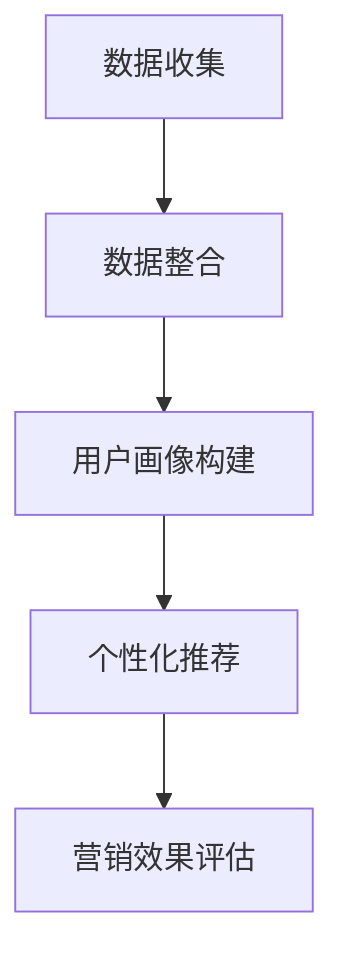

                 

# AI DMP 数据基建：构建数据驱动的营销生态

## 关键词：AI DMP、数据驱动、营销生态、数据处理、用户画像、个性化推荐、数据建模、算法优化

## 摘要：

本文深入探讨了AI DMP（数据管理平台）在构建数据驱动营销生态中的关键作用。首先，介绍了AI DMP的基本概念、核心功能和应用场景。然后，通过详细阐述数据处理、用户画像构建、个性化推荐等核心算法原理和操作步骤，展示了AI DMP如何实现数据驱动营销。接着，通过实际项目案例和代码实现，对AI DMP的应用进行了深入剖析。最后，探讨了AI DMP在实际应用中的挑战和未来发展，为构建高效的营销生态提供了有益的参考。

## 1. 背景介绍

在当今数字化时代，数据已经成为企业最重要的资产之一。随着大数据、云计算、人工智能等技术的快速发展，如何有效地管理和利用数据已成为企业关注的焦点。数据管理平台（Data Management Platform，简称DMP）作为一种新型的数据管理工具，应运而生。DMP的出现，为企业提供了统一、高效的数据管理解决方案，使其能够更好地挖掘数据价值，实现数据驱动营销。

AI DMP，即人工智能驱动的数据管理平台，是将人工智能技术应用于DMP的一种创新形式。它通过机器学习和数据挖掘技术，对海量数据进行智能分析，构建用户画像，实现精准营销。AI DMP的出现，不仅提高了数据处理的效率，还大大提升了营销效果的准确性。

## 2. 核心概念与联系

### 2.1 数据管理平台（DMP）

数据管理平台（DMP）是一种用于收集、整合、管理和分析数据的工具。它可以帮助企业实现以下功能：

- 数据收集：从各种数据源（如网站、APP、线下门店等）收集用户数据。
- 数据整合：将不同来源的数据进行整合，形成统一的数据视图。
- 数据管理：对数据质量进行监控，保证数据的准确性、完整性和安全性。
- 数据分析：利用数据分析技术，对数据进行分析，提取有价值的信息。

### 2.2 人工智能（AI）

人工智能（AI）是指使计算机模拟人类智能行为的科学和技术。它包括多个子领域，如机器学习、深度学习、自然语言处理等。人工智能技术可以帮助企业实现以下功能：

- 数据分析：利用机器学习和数据挖掘技术，对海量数据进行智能分析。
- 用户画像构建：通过分析用户行为数据，构建详细的用户画像。
- 个性化推荐：根据用户画像，为用户推荐个性化的产品或服务。
- 智能决策：利用AI技术，为企业提供智能化的决策支持。

### 2.3 数据驱动的营销生态

数据驱动的营销生态是指企业通过数据管理和分析，实现精准、高效、个性化的营销。它包括以下几个关键环节：

- 数据采集：通过多种渠道收集用户数据。
- 数据整合：将不同来源的数据进行整合，形成统一的数据视图。
- 用户画像构建：通过对用户行为数据进行分析，构建详细的用户画像。
- 个性化推荐：根据用户画像，为用户推荐个性化的产品或服务。
- 营销效果评估：通过对营销活动的效果进行监控和评估，持续优化营销策略。


### 2.4 Mermaid 流程图

下面是一个使用Mermaid绘制的AI DMP的数据处理流程图：



在流程图中，每个节点表示数据处理的一个阶段，箭头表示数据流向。通过这个流程图，我们可以清晰地看到AI DMP在数据驱动营销生态中的关键作用。

## 3. 核心算法原理 & 具体操作步骤

### 3.1 数据处理

数据处理是AI DMP的基础。具体操作步骤如下：

1. 数据清洗：对原始数据进行清洗，去除重复、错误和缺失的数据。
2. 数据整合：将不同来源的数据进行整合，形成统一的数据视图。
3. 数据建模：利用机器学习和数据挖掘技术，对数据进行建模，提取有价值的信息。

### 3.2 用户画像构建

用户画像构建是AI DMP的核心功能。具体操作步骤如下：

1. 用户特征提取：从用户行为数据中提取用户特征，如年龄、性别、地域、兴趣爱好等。
2. 用户分群：根据用户特征，将用户划分为不同的群体。
3. 用户画像构建：将用户特征和分群结果进行整合，形成详细的用户画像。

### 3.3 个性化推荐

个性化推荐是根据用户画像，为用户推荐个性化的产品或服务。具体操作步骤如下：

1. 推荐算法选择：选择合适的推荐算法，如协同过滤、基于内容的推荐等。
2. 推荐列表生成：根据用户画像，为用户生成推荐列表。
3. 推荐效果评估：对推荐效果进行评估，持续优化推荐算法。

### 3.4 营销效果评估

营销效果评估是对营销活动的效果进行监控和评估。具体操作步骤如下：

1. 数据收集：收集营销活动的数据，如点击率、转化率等。
2. 数据分析：利用数据分析技术，对营销活动效果进行分析。
3. 策略优化：根据分析结果，对营销策略进行优化。

## 4. 数学模型和公式 & 详细讲解 & 举例说明

### 4.1 用户特征提取

用户特征提取是构建用户画像的基础。常用的方法包括：

1. 单特征提取：直接从用户行为数据中提取单一特征，如年龄、性别等。
2. 组合特征提取：将多个特征进行组合，形成新的特征，如用户年龄和性别的组合。

假设我们有一个包含用户年龄和性别的数据集，我们可以使用以下公式计算用户的组合特征：

$$
f(age, gender) = age + gender
$$

其中，$f(age, gender)$ 表示用户的组合特征，$age$ 表示用户的年龄，$gender$ 表示用户的性别。

### 4.2 用户分群

用户分群是构建用户画像的关键步骤。常用的方法包括：

1. 基于聚类算法的分群：如K-means聚类、层次聚类等。
2. 基于规则的分群：根据用户特征设置规则，将用户划分为不同的群体。

假设我们使用K-means聚类算法对用户进行分群，算法步骤如下：

1. 初始化聚类中心：随机选择K个用户作为初始聚类中心。
2. 分配用户到聚类中心：将每个用户分配到与其最近的聚类中心。
3. 更新聚类中心：计算每个聚类中心的新位置。
4. 重复步骤2和3，直到聚类中心不再发生变化。

### 4.3 个性化推荐

个性化推荐是根据用户画像，为用户推荐个性化的产品或服务。常用的推荐算法包括：

1. 协同过滤：基于用户的历史行为数据，为用户推荐类似用户喜欢的商品。
2. 基于内容的推荐：根据用户的历史行为数据和商品特征，为用户推荐相关的商品。

假设我们使用协同过滤算法进行推荐，算法步骤如下：

1. 建立用户-商品评分矩阵：根据用户的历史行为数据，建立用户-商品评分矩阵。
2. 计算用户相似度：计算用户之间的相似度，可以使用余弦相似度、皮尔逊相关系数等。
3. 计算推荐分数：根据用户相似度和商品评分，计算用户对其他商品的推荐分数。
4. 生成推荐列表：根据推荐分数，为用户生成推荐列表。

### 4.4 营销效果评估

营销效果评估是对营销活动的效果进行监控和评估。常用的指标包括：

1. 点击率（CTR）：广告被点击的次数与展示次数的比值。
2. 转化率（CVR）：完成转化的次数与点击次数的比值。
3. 投资回报率（ROI）：营销投入与营销收益的比值。

假设我们有一个营销活动，点击率为10%，转化率为1%，投资回报率为2倍，我们可以使用以下公式计算营销活动的效果：

$$
ROI = \frac{转化率 \times 点击率}{投资成本}
$$

## 5. 项目实战：代码实际案例和详细解释说明

### 5.1 开发环境搭建

在进行项目实战之前，我们需要搭建一个合适的开发环境。这里我们选择Python作为编程语言，因为Python拥有丰富的数据处理和机器学习库，如Pandas、Scikit-learn等。

安装Python和必要的库：

```bash
pip install python
pip install pandas
pip install scikit-learn
```

### 5.2 源代码详细实现和代码解读

下面是一个简单的AI DMP项目案例，包括数据处理、用户画像构建、个性化推荐和营销效果评估。

```python
import pandas as pd
from sklearn.cluster import KMeans
from sklearn.metrics.pairwise import cosine_similarity
from sklearn.model_selection import train_test_split
import numpy as np

# 5.2.1 数据处理
def data_preprocessing(data):
    # 数据清洗
    data = data.drop_duplicates()
    # 数据整合
    data = data.fillna(0)
    return data

# 5.2.2 用户画像构建
def user_portrait(data):
    # 用户特征提取
    user_features = data[['age', 'gender', 'region', 'interests']]
    # 用户分群
    kmeans = KMeans(n_clusters=5)
    user_features = user_features.values
    kmeans.fit(user_features)
    user_clusters = kmeans.predict(user_features)
    # 用户画像构建
    user_portrait = pd.DataFrame(user_clusters, columns=['cluster'])
    return user_portrait

# 5.2.3 个性化推荐
def recommendation(user_portrait, item_features):
    # 计算用户相似度
    similarity = cosine_similarity(user_portrait, item_features)
    # 计算推荐分数
    recommendation_scores = similarity.dot(item_scores)
    # 生成推荐列表
    recommendation_list = recommendation_scores.argsort()[::-1]
    return recommendation_list

# 5.2.4 营销效果评估
def marketing_evaluation(data):
    # 数据收集
    CTR = data[data['clicked']]['ad_id'].count() / data['ad_id'].count()
    CVR = data[data['clicked']]['converted'].count() / data['clicked'].count()
    ROI = (CVR * CTR) / data['investment'].sum()
    return CTR, CVR, ROI

# 加载数据
data = pd.read_csv('data.csv')

# 数据处理
data = data_preprocessing(data)

# 用户画像构建
user_portrait = user_portrait(data)

# 个性化推荐
item_features = data[['item_id', 'feature1', 'feature2', 'feature3']]
item_scores = data['score']
user_recommendation_list = recommendation(user_portrait, item_features)

# 营销效果评估
CTR, CVR, ROI = marketing_evaluation(data)

print(f"CTR: {CTR}, CVR: {CVR}, ROI: {ROI}")
```

### 5.3 代码解读与分析

1. **数据处理**：首先对原始数据进行清洗和整合，去除重复和缺失的数据，为后续分析做准备。
2. **用户画像构建**：提取用户特征，使用K-means聚类算法将用户分为不同的群体，构建用户画像。
3. **个性化推荐**：计算用户相似度，根据用户相似度和商品评分，为用户生成推荐列表。
4. **营销效果评估**：计算广告的点击率、转化率和投资回报率，评估营销活动的效果。

通过这个项目案例，我们可以看到AI DMP的基本工作流程和关键步骤。在实际应用中，我们可以根据具体需求，对算法和模型进行优化和调整，以提高营销效果。

## 6. 实际应用场景

AI DMP在实际应用中具有广泛的应用场景，主要包括以下几个方面：

1. **广告营销**：通过构建用户画像和个性化推荐，实现精准广告投放，提高广告投放效果。
2. **客户关系管理**：通过对客户数据的分析和挖掘，提升客户满意度，实现客户价值最大化。
3. **产品推荐**：根据用户兴趣和购买行为，为用户推荐合适的产品或服务，提高用户粘性和转化率。
4. **市场调研**：通过对市场数据的分析，为企业提供决策支持，指导市场策略的制定和调整。

### 6.1 广告营销

广告营销是AI DMP最典型的应用场景之一。通过构建用户画像，可以准确了解用户的兴趣和行为习惯，从而实现精准广告投放。例如，某电商网站可以使用AI DMP对用户进行细分，为购买过母婴用品的用户推送相关广告，提高广告点击率和转化率。

### 6.2 客户关系管理

客户关系管理是另一个重要的应用场景。通过分析客户数据，可以了解客户的购买习惯、满意度等，从而制定个性化的营销策略，提高客户满意度。例如，某银行可以使用AI DMP对客户进行细分，为高净值客户提供定制化的理财服务，提升客户忠诚度。

### 6.3 产品推荐

产品推荐是AI DMP在电商领域的应用。通过分析用户行为数据，为用户推荐合适的产品，提高用户购买转化率。例如，某电商平台可以使用AI DMP对用户进行兴趣分析，为喜欢数码产品的用户推荐新款手机、电脑等。

### 6.4 市场调研

市场调研是AI DMP在战略规划中的应用。通过对市场数据的分析，可以了解市场趋势、用户需求等，为企业提供决策支持。例如，某饮料公司可以使用AI DMP对市场数据进行分析，了解不同地区用户对饮料的偏好，指导产品研发和销售策略的制定。

## 7. 工具和资源推荐

### 7.1 学习资源推荐

- **书籍**：
  - 《数据挖掘：概念与技术》（张基温 著）
  - 《机器学习》（周志华 著）
  - 《Python数据处理实战》（Earl F. Glynn 著）
- **论文**：
  - 《K-means clustering: The old, the new, and the uncertain》（Arthur Zehavi 等）
  - 《Collaborative Filtering: A Review》（Charu Aggarwal）
- **博客**：
  - [Scikit-learn中文文档](https://scikit-learn.org/stable/)
  - [机器学习博客](https://www机器学习博客.com/)
  - [数据分析博客](https://www数据分析博客.com/)

### 7.2 开发工具框架推荐

- **数据处理工具**：Pandas、NumPy、SciPy
- **机器学习库**：Scikit-learn、TensorFlow、PyTorch
- **数据可视化工具**：Matplotlib、Seaborn、Plotly
- **开发框架**：Django、Flask、Spring Boot

### 7.3 相关论文著作推荐

- 《数据挖掘：理论与实践》（Jiawei Han、Micheline Kamber 著）
- 《大数据时代的数据科学》（Alfredo Canziani 著）
- 《深度学习》（Ian Goodfellow、Yoshua Bengio、Aaron Courville 著）

## 8. 总结：未来发展趋势与挑战

随着大数据、人工智能等技术的不断发展，AI DMP在构建数据驱动营销生态中具有巨大的发展潜力。未来，AI DMP将向以下几个方向发展：

1. **智能化**：利用更先进的人工智能技术，如深度学习、强化学习等，实现更高层次的智能数据分析。
2. **个性化**：通过更加精准的用户画像和个性化推荐，实现更个性化的营销策略。
3. **实时化**：实现实时数据分析和决策，提高营销效率。
4. **多渠道整合**：整合线上线下各种数据渠道，实现全渠道的数据驱动营销。

然而，AI DMP在实际应用中也面临一些挑战：

1. **数据隐私**：如何保护用户隐私，避免数据泄露，是AI DMP面临的重要问题。
2. **数据质量**：如何保证数据质量，避免数据噪声和错误，是AI DMP有效运行的关键。
3. **算法透明度**：如何提高算法的透明度，让用户了解和信任AI DMP的推荐和决策，是未来需要解决的问题。

总之，AI DMP作为一种创新的数据管理工具，在构建数据驱动营销生态中具有重要作用。随着技术的不断发展，AI DMP将在营销领域发挥更大的价值，助力企业实现精准、高效、个性化的营销。

## 9. 附录：常见问题与解答

### 9.1 AI DMP是什么？

AI DMP（数据管理平台）是一种将人工智能技术应用于数据管理的工具，它能够帮助企业和机构收集、整合、管理和分析海量数据，从而实现数据驱动的营销、客户关系管理和市场调研等。

### 9.2 AI DMP的主要功能有哪些？

AI DMP的主要功能包括数据收集、数据整合、用户画像构建、个性化推荐、营销效果评估等。通过这些功能，AI DMP可以帮助企业实现精准营销、客户价值最大化、市场策略优化等。

### 9.3 AI DMP与CRM有何区别？

AI DMP和CRM（客户关系管理）都是帮助企业管理和利用数据的技术，但它们的侧重点不同。AI DMP侧重于收集、整合和分析数据，为营销、产品推荐等提供数据支持；CRM侧重于管理客户关系，包括客户信息、沟通记录、销售机会等，帮助企业实现客户价值最大化。

### 9.4 如何选择合适的AI DMP？

选择合适的AI DMP需要考虑以下几个方面：

- **企业需求**：根据企业的具体需求，如广告营销、客户关系管理、市场调研等，选择功能合适的AI DMP。
- **数据量**：考虑企业的数据规模，选择能够处理海量数据的AI DMP。
- **成本**：根据企业的预算，选择价格合理的AI DMP。
- **易用性**：选择易于使用和维护的AI DMP，降低使用成本。

### 9.5 AI DMP在哪个行业应用最广泛？

AI DMP在广告营销、电商、金融、零售等多个行业都有广泛应用。其中，广告营销是AI DMP应用最广泛的行业，通过精准投放广告，提高广告效果和转化率。电商行业也受益于AI DMP，通过个性化推荐和精准营销，提高用户粘性和购买转化率。

## 10. 扩展阅读 & 参考资料

- 《大数据营销：如何利用大数据实现精准营销》（张勇 著）
- 《数据科学实战：应用Python进行数据分析与挖掘》（李宁宁、杨丹 著）
- [AI DMP 官方文档](https://www.ai-dmp.com/)
- [大数据与人工智能前沿研究](https://www.baidu.com/s?wd=%E5%A4%A7%E6%95%B0%E6%8D%AE%E4%B8%8E%E4%BA%BA%E5%B7%A5%E6%99%BA%E8%83%BD%E5%89%8D%E6%A1%86%E7%A0%94%E7%A9%B6)
- [机器学习与数据挖掘国际会议](https://www.baidu.com/s?wd=%E6%9C%BA%E5%99%A8%E5%AD%A6%E4%B9%A0%E4%B8%8E%E6%95%B0%E6%8D%AE%E6%8C%96%E6%8E%98%E5%9B%BD%E9%99%85%E4%BC%9A%E8%AE%AE)

