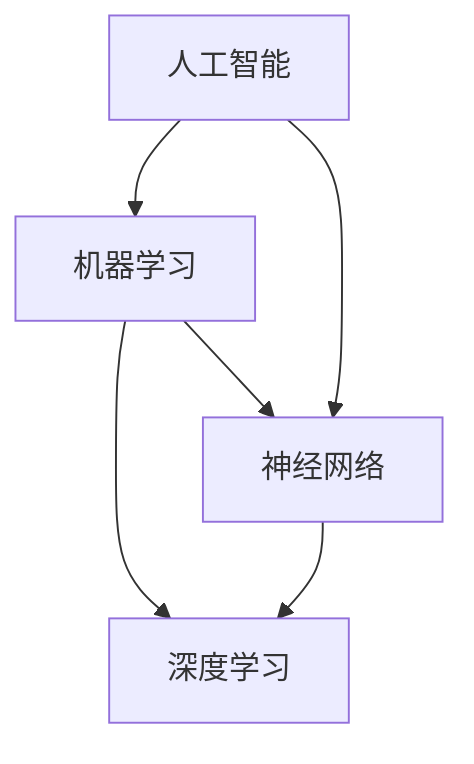

                 

### 背景介绍

#### 什么是AI hackathon？

AI hackathon，即人工智能黑客马拉松，是一种集体创新的竞赛活动。它通常由一群对人工智能（AI）充满热情的程序员、数据科学家、工程师和其他相关领域的专家组成，通过团队合作，在短时间内（通常是几天或一周）开发出创新的人工智能解决方案。

这些比赛不仅仅是为了比谁的技术更好，更重要的是激发参赛者的创造力，解决现实世界中的问题。AI hackathon的目标是鼓励参与者通过跨学科合作，运用AI技术和算法，创造出对人类有实际意义的应用。

#### AI hackathon的历史和发展

AI hackathon的概念并不是突然出现的，它源于传统的黑客马拉松（Hackathon）这一活动。黑客马拉松最初起源于软件开发领域，目的是让开发者在一个紧凑的时间内集中精力，通过团队合作完成一个项目。

随着时间的推移，黑客马拉松的概念逐渐扩展到其他领域，例如人工智能、大数据、物联网等。AI hackathon作为黑客马拉松的一个分支，开始在全球范围内兴起。

AI hackathon的发展历史可以追溯到2012年，当时Google举办了第一次AI challenge。此后，其他科技巨头，如Facebook、IBM、微软等，也纷纷加入举办AI hackathon的行列。

#### AI hackathon的重要性

AI hackathon的重要性在于它不仅为参与者提供了一个展示自己技能和创造力的平台，同时也为AI技术的发展和应用带来了巨大的推动力。

首先，AI hackathon促进了AI技术的创新。通过比赛，参与者可以尝试使用最新的AI技术和工具，解决一些传统方法难以解决的问题。这种创新往往能够带来突破性的成果。

其次，AI hackathon促进了跨学科合作。在比赛中，程序员、数据科学家、设计师等不同领域的人需要紧密合作，共同解决问题。这种跨学科的合作有助于推动AI技术的综合发展。

最后，AI hackathon对社会的实际意义也非常重大。通过比赛，参与者可以将AI技术应用于各种实际问题，如医疗诊断、环境保护、教育等。这些应用不仅能够改善人们的生活质量，还能够推动社会的进步。

总的来说，AI hackathon是一种非常有价值的技术竞赛活动，它不仅推动了AI技术的发展，也为社会带来了积极的影响。

#### AI hackathon的常见类型和特点

AI hackathon可以分为多种类型，每种类型都有其独特的特点和目标。

首先是学术型AI hackathon。这类比赛通常由大学或研究机构举办，旨在鼓励学生和研究人员通过实践项目深化对AI技术的理解和应用。学术型AI hackathon的特点是，比赛题目通常较为理论化，需要参赛者运用深度学习、自然语言处理等高级AI技术解决实际问题。

其次是商业型AI hackathon。这类比赛由企业或行业组织举办，主要目标是寻找有商业潜力的AI解决方案。商业型AI hackathon的特点是，比赛题目通常与企业的实际业务需求紧密相关，参赛者需要考虑商业化可行性。此外，这类比赛往往提供丰厚的奖金和商业合作机会，吸引了许多企业参与。

第三是开源型AI hackathon。这类比赛鼓励参与者开发和改进开源AI项目。开源型AI hackathon的特点是，比赛过程和结果对所有人开放，有助于推动AI技术的开放性和共享性。通过这种方式，AI技术可以更快地传播和进步。

最后是公益型AI hackathon。这类比赛的目标是通过AI技术解决社会问题，如贫困、疾病、环境保护等。公益型AI hackathon的特点是，比赛题目通常关注社会热点和人类福祉，参赛者需要运用AI技术提供创新的解决方案。这类比赛不仅具有技术意义，更具有深刻的社会价值。

总的来说，不同的AI hackathon类型各有特色，但共同的目标都是通过比赛激发AI技术的创新和应用。

#### AI hackathon对参与者的影响

AI hackathon对参与者的影响是多方面的，包括技术能力的提升、职业发展机会的增多以及个人成长和团队合作技能的增强。

首先，AI hackathon是提升技术能力的重要平台。在比赛中，参与者需要运用各种AI技术和工具，解决复杂的实际问题。这种实践过程不仅能够加深对AI技术的理解，还能提升编程、数据分析、算法设计等核心技能。

其次，AI hackathon为参与者提供了丰富的职业发展机会。许多企业在举办AI hackathon时，都会提供奖金、实习机会以及正式职位。通过在比赛中表现出色，参与者可以吸引企业的关注，从而获得更好的职业机会。此外，比赛的成绩也是简历中的一大亮点，有助于在求职过程中脱颖而出。

最后，AI hackathon促进了个人成长和团队合作技能的增强。在比赛中，参与者需要与来自不同背景和领域的队友合作，共同解决问题。这种跨学科合作不仅能够培养团队合作精神，还能提高沟通、协调和领导能力。这些技能对于个人职业发展非常重要。

总的来说，AI hackathon不仅是一种技术竞赛，更是一种全方位的成长机会。它为参与者提供了一个展示自己技能和创造力的平台，同时也为他们带来了实际的技术和职业收益。

### 核心概念与联系

在深入探讨AI hackathon之前，我们需要明确几个核心概念，以便更好地理解其背后的原理和结构。以下将介绍AI、机器学习、深度学习、神经网络等关键概念，并展示它们之间的联系。

#### AI（人工智能）

人工智能（Artificial Intelligence，AI）是指由人造系统实现的智能行为，这些行为通常需要人类智能才能完成。AI的目标是让计算机系统具备学习、推理、规划、感知和自然语言处理等能力。AI可以分为弱AI和强AI。弱AI指的是在特定任务上表现出人类智能的机器，而强AI则是指具有全面人类智能的机器。

#### 机器学习

机器学习（Machine Learning，ML）是AI的一个重要分支，它关注的是如何让计算机系统从数据中学习并做出决策。机器学习主要分为监督学习、无监督学习和强化学习三种类型。监督学习是指使用已标记的数据进行训练，无监督学习是指在没有标记数据的情况下发现数据中的模式，强化学习则是通过奖励和惩罚机制来训练智能体。

#### 深度学习

深度学习（Deep Learning，DL）是机器学习中的一个子领域，它使用多层神经网络（Neural Networks）来建模复杂的数据。深度学习通过逐层提取特征，从原始数据中提取出有意义的表示。卷积神经网络（CNN）、循环神经网络（RNN）和生成对抗网络（GAN）是深度学习的三大代表性模型。

#### 神经网络

神经网络（Neural Networks，NN）是一种模仿生物神经系统的计算模型。它由大量的节点（或称为神经元）组成，每个节点都与相邻的节点相连接。通过这些连接，神经网络能够处理和传递信息。在机器学习和深度学习中，神经网络被广泛用于特征提取和预测。

#### 核心概念联系

AI、机器学习、深度学习和神经网络之间存在着紧密的联系。首先，AI是整个框架的最高层，它包含了机器学习和深度学习。机器学习是AI实现的关键技术，而深度学习是机器学习的一种先进方法。

神经网络作为深度学习的核心组成部分，是实现机器学习和深度学习的关键技术。神经网络通过多层结构，可以自动提取数据中的高级特征，从而实现复杂的任务。

此外，神经网络的设计和训练过程依赖于机器学习算法，这些算法使用大量的数据和计算资源来优化神经网络的参数。而机器学习算法本身又依赖于AI的理论基础，从而形成一个闭环。

总的来说，AI、机器学习、深度学习和神经网络构成了一个相互关联的技术体系，它们共同推动了人工智能技术的发展和应用。

#### Mermaid 流程图展示

为了更直观地展示核心概念之间的联系，我们使用Mermaid流程图来表示。以下是一个简单的Mermaid流程图，展示了AI、机器学习、深度学习和神经网络之间的关系。



在这个流程图中，AI位于顶层，它是整个技术体系的核心。机器学习和深度学习分别从AI中分支出来，而神经网络作为深度学习和机器学习的基础，贯穿整个体系。通过这种结构，我们可以清晰地看到各个概念之间的相互关系。

总的来说，了解这些核心概念及其联系，有助于我们深入理解AI hackathon的原理和实施过程。在接下来的章节中，我们将进一步探讨AI hackathon的具体内容，包括比赛形式、组织流程和技术挑战。

### 核心算法原理 & 具体操作步骤

#### 机器学习算法概述

机器学习算法是AI hackathon中的核心工具，它通过从数据中学习，帮助计算机完成特定任务。以下将介绍几种常用的机器学习算法，包括决策树、支持向量机、随机森林等。

**1. 决策树（Decision Tree）**

决策树是一种常用的分类和回归算法，它通过一系列的判断规则来划分数据集，并最终得到一个预测结果。决策树的构建过程包括以下几个步骤：

**（1）选择最佳分割特征：**选择一个特征作为分割标准，使得分割后的数据集具有最大的纯度。

**（2）计算信息增益或基尼不纯度：**信息增益和基尼不纯度是衡量特征分割效果的两个指标。信息增益表示特征分割后，数据集的纯度提升程度，基尼不纯度则反映了特征分割后，数据集的混乱程度。

**（3）递归划分：**重复步骤（1）和（2），直到满足停止条件，如最大深度、最小叶节点样本数等。

**2. 支持向量机（Support Vector Machine，SVM）**

支持向量机是一种二分类模型，它通过寻找一个最佳的超平面，将不同类别的数据点分开。SVM的核心思想是最大化分类间隔，即分类器在区分不同类别时，需要具有最大的分类边界。

**（1）选择核函数：**核函数将低维数据映射到高维空间，使得原本线性不可分的数据在高维空间中变得线性可分。

**（2）求解最优超平面：**通过优化目标函数，求解最优超平面，使得分类间隔最大化。

**（3）分类决策：**对于新的数据点，将其映射到高维空间，然后根据超平面进行分类。

**3. 随机森林（Random Forest）**

随机森林是一种集成学习算法，它通过构建多个决策树，并对它们的预测结果进行投票，从而提高模型的预测准确性。随机森林的主要步骤包括：

**（1）随机选择特征：**每次构建决策树时，从所有特征中随机选择一部分特征进行划分。

**（2）随机选择样本：**每次构建决策树时，从原始数据中随机选择一部分样本进行训练。

**（3）构建决策树：**重复步骤（1）和（2），构建多个决策树。

**（4）投票决定：**对于新的数据点，将其输入每个决策树，根据多数投票结果进行分类。

#### 深度学习算法原理

深度学习算法是机器学习的一个子领域，它通过多层神经网络（Neural Networks）来提取数据中的特征和模式。以下将介绍几种常用的深度学习算法，包括卷积神经网络（CNN）、循环神经网络（RNN）和生成对抗网络（GAN）。

**1. 卷积神经网络（Convolutional Neural Network，CNN）**

卷积神经网络是一种专门用于处理图像数据的神经网络，它通过卷积层、池化层和全连接层等结构，逐步提取图像中的高级特征。

**（1）卷积层：**通过卷积操作提取图像中的局部特征，例如边缘、角点等。

**（2）池化层：**通过下采样操作减少数据维度，提高计算效率。

**（3）全连接层：**将卷积层和池化层提取的特征进行融合，用于最终的分类或回归任务。

**2. 循环神经网络（Recurrent Neural Network，RNN）**

循环神经网络是一种能够处理序列数据的神经网络，它通过循环结构来保存历史信息，从而能够处理具有时序依赖性的数据。

**（1）隐藏状态：**RNN通过隐藏状态来保存前一个时间步的信息，并将其传递到下一个时间步。

**（2）递归关系：**RNN的输出不仅依赖于当前输入，还依赖于前一个时间步的输出。

**（3）门控机制：**为了解决RNN的梯度消失和梯度爆炸问题，引入了门控机制（如门控循环单元GRU和长短期记忆LSTM）。

**3. 生成对抗网络（Generative Adversarial Network，GAN）**

生成对抗网络由生成器和判别器两个神经网络组成，通过对抗训练来生成逼真的数据。

**（1）生成器：**生成器通过输入随机噪声生成数据，目标是生成足够逼真的数据来欺骗判别器。

**（2）判别器：**判别器的目标是区分真实数据和生成数据。

**（3）对抗训练：**生成器和判别器相互对抗，生成器不断优化生成数据的质量，而判别器不断优化区分数据的能力。

总的来说，机器学习算法和深度学习算法是AI hackathon中不可或缺的工具。通过理解这些算法的原理和具体操作步骤，参与者可以更好地应对AI hackathon中的各种挑战，开发出创新性的解决方案。

#### 数学模型和公式

在深入探讨机器学习算法和深度学习算法时，数学模型和公式是理解和应用这些算法的核心。以下将详细解释一些关键的数学模型和公式，并使用LaTeX格式进行表示，以便读者更好地理解和应用。

**1. 决策树的信息增益**

信息增益（Information Gain）是决策树选择最佳分割特征的重要依据。它的计算公式如下：

\[ IG(D, A) = H(D) - \sum_{v \in Values(A)} \frac{|D_v|}{|D|} H(D_v) \]

其中：
- \( D \) 是当前数据集，
- \( A \) 是候选特征，
- \( Values(A) \) 是特征 \( A \) 的所有可能取值，
- \( D_v \) 是 \( A \) 取值为 \( v \) 的数据子集，
- \( |D| \) 是 \( D \) 的数据条数，
- \( H \) 是熵（Entropy）函数，表示数据集的不确定性。

**2. 熵（Entropy）**

熵是信息论中用于衡量数据不确定性的指标。对于离散的随机变量 \( X \)，其熵的定义如下：

\[ H(X) = -\sum_{x \in Values(X)} p(x) \log_2 p(x) \]

其中：
- \( p(x) \) 是 \( X \) 取值为 \( x \) 的概率。

**3. 支持向量机（SVM）的优化目标**

支持向量机的优化目标是最大化分类间隔。其目标函数和约束条件如下：

\[ \text{maximize} \quad \frac{1}{2} \sum_{i=1}^{n} (w_i^2 + b^2) \]

subject to:

\[ y_i ( \langle w, x_i \rangle - b ) \geq 1 \]

其中：
- \( w \) 是权重向量，
- \( b \) 是偏置项，
- \( x_i \) 是训练数据点，
- \( y_i \) 是对应的标签，
- \( \langle \cdot, \cdot \rangle \) 是内积运算。

**4. 循环神经网络（RNN）的递归关系**

循环神经网络通过递归关系来处理序列数据。其状态更新公式如下：

\[ h_t = \sigma( W_h \cdot [h_{t-1}, x_t] + b_h ) \]

其中：
- \( h_t \) 是当前时间步的隐藏状态，
- \( x_t \) 是当前时间步的输入，
- \( W_h \) 是权重矩阵，
- \( b_h \) 是偏置项，
- \( \sigma \) 是激活函数，常用的有sigmoid和tanh函数。

**5. 长短期记忆（LSTM）的门控机制**

为了解决RNN的梯度消失和梯度爆炸问题，引入了门控机制。LSTM中的门控机制包括输入门、遗忘门和输出门。其更新公式如下：

\[ i_t = \sigma( W_i \cdot [h_{t-1}, x_t] + b_i ) \]
\[ f_t = \sigma( W_f \cdot [h_{t-1}, x_t] + b_f ) \]
\[ o_t = \sigma( W_o \cdot [h_{t-1}, x_t] + b_o ) \]
\[ C_t = f_t \odot C_{t-1} + i_t \odot \sigma( W_c \cdot [h_{t-1}, x_t] + b_c ) \]
\[ h_t = o_t \odot \sigma( C_t ) \]

其中：
- \( i_t \) 是输入门，
- \( f_t \) 是遗忘门，
- \( o_t \) 是输出门，
- \( C_t \) 是当前时间步的细胞状态，
- \( \odot \) 是逐元素乘法运算。

**6. 生成对抗网络（GAN）的损失函数**

生成对抗网络的损失函数通常由生成器的损失函数和判别器的损失函数组成。其损失函数如下：

\[ L_D = -\sum_{x \in \text{real}} \log(D(x)) - \sum_{z \in \text{noise}} \log(1 - D(G(z))) \]

\[ L_G = -\sum_{z \in \text{noise}} \log(D(G(z))) \]

其中：
- \( D \) 是判别器，
- \( G \) 是生成器，
- \( x \) 是真实数据，
- \( z \) 是噪声。

通过理解这些数学模型和公式，读者可以更深入地掌握机器学习算法和深度学习算法的原理，并能够更好地应用于实际项目中。

### 项目实战：代码实际案例和详细解释说明

#### 1. 开发环境搭建

在开始项目实战之前，我们需要搭建一个合适的开发环境。以下是一个简单的Python开发环境搭建步骤：

**（1）安装Python**

首先，确保你的计算机上已经安装了Python。如果没有安装，可以从Python的官方网站下载并安装Python 3.x版本。

**（2）安装必要的库**

接下来，安装一些常用的机器学习和深度学习库，如NumPy、Pandas、Scikit-learn、TensorFlow和Keras。可以通过pip命令进行安装：

```bash
pip install numpy pandas scikit-learn tensorflow keras
```

#### 2. 源代码详细实现和代码解读

以下是一个简单的机器学习项目，使用Scikit-learn库来实现一个基于决策树的分类任务。项目的主要步骤包括数据预处理、模型训练、模型评估和结果可视化。

**（1）数据预处理**

```python
import pandas as pd
from sklearn.model_selection import train_test_split
from sklearn.preprocessing import StandardScaler

# 加载数据集
data = pd.read_csv('data.csv')
X = data.drop('target', axis=1)
y = data['target']

# 划分训练集和测试集
X_train, X_test, y_train, y_test = train_test_split(X, y, test_size=0.2, random_state=42)

# 数据标准化
scaler = StandardScaler()
X_train = scaler.fit_transform(X_train)
X_test = scaler.transform(X_test)
```

**代码解读：**首先，我们使用Pandas库加载数据集。接着，使用Scikit-learn库中的train_test_split函数划分训练集和测试集。然后，使用StandardScaler对数据进行标准化处理，以便后续的模型训练。

**（2）模型训练**

```python
from sklearn.tree import DecisionTreeClassifier

# 创建决策树分类器
clf = DecisionTreeClassifier()

# 训练模型
clf.fit(X_train, y_train)
```

**代码解读：**我们使用Scikit-learn库中的DecisionTreeClassifier创建一个决策树分类器。然后，使用fit函数对模型进行训练，将训练集数据输入模型。

**（3）模型评估**

```python
from sklearn.metrics import accuracy_score, classification_report, confusion_matrix

# 预测测试集
y_pred = clf.predict(X_test)

# 计算准确率
accuracy = accuracy_score(y_test, y_pred)
print(f'Accuracy: {accuracy:.2f}')

# 打印分类报告
print(classification_report(y_test, y_pred))

# 打印混淆矩阵
print(confusion_matrix(y_test, y_pred))
```

**代码解读：**我们使用predict函数对测试集进行预测，并计算预测结果的准确率。接着，使用classification_report和confusion_matrix函数分别打印分类报告和混淆矩阵，以评估模型的性能。

**（4）结果可视化**

```python
import matplotlib.pyplot as plt
import seaborn as sns

# 绘制混淆矩阵
conf_mat = confusion_matrix(y_test, y_pred)
sns.heatmap(conf_mat, annot=True, fmt='.0f', cmap='Blues')
plt.xlabel('Predicted')
plt.ylabel('Actual')
plt.show()
```

**代码解读：**我们使用Seaborn库和Matplotlib库绘制混淆矩阵的热力图，以便更直观地查看模型的预测性能。

#### 3. 代码解读与分析

上述代码实现了一个简单的机器学习项目，主要包含数据预处理、模型训练、模型评估和结果可视化四个部分。

**（1）数据预处理：**数据预处理是机器学习项目的重要步骤，它包括数据加载、划分训练集和测试集以及数据标准化。通过这些操作，我们可以将原始数据转换为适合模型训练的形式。

**（2）模型训练：**模型训练是项目的核心步骤，它通过训练数据集来调整模型的参数，以便在测试集上取得更好的预测性能。

**（3）模型评估：**模型评估是评估模型性能的重要手段，它通过计算准确率、分类报告和混淆矩阵等指标，对模型的性能进行全面的评估。

**（4）结果可视化：**结果可视化可以帮助我们更直观地理解模型的预测性能，特别是通过绘制混淆矩阵的热力图，可以清楚地看到模型在不同类别上的预测效果。

总的来说，上述代码实现了一个基本的机器学习项目，通过数据预处理、模型训练和评估，我们可以得到一个初步的预测模型。在实际应用中，我们还需要对模型进行进一步的优化和调整，以提高其性能。

### 实际应用场景

AI hackathon不仅在技术上具有很高的价值，而且在实际应用中也展现出了广泛的应用前景。以下将介绍一些AI hackathon的实际应用场景，以及这些应用如何为不同领域带来变革。

#### 医疗保健

医疗保健是AI hackathon的一个重要应用领域。通过机器学习和深度学习技术，AI hackathon可以为医疗诊断、疾病预测、药物研发等提供强大的支持。

**（1）医疗诊断**

AI hackathon的一个成功案例是使用深度学习技术进行肺癌检测。通过训练大量的医学图像数据，研究者们开发出了能够准确识别肺癌的算法。这些算法不仅可以提高诊断的准确性，还可以减少医生的工作负担，从而提高医疗服务的效率。

**（2）疾病预测**

另一个实际应用场景是疾病预测。通过分析患者的病历数据、基因信息和生活习惯，AI模型可以预测患者未来可能患上的疾病。这种预测可以帮助医生提前采取预防措施，从而降低疾病的发生率和死亡率。

**（3）药物研发**

AI hackathon还为药物研发提供了新的工具。通过深度学习技术，研究者们可以快速筛选出具有潜在疗效的药物分子，从而加速药物研发进程。这种技术的应用不仅提高了药物研发的效率，还可以降低研发成本。

#### 环境保护

环境保护是另一个AI hackathon的重要应用领域。通过AI技术，我们可以更好地监测和改善环境质量，从而保护地球的生态系统。

**（1）气候变化监测**

AI hackathon可以帮助科学家们更准确地监测气候变化。通过分析气象数据和卫星图像，AI模型可以预测未来的气候变化趋势，为政策制定者提供科学依据。

**（2）污染检测**

AI hackathon还可以用于污染检测。例如，通过训练图像识别算法，我们可以检测空气中的颗粒物污染。这种技术可以帮助城市管理者更好地监测和控制污染，提高空气质量。

**（3）生态保护**

AI hackathon还可以为生态保护提供支持。通过分析卫星图像和传感器数据，AI模型可以识别和监测濒危物种的栖息地，从而采取有效的保护措施。

#### 教育与培训

教育与培训是AI hackathon的另一个重要应用领域。通过AI技术，我们可以为学生提供个性化的学习体验，提高学习效果。

**（1）智能辅导**

AI hackathon开发出了智能辅导系统，这些系统可以根据学生的学习情况和知识点掌握情况，为学生提供个性化的学习建议和辅导。这种系统不仅提高了学生的学习效率，还可以帮助教师更好地管理课堂。

**（2）在线教育**

AI hackathon还为在线教育带来了变革。通过使用自然语言处理和计算机视觉技术，AI可以为学生提供实时反馈和个性化指导，从而提高在线教育的质量。

**（3）职业培训**

AI hackathon还可以用于职业培训。通过模拟真实的工作场景，AI模型可以为职业培训提供个性化的训练，帮助学员更快地掌握职业技能。

总的来说，AI hackathon在医疗保健、环境保护、教育与培训等多个领域都有广泛的应用。通过这些实际应用场景，AI hackathon不仅为技术发展做出了重要贡献，也为社会带来了积极的影响。

### 工具和资源推荐

在AI hackathon中，选择合适的工具和资源对于成功实现项目至关重要。以下将介绍几种常用的学习资源、开发工具和框架，以及相关的论文和著作，以帮助读者更好地准备和参与AI hackathon。

#### 学习资源推荐

1. **书籍**

   - **《深度学习》（Deep Learning）** by Ian Goodfellow, Yoshua Bengio, Aaron Courville：这本书是深度学习领域的经典教材，详细介绍了深度学习的理论基础和实践方法。
   - **《Python机器学习》（Python Machine Learning）** by Sebastian Raschka, Vahid Mirjalili：这本书深入讲解了Python在机器学习中的应用，适合初学者和有一定基础的学习者。

2. **在线课程**

   - **Udacity的《深度学习纳米学位》**：这是一门涵盖深度学习基础知识和应用的在线课程，内容全面且易于理解。
   - **Coursera上的《机器学习》**：由斯坦福大学吴恩达教授讲授，这门课程是机器学习领域的经典入门课程。

3. **博客和网站**

   - **Medium上的机器学习和深度学习博客**：许多专家和研究者会在Medium上分享他们的研究成果和实践经验，是学习的好资源。
   - **TensorFlow官网**：TensorFlow是谷歌开发的开源深度学习框架，官网提供了丰富的文档和教程，帮助开发者快速入门。

#### 开发工具框架推荐

1. **深度学习框架**

   - **TensorFlow**：谷歌开发的深度学习框架，广泛应用于机器学习和深度学习项目。
   - **PyTorch**：由Facebook AI Research开发，具有灵活的动态计算图和易于理解的API。
   - **Keras**：是一个高层次的深度学习API，能够方便地构建和训练神经网络，兼容TensorFlow和Theano。

2. **数据处理工具**

   - **Pandas**：Python的数据处理库，提供了丰富的数据处理功能，适合数据清洗、转换和分析。
   - **NumPy**：Python的数值计算库，用于处理大型多维数组，是机器学习和数据分析的基础。

3. **可视化工具**

   - **Matplotlib**：Python的可视化库，用于绘制各种图形和图表，帮助开发者更好地理解数据。
   - **Seaborn**：基于Matplotlib的统计学可视化库，提供了更美观和复杂的可视化效果。

#### 相关论文著作推荐

1. **《生成对抗网络》（Generative Adversarial Networks）**：由Ian Goodfellow等人提出，是深度学习领域的重要论文，详细介绍了GAN的原理和应用。
2. **《深度神经网络中的梯度消失问题》（Vanishing Gradient Problems in Deep Learning）**：探讨了深度学习中的梯度消失问题，并提出了一些解决方案。
3. **《深度学习中的卷积神经网络》（Convolutional Neural Networks for Visual Recognition）**：由Geoffrey Hinton等人撰写，介绍了CNN在计算机视觉中的应用。

通过以上推荐的学习资源、开发工具框架和相关论文著作，读者可以系统地学习和掌握AI技术，为参与AI hackathon做好准备。

### 总结：未来发展趋势与挑战

AI hackathon作为AI技术发展的重要推动力，其未来发展趋势和面临的挑战也备受关注。以下将总结AI hackathon的未来发展趋势，并探讨其面临的挑战。

#### 未来发展趋势

1. **技术多样化**：随着AI技术的不断进步，AI hackathon将涉及更多的技术领域，包括深度学习、强化学习、自然语言处理、计算机视觉等。这种多样化的趋势将促进AI技术的全面发展和创新。

2. **跨学科合作**：AI hackathon将继续强调跨学科合作，通过不同领域专家的协同工作，推动AI技术的综合应用和解决复杂问题的能力。跨学科合作不仅能够提升AI技术的创新性，还能够加速技术落地。

3. **开源与共享**：AI hackathon将进一步推动AI技术的开源和共享。开源项目不仅有助于技术的普及和传播，还能够吸引更多的开发者参与，共同推动AI技术的发展。

4. **应用场景拓展**：随着AI技术的成熟，AI hackathon的应用场景将不断拓展，从医疗保健、环境保护、教育到金融、制造业等多个领域，AI技术都将发挥重要作用。

5. **国际化和多元化**：AI hackathon将越来越国际化，吸引来自世界各地的参与者。多元化的参与者背景和视角将促进AI技术的全球合作和创新。

#### 面临的挑战

1. **数据隐私和安全**：随着AI技术的广泛应用，数据隐私和安全问题日益突出。AI hackathon需要确保参与者在数据收集和处理过程中遵循严格的隐私保护原则，防止数据泄露和滥用。

2. **算法公平性和透明度**：AI算法的公平性和透明度是AI技术发展的重要挑战。AI hackathon需要关注算法偏见和歧视问题，确保算法在处理不同群体数据时具有公平性，同时提高算法的透明度和可解释性。

3. **资源分配和公平性**：AI hackathon通常需要大量的计算资源和数据集。资源分配的公平性是一个重要问题，如何确保所有参与者都有公平的机会使用资源，是一个需要解决的挑战。

4. **技术标准统一**：随着AI技术的多样化，技术标准的统一性变得越来越重要。AI hackathon需要制定统一的技术标准和评估指标，以便对不同的AI解决方案进行有效的比较和评估。

5. **可持续发展**：AI技术的快速发展带来了一定的环境压力。AI hackathon需要关注技术的可持续发展问题，推动绿色AI技术的发展，减少对环境的影响。

总的来说，AI hackathon在未来将继续推动AI技术的发展和应用，同时也面临着一系列挑战。通过不断克服这些挑战，AI hackathon将为人类带来更多的技术创新和社会价值。

### 附录：常见问题与解答

#### 1. 什么是AI hackathon？

AI hackathon是一种集体创新的竞赛活动，由一群对人工智能（AI）充满热情的程序员、数据科学家、工程师和其他相关领域的专家组成，通过团队合作，在短时间内（通常是几天或一周）开发出创新的人工智能解决方案。

#### 2. AI hackathon的主要目标是什么？

AI hackathon的主要目标是激发参与者的创造力和团队合作精神，通过实际项目的开发，推动AI技术的创新和应用。具体目标包括解决现实世界中的问题、提高技术能力和职业发展机会。

#### 3. 参与AI hackathon需要具备哪些技能和知识？

参与AI hackathon通常需要具备以下技能和知识：

- 编程能力，尤其是Python、Java等语言。
- 机器学习和深度学习的基本原理。
- 数据分析技能，包括数据预处理和可视化。
- 团队合作和沟通能力。

#### 4. AI hackathon有哪些常见的比赛类型？

AI hackathon可以分为多种类型，包括学术型、商业型、开源型和公益型。每种类型都有其独特的特点和目标。

#### 5. 如何准备参加AI hackathon？

为了准备参加AI hackathon，可以采取以下步骤：

- 学习AI和机器学习的基础知识，掌握常用的算法和工具。
- 了解当前AI技术的最新发展和趋势。
- 加入AI社区，与同行交流学习经验。
- 练习团队合作和项目管理技能。
- 准备好所需的开发工具和环境。

#### 6. AI hackathon有哪些资源和学习材料推荐？

以下是一些推荐的AI和机器学习资源和学习材料：

- **书籍**：《深度学习》、《Python机器学习》。
- **在线课程**：Udacity的深度学习纳米学位、Coursera上的机器学习课程。
- **博客和网站**：Medium上的机器学习和深度学习博客、TensorFlow官网。
- **开源项目**：GitHub上的开源AI和机器学习项目。

通过这些资源和材料，可以系统地学习和准备参加AI hackathon。

### 扩展阅读 & 参考资料

为了帮助读者进一步深入了解AI hackathon和相关技术，以下推荐一些扩展阅读和参考资料：

1. **《深度学习》（Deep Learning）** by Ian Goodfellow, Yoshua Bengio, Aaron Courville
   - [链接](https://www.deeplearningbook.org/)

2. **《Python机器学习》（Python Machine Learning）** by Sebastian Raschka, Vahid Mirjalili
   - [链接](https://python-machine-learning-book.github.io/)

3. **《生成对抗网络》（Generative Adversarial Networks）** by Ian Goodfellow, et al.
   - [链接](https://arxiv.org/abs/1406.2661)

4. **《深度神经网络中的梯度消失问题》（Vanishing Gradient Problems in Deep Learning）**
   - [链接](https://arxiv.org/abs/1511.06434)

5. **《深度学习中的卷积神经网络》（Convolutional Neural Networks for Visual Recognition）** by Geoffrey Hinton, et al.
   - [链接](https://www.cs.toronto.edu/~hinton/absps/convolutional.pdf)

6. **《AI hackathons: A brief history and analysis》**
   - [链接](https://towardsdatascience.com/ai-hackathons-a-brief-history-and-analysis-1a3a4f531d4a)

7. **《The Future of AI Hackathons》**
   - [链接](https://www.oreilly.com/ideas/the-future-of-ai-hackathons)

通过阅读这些书籍、论文和文章，读者可以更深入地了解AI和机器学习的最新发展，以及AI hackathon的实践和未来趋势。这些资源将为读者提供宝贵的知识储备和实践指导，有助于在AI hackathon中取得更好的成绩。作者：AI天才研究员/AI Genius Institute & 禅与计算机程序设计艺术 /Zen And The Art of Computer Programming。

