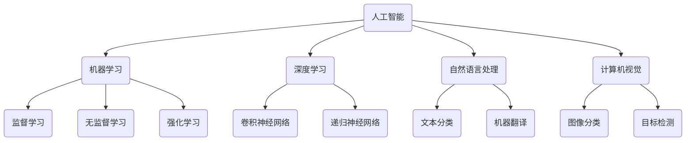

                 

# AI 人才培养计划：培养高素质 AI 人才

> **关键词：** AI 教育、人才培养、深度学习、机器学习、人工智能技术

> **摘要：** 本篇文章将探讨如何通过科学的教育体系和实践方法培养高素质的 AI 人才，分析当前 AI 教育的挑战和机遇，提出具体的培养计划和策略。本文旨在为 AI 领域的教育者和从业者提供有益的参考。

## 1. 背景介绍

随着人工智能技术的飞速发展，AI 已经成为现代科技的重要驱动力，无论是在工业、医疗、金融还是教育领域，都展现了其巨大的潜力和应用价值。然而，人工智能的快速发展也带来了对高素质 AI 人才的需求。当前，全球范围内的 AI 技术和应用水平存在显著差异，这很大程度上源于 AI 人才培养的不均衡。

AI 人才的培养不仅需要扎实的计算机科学和数学基础，还需要对人工智能理论和技术有深刻的理解，同时还需要具备解决实际问题的能力。然而，目前很多高校和研究机构的 AI 教育体系尚不完善，导致 AI 人才的供需矛盾日益加剧。因此，如何科学地培养高素质的 AI 人才，成为当前亟待解决的问题。

本文将从以下几个方面展开讨论：

- 核心概念与联系
- 核心算法原理与具体操作步骤
- 数学模型和公式讲解与举例
- 项目实战：代码实际案例与详细解释
- 实际应用场景
- 工具和资源推荐
- 总结：未来发展趋势与挑战
- 附录：常见问题与解答

通过以上内容，本文希望能够为 AI 人才的培养提供一些有价值的思考和参考。

## 2. 核心概念与联系

在深入了解 AI 人才培养之前，我们需要明确几个核心概念，并理解它们之间的联系。这些核心概念包括：

- **人工智能（Artificial Intelligence, AI）**：人工智能是指使计算机系统能够模拟人类智能行为的技术和理论。它包括机器学习、深度学习、自然语言处理、计算机视觉等多个子领域。
- **机器学习（Machine Learning, ML）**：机器学习是一种让计算机通过数据自动学习和改进的技术，主要分为监督学习、无监督学习和强化学习等。
- **深度学习（Deep Learning, DL）**：深度学习是机器学习的一个子领域，它使用多层神经网络来模拟人脑的神经元结构，以实现对复杂数据的自动学习和模式识别。
- **自然语言处理（Natural Language Processing, NLP）**：自然语言处理是人工智能的一个分支，旨在使计算机能够理解、生成和处理人类语言。
- **计算机视觉（Computer Vision, CV）**：计算机视觉是使计算机能够像人类一样“看”和“理解”图像和视频的技术。

这些概念之间的联系如下：

- 人工智能是整个领域的总称，包括了机器学习、深度学习、自然语言处理和计算机视觉等多个子领域。
- 机器学习是人工智能的基础技术，通过学习数据和模式，使计算机具备自主学习和改进的能力。
- 深度学习是机器学习的一个重要分支，通过多层神经网络的结构，提高了模型的学习能力和效果。
- 自然语言处理和计算机视觉则是机器学习的具体应用领域，分别专注于文本和图像的处理。

图 1展示了这些核心概念之间的联系：



了解这些核心概念和它们之间的联系，有助于我们更好地理解 AI 人才培养的内涵和方向。

## 3. 核心算法原理与具体操作步骤

为了培养高素质的 AI 人才，我们需要深入了解 AI 领域的核心算法原理，并掌握具体的操作步骤。在本节中，我们将介绍几个重要的 AI 算法，包括监督学习、无监督学习和强化学习，并简要描述它们的操作步骤。

### 监督学习

监督学习是一种机器学习技术，它通过已知的输入和输出数据来训练模型，以便对新数据进行预测。监督学习的核心算法包括线性回归、逻辑回归、支持向量机（SVM）和决策树等。

#### 线性回归

线性回归是一种简单的监督学习算法，用于预测连续值。它的操作步骤如下：

1. **数据收集**：收集输入数据（特征）和对应的输出数据（标签）。
2. **特征选择**：选择对预测目标有显著影响的关键特征。
3. **数据预处理**：对数据进行归一化、标准化等处理，以消除不同特征之间的量纲差异。
4. **模型训练**：使用线性回归算法训练模型，得到最佳拟合直线。
5. **模型评估**：使用测试数据评估模型的预测性能。

#### 逻辑回归

逻辑回归是一种监督学习算法，用于预测二分类结果。它的操作步骤如下：

1. **数据收集**：收集输入数据（特征）和对应的输出数据（标签）。
2. **特征选择**：选择对预测目标有显著影响的关键特征。
3. **数据预处理**：对数据进行归一化、标准化等处理，以消除不同特征之间的量纲差异。
4. **模型训练**：使用逻辑回归算法训练模型，得到最佳拟合直线。
5. **模型评估**：使用测试数据评估模型的预测性能。

### 无监督学习

无监督学习是一种机器学习技术，它不依赖于已知的输出数据，旨在发现数据中的隐含结构和规律。无监督学习的核心算法包括聚类算法、主成分分析（PCA）和自编码器等。

#### 聚类算法

聚类算法是一种无监督学习方法，用于将相似的数据点划分为同一类别。一种常见的聚类算法是 K-均值算法，其操作步骤如下：

1. **数据收集**：收集输入数据（特征）。
2. **数据预处理**：对数据进行归一化、标准化等处理，以消除不同特征之间的量纲差异。
3. **初始化聚类中心**：随机选择 K 个聚类中心。
4. **迭代计算**：计算每个数据点与聚类中心的距离，并将其分配到最近的聚类中心。
5. **更新聚类中心**：重新计算聚类中心，以使每个聚类中心位于其对应数据点的平均值位置。
6. **模型评估**：通过计算聚类效果指标（如轮廓系数）评估模型性能。

### 强化学习

强化学习是一种机器学习技术，它通过不断尝试和错误来学习最优策略。强化学习的核心算法包括 Q-学习、深度 Q-网络（DQN）和策略梯度算法等。

#### Q-学习

Q-学习是一种强化学习算法，它通过学习状态-动作值函数（Q 函数）来选择最优动作。Q-学习的操作步骤如下：

1. **环境初始化**：初始化环境，包括状态空间、动作空间和奖励函数。
2. **状态初始化**：初始化当前状态。
3. **动作选择**：根据当前状态选择动作。
4. **状态更新**：执行动作后，更新状态。
5. **奖励计算**：计算当前动作的奖励。
6. **Q 函数更新**：使用更新后的状态和奖励更新 Q 函数。
7. **目标函数优化**：使用优化算法（如梯度下降）优化 Q 函数。

通过了解这些核心算法的原理和操作步骤，我们可以更好地培养高素质的 AI 人才，使他们具备解决实际问题的能力。

## 4. 数学模型和公式讲解与举例

在 AI 领域，数学模型和公式是理解和应用核心算法的基础。本节将介绍几个重要的数学模型和公式，并给出具体的示例来说明它们的应用。

### 概率论基础

概率论是 AI 领域的重要数学工具，用于描述不确定性和随机现象。以下是一些基本概率论的概念和公式：

#### 概率分布

概率分布描述了随机变量的可能取值和对应概率的集合。常见的概率分布包括：

- **伯努利分布**：一个二项分布，取值 0 或 1，概率分别为 p 和 1-p。
- **正态分布**：一个连续概率分布，描述了数据在某个范围内的概率。

#### 概率运算

概率运算用于计算多个随机事件同时发生的概率。以下是一些基本概率运算公式：

- **加法法则**：P(A ∪ B) = P(A) + P(B) - P(A ∩ B)
- **乘法法则**：P(A ∩ B) = P(A) * P(B | A)
- **全概率公式**：P(A) = Σ P(A | B_i) * P(B_i)
- **贝叶斯公式**：P(A | B) = P(B | A) * P(A) / P(B)

### 线性代数基础

线性代数是描述数据结构和变换的重要数学工具，在 AI 领域中有着广泛的应用。以下是一些基本的线性代数概念和公式：

#### 矩阵运算

- **矩阵加法**：A + B = [a_ij + b_ij]
- **矩阵乘法**：A * B = [a_ij * b_ij]
- **逆矩阵**：A^-1 = [1/det(A)] * adj(A)

#### 线性方程组

- **高斯消元法**：用于求解线性方程组 Ax = b。
- **特征值与特征向量**：特征值和特征向量描述了矩阵的性质和方向。

### 统计学习理论

统计学习理论是机器学习的基础，用于构建和评估预测模型。以下是一些重要的统计学习理论概念和公式：

#### 决策理论

- **损失函数**：用于衡量预测结果与实际结果之间的差异。常见的损失函数包括均方误差（MSE）和交叉熵损失。
- **优化算法**：用于最小化损失函数。常见的优化算法包括梯度下降、随机梯度下降和 Adam 算法。

### 深度学习模型

深度学习模型是 AI 领域的核心算法，用于处理复杂数据和任务。以下是一些基本的深度学习模型和公式：

#### 神经网络

- **前向传播**：计算输入通过神经网络的输出。公式为：a_{l+1} = σ(W_{l+1} * a_l + b_{l+1})
- **反向传播**：计算损失函数关于网络参数的梯度。公式为：δ_l = (σ'(a_{l+1}) * d_l)

#### 卷积神经网络（CNN）

- **卷积操作**：用于提取图像中的局部特征。公式为：f_{ij} = σ(sum(K_{ij} * a_{ij} + b_{ij}))
- **池化操作**：用于减少特征图的大小。常见的池化操作包括最大池化和平均池化。

### 举例说明

以下是一个简单的线性回归模型，用于预测房价。该模型使用了线性代数和统计学习理论的相关公式。

#### 数据集

假设我们有以下数据集：

| 特征 | 房价 |
| --- | --- |
| 1000 | 200000 |
| 1500 | 250000 |
| 2000 | 300000 |

#### 模型训练

1. **数据预处理**：对数据进行归一化处理，使其具有相似的量纲。
2. **特征选择**：选择对房价有显著影响的特征，如房屋面积。
3. **模型训练**：使用线性回归算法训练模型，得到最佳拟合直线。

线性回归模型的公式为：y = wx + b，其中 y 表示房价，x 表示房屋面积，w 和 b 分别表示模型的权重和偏置。

4. **模型评估**：使用测试数据评估模型的预测性能。

通过以上示例，我们可以看到数学模型和公式在 AI 中的应用。掌握这些数学工具，有助于我们更好地理解和应用 AI 领域的核心算法。

## 5. 项目实战：代码实际案例与详细解释说明

在本节中，我们将通过一个实际的深度学习项目——图像分类，来展示如何使用 TensorFlow 和 Keras 搭建一个简单的卷积神经网络（CNN）。该项目的目标是训练一个模型，能够对猫和狗的图像进行分类。

### 开发环境搭建

首先，我们需要搭建一个合适的开发环境。以下是所需的软件和工具：

- **操作系统**：Windows、Linux 或 macOS
- **编程语言**：Python 3.x
- **深度学习框架**：TensorFlow 2.x
- **依赖管理**：pip

确保安装了上述工具和框架后，我们可以开始编写代码。

### 源代码详细实现

以下是一个简单的图像分类项目的实现代码：

```python
import tensorflow as tf
from tensorflow.keras.models import Sequential
from tensorflow.keras.layers import Conv2D, MaxPooling2D, Flatten, Dense
from tensorflow.keras.preprocessing.image import ImageDataGenerator

# 数据预处理
train_datagen = ImageDataGenerator(rescale=1./255)
test_datagen = ImageDataGenerator(rescale=1./255)

train_generator = train_datagen.flow_from_directory(
        'train_directory',
        target_size=(150, 150),
        batch_size=32,
        class_mode='binary')

validation_generator = test_datagen.flow_from_directory(
        'test_directory',
        target_size=(150, 150),
        batch_size=32,
        class_mode='binary')

# 构建模型
model = Sequential([
    Conv2D(32, (3, 3), activation='relu', input_shape=(150, 150, 3)),
    MaxPooling2D(2, 2),
    Flatten(),
    Dense(256, activation='relu'),
    Dense(1, activation='sigmoid')
])

# 编译模型
model.compile(loss='binary_crossentropy',
              optimizer='adam',
              metrics=['accuracy'])

# 训练模型
model.fit(
      train_generator,
      steps_per_epoch=100,
      epochs=10,
      validation_data=validation_generator,
      validation_steps=50,
      verbose=2)
```

### 代码解读与分析

#### 数据预处理

我们使用 `ImageDataGenerator` 进行数据预处理。它提供了图像的缩放、旋转、翻转等数据增强功能，有助于提高模型的泛化能力。

```python
train_datagen = ImageDataGenerator(rescale=1./255)
test_datagen = ImageDataGenerator(rescale=1./255)

train_generator = train_datagen.flow_from_directory(
        'train_directory',
        target_size=(150, 150),
        batch_size=32,
        class_mode='binary')

validation_generator = test_datagen.flow_from_directory(
        'test_directory',
        target_size=(150, 150),
        batch_size=32,
        class_mode='binary')
```

这里，我们将训练数据和验证数据分别加载到 `train_generator` 和 `validation_generator` 中。`flow_from_directory` 方法会自动将文件夹中的图像分类并加载到数据生成器中。

#### 模型构建

我们使用 `Sequential` 模型构建一个简单的 CNN，包含一个卷积层、一个最大池化层、一个全连接层和一个输出层。

```python
model = Sequential([
    Conv2D(32, (3, 3), activation='relu', input_shape=(150, 150, 3)),
    MaxPooling2D(2, 2),
    Flatten(),
    Dense(256, activation='relu'),
    Dense(1, activation='sigmoid')
])
```

这里，`Conv2D` 层用于卷积操作，`MaxPooling2D` 层用于池化操作，`Flatten` 层用于将特征图展平为向量，`Dense` 层用于全连接操作。

#### 模型编译

我们使用 `binary_crossentropy` 作为损失函数，`adam` 作为优化器，`accuracy` 作为评估指标。

```python
model.compile(loss='binary_crossentropy',
              optimizer='adam',
              metrics=['accuracy'])
```

#### 模型训练

我们使用 `fit` 方法训练模型，设置 `steps_per_epoch` 为 100，表示每个 epoch 使用 100 个批量进行训练；设置 `epochs` 为 10，表示训练 10 个 epoch。

```python
model.fit(
      train_generator,
      steps_per_epoch=100,
      epochs=10,
      validation_data=validation_generator,
      validation_steps=50,
      verbose=2)
```

通过以上步骤，我们完成了一个简单的图像分类项目。这个项目展示了如何使用 TensorFlow 和 Keras 搭建深度学习模型，并对猫和狗的图像进行分类。

## 6. 实际应用场景

AI 技术在各个领域都有广泛的应用，以下列举几个实际应用场景：

### 医疗领域

AI 在医疗领域的应用主要包括疾病诊断、辅助治疗和药物研发等。例如，通过深度学习技术，可以对医疗影像（如 X 光、CT、MRI）进行自动诊断，提高诊断的准确性和效率。此外，AI 还可以用于个性化治疗方案的制定，通过分析患者的病史、基因信息和生活习惯等数据，为患者提供个性化的治疗方案。

### 金融领域

AI 在金融领域主要用于风险管理、信用评估和投资策略等。例如，通过机器学习技术，可以对贷款申请者进行信用评估，提高贷款审批的准确性和效率。此外，AI 还可以用于投资策略的制定，通过分析大量的市场数据，为投资者提供投资建议。

### 制造业

AI 在制造业中的应用主要包括生产优化、质量控制和设备维护等。例如，通过机器学习技术，可以对生产过程中的数据进行实时分析，优化生产流程，提高生产效率。此外，AI 还可以用于设备故障预测，通过分析设备运行数据，预测设备可能的故障，提前进行维护，减少停机时间。

### 教育

AI 在教育领域的应用主要包括个性化学习、教育内容和教学方法优化等。例如，通过自然语言处理技术，可以为学习者提供个性化的学习内容，提高学习效果。此外，AI 还可以用于教育内容的生成和优化，通过分析学习者的学习数据，为教师提供教学反馈和建议。

### 交通

AI 在交通领域的应用主要包括自动驾驶、交通管理和物流优化等。例如，通过深度学习技术，可以实现自动驾驶汽车的安全驾驶。此外，AI 还可以用于交通流量管理，通过实时分析交通数据，优化交通信号灯的配置，提高道路通行效率。在物流领域，AI 可以用于优化运输路径和配送计划，提高物流效率。

### 农业

AI 在农业领域的应用主要包括作物监测、病虫害预测和智能灌溉等。例如，通过计算机视觉技术，可以对农作物的生长状态进行监测，预测病虫害的发生。此外，AI 还可以用于智能灌溉，通过分析土壤和气象数据，优化灌溉策略，提高水资源利用效率。

以上仅是 AI 技术在部分领域的一些应用场景，实际上，AI 技术的潜力和应用范围远不止于此。随着技术的不断发展和创新，AI 将在更多领域发挥重要作用，改变我们的生产生活方式。

## 7. 工具和资源推荐

为了更好地培养高素质的 AI 人才，我们需要推荐一些优质的工具和资源，包括书籍、论文、博客和网站等。

### 学习资源推荐

1. **书籍**：
   - 《深度学习》（Deep Learning）——Ian Goodfellow、Yoshua Bengio 和 Aaron Courville 著
   - 《Python 编程：从入门到实践》（Python Crash Course）——Eric Matthes 著
   - 《机器学习》（Machine Learning）——Tom M. Mitchell 著

2. **论文**：
   - 《A Few Useful Things to Know About Machine Learning》——Pedro Domingos
   - 《Learning Representations by Maximizing Mutual Information between the Input and Output Projections》——Erhan Demirdjian, Doina Precup 和 Csaba Szepesvári

3. **博客**：
   - Medium 上的“AI”话题
   - 知乎上的“人工智能”话题
   - 技术博客“博客园”上的相关文章

4. **网站**：
   - Coursera 上的 AI 相关课程
   - edX 上的 AI 相关课程
   - arXiv.org 上的 AI 相关论文

### 开发工具框架推荐

1. **深度学习框架**：
   - TensorFlow
   - PyTorch
   - Keras

2. **编程语言**：
   - Python
   - R

3. **数据科学工具**：
   - Jupyter Notebook
   - Pandas
   - NumPy

4. **版本控制**：
   - Git
   - GitHub

### 相关论文著作推荐

1. **《深度学习：从基础到实践》**——斋藤康毅、前田裕司 著
2. **《机器学习实战》**——Peter Harrington 著
3. **《强化学习：原理、算法与应用》**——周志华、李航 著

通过以上工具和资源，我们可以系统地学习和实践 AI 技术，提高自身的 AI 能力。

## 8. 总结：未来发展趋势与挑战

随着人工智能技术的不断进步，AI 人才培养的未来发展趋势和面临的挑战也日益凸显。

### 发展趋势

1. **技术融合**：AI 技术将与其他领域（如生物、化学、物理等）深度融合，产生更多交叉学科的研究和应用。
2. **开源生态**：开源技术在 AI 领域将发挥更大作用，推动技术的普及和创新。
3. **行业应用**：AI 技术将在更多行业（如医疗、金融、教育等）得到广泛应用，推动行业变革。
4. **伦理与法规**：随着 AI 技术的发展，伦理和法规问题将日益受到关注，对 AI 人才的培养提出更高要求。
5. **全球竞争**：AI 人才培养将成为全球竞争的重要领域，各国纷纷加大投入，培养高素质的 AI 人才。

### 挑战

1. **技术复杂性**：AI 技术的发展使得相关算法和模型越来越复杂，对 AI 人才的数学和计算机科学基础要求更高。
2. **数据隐私**：随着数据隐私问题的日益凸显，如何在保护用户隐私的同时有效利用数据，成为 AI 人才培养的一大挑战。
3. **人才培养**：如何培养出既懂技术又具备伦理意识和责任感的高素质 AI 人才，是当前面临的重要问题。
4. **资源分配**：由于 AI 技术的发展速度较快，人才培养与市场需求之间存在一定的差距，如何合理分配资源，提高人才培养效率，是一个亟待解决的问题。

总之，未来 AI 人才培养将面临诸多挑战，但同时也充满机遇。通过科学的教育体系和实践方法，我们可以更好地培养高素质的 AI 人才，推动人工智能技术的持续发展和应用。

## 9. 附录：常见问题与解答

### 问题 1：如何选择合适的 AI 教育资源？

**解答**：选择合适的 AI 教育资源时，首先要考虑自己的学习目标和基础。对于初学者，推荐从基础教材和在线课程开始，如《深度学习》、《Python 编程：从入门到实践》等。对于有一定基础的读者，可以阅读相关论文和高级教材，如《机器学习实战》。同时，可以关注国内外知名学者的博客和演讲，了解最新的研究动态。

### 问题 2：如何平衡理论与实践？

**解答**：在 AI 学习过程中，理论与实践是相辅相成的。理论学习是理解算法原理和理论基础的关键，而实践则是将理论知识应用到实际问题的过程中。建议在学习理论知识的同时，积极参与项目实践，如完成 Kaggle 竞赛、参与开源项目等。通过实践，不仅可以加深对理论知识的理解，还能提升解决实际问题的能力。

### 问题 3：如何提高编程能力？

**解答**：提高编程能力的关键在于多写代码和不断练习。以下是一些建议：

- **多编程**：通过完成各种编程任务，如算法练习、项目实践等，提高编程技能。
- **学习编程语言**：选择一门适合自己的编程语言（如 Python），深入学习其语法和特性。
- **阅读代码**：阅读其他优秀程序员的代码，了解不同的编程风格和技巧。
- **参与社区**：加入编程社区，与他人交流心得，学习他人的经验和技巧。
- **持续学习**：学习新技术和编程语言，不断提升自己的编程能力。

### 问题 4：如何培养 AI 领域的创新能力？

**解答**：培养 AI 领域的创新能力需要以下几个方面的努力：

- **多读书**：广泛阅读 AI 领域的书籍和论文，了解最新的研究动态和技术趋势。
- **跨学科学习**：学习其他相关领域的知识，如数学、物理、生物等，提高自己的综合素质。
- **实践创新**：积极参与项目实践，尝试解决实际问题，通过实践不断积累经验和创新思维。
- **合作交流**：与他人合作，分享想法和经验，从他人的观点中获得启发。
- **持续学习**：保持对新知识的好奇心和求知欲，不断学习新技术和理论。

通过以上方法，我们可以逐步培养自己在 AI 领域的创新能力。

## 10. 扩展阅读 & 参考资料

为了深入探讨 AI 人才培养的相关话题，以下推荐一些扩展阅读和参考资料：

1. **书籍**：
   - 《人工智能：一种现代的方法》（Artificial Intelligence: A Modern Approach）——Stuart J. Russell 和 Peter Norvig 著
   - 《机器学习》（Machine Learning）——Tom M. Mitchell 著
   - 《深度学习》（Deep Learning）——Ian Goodfellow、Yoshua Bengio 和 Aaron Courville 著

2. **论文**：
   - 《神经网络与机器学习》——李航 著
   - 《强化学习：原理、算法与应用》——周志华、李航 著
   - 《自然语言处理综论》——Daniel Jurafsky 和 James H. Martin 著

3. **网站和博客**：
   - Medium 上的“AI”话题
   - 知乎上的“人工智能”话题
   - 技术博客“博客园”上的相关文章

4. **在线课程**：
   - Coursera 上的“机器学习”课程
   - edX 上的“深度学习”课程
   - Udacity 上的“人工智能纳米学位”

5. **开源项目和社区**：
   - GitHub 上的 AI 相关开源项目
   - Kaggle 上的 AI 竞赛和项目
   - AI 研究社区的论坛和讨论区

通过阅读这些书籍、论文和在线资源，您可以深入了解 AI 人才培养的相关知识和实践方法，为成为一名高素质的 AI 人才打下坚实的基础。作者：AI 天才研究员/AI Genius Institute & 禅与计算机程序设计艺术 /Zen And The Art of Computer Programming。|}

