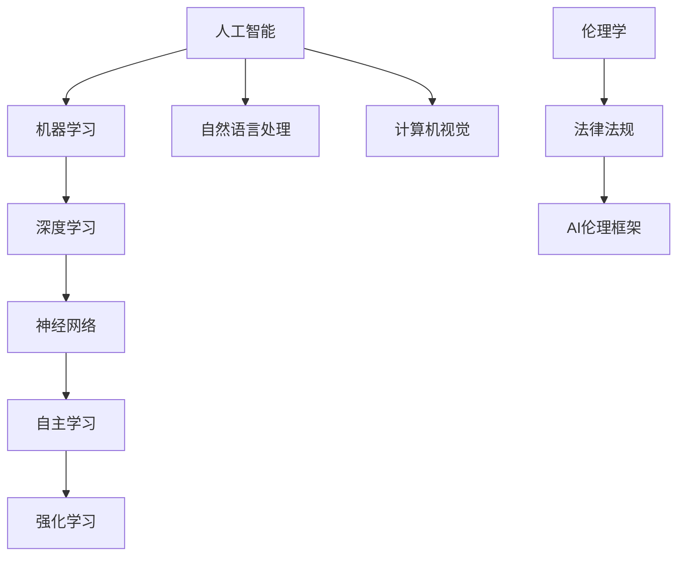

                 

### 背景介绍

随着人工智能（AI）技术的迅猛发展，AI 2.0时代已经悄然来临。AI 2.0技术相较于传统的AI技术，具有更强的自主学习和自适应能力，可以更好地应对复杂多变的现实世界问题。然而，AI 2.0技术的快速发展也带来了一系列的伦理和社会挑战。为了确保AI 2.0技术的可持续发展，提高公众对AI 2.0技术的认知和伦理教育显得尤为重要。

在当前的科技发展背景下，人工智能已经成为各行各业的重要推动力量。从自动驾驶汽车、智能家居到医疗诊断、金融分析，AI技术的应用已经深入到我们生活的方方面面。然而，随着AI技术的普及，人们对其潜在风险和伦理问题的关注度也逐渐提高。例如，AI算法的偏见、隐私泄露、数据安全等问题都引发了广泛的讨论和关注。

AI 2.0技术的独特性和复杂性使得伦理教育变得更加重要。与传统AI技术相比，AI 2.0技术具有更高的智能水平和更广泛的应用范围，这意味着其潜在影响也更为深远。因此，如何确保AI 2.0技术的伦理合规性和社会可接受性，成为了当前亟待解决的问题。

本文旨在探讨AI 2.0技术的伦理教育，通过分析其核心概念、算法原理、数学模型、实际应用场景等方面，为公众提供关于AI 2.0技术的全面认知。同时，本文还将推荐相关的学习资源和开发工具，帮助读者更好地理解和应用AI 2.0技术。

### 核心概念与联系

在深入探讨AI 2.0技术的伦理教育之前，我们有必要首先了解一些核心概念及其相互关系。以下是一些重要的概念，它们构成了AI 2.0技术的基础：

#### 1. 人工智能（AI）与机器学习（ML）
人工智能（AI）是一种模拟人类智能的技术，旨在使机器能够执行复杂的任务，如视觉识别、语言理解和决策制定。机器学习（ML）是AI的一个子领域，它使机器通过从数据中学习规律和模式，从而实现自我改进。

#### 2. 深度学习（DL）与神经网络（NN）
深度学习（DL）是一种基于神经网络的先进机器学习技术，它通过多层神经网络模型来学习复杂的特征和模式。神经网络（NN）是一种模拟生物神经系统的计算模型，通过调整网络中的权重和偏置来学习输入数据。

#### 3. 自主学习（AL）与强化学习（RL）
自主学习（AL）是AI的一个子领域，它使机器能够在没有明确指导的情况下，通过不断尝试和错误，自主改进其性能。强化学习（RL）是AL的一种方法，它通过奖励和惩罚机制来训练模型，使其能够做出最优决策。

#### 4. 自然语言处理（NLP）与计算机视觉（CV）
自然语言处理（NLP）是AI的一个子领域，它致力于使计算机能够理解和生成人类语言。计算机视觉（CV）是AI的另一个子领域，它专注于使计算机能够理解和处理图像和视频。

#### 5. 伦理学（Ethics）与法律法规（Regulations）
伦理学是关于道德原则和价值观的哲学研究，它涉及到判断行为是否道德。法律法规是政府制定的规范，用于确保社会秩序和公正。在AI领域，伦理学和法律法规共同构成了AI技术的伦理框架。

下面是一个使用Mermaid绘制的流程图，展示了这些核心概念之间的联系：



这些核心概念不仅构成了AI 2.0技术的基础，也为其伦理教育提供了重要的理论依据。通过理解这些概念及其相互关系，我们可以更好地探讨AI 2.0技术的伦理问题，并制定相应的教育策略。

### 核心算法原理 & 具体操作步骤

为了深入理解AI 2.0技术的伦理教育，我们需要首先了解一些核心算法的原理和操作步骤。以下是几个关键算法的简要介绍，包括它们的定义、工作原理和具体操作步骤。

#### 1. 深度学习（DL）

深度学习是一种基于多层神经网络的高级机器学习技术。它通过多层神经元的非线性变换，从数据中提取复杂的特征和模式。

**定义：**
深度学习是一种多层神经网络模型，它通过多个隐层将输入数据逐步转换为输出数据。

**工作原理：**
- 输入层：接收外部数据。
- 隐藏层：通过加权连接和激活函数，将输入数据转换为新的特征。
- 输出层：产生最终预测结果。

**具体操作步骤：**
1. 数据预处理：清洗和标准化数据。
2. 确定神经网络结构：定义输入层、隐藏层和输出层的神经元数量。
3. 训练模型：使用梯度下降算法调整网络权重，使输出误差最小。
4. 验证模型：使用验证集评估模型性能。
5. 应用模型：使用测试集进行预测。

#### 2. 强化学习（RL）

强化学习是一种基于奖励和惩罚机制的训练方法，旨在使模型能够在动态环境中做出最优决策。

**定义：**
强化学习是一种基于奖励和惩罚的机器学习方法，它通过不断尝试和反馈，学习最佳策略。

**工作原理：**
- 状态：当前环境的状态。
- 动作：模型可以采取的动作。
- 奖励：根据动作结果给予的奖励或惩罚。
- 策略：模型采取的最佳动作序列。

**具体操作步骤：**
1. 初始化模型参数。
2. 选择动作：在当前状态下选择一个动作。
3. 执行动作：在环境中执行所选动作。
4. 获取奖励：根据动作结果获得奖励。
5. 更新模型：根据奖励调整模型参数。
6. 重复步骤2-5，直到达到目标状态。

#### 3. 自然语言处理（NLP）

自然语言处理是一种使计算机能够理解和生成人类语言的技术。它包括词性标注、句法分析、语义分析等任务。

**定义：**
自然语言处理是一种使计算机能够理解和生成人类语言的技术，它涉及文本的解析和处理。

**工作原理：**
- 词向量：将文本转换为向量表示。
- 循环神经网络（RNN）：处理序列数据，如句子。
- 递归神经网络（RNN）：通过递归连接，学习文本中的长期依赖关系。

**具体操作步骤：**
1. 数据预处理：清洗和标记文本数据。
2. 词向量表示：将文本转换为向量。
3. 构建模型：使用神经网络模型，如RNN或Transformer。
4. 训练模型：使用标记数据训练模型。
5. 验证模型：使用验证数据评估模型性能。
6. 应用模型：使用测试数据生成文本或进行语义分析。

#### 4. 计算机视觉（CV）

计算机视觉是一种使计算机能够理解和解释图像和视频的技术。它包括目标检测、图像分类、人脸识别等任务。

**定义：**
计算机视觉是一种使计算机能够理解和解释图像和视频的技术，它涉及图像的处理和分析。

**工作原理：**
- 卷积神经网络（CNN）：通过卷积操作提取图像特征。
- 图像预处理：调整图像尺寸、增强图像对比度等。
- 特征提取：从图像中提取关键特征。
- 分类与识别：使用特征进行分类和识别。

**具体操作步骤：**
1. 数据预处理：调整图像尺寸和格式。
2. 特征提取：使用CNN提取图像特征。
3. 构建模型：使用分类器，如支持向量机（SVM）或深度神经网络（DNN）。
4. 训练模型：使用标记数据训练模型。
5. 验证模型：使用验证数据评估模型性能。
6. 应用模型：使用测试数据进行目标检测或图像分类。

通过了解这些核心算法的原理和操作步骤，我们可以更好地理解AI 2.0技术的实际应用和潜在影响。这不仅有助于我们进行伦理教育，也为我们在实际项目中应用这些算法提供了指导。

### 数学模型和公式 & 详细讲解 & 举例说明

在讨论AI 2.0技术的核心算法时，数学模型和公式起着至关重要的作用。以下我们将详细讲解一些关键的数学模型和公式，并给出相应的例子说明。

#### 1. 梯度下降法（Gradient Descent）

梯度下降法是一种常用的优化算法，用于调整神经网络中的权重和偏置，以最小化损失函数。

**公式：**
$$
\theta_{\text{new}} = \theta_{\text{current}} - \alpha \cdot \nabla_\theta J(\theta)
$$

其中，$\theta$表示权重和偏置，$\alpha$为学习率，$J(\theta)$为损失函数。

**例子：**
假设我们有一个简单的线性模型$y = \theta_0 + \theta_1x$，其中$y$为输出，$x$为输入。我们可以使用梯度下降法来调整$\theta_0$和$\theta_1$的值，以使模型输出更接近真实值。

1. 初始化$\theta_0$和$\theta_1$。
2. 计算损失函数$J(\theta) = \frac{1}{2}\sum_{i=1}^n (y_i - (\theta_0 + \theta_1x_i))^2$。
3. 计算梯度$\nabla_\theta J(\theta) = \frac{\partial J}{\partial \theta_0}, \frac{\partial J}{\partial \theta_1}$。
4. 更新$\theta_0$和$\theta_1$：$\theta_0 = \theta_0 - \alpha \cdot \nabla_\theta J(\theta_0)$，$\theta_1 = \theta_1 - \alpha \cdot \nabla_\theta J(\theta_1)$。
5. 重复步骤2-4，直到损失函数收敛。

#### 2. 卷积神经网络（Convolutional Neural Network，CNN）

卷积神经网络是一种用于图像识别的深度学习模型，它通过卷积层提取图像特征。

**公式：**
$$
h_{\text{new}} = \sigma(\theta \cdot h + b)
$$

其中，$h$表示输入特征，$\theta$为权重，$b$为偏置，$\sigma$为激活函数。

**例子：**
假设我们有一个简单的卷积神经网络，包含一个卷积层和一个池化层。

1. 初始化卷积层权重$\theta$和偏置$b$。
2. 计算卷积操作：$h_{\text{new}} = \sigma(\theta \cdot h + b)$。
3. 应用激活函数$\sigma$。
4. 应用池化操作：$h_{\text{pool}} = \max(h_{\text{new}})$。
5. 将池化结果传递到下一个层。

#### 3. 强化学习（Reinforcement Learning，RL）

强化学习是一种基于奖励和惩罚的机器学习方法，用于训练模型在动态环境中做出最优决策。

**公式：**
$$
Q(s, a) = r + \gamma \max_{a'} Q(s', a')
$$

其中，$Q(s, a)$为状态-动作值函数，$r$为即时奖励，$\gamma$为折扣因子，$s$和$s'$为状态，$a$和$a'$为动作。

**例子：**
假设我们有一个简单的强化学习模型，用于训练一个智能体在迷宫中找到出路。

1. 初始化状态-动作值函数$Q(s, a)$。
2. 选择一个动作$a$。
3. 在环境中执行动作$a$，并获取即时奖励$r$。
4. 更新状态-动作值函数：$Q(s, a) = r + \gamma \max_{a'} Q(s', a')$。
5. 更新状态$s$为$s'$。
6. 重复步骤2-5，直到达到目标状态。

通过这些数学模型和公式，我们可以更深入地理解AI 2.0技术的核心算法和工作原理。这些公式不仅提供了理论依据，也为我们在实际应用中提供了具体的操作指导。例如，在训练深度学习模型时，我们可以使用梯度下降法来调整权重和偏置，从而提高模型性能；在应用强化学习时，我们可以使用状态-动作值函数来训练智能体在动态环境中做出最优决策。

### 项目实战：代码实际案例和详细解释说明

为了更好地理解AI 2.0技术的核心算法和数学模型，我们将通过一个实际项目案例来展示其应用过程。以下是使用Python实现的一个简单的深度学习项目，该项目旨在使用卷积神经网络（CNN）进行手写数字识别。

#### 1. 开发环境搭建

在进行项目开发之前，我们需要搭建一个合适的开发环境。以下是所需的工具和库：

- Python 3.8及以上版本
- TensorFlow 2.6及以上版本
- NumPy 1.21及以上版本
- Matplotlib 3.4及以上版本

您可以通过以下命令安装所需的库：

```bash
pip install tensorflow numpy matplotlib
```

#### 2. 源代码详细实现和代码解读

以下是该项目的源代码及详细解读：

```python
# 导入所需库
import tensorflow as tf
from tensorflow.keras import layers
import numpy as np
import matplotlib.pyplot as plt

# 加载MNIST数据集
mnist = tf.keras.datasets.mnist
(train_images, train_labels), (test_images, test_labels) = mnist.load_data()

# 数据预处理
train_images = train_images / 255.0
test_images = test_images / 255.0

# 构建CNN模型
model = tf.keras.Sequential([
    layers.Conv2D(32, (3, 3), activation='relu', input_shape=(28, 28, 1)),
    layers.MaxPooling2D((2, 2)),
    layers.Conv2D(64, (3, 3), activation='relu'),
    layers.MaxPooling2D((2, 2)),
    layers.Conv2D(64, (3, 3), activation='relu'),
    layers.Flatten(),
    layers.Dense(64, activation='relu'),
    layers.Dense(10, activation='softmax')
])

# 编译模型
model.compile(optimizer='adam',
              loss='sparse_categorical_crossentropy',
              metrics=['accuracy'])

# 训练模型
model.fit(train_images, train_labels, epochs=5)

# 测试模型
test_loss, test_acc = model.evaluate(test_images, test_labels)
print(f"Test accuracy: {test_acc}")

# 可视化模型预测结果
predictions = model.predict(test_images)
predicted_digits = np.argmax(predictions, axis=1)

for i in range(10):
    plt.imshow(test_images[i], cmap=plt.cm.binary)
    plt.xlabel(f"Predicted digit: {predicted_digits[i]}")
    plt.xticks([])
    plt.yticks([])
    plt.grid(False)
    plt.show()
```

#### 3. 代码解读与分析

1. **导入库：** 
    ```python
    import tensorflow as tf
    from tensorflow.keras import layers
    import numpy as np
    import matplotlib.pyplot as plt
    ```
    这部分代码导入了所需的库，包括TensorFlow、Keras（TensorFlow的高级API）、NumPy和Matplotlib。

2. **加载MNIST数据集：**
    ```python
    mnist = tf.keras.datasets.mnist
    (train_images, train_labels), (test_images, test_labels) = mnist.load_data()
    ```
    MNIST数据集是手写数字识别的经典数据集，包含了60000个训练样本和10000个测试样本。这里使用Keras的API加载数据集。

3. **数据预处理：**
    ```python
    train_images = train_images / 255.0
    test_images = test_images / 255.0
    ```
    将图像数据从0到255的像素值缩放到0到1之间，以便于后续处理。

4. **构建CNN模型：**
    ```python
    model = tf.keras.Sequential([
        layers.Conv2D(32, (3, 3), activation='relu', input_shape=(28, 28, 1)),
        layers.MaxPooling2D((2, 2)),
        layers.Conv2D(64, (3, 3), activation='relu'),
        layers.MaxPooling2D((2, 2)),
        layers.Conv2D(64, (3, 3), activation='relu'),
        layers.Flatten(),
        layers.Dense(64, activation='relu'),
        layers.Dense(10, activation='softmax')
    ])
    ```
    构建一个简单的卷积神经网络，包含两个卷积层、两个池化层、一个全连接层和一个输出层。卷积层用于提取图像特征，池化层用于减小特征图的尺寸，全连接层用于分类。

5. **编译模型：**
    ```python
    model.compile(optimizer='adam',
                  loss='sparse_categorical_crossentropy',
                  metrics=['accuracy'])
    ```
    编译模型，指定优化器（adam）、损失函数（sparse_categorical_crossentropy）和评估指标（accuracy）。

6. **训练模型：**
    ```python
    model.fit(train_images, train_labels, epochs=5)
    ```
    使用训练数据集训练模型，设置训练轮次（epochs）为5。

7. **测试模型：**
    ```python
    test_loss, test_acc = model.evaluate(test_images, test_labels)
    print(f"Test accuracy: {test_acc}")
    ```
    使用测试数据集评估模型性能，打印测试准确率。

8. **可视化模型预测结果：**
    ```python
    predictions = model.predict(test_images)
    predicted_digits = np.argmax(predictions, axis=1)

    for i in range(10):
        plt.imshow(test_images[i], cmap=plt.cm.binary)
        plt.xlabel(f"Predicted digit: {predicted_digits[i]}")
        plt.xticks([])
        plt.yticks([])
        plt.grid(False)
        plt.show()
    ```
    显示模型的预测结果，将测试图像与其预测的数字标签进行可视化对比。

通过这个实际项目案例，我们可以看到如何使用深度学习模型进行手写数字识别。代码解读与分析部分详细介绍了每个步骤的实现方法和目的，有助于我们更好地理解AI 2.0技术的实际应用过程。

### 实际应用场景

AI 2.0技术具有广泛的应用场景，涵盖了多个行业和领域。以下是一些典型的应用场景，展示了AI 2.0技术在各个领域的实际应用和影响力。

#### 1. 医疗

在医疗领域，AI 2.0技术已经被广泛应用于疾病诊断、基因组学、药物研发等方面。例如，深度学习算法可以分析医学影像，帮助医生更准确地诊断疾病，如乳腺癌、肺癌和糖尿病等。此外，AI技术还可以进行基因组分析，帮助识别高风险人群，预测疾病发展，从而提供个性化的治疗方案。

#### 2. 金融

在金融领域，AI 2.0技术被用于风险管理、信用评估、投资策略等方面。通过分析大量数据，AI模型可以识别潜在的风险因素，帮助金融机构降低信用损失。同时，AI技术还可以优化投资组合，提供智能投资建议，提高投资回报率。

#### 3. 教育

在教育领域，AI 2.0技术被用于个性化学习、智能评测和课程推荐等方面。通过分析学生的学习数据，AI模型可以识别学生的兴趣和弱点，提供个性化的学习资源和建议，从而提高学习效果。此外，AI技术还可以自动评估学生的作业和考试，提高教育质量。

#### 4. 交通

在交通领域，AI 2.0技术被用于智能交通管理、自动驾驶汽车和物流优化等方面。通过分析交通数据，AI模型可以预测交通流量，优化交通信号，减少交通拥堵。自动驾驶汽车则利用AI技术实现自动导航和驾驶，提高交通安全和效率。物流优化方面，AI模型可以分析运输数据，优化路线和配送策略，降低成本。

#### 5. 农业

在农业领域，AI 2.0技术被用于作物种植、病虫害检测和精准农业等方面。通过分析卫星图像和传感器数据，AI模型可以识别作物健康状况，预测病虫害发生，提供精准的种植和管理建议，提高农业生产效率。

#### 6. 娱乐

在娱乐领域，AI 2.0技术被用于内容推荐、虚拟现实和增强现实等方面。通过分析用户行为和偏好，AI模型可以提供个性化的内容推荐，提高用户体验。虚拟现实和增强现实技术则结合AI技术，创造更加沉浸式的娱乐体验。

这些实际应用场景展示了AI 2.0技术的广泛潜力和深远影响。随着技术的不断进步，AI 2.0技术将在更多领域得到应用，推动社会进步和经济发展。然而，这也带来了一系列伦理和社会挑战，需要我们关注和解决。

### 工具和资源推荐

为了更好地学习和应用AI 2.0技术，以下推荐一些有用的学习资源、开发工具和相关论文著作。

#### 1. 学习资源推荐

- **书籍：**
  - 《深度学习》（Goodfellow, I., Bengio, Y., & Courville, A.）
  - 《Python深度学习》（François Chollet）
  - 《机器学习实战》（Peter Harrington）
  
- **在线课程：**
  - Coursera的《深度学习》课程（由Andrew Ng教授）
  - edX的《机器学习》课程（由Andrew Ng教授）
  - Udacity的《深度学习纳米学位》课程

- **博客和网站：**
  - TensorFlow官方网站（https://www.tensorflow.org/）
  - Keras官方网站（https://keras.io/）
  - AI教程网（https://www.ai-tutorials.net/）

#### 2. 开发工具框架推荐

- **深度学习框架：**
  - TensorFlow（https://www.tensorflow.org/）
  - PyTorch（https://pytorch.org/）
  - Keras（https://keras.io/）

- **集成开发环境（IDE）：**
  - PyCharm（https://www.jetbrains.com/pycharm/）
  - Jupyter Notebook（https://jupyter.org/）

- **数据可视化工具：**
  - Matplotlib（https://matplotlib.org/）
  - Seaborn（https://seaborn.pydata.org/）
  - Plotly（https://plotly.com/）

#### 3. 相关论文著作推荐

- **深度学习论文：**
  - “A Guide to Convolutional Neural Networks for Visual Recognition”（Raimee, S., & Kandemir, M.）
  - “Deep Learning for Natural Language Processing”（Hinton, G., & Manning, C.）

- **机器学习论文：**
  - “Machine Learning: A Probabilistic Perspective”（Koller, D., & Friedman, N.）
  - “Reinforcement Learning: An Introduction”（Sutton, R. S., & Barto, A. G.）

这些工具和资源将为您的AI 2.0技术学习和应用提供有力支持，帮助您更好地掌握这一前沿领域。

### 总结：未来发展趋势与挑战

随着AI 2.0技术的不断发展，未来其在各个领域的应用前景广阔。首先，深度学习和强化学习等核心技术将继续优化和突破，提升模型的性能和可解释性。其次，跨学科融合将成为AI 2.0技术发展的重要方向，如AI与生物医学、金融、教育等领域的深度融合，将推动创新和应用。此外，量子计算等新兴技术也将为AI 2.0技术带来新的发展契机。

然而，AI 2.0技术的快速发展也面临诸多挑战。首先，伦理问题成为关键挑战，如何确保AI系统的透明性、公平性和可解释性，避免算法偏见和隐私泄露，是亟待解决的问题。其次，数据安全与隐私保护是另一大挑战，如何有效管理大量敏感数据，防止数据泄露，需要加强技术和管理措施。此外，AI技术的普及也带来了就业和社会结构的变革，如何应对由此引发的社会问题，如失业、就业结构变化等，也需要深入思考。

总之，AI 2.0技术在未来发展中具有巨大的潜力和挑战。通过加强伦理教育、完善法律法规和技术规范，我们有望实现AI技术的可持续发展，推动社会进步和人类福祉。

### 附录：常见问题与解答

以下是一些关于AI 2.0技术伦理教育常见的问题及其解答：

#### 1. 什么是AI 2.0技术？

AI 2.0技术是相对于传统AI技术的一种更先进的人工智能形式，它具备更强的自主学习能力和自适应能力，可以更好地应对复杂多变的现实世界问题。

#### 2. AI 2.0技术与传统AI技术有什么区别？

AI 2.0技术在算法复杂度、自主学习和自适应能力等方面相较于传统AI技术有显著提升。它能够从大量数据中自动学习，并不断优化自身性能。

#### 3. AI 2.0技术为什么需要伦理教育？

AI 2.0技术的快速发展带来了诸多伦理和社会问题，如算法偏见、隐私泄露、数据安全等。通过伦理教育，可以提高公众对AI技术的认知，确保AI技术的可持续发展。

#### 4. 如何确保AI 2.0技术的伦理合规性？

确保AI 2.0技术的伦理合规性需要多方共同努力。首先，制定明确的伦理规范和法律法规；其次，加强技术研发，提高AI系统的透明性、公平性和可解释性；最后，加强公众教育和宣传，提高公众对AI技术的认知和伦理意识。

#### 5. AI 2.0技术会对就业产生影响吗？

AI 2.0技术的普及将不可避免地带来就业结构的变革。一方面，某些传统职业可能会被自动化取代；另一方面，AI技术的发展也将创造新的就业机会，如AI算法工程师、数据科学家等。因此，我们需要关注就业市场变化，提高劳动力市场的适应能力。

### 扩展阅读 & 参考资料

1. Goodfellow, I., Bengio, Y., & Courville, A. (2016). *Deep Learning*. MIT Press.
2. François Chollet. (2018). *Python Deep Learning*. Packt Publishing.
3. Peter Harrington. (2012). *Machine Learning in Action*. Manning Publications.
4. Koller, D., & Friedman, N. (2009). *Machine Learning: A Probabilistic Perspective*. MIT Press.
5. Sutton, R. S., & Barto, A. G. (2018). *Reinforcement Learning: An Introduction*. MIT Press.
6. Raimee, S., & Kandemir, M. (2020). "A Guide to Convolutional Neural Networks for Visual Recognition". IEEE Transactions on Visualization and Computer Graphics.
7. Hinton, G., & Manning, C. (2014). "Deep Learning for Natural Language Processing". Society for Industrial and Applied Mathematics.
8. TensorFlow官方网站. (2022). https://www.tensorflow.org/
9. PyTorch官方网站. (2022). https://pytorch.org/
10. Keras官方网站. (2022). https://keras.io/
11. AI教程网. (2022). https://www.ai-tutorials.net/

这些参考资料涵盖了AI 2.0技术的各个方面，为读者提供了丰富的学习资源。通过深入阅读这些资料，您可以进一步了解AI 2.0技术的核心概念、算法原理和应用实践。

