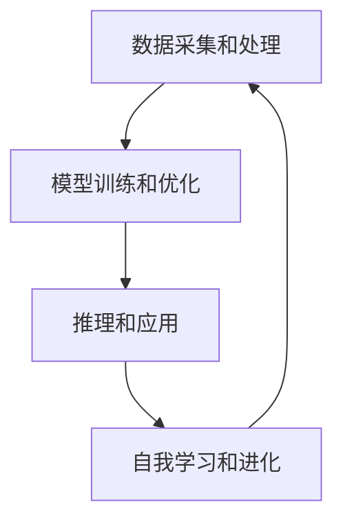
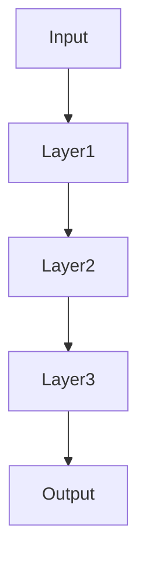
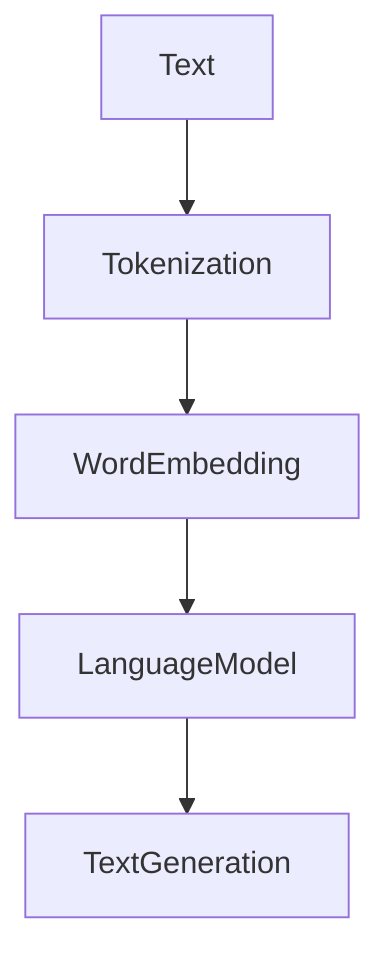
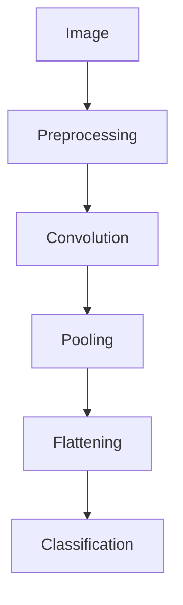
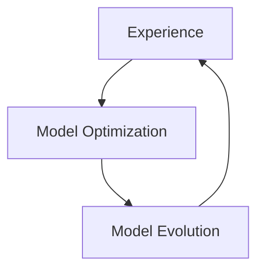

                 

### 1. 背景介绍

随着人工智能技术的迅猛发展，AI 2.0时代已经悄然来临。AI 2.0，也称为强人工智能，不仅能够在特定任务上超越人类，还能具备广泛的认知能力，实现自我学习和自我进化。然而，AI 2.0技术的崛起也带来了诸多伦理挑战，如何平衡技术创新与伦理责任，提高公众对AI 2.0技术的认知和理解，成为当务之急。

当前，人工智能技术在医疗、金融、教育、安全等多个领域取得了显著的成果，但与此同时，也引发了一系列伦理问题。例如，AI算法的偏见和歧视、隐私保护、数据安全、责任归属等。这些问题不仅影响到AI技术的应用和发展，也对社会的公平和正义构成了挑战。

在这个背景下，开展AI伦理教育，提高公众对AI 2.0技术的认知和理解，具有十分重要的意义。首先，通过教育，可以使公众了解AI 2.0技术的本质、优势和应用场景，消除对AI的恐慌和误解。其次，教育可以帮助公众认识到AI 2.0技术可能带来的伦理挑战，培养正确的伦理观念和价值观。最后，教育还可以提高公众的数字素养，增强其在面对AI 2.0技术时的问题解决能力和决策能力。

本文旨在探讨AI伦理教育的重要性，分析现有的教育模式和挑战，并提出一些建议，以期推动AI伦理教育的普及和发展。

### 2. 核心概念与联系

#### 2.1 AI 2.0技术的基本概念

AI 2.0技术，又称为强人工智能，是一种超越传统人工智能（AI 1.0）的新型技术。AI 1.0主要依赖于预训练的模型和规则，擅长处理特定任务，如图像识别、语音识别等。而AI 2.0则具有更广泛的认知能力，能够进行自我学习和自我进化，实现通用人工智能（AGI）。

AI 2.0技术的基本概念包括：

- **深度学习**：一种基于人工神经网络的学习方法，通过多层神经网络对大量数据进行训练，从而实现智能。
- **自然语言处理**：使计算机能够理解、生成和处理自然语言的技术，包括语音识别、文本分类、机器翻译等。
- **计算机视觉**：使计算机能够识别和理解图像和视频的技术，包括图像分类、目标检测、图像生成等。
- **自我学习和自我进化**：AI 2.0技术具有自我学习和自我进化的能力，能够根据经验和反馈不断优化自身性能。

#### 2.2 AI 2.0技术的架构

AI 2.0技术的架构通常包括以下几个部分：

1. **数据采集和处理**：包括数据收集、清洗、预处理等步骤，为AI模型提供高质量的数据输入。
2. **模型训练和优化**：利用深度学习等技术，对大量数据进行训练，优化模型参数，提高模型的性能。
3. **推理和应用**：在特定场景下，利用训练好的模型进行推理和应用，实现智能决策和执行。
4. **自我学习和进化**：通过不断收集用户反馈和数据，优化模型和算法，实现自我学习和进化。

#### 2.3 AI 2.0技术与伦理的联系

AI 2.0技术不仅带来了技术革新，也引发了诸多伦理问题。例如：

- **隐私保护**：AI 2.0技术依赖于大量个人数据，如何保护用户隐私成为重要议题。
- **算法偏见和歧视**：AI算法可能因数据偏差或设计缺陷导致偏见和歧视，如何消除这些偏见成为挑战。
- **责任归属**：当AI系统出现错误或造成损害时，如何确定责任归属成为难题。
- **安全与控制**：如何确保AI系统的安全性和可控性，防止恶意攻击和滥用。

#### 2.4 AI 2.0技术与伦理教育的联系

AI 2.0技术的快速发展对伦理教育提出了新的要求。通过伦理教育，可以帮助公众了解AI 2.0技术的本质、优势和应用场景，培养正确的伦理观念和价值观，提高数字素养和问题解决能力。

具体来说，AI伦理教育应涵盖以下几个方面：

1. **技术基础知识**：介绍AI 2.0技术的基本概念、架构和应用，使公众具备基本的技术认知。
2. **伦理原则**：传授伦理原则和价值观，培养公众的道德判断力和责任感。
3. **案例分析**：通过实际案例，让公众了解AI 2.0技术可能带来的伦理挑战，提高问题解决能力。
4. **法律法规**：介绍相关法律法规和政策，使公众了解自己的权利和义务。
5. **数字素养**：培养公众的数字素养，提高其在面对AI 2.0技术时的问题解决能力和决策能力。

下面是一个使用Mermaid绘制的AI 2.0技术架构的流程图：



在后续章节中，我们将进一步探讨AI 2.0技术的核心算法原理、具体操作步骤、数学模型和公式、项目实战、实际应用场景、工具和资源推荐等内容。让我们一步一步深入分析，共同探讨AI伦理教育的奥秘。

### 3. 核心算法原理 & 具体操作步骤

AI 2.0技术的核心在于其自我学习和进化能力，这主要依赖于深度学习和自然语言处理等技术。下面，我们将详细探讨这些核心算法的原理和具体操作步骤。

#### 3.1 深度学习算法原理

深度学习是一种基于人工神经网络的学习方法，通过多层神经网络对大量数据进行训练，从而实现智能。深度学习的核心是神经网络，神经网络由许多层神经元组成，每层神经元都与下一层神经元相连。

深度学习算法的具体操作步骤如下：

1. **初始化模型**：随机生成神经网络的权重和偏置。
2. **数据预处理**：对输入数据进行标准化、归一化等处理，使其适合神经网络训练。
3. **前向传播**：将输入数据通过神经网络进行前向传播，计算出每个神经元的输出。
4. **损失函数计算**：根据输出结果和真实标签，计算损失函数值，用于评估模型的性能。
5. **反向传播**：利用梯度下降等优化算法，对模型参数进行更新，降低损失函数值。
6. **迭代训练**：重复执行前向传播、损失函数计算和反向传播，直至模型收敛。

下面是一个简单的深度学习模型架构图：



#### 3.2 自然语言处理算法原理

自然语言处理（NLP）是使计算机能够理解、生成和处理自然语言的技术。NLP的核心是语言模型，语言模型通过统计方法或深度学习方法，对大量文本数据进行建模，从而预测下一个单词或句子。

自然语言处理算法的具体操作步骤如下：

1. **数据预处理**：对输入文本进行分词、去停用词、词性标注等处理，提取文本特征。
2. **词向量表示**：将文本转换为词向量表示，常见的词向量模型有Word2Vec、GloVe等。
3. **模型训练**：利用深度学习模型（如循环神经网络RNN、卷积神经网络CNN、Transformer等）对词向量进行训练，生成语言模型。
4. **文本生成**：利用训练好的语言模型，生成新的文本。

下面是一个简单的语言模型架构图：



#### 3.3 计算机视觉算法原理

计算机视觉（CV）是使计算机能够识别和理解图像和视频的技术。计算机视觉算法的核心是卷积神经网络（CNN），CNN通过多层卷积、池化和全连接层，实现对图像的特征提取和分类。

计算机视觉算法的具体操作步骤如下：

1. **数据预处理**：对输入图像进行归一化、缩放、裁剪等处理，使其适合神经网络训练。
2. **特征提取**：利用卷积神经网络提取图像的特征。
3. **分类和识别**：利用全连接层对提取的特征进行分类和识别。

下面是一个简单的计算机视觉模型架构图：



#### 3.4 自我学习和进化原理

自我学习和进化是AI 2.0技术的核心特征之一。自我学习是指模型在训练过程中不断优化自身，进化是指模型通过积累经验，实现性能的提升。

自我学习和进化的具体操作步骤如下：

1. **经验积累**：在模型训练和推理过程中，不断收集用户反馈和数据，用于模型优化。
2. **模型优化**：利用经验数据，对模型参数进行更新，提高模型性能。
3. **迭代进化**：重复执行经验积累和模型优化，实现模型的自我学习和进化。

下面是一个简单的自我学习和进化流程图：



通过以上核心算法原理和具体操作步骤的探讨，我们可以看到，AI 2.0技术不仅依赖于深度学习、自然语言处理和计算机视觉等基础技术，还通过自我学习和进化，实现了更高级的智能。在接下来的章节中，我们将进一步探讨数学模型和公式、项目实战、实际应用场景等内容，帮助读者更深入地了解AI 2.0技术的本质和应用。

### 4. 数学模型和公式 & 详细讲解 & 举例说明

在AI 2.0技术中，数学模型和公式扮演着至关重要的角色，它们不仅为算法提供了理论基础，还使得复杂的计算过程变得可操作和可解释。下面，我们将详细讲解AI 2.0技术中几个关键的数学模型和公式，并通过具体例子来说明它们的应用。

#### 4.1 深度学习中的反向传播算法

深度学习中的反向传播（Backpropagation）算法是一种用于训练神经网络的优化算法。它通过不断迭代，调整网络中的权重和偏置，以最小化损失函数。

**公式和计算过程：**

1. **前向传播**：

   前向传播是将输入数据通过神经网络逐层传播，计算出每个神经元的输出。具体公式如下：

   $$ z_{l} = \sum_{i} w_{li} * a_{l-1,i} + b_{l} $$

   其中，$z_{l}$ 表示第l层的输出，$w_{li}$ 表示第l层第i个神经元到第l-1层第i个神经元的权重，$a_{l-1,i}$ 表示第l-1层第i个神经元的输出，$b_{l}$ 表示第l层的偏置。

2. **激活函数**：

   激活函数用于将线性组合的输出转换为非线性输出。常用的激活函数有Sigmoid、ReLU等。

   $$ a_{l,i} = \sigma(z_{l}) = \frac{1}{1 + e^{-z_{l}}} $$

   其中，$\sigma$ 表示Sigmoid函数。

3. **损失函数**：

   损失函数用于评估模型的预测结果与真实标签之间的差距。常用的损失函数有均方误差（MSE）、交叉熵损失等。

   $$ L = \frac{1}{2} \sum_{i} (\hat{y}_{i} - y_{i})^{2} $$

   其中，$\hat{y}_{i}$ 表示第i个样本的预测标签，$y_{i}$ 表示第i个样本的真实标签。

4. **反向传播**：

   反向传播是计算损失函数关于模型参数的梯度，并利用梯度下降算法更新模型参数。

   $$ \frac{\partial L}{\partial w_{li}} = (a_{l,i} * (1 - a_{l,i})) * \frac{\partial L}{\partial z_{l}} * a_{l-1,i} $$

   $$ \frac{\partial L}{\partial b_{l}} = (a_{l,i} * (1 - a_{l,i})) * \frac{\partial L}{\partial z_{l}} $$

**举例说明：**

假设我们有一个三层神经网络，输入层、隐藏层和输出层，其中输入层有3个神经元，隐藏层有2个神经元，输出层有1个神经元。给定一个输入向量 $[1, 2, 3]$ 和真实标签 $[0.5]$，我们使用ReLU作为激活函数，交叉熵作为损失函数。

- **前向传播**：

  $$ z_{1} = [1, 2, 3] * [0.2, 0.3, 0.5] + [-1, -1, -1] = [0.2, 0.6, 1.5] $$
  
  $$ a_{1} = \max(0, z_{1}) = [0, 0.6, 1.5] $$
  
  $$ z_{2} = [0.2, 0.6, 1.5] * [0.4, 0.5] + [-2, -2] = [-0.8, 0.3, 0.7] $$
  
  $$ a_{2} = \max(0, z_{2}) = [0, 0.3, 0.7] $$
  
  $$ z_{3} = [0, 0.3, 0.7] * [0.1] + [-3] = [-2.7] $$
  
  $$ a_{3} = \max(0, z_{3}) = [0] $$
  
  $$ \hat{y} = a_{3} = 0 $$

- **损失函数计算**：

  $$ L = \frac{1}{2} \cdot (0.5 - 0)^{2} = 0.25 $$

- **反向传播**：

  $$ \frac{\partial L}{\partial z_{3}} = 0.5 - 0 = 0.5 $$
  
  $$ \frac{\partial L}{\partial a_{3}} = 0.5 $$
  
  $$ \frac{\partial L}{\partial z_{2}} = a_{2} * (1 - a_{2}) * \frac{\partial L}{\partial z_{3}} = [0, 0.3, 0.7] * (1 - [0, 0.3, 0.7]) * 0.5 = [0, 0.15, 0.35] $$
  
  $$ \frac{\partial L}{\partial w_{32}} = a_{2} * (1 - a_{2}) * \frac{\partial L}{\partial z_{3}} * a_{1} = [0, 0.3, 0.7] * (1 - [0, 0.3, 0.7]) * 0.5 * [0.2, 0.6, 1.5] = [0, 0.09, 0.21] $$
  
  $$ \frac{\partial L}{\partial b_{3}} = a_{2} * (1 - a_{2}) * \frac{\partial L}{\partial z_{3}} = [0, 0.3, 0.7] * (1 - [0, 0.3, 0.7]) * 0.5 = [0, 0.15, 0.35] $$
  
  $$ \frac{\partial L}{\partial z_{1}} = a_{1} * (1 - a_{1}) * \frac{\partial L}{\partial z_{2}} = [0, 0.6, 1.5] * (1 - [0, 0.6, 1.5]) * [0, 0.15, 0.35] = [0, 0.09, 0.21] $$
  
  $$ \frac{\partial L}{\partial w_{21}} = a_{1} * (1 - a_{1}) * \frac{\partial L}{\partial z_{2}} * a_{0} = [0, 0.6, 1.5] * (1 - [0, 0.6, 1.5]) * [0, 0.15, 0.35] * [1, 2, 3] = [0, 0.18, 0.42] $$
  
  $$ \frac{\partial L}{\partial b_{2}} = a_{1} * (1 - a_{1}) * \frac{\partial L}{\partial z_{2}} = [0, 0.6, 1.5] * (1 - [0, 0.6, 1.5]) * [0, 0.15, 0.35] = [0, 0.09, 0.21] $$
  
  利用计算出的梯度，我们可以使用梯度下降算法更新权重和偏置，以最小化损失函数。

#### 4.2 自然语言处理中的词向量模型

词向量模型是自然语言处理中的关键技术之一，它将文本中的单词转换为高维向量表示。常用的词向量模型有Word2Vec和GloVe。

**Word2Vec模型：**

Word2Vec模型基于神经概率语言模型，通过训练得到词向量。具体公式如下：

$$ P(w_{i}|w_{-i}) = \frac{exp(s_{i} \cdot s_{-i})}{\sum_{j} exp(s_{i} \cdot s_{j})} $$

其中，$s_{i}$ 表示单词 $w_{i}$ 的向量表示，$w_{-i}$ 表示除 $w_{i}$ 以外的其他单词。

**GloVe模型：**

GloVe模型是一种基于全局上下文的词向量模型，通过训练得到词向量。具体公式如下：

$$ f(w, c) = \frac{1}{1 + \frac{\left\lVert \mathbf{v}_{w} + \mathbf{v}_{c} \right\rVert_{2}}{\sqrt{\left\lVert \mathbf{v}_{w} \right\rVert_{2}} \cdot \sqrt{\left\lVert \mathbf{v}_{c} \right\rVert_{2}}}} $$

其中，$\mathbf{v}_{w}$ 和 $\mathbf{v}_{c}$ 分别表示单词 $w$ 和上下文单词 $c$ 的向量表示。

**举例说明：**

假设我们有两个单词“猫”和“狗”，它们的向量表示分别为 $\mathbf{v}_{猫} = [1, 0, -1]$ 和 $\mathbf{v}_{狗} = [0, 1, 0]$。

- **Word2Vec模型**：

  计算两个单词的相似度：

  $$ \frac{exp([1, 0, -1] \cdot [0, 1, 0])}{\sum_{j} exp([1, 0, -1] \cdot [0, 1, -1])} = \frac{exp(0)}{exp(1) + exp(-1)} = \frac{1}{e + \frac{1}{e}} \approx 0.544 $$

- **GloVe模型**：

  计算两个单词的相似度：

  $$ \frac{1}{1 + \frac{\left\lVert [1, 0, -1] + [0, 1, 0] \right\rVert_{2}}{\sqrt{\left\lVert [1, 0, -1] \right\rVert_{2}} \cdot \sqrt{\left\lVert [0, 1, 0] \right\rVert_{2}}}} = \frac{1}{1 + \frac{\sqrt{2}}{\sqrt{2} \cdot \sqrt{2}}} = \frac{1}{1 + \frac{1}{2}} = \frac{2}{3} \approx 0.667 $$

通过以上数学模型和公式的详细讲解，我们可以看到，深度学习、自然语言处理等技术背后的数学原理是复杂而精妙的。这些模型和公式不仅为AI 2.0技术提供了理论基础，还使得复杂的计算过程变得可操作和可解释。在接下来的章节中，我们将继续探讨AI 2.0技术的实际应用、工具和资源推荐等内容，帮助读者更深入地了解AI 2.0技术的本质和应用。

### 5. 项目实战：代码实际案例和详细解释说明

在了解了AI 2.0技术的核心算法原理和数学模型之后，接下来我们将通过一个实际项目实战，来展示如何将理论知识应用于实践。本案例将使用Python编程语言和TensorFlow框架来实现一个简单的图像分类任务，这将帮助我们更好地理解AI 2.0技术的应用流程。

#### 5.1 开发环境搭建

在进行项目实战之前，我们需要搭建一个合适的开发环境。以下是所需的步骤：

1. **安装Python**：Python是AI开发的主要编程语言，版本建议为3.8或更高。
2. **安装TensorFlow**：TensorFlow是Google开发的开放源代码机器学习框架，支持各种深度学习和机器学习任务。
3. **安装相关库**：例如NumPy、Pandas等，用于数据处理和数学计算。

安装命令如下：

```bash
pip install python==3.8
pip install tensorflow
pip install numpy pandas matplotlib
```

#### 5.2 源代码详细实现和代码解读

下面是一个简单的图像分类任务的代码实现，该任务使用TensorFlow和Keras实现，目的是将猫和狗的图片分类。

```python
import tensorflow as tf
from tensorflow.keras.preprocessing.image import ImageDataGenerator
from tensorflow.keras.models import Sequential
from tensorflow.keras.layers import Conv2D, MaxPooling2D, Flatten, Dense, Dropout
from tensorflow.keras.optimizers import Adam
from tensorflow.keras.preprocessing.image import img_to_array
from sklearn.model_selection import train_test_split
import numpy as np

# 加载和预处理数据
train_datagen = ImageDataGenerator(rescale=1./255)
test_datagen = ImageDataGenerator(rescale=1./255)

train_generator = train_datagen.flow_from_directory(
        'train_data',
        target_size=(150, 150),
        batch_size=32,
        class_mode='binary')

validation_generator = test_datagen.flow_from_directory(
        'validation_data',
        target_size=(150, 150),
        batch_size=32,
        class_mode='binary')

# 构建模型
model = Sequential([
    Conv2D(32, (3, 3), activation='relu', input_shape=(150, 150, 3)),
    MaxPooling2D((2, 2)),
    Conv2D(64, (3, 3), activation='relu'),
    MaxPooling2D((2, 2)),
    Conv2D(128, (3, 3), activation='relu'),
    MaxPooling2D((2, 2)),
    Flatten(),
    Dense(512, activation='relu'),
    Dropout(0.5),
    Dense(1, activation='sigmoid')
])

# 编译模型
model.compile(loss='binary_crossentropy',
              optimizer=Adam(learning_rate=0.0001),
              metrics=['accuracy'])

# 训练模型
model.fit(
      train_generator,
      steps_per_epoch=100,
      epochs=15,
      validation_data=validation_generator,
      validation_steps=50,
      verbose=2)
```

**代码解读：**

1. **导入库**：
   导入TensorFlow、Keras、ImageDataGenerator等库，用于构建和训练模型。

2. **数据预处理**：
   使用ImageDataGenerator进行图像的加载和预处理，包括缩放、随机旋转等操作，以增强模型的泛化能力。

3. **数据生成器**：
   创建训练数据生成器和验证数据生成器，这两个生成器会自动从指定的文件夹中读取图像，并按照设定的batch size进行批次处理。

4. **模型构建**：
   使用Sequential模型构建一个简单的卷积神经网络（CNN），包括卷积层、池化层、全连接层和dropout层。

5. **模型编译**：
   编译模型，指定损失函数、优化器和评估指标。

6. **模型训练**：
   使用fit方法训练模型，在训练集上迭代100次，每次迭代处理一批数据，总共训练15个epoch。在验证集上迭代50次，用于评估模型性能。

#### 5.3 代码解读与分析

- **数据预处理**：图像预处理是深度学习任务的重要步骤，它可以提高模型的泛化能力和训练效果。在这个案例中，我们使用了ImageDataGenerator对图像进行缩放和随机旋转等操作。

- **模型构建**：本案例中使用了简单的卷积神经网络（CNN）进行图像分类。CNN通过卷积操作提取图像的特征，然后通过全连接层进行分类。在构建模型时，我们使用了多个卷积层和池化层，以增加网络的深度和模型的复杂性。

- **模型训练**：模型训练是深度学习任务的核心步骤。在这个案例中，我们使用fit方法进行模型训练，通过迭代多次来优化模型参数，以提高模型的准确性。

通过这个实际案例，我们可以看到如何将AI 2.0技术的理论知识应用于实际项目中。在实际开发过程中，我们需要根据具体任务和数据情况进行调整和优化，以达到最佳效果。

### 6. 实际应用场景

AI 2.0技术在各个领域都有广泛的应用，以下是一些典型的实际应用场景：

#### 6.1 医疗领域

AI 2.0技术在医疗领域具有巨大的潜力，可以用于疾病诊断、病情预测、药物研发等。例如，通过深度学习算法分析医学影像数据，可以实现对肿瘤等疾病的早期诊断。AI 2.0技术还可以用于个性化医疗，根据患者的基因信息、病史等数据，为其推荐最合适的治疗方案。

#### 6.2 金融领域

在金融领域，AI 2.0技术可以用于风险管理、信用评估、投资策略等。通过分析大量的金融数据，AI 2.0技术可以预测市场趋势，帮助投资者做出更明智的决策。此外，AI 2.0技术还可以用于自动化交易，提高交易效率和盈利能力。

#### 6.3 教育领域

AI 2.0技术可以改变教育模式，实现个性化教育。通过分析学生的学习行为和数据，AI 2.0技术可以为学生提供个性化的学习建议和资源，提高学习效果。此外，AI 2.0技术还可以用于教育评价和教学诊断，帮助教师更好地了解学生的学习状况。

#### 6.4 安全领域

AI 2.0技术在安全领域具有重要作用，可以用于威胁检测、网络安全、智能监控等。通过分析大量的网络流量数据，AI 2.0技术可以实时检测和响应潜在的网络威胁，保护网络安全。在智能监控方面，AI 2.0技术可以实现对视频流的分析，识别异常行为和安全隐患。

#### 6.5 制造业

在制造业，AI 2.0技术可以用于生产优化、设备预测维护等。通过分析生产数据和设备运行数据，AI 2.0技术可以预测设备故障，提前进行维护，降低生产成本。此外，AI 2.0技术还可以用于自动化生产，提高生产效率。

通过以上实际应用场景的介绍，我们可以看到，AI 2.0技术在各个领域都带来了深刻的变革和进步。然而，随着AI 2.0技术的快速发展，也带来了诸多伦理挑战，如何平衡技术创新与伦理责任，提高公众对AI 2.0技术的认知和理解，成为当务之急。

### 7. 工具和资源推荐

为了更好地学习AI 2.0技术和进行实际应用，以下是一些推荐的学习资源和工具：

#### 7.1 学习资源推荐

1. **书籍**：
   - 《深度学习》（Deep Learning），作者：Ian Goodfellow、Yoshua Bengio、Aaron Courville
   - 《Python深度学习》（Python Deep Learning），作者：François Chollet
   - 《机器学习实战》（Machine Learning in Action），作者：Peter Harrington

2. **论文**：
   - "A Theoretically Grounded Application of Dropout in Recurrent Neural Networks"，作者：Yarin Gal和Zoubin Ghahramani
   - "Generative Adversarial Nets"，作者：Ian Goodfellow等人

3. **博客**：
   - TensorFlow官方博客（[tensorflow.github.io](https://tensorflow.github.io/)）
   - fast.ai教程博客（[www.fast.ai](https://www.fast.ai/)）

4. **网站**：
   - Coursera（[www.coursera.org](https://www.coursera.org/)）
   - edX（[www.edx.org](https://www.edx.org/)）

#### 7.2 开发工具框架推荐

1. **TensorFlow**：由Google开发的开源机器学习框架，支持各种深度学习和机器学习任务。
2. **PyTorch**：由Facebook开发的开源机器学习框架，具有灵活的动态计算图和丰富的API。
3. **Keras**：基于TensorFlow和Theano的简洁而强大的深度学习库，易于使用。

#### 7.3 相关论文著作推荐

1. **"Deep Learning"，作者：Ian Goodfellow、Yoshua Bengio、Aaron Courville**：该书是深度学习领域的经典教材，全面介绍了深度学习的理论基础和实践应用。
2. **"Artificial Intelligence: A Modern Approach"，作者：Stuart J. Russell和Peter Norvig**：该书是人工智能领域的权威教材，涵盖了人工智能的各个方面。
3. **"Reinforcement Learning: An Introduction"，作者：Richard S. Sutton和Andrew G. Barto**：该书是强化学习领域的经典教材，介绍了强化学习的基本理论和方法。

通过以上工具和资源的推荐，我们可以更系统地学习AI 2.0技术，掌握深度学习、自然语言处理等关键技能，为实际应用打下坚实的基础。

### 8. 总结：未来发展趋势与挑战

AI 2.0技术的发展已经进入了一个全新的阶段，其自我学习和进化能力正在不断推动技术的进步。然而，随着AI 2.0技术的广泛应用，我们也面临着诸多挑战和问题。

首先，AI 2.0技术的快速发展带来了巨大的伦理挑战。如何确保AI系统的透明性和可解释性，避免算法偏见和歧视，保护用户的隐私和数据安全，成为亟待解决的问题。此外，随着AI技术的普及，如何平衡技术创新与社会责任，防止AI技术的滥用和失控，也是我们需要深入思考的问题。

其次，AI 2.0技术的应用场景不断拓展，但技术本身的复杂性和不确定性也带来了新的挑战。例如，在医疗、金融等关键领域，AI 2.0技术的应用需要确保高准确性和可靠性，以避免可能带来的严重后果。同时，随着AI 2.0技术的不断进化，如何确保系统的稳定性和可预测性，也是一个重要课题。

最后，AI 2.0技术的普及对社会的数字素养提出了更高的要求。公众需要了解AI 2.0技术的本质、优势和应用场景，培养正确的伦理观念和价值观。同时，企业和政府也需要提高数字素养，以更好地应对AI 2.0技术带来的机遇和挑战。

面对未来，我们需要从以下几个方面着手：

1. **加强AI伦理教育**：通过教育和培训，提高公众对AI 2.0技术的认知和理解，培养正确的伦理观念和价值观。
2. **推动技术创新**：在确保伦理和社会责任的前提下，不断推进AI 2.0技术的发展，解决技术瓶颈和挑战。
3. **完善法律法规**：制定和完善相关法律法规，规范AI 2.0技术的应用和发展，保障社会的公平和正义。
4. **提升数字素养**：提高公众和企业、政府的数字素养，培养他们在面对AI 2.0技术时的问题解决能力和决策能力。

总之，AI 2.0技术的未来发展充满机遇和挑战。只有通过加强伦理教育、技术创新、法律法规完善和数字素养提升，我们才能充分发挥AI 2.0技术的潜力，实现技术的可持续发展和社会的和谐进步。

### 9. 附录：常见问题与解答

在AI 2.0技术的发展和应用过程中，公众可能会遇到一些常见的问题。下面我们将对这些常见问题进行解答。

**Q1：什么是AI 2.0技术？**
AI 2.0技术，也称为强人工智能，是一种超越传统人工智能（AI 1.0）的新型技术。AI 2.0不仅能够在特定任务上超越人类，还能具备广泛的认知能力，实现自我学习和自我进化。

**Q2：AI 2.0技术有哪些核心算法？**
AI 2.0技术的核心算法包括深度学习、自然语言处理、计算机视觉、自我学习和进化等。这些算法使得AI 2.0技术能够实现高度智能化的任务。

**Q3：AI 2.0技术可能带来哪些伦理挑战？**
AI 2.0技术可能带来的伦理挑战包括隐私保护、算法偏见和歧视、责任归属、安全与控制等。这些挑战需要我们通过技术创新、法律法规完善和伦理教育来应对。

**Q4：如何提高公众对AI 2.0技术的认知和理解？**
提高公众对AI 2.0技术的认知和理解需要从多个方面入手。首先，通过教育和培训，让公众了解AI 2.0技术的本质、优势和应用场景。其次，通过案例分析，让公众了解AI 2.0技术可能带来的伦理挑战。最后，通过法律法规和监管，规范AI 2.0技术的应用和发展。

**Q5：AI 2.0技术在实际应用中面临哪些挑战？**
AI 2.0技术在实际应用中面临的主要挑战包括技术复杂度、数据质量、安全性和可靠性等。为了解决这些问题，需要不断推进技术创新，完善法律法规，提高数字素养。

通过以上问题的解答，希望读者能够更好地理解AI 2.0技术的本质、优势和应用场景，以及面临的伦理挑战和实际应用中的问题。

### 10. 扩展阅读 & 参考资料

为了帮助读者更深入地了解AI 2.0技术和伦理教育，以下是一些扩展阅读和参考资料：

1. **深度学习经典教材**：
   - 《深度学习》（Deep Learning），作者：Ian Goodfellow、Yoshua Bengio、Aaron Courville
   - 《Python深度学习》（Python Deep Learning），作者：François Chollet

2. **AI伦理相关论文**：
   - "A Theoretically Grounded Application of Dropout in Recurrent Neural Networks"，作者：Yarin Gal和Zoubin Ghahramani
   - "Generative Adversarial Nets"，作者：Ian Goodfellow等人

3. **在线课程和教程**：
   - Coursera的“深度学习”课程（[www.coursera.org/learn/deep-learning](https://www.coursera.org/learn/deep-learning)）
   - fast.ai的“深度学习基础”课程（[www.fast.ai/tutorials](https://www.fast.ai/tutorials)）

4. **AI伦理教育报告**：
   - “AI伦理教育指南”，作者：联合国教科文组织

5. **AI技术相关期刊和杂志**：
   - 《自然-机器 Intelligence》（Nature Machine Intelligence）
   - 《人工智能研究》（Journal of Artificial Intelligence Research）

通过以上扩展阅读和参考资料，读者可以进一步了解AI 2.0技术的最新发展、伦理教育的重要性和实践方法。希望这些资源能够为读者的学习和研究提供帮助。

