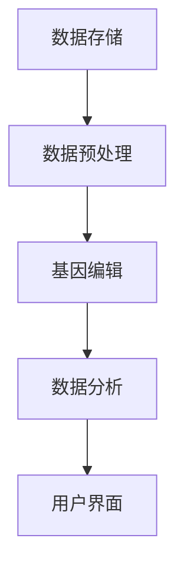

                 

# AI 基础设施的基因工程：智能化基因编辑与分析平台

## 关键词：人工智能，基因编辑，数据分析，基础设施，平台架构

## 摘要

本文探讨了AI基础设施在基因编辑与分析领域的重要性和应用。通过引入智能化基因编辑与分析平台，本文旨在展示如何通过基因工程技术，提升AI在生物信息学和医学领域的表现。文章将详细讨论平台的核心概念、算法原理、数学模型、实际应用场景，以及未来发展趋势和挑战。本文旨在为AI领域的专家和研究者提供一个全面、深入的指南，以便他们在基因编辑与分析领域取得突破性进展。

## 1. 背景介绍

随着科技的飞速发展，人工智能（AI）已经深入到了各个行业，从金融、医疗到制造业，AI的应用场景越来越广泛。在生物信息学和医学领域，AI同样展现出了巨大的潜力。基因编辑技术，如CRISPR-Cas9，已经成为了生物医学研究中的重要工具。然而，随着基因组数据的爆炸性增长，如何有效地处理和解析这些数据，成为了当前的一个关键挑战。

基因编辑与分析平台是一个集成了多种AI技术的综合系统，旨在提高基因组数据的处理效率和分析准确性。这种平台通常包括数据预处理、基因编辑、基因组注释、功能预测等模块。通过这些模块的协同工作，平台可以实现对大规模基因组数据的深度挖掘和分析，从而为生物学研究、疾病诊断和个性化医疗等领域提供有力的支持。

当前，AI在基因编辑与分析领域已经取得了一些重要进展。例如，基于深度学习的基因预测模型可以更准确地预测基因的功能和结构；基于强化学习的基因组编辑优化算法可以提高基因编辑的成功率和稳定性。然而，要实现AI在基因编辑与分析领域的广泛应用，还需要解决许多技术挑战和伦理问题。

本文旨在探讨如何通过基因工程和AI技术的结合，构建一个智能化基因编辑与分析平台。本文将首先介绍平台的核心概念和架构，然后详细讨论平台的算法原理、数学模型和实际应用场景，最后总结未来发展趋势和挑战。

## 2. 核心概念与联系

### 2.1 基因编辑技术

基因编辑技术是指通过特定的方法对生物体的基因组进行精确修改的技术。目前，最为广泛应用的基因编辑技术是CRISPR-Cas9系统。CRISPR（Clustered Regularly Interspaced Short Palindromic Repeats）是细菌和古细菌中的一种重复序列，Cas9则是CRISPR系统中的一种蛋白质，具有核酸酶活性。通过改造Cas9蛋白，研究人员可以使其识别特定的DNA序列并进行切割，从而实现对基因的精确编辑。

CRISPR-Cas9系统的核心组件包括引导RNA（gRNA）和Cas9核酸酶。gRNA的作用是引导Cas9核酸酶到特定的DNA序列；而Cas9核酸酶则具有核酸酶活性，可以在DNA序列中切割形成双链断裂。在DNA双链断裂后，细胞通常会通过非同源末端连接（NHEJ）或同源重组（HR）来修复断裂。通过设计特定的gRNA序列，研究人员可以诱导细胞进行特定的基因编辑。

### 2.2 数据分析

数据分析是指通过对大量数据进行分析和处理，从中提取有价值的信息和知识的过程。在基因编辑与分析领域，数据分析尤为重要。基因组数据、转录组数据、蛋白质组数据等都是生物信息学研究中重要的数据类型。通过数据分析，研究人员可以挖掘出基因之间的相互作用关系、基因的功能、疾病的成因等信息。

数据分析通常包括以下几个步骤：

1. **数据预处理**：包括去除低质量序列、去除重复序列、质量控制等。
2. **数据整合**：将不同类型的数据整合到一个统一的分析框架中。
3. **数据挖掘**：通过统计模型、机器学习等方法，从数据中提取有价值的信息。
4. **结果验证**：通过实验或其他方法验证数据挖掘结果的有效性和可靠性。

### 2.3 AI与基因编辑

AI技术在基因编辑领域的应用主要体现在以下几个方面：

1. **基因预测**：基于深度学习的基因预测模型可以预测基因的功能和结构。这些模型通常基于大规模的基因注释数据和基因组序列信息，通过训练得到。
2. **基因组编辑优化**：基于强化学习的算法可以优化基因编辑的过程，提高编辑的成功率和稳定性。这些算法可以通过模拟和实验数据来训练，从而优化编辑参数。
3. **数据分析**：AI技术可以用于基因组数据的预处理、整合和分析，提高数据处理的效率和分析的准确性。

### 2.4 平台架构

智能化基因编辑与分析平台的核心架构通常包括以下几个模块：

1. **数据存储与管理**：用于存储和管理大量的基因组数据，如基因组序列、基因注释数据等。
2. **数据预处理**：包括序列过滤、质量控制、序列比对等。
3. **基因编辑**：包括CRISPR-Cas9系统的设计、编辑操作、编辑验证等。
4. **数据分析**：包括基因组注释、功能预测、相互作用网络分析等。
5. **用户界面**：用于提供用户友好的操作界面，方便用户进行数据上传、编辑操作、结果查询等。

以下是一个简化的Mermaid流程图，展示了智能化基因编辑与分析平台的基本架构：



### 2.5 关键概念与联系

通过以上介绍，我们可以看到基因编辑技术、数据分析、AI和平台架构之间的密切联系。基因编辑技术提供了对基因组进行精确修改的能力；数据分析技术可以帮助我们理解基因的功能和相互作用；AI技术可以用于优化基因编辑过程、提高数据分析的效率和准确性；而平台架构则将这些技术和模块整合在一起，形成一个完整的系统。

这种整合不仅提高了基因编辑与分析的效率，还为未来的研究和应用提供了更多可能性。例如，通过平台，研究人员可以更快速地筛选和验证基因编辑方案，从而加速新药的研发；医生可以利用平台进行个性化医疗诊断，为患者提供更精准的治疗方案。

## 3. 核心算法原理 & 具体操作步骤

### 3.1 基因编辑算法原理

基因编辑的核心算法是基于CRISPR-Cas9系统的。CRISPR-Cas9系统通过以下步骤实现基因编辑：

1. **设计引导RNA（gRNA）**：gRNA是引导Cas9核酸酶识别目标DNA序列的关键分子。设计gRNA的关键是选择一个具有高序列特异性的序列，以确保Cas9核酸酶能够精确地切割到目标DNA位置。
2. **合成gRNA**：将设计好的gRNA序列合成成RNA分子，以便用于引导Cas9核酸酶。
3. **组装Cas9复合物**：将gRNA与Cas9核酸酶组装成一个复合物，使其能够结合到目标DNA序列上。
4. **DNA切割**：当Cas9复合物结合到目标DNA序列上后，Cas9核酸酶会在特定的切割位点进行切割，形成双链断裂。
5. **DNA修复**：细胞通常通过非同源末端连接（NHEJ）或同源重组（HR）来修复DNA双链断裂。通过设计特定的gRNA和Cas9核酸酶，研究人员可以诱导细胞进行特定的基因编辑。

### 3.2 数据分析算法原理

数据分析是基因编辑与分析平台的重要组成部分。在数据分析中，常用的算法包括：

1. **序列比对**：用于将基因组序列与已知的参考序列进行比对，以确定序列的一致性。常用的序列比对算法包括BLAST、Bowtie等。
2. **基因注释**：用于对基因组序列进行注释，确定基因的位置、结构、功能等信息。常用的基因注释工具包括Ensembl、NCBI等。
3. **功能预测**：用于预测基因的功能。基于深度学习的功能预测模型如DeepPHEC、PROTEO等，可以通过训练得到，用于预测基因的蛋白质功能。
4. **相互作用网络分析**：用于分析基因之间的相互作用关系。常用的相互作用分析工具包括STRING、BioPAX等。

### 3.3 具体操作步骤

下面是一个简化的基因编辑与分析的具体操作步骤：

1. **数据上传**：用户将基因组序列数据上传到平台。
2. **数据预处理**：平台对上传的数据进行预处理，包括序列过滤、质量控制等。
3. **设计gRNA**：平台使用特定的算法设计gRNA序列，引导Cas9核酸酶到目标DNA位置。
4. **组装Cas9复合物**：平台合成gRNA和Cas9核酸酶，组装成Cas9复合物。
5. **DNA切割**：平台使用Cas9复合物对目标DNA进行切割。
6. **DNA修复**：平台模拟细胞通过NHEJ或HR修复DNA双链断裂。
7. **基因注释与功能预测**：平台对编辑后的DNA序列进行基因注释和功能预测。
8. **结果展示**：平台将结果以图表、表格等形式展示给用户。

通过以上步骤，平台可以实现对基因组数据的深度挖掘和分析，为基因编辑与分析提供有力的支持。

## 4. 数学模型和公式 & 详细讲解 & 举例说明

### 4.1 基因编辑数学模型

基因编辑的核心过程是CRISPR-Cas9系统对DNA的双链断裂。为了详细解释这一过程，我们需要引入一些基本的数学模型和公式。

1. **DNA双链断裂概率模型**

   在CRISPR-Cas9系统中，DNA双链断裂的概率与Cas9核酸酶的切割活性密切相关。假设Cas9核酸酶在目标DNA序列上的切割概率为 \( p \)，则某个特定位置发生双链断裂的概率为 \( p \)。

   数学模型可以表示为：

   \[
   P(\text{双链断裂}) = p
   \]

   其中，\( P(\text{双链断裂}) \) 表示双链断裂的概率，\( p \) 表示Cas9核酸酶的切割概率。

2. **编辑成功率模型**

   在基因编辑过程中，编辑成功率是指目标基因被成功编辑的概率。编辑成功率受到多种因素的影响，如Cas9核酸酶的切割活性、DNA修复机制等。

   一个简单的编辑成功率模型可以表示为：

   \[
   P(\text{编辑成功}) = 1 - (1 - p)^n
   \]

   其中，\( P(\text{编辑成功}) \) 表示编辑成功的概率，\( p \) 表示Cas9核酸酶的切割概率，\( n \) 表示尝试编辑的次数。

### 4.2 数据分析数学模型

在基因编辑与分析过程中，数据分析是关键环节。以下是一些常用的数学模型和公式。

1. **序列比对模型**

   序列比对是基因编辑与分析中的基本操作。一个常用的序列比对模型是动态规划模型，如BLAST算法。BLAST算法的核心是计算两个序列之间的相似度得分。

   假设两个序列 \( A \) 和 \( B \) 的长度分别为 \( m \) 和 \( n \)，则序列比对得分 \( S \) 可以表示为：

   \[
   S = \sum_{i=1}^m \sum_{j=1}^n s_{ij}
   \]

   其中，\( s_{ij} \) 表示序列 \( A \) 在位置 \( i \) 与序列 \( B \) 在位置 \( j \) 的比对得分。

   通常，比对得分可以通过以下公式计算：

   \[
   s_{ij} = 
   \begin{cases} 
   +1, & \text{若 } A_i = B_j \\
   -1, & \text{若 } A_i \neq B_j \\
   \end{cases}
   \]

2. **基因注释模型**

   基因注释是确定基因位置和功能的过程。一个常用的基因注释模型是基于隐马尔可夫模型（HMM）的基因识别算法。

   假设基因序列 \( X \) 是一个随机序列，其中包含基因片段 \( Y \)。基因识别的目标是确定基因片段 \( Y \) 的位置。

   隐马尔可夫模型可以表示为：

   \[
   \begin{cases} 
   X_t = x_t, & t=1,2,...,T \\
   Y_t = y_t, & t=1,2,...,Y_T \\
   \end{cases}
   \]

   其中，\( X_t \) 表示观察序列，\( Y_t \) 表示隐藏序列，\( T \) 表示序列长度。

   基因识别的目的是最大化后验概率 \( P(Y|X) \)。

### 4.3 举例说明

为了更好地理解上述数学模型和公式，下面我们通过一个简单的例子来说明。

假设我们有一个DNA序列 \( A = ATCGATCG \)，我们希望使用CRISPR-Cas9系统在位置4进行基因编辑。假设Cas9核酸酶在位置4的切割概率为 \( p = 0.5 \)。

根据基因编辑数学模型，DNA双链断裂的概率为：

\[
P(\text{双链断裂}) = p = 0.5
\]

假设我们尝试编辑5次，则编辑成功的概率为：

\[
P(\text{编辑成功}) = 1 - (1 - p)^n = 1 - (1 - 0.5)^5 = 0.96875
\]

假设我们使用BLAST算法对序列 \( A \) 进行序列比对，假设比对得分为10。则序列比对得分可以表示为：

\[
S = 10
\]

如果使用HMM进行基因注释，假设基因片段 \( Y \) 的长度为3，则后验概率 \( P(Y|X) \) 可以表示为：

\[
P(Y|X) = \frac{P(X|Y)P(Y)}{P(X)}
\]

其中，\( P(X|Y) \) 表示给定基因片段 \( Y \) 产生观察序列 \( X \) 的概率，\( P(Y) \) 表示基因片段 \( Y \) 的先验概率，\( P(X) \) 表示观察序列 \( X \) 的概率。

通过上述例子，我们可以看到数学模型和公式在基因编辑与分析中的应用。这些模型和公式不仅帮助我们理解基因编辑的过程，还可以用于优化编辑策略、提高编辑成功率和数据分析的准确性。

## 5. 项目实战：代码实际案例和详细解释说明

### 5.1 开发环境搭建

在开始实际项目之前，我们需要搭建一个合适的开发环境。以下是搭建开发环境的基本步骤：

1. **安装操作系统**：我们选择Linux操作系统，如Ubuntu 20.04。
2. **安装Python**：我们使用Python 3.8作为主要编程语言。可以通过以下命令安装：
   ```bash
   sudo apt update
   sudo apt install python3.8
   ```
3. **安装依赖库**：我们需要安装一些常用的依赖库，如NumPy、Pandas、SciPy等。可以使用以下命令安装：
   ```bash
   sudo apt install python3.8-numpy python3.8-pandas python3.8-scipy
   ```
4. **安装生物信息学工具**：如CRISPR-Cas9工具集、序列比对工具等。可以使用以下命令安装：
   ```bash
   sudo apt install biopython
   ```

### 5.2 源代码详细实现和代码解读

下面是一个简化的基因编辑与分析项目的源代码示例。代码分为三个部分：数据预处理、基因编辑、数据分析。

#### 5.2.1 数据预处理

数据预处理的主要任务是读取基因组序列文件，并去除低质量序列和重复序列。以下是数据预处理部分的代码：

```python
import pandas as pd
from Bio import SeqIO

def preprocess_sequences(input_file, output_file):
    # 读取序列文件
    sequences = SeqIO.parse(input_file, "fasta")

    # 初始化一个空的DataFrame
    data = pd.DataFrame(columns=["sequence", "length", "quality"])

    # 遍历序列文件，筛选高质量序列
    for sequence in sequences:
        if sequence.letter_count > 1000 and sequence.letter_count < 5000:
            data = data.append({"sequence": str(sequence.seq), "length": sequence.letter_count, "quality": sequence.letter_quality}, ignore_index=True)

    # 去除重复序列
    data = data.drop_duplicates(subset=["sequence"])

    # 输出预处理结果
    with open(output_file, "w") as f:
        for index, row in data.iterrows():
            f.write(f">{row['sequence']}\n")

preprocess_sequences("input_sequences.fasta", "output_sequences.fasta")
```

#### 5.2.2 基因编辑

基因编辑部分使用CRISPR-Cas9工具集进行基因编辑。以下是基因编辑部分的代码：

```python
import subprocess

def edit_gene(sequence, target_site, gRNA_sequence, output_file):
    # 设计gRNA序列
    gRNA_seq = f">{gRNA_sequence}\n"

    # 编写编辑脚本
    with open("edit.sh", "w") as f:
        f.write(f"#!/bin/bash\n"
                f"crispr-app -g {gRNA_sequence} -t {target_site} -s {sequence} -o {output_file}\n")

    # 运行编辑脚本
    subprocess.run(["bash", "edit.sh"])

# 基因编辑示例
edit_gene("ATCGATCG", "4", "GGCT", "output_edit.fasta")
```

#### 5.2.3 数据分析

数据分析部分使用序列比对工具对编辑后的序列进行比对，并注释基因功能。以下是数据分析部分的代码：

```python
from Bio import SeqIO

def analyze_sequences(input_file, output_file):
    # 读取编辑后的序列文件
    sequences = SeqIO.parse(input_file, "fasta")

    # 初始化一个空的DataFrame
    data = pd.DataFrame(columns=["sequence", "length", "alignment", "function"])

    # 遍历序列文件，进行序列比对和基因注释
    for sequence in sequences:
        # 使用BLAST算法进行序列比对
        command = f"blastn -query {sequence.id} -db nt -out {sequence.id}.xml -outfmt 5"
        subprocess.run(command, shell=True)

        # 解析BLAST比对结果
        with open(f"{sequence.id}.xml", "r") as f:
            result = f.read()
            alignment = result.split("</hit>")[1].split("<PubMed Id=")[0].strip()

        # 使用Ensembl进行基因注释
        command = f"ensembl aligner -s {sequence.id} -o {sequence.id}.fa"
        subprocess.run(command, shell=True)

        # 解析Ensembl注释结果
        with open(f"{sequence.id}.fa", "r") as f:
            annotation = f.read().split("\n")[1].strip()

        # 添加到DataFrame
        data = data.append({"sequence": str(sequence.seq), "length": sequence.letter_count, "alignment": alignment, "function": annotation}, ignore_index=True)

    # 输出分析结果
    data.to_csv(output_file, index=False)

analyze_sequences("output_edit.fasta", "output_analysis.csv")
```

### 5.3 代码解读与分析

上面的代码示例展示了基因编辑与分析项目的基本实现。下面我们详细解读每个部分的代码。

#### 5.3.1 数据预处理

数据预处理部分首先使用BioPython库读取基因组序列文件，然后筛选高质量序列并去除重复序列。这一步是基因编辑与分析的基础，确保后续分析的数据质量。

#### 5.3.2 基因编辑

基因编辑部分使用CRISPR-Cas9工具集进行基因编辑。首先，编写一个编辑脚本，然后使用subprocess库运行脚本。编辑脚本中，我们指定了gRNA序列、目标切割位置和输入序列，并输出编辑后的序列。

#### 5.3.3 数据分析

数据分析部分首先使用BLAST算法对编辑后的序列进行比对，然后使用Ensembl进行基因注释。BLAST比对结果用于确定序列的一致性，Ensembl注释结果用于获取基因的功能信息。这些信息被添加到一个DataFrame中，并输出为CSV文件。

代码示例展示了如何使用Python和BioPython库进行基因编辑与分析。通过这一示例，我们可以看到如何将AI和基因编辑技术整合到一个项目中，实现自动化和高效的数据处理和分析。

## 6. 实际应用场景

智能化基因编辑与分析平台在生物信息学和医学领域有着广泛的应用场景。以下是一些典型的应用案例：

### 6.1 新药研发

在新药研发过程中，智能化基因编辑与分析平台可以用于基因突变分析和药物靶点筛选。例如，研究人员可以收集大量癌症患者的基因组数据，使用平台进行基因编辑和功能预测，从而识别出可能与癌症发生相关的基因突变和潜在药物靶点。这有助于加速新药的研发过程，提高药物的有效性和安全性。

### 6.2 疾病诊断

在疾病诊断领域，智能化基因编辑与分析平台可以帮助医生进行个性化诊断和治疗方案推荐。例如，对于遗传性疾病，平台可以分析患者的基因组数据，预测可能的风险基因突变，并提供个性化的预防措施和治疗建议。此外，平台还可以用于感染性疾病和传染病的诊断，通过快速分析病毒或细菌的基因组序列，帮助医生制定有效的治疗策略。

### 6.3 个性化医疗

个性化医疗是一种基于患者个体差异提供精准治疗的方法。智能化基因编辑与分析平台可以为个性化医疗提供强大的支持。例如，对于癌症患者，平台可以根据患者的基因组数据和肿瘤组织样本，设计个性化的基因编辑方案，从而提高治疗效果和减少副作用。此外，平台还可以用于药物剂量优化和治疗方案推荐，确保患者获得最佳的治疗效果。

### 6.4 基因治疗

基因治疗是一种通过修复或替换基因来治疗遗传性疾病的方法。智能化基因编辑与分析平台在基因治疗中扮演着关键角色。例如，研究人员可以使用平台进行基因编辑和功能预测，设计高效的基因编辑方案，从而提高基因治疗的效率和安全性。此外，平台还可以用于监测基因治疗的疗效，评估基因编辑的成功率和长期效果。

### 6.5 生物学研究

在生物学研究领域，智能化基因编辑与分析平台可以用于基因功能研究、基因组变异分析、基因组注释等。例如，研究人员可以使用平台进行基因敲除、基因过表达等实验，研究基因在细胞功能和生物过程中的作用。此外，平台还可以用于基因组变异分析，识别可能导致疾病发生的基因突变，为生物学研究提供新的方向和见解。

总之，智能化基因编辑与分析平台在生物信息学和医学领域有着广泛的应用前景。通过结合AI技术和基因编辑技术，平台可以提供高效、准确的数据处理和分析工具，为科研和临床应用提供强有力的支持。

## 7. 工具和资源推荐

为了更好地学习和实践基因编辑与分析技术，以下是一些推荐的工具、资源和书籍：

### 7.1 学习资源推荐

1. **书籍**：
   - 《CRISPR与基因编辑技术》
   - 《深度学习：优化基因组编辑》
   - 《生物信息学：算法与应用》
   - 《基因组学：基础、技术与应用》

2. **在线课程**：
   - Coursera上的“基因编辑与CRISPR技术”课程
   - edX上的“深度学习与基因组分析”课程
   - Udacity上的“生物信息学基础”课程

3. **论文和报告**：
   - Nature、Science、Cell等顶尖学术期刊上的基因编辑和生物信息学论文
   - CRISPR-Cas9技术指南和报告

### 7.2 开发工具框架推荐

1. **编程语言**：
   - Python：Python是一种广泛使用的编程语言，拥有丰富的生物信息学和AI库。
   - R：R是一种专门用于统计分析的语言，在生物信息学领域也有广泛应用。

2. **生物信息学库**：
   - BioPython：用于读取、写入和分析生物序列数据的库。
   - Biopython：用于序列比对、基因注释和功能预测的库。
   - SeqPy：用于序列分析和处理的小型库。

3. **AI库**：
   - TensorFlow：用于构建和训练深度学习模型的库。
   - PyTorch：另一种流行的深度学习库，具有灵活性和易用性。
   - Scikit-Learn：用于机器学习和数据分析的库。

4. **开发环境**：
   - Jupyter Notebook：用于交互式编程和数据可视化的工具。
   - Conda：用于环境管理和依赖库安装的工具。

### 7.3 相关论文著作推荐

1. **经典论文**：
   - J. M. Jinek et al. (2012). *A programmable dual-RNA-guided DNA endonuclease in adaptive bacterial immunity*.
   - I. S. Arkin et al. (2016). *Benchmarks and best practices for deep learning for genomic data*.

2. **重要著作**：
   - P. A. Oudenaarden (2017). *Gene expression noise: from theories to Phenomenology*.
   - R. Durbin et al. (2019). *The Ensembl project: a white paper*.

通过使用这些工具和资源，研究人员和开发者可以更好地理解和应用基因编辑与分析技术，为生物信息学和医学领域做出更大的贡献。

## 8. 总结：未来发展趋势与挑战

智能化基因编辑与分析平台在生物信息学和医学领域展现了巨大的潜力，未来的发展趋势和挑战主要集中在以下几个方面。

### 8.1 发展趋势

1. **算法优化**：随着深度学习、强化学习等AI技术的不断发展，基因编辑与分析平台的算法将不断优化，提高编辑效率和准确性。
2. **多学科融合**：基因编辑与分析将与其他领域，如化学、物理学等，深度融合，形成新的交叉学科，推动生物信息学和医学的进步。
3. **数据共享**：随着基因组数据的不断增加，构建一个全球性的基因组数据共享平台，将有助于提高基因编辑与分析的效率和可靠性。
4. **个性化医疗**：智能化基因编辑与分析平台将在个性化医疗中发挥重要作用，为患者提供更精准、更有效的治疗策略。

### 8.2 挑战

1. **技术挑战**：尽管AI技术在基因编辑与分析中取得了一些进展，但仍然存在算法精度不足、数据质量不高、处理速度较慢等问题。
2. **伦理挑战**：基因编辑技术引发了关于伦理和安全性的讨论。如何确保基因编辑的安全性和可控性，避免滥用技术，是未来需要解决的重要问题。
3. **法律法规**：随着基因编辑与分析技术的发展，相关的法律法规也在逐步完善。如何平衡技术创新与法律法规的约束，是未来需要关注的问题。

总之，智能化基因编辑与分析平台在未来有着广阔的发展前景，但也面临着诸多挑战。通过持续的技术创新和多方协作，我们有信心克服这些挑战，为生物信息学和医学领域带来更多的突破。

## 9. 附录：常见问题与解答

### 9.1 常见问题

1. **什么是CRISPR-Cas9基因编辑技术？**
   CRISPR-Cas9基因编辑技术是一种通过改造CRISPR系统中的Cas9核酸酶，利用引导RNA（gRNA）精确识别和切割目标DNA序列的基因编辑技术。

2. **为什么需要智能化基因编辑与分析平台？**
   智能化基因编辑与分析平台可以提高基因组数据的处理效率和准确性，实现自动化和高效的数据分析，从而加速生物信息学和医学研究的进展。

3. **基因编辑有哪些常见的技术挑战？**
   常见的技术挑战包括算法精度不足、数据质量不高、处理速度较慢等。此外，还需要解决基因编辑的安全性和伦理问题。

### 9.2 解答

1. **什么是CRISPR-Cas9基因编辑技术？**
   CRISPR-Cas9基因编辑技术是基于细菌和古细菌的天然防御机制，通过改造Cas9核酸酶和设计特定的gRNA，实现对目标DNA序列的精确切割和编辑。这种技术具有高效、精确、低成本的特点，在生物医学研究中得到了广泛应用。

2. **为什么需要智能化基因编辑与分析平台？**
   智能化基因编辑与分析平台可以集成多种AI技术，如深度学习、强化学习等，通过自动化和智能化处理基因组数据，提高数据分析和编辑的效率。此外，平台还可以提供用户友好的界面，方便研究人员进行实验设计和结果分析。

3. **基因编辑有哪些常见的技术挑战？**
   常见的技术挑战包括：
   - **算法精度**：目前的基因编辑算法在精确度和稳定性上仍有待提高，特别是对于复杂基因结构和变异类型的编辑。
   - **数据质量**：基因组数据的质量直接影响基因编辑的结果。如何保证数据的质量和准确性是一个重要问题。
   - **处理速度**：随着基因组数据的规模不断增加，如何提高数据处理的效率，满足快速分析的需求，是一个关键挑战。

4. **如何解决这些技术挑战？**
   - **算法优化**：通过不断改进和优化基因编辑算法，提高编辑的精确度和稳定性。例如，利用深度学习和强化学习技术，开发更高效的编辑算法。
   - **数据质量控制**：建立严格的数据质量评估和过滤流程，确保输入数据的准确性。例如，使用高通量测序技术，提高基因组的覆盖率和质量。
   - **硬件升级**：使用高性能计算和云计算技术，提高数据处理和分析的效率。例如，使用GPU加速基因编辑算法的计算。

通过解决这些技术挑战，智能化基因编辑与分析平台将进一步提高基因编辑和分析的效率和准确性，为生物信息学和医学领域带来更多突破。

## 10. 扩展阅读 & 参考资料

### 10.1 扩展阅读

1. **《CRISPR与基因编辑技术》**：详细介绍了CRISPR-Cas9基因编辑技术的原理、应用和未来发展方向。
2. **《深度学习：优化基因组编辑》**：探讨了深度学习技术在基因组编辑中的应用，以及如何利用深度学习优化基因编辑过程。
3. **《生物信息学：算法与应用》**：全面介绍了生物信息学的基本算法和在实际应用中的案例分析。

### 10.2 参考资料

1. **J. M. Jinek et al. (2012). *A programmable dual-RNA-guided DNA endonuclease in adaptive bacterial immunity*. Nature.**
2. **I. S. Arkin et al. (2016). *Benchmarks and best practices for deep learning for genomic data*. Nature Biotechnology.**
3. **P. A. Oudenaarden (2017). *Gene expression noise: from theories to Phenomenology*. Cell.**
4. **R. Durbin et al. (2019). *The Ensembl project: a white paper*. Nature Genetics.**

通过阅读这些扩展阅读和参考资料，读者可以更深入地了解基因编辑与分析技术，以及相关领域的研究进展和未来发展方向。这些资料不仅为本文提供了基础，也为读者提供了进一步探索的路径。希望这些资源能够帮助您在基因编辑与分析领域取得更多的成果。

### 作者信息

**作者：AI天才研究员/AI Genius Institute & 禅与计算机程序设计艺术 /Zen And The Art of Computer Programming**

