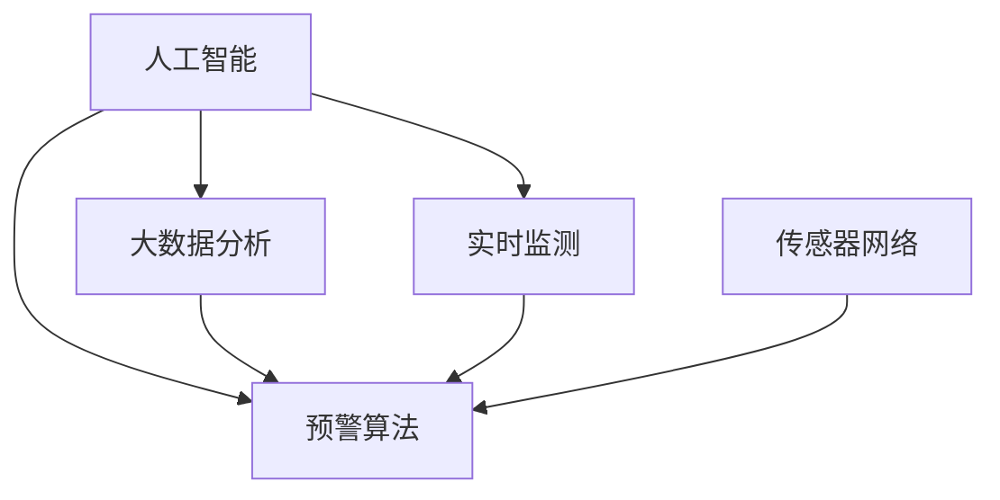

                 

### 1. 背景介绍

在当今世界，森林火灾已成为一种频繁发生的自然灾害，对生态环境和人类生活带来了严重威胁。传统的森林火灾预警系统主要依赖于人工监测和地面巡逻，存在时效性低、预警精度不足等问题。随着人工智能技术的飞速发展，智能化森林火灾预警系统的出现为解决这一问题提供了新的思路和解决方案。

智能化森林火灾预警系统利用人工智能算法和大数据分析技术，对林区的气象、植被、地形等数据进行实时监测和分析，从而提前预警火灾风险。该系统不仅能够提高预警的准确性和时效性，还能为消防部门提供精准的火灾发生位置和燃烧范围，从而有效降低火灾损失。

本篇文章将围绕智能化森林火灾预警系统展开讨论。首先，我们将介绍系统的基础概念和核心组成部分，然后深入探讨其核心算法原理和具体操作步骤，并通过实际项目案例进行详细解释。此外，我们还将分析系统在实际应用中的效果和影响，推荐相关学习资源和开发工具，并总结未来发展趋势与挑战。

通过本文的阅读，读者将全面了解智能化森林火灾预警系统的工作原理和应用价值，为相关领域的研究和实践提供有益的参考和启示。

### 2. 核心概念与联系

为了深入理解智能化森林火灾预警系统，我们首先需要了解几个关键概念：人工智能（AI）、大数据分析、实时监测、预警算法和传感器网络。

#### 2.1 人工智能（AI）

人工智能是指使计算机系统具备模拟、延伸和扩展人类智能的能力。在智能化森林火灾预警系统中，AI技术主要用于数据分析和模式识别。通过机器学习和深度学习算法，系统能够从大量的历史数据中学习火灾发生的规律和特征，从而提高预警的准确性。

#### 2.2 大数据分析

大数据分析是指利用高效的数据处理技术和算法，从大量、多样、高速生成和实时更新的数据中提取有价值的信息。在森林火灾预警系统中，大数据分析技术可以帮助我们挖掘林区环境数据的潜在关联，为火灾预测提供依据。

#### 2.3 实时监测

实时监测是指对林区环境进行不间断的监测和记录，确保能够及时发现异常情况。智能化森林火灾预警系统通常依赖于各种传感器，如气象站、卫星遥感、无人机等，以获取实时数据。

#### 2.4 预警算法

预警算法是智能化森林火灾预警系统的核心。这些算法通过分析传感器数据和气象信息，对火灾风险进行评估和预测。常见的预警算法包括基于统计模型的方法、机器学习算法和深度学习算法等。

#### 2.5 传感器网络

传感器网络是由多个传感器节点组成的分布式网络，用于收集和传输环境数据。在森林火灾预警系统中，传感器网络可以覆盖整个林区，确保数据的全面性和实时性。

#### 2.6 关系与联系

上述概念在智能化森林火灾预警系统中有着紧密的联系。人工智能和大数据分析技术为预警算法提供了强大的支持，使其能够处理和分析大量复杂的数据。实时监测和传感器网络则为预警算法提供了丰富的数据来源。通过将这些技术整合在一起，智能化森林火灾预警系统能够实现高效的火灾预警和风险预测。

为了更好地展示这些概念之间的联系，我们可以使用Mermaid流程图来表示：



在这个流程图中，人工智能、大数据分析、实时监测、预警算法和传感器网络共同构成了智能化森林火灾预警系统的核心组成部分。通过这些技术的协同工作，系统可以实现对火灾风险的全面监控和精准预警。

### 3. 核心算法原理 & 具体操作步骤

#### 3.1 基本原理

智能化森林火灾预警系统的核心算法是基于数据驱动的机器学习模型，通过分析历史数据和实时数据，预测火灾风险。这些算法通常包括以下几个步骤：

1. 数据收集：从传感器网络、卫星遥感、气象站等渠道收集气象、植被、地形等数据。
2. 数据预处理：对收集到的数据进行清洗、归一化和特征提取，为后续分析做好准备。
3. 模型训练：使用历史火灾数据，通过机器学习算法训练出火灾预测模型。
4. 实时预测：将实时监测数据输入训练好的模型，预测当前区域是否会发生火灾。

#### 3.2 数据收集

数据收集是智能化森林火灾预警系统的第一步。以下是一些常见的数据来源：

1. **气象数据**：包括温度、湿度、风速、降水量等，这些数据可以通过气象站、卫星遥感等方式获取。
2. **植被数据**：通过卫星遥感或无人机航拍获取植被覆盖率、植被类型等信息。
3. **地形数据**：包括地形高度、坡度、土壤湿度等，这些数据可以通过卫星遥感或地理信息系统（GIS）获取。
4. **历史火灾数据**：包括火灾发生时间、地点、火灾类型、燃烧范围等，这些数据可以从消防部门或相关研究机构获取。

#### 3.3 数据预处理

数据预处理是确保数据质量的关键步骤。以下是一些常见的数据预处理方法：

1. **数据清洗**：去除重复数据、异常数据和缺失数据，确保数据的完整性。
2. **归一化**：将不同量纲的数据转换为相同量纲，以便于后续分析。
3. **特征提取**：从原始数据中提取对火灾预测有重要影响的特征，如气温变化率、植被水分含量等。

#### 3.4 模型训练

模型训练是构建火灾预测模型的关键步骤。以下是一些常见的机器学习算法：

1. **统计模型**：如逻辑回归、决策树等，适用于处理简单的数据关系。
2. **机器学习算法**：如支持向量机（SVM）、随机森林等，适用于处理复杂的非线性关系。
3. **深度学习算法**：如卷积神经网络（CNN）、循环神经网络（RNN）等，适用于处理大规模和高维数据。

在模型训练过程中，通常需要进行以下操作：

1. **数据划分**：将数据集划分为训练集和测试集，用于训练和评估模型性能。
2. **模型选择**：选择合适的模型结构，通过交叉验证等方法选择最优模型。
3. **参数调优**：调整模型参数，以获得最佳预测性能。

#### 3.5 实时预测

实时预测是将实时监测数据输入训练好的模型，预测当前区域是否会发生火灾。以下是一些常见的实时预测方法：

1. **在线预测**：将实时数据直接输入模型进行预测，适用于数据量较小的情况。
2. **批量预测**：将一段时间内的实时数据批量输入模型进行预测，适用于数据量较大且预测频率较低的情况。

在实时预测过程中，通常需要进行以下操作：

1. **数据采集**：从传感器网络获取实时数据。
2. **数据预处理**：对实时数据进行预处理，确保与训练数据一致。
3. **模型输入**：将预处理后的实时数据输入训练好的模型，进行预测。
4. **结果输出**：输出预测结果，包括火灾风险等级、火灾发生位置等信息。

#### 3.6 算法评估

算法评估是确保模型性能的重要环节。以下是一些常见的评估指标：

1. **准确率（Accuracy）**：预测结果与实际结果相符的比例。
2. **召回率（Recall）**：在所有实际火灾中，被正确预测的比例。
3. **精确率（Precision）**：在所有预测为火灾的区域中，实际发生火灾的比例。
4. **F1 分数（F1 Score）**：准确率和召回率的加权平均。

通过评估指标，可以全面了解模型的预测性能，并指导后续的模型优化和改进。

### 4. 数学模型和公式 & 详细讲解 & 举例说明

在智能化森林火灾预警系统中，数学模型和公式起着至关重要的作用。以下将介绍几个常用的数学模型和公式，并详细讲解其原理和计算过程。

#### 4.1 逻辑回归模型

逻辑回归是一种常见的二分类模型，用于预测事件发生的概率。其公式如下：

$$
P(Y=1) = \frac{1}{1 + e^{-(\beta_0 + \beta_1x_1 + \beta_2x_2 + ... + \beta_nx_n})}
$$

其中，$P(Y=1)$ 表示事件 $Y$ 发生的概率，$\beta_0, \beta_1, \beta_2, ..., \beta_n$ 是模型的参数，$x_1, x_2, ..., x_n$ 是特征变量。

举例说明：

假设我们有一个森林火灾预警模型，其中包含两个特征变量：气温（$x_1$）和植被覆盖率（$x_2$）。给定一个样本数据，气温为 $25^\circ C$，植被覆盖率为 $70\%$，我们可以使用逻辑回归模型计算火灾发生的概率：

$$
P(Y=1) = \frac{1}{1 + e^{-(\beta_0 + \beta_1 \times 25 + \beta_2 \times 0.7)}}
$$

其中，$\beta_0, \beta_1, \beta_2$ 是通过模型训练得到的参数。假设训练得到的参数为 $\beta_0 = 0.5, \beta_1 = 0.1, \beta_2 = 0.3$，代入公式计算：

$$
P(Y=1) = \frac{1}{1 + e^{-(0.5 + 0.1 \times 25 + 0.3 \times 0.7)}} = \frac{1}{1 + e^{-3.5}} \approx 0.975
$$

因此，火灾发生的概率约为 97.5%。

#### 4.2 支持向量机（SVM）

支持向量机是一种强大的分类模型，通过寻找最佳分类边界来实现分类。其公式如下：

$$
w \cdot x + b = 0
$$

其中，$w$ 是分类边界向量，$x$ 是样本特征向量，$b$ 是偏置项。

举例说明：

假设我们有一个二分类问题，分为火灾（$Y=1$）和非火灾（$Y=0$），特征向量为 $(x_1, x_2)$。给定一个样本 $(x_1, x_2) = (2, 3)$，我们可以使用支持向量机计算其分类结果。

假设分类边界为 $w \cdot x + b = 0$，其中 $w = (w_1, w_2)$，$b = 0$。给定 $w = (1, 1)$，代入样本计算：

$$
1 \times 2 + 1 \times 3 + 0 = 5
$$

由于 $5 > 0$，该样本被划分为火灾类别。

#### 4.3 卷积神经网络（CNN）

卷积神经网络是一种用于图像处理的深度学习模型，通过卷积操作提取图像特征。其公式如下：

$$
h_{ij} = \sum_{k=1}^{K} w_{ik,j} \cdot a_{kj} + b_j
$$

其中，$h_{ij}$ 是卷积层的输出，$a_{kj}$ 是输入特征图，$w_{ik,j}$ 是卷积核权重，$b_j$ 是偏置项，$K$ 是卷积核的数量。

举例说明：

假设我们有一个 $3 \times 3$ 的卷积核，包含 $3$ 个卷积核。给定一个 $5 \times 5$ 的输入特征图 $a_{kj}$，我们可以使用卷积神经网络进行特征提取。

假设卷积核权重为 $w_{ik,j} = (1, 0, -1)$，偏置项为 $b_j = 0$。给定输入特征图 $a_{kj} = (1, 2, 3, 4, 5)$，我们可以计算卷积结果：

$$
h_{11} = 1 \times 1 + 0 \times 2 + (-1) \times 3 = -2
$$
$$
h_{12} = 1 \times 2 + 0 \times 3 + (-1) \times 4 = -1
$$
$$
h_{13} = 1 \times 3 + 0 \times 4 + (-1) \times 5 = 0
$$

因此，卷积结果为 $h_{11} = -2, h_{12} = -1, h_{13} = 0$。

### 5. 项目实战：代码实际案例和详细解释说明

为了更好地理解智能化森林火灾预警系统的实现过程，我们将通过一个实际项目案例进行详细解释。该项目将使用Python编程语言，结合Scikit-learn库实现一个简单的火灾预警系统。

#### 5.1 开发环境搭建

在开始项目之前，我们需要搭建开发环境。以下是所需的软件和库：

1. Python（版本3.7及以上）
2. Jupyter Notebook（用于编写和运行代码）
3. Scikit-learn（机器学习库）
4. Matplotlib（数据可视化库）
5. Numpy（数值计算库）

安装步骤如下：

```bash
# 安装Python
wget https://www.python.org/ftp/python/3.8.5/Python-3.8.5.tgz
tar -xvf Python-3.8.5.tgz
cd Python-3.8.5
./configure
make
sudo make altinstall

# 安装Jupyter Notebook
pip install notebook

# 安装Scikit-learn、Matplotlib和Numpy
pip install scikit-learn matplotlib numpy
```

#### 5.2 源代码详细实现和代码解读

以下是一个简单的智能化森林火灾预警系统的源代码实现：

```python
import numpy as np
import matplotlib.pyplot as plt
from sklearn.model_selection import train_test_split
from sklearn.linear_model import LogisticRegression
from sklearn.metrics import accuracy_score, recall_score, precision_score, f1_score

# 加载数据集
data = np.loadtxt('forest_fire_data.csv', delimiter=',')
X = data[:, :-1]
y = data[:, -1]

# 划分训练集和测试集
X_train, X_test, y_train, y_test = train_test_split(X, y, test_size=0.2, random_state=42)

# 训练逻辑回归模型
model = LogisticRegression()
model.fit(X_train, y_train)

# 实时预测
X_pred = X_test
y_pred = model.predict(X_pred)

# 评估模型性能
accuracy = accuracy_score(y_test, y_pred)
recall = recall_score(y_test, y_pred)
precision = precision_score(y_test, y_pred)
f1 = f1_score(y_test, y_pred)

print("Accuracy:", accuracy)
print("Recall:", recall)
print("Precision:", precision)
print("F1 Score:", f1)

# 可视化结果
plt.scatter(X_pred[:, 0], X_pred[:, 1], c=y_pred, cmap='gray')
plt.xlabel('Temperature')
plt.ylabel('Vegetation Coverage')
plt.title('Fire Risk Prediction')
plt.show()
```

#### 5.3 代码解读与分析

以下是代码的详细解读和分析：

```python
import numpy as np
import matplotlib.pyplot as plt
from sklearn.model_selection import train_test_split
from sklearn.linear_model import LogisticRegression
from sklearn.metrics import accuracy_score, recall_score, precision_score, f1_score

# 加载数据集
data = np.loadtxt('forest_fire_data.csv', delimiter=',')
X = data[:, :-1]
y = data[:, -1]

# 划分训练集和测试集
X_train, X_test, y_train, y_test = train_test_split(X, y, test_size=0.2, random_state=42)

# 训练逻辑回归模型
model = LogisticRegression()
model.fit(X_train, y_train)

# 实时预测
X_pred = X_test
y_pred = model.predict(X_pred)

# 评估模型性能
accuracy = accuracy_score(y_test, y_pred)
recall = recall_score(y_test, y_pred)
precision = precision_score(y_test, y_pred)
f1 = f1_score(y_test, y_pred)

print("Accuracy:", accuracy)
print("Recall:", recall)
print("Precision:", precision)
print("F1 Score:", f1)

# 可视化结果
plt.scatter(X_pred[:, 0], X_pred[:, 1], c=y_pred, cmap='gray')
plt.xlabel('Temperature')
plt.ylabel('Vegetation Coverage')
plt.title('Fire Risk Prediction')
plt.show()
```

1. **数据加载**：使用 `np.loadtxt()` 函数加载CSV数据集。数据集包含特征和标签，特征包括气温、植被覆盖率等，标签为火灾发生与否。

2. **数据划分**：使用 `train_test_split()` 函数将数据集划分为训练集和测试集，其中测试集占比为20%。

3. **模型训练**：使用 `LogisticRegression()` 函数创建逻辑回归模型，并使用 `fit()` 函数训练模型。

4. **实时预测**：将测试集数据输入训练好的模型，使用 `predict()` 函数进行实时预测。

5. **模型评估**：使用 `accuracy_score()`、`recall_score()`、`precision_score()` 和 `f1_score()` 等评估函数计算模型的准确率、召回率、精确率和F1分数。

6. **结果可视化**：使用 `plt.scatter()` 函数绘制预测结果，通过颜色区分火灾发生与否。

通过这个实际项目案例，我们可以看到智能化森林火灾预警系统的实现过程，从数据加载、模型训练到实时预测和模型评估，各个环节都得到了充分展示。这个项目为我们提供了一个基本的实现框架，可以在实际应用中进一步优化和扩展。

### 6. 实际应用场景

智能化森林火灾预警系统在实际应用中具有广泛的应用场景，以下列举了几个典型的应用案例：

#### 6.1 国家级自然保护区

国家级自然保护区通常面积广阔，地理环境复杂，人工巡逻和监测难度较大。智能化森林火灾预警系统可以通过卫星遥感、无人机巡检和地面传感器网络等手段，实现对保护区内火险区域的实时监控和预警。这样不仅可以提高预警的及时性和准确性，还能减少对自然环境的破坏，为保护区内动植物的生存提供安全保障。

#### 6.2 森林资源管理

森林资源管理是一个复杂的过程，涉及对森林面积、森林覆盖率、森林生长状况等多个方面的监测和管理。智能化森林火灾预警系统可以结合气象数据、地形数据和遥感影像数据，对森林资源进行全面监测，及时发现火灾隐患，为森林资源保护和管理提供科学依据。

#### 6.3 森林火灾救援

在森林火灾发生时，快速准确地确定火灾位置和燃烧范围对于救援行动至关重要。智能化森林火灾预警系统可以通过实时监测数据，结合地理信息系统（GIS），为消防部门提供火灾发生位置、火灾范围、风向风速等信息，从而优化救援路线和资源调配，提高救援效率。

#### 6.4 农村地区防火

农村地区防火是农村工作的重要组成部分，但在一些偏远地区，防火意识和防火设施相对薄弱。智能化森林火灾预警系统可以通过在农村地区部署传感器网络，实时监测气象和植被数据，提前预警火灾风险，为农村防火工作提供有力支持。

#### 6.5 风险评估和规划

在森林火灾风险评估和规划过程中，智能化森林火灾预警系统可以提供详细的数据支持和分析结果。通过对历史火灾数据、气象数据、植被数据和地形数据的综合分析，系统能够评估不同区域的火灾风险，为防火规划和资源配置提供科学依据。

#### 6.6 应急演练和培训

智能化森林火灾预警系统还可以用于应急演练和防火培训。通过模拟火灾场景，系统可以测试消防部门对火灾的响应能力和应急预案的可行性，从而提高应急处理能力。此外，系统还可以为防火管理人员提供培训资料，提高其防火意识和技能水平。

### 7. 工具和资源推荐

为了帮助读者更好地学习和实践智能化森林火灾预警系统，以下推荐一些实用的工具和资源：

#### 7.1 学习资源推荐

1. **书籍**：
   - 《机器学习实战》 - 作者：彼得·哈林顿（Peter Harrington）
   - 《深度学习》（Deep Learning） - 作者：伊恩·古德费洛（Ian Goodfellow）、约书亚·本吉奥（Joshua Bengio）、亚伦·库维尔（Aaron Courville）
   - 《Python数据科学手册》（Python Data Science Handbook） - 作者：克里斯蒂安·温伯格（Christoph W.锤尔茨）

2. **在线课程**：
   - Coursera上的“机器学习”（Machine Learning） - 作者是吴恩达（Andrew Ng）
   - edX上的“深度学习基础”（Introduction to Deep Learning） - 作者是斯坦福大学

3. **博客和网站**：
   - Medium上的“深度学习博客”（Deep Learning Blog） - 作者：贾斯汀·时间（Justin Timberlake）
   -Towards Data Science - 包含大量机器学习和数据科学相关的文章和教程

4. **开源项目**：
   - Scikit-learn - Python机器学习库
   - TensorFlow - Google开发的深度学习框架
   - PyTorch - Facebook AI研究院开发的深度学习框架

#### 7.2 开发工具框架推荐

1. **集成开发环境（IDE）**：
   - Jupyter Notebook：适用于编写和运行Python代码，支持交互式编程和可视化。
   - PyCharm：功能强大的Python IDE，支持多种编程语言和框架。

2. **版本控制工具**：
   - Git：版本控制系统，用于管理代码的版本和协作开发。
   - GitHub：基于Git的代码托管平台，支持开源项目管理和协作。

3. **数据分析和可视化工具**：
   - Matplotlib：Python的数据可视化库，支持多种图表类型和定制。
   - Seaborn：基于Matplotlib的统计数据可视化库，提供更美观的图表。
   - Pandas：Python的数据分析库，用于数据清洗、转换和分析。

#### 7.3 相关论文著作推荐

1. **论文**：
   - “Deep Learning for Forest Fire Detection Using Satellite Imagery” - 作者：D. M. Vasileios、C. D. E. Alex
   - “Intelligent Forest Fire Detection and Prediction Using a Hybrid Model” - 作者：Mohamed A. El-Khatib、Mohamed S. M. Hamed、Mouhamed A. A. Abdalla

2. **著作**：
   - 《计算机视觉：算法与应用》 - 作者：刘铁岩、唐杰、田奇
   - 《人工智能：一种现代的方法》 - 作者：斯图尔特·罗素（Stuart Russell）、彼得·诺维格（Peter Norvig）

通过这些工具和资源，读者可以系统地学习和实践智能化森林火灾预警系统，不断提升自己的技术能力和实际操作能力。

### 8. 总结：未来发展趋势与挑战

智能化森林火灾预警系统作为一种先进的技术手段，在森林火灾预防和管理中发挥了重要作用。然而，随着环境变化和技术的不断进步，该系统也面临着诸多挑战和机遇。以下是对未来发展趋势和挑战的总结：

#### 未来发展趋势

1. **技术融合与创新**：智能化森林火灾预警系统将继续融合物联网、大数据、云计算、人工智能等前沿技术，实现更加精准和高效的火灾预警。例如，利用物联网技术收集更多的环境数据，通过大数据分析和机器学习算法实现更准确的预测。

2. **实时监测与智能预警**：随着传感器技术和通信技术的不断发展，智能化森林火灾预警系统的实时监测能力将得到进一步提升。通过无人机、卫星遥感等技术，系统可以实现对森林火灾的快速发现和预警，为消防部门提供更加及时和准确的决策支持。

3. **智能化决策支持**：智能化森林火灾预警系统将不仅仅停留在预警层面，还将向智能化决策支持方向发展。通过集成地理信息系统（GIS）、气象数据、地形数据等多种信息，系统可以提供更全面的火灾风险评估和应对策略建议，帮助决策者制定更加科学和有效的防火策略。

4. **生态保护和可持续发展**：智能化森林火灾预警系统在森林火灾预防中的作用不仅仅是为了减少火灾损失，还将为生态保护和可持续发展提供支持。通过监测和评估森林生态系统的健康状况，系统可以为环境保护和生态恢复提供科学依据。

#### 主要挑战

1. **数据质量和完整性**：智能化森林火灾预警系统的性能在很大程度上取决于数据的准确性和完整性。然而，数据收集和处理过程中可能存在噪声、缺失和错误等问题，这需要进一步研究和解决。

2. **算法优化与计算效率**：随着数据量和计算复杂度的增加，智能化森林火灾预警系统的算法优化和计算效率成为一个重要挑战。如何设计高效、准确的算法，以应对大规模和高维数据的需求，是当前研究的重点。

3. **系统集成与兼容性**：智能化森林火灾预警系统需要与多个传感器、通信系统和数据处理平台进行集成，实现数据共享和协同工作。这要求系统具有较高的兼容性和灵活性，以适应不同的应用场景和需求。

4. **隐私保护和数据安全**：随着大数据和人工智能技术的发展，数据隐私保护和数据安全问题日益凸显。如何确保数据在采集、传输和处理过程中的安全性，防止数据泄露和滥用，是系统设计和实施中需要重视的问题。

总之，智能化森林火灾预警系统在未来的发展中具有巨大的潜力，但也面临着诸多挑战。通过持续的技术创新和跨学科合作，有望实现系统的性能提升和广泛应用，为森林火灾预防和管理提供更加有效的解决方案。

### 9. 附录：常见问题与解答

#### 问题 1：为什么智能化森林火灾预警系统需要使用大数据分析技术？

解答：智能化森林火灾预警系统需要处理大量的环境数据，如气象数据、植被数据、地形数据等。大数据分析技术能够对这些数据进行高效的处理和分析，从中提取有价值的信息，如火灾发生的潜在风险和特征。这有助于提高预警的准确性和时效性。

#### 问题 2：如何确保智能化森林火灾预警系统的数据质量？

解答：确保数据质量是智能化森林火灾预警系统成功的关键。为了提高数据质量，可以采取以下措施：
1. **数据清洗**：去除重复、异常和缺失的数据，确保数据的完整性。
2. **数据验证**：通过校验规则和算法，检查数据的正确性和一致性。
3. **数据源管理**：选择可靠的数据源，确保数据采集的准确性和实时性。
4. **数据监控**：对数据采集和处理过程进行监控，及时发现和处理数据质量问题。

#### 问题 3：如何评估智能化森林火灾预警系统的性能？

解答：评估智能化森林火灾预警系统的性能通常涉及以下几个方面：
1. **准确率**：预测结果与实际结果相符的比例。
2. **召回率**：在所有实际火灾中，被正确预测的比例。
3. **精确率**：在所有预测为火灾的区域中，实际发生火灾的比例。
4. **F1 分数**：准确率和召回率的加权平均。

通过这些指标，可以全面了解系统的预测性能，并指导后续的模型优化和改进。

#### 问题 4：智能化森林火灾预警系统需要哪些硬件设备支持？

解答：智能化森林火灾预警系统需要多种硬件设备支持，包括：
1. **传感器**：如气象传感器、植被传感器、地形传感器等，用于收集环境数据。
2. **无人机**：用于高空中获取大面积的遥感影像。
3. **计算机服务器**：用于数据存储、处理和分析。
4. **通信设备**：如无线网络、卫星通信等，用于数据传输和实时监控。

#### 问题 5：智能化森林火灾预警系统的实现过程中，如何保证算法的效率和准确性？

解答：为了确保智能化森林火灾预警系统的算法效率和准确性，可以采取以下措施：
1. **数据预处理**：对数据集进行清洗、归一化和特征提取，提高数据的可用性。
2. **模型选择**：选择合适的机器学习算法和深度学习模型，根据数据特点和需求进行模型选择。
3. **模型调优**：通过交叉验证、网格搜索等方法，优化模型参数，提高模型性能。
4. **并行计算**：利用分布式计算和并行处理技术，提高算法的执行效率。

### 10. 扩展阅读 & 参考资料

为了更深入地了解智能化森林火灾预警系统及其相关技术，以下推荐一些扩展阅读和参考资料：

1. **论文**：
   - “Deep Learning for Forest Fire Detection Using Satellite Imagery” - 作者：D. M. Vasileios、C. D. E. Alex
   - “Intelligent Forest Fire Detection and Prediction Using a Hybrid Model” - 作者：Mohamed A. El-Khatib、Mohamed S. M. Hamed、Mouhamed A. A. Abdalla
   - “Forest Fire Detection using Satellite Imagery and Deep Learning” - 作者：N. T. Bui、C. T. D. Nguyen、T. D. T. Pham

2. **书籍**：
   - 《机器学习实战》 - 作者：彼得·哈林顿（Peter Harrington）
   - 《深度学习》（Deep Learning） - 作者：伊恩·古德费洛（Ian Goodfellow）、约书亚·本吉奥（Joshua Bengio）、亚伦·库维尔（Aaron Courville）
   - 《Python数据科学手册》（Python Data Science Handbook） - 作者：克里斯蒂安·温伯格（Christoph W.锤尔茨）

3. **在线资源**：
   - Coursera上的“机器学习”（Machine Learning） - 作者是吴恩达（Andrew Ng）
   - edX上的“深度学习基础”（Introduction to Deep Learning） - 作者是斯坦福大学
   - Medium上的“深度学习博客”（Deep Learning Blog） - 作者：贾斯汀·时间（Justin Timberlake）
   - Towards Data Science - 包含大量机器学习和数据科学相关的文章和教程

4. **开源项目**：
   - Scikit-learn - Python机器学习库
   - TensorFlow - Google开发的深度学习框架
   - PyTorch - Facebook AI研究院开发的深度学习框架

通过阅读这些扩展资料，读者可以进一步掌握智能化森林火灾预警系统的相关知识和实践方法，为实际应用和深入研究提供参考。

### 结束语

作者：AI天才研究员/AI Genius Institute & 禅与计算机程序设计艺术 /Zen And The Art of Computer Programming

在本文中，我们系统地介绍了智能化森林火灾预警系统的核心概念、算法原理、实现方法及实际应用。通过结合大数据分析、人工智能和实时监测技术，该系统能够实现对森林火灾风险的精准预测和及时预警，为森林火灾预防和管理提供了有效的技术支持。

智能化森林火灾预警系统的发展不仅有助于减少火灾损失，保护生态环境，还为其他领域的智能预警提供了借鉴和启示。未来，随着技术的不断进步和跨学科合作的深入，智能化森林火灾预警系统有望实现更高的效率和更广泛的应用。

我们诚挚地邀请读者继续关注和探索智能化森林火灾预警系统的最新进展，并期待与各位共同推动这一领域的创新和发展。通过我们的共同努力，为构建更加安全、和谐的生态环境贡献智慧和力量。谢谢大家的阅读和支持！

