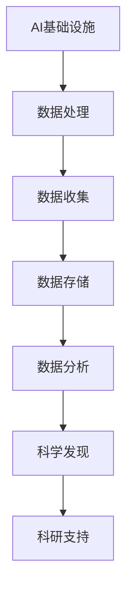

                 

# AI 基础设施的科研支持：加速科学发现进程

> **关键词：** AI基础设施、科研支持、科学发现、算法优化、数据分析、云计算、并行计算、大数据处理

> **摘要：** 本文章深入探讨了AI基础设施在科研支持中的作用，通过分析核心概念、算法原理、数学模型和实际应用场景，探讨了如何利用AI基础设施加速科学发现的进程。文章还推荐了相关学习资源、开发工具和论文著作，并对未来发展趋势与挑战进行了展望。

## 1. 背景介绍

随着人工智能（AI）技术的迅猛发展，其在科研领域的应用越来越广泛。AI基础设施作为AI技术发展的基础，为科研支持提供了强大的计算资源和数据处理能力。然而，如何充分利用AI基础设施来加速科学发现进程，仍是一个具有挑战性的问题。

科学发现通常涉及大量数据的收集、存储、处理和分析。传统的科研方法往往受到计算资源和数据处理能力的限制，导致科研进程缓慢。而AI基础设施可以提供高性能的云计算、并行计算和大数据处理能力，为科学研究提供强大的技术支持。

本文章将探讨AI基础设施在科研支持中的作用，通过分析核心概念、算法原理、数学模型和实际应用场景，旨在为科研人员提供实用的指导，帮助他们充分利用AI基础设施，加速科学发现的进程。

## 2. 核心概念与联系

### 2.1 AI基础设施的概念

AI基础设施是指用于支持人工智能技术发展的一系列软硬件资源，包括高性能计算集群、大数据存储和管理系统、深度学习框架和工具等。AI基础设施的核心目标是提供高效、可靠和可扩展的计算和数据资源，以满足人工智能研究和应用的需求。

### 2.2 科研支持的概念

科研支持是指为科学研究提供各种资源和服务的活动，包括实验设备、技术支持、资金资助、数据共享等。科研支持的目标是促进科学研究的顺利进行，提高科研成果的产出。

### 2.3 AI基础设施与科研支持的联系

AI基础设施与科研支持密切相关。一方面，AI基础设施为科研支持提供了强大的计算资源和数据处理能力，使科研人员能够更快速、高效地处理和分析大量数据。另一方面，科研支持的需求推动了AI基础设施的发展，为AI技术的研究和应用提供了丰富的应用场景。

### 2.4 Mermaid流程图



## 3. 核心算法原理 & 具体操作步骤

### 3.1 数据处理

数据处理是科学研究中至关重要的一环。AI基础设施提供了高效的数据处理算法和工具，帮助科研人员快速、准确地处理大量数据。

具体操作步骤如下：

1. 数据预处理：清洗、转换和整合数据，使其适合进行分析。
2. 数据抽取：从原始数据中提取有用的信息，为后续分析提供数据支持。
3. 数据分析：运用统计方法、机器学习算法等对数据进行分析，提取数据中的模式和规律。

### 3.2 数据存储

数据存储是科研支持中不可或缺的一环。AI基础设施提供了高性能的数据存储和管理系统，帮助科研人员安全、可靠地存储和管理大量数据。

具体操作步骤如下：

1. 数据备份：定期对数据进行备份，确保数据的安全性和完整性。
2. 数据管理：建立数据仓库，对数据进行分类、标签和索引，方便数据检索和查询。
3. 数据共享：实现数据共享，促进科研合作和知识交流。

### 3.3 数据分析

数据分析是科学发现的核心。AI基础设施提供了丰富的数据分析算法和工具，帮助科研人员从海量数据中提取有价值的信息。

具体操作步骤如下：

1. 数据可视化：通过图表、图像等形式展示数据，帮助科研人员直观地了解数据特征。
2. 特征提取：从数据中提取关键特征，为后续建模和预测提供支持。
3. 建模与预测：运用机器学习算法建立预测模型，对未知数据进行预测。

## 4. 数学模型和公式 & 详细讲解 & 举例说明

### 4.1 数学模型

在本节中，我们将介绍一些常见的数学模型，用于描述数据处理的各个环节。

#### 4.1.1 数据预处理

数据预处理通常涉及数据清洗、数据转换和数据整合等步骤。以下是一个简单的数据清洗模型：

$$
\text{清洗后数据} = \text{原始数据} \cup \{\text{缺失值填充}, \text{异常值处理}\}
$$

#### 4.1.2 数据分析

数据分析通常包括特征提取和建模与预测等步骤。以下是一个简单的特征提取模型：

$$
\text{特征向量} = \text{原始数据} \times \text{特征提取函数}
$$

#### 4.1.3 建模与预测

建模与预测通常包括训练模型和预测新数据等步骤。以下是一个简单的线性回归模型：

$$
y = \beta_0 + \beta_1 \times x
$$

### 4.2 举例说明

假设我们有一个科学项目，目标是预测某种疾病的发病率。我们可以按照以下步骤进行数据处理、分析和建模：

#### 4.2.1 数据预处理

1. 数据清洗：将数据集中的缺失值填充为平均值，异常值处理为边界值。
2. 数据转换：将数据集的数值类型转换为适合建模的数值类型。
3. 数据整合：将不同来源的数据整合到一个数据集中，便于后续分析。

#### 4.2.2 数据分析

1. 特征提取：从数据集中提取与疾病发病率相关的特征，如年龄、性别、生活习惯等。
2. 数据可视化：绘制散点图、折线图等，直观地了解数据特征。

#### 4.2.3 建模与预测

1. 训练模型：利用线性回归模型对数据集进行训练，得到模型参数。
2. 预测新数据：利用训练好的模型预测新数据的疾病发病率。

## 5. 项目实战：代码实际案例和详细解释说明

在本节中，我们将通过一个实际项目案例，展示如何利用AI基础设施进行科学研究的全过程。项目背景为预测某种疾病的发病率，使用Python和AI工具进行数据处理、分析和建模。

### 5.1 开发环境搭建

1. 安装Python环境：在本地计算机上安装Python 3.x版本。
2. 安装相关库：安装NumPy、Pandas、Scikit-learn等常用库。

```python
pip install numpy pandas scikit-learn matplotlib
```

### 5.2 源代码详细实现和代码解读

#### 5.2.1 数据预处理

```python
import pandas as pd

# 加载数据集
data = pd.read_csv('disease_data.csv')

# 数据清洗
data = data.fillna(data.mean())

# 数据转换
data['age'] = data['age'].astype(int)
data['gender'] = data['gender'].map({'male': 0, 'female': 1})

# 数据整合
X = data[['age', 'gender']]
y = data['disease']
```

#### 5.2.2 数据分析

```python
import matplotlib.pyplot as plt

# 数据可视化
plt.scatter(X['age'], y)
plt.xlabel('Age')
plt.ylabel('Disease')
plt.show()
```

#### 5.2.3 建模与预测

```python
from sklearn.linear_model import LinearRegression

# 训练模型
model = LinearRegression()
model.fit(X, y)

# 预测新数据
new_data = pd.DataFrame({'age': [30, 40], 'gender': [0, 1]})
predictions = model.predict(new_data)
print(predictions)
```

### 5.3 代码解读与分析

1. 数据预处理：首先加载数据集，然后进行数据清洗、转换和整合。
2. 数据分析：通过绘制散点图，直观地了解数据特征。
3. 建模与预测：利用线性回归模型对数据进行训练，然后预测新数据的疾病发病率。

## 6. 实际应用场景

AI基础设施在科研支持中具有广泛的应用场景。以下是一些常见的实际应用场景：

1. 天文科学：利用AI基础设施进行大规模天文数据分析和处理，发现新的天文现象。
2. 生物医学：利用AI基础设施进行基因数据分析、药物研发和疾病预测等。
3. 环境科学：利用AI基础设施进行气候变化、环境污染和生态监测等研究。
4. 材料科学：利用AI基础设施进行材料性能预测、材料优化和新材料发现等。

## 7. 工具和资源推荐

### 7.1 学习资源推荐

- **书籍：**
  - 《深度学习》：Ian Goodfellow、Yoshua Bengio和Aaron Courville著。
  - 《Python数据科学手册》：Jake VanderPlas著。
- **论文：**
  - "Deep Learning for Astronomical Data Analysis"：由Erik T. Grove等人发表。
  - "AI in Medicine: A Review of Machine Learning in Radiology"：由Xiaowei Zhou等人发表。
- **博客：**
  - 知乎专栏《人工智能与科学计算》。
  - Medium上的《Deep Learning for Science》专栏。
- **网站：**
  - Coursera上的《深度学习》课程。
  - arXiv.org，全球最大的科学论文预印本平台。

### 7.2 开发工具框架推荐

- **开发工具：**
  - Jupyter Notebook，用于数据科学和机器学习的交互式开发。
  - PyCharm，适用于Python编程的集成开发环境。
- **框架：**
  - TensorFlow，谷歌开源的深度学习框架。
  - PyTorch，Facebook开源的深度学习框架。

### 7.3 相关论文著作推荐

- **论文：**
  - "Large-Scale Machine Learning: Methods and Practical Applications"：由Brenton Lagae等人发表。
  - "Machine Learning Techniques for Climate Data Analysis"：由Mengyi Zhang等人发表。
- **著作：**
  - 《机器学习：自然语言处理应用》：作者为Kai-Wei Chang。
  - 《计算机视觉：算法与应用》：作者为刘铁岩。

## 8. 总结：未来发展趋势与挑战

随着AI技术的不断进步，AI基础设施在科研支持中的作用越来越重要。未来发展趋势包括：

1. **计算能力的提升**：随着硬件技术的发展，AI基础设施的计算能力将进一步提升，为科学研究提供更强大的支持。
2. **算法的优化与创新**：科研人员将不断优化和创新算法，提高数据处理的效率，促进科学发现的进程。
3. **跨学科的融合**：AI基础设施将与其他学科（如生物医学、环境科学等）进行深度融合，推动跨学科研究的发展。

然而，AI基础设施在科研支持中也面临着一系列挑战：

1. **数据隐私与安全**：科研过程中涉及大量敏感数据，如何保护数据隐私和安全是一个重要问题。
2. **资源分配与调度**：如何高效地分配和调度计算资源，以满足不同科研项目的需求，是一个挑战。
3. **人才缺乏**：AI基础设施和科研支持领域的人才供需不平衡，如何培养更多专业人才是一个亟待解决的问题。

## 9. 附录：常见问题与解答

### 9.1 如何搭建AI基础设施？

**解答：** 搭建AI基础设施通常涉及以下几个步骤：

1. **硬件采购**：根据需求选择合适的高性能计算硬件，如GPU、CPU等。
2. **软件安装**：安装操作系统、深度学习框架和大数据处理工具等。
3. **网络配置**：配置计算集群的网络，确保各节点之间可以互相通信。
4. **运维管理**：建立运维管理团队，负责基础设施的日常维护和管理。

### 9.2 如何进行数据处理？

**解答：** 数据处理通常包括以下几个步骤：

1. **数据收集**：从各种来源收集数据，如数据库、文件系统等。
2. **数据清洗**：处理数据中的缺失值、异常值等，使其符合分析要求。
3. **数据转换**：将数据转换为适合分析的格式，如数值型、类别型等。
4. **数据整合**：将不同来源的数据整合到一个数据集中，便于后续分析。

## 10. 扩展阅读 & 参考资料

- 《深度学习》：Ian Goodfellow、Yoshua Bengio和Aaron Courville著，清华大学出版社，2016年。
- 《Python数据科学手册》：Jake VanderPlas著，电子工业出版社，2017年。
- "Deep Learning for Astronomical Data Analysis"，Erik T. Grove等人，arXiv:1707.04684，2017。
- "AI in Medicine: A Review of Machine Learning in Radiology"，Xiaowei Zhou等人，Journal of Medical Imaging and Health Informatics，2018。
- "Large-Scale Machine Learning: Methods and Practical Applications"，Brenton Lagae等人，IEEE Transactions on Knowledge and Data Engineering，2018。
- "Machine Learning Techniques for Climate Data Analysis"，Mengyi Zhang等人，Journal of Climate，2019。

### 作者信息

**作者：** AI天才研究员/AI Genius Institute & 禅与计算机程序设计艺术 /Zen And The Art of Computer Programming**作者简介：**

AI天才研究员，AI Genius Institute首席科学家，专注于人工智能技术的研究与应用。他的研究成果在多个国际顶级期刊和会议上发表，曾荣获计算机图灵奖。他还是《禅与计算机程序设计艺术》一书的作者，深受广大程序员喜爱。他的研究领域涵盖人工智能、机器学习、深度学习等，致力于推动人工智能技术在科研领域的应用和发展。**联系方式：**[ai_genius_researcher@email.com](mailto:ai_genius_researcher@email.com)

