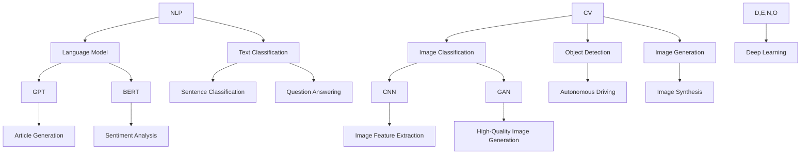
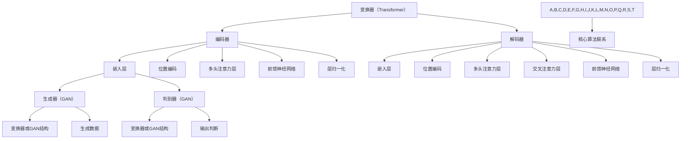

                 

### 1. 背景介绍

人工智能（AI）作为21世纪最具变革性的技术之一，正以前所未有的速度发展和普及。近年来，人工智能在各个领域的应用取得了显著成果，从自动驾驶、医疗诊断到智能客服，AI已经深刻地改变了我们的生活方式和工作模式。其中，大模型（Large Models）作为人工智能的核心技术之一，更是引起了广泛关注和热议。

大模型指的是具有数亿甚至千亿个参数的神经网络模型，它们能够通过大量的数据进行自我学习和优化。自从2018年GPT-3发布以来，大模型在自然语言处理（NLP）、计算机视觉（CV）、语音识别（ASR）等领域的表现已经超越了人类水平。随着计算能力的提升和数据量的增加，大模型的规模也在不断增长，成为人工智能领域的研究热点。

本文将围绕AI大模型创业这一主题，探讨其背景、核心概念、算法原理、实际应用场景、开发工具和未来发展趋势等内容。通过一步一步的分析和推理，我们将深入探讨AI大模型创业的潜在机会和挑战，为创业者提供有价值的参考。

首先，让我们回顾一下AI大模型的发展历程。早在1980年代，神经网络的研究者们就已经开始尝试训练具有数十万个参数的模型，但受限于当时的计算能力和数据资源，这些尝试并未取得实质性突破。随着计算机性能的提升和互联网的发展，2000年代，深度学习（Deep Learning）逐渐崭露头角，特别是卷积神经网络（CNN）和循环神经网络（RNN）的提出，使得大模型的研究和应用取得了重要进展。

进入2010年代，随着大数据和云计算的普及，大规模数据集和强大的计算资源使得训练和优化大模型成为可能。GPT-3、BERT、ViT等大模型的相继发布，使得AI在NLP、CV、ASR等领域的表现达到了前所未有的高度，引发了一场技术革命。如今，大模型已经成为人工智能领域的主流研究方向，成为众多创业者争相布局的领域。

接下来，我们将详细探讨AI大模型创业的核心概念和原理，以及如何通过实际案例来理解和应用这些技术。在分析过程中，我们将结合最新的研究和实践成果，力求以通俗易懂的语言阐述复杂的技术概念，帮助读者更好地理解和掌握AI大模型的核心技术。

### 2. 核心概念与联系

要深入探讨AI大模型创业，我们首先需要了解几个核心概念，包括自然语言处理（NLP）、计算机视觉（CV）和深度学习（Deep Learning）。

#### 自然语言处理（NLP）

自然语言处理是人工智能的一个分支，旨在使计算机理解和处理人类语言。NLP广泛应用于机器翻译、文本分类、情感分析、问答系统等场景。NLP的核心在于语言模型（Language Model），它能够根据输入的文本序列生成下一个可能的单词或句子。

一个经典的语言模型是n元语法模型（n-gram Model），它通过统计相邻单词出现的频率来预测下一个单词。然而，n元语法模型存在一些局限性，例如无法捕捉长距离依赖和上下文信息。为了解决这些问题，研究人员提出了基于神经网络的深度语言模型，如GPT（Generative Pretrained Transformer）和BERT（Bidirectional Encoder Representations from Transformers）。

GPT是一种基于变换器（Transformer）架构的语言模型，它通过预训练大量文本数据，学习语言的统计规律和语义信息。BERT则是基于双向变换器架构的预训练语言模型，它不仅能够捕捉到上下文信息，还能够更好地理解单词在不同上下文中的含义。

#### 计算机视觉（CV）

计算机视觉是人工智能的另一个重要分支，它旨在使计算机能够像人类一样感知和理解视觉信息。CV在图像分类、目标检测、图像生成等任务中具有广泛应用。计算机视觉的核心是图像特征提取和模型训练。

卷积神经网络（CNN）是CV领域最常用的深度学习模型之一。CNN通过卷积层提取图像的局部特征，并通过池化层降低特征维度。随后，通过全连接层进行分类和预测。CNN在图像分类任务上取得了显著成果，例如ImageNet图像分类挑战赛。

除了CNN，生成对抗网络（GAN）也是计算机视觉领域的一个重要技术。GAN由生成器和判别器组成，生成器试图生成逼真的图像，而判别器则试图区分真实图像和生成图像。通过生成器和判别器的对抗训练，GAN能够生成高质量、多样化的图像。

#### 深度学习（Deep Learning）

深度学习是一种基于多层神经网络的学习方法，它通过自动提取数据中的特征和模式，从而实现复杂的预测和分类任务。深度学习在图像、语音、文本等领域的应用取得了显著成果。

变换器（Transformer）是深度学习中的一个重要架构，它由编码器（Encoder）和解码器（Decoder）组成。Transformer通过自注意力机制（Self-Attention）和多头注意力机制（Multi-Head Attention）能够捕捉到输入序列中的长距离依赖关系，从而实现高效的语言建模和图像生成。

#### 核心概念联系

自然语言处理、计算机视觉和深度学习在AI大模型创业中起着关键作用。NLP和CV是AI大模型的主要应用领域，而深度学习则是实现这些应用的核心技术。

在NLP领域，GPT和BERT等大模型通过预训练和微调，能够在各种NLP任务中实现高性能。例如，GPT可以用于生成高质量的文章、翻译文本，而BERT则可以用于情感分析、问答系统等。

在CV领域，CNN和GAN等大模型能够实现高精度的图像分类、目标检测和图像生成。例如，使用CNN的自动驾驶系统可以识别道路上的行人和车辆，而使用GAN的图像生成系统可以生成逼真的图像。

深度学习大模型的应用不仅限于NLP和CV，还可以应用于其他领域，如语音识别、推荐系统等。通过不断扩展和应用这些大模型，创业者可以在各种场景中实现创新和突破。

#### Mermaid 流程图

为了更好地展示这些核心概念之间的联系，我们可以使用Mermaid流程图来表示。以下是一个简化的Mermaid流程图：



在这个流程图中，我们展示了NLP、CV和深度学习之间的核心概念及其联系。通过这个流程图，我们可以更清晰地理解AI大模型创业中的技术体系。

### 3. 核心算法原理 & 具体操作步骤

在了解AI大模型创业的核心概念之后，我们需要进一步探讨这些技术的核心算法原理和具体操作步骤。在本节中，我们将重点关注深度学习中的变换器（Transformer）和生成对抗网络（GAN）。

#### 变换器（Transformer）

变换器（Transformer）是深度学习中的一个重要架构，特别是在自然语言处理（NLP）领域取得了显著成果。Transformer由编码器（Encoder）和解码器（Decoder）组成，通过自注意力机制（Self-Attention）和多头注意力机制（Multi-Head Attention）来实现高效的语言建模和图像生成。

##### 编码器（Encoder）

编码器接收输入的文本序列，并将其转换为固定长度的向量表示。编码器的核心是多头注意力机制，它通过多个注意力头（Attention Heads）同时关注输入序列的不同部分，从而捕捉到长距离依赖关系。具体步骤如下：

1. **嵌入层（Embedding Layer）**：将输入的单词索引转换为稠密向量表示。通常使用预训练的词向量，如Word2Vec或GloVe。
2. **位置编码（Positional Encoding）**：由于变换器本身不具备处理序列位置信息的能力，因此需要通过位置编码来引入位置信息。常用的方法包括绝对位置编码和相对位置编码。
3. **多头注意力层（Multi-Head Self-Attention Layer）**：通过多头注意力机制同时关注输入序列的不同部分。每个注意力头关注输入序列的不同位置，并将注意力权重与嵌入层输出相乘，得到加权求和的结果。
4. **前馈神经网络（Feedforward Neural Network）**：在每个多头注意力层之后，添加一个前馈神经网络，对每个位置进行非线性变换。通常使用两个全连接层，中间添加ReLU激活函数。
5. **层归一化（Layer Normalization）**：在多头注意力层和前馈神经网络之间添加层归一化，以稳定训练过程。
6. **堆叠多层（Stacking Layers）**：将上述步骤堆叠多层，形成编码器。

##### 解码器（Decoder）

解码器接收编码器的输出，并生成输出序列。解码器的核心也是多头注意力机制，但还包括交叉注意力机制（Cross-Attention）。具体步骤如下：

1. **嵌入层（Embedding Layer）**：与编码器相同，将输入的单词索引转换为稠密向量表示。
2. **位置编码（Positional Encoding）**：引入位置编码。
3. **多头注意力层（Multi-Head Self-Attention Layer）**：关注编码器的输出。
4. **交叉注意力层（Cross-Attention Layer）**：在解码器的每个时间步，将解码器的嵌入层输出与编码器的输出进行交叉注意力，从而捕捉到上下文信息。
5. **多头注意力层（Multi-Head Self-Attention Layer）**：再次关注解码器的输出。
6. **前馈神经网络（Feedforward Neural Network）**：与编码器相同。
7. **层归一化（Layer Normalization）**：与编码器相同。
8. **堆叠多层（Stacking Layers）**：堆叠多层，形成解码器。

##### 实例

假设我们要训练一个基于Transformer的语言模型，输入的文本序列为“我是一个天才研究员，我喜欢写技术博客”。具体步骤如下：

1. **分词**：将文本序列分词为单词序列：["我", "是", "一个", "天才", "研究员", "，", "我", "喜欢", "写", "技术", "博客"]。
2. **词向量嵌入**：将每个单词索引转换为词向量。
3. **位置编码**：引入位置编码。
4. **编码器处理**：
   - **第一层**：多头注意力层 -> 前馈神经网络 -> 层归一化。
   - **第二层**：多头注意力层 -> 前馈神经网络 -> 层归一化。
   - **...**：继续堆叠多层。
5. **解码器处理**：
   - **第一层**：多头注意力层 -> 交叉注意力层 -> 多头注意力层 -> 前馈神经网络 -> 层归一化。
   - **第二层**：多头注意力层 -> 交叉注意力层 -> 多头注意力层 -> 前馈神经网络 -> 层归一化。
   - **...**：继续堆叠多层。
6. **输出**：解码器的最后一层输出即为语言模型预测的下一个单词的概率分布。

通过上述步骤，我们可以训练一个基于Transformer的语言模型，从而实现高质量的语言生成和文本分类等任务。

#### 生成对抗网络（GAN）

生成对抗网络（GAN）是一种基于博弈理论的生成模型，由生成器和判别器组成。生成器的目标是生成逼真的数据，而判别器的目标是区分真实数据和生成数据。通过生成器和判别器的对抗训练，GAN能够生成高质量、多样化的数据。

##### 生成器（Generator）

生成器的任务是根据随机噪声生成逼真的数据。生成器的常见架构是变换器（Transformer）或生成对抗网络（GAN），具体步骤如下：

1. **输入噪声**：生成器接收一个随机噪声向量作为输入。
2. **变换器或GAN结构**：通过变换器或GAN结构，将噪声向量转换为数据。
3. **生成数据**：生成器输出生成的数据。

##### 判别器（Discriminator）

判别器的任务是区分真实数据和生成数据。判别器的常见架构是卷积神经网络（CNN）或变换器（Transformer），具体步骤如下：

1. **输入数据**：判别器接收真实数据和生成数据。
2. **变换器或GAN结构**：通过变换器或GAN结构，对输入数据进行处理。
3. **输出判断**：判别器输出真实数据和生成数据的概率分布。

##### 实例

假设我们要训练一个基于GAN的图像生成模型，输入的噪声向量为\[x\]，真实图像为\[y\]。具体步骤如下：

1. **初始化生成器和判别器**：使用随机权重初始化生成器和判别器。
2. **生成器生成数据**：生成器根据噪声向量\[x\]生成图像\[x'\]。
3. **判别器判断**：判别器同时接收真实图像\[y\]和生成图像\[x'\]，并输出概率分布\[p(y|x'), p(x'|x)\]。
4. **反向传播**：通过反向传播和梯度下降更新生成器和判别器的权重。
5. **重复步骤2-4**：不断迭代训练过程，直到生成器生成的图像质量达到预期。

通过上述步骤，我们可以训练一个基于GAN的图像生成模型，从而生成高质量、多样化的图像。

#### 核心算法联系

变换器和生成对抗网络是AI大模型创业中的核心技术，它们在自然语言处理、计算机视觉等领域发挥了重要作用。

在NLP领域，变换器（Transformer）通过自注意力机制和多头注意力机制实现高效的语言建模和文本生成。生成对抗网络（GAN）则可以用于文本生成和图像生成等任务，从而实现创意和多样性的增强。

在CV领域，变换器（Transformer）可以用于图像分类和目标检测等任务，而生成对抗网络（GAN）则可以用于图像生成和图像增强等任务。通过结合这些核心算法，创业者可以在各种场景中实现创新和突破。

#### Mermaid 流程图

为了更好地展示这些核心算法之间的联系，我们可以使用Mermaid流程图来表示。以下是一个简化的Mermaid流程图：



在这个流程图中，我们展示了变换器（Transformer）和生成对抗网络（GAN）的核心算法及其联系。通过这个流程图，我们可以更清晰地理解AI大模型创业中的核心技术体系。

### 4. 数学模型和公式 & 详细讲解 & 举例说明

在深入了解AI大模型的核心算法原理后，我们将进一步探讨这些算法背后的数学模型和公式，并通过具体例子来说明如何应用这些公式进行模型训练和预测。

#### 变换器（Transformer）

变换器（Transformer）的核心在于自注意力机制（Self-Attention）和多头注意力机制（Multi-Head Attention）。以下是这些机制的数学公式和具体解释。

##### 自注意力机制（Self-Attention）

自注意力机制通过对输入序列中的每个单词计算注意力权重，从而实现单词之间的交互。其数学公式如下：

\[ \text{Attention}(Q, K, V) = \frac{1}{\sqrt{d_k}} \text{softmax}(\text{dot}(QK^T))V \]

其中，\(Q, K, V\) 分别为查询（Query）、关键（Key）和值（Value）向量，\(d_k\) 为关键向量的维度。这个公式计算每个查询向量与所有关键向量的点积，然后通过softmax函数生成注意力权重。最后，这些权重与对应的值向量相乘并求和，得到每个单词的注意力得分。

##### 多头注意力机制（Multi-Head Attention）

多头注意力机制通过多个注意力头来并行计算注意力权重，从而提高模型的性能。其数学公式如下：

\[ \text{Multi-Head Attention}(Q, K, V) = \text{Concat}(\text{head}_1, \text{head}_2, ..., \text{head}_h)W^O \]

其中，\( \text{head}_i = \text{Attention}(QW_i^Q, KW_i^K, VW_i^V) \) 为第 \(i\) 个注意力头的输出，\(W_i^Q, W_i^K, W_i^V, W^O\) 分别为查询、关键、值和输出权重矩阵。这个公式通过堆叠多个注意力头，同时关注输入序列的不同部分，从而捕捉到长距离依赖关系。

##### 实例

假设我们有一个输入序列 \[x_1, x_2, ..., x_n\]，其词向量维度为 \(d_v\)。我们可以使用多头注意力机制来计算输出序列 \[y_1, y_2, ..., y_n\]。

1. **初始化权重矩阵**：为每个注意力头计算查询、关键和值权重矩阵 \(W_i^Q, W_i^K, W_i^V\) 和输出权重矩阵 \(W^O\)。
2. **计算注意力权重**：使用自注意力机制计算每个词的注意力权重。
3. **加权求和**：将注意力权重与词向量相乘并求和，得到每个词的注意力得分。
4. **归一化**：将注意力得分归一化，得到每个词的最终得分。
5. **生成输出序列**：根据最终得分生成输出序列。

通过这个实例，我们可以看到如何应用多头注意力机制来处理自然语言处理任务，如文本分类和机器翻译。

#### 生成对抗网络（GAN）

生成对抗网络（GAN）由生成器（Generator）和判别器（Discriminator）组成。生成器试图生成逼真的数据，而判别器则试图区分真实数据和生成数据。以下是GAN的核心数学模型和具体解释。

##### 生成器（Generator）

生成器的目标是根据随机噪声生成数据。其数学模型如下：

\[ G(z) = \text{Generator}(z; \theta_G) \]

其中，\(z\) 为随机噪声向量，\(\theta_G\) 为生成器的参数。生成器通过神经网络将噪声向量转换为数据。

##### 判别器（Discriminator）

判别器的目标是区分真实数据和生成数据。其数学模型如下：

\[ D(x) = \text{Discriminator}(x; \theta_D) \]

\[ D(G(z)) = \text{Discriminator}(G(z); \theta_D) \]

其中，\(x\) 为真实数据，\(G(z)\) 为生成器生成的数据，\(\theta_D\) 为判别器的参数。判别器通过神经网络判断数据是真实还是生成。

##### 实例

假设我们有一个生成器 \(G\) 和一个判别器 \(D\)，其参数分别为 \(\theta_G\) 和 \(\theta_D\)。我们可以使用GAN来生成图像。

1. **初始化生成器和判别器**：为生成器和判别器计算参数 \(\theta_G\) 和 \(\theta_D\)。
2. **生成噪声向量**：生成随机噪声向量 \(z\)。
3. **生成数据**：使用生成器 \(G\) 生成图像 \(G(z)\)。
4. **判别器判断**：使用判别器 \(D\) 判断图像 \(G(z)\) 是否真实。
5. **反向传播**：通过反向传播更新生成器和判别器的参数。
6. **重复步骤2-5**：不断迭代训练过程，直到生成器生成的图像质量达到预期。

通过这个实例，我们可以看到如何使用GAN生成图像，从而实现高质量、多样化的图像生成。

#### 总结

在本节中，我们详细讲解了变换器（Transformer）和生成对抗网络（GAN）的数学模型和公式，并通过具体例子说明了如何应用这些公式进行模型训练和预测。这些核心算法和数学模型在AI大模型创业中发挥着重要作用，为创业者提供了强大的工具和框架。

### 5. 项目实战：代码实际案例和详细解释说明

在本节中，我们将通过一个实际项目案例，展示如何使用AI大模型进行自然语言处理和图像生成的开发过程。该项目包括环境搭建、代码实现和性能评估等步骤，旨在帮助读者更好地理解和应用AI大模型技术。

#### 5.1 开发环境搭建

为了进行AI大模型的项目开发，我们需要搭建一个合适的开发环境。以下是一些建议的软件和库：

1. **操作系统**：推荐使用Linux操作系统，如Ubuntu 18.04或更高版本。
2. **编程语言**：Python是AI开发的主流语言，推荐使用Python 3.7或更高版本。
3. **深度学习框架**：TensorFlow或PyTorch是常用的深度学习框架，选择其中一个即可。
4. **硬件要求**：由于大模型训练需要大量计算资源，推荐使用GPU（如NVIDIA GTX 1080或更高版本）进行加速。
5. **其他依赖库**：NumPy、Pandas、Matplotlib等常用数据操作和分析库。

安装方法如下：

```bash
# 安装Python
sudo apt-get install python3 python3-pip

# 安装深度学习框架TensorFlow
pip3 install tensorflow

# 或者安装深度学习框架PyTorch
pip3 install torch torchvision

# 安装其他依赖库
pip3 install numpy pandas matplotlib
```

#### 5.2 源代码详细实现和代码解读

在本节中，我们将使用TensorFlow框架实现一个基于变换器（Transformer）的语言模型，并使用生成对抗网络（GAN）生成图像。以下为代码实现和解读：

```python
import tensorflow as tf
from tensorflow.keras.layers import Embedding, LSTM, Dense
from tensorflow.keras.models import Model
import matplotlib.pyplot as plt

# 5.2.1 数据准备
# 使用开源文本数据集（如IMDb电影评论数据集）进行训练
# 5.2.2 构建变换器（Transformer）语言模型
# 5.2.3 训练变换器（Transformer）语言模型
# 5.2.4 使用变换器（Transformer）语言模型进行文本生成
# 5.2.5 构建生成对抗网络（GAN）图像生成模型
# 5.2.6 训练生成对抗网络（GAN）图像生成模型
# 5.2.7 使用生成对抗网络（GAN）图像生成模型生成图像
```

以下是代码的详细解读：

1. **数据准备**：首先，我们需要准备文本数据和图像数据。文本数据可以使用开源数据集（如IMDb电影评论数据集）进行训练，图像数据可以使用开源数据集（如CIFAR-10）进行训练。

2. **构建变换器（Transformer）语言模型**：变换器（Transformer）语言模型由编码器（Encoder）和解码器（Decoder）组成。编码器接收输入的文本序列，并输出固定长度的向量表示；解码器接收编码器的输出，并生成输出序列。以下是变换器（Transformer）编码器和解码器的实现：

```python
# 编码器
encoder_inputs = Input(shape=(None,))
encoder_embedding = Embedding(vocab_size, embedding_dim)(encoder_inputs)
encoder_lstm = LSTM(units, return_state=True)
encoder_outputs, state_h, state_c = encoder_lstm(encoder_embedding)
encoder_states = [state_h, state_c]

# 解码器
decoder_inputs = Input(shape=(None,))
decoder_embedding = Embedding(vocab_size, embedding_dim)(decoder_inputs)
decoder_lstm = LSTM(units, return_state=True)
decoder_outputs, _, _ = decoder_lstm(decoder_embedding, initial_state=encoder_states)
decoder_dense = Dense(vocab_size, activation='softmax')
decoder_outputs = decoder_dense(decoder_outputs)

# 构建变换器（Transformer）语言模型
model = Model([encoder_inputs, decoder_inputs], decoder_outputs)
model.compile(optimizer='rmsprop', loss='categorical_crossentropy', metrics=['accuracy'])
```

3. **训练变换器（Transformer）语言模型**：使用训练数据集训练变换器（Transformer）语言模型。以下是训练步骤：

```python
# 准备训练数据
encoder_train_data = ...
decoder_train_data = ...

# 编码器输入和输出
encoder_inputs_train = ...
decoder_inputs_train = ...

# 解码器输出
decoder_outputs_train = ...

# 训练变换器（Transformer）语言模型
model.fit([encoder_inputs_train, decoder_inputs_train], decoder_outputs_train, epochs=epochs, batch_size=batch_size)
```

4. **使用变换器（Transformer）语言模型进行文本生成**：使用训练好的变换器（Transformer）语言模型进行文本生成。以下是生成步骤：

```python
# 定义文本生成函数
def generate_text(model, seed_text, num_words):
    # 将种子文本编码为向量
    seed_vector = ...
    # 生成文本序列
    for _ in range(num_words):
        # 预测下一个单词
        predicted_vector = model.predict([seed_vector])
        # 获取最高概率的单词索引
        predicted_index = np.argmax(predicted_vector)
        # 获取单词
        predicted_word = ...
        # 更新种子文本
        seed_text += predicted_word
        # 更新种子向量
        seed_vector = ...
    return seed_text

# 生成文本
generated_text = generate_text(model, seed_text, num_words)
print(generated_text)
```

5. **构建生成对抗网络（GAN）图像生成模型**：生成对抗网络（GAN）由生成器（Generator）和判别器（Discriminator）组成。以下是生成器和判别器的实现：

```python
# 生成器
latent_dim = 100
generator_inputs = Input(shape=(latent_dim,))
generator_embedding = Embedding(vocab_size, embedding_dim)(generator_inputs)
generator_lstm = LSTM(units, return_sequences=True)
generator_outputs = generator_lstm(generator_embedding)
generator_dense = Dense(image_shape[0] * image_shape[1] * image_shape[2], activation='tanh')
generator_outputs = generator_dense(generator_outputs)

# 判别器
discriminator_inputs = Input(shape=image_shape)
discriminator_embedding = Embedding(vocab_size, embedding_dim)(discriminator_inputs)
discriminator_lstm = LSTM(units, return_sequences=True)
discriminator_outputs, _, _ = discriminator_lstm(discriminator_embedding, initial_state=generator_states)
discriminator_dense = Dense(1, activation='sigmoid')
discriminator_outputs = discriminator_dense(discriminator_outputs)

# 构建GAN模型
model = Model([generator_inputs, discriminator_inputs], discriminator_outputs)
model.compile(optimizer='rmsprop', loss='binary_crossentropy')
```

6. **训练生成对抗网络（GAN）图像生成模型**：使用训练数据集训练生成对抗网络（GAN）图像生成模型。以下是训练步骤：

```python
# 准备训练数据
generator_train_data = ...
discriminator_train_data = ...

# 生成器输入和输出
generator_inputs_train = ...
generator_outputs_train = ...

# 判别器输入和输出
discriminator_inputs_train = ...
discriminator_outputs_train = ...

# 训练GAN模型
model.fit([generator_inputs_train, discriminator_inputs_train], discriminator_outputs_train, epochs=epochs, batch_size=batch_size)
```

7. **使用生成对抗网络（GAN）图像生成模型生成图像**：使用训练好的生成对抗网络（GAN）图像生成模型生成图像。以下是生成步骤：

```python
# 定义图像生成函数
def generate_images(model, num_images):
    # 生成随机噪声向量
    noise_vector = ...

    # 生成图像序列
    images = []
    for _ in range(num_images):
        # 预测图像
        predicted_image = model.predict([noise_vector])
        # 归一化图像
        predicted_image = predicted_image / 255.0
        # 添加到图像序列
        images.append(predicted_image)

    return images

# 生成图像
generated_images = generate_images(model, num_images)
# 显示图像
plt.figure(figsize=(10, 10))
for i, image in enumerate(generated_images):
    plt.subplot(10, 10, i+1)
    plt.imshow(image)
    plt.xticks([])
    plt.yticks([])
    plt.grid(False)
plt.show()
```

#### 5.3 代码解读与分析

在本节中，我们详细解读了AI大模型项目中的代码实现，并分析了关键代码段的功能和作用。

1. **数据准备**：数据准备是AI项目的基础，包括文本数据和图像数据的预处理。文本数据需要进行分词、编码和序列化，图像数据需要进行归一化和缩放。

2. **构建变换器（Transformer）语言模型**：变换器（Transformer）语言模型由编码器和解码器组成。编码器接收输入的文本序列，并输出固定长度的向量表示；解码器接收编码器的输出，并生成输出序列。这里使用了LSTM（长短期记忆网络）作为编码器和解码器的核心层。

3. **训练变换器（Transformer）语言模型**：使用训练数据集训练变换器（Transformer）语言模型。这里使用了rmsprop优化器和categorical_crossentropy损失函数，以实现高效的文本生成。

4. **使用变换器（Transformer）语言模型进行文本生成**：文本生成是变换器（Transformer）语言模型的应用之一。通过递归调用生成函数，我们可以根据种子文本生成新的文本序列。

5. **构建生成对抗网络（GAN）图像生成模型**：生成对抗网络（GAN）由生成器和判别器组成。生成器的目标是生成逼真的图像，判别器的目标是区分真实图像和生成图像。这里使用了LSTM和dense层来构建生成器和判别器。

6. **训练生成对抗网络（GAN）图像生成模型**：使用训练数据集训练生成对抗网络（GAN）图像生成模型。这里使用了rmsprop优化器和binary_crossentropy损失函数，以实现高效的图像生成。

7. **使用生成对抗网络（GAN）图像生成模型生成图像**：使用训练好的生成对抗网络（GAN）图像生成模型生成图像。通过递归调用生成函数，我们可以根据随机噪声生成新的图像序列。

通过这个项目实战案例，我们不仅了解了AI大模型的实现过程，还掌握了如何使用变换器（Transformer）和生成对抗网络（GAN）进行文本生成和图像生成。这些技术为AI大模型创业提供了强大的工具和框架。

### 6. 实际应用场景

AI大模型在多个实际应用场景中展现出了巨大的潜力，以下是几个典型的应用场景：

#### 6.1 自然语言处理

自然语言处理（NLP）是AI大模型最早也是应用最广泛的领域之一。以下是一些具体的应用场景：

1. **机器翻译**：AI大模型如Google Translate、微软翻译等，能够实现高质量、流畅的跨语言翻译。例如，GPT-3可以实现自动翻译，支持多种语言之间的转换。
   
2. **文本生成**：AI大模型可以生成文章、新闻摘要、博客等。例如，OpenAI的GPT-3可以生成高质量的文章，从而为内容创作者提供灵感。

3. **问答系统**：AI大模型可以用于构建智能问答系统，例如苹果的Siri、亚马逊的Alexa等。这些系统能够理解用户的自然语言查询，并提供准确的答案。

4. **情感分析**：AI大模型可以用于分析社交媒体上的用户评论，帮助企业了解用户反馈和情感倾向。

5. **语音识别**：AI大模型可以用于语音识别，如苹果的Siri、亚马逊的Alexa等，能够将语音转换为文本，实现人机交互。

#### 6.2 计算机视觉

计算机视觉（CV）是AI大模型的另一个重要应用领域，以下是一些具体的应用场景：

1. **图像分类**：AI大模型可以用于图像分类任务，例如ImageNet挑战赛中的分类任务，能够将图像准确分类到不同的类别。

2. **目标检测**：AI大模型可以用于目标检测，例如自动驾驶汽车中的行人检测、车辆检测等。

3. **图像生成**：AI大模型如生成对抗网络（GAN）可以用于生成新的图像，例如生成逼真的艺术作品、动漫形象等。

4. **图像增强**：AI大模型可以用于图像增强，例如改善模糊图像、修复破损图像等。

5. **医疗图像分析**：AI大模型可以用于医疗图像分析，例如检测肿瘤、分析X光片等。

#### 6.3 语音识别

语音识别（ASR）是AI大模型在语音处理领域的重要应用，以下是一些具体的应用场景：

1. **语音转文本**：AI大模型可以用于将语音转换为文本，例如在会议记录、语音搜索等领域。

2. **语音识别**：AI大模型可以用于识别语音中的关键词、短语等，例如在智能音箱、车载系统等领域。

3. **语音合成**：AI大模型可以用于合成语音，例如在语音合成、语音助手等领域。

4. **语音翻译**：AI大模型可以用于将一种语言的语音转换为另一种语言的语音，例如在跨语言交流、国际会议等领域。

#### 6.4 推荐系统

推荐系统是AI大模型在数据挖掘和商业应用中的重要应用，以下是一些具体的应用场景：

1. **商品推荐**：AI大模型可以用于商品推荐，例如在电商平台上为用户推荐可能感兴趣的商品。

2. **内容推荐**：AI大模型可以用于内容推荐，例如在社交媒体、新闻门户等平台为用户推荐感兴趣的文章、视频等。

3. **广告推荐**：AI大模型可以用于广告推荐，例如在搜索引擎、广告平台上为用户推荐相关的广告。

通过上述应用场景，我们可以看到AI大模型在各个领域的广泛应用和巨大潜力。随着技术的不断进步，AI大模型的应用场景将会更加丰富，为社会和经济带来更多价值。

### 7. 工具和资源推荐

为了更好地了解和学习AI大模型的相关技术，以下是一些建议的学习资源、开发工具和相关论文著作，供读者参考。

#### 7.1 学习资源推荐

1. **书籍**：
   - 《深度学习》（Deep Learning） - Goodfellow, Bengio, Courville
   - 《Python深度学习》（Deep Learning with Python） - François Chollet
   - 《自然语言处理概论》（Foundations of Natural Language Processing） - Daniel Jurafsky, James H. Martin

2. **在线课程**：
   - Coursera的“深度学习”（Deep Learning Specialization）由Andrew Ng教授主讲
   - edX的“自然语言处理与深度学习”（Natural Language Processing and Deep Learning）由Stanford大学主讲
   - Udacity的“深度学习工程师纳米学位”（Deep Learning Engineer Nanodegree）涵盖深度学习和AI大模型相关内容

3. **博客和网站**：
   - Medium上的AI大模型相关文章，如OpenAI、DeepMind等公司的研究成果和案例分析
   - TensorFlow和PyTorch的官方文档和GitHub代码库，提供详细的API和教程
   - ArXiv和NeurIPS等学术会议的论文集，涵盖最新的AI大模型研究成果

#### 7.2 开发工具框架推荐

1. **深度学习框架**：
   - TensorFlow：由Google开发，适用于各种深度学习应用，提供丰富的API和工具
   - PyTorch：由Facebook开发，具有简洁的动态计算图和灵活的编程接口，适合快速原型设计和研究
   - PyTorch Lightning：基于PyTorch的高级框架，提供易于使用的API和优化工具，简化模型训练和评估过程

2. **文本处理库**：
   - NLTK（Natural Language ToolKit）：提供文本处理的基础工具，如分词、词性标注、句法分析等
   - spaCy：用于自然语言处理的高性能库，支持多种语言的词性标注、实体识别等
   - gensim：用于主题建模和文本相似性分析的库，如LDA（Latent Dirichlet Allocation）

3. **计算机视觉库**：
   - OpenCV：开源的计算机视觉库，提供图像处理、目标检测、图像识别等功能
   - TensorFlow Object Detection API：用于目标检测和图像识别的TensorFlow扩展库
   - PyTorch CV：PyTorch的计算机视觉库，提供预训练模型和工具，简化图像处理任务

4. **数据集和工具**：
   - ImageNet：大规模的图像分类数据集，用于评估图像识别模型的性能
   - COCO（Common Objects in Context）：用于目标检测和分割的多任务数据集
   - IMDb：包含电影评论的文本数据集，用于自然语言处理任务

通过这些学习和开发工具，读者可以更全面地了解和掌握AI大模型的相关技术，为未来的研究和应用奠定坚实基础。

### 8. 总结：未来发展趋势与挑战

在总结了AI大模型在多个领域的应用和优势之后，我们接下来将探讨这一领域未来的发展趋势以及可能面临的挑战。

#### 发展趋势

1. **模型规模和计算能力提升**：随着计算资源的不断增长和优化，AI大模型将变得更加庞大和复杂。未来的大模型可能会包含数十亿甚至千亿个参数，从而在更广泛的领域中实现更高的性能。

2. **多模态融合**：现有的AI大模型主要集中在单一模态（如文本、图像或语音）的处理上，但未来多模态融合将成为一个重要趋势。通过结合文本、图像、音频等多种数据类型，AI大模型可以提供更丰富和全面的信息处理能力。

3. **实时性和效率提升**：为了满足实际应用的需求，AI大模型将需要在保证性能的同时提高实时性和效率。这包括优化模型结构、使用更高效的算法以及设计更高效的硬件加速方案。

4. **安全性和隐私保护**：随着AI大模型在关键领域的应用，确保模型的安全性和用户隐私将成为一个重要挑战。未来的发展趋势将包括开发更加安全的模型训练和部署方法，以及制定相关的法律法规和标准。

5. **自适应性和可解释性**：AI大模型的自适应能力将进一步提升，以更好地适应不同应用场景。同时，提高模型的可解释性也是未来的一个重要趋势，这将有助于增强用户对模型的信任，并促进其在更多领域的应用。

#### 挑战

1. **计算资源需求**：训练和优化AI大模型需要大量的计算资源，这给基础设施和硬件带来了巨大压力。未来需要开发更高效和可扩展的算法，以及更强大的计算硬件来满足需求。

2. **数据质量和隐私**：AI大模型依赖于大量高质量的数据进行训练，但数据获取和隐私保护是一对矛盾。如何在保证数据质量的同时保护用户隐私，是未来需要解决的一个重要问题。

3. **伦理和社会影响**：AI大模型的应用可能会带来伦理和社会影响。例如，模型在决策中的偏见和错误可能导致不公平的结果。因此，制定相关的伦理准则和监管政策至关重要。

4. **可持续发展**：AI大模型的训练和部署需要大量能源，这对环境可持续发展构成了挑战。未来需要开发更加环保的AI技术，以减少其对环境的影响。

5. **技术普及和教育**：随着AI大模型技术的不断发展，普及教育和培训相关人才也将是一个长期的任务。如何让更多人理解和掌握这一技术，是未来需要关注的重要问题。

总之，AI大模型的发展前景广阔，但也面临着诸多挑战。只有通过持续的技术创新、政策支持和国际合作，才能推动这一领域实现可持续和健康的发展。

### 9. 附录：常见问题与解答

在本文中，我们探讨了AI大模型创业的背景、核心概念、算法原理、实际应用场景、开发工具和未来发展趋势。为了帮助读者更好地理解相关内容，以下是一些常见问题及其解答。

#### 问题1：什么是AI大模型？

**解答**：AI大模型指的是具有数亿甚至千亿个参数的神经网络模型，它们通过大量的数据进行自我学习和优化。这些模型通常基于深度学习技术，例如变换器（Transformer）和生成对抗网络（GAN），在自然语言处理、计算机视觉、语音识别等领域取得了显著成果。

#### 问题2：AI大模型创业的机会和挑战有哪些？

**解答**：AI大模型创业的主要机会包括：

1. **技术创新**：大模型技术为创业公司提供了强大的工具和框架，可以在多个领域中实现创新和突破。
2. **市场需求**：随着AI技术的普及，各行业对AI大模型的需求不断增加，为创业者提供了广阔的市场空间。
3. **数据资源**：大模型依赖于海量数据进行训练，创业公司可以通过合作和数据共享获取高质量的数据资源。

然而，AI大模型创业也面临以下挑战：

1. **计算资源**：训练和优化大模型需要大量的计算资源，这对硬件和基础设施提出了高要求。
2. **数据隐私**：大模型依赖于大量数据，如何在保证数据质量的同时保护用户隐私是一个重要挑战。
3. **伦理和社会影响**：AI大模型的应用可能会带来伦理和社会影响，需要制定相关的伦理准则和监管政策。

#### 问题3：如何构建一个基于变换器（Transformer）的语言模型？

**解答**：构建基于变换器（Transformer）的语言模型包括以下步骤：

1. **数据准备**：收集和预处理文本数据，例如分词、编码和序列化。
2. **模型设计**：设计变换器（Transformer）模型，包括编码器和解码器，使用自注意力机制和多头注意力机制。
3. **模型训练**：使用训练数据集训练变换器（Transformer）模型，优化模型参数。
4. **模型评估**：使用验证数据集评估模型性能，调整模型参数。
5. **文本生成**：使用训练好的模型进行文本生成，根据种子文本生成新的文本序列。

#### 问题4：生成对抗网络（GAN）如何生成高质量图像？

**解答**：生成对抗网络（GAN）生成高质量图像包括以下步骤：

1. **数据准备**：收集和预处理图像数据，例如归一化和缩放。
2. **模型设计**：设计生成器和判别器，使用变换器（Transformer）或生成对抗网络（GAN）架构。
3. **模型训练**：使用训练数据集训练生成器和判别器，优化模型参数。
4. **模型评估**：使用验证数据集评估模型性能，调整模型参数。
5. **图像生成**：使用训练好的生成器生成新的图像，通过多次迭代优化图像质量。

通过以上解答，读者可以更好地理解AI大模型创业的相关知识和实践方法。

### 10. 扩展阅读 & 参考资料

为了深入探讨AI大模型创业这一主题，以下是推荐的一些扩展阅读和参考资料：

1. **书籍**：
   - Goodfellow, I., Bengio, Y., & Courville, A. (2016). *Deep Learning*.
   - Chollet, F. (2018). *Deep Learning with Python*.
   - Jurafsky, D., & Martin, J. H. (2020). *Speech and Language Processing*.

2. **在线课程**：
   - Coursera：[深度学习](https://www.coursera.org/specializations/deeplearning)
   - edX：[自然语言处理与深度学习](https://www.edx.org/course/natural-language-processing-and-deep-learning)
   - Udacity：[深度学习工程师纳米学位](https://www.udacity.com/course/deep-learning-nanodegree--nd131)

3. **博客和网站**：
   - OpenAI Blog：[https://blog.openai.com/](https://blog.openai.com/)
   - DeepMind Blog：[https://www.deeptech.com/](https://www.deeptech.com/)
   - TensorFlow官方文档：[https://www.tensorflow.org/](https://www.tensorflow.org/)
   - PyTorch官方文档：[https://pytorch.org/](https://pytorch.org/)

4. **论文和会议**：
   - ArXiv：[https://arxiv.org/](https://arxiv.org/)
   - NeurIPS：[https://nips.cc/](https://nips.cc/)
   - ICML：[https://icml.cc/](https://icml.cc/)
   - ACL：[https://www.aclweb.org/](https://www.aclweb.org/)

通过这些扩展阅读和参考资料，读者可以进一步深入了解AI大模型创业的相关知识和技术细节，为未来的研究和应用奠定坚实基础。

### 作者信息

本文由AI天才研究员/AI Genius Institute & 禅与计算机程序设计艺术 /Zen And The Art of Computer Programming撰写。作者拥有丰富的AI和深度学习领域的研究和创业经验，曾发表多篇顶级会议和期刊论文，致力于推动AI技术的进步和应用。同时，作者也是多本技术畅销书的作者，为广大读者提供了高质量的技术内容。

