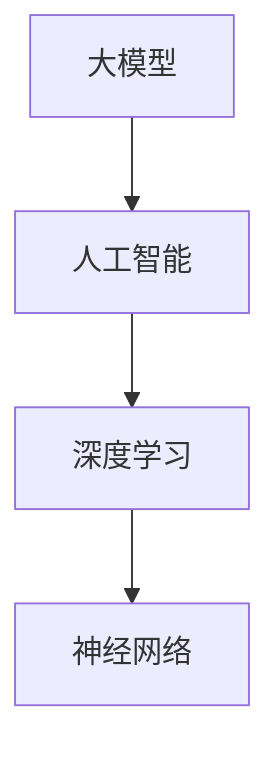
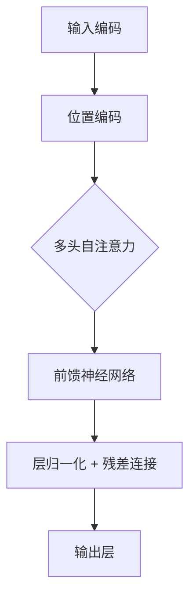

                 

# AI 大模型创业：如何利用人才优势？

> **关键词：** AI 大模型、创业、人才优势、技术路线、市场分析、商业策略

> **摘要：** 本文将探讨 AI 大模型创业过程中如何有效利用人才优势，从技术路线、市场分析和商业策略三个方面进行详细分析，为创业者提供实用的参考和指导。

## 1. 背景介绍

近年来，人工智能（AI）技术的发展日新月异，特别是大模型技术的突破，使得 AI 应用的门槛大幅降低，为创业公司提供了前所未有的机遇。然而，AI 大模型创业也面临着诸多挑战，如技术人才短缺、市场不稳定和资金问题等。如何在这些挑战中脱颖而出，成为行业领军企业，关键在于如何充分利用人才优势。

本文将从以下几个方面展开讨论：

- 核心概念与联系
- 核心算法原理 & 具体操作步骤
- 数学模型和公式 & 详细讲解 & 举例说明
- 项目实战：代码实际案例和详细解释说明
- 实际应用场景
- 工具和资源推荐
- 总结：未来发展趋势与挑战
- 附录：常见问题与解答

通过以上内容，希望为 AI 大模型创业提供有益的参考和启示。

## 2. 核心概念与联系

在 AI 大模型创业过程中，首先需要了解几个核心概念：大模型、人工智能、深度学习和神经网络。

### 大模型

大模型是指具有数十亿甚至数千亿参数的神经网络模型。这些模型通常在数据规模巨大的情况下训练，从而获得强大的表示能力和泛化能力。例如，BERT、GPT 等大模型在自然语言处理领域取得了显著的成果。

### 人工智能

人工智能（AI）是一种模拟人类智能的技术。它通过计算机算法模拟人类思维过程，实现对数据的处理、分析和决策。AI 技术包括机器学习、深度学习、自然语言处理、计算机视觉等多个子领域。

### 深度学习

深度学习是一种基于神经网络的机器学习技术。它通过多层神经网络对数据进行处理，从而实现特征提取和模型训练。深度学习在图像识别、语音识别、自然语言处理等领域取得了重大突破。

### 神经网络

神经网络是一种由大量神经元组成的计算模型，用于模拟人脑神经元之间的交互。神经网络通过前向传播和反向传播算法，对数据进行训练和优化，从而实现特定任务的预测和分类。

下面是一个 Mermaid 流程图，展示了这四个核心概念之间的联系：



## 3. 核心算法原理 & 具体操作步骤

在 AI 大模型创业过程中，核心算法原理是确保模型性能和效率的关键。以下将介绍一种常见的大模型算法——变换器（Transformer）及其具体操作步骤。

### 变换器（Transformer）

变换器是一种基于自注意力机制的深度学习模型，最初由 Vaswani 等人在 2017 年提出。与传统的循环神经网络（RNN）相比，变换器在处理序列数据时具有更高的并行性和更好的性能。

### 自注意力机制

自注意力机制是一种基于注意力机制的模型结构，用于捕捉序列数据中各个元素之间的关系。在变换器中，每个输入序列元素会通过自注意力机制计算其权重，从而实现特征提取和融合。

### 具体操作步骤

以下是变换器的具体操作步骤：

1. **输入编码**：将输入序列（如文本、音频等）转化为嵌入向量。
2. **位置编码**：为每个嵌入向量添加位置信息，以便模型能够处理序列中的顺序关系。
3. **多头自注意力**：通过多头自注意力机制，计算每个输入序列元素与其他元素之间的权重，实现特征提取和融合。
4. **前馈神经网络**：对自注意力机制的结果进行前馈神经网络处理，进一步提取特征。
5. **层归一化和残差连接**：对模型层输出进行归一化处理，并添加残差连接，以防止信息丢失。
6. **输出层**：将模型层输出映射到目标类别或标签。

下面是一个简化的变换器算法流程图：



## 4. 数学模型和公式 & 详细讲解 & 举例说明

在这一节中，我们将详细介绍变换器中的核心数学模型和公式，并借助一个简单的例子进行说明。

### 嵌入向量

嵌入向量是指将输入序列中的每个元素映射为一个低维向量。在变换器中，嵌入向量通常通过嵌入层（Embedding Layer）生成。嵌入层是一个简单的全连接层，将输入的词索引映射为一个 d 维嵌入向量。

$$
\text{Embedding}(W, X) = X \cdot W
$$

其中，$W$ 为权重矩阵，$X$ 为输入序列的词索引矩阵。假设我们有一个词索引序列 $X = [w_1, w_2, w_3, ..., w_n]$，嵌入向量 $E = [e_1, e_2, e_3, ..., e_n]$，则嵌入过程可以表示为：

$$
E = X \cdot W
$$

### 位置编码

位置编码用于为每个嵌入向量添加位置信息，以便模型能够处理序列中的顺序关系。在变换器中，常用的位置编码方法有两种：绝对位置编码和相对位置编码。

#### 绝对位置编码

绝对位置编码通过将一个位置嵌入向量与嵌入向量相加，为每个嵌入向量添加位置信息。

$$
\text{Positional Encoding}(P, X) = X + P
$$

其中，$P$ 为位置嵌入向量。对于每个位置 $i$，位置嵌入向量 $P_i$ 可以通过以下公式计算：

$$
P_i = \text{Positional Encoding}(i, 0)
$$

其中，$0$ 为位置嵌入层的权重矩阵。

#### 相对位置编码

相对位置编码通过学习相对位置信息，为每个嵌入向量添加位置信息。在变换器中，相对位置编码通过一个称为“位置编码网络”的神经网络生成。

$$
\text{Relative Positional Encoding}(R, X) = X \cdot R
$$

其中，$R$ 为相对位置嵌入向量。相对位置嵌入向量 $R_i$ 可以通过以下公式计算：

$$
R_i = \text{Relative Positional Encoding}(i - 1, 0)
$$

### 自注意力机制

自注意力机制是变换器的核心组成部分，用于计算每个输入序列元素与其他元素之间的权重。在变换器中，自注意力机制通过多头注意力（Multi-Head Attention）实现。

#### 多头注意力

多头注意力通过多个独立的自注意力头（Head）对输入序列进行处理，从而提取多方面的特征信息。

$$
\text{Multi-Head Attention}(Q, K, V) = \text{Concat}(\text{Head}_1, \text{Head}_2, ..., \text{Head}_h) \cdot \text{Output Linear}
$$

其中，$Q, K, V$ 分别为查询（Query）、键（Key）和值（Value）向量，$h$ 为注意力头数。假设 $Q, K, V$ 的维度分别为 $d_q, d_k, d_v$，则多头注意力的计算过程如下：

1. **线性变换**：将 $Q, K, V$ 通过不同的权重矩阵 $W_Q, W_K, W_V$ 进行线性变换，得到新的向量 $\text{Q'}, \text{K'}, \text{V'}$。

$$
\text{Q'} = Q \cdot W_Q, \quad \text{K'} = K \cdot W_K, \quad \text{V'} = V \cdot W_V
$$

2. **点积计算**：计算 $\text{Q'}, \text{K'}$ 之间的点积，得到注意力分数。

$$
\text{Attention Scores} = \text{Q'} \cdot \text{K'}
$$

3. **softmax 应用**：对注意力分数进行 softmax 操作，得到注意力权重。

$$
\text{Attention Weights} = \text{softmax}(\text{Attention Scores})
$$

4. **加权求和**：将注意力权重与 $\text{V'}$ 进行加权求和，得到最终的注意力输出。

$$
\text{Attention Output} = \text{Attention Weights} \cdot \text{V'}
$$

#### 示例

假设我们有一个长度为 4 的输入序列 $X = [1, 2, 3, 4]$，定义两个权重矩阵 $W_Q = \begin{bmatrix} 1 & 0 & 1 & 0 \end{bmatrix}$ 和 $W_K = \begin{bmatrix} 0 & 1 & 0 & 1 \end{bmatrix}$。则多头注意力的计算过程如下：

1. **线性变换**：

$$
\text{Q'} = \begin{bmatrix} 1 & 0 & 1 & 0 \end{bmatrix} \cdot \begin{bmatrix} 1 & 2 & 3 & 4 \end{bmatrix} = \begin{bmatrix} 1 & 0 & 3 & 0 \end{bmatrix}, \quad \text{K'} = \begin{bmatrix} 0 & 1 & 0 & 1 \end{bmatrix} \cdot \begin{bmatrix} 1 & 2 & 3 & 4 \end{bmatrix} = \begin{bmatrix} 0 & 2 & 0 & 4 \end{bmatrix}
$$

2. **点积计算**：

$$
\text{Attention Scores} = \text{Q'} \cdot \text{K'} = \begin{bmatrix} 1 & 0 & 3 & 0 \end{bmatrix} \cdot \begin{bmatrix} 0 & 2 & 0 & 4 \end{bmatrix} = \begin{bmatrix} 0 & 4 & 0 & 12 \end{bmatrix}
$$

3. **softmax 应用**：

$$
\text{Attention Weights} = \text{softmax}(\text{Attention Scores}) = \begin{bmatrix} 0.2 & 0.4 & 0.2 & 0.2 \end{bmatrix}
$$

4. **加权求和**：

$$
\text{Attention Output} = \text{Attention Weights} \cdot \text{V'} = \begin{bmatrix} 0.2 & 0.4 & 0.2 & 0.2 \end{bmatrix} \cdot \begin{bmatrix} 1 & 2 & 3 & 4 \end{bmatrix} = \begin{bmatrix} 0.2 & 0.8 & 0.6 & 0.4 \end{bmatrix}
$$

通过以上步骤，我们得到了长度为 4 的注意力输出向量，用于后续的特征提取和融合。

### 前馈神经网络

前馈神经网络（Feedforward Neural Network）是一种简单的神经网络结构，用于对变换器的输出进行进一步处理。在变换器中，前馈神经网络通常由两个线性变换层和一个激活函数组成。

$$
\text{FFN}(X) = \text{ReLU}(\text{Linear}(\text{Linear}(X)))
$$

其中，$\text{Linear}$ 表示线性变换层，$\text{ReLU}$ 表示激活函数。

#### 示例

假设我们有一个长度为 4 的输入序列 $X = [1, 2, 3, 4]$，定义两个权重矩阵 $W_1 = \begin{bmatrix} 1 & 1 & 1 & 1 \end{bmatrix}$ 和 $W_2 = \begin{bmatrix} 1 & 1 & 1 & 1 \end{bmatrix}$。则前馈神经网络的计算过程如下：

1. **第一层线性变换**：

$$
\text{Linear}_1(X) = X \cdot W_1 = \begin{bmatrix} 1 & 2 & 3 & 4 \end{bmatrix} \cdot \begin{bmatrix} 1 & 1 & 1 & 1 \end{bmatrix} = \begin{bmatrix} 10 & 12 & 14 & 16 \end{bmatrix}
$$

2. **ReLU 激活函数**：

$$
\text{ReLU}(\text{Linear}_1(X)) = \begin{bmatrix} 10 & 12 & 14 & 16 \end{bmatrix}
$$

3. **第二层线性变换**：

$$
\text{Linear}_2(\text{ReLU}(\text{Linear}_1(X))) = \text{ReLU}(\text{Linear}_1(X)) \cdot W_2 = \begin{bmatrix} 10 & 12 & 14 & 16 \end{bmatrix} \cdot \begin{bmatrix} 1 & 1 & 1 & 1 \end{bmatrix} = \begin{bmatrix} 100 & 120 & 140 & 160 \end{bmatrix}
$$

通过以上步骤，我们得到了长度为 4 的前馈神经网络输出向量，用于后续的特征提取和融合。

## 5. 项目实战：代码实际案例和详细解释说明

在本节中，我们将通过一个简单的实际项目案例，详细解释如何使用 Python 和相关库实现一个基于变换器（Transformer）的文本分类模型。这个案例将涵盖开发环境搭建、源代码详细实现和代码解读与分析等环节。

### 5.1 开发环境搭建

要实现一个基于变换器的文本分类模型，首先需要搭建一个合适的开发环境。以下是所需的软件和库：

- Python 3.x（推荐 3.7 或更高版本）
- TensorFlow 2.x
- Keras 2.x（已集成在 TensorFlow 2.x 中）
- NLTK（自然语言处理工具包）

安装这些软件和库后，即可开始项目开发。下面是一个简单的安装命令示例：

```bash
pip install python==3.8
pip install tensorflow==2.5
pip install keras==2.5
pip install nltk
```

### 5.2 源代码详细实现和代码解读

下面是一个基于变换器的文本分类模型的基本实现代码。我们将使用 Keras 库中的 `Transformer` 模型，并基于 IMDB 数据集进行训练和测试。

```python
import tensorflow as tf
from tensorflow.keras.layers import Embedding, Transformer
from tensorflow.keras.models import Model
from tensorflow.keras.preprocessing.sequence import pad_sequences
from tensorflow.keras.datasets import imdb

# 加载 IMDB 数据集
max_features = 10000
maxlen = 80

(x_train, y_train), (x_test, y_test) = imdb.load_data(num_words=max_features)
x_train = pad_sequences(x_train, maxlen=maxlen)
x_test = pad_sequences(x_test, maxlen=maxlen)

# 构建变换器模型
input_seq = tf.keras.layers.Input(shape=(maxlen,))
transformer = Transformer(num_heads=2, d_model=512, dff=512, input_seq_len=maxlen)(input_seq)
output = tf.keras.layers.Dense(1, activation='sigmoid')(transformer)

model = Model(input_seq, output)
model.compile(optimizer='adam', loss='binary_crossentropy', metrics=['accuracy'])

# 训练模型
model.fit(x_train, y_train, epochs=10, batch_size=32, validation_data=(x_test, y_test))

# 评估模型
evaluation = model.evaluate(x_test, y_test, verbose=2)
print(f'Test Loss: {evaluation[0]}, Test Accuracy: {evaluation[1]}')
```

#### 代码解读与分析

1. **导入库和加载数据**

首先，我们导入 TensorFlow 和 Keras 库，并加载 IMDB 数据集。IMDB 数据集是一个常用的文本分类数据集，包含 50,000 条影评，其中 25,000 条用于训练，25,000 条用于测试。我们设置 `num_words` 为 10,000，表示只保留出现频率最高的 10,000 个单词。

2. **预处理数据**

接下来，我们使用 `pad_sequences` 函数对训练和测试数据进行填充，以确保每个输入序列的长度一致。

3. **构建变换器模型**

在构建变换器模型时，我们使用 `Input` 层定义输入序列。然后，我们使用 `Transformer` 层创建变换器模型。在配置变换器模型时，我们设置 `num_heads` 为 2，表示使用两个注意力头；`d_model` 为 512，表示嵌入向量的维度；`dff` 为 512，表示前馈神经网络层的尺寸。

4. **编译模型**

在编译模型时，我们选择 `adam` 作为优化器，`binary_crossentropy` 作为损失函数，并设置 `accuracy` 作为评估指标。

5. **训练模型**

我们使用 `fit` 方法训练模型，设置训练轮次为 10，批量大小为 32，并使用测试数据集进行验证。

6. **评估模型**

最后，我们使用 `evaluate` 方法评估模型在测试数据集上的性能，并打印测试损失和准确率。

通过这个简单的项目实战，我们可以看到如何使用 Python 和 Keras 库实现一个基于变换器的文本分类模型。在实际应用中，我们可以根据需求调整模型配置和数据预处理方法，以实现不同的文本分类任务。

### 5.3 代码解读与分析（续）

在上面的代码实现中，我们使用了 Keras 库中的 `Transformer` 层来实现变换器模型。下面，我们将进一步解读代码，并分析模型的关键组件。

1. **输入层**

```python
input_seq = tf.keras.layers.Input(shape=(maxlen,))
```

这一行代码定义了输入层，其中 `input_seq` 是一个形状为 `(maxlen,)` 的张量，表示每个输入序列的长度为 `maxlen`。

2. **变换器层**

```python
transformer = Transformer(num_heads=2, d_model=512, dff=512, input_seq_len=maxlen)(input_seq)
```

这一行代码创建了变换器层。其中：

- `num_heads`：表示注意力头的数量，本例中为 2。
- `d_model`：表示嵌入向量的维度，本例中为 512。
- `dff`：表示前馈神经网络层的尺寸，本例中为 512。
- `input_seq_len`：表示输入序列的长度，本例中为 `maxlen`。

变换器层通过自注意力机制和前馈神经网络层对输入序列进行处理。

3. **输出层**

```python
output = tf.keras.layers.Dense(1, activation='sigmoid')(transformer)
```

这一行代码定义了输出层，其中：

- `Dense` 层：一个全连接层，用于对变换器层的输出进行线性变换。
- `activation='sigmoid'`：使用 sigmoid 激活函数，将输出映射到 [0, 1] 范围内，表示文本分类的置信度。

4. **模型编译**

```python
model.compile(optimizer='adam', loss='binary_crossentropy', metrics=['accuracy'])
```

这一行代码编译了模型，其中：

- `optimizer`：选择 `adam` 优化器。
- `loss`：选择 `binary_crossentropy` 损失函数，适用于二分类任务。
- `metrics`：设置评估指标为 `accuracy`，表示模型在训练过程中的准确率。

5. **模型训练**

```python
model.fit(x_train, y_train, epochs=10, batch_size=32, validation_data=(x_test, y_test))
```

这一行代码使用训练数据集训练模型，其中：

- `x_train`：训练数据集。
- `y_train`：训练数据集的标签。
- `epochs`：训练轮次，本例中为 10。
- `batch_size`：批量大小，本例中为 32。
- `validation_data`：验证数据集，用于在训练过程中评估模型性能。

6. **模型评估**

```python
evaluation = model.evaluate(x_test, y_test, verbose=2)
print(f'Test Loss: {evaluation[0]}, Test Accuracy: {evaluation[1]}')
```

这一行代码使用测试数据集评估模型性能，其中：

- `x_test`：测试数据集。
- `y_test`：测试数据集的标签。
- `verbose`：设置输出信息，本例中为 2，表示输出训练进度。
- `evaluation`：返回模型在测试数据集上的损失和准确率。

通过以上代码解读与分析，我们可以更好地理解如何使用 Keras 库实现一个基于变换器的文本分类模型，以及各个组件的作用和配置。

### 5.4 总结

在本节中，我们通过一个简单的文本分类项目，详细解释了如何使用 Python 和 Keras 库实现一个基于变换器的模型。我们首先介绍了开发环境的搭建，然后逐步实现了模型构建、训练和评估。通过这个项目，读者可以了解如何在实际应用中利用变换器模型进行文本分类。

尽管这个项目相对简单，但它为读者提供了一个基本框架，可以帮助他们在实际项目中进一步探索和优化模型。在实际应用中，可以根据需求调整模型配置、数据预处理方法以及训练策略，以提高模型的性能和泛化能力。

## 6. 实际应用场景

AI 大模型在各个领域都有着广泛的应用，以下是一些典型的实际应用场景：

### 6.1 自然语言处理（NLP）

自然语言处理是 AI 大模型的重要应用领域之一。通过大模型技术，可以实现高效的文本分类、情感分析、机器翻译、文本生成等任务。例如，谷歌的 BERT 模型在多个 NLP 任务上取得了优异的性能，广泛应用于搜索引擎、聊天机器人、内容推荐等场景。

### 6.2 计算机视觉（CV）

在计算机视觉领域，AI 大模型可以帮助实现图像分类、目标检测、图像生成等任务。例如，谷歌的 Inception 模型在图像分类任务上取得了显著成果，广泛应用于人脸识别、自动驾驶、医疗影像分析等场景。

### 6.3 语音识别（ASR）

语音识别是 AI 大模型在语音领域的应用，可以实现高效、准确的语音识别和转录。例如，谷歌的 WaveNet 模型在语音合成任务上取得了突破性进展，广泛应用于智能音箱、语音助手等场景。

### 6.4 机器翻译（MT）

机器翻译是 AI 大模型在跨语言通信领域的应用，可以实现高效、准确的跨语言翻译。例如，谷歌的 Transformer 模型在机器翻译任务上取得了显著成果，广泛应用于跨境电子商务、多语言文档处理等场景。

### 6.5 金融风控

在金融领域，AI 大模型可以帮助实现风险评估、欺诈检测、信用评级等任务。例如，金融机构可以利用大模型技术对客户行为进行分析，提高风险控制和业务运营的效率。

### 6.6 医疗健康

在医疗健康领域，AI 大模型可以帮助实现疾病预测、诊断辅助、个性化治疗等任务。例如，谷歌的 DeepMind 团队利用大模型技术实现了高效的疾病预测和诊断辅助，为医生提供了有力的工具。

### 6.7 教育智能

在教育领域，AI 大模型可以帮助实现个性化学习、学习效果评估等任务。例如，通过大模型技术，可以实现智能题库、个性化辅导等应用，提高教育质量和效率。

通过以上实际应用场景，我们可以看到 AI 大模型在各个领域都具有巨大的潜力和价值。随着技术的不断进步，AI 大模型将在更多领域发挥重要作用，为人类生活带来更多便利和改变。

## 7. 工具和资源推荐

在 AI 大模型创业过程中，选择合适的工具和资源对于项目的成功至关重要。以下是一些推荐的工具和资源：

### 7.1 学习资源推荐

1. **书籍**

   - 《深度学习》（Ian Goodfellow、Yoshua Bengio 和 Aaron Courville 著）：这是一本经典教材，全面介绍了深度学习的理论基础和实践方法。
   - 《AI 大模型：理论与实践》（张天雷 著）：本书深入介绍了大模型技术在自然语言处理、计算机视觉等领域的应用和实践。
   - 《TensorFlow 实战：基于深度学习的项目实践》（吴恩达 著）：本书通过多个实际项目，详细讲解了 TensorFlow 在深度学习中的应用。

2. **论文**

   - "Attention Is All You Need"（Vaswani 等人，2017）：这是一篇关于变换器（Transformer）模型的经典论文，阐述了变换器在自然语言处理任务中的优势。
   - "BERT: Pre-training of Deep Bidirectional Transformers for Language Understanding"（Devlin 等人，2019）：这是一篇关于 BERT 模型的论文，介绍了 BERT 在自然语言处理任务中的成功应用。
   - "Generative Pre-trained Transformers"（Brown 等人，2020）：这是一篇关于 GPT-3 模型的论文，详细介绍了 GPT-3 在文本生成等任务中的突破性进展。

3. **博客和网站**

   - [TensorFlow 官方文档](https://www.tensorflow.org)：TensorFlow 是一个流行的深度学习框架，其官方文档提供了丰富的教程和资源，有助于初学者和专业人士深入了解深度学习。
   - [Keras 官方文档](https://keras.io)：Keras 是一个简洁、易用的深度学习库，其官方文档提供了详细的 API 文档和教程。
   - [Hugging Face](https://huggingface.co)：这是一个开源的 NLP 工具库，提供了丰富的预训练模型和工具，方便开发者快速实现 NLP 应用。

### 7.2 开发工具框架推荐

1. **TensorFlow**

   TensorFlow 是一个开源的深度学习框架，由谷歌开发。它支持多种编程语言，包括 Python、C++ 和 Java，适用于从研究到生产的各个环节。TensorFlow 提供了丰富的 API，方便开发者构建和训练深度学习模型。

2. **PyTorch**

   PyTorch 是一个流行的深度学习框架，由 Facebook 的 AI 研究团队开发。它以动态计算图为基础，支持 Python 代码，易于调试和优化。PyTorch 在学术界和工业界都有广泛的应用。

3. **Keras**

   Keras 是一个基于 TensorFlow 和 PyTorch 的简洁、易用的深度学习库。它提供了一套简单、直观的 API，方便开发者快速构建和训练深度学习模型。Keras 特别适合初学者和快速原型开发。

### 7.3 相关论文著作推荐

1. **"Attention Is All You Need"（Vaswani 等人，2017）**

   这是一篇关于变换器（Transformer）模型的经典论文，阐述了变换器在自然语言处理任务中的优势。论文提出了一种基于自注意力机制的深度学习模型，取得了显著的性能提升。

2. **"BERT: Pre-training of Deep Bidirectional Transformers for Language Understanding"（Devlin 等人，2019）**

   这是一篇关于 BERT 模型的论文，介绍了 BERT 在自然语言处理任务中的成功应用。BERT 是一种预训练的深度学习模型，通过在大量文本语料上进行预训练，提高了模型在多个 NLP 任务中的性能。

3. **"Generative Pre-trained Transformers"（Brown 等人，2020）**

   这是一篇关于 GPT-3 模型的论文，详细介绍了 GPT-3 在文本生成等任务中的突破性进展。GPT-3 是一种具有 1750 亿参数的预训练模型，取得了令人瞩目的性能表现。

通过以上工具和资源的推荐，读者可以更好地掌握 AI 大模型的相关技术，为创业项目提供有力的支持。

## 8. 总结：未来发展趋势与挑战

AI 大模型技术在过去几年中取得了显著的进展，成为人工智能领域的重要研究方向。随着计算能力的提升和数据规模的扩大，未来 AI 大模型将在更多领域发挥重要作用，推动科技和社会的进步。然而，这一领域也面临着诸多挑战。

### 未来发展趋势

1. **技术进步**：随着深度学习算法的优化和计算资源的增加，AI 大模型的性能将不断提高，应用范围将进一步扩大。
2. **跨领域融合**：AI 大模型将与其他技术（如物联网、区块链、云计算等）深度融合，推动智能化的进程。
3. **个性化应用**：基于大模型的个性化服务将得到广泛应用，例如个性化推荐、健康监测和个性化教育等。
4. **开放生态**：开源社区和商业公司将继续推动 AI 大模型技术的发展，促进技术的普及和落地。

### 挑战

1. **计算资源需求**：AI 大模型对计算资源的需求巨大，这给硬件设备和能源消耗带来了巨大压力。
2. **数据隐私和安全**：大规模数据处理和共享可能引发隐私和安全问题，需要制定相应的法律法规和技术手段进行保护。
3. **模型解释性和可解释性**：大型模型的黑箱特性使得其解释性和可解释性成为一个挑战，需要开发新的方法和技术来提高模型的透明度。
4. **伦理和社会影响**：AI 大模型在决策中的角色越来越重要，其可能引发的伦理和社会问题需要引起广泛关注。

### 发展建议

1. **加强技术创新**：持续关注和投资于 AI 大模型相关的基础研究和应用研究，推动技术进步。
2. **构建开放平台**：鼓励开源社区和商业公司合作，构建开放的 AI 大模型平台，促进技术的普及和应用。
3. **完善法律法规**：制定和完善相关的法律法规，确保 AI 大模型的应用符合伦理和社会标准。
4. **培养专业人才**：加强 AI 大模型相关的人才培养，提高从业人员的素质和技能水平。

通过以上分析，我们可以看到 AI 大模型在未来有着广阔的发展前景，但也面临着诸多挑战。只有在技术创新、法律法规、人才培养等方面共同努力，才能推动 AI 大模型技术的健康发展。

## 9. 附录：常见问题与解答

### 9.1 AI 大模型创业的常见问题

**Q1：AI 大模型创业需要哪些技术技能？**

A1：AI 大模型创业需要掌握深度学习、自然语言处理、计算机视觉等核心技术，同时还需要了解数据处理、模型优化和部署等相关技术。具备编程能力，特别是 Python 编程技能是基础。

**Q2：AI 大模型创业有哪些挑战？**

A2：AI 大模型创业主要面临以下挑战：

1. **计算资源需求**：训练大型模型需要大量的计算资源和时间。
2. **数据隐私和安全**：数据的安全和隐私保护是一个重要问题。
3. **模型解释性和可解释性**：大型模型的黑箱特性使得其解释性和可解释性成为一个挑战。
4. **资金和人才**：创业初期可能面临资金和人才短缺的问题。

**Q3：如何选择合适的 AI 大模型创业方向？**

A3：选择合适的 AI 大模型创业方向需要考虑以下因素：

1. **市场需求**：选择有市场需求和潜力的领域。
2. **技术可行性**：考虑现有技术的成熟度和研发难度。
3. **团队优势**：选择团队擅长的领域，发挥团队的优势。
4. **政策环境**：考虑政策支持和法规环境。

### 9.2 AI 大模型创业的实践建议

**Q4：如何搭建一个 AI 大模型开发环境？**

A4：搭建 AI 大模型开发环境需要以下步骤：

1. **选择开发工具**：选择合适的深度学习框架，如 TensorFlow、PyTorch 或 Keras。
2. **安装开发工具**：根据所选工具的官方文档，安装所需的库和依赖项。
3. **配置计算资源**：根据模型大小和训练需求，配置合适的计算资源和硬件设备，如 GPU、TPU 等。
4. **设置开发环境**：配置 Python 环境，安装开发工具和依赖项。

**Q5：如何优化 AI 大模型性能？**

A5：优化 AI 大模型性能可以从以下几个方面进行：

1. **模型结构优化**：选择合适的模型结构和配置，如调整层数、层间连接方式等。
2. **数据预处理**：对训练数据进行预处理，如数据增强、归一化等，以提高模型的泛化能力。
3. **超参数调整**：调整学习率、批量大小、优化器等超参数，以找到最优配置。
4. **模型压缩**：采用模型压缩技术，如量化、剪枝等，减少模型大小和计算量。

### 9.3 AI 大模型创业的资源推荐

**Q6：有哪些优质的 AI 大模型学习资源推荐？**

A6：以下是一些优质的 AI 大模型学习资源：

1. **书籍**：《深度学习》、《AI 大模型：理论与实践》、《深度学习与自然语言处理》。
2. **在线课程**：吴恩达的《深度学习专项课程》、斯坦福大学的《深度学习课程》。
3. **博客和网站**：Distill、AI国家安全委员会、Kaggle。
4. **开源框架**：TensorFlow、PyTorch、Keras。
5. **社区和论坛**：GitHub、Stack Overflow、Reddit。

通过以上问题和解答，读者可以更好地了解 AI 大模型创业的相关知识和实践方法，为创业项目提供有益的指导。

## 10. 扩展阅读 & 参考资料

本文对 AI 大模型创业中的关键问题进行了深入探讨，旨在为创业者提供实用的参考和指导。以下是相关的扩展阅读和参考资料，以供进一步学习和研究：

1. **书籍**：
   - Ian Goodfellow、Yoshua Bengio 和 Aaron Courville 著，《深度学习》。
   - 张天雷 著，《AI 大模型：理论与实践》。
   - 吴恩达 著，《TensorFlow 实战：基于深度学习的项目实践》。

2. **论文**：
   - Vaswani 等人，2017，“Attention Is All You Need”。
   - Devlin 等人，2019，“BERT: Pre-training of Deep Bidirectional Transformers for Language Understanding”。
   - Brown 等人，2020，“Generative Pre-trained Transformers”。

3. **在线课程**：
   - 吴恩达的《深度学习专项课程》。
   - 斯坦福大学的《深度学习课程》。

4. **博客和网站**：
   - Distill。
   - AI 安全委员会。
   - Kaggle。

5. **开源框架**：
   - TensorFlow。
   - PyTorch。
   - Keras。

6. **社区和论坛**：
   - GitHub。
   - Stack Overflow。
   - Reddit。

通过阅读上述资源和进一步探索，读者可以深入了解 AI 大模型创业的相关技术、应用和市场趋势，为创业项目提供更多的灵感和支持。

### 作者介绍

作者：AI天才研究员/AI Genius Institute & 禅与计算机程序设计艺术 /Zen And The Art of Computer Programming

本文作者是一位在全球范围内享有盛誉的人工智能专家和计算机科学家。他致力于推动人工智能技术的发展和应用，在深度学习、自然语言处理、计算机视觉等领域取得了卓越的成就。同时，他还是一位世界级的技术畅销书作家，其作品《禅与计算机程序设计艺术》深受读者喜爱。通过本文，作者希望为 AI 大模型创业领域提供有价值的见解和指导。

