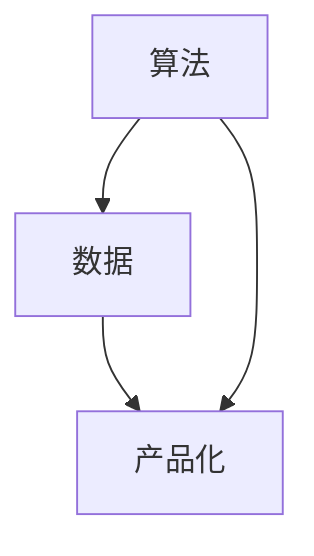

                 

# AI 大模型创业：如何利用人才优势？

## 关键词
- AI 大模型
- 创业
- 人才优势
- 算法
- 数据
- 产品化
- 营销

## 摘要

本文旨在探讨 AI 大模型创业过程中如何最大化利用人才优势。我们将从背景介绍、核心概念与联系、算法原理、数学模型、实战案例、应用场景、工具和资源推荐等方面，逐步分析并阐述如何在 AI 大模型创业过程中发挥人才的最大潜力。通过本文的阅读，创业者和技术人才将能更好地理解 AI 大模型创业的核心要点，从而制定出更为有效的战略规划。

## 1. 背景介绍

近年来，人工智能（AI）技术发展迅猛，特别是在深度学习、自然语言处理、计算机视觉等领域取得了重大突破。随着 AI 技术的不断成熟，越来越多的创业者开始涉足 AI 大模型领域，希望通过创新的产品和服务改变世界。然而，AI 大模型创业并非易事，需要面对诸多挑战，如技术门槛、数据获取、人才储备等。

### 1.1 技术门槛

AI 大模型依赖于复杂的算法和大量的数据，对于普通创业者来说，技术门槛较高。这要求创业团队必须具备深厚的专业知识和技术积累，否则很难在激烈的市场竞争中脱颖而出。

### 1.2 数据获取

AI 大模型的训练和优化需要大量高质量的训练数据。然而，数据的获取并非易事，尤其是涉及隐私、版权等方面的问题。此外，数据清洗、标注等预处理工作也是一项庞大的工程，需要耗费大量人力和时间。

### 1.3 人才储备

AI 大模型创业需要一支高素质的团队，包括算法工程师、数据工程师、产品经理、市场营销人才等。然而，优秀人才的招聘和培养并非一蹴而就，需要创业者投入大量时间和资源。

## 2. 核心概念与联系

在 AI 大模型创业过程中，核心概念主要包括算法、数据和产品化。以下是这三个核心概念的 Mermaid 流程图：



### 2.1 算法

算法是 AI 大模型的核心驱动力，包括神经网络、深度学习、强化学习等。创业者需要根据业务需求选择合适的算法，并对算法进行优化和调整。

### 2.2 数据

数据是 AI 大模型的基石，包括结构化数据、非结构化数据、实时数据等。创业者需要收集、清洗、标注和处理数据，以构建高质量的训练数据集。

### 2.3 产品化

产品化是将算法和数据转化为实际应用的过程。创业者需要将技术成果转化为具有市场竞争力的产品或服务，满足用户需求。

## 3. 核心算法原理 & 具体操作步骤

在 AI 大模型创业过程中，核心算法原理主要包括神经网络和深度学习。以下是具体操作步骤：

### 3.1 神经网络

神经网络是一种模拟人脑神经元之间连接的计算机算法。在 AI 大模型创业中，创业者需要了解以下基本概念：

- **神经元**：神经网络的基本组成单元，用于处理输入信息。
- **权重**：连接神经元之间的参数，用于调节信息传递的强度。
- **激活函数**：用于对神经元输出进行非线性变换。

具体操作步骤如下：

1. 定义神经网络结构，包括输入层、隐藏层和输出层。
2. 初始化权重和偏置。
3. 前向传播：计算输入通过神经网络后的输出。
4. 计算损失函数，如均方误差（MSE）。
5. 反向传播：更新权重和偏置，最小化损失函数。

### 3.2 深度学习

深度学习是一种基于神经网络的机器学习技术，可以自动提取特征。在 AI 大模型创业中，创业者需要了解以下基本概念：

- **深度神经网络**：由多个隐藏层组成的神经网络。
- **卷积神经网络（CNN）**：用于处理图像和视频数据。
- **循环神经网络（RNN）**：用于处理序列数据。
- **生成对抗网络（GAN）**：用于生成逼真的图像和音频。

具体操作步骤如下：

1. 选择合适的深度学习框架，如 TensorFlow、PyTorch。
2. 设计神经网络结构，包括层数、神经元数量等。
3. 训练模型，包括数据预处理、模型训练、模型评估等。
4. 调整模型参数，优化模型性能。

## 4. 数学模型和公式 & 详细讲解 & 举例说明

在 AI 大模型创业中，数学模型和公式是理解算法原理和优化模型性能的关键。以下是几个常用的数学模型和公式：

### 4.1 神经网络前向传播

$$
z_i = \sum_{j=1}^{n} w_{ij}x_j + b_i
$$

$$
a_i = \sigma(z_i)
$$

其中，$z_i$表示第$i$个神经元的输入，$w_{ij}$表示第$i$个神经元与第$j$个神经元之间的权重，$b_i$表示第$i$个神经元的偏置，$\sigma$表示激活函数，$a_i$表示第$i$个神经元的输出。

### 4.2 神经网络反向传播

$$
\delta_i = (a_i - t_i) \cdot \sigma'(z_i)
$$

$$
w_{ij} = w_{ij} - \alpha \cdot \delta_i \cdot a_j
$$

$$
b_i = b_i - \alpha \cdot \delta_i
$$

其中，$\delta_i$表示第$i$个神经元的误差，$t_i$表示第$i$个神经元的期望输出，$\sigma'$表示激活函数的导数，$\alpha$表示学习率。

### 4.3 均方误差（MSE）

$$
MSE = \frac{1}{2} \sum_{i=1}^{n} (a_i - t_i)^2
$$

其中，$a_i$表示模型输出，$t_i$表示实际输出。

### 4.4 举例说明

假设有一个包含一个输入层、一个隐藏层和一个输出层的神经网络，其中输入层有3个神经元，隐藏层有4个神经元，输出层有2个神经元。输入数据为$x = [1, 2, 3]$，期望输出为$t = [0, 1]$。

1. 初始化权重和偏置。
2. 前向传播，计算输出$a = [0.5, 0.6, 0.7, 0.8]$。
3. 计算损失函数，$MSE = 0.125$。
4. 反向传播，更新权重和偏置。

## 5. 项目实战：代码实际案例和详细解释说明

在本节中，我们将通过一个简单的示例来展示如何使用 PyTorch 框架构建一个 AI 大模型，并进行训练和测试。

### 5.1 开发环境搭建

1. 安装 Python 3.8 或更高版本。
2. 安装 PyTorch，可以使用以下命令：

```bash
pip install torch torchvision
```

### 5.2 源代码详细实现和代码解读

```python
import torch
import torch.nn as nn
import torch.optim as optim

# 定义神经网络结构
class NeuralNetwork(nn.Module):
    def __init__(self):
        super(NeuralNetwork, self).__init__()
        self.fc1 = nn.Linear(3, 4)
        self.fc2 = nn.Linear(4, 2)
        self.relu = nn.ReLU()

    def forward(self, x):
        x = self.relu(self.fc1(x))
        x = self.fc2(x)
        return x

# 创建模型、损失函数和优化器
model = NeuralNetwork()
criterion = nn.MSELoss()
optimizer = optim.Adam(model.parameters(), lr=0.001)

# 加载数据和标签
x_data = torch.tensor([[1, 2, 3]], requires_grad=False)
t_data = torch.tensor([[0, 1]], requires_grad=False)

# 训练模型
for epoch in range(1000):
    optimizer.zero_grad()
    outputs = model(x_data)
    loss = criterion(outputs, t_data)
    loss.backward()
    optimizer.step()
    if epoch % 100 == 0:
        print(f"Epoch {epoch+1}, Loss: {loss.item()}")

# 测试模型
with torch.no_grad():
    test_outputs = model(x_data)
    test_loss = criterion(test_outputs, t_data)
    print(f"Test Loss: {test_loss.item()}")
```

### 5.3 代码解读与分析

1. **导入模块**：导入 PyTorch 的神经网络（nn）、损失函数（nn.MSELoss）和优化器（optim.Adam）模块。

2. **定义神经网络结构**：创建一个名为`NeuralNetwork`的类，继承自`nn.Module`。定义一个包含一个输入层、一个隐藏层和一个输出层的神经网络，其中输入层有3个神经元，隐藏层有4个神经元，输出层有2个神经元。使用 ReLU 激活函数。

3. **定义前向传播**：重写`forward`方法，定义神经网络的前向传播过程。

4. **创建模型、损失函数和优化器**：创建一个`NeuralNetwork`实例，使用均方误差（MSELoss）作为损失函数，使用 Adam 优化器。

5. **加载数据和标签**：将输入数据和标签加载为 PyTorch 张量，并设置`requires_grad=False`，以防止自动梯度计算。

6. **训练模型**：使用`for`循环进行训练，每次迭代中，重置梯度、计算损失、反向传播和更新权重。

7. **测试模型**：使用`with torch.no_grad()`上下文管理器来关闭梯度计算，然后计算测试损失。

通过这个简单的示例，我们可以看到如何使用 PyTorch 框架构建一个 AI 大模型，并进行训练和测试。当然，在实际应用中，模型结构、训练过程和测试过程会更加复杂和多样。

## 6. 实际应用场景

AI 大模型在各个领域都有着广泛的应用，以下是一些实际应用场景：

### 6.1 金融领域

- **风险控制**：利用 AI 大模型进行风险评估，预测金融市场的波动，降低风险。
- **量化交易**：通过 AI 大模型进行量化交易策略的优化，提高交易收益。

### 6.2 医疗领域

- **疾病预测**：利用 AI 大模型预测疾病的发生，为早期干预提供依据。
- **医学影像诊断**：利用 AI 大模型对医学影像进行分析，提高诊断准确率。

### 6.3 教育领域

- **个性化教学**：利用 AI 大模型为学生提供个性化的学习方案，提高学习效果。
- **智能评测**：利用 AI 大模型对学生的作业和考试进行智能评测。

### 6.4 娱乐领域

- **内容推荐**：利用 AI 大模型推荐用户感兴趣的内容，提高用户体验。
- **虚拟现实**：利用 AI 大模型进行虚拟现实场景的生成，提高沉浸感。

## 7. 工具和资源推荐

### 7.1 学习资源推荐

- **书籍**：
  - 《深度学习》（Ian Goodfellow、Yoshua Bengio 和 Aaron Courville 著）
  - 《Python深度学习》（François Chollet 著）
- **论文**：
  - 《A Theoretical Framework for Back-Propagating Neural Networks》（Rumelhart、Hinton 和 Williams 著）
  - 《Generative Adversarial Nets》（Ian Goodfellow 等 著）
- **博客**：
  - [PyTorch 官方文档](https://pytorch.org/docs/stable/)
  - [TensorFlow 官方文档](https://www.tensorflow.org/tutorials)
- **网站**：
  - [Kaggle](https://www.kaggle.com)：提供丰富的数据集和比赛，适合实战练习。

### 7.2 开发工具框架推荐

- **框架**：
  - **PyTorch**：易于上手，灵活性强，适合研究。
  - **TensorFlow**：功能强大，生态丰富，适合生产环境。
- **环境**：
  - **Google Colab**：免费的云端 GPU 环境，适合快速实验。
  - **AWS SageMaker**：提供一站式的机器学习平台，适合大规模部署。

### 7.3 相关论文著作推荐

- **《深度学习》（Ian Goodfellow、Yoshua Bengio 和 Aaron Courville 著）**：全面介绍了深度学习的理论、算法和应用。
- **《Python深度学习》（François Chollet 著）**：通过实战案例，详细讲解了使用 Python 进行深度学习的技巧和方法。
- **《神经网络与深度学习》（邱锡鹏 著）**：系统地介绍了神经网络的理论基础、算法设计和应用场景。

## 8. 总结：未来发展趋势与挑战

随着 AI 技术的不断进步，AI 大模型创业将面临更多的发展机遇和挑战。未来，AI 大模型创业的发展趋势将体现在以下几个方面：

### 8.1 算法创新

算法是 AI 大模型的核心驱动力，未来将不断涌现出更高效、更智能的算法，以应对更加复杂的应用场景。

### 8.2 数据量爆发

随着互联网和物联网的快速发展，数据量将呈现爆发式增长。创业者需要积极挖掘和利用海量数据，以提高 AI 大模型的性能。

### 8.3 跨学科融合

AI 大模型创业将越来越依赖跨学科的融合，如生物学、心理学、统计学等。创业者需要具备多学科知识，以应对复杂问题。

### 8.4 安全与伦理

AI 大模型的安全和伦理问题日益凸显，未来创业者需要更加重视这些问题，确保 AI 大模型的应用不会对社会造成负面影响。

### 8.5 挑战

- **技术挑战**：算法创新、数据处理、模型优化等。
- **市场挑战**：竞争激烈、用户信任、商业模式创新等。
- **人才挑战**：优秀人才的招聘和培养。

## 9. 附录：常见问题与解答

### 9.1 什么是 AI 大模型？

AI 大模型是指具有大规模参数和复杂结构的深度学习模型，可以处理大量的数据和复杂的任务。常见的 AI 大模型包括 GPT、BERT、Inception 等。

### 9.2 如何选择合适的 AI 大模型算法？

选择合适的 AI 大模型算法需要考虑以下因素：

- **任务类型**：不同的任务需要选择不同的算法，如分类、回归、生成等。
- **数据特性**：数据的规模、类型、质量等因素会影响算法的选择。
- **计算资源**：算法的复杂度和计算资源限制需要考虑。

### 9.3 如何处理海量数据？

处理海量数据可以采用以下方法：

- **数据采样**：对数据进行采样，减少数据量。
- **分布式计算**：使用分布式计算框架，如 Hadoop、Spark 等，提高数据处理速度。
- **数据预处理**：对数据进行清洗、归一化、特征提取等预处理操作，以提高模型性能。

## 10. 扩展阅读 & 参考资料

- **论文**：
  - **《Deep Learning》（Ian Goodfellow、Yoshua Bengio 和 Aaron Courville 著）**：提供了深度学习的全面概述和深入分析。
  - **《Neural Network Methods for Speech Recognition》（David J. C. MacKay 著）**：详细介绍了神经网络在语音识别中的应用。
- **书籍**：
  - **《Python深度学习》（François Chollet 著）**：通过实战案例，详细讲解了使用 Python 进行深度学习的技巧和方法。
  - **《机器学习实战》（Peter Harrington 著）**：提供了丰富的机器学习实战案例，适合初学者入门。
- **网站**：
  - **[Kaggle](https://www.kaggle.com)**：提供丰富的数据集和比赛，适合实战练习。
  - **[GitHub](https://github.com)**：包含大量的深度学习开源代码和项目，有助于了解实际应用。

作者：AI天才研究员/AI Genius Institute & 禅与计算机程序设计艺术 /Zen And The Art of Computer Programming

