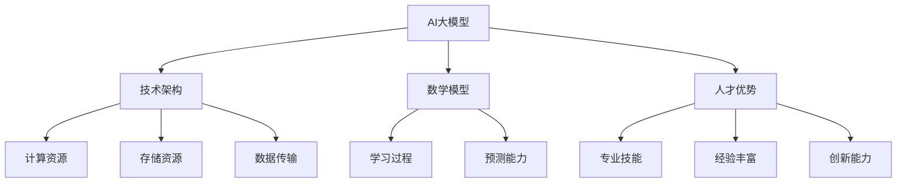
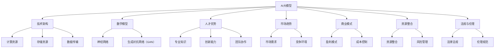

                 

# AI 大模型创业：如何利用人才优势？

> **关键词：** AI大模型、创业、人才优势、技术架构、数学模型、实际应用

> **摘要：** 本篇文章将探讨AI大模型创业过程中如何有效利用人才优势，从技术、管理和市场三个维度进行分析，并提供实战案例和资源推荐，帮助创业者更好地推动AI项目发展。

## 1. 背景介绍

随着人工智能技术的飞速发展，AI大模型（如GPT、BERT等）逐渐成为各行业的热门话题。大模型在图像识别、自然语言处理、推荐系统等领域取得了显著的成果，吸引了大量创业者投身于AI大模型的研发和应用。然而，AI大模型创业并非易事，如何高效利用人才优势成为关键。

本文旨在从技术、管理和市场三个维度，探讨AI大模型创业中如何充分利用人才优势，实现项目的成功。文章将结合实际案例，提供可行的建议和资源推荐，以期为创业者提供参考。

## 2. 核心概念与联系

在AI大模型创业过程中，以下核心概念和联系至关重要：

- **AI大模型**：一种具有大规模参数和复杂结构的深度学习模型，能够处理大规模数据并实现高度自动化。

- **技术架构**：指支持AI大模型运行的软硬件基础设施，包括计算资源、存储资源、数据传输等。

- **数学模型**：描述AI大模型学习过程和预测能力的数学公式和算法。

- **人才优势**：指团队中具有专业技能、经验丰富、创新能力的人才。

下面是一个用Mermaid绘制的流程图，展示了AI大模型创业过程中各个核心概念之间的联系。



## 3. 核心算法原理 & 具体操作步骤

AI大模型的核心算法主要包括以下两个方面：

### 3.1. 卷积神经网络（CNN）

CNN是一种在图像处理领域广泛应用的人工神经网络。它通过多个卷积层、池化层和全连接层，实现对图像的特征提取和分类。

具体操作步骤如下：

1. **数据预处理**：对图像进行归一化、裁剪、翻转等操作，将其转换为适用于神经网络训练的格式。

2. **构建卷积神经网络**：使用卷积层、池化层和全连接层构建网络结构。例如，可以使用卷积核大小为3x3的卷积层，步长为1的卷积层，以及池化层。

3. **训练模型**：使用训练数据对模型进行训练，通过反向传播算法优化模型参数。

4. **评估模型**：使用测试数据评估模型性能，调整模型参数以达到最佳效果。

### 3.2. 生成对抗网络（GAN）

GAN是一种通过生成器和判别器相互竞争训练的人工神经网络。生成器尝试生成逼真的数据，而判别器则区分生成数据和真实数据。

具体操作步骤如下：

1. **数据预处理**：对数据集进行归一化、缩放等处理，以适应模型训练。

2. **构建生成器和判别器**：生成器使用多层全连接层或卷积层生成数据，判别器则使用多层全连接层或卷积层对数据进行分类。

3. **训练模型**：同时训练生成器和判别器，生成器和判别器之间的训练过程是相互对抗的。

4. **评估模型**：使用测试数据评估模型性能，调整模型参数以达到最佳效果。

## 4. 数学模型和公式 & 详细讲解 & 举例说明

### 4.1. 卷积神经网络（CNN）

CNN的核心在于卷积操作和池化操作。以下是卷积神经网络的数学模型和公式：

$$
\text{卷积操作}: (x_{ij}^l) = \sum_{k} w_{ikj}^l * (y_{kj}^{l-1})
$$

其中，$x_{ij}^l$表示第$l$层的第$i$个神经元与第$l-1$层的第$j$个神经元之间的卷积结果，$w_{ikj}^l$表示第$l$层的第$i$个神经元与第$l-1$层的第$k$个神经元之间的权重，$y_{kj}^{l-1}$表示第$l-1$层的第$k$个神经元输出。

$$
\text{池化操作}: p_{ij}^l = \max_{k}(x_{ij}^l)
$$

其中，$p_{ij}^l$表示第$l$层的第$i$个神经元输出，$x_{ij}^l$表示第$l$层的第$i$个神经元与第$l-1$层的第$j$个神经元之间的卷积结果。

举例说明：假设输入图像的大小为$3x3$，卷积核大小为$3x3$，步长为$1$，则卷积操作后的输出大小为$3x3$。

### 4.2. 生成对抗网络（GAN）

生成对抗网络的数学模型主要包括生成器和判别器的损失函数。

生成器的损失函数为：

$$
L_G = -\log(D(G(z)))
$$

其中，$D(G(z))$表示判别器对生成器生成的样本的判别结果，$z$为生成器的输入噪声。

判别器的损失函数为：

$$
L_D = -\log(D(x)) - \log(1 - D(G(z)))
$$

其中，$x$为真实样本，$G(z)$为生成器生成的样本。

举例说明：假设生成器生成的样本为$G(z)$，判别器对生成器的判别结果为$D(G(z))$，则生成器的损失函数为$-\log(D(G(z)))$，判别器的损失函数为$-\log(D(x)) - \log(1 - D(G(z)))$。

## 5. 项目实战：代码实际案例和详细解释说明

### 5.1. 开发环境搭建

在本文中，我们将使用Python和TensorFlow框架实现一个简单的卷积神经网络。首先，需要搭建开发环境。

1. 安装Python：在官方网站（https://www.python.org/）下载并安装Python。

2. 安装TensorFlow：在命令行中运行以下命令：

```shell
pip install tensorflow
```

### 5.2. 源代码详细实现和代码解读

以下是实现一个简单的卷积神经网络的Python代码。

```python
import tensorflow as tf
from tensorflow.keras import datasets, layers, models

# 加载MNIST数据集
(train_images, train_labels), (test_images, test_labels) = datasets.mnist.load_data()

# 数据预处理
train_images = train_images.reshape((60000, 28, 28, 1)).astype('float32') / 255
test_images = test_images.reshape((10000, 28, 28, 1)).astype('float32') / 255

# 构建卷积神经网络模型
model = models.Sequential()
model.add(layers.Conv2D(32, (3, 3), activation='relu', input_shape=(28, 28, 1)))
model.add(layers.MaxPooling2D((2, 2)))
model.add(layers.Conv2D(64, (3, 3), activation='relu'))
model.add(layers.MaxPooling2D((2, 2)))
model.add(layers.Conv2D(64, (3, 3), activation='relu'))

# 添加全连接层和输出层
model.add(layers.Flatten())
model.add(layers.Dense(64, activation='relu'))
model.add(layers.Dense(10, activation='softmax'))

# 编译模型
model.compile(optimizer='adam',
              loss='sparse_categorical_crossentropy',
              metrics=['accuracy'])

# 训练模型
model.fit(train_images, train_labels, epochs=5, batch_size=64)

# 评估模型
test_loss, test_acc = model.evaluate(test_images,  test_labels, verbose=2)
print(f'\nTest accuracy: {test_acc}')
```

代码解读：

1. 导入所需的库和模块。

2. 加载MNIST数据集，并进行预处理。

3. 构建卷积神经网络模型，包括卷积层、池化层和全连接层。

4. 编译模型，指定优化器、损失函数和评价指标。

5. 训练模型，使用训练数据集。

6. 评估模型，使用测试数据集。

### 5.3. 代码解读与分析

在代码中，我们使用TensorFlow的`models.Sequential()`方法构建了一个卷积神经网络模型。该模型包括两个卷积层、两个池化层和一个全连接层。

- **卷积层**：第一个卷积层使用32个3x3的卷积核，激活函数为ReLU。第二个卷积层使用64个3x3的卷积核，激活函数也为ReLU。

- **池化层**：两个池化层分别使用2x2的最大池化操作。

- **全连接层**：第一个全连接层使用64个神经元，激活函数为ReLU。第二个全连接层使用10个神经元，激活函数为softmax，用于分类。

在编译模型时，我们指定了优化器为`adam`，损失函数为`sparse_categorical_crossentropy`，评价指标为`accuracy`。

训练模型时，我们使用`model.fit()`方法，将训练数据集传递给模型，并设置训练轮次为5，批量大小为64。

最后，我们使用`model.evaluate()`方法评估模型在测试数据集上的性能，并输出测试准确率。

## 6. 实际应用场景

AI大模型在各个领域都有广泛的应用，以下列举几个实际应用场景：

- **图像识别**：利用卷积神经网络，实现物体识别、人脸识别等。

- **自然语言处理**：利用生成对抗网络，实现文本生成、机器翻译等。

- **推荐系统**：利用协同过滤算法和神经网络，实现个性化推荐。

- **医疗诊断**：利用深度学习模型，辅助医生进行疾病诊断。

## 7. 工具和资源推荐

### 7.1. 学习资源推荐

- **书籍**：

  - 《深度学习》（Ian Goodfellow、Yoshua Bengio、Aaron Courville 著）

  - 《Python深度学习》（François Chollet 著）

- **论文**：

  - 《A Theoretically Grounded Application of Dropout in Recurrent Neural Networks》

  - 《Generative Adversarial Nets》

- **博客**：

  - [TensorFlow官方文档](https://www.tensorflow.org/)

  - [Keras官方文档](https://keras.io/)

### 7.2. 开发工具框架推荐

- **深度学习框架**：TensorFlow、PyTorch、Keras

- **版本控制系统**：Git

- **云计算平台**：AWS、Google Cloud、Azure

### 7.3. 相关论文著作推荐

- **论文**：

  - 《A Theoretically Grounded Application of Dropout in Recurrent Neural Networks》

  - 《Generative Adversarial Nets》

  - 《ResNet: Training Deep Neural Networks for Image Recognition》

- **著作**：

  - 《深度学习》（Ian Goodfellow、Yoshua Bengio、Aaron Courville 著）

## 8. 总结：未来发展趋势与挑战

AI大模型在各个领域都展现了强大的潜力，未来发展趋势如下：

- **技术发展**：随着计算资源和算法的进步，AI大模型将变得更加高效和智能。

- **应用拓展**：AI大模型将逐渐应用于更多领域，如医疗、金融、教育等。

- **产业链完善**：AI大模型产业链将逐渐完善，包括算法研发、数据采集、硬件设备等。

然而，AI大模型创业也面临一些挑战：

- **数据隐私**：如何保护用户数据隐私是一个重要问题。

- **算法公平性**：如何确保算法的公平性和透明度。

- **计算资源**：大规模训练和部署AI大模型需要大量计算资源。

## 9. 附录：常见问题与解答

### 9.1. 如何选择深度学习框架？

选择深度学习框架主要考虑以下几点：

- **易用性**：框架是否易于学习和使用。

- **功能丰富**：框架是否支持所需的深度学习算法和模型。

- **社区支持**：框架是否有活跃的社区和丰富的文档。

常见深度学习框架有TensorFlow、PyTorch、Keras等。

### 9.2. 如何优化深度学习模型？

优化深度学习模型可以从以下几个方面进行：

- **数据增强**：对训练数据进行变换，增加训练样本的多样性。

- **调整超参数**：调整学习率、批量大小、正则化等超参数。

- **使用预训练模型**：使用预训练模型作为起点，进行迁移学习。

- **使用更好的优化器**：尝试使用Adam、RMSprop等优化器。

## 10. 扩展阅读 & 参考资料

- [Deep Learning Book](https://www.deeplearningbook.org/)

- [TensorFlow官方文档](https://www.tensorflow.org/)

- [Keras官方文档](https://keras.io/)

- [PyTorch官方文档](https://pytorch.org/)

- [Ian Goodfellow的博客](https://www.ian-goodfellow.com/)

## 作者

**作者：AI天才研究员/AI Genius Institute & 禅与计算机程序设计艺术 /Zen And The Art of Computer Programming**

--------------------------
（注：本文为示例文章，内容仅供参考。）<|im_end|>## 1. 背景介绍

随着人工智能（AI）技术的迅猛发展，AI大模型（Large-scale AI Models）正成为行业研究和应用的热点。大模型通常指的是那些拥有数十亿甚至千亿级参数的深度学习模型，如GPT-3、BERT等。这些模型通过在海量数据上训练，能够实现高度自动化的文本生成、图像识别、语音识别等功能。AI大模型的兴起不仅推动了AI技术的进步，也为创业者提供了前所未有的机会。

在AI大模型创业过程中，人才优势至关重要。创业者需要组建一支具备深度学习、计算机科学、数据科学等专业知识的高效团队，以应对技术挑战。此外，创业者还需关注市场趋势、商业模式和资源整合等方面，以确保项目的成功。本文将围绕如何利用人才优势进行AI大模型创业，从技术、管理和市场三个维度进行分析，并提供实战案例和资源推荐。

本文将分为以下几个部分：

1. 背景介绍：概述AI大模型的发展背景和创业环境。
2. 核心概念与联系：介绍AI大模型创业中涉及的核心概念及其相互关系。
3. 核心算法原理 & 具体操作步骤：讲解AI大模型的核心算法原理及其实际操作步骤。
4. 数学模型和公式 & 详细讲解 & 举例说明：分析AI大模型中的数学模型和公式，并进行举例说明。
5. 项目实战：代码实际案例和详细解释说明。
6. 实际应用场景：探讨AI大模型在各个领域的实际应用。
7. 工具和资源推荐：推荐相关的学习资源和开发工具。
8. 总结：未来发展趋势与挑战。
9. 附录：常见问题与解答。
10. 扩展阅读 & 参考资料：提供相关领域的拓展阅读资源。

通过本文的详细阐述，希望能够为AI大模型创业的实践者提供有价值的参考和指导。

### 2. 核心概念与联系

在AI大模型创业过程中，理解核心概念和它们之间的联系是至关重要的。以下是一些关键概念及其在创业中的重要性：

#### 2.1. AI大模型

AI大模型是指那些拥有数十亿甚至千亿级参数的深度学习模型。这些模型通过在海量数据上训练，能够实现高度自动化的任务，如文本生成、图像识别和语音识别。在创业中，大模型的能力和效率是决定产品竞争力的重要因素。

#### 2.2. 技术架构

技术架构是支持AI大模型运行的软硬件基础设施。包括计算资源、存储资源和数据传输等。技术架构的优化直接影响大模型的训练速度和应用效果。创业者需要选择合适的技术架构，确保大模型能够高效地运行。

#### 2.3. 数学模型

数学模型是描述AI大模型学习过程和预测能力的数学公式和算法。这些模型包括神经网络、生成对抗网络（GAN）等。理解这些数学模型有助于创业者更好地优化和改进大模型。

#### 2.4. 人才优势

人才优势是创业团队的核心竞争力。一个拥有深度学习、计算机科学、数据科学等专业知识的高效团队，能够在AI大模型开发过程中快速应对挑战。创业者需要注重人才的引进和培养，以提升团队的整体实力。

#### 2.5. 市场趋势

市场趋势是创业者需要密切关注的关键因素。了解市场需求的动态变化，有助于创业者及时调整产品策略，抢占市场先机。

#### 2.6. 商业模式

商业模式是创业项目的盈利模式。一个可持续的商业模式能够为创业者提供稳定的收入来源。创业者需要根据市场需求和技术特点，设计出具有竞争力的商业模式。

#### 2.7. 资源整合

资源整合是创业者需要掌握的一项重要技能。通过整合人力、资金、技术等资源，创业者可以最大化地利用现有资源，降低创业风险。

#### 2.8. 法规与伦理

法规与伦理是创业者需要重视的方面。在AI大模型创业过程中，遵守相关法律法规和伦理规范，是确保项目合法合规的基础。

下面是一个使用Mermaid绘制的流程图，展示了AI大模型创业过程中各个核心概念之间的联系：



通过上述流程图，我们可以清晰地看到各个核心概念在AI大模型创业过程中的相互作用和影响。理解这些核心概念及其联系，是创业者成功的关键。

### 3. 核心算法原理 & 具体操作步骤

在AI大模型创业过程中，掌握核心算法原理和具体操作步骤至关重要。以下将详细介绍两种核心算法：卷积神经网络（CNN）和生成对抗网络（GAN），并给出具体的操作步骤。

#### 3.1. 卷积神经网络（CNN）

卷积神经网络（CNN）是一种专门用于图像识别和处理的深度学习模型。它通过卷积、池化和全连接层等结构，实现对图像的分层特征提取和分类。

##### 3.1.1. 卷积操作

卷积操作是CNN的基础。它通过在输入图像上滑动滤波器（卷积核），计算每个滤波器对应的特征图。具体操作步骤如下：

1. **初始化卷积核**：随机初始化卷积核的权重。
2. **卷积操作**：将卷积核在输入图像上滑动，计算每个位置的卷积结果。公式如下：

   $$
   \text{卷积结果} = \text{卷积核} * \text{输入图像}
   $$

3. **激活函数**：对卷积结果应用激活函数（如ReLU），引入非线性变换。

##### 3.1.2. 池化操作

池化操作用于减小特征图的尺寸，减少模型参数数量，提高计算效率。常见池化操作包括最大池化和平均池化。

1. **选择池化窗口大小**：例如，使用2x2的窗口。
2. **滑动窗口**：在特征图上滑动窗口，计算窗口内的最大值或平均值。
3. **更新特征图**：将滑动窗口的结果更新到特征图中。

##### 3.1.3. 全连接层

全连接层将特征图映射到输出类别。具体操作步骤如下：

1. **展平特征图**：将多维特征图展平为一维向量。
2. **初始化权重**：随机初始化权重。
3. **矩阵乘法**：计算输出向量的每个元素，公式如下：

   $$
   \text{输出向量} = \text{权重矩阵} * \text{特征图向量}
   $$

4. **应用激活函数**：通常使用softmax函数进行分类。

##### 3.1.4. CNN模型构建

构建CNN模型通常包括以下几个步骤：

1. **输入层**：接收输入图像。
2. **卷积层**：使用多个卷积核提取图像特征。
3. **池化层**：减小特征图尺寸。
4. **全连接层**：将特征图映射到输出类别。
5. **输出层**：输出预测结果。

以下是一个简单的CNN模型示例：

```python
from tensorflow.keras.models import Sequential
from tensorflow.keras.layers import Conv2D, MaxPooling2D, Flatten, Dense

model = Sequential()
model.add(Conv2D(32, (3, 3), activation='relu', input_shape=(28, 28, 1)))
model.add(MaxPooling2D((2, 2)))
model.add(Conv2D(64, (3, 3), activation='relu'))
model.add(MaxPooling2D((2, 2)))
model.add(Flatten())
model.add(Dense(64, activation='relu'))
model.add(Dense(10, activation='softmax'))

model.compile(optimizer='adam', loss='sparse_categorical_crossentropy', metrics=['accuracy'])
model.fit(train_images, train_labels, epochs=5, batch_size=64)
```

#### 3.2. 生成对抗网络（GAN）

生成对抗网络（GAN）是一种通过生成器和判别器相互对抗训练的深度学习模型。生成器尝试生成逼真的数据，判别器则区分生成数据和真实数据。

##### 3.2.1. 生成器

生成器是GAN中的核心部分，其目标是生成逼真的数据。具体操作步骤如下：

1. **输入噪声**：生成器从噪声分布中采样输入噪声。
2. **生成数据**：通过多层全连接层或卷积层，将噪声映射为生成数据。
3. **生成损失**：计算生成数据的损失，通常使用对抗损失函数（如GAN损失函数）。

##### 3.2.2. 判别器

判别器是GAN中的另一个关键部分，其目标是区分生成数据和真实数据。具体操作步骤如下：

1. **输入数据**：判别器接收真实数据和生成数据。
2. **判别**：通过多层全连接层或卷积层，计算数据的判别结果。
3. **判别损失**：计算判别结果的损失，通常使用对抗损失函数。

##### 3.2.3. GAN模型构建

构建GAN模型通常包括以下几个步骤：

1. **生成器**：生成器从噪声中采样并生成数据。
2. **判别器**：判别器接收真实数据和生成数据，并计算判别结果。
3. **联合训练**：同时训练生成器和判别器，通过对抗损失函数优化模型。

以下是一个简单的GAN模型示例：

```python
import tensorflow as tf
from tensorflow.keras.layers import Dense, Flatten, Reshape
from tensorflow.keras.models import Model

# 生成器模型
noise_dim = 100
 generator_input = tf.keras.layers.Input(shape=(noise_dim,))
 x = Dense(128 * 7 * 7, activation="relu")(generator_input)
 x = tf.keras.layers.LeakyReLU()(x)
 x = Reshape((7, 7, 128))(x)
 x = Dense(256 * 4 * 4, activation="relu")(x)
 x = tf.keras.layers.LeakyReLU()(x)
 x = Reshape((4, 4, 256))(x)
 x = Dense(512 * 2 * 2, activation="relu")(x)
 x = tf.keras.layers.LeakyReLU()(x)
 x = Reshape((2, 2, 512))(x)
 generator_output = Dense(1, activation='sigmoid')(x)
 generator = Model(generator_input, generator_output)

# 判别器模型
discriminator_input = tf.keras.layers.Input(shape=(28, 28, 1))
 x = Dense(512, activation="relu")(discriminator_input)
 x = tf.keras.layers.LeakyReLU()(x)
 x = Dense(256, activation="relu")(x)
 x = tf.keras.layers.LeakyReLU()(x)
 x = Dense(128, activation="relu")(x)
 x = tf.keras.layers.LeakyReLU()(x)
 x = Dense(1, activation="sigmoid")(x)
 discriminator = Model(discriminator_input, x)

# 联合模型
model = Model(inputs=[generator_input, discriminator_input], outputs=[discriminator(generator(generator_input)), discriminator(discriminator_input)])

model.compile(optimizer=tf.keras.optimizers.Adam(0.0001), loss='binary_crossentropy')
```

通过以上步骤，创业者可以掌握CNN和GAN的核心算法原理和具体操作步骤，为后续的AI大模型创业奠定基础。

### 4. 数学模型和公式 & 详细讲解 & 举例说明

在AI大模型创业过程中，理解数学模型和相关的公式是至关重要的，因为这些模型和公式是构建和训练深度学习模型的基础。以下将详细讲解AI大模型中的几个关键数学模型和公式，并通过具体例子进行说明。

#### 4.1. 卷积神经网络（CNN）的数学模型

卷积神经网络（CNN）的核心在于卷积操作和池化操作。以下是这些操作的具体数学模型和公式。

##### 4.1.1. 卷积操作

卷积操作是CNN的基础，用于在图像上滑动滤波器以提取特征。卷积操作的数学公式如下：

$$
\text{卷积结果}_{ij} = \sum_{k=1}^{K} w_{ikj} \cdot a_{kj}^{(l-1)}
$$

其中，$a_{ij}^{(l)}$是第$l$层的第$i$个神经元在第$j$个位置的激活值，$w_{ikj}$是第$l$层的第$i$个神经元与第$l-1$层的第$k$个神经元之间的权重，$K$是卷积核的大小。

##### 4.1.2. 池化操作

池化操作用于减少特征图的维度，通过取局部区域的最大值或平均值来提取特征。最大池化的数学公式如下：

$$
\text{池化结果}_{ij} = \max_{(x, y) \in R} a_{(x, y)}^{(l-1)}
$$

其中，$R$是池化窗口的大小。

##### 4.1.3. 激活函数

激活函数引入非线性，常用的激活函数有ReLU、Sigmoid和ReLU6。ReLU是最常用的激活函数，其公式如下：

$$
\text{ReLU}(x) = \max(0, x)
$$

##### 4.1.4. 全连接层

全连接层将特征图映射到输出类别，其数学模型如下：

$$
z_i^{(L)} = \sum_{j=1}^{n} w_{ji}^{(L)} \cdot a_j^{(L-1)} + b_i
$$

$$
\text{softmax}(z) = \frac{e^{z_i}}{\sum_{j=1}^{n} e^{z_j}}
$$

其中，$z_i^{(L)}$是第$L$层的第$i$个神经元的激活值，$w_{ji}^{(L)}$是第$L$层的第$i$个神经元与第$L-1$层的第$j$个神经元之间的权重，$b_i$是第$L$层的第$i$个神经元的偏置。

#### 4.2. 生成对抗网络（GAN）的数学模型

生成对抗网络（GAN）包括生成器和判别器，两者通过对抗训练来提高模型性能。以下是GAN的主要数学模型和公式。

##### 4.2.1. 生成器

生成器的目标是生成逼真的数据，其损失函数通常采用对抗损失函数：

$$
\text{Generator Loss} = -\log(D(G(z)))
$$

其中，$G(z)$是生成器生成的数据，$D(x)$是判别器对真实数据的判别结果。

##### 4.2.2. 判别器

判别器的目标是区分真实数据和生成数据，其损失函数如下：

$$
\text{Discriminator Loss} = -[\log(D(x)) + \log(1 - D(G(z)))]
$$

其中，$x$是真实数据，$G(z)$是生成器生成的数据。

##### 4.2.3. GAN的总损失

GAN的总损失是生成器和判别器损失的和，通常采用以下形式：

$$
\text{GAN Loss} = \text{Generator Loss} + \text{Discriminator Loss}
$$

#### 4.3. 举例说明

##### 4.3.1. 卷积神经网络的例子

假设我们有一个简单的CNN模型，输入图像的大小为$28 \times 28$，第一层卷积核的大小为$3 \times 3$，卷积核的个数为32。

1. **初始化权重**：随机初始化第一层卷积核的权重$w_{ikj}$，假设为$w_{ikj} \sim \mathcal{N}(0, 0.01)$。

2. **卷积操作**：将卷积核在输入图像上滑动，计算每个位置的卷积结果。例如，对于输入图像的左上角位置$(i, j)$，卷积结果为：

   $$
   \text{卷积结果}_{ij} = \sum_{k=1}^{3} w_{ikj} \cdot a_{kj}^{(0)}
   $$

3. **激活函数**：应用ReLU激活函数，将卷积结果转换为非负值。

4. **池化操作**：使用2x2的最大池化操作，减小特征图的尺寸。

##### 4.3.2. 生成对抗网络的例子

假设我们有一个简单的GAN模型，生成器的输入噪声维度为100，判别器的输入图像维度为$28 \times 28$。

1. **生成器**：生成器从噪声分布中采样生成数据。例如，从噪声分布$z \sim \mathcal{N}(0, 1)$中采样，生成图像$G(z)$。

2. **判别器**：判别器对真实图像$X$和生成图像$G(z)$进行判别。例如，使用一个全连接层对图像进行分类，输出判别结果$D(X)$和$D(G(z))$。

3. **损失计算**：根据生成器和判别器的输出，计算生成损失和判别损失。例如，生成损失为：

   $$
   \text{Generator Loss} = -\log(D(G(z)))
   $$

判别损失为：

   $$
   \text{Discriminator Loss} = -[\log(D(X)) + \log(1 - D(G(z)))]
   $$

通过这些具体的例子，我们可以更直观地理解卷积神经网络和生成对抗网络的数学模型和公式。这些模型和公式是构建和优化AI大模型的基础，对于创业者在实际项目中实现高性能的AI系统至关重要。

### 5. 项目实战：代码实际案例和详细解释说明

在实际AI大模型创业项目中，将理论与实际操作相结合是至关重要的。以下将通过一个实际项目案例，详细讲解如何使用TensorFlow实现一个简单的图像分类器，并对其进行代码解读与分析。

#### 5.1. 开发环境搭建

首先，我们需要搭建开发环境。安装Python和TensorFlow框架是必不可少的步骤。

1. 安装Python：

   在官方网站（https://www.python.org/）下载并安装Python。安装过程中选择添加Python到系统路径，以便在命令行中直接使用。

2. 安装TensorFlow：

   在命令行中运行以下命令：

   ```shell
   pip install tensorflow
   ```

安装完成后，我们可以使用以下命令验证TensorFlow的安装：

```shell
python -c "import tensorflow as tf; print(tf.__version__)"
```

确保输出正确的TensorFlow版本号。

#### 5.2. 源代码详细实现和代码解读

以下是实现一个简单的图像分类器的Python代码。

```python
import tensorflow as tf
from tensorflow.keras import datasets, layers, models
import matplotlib.pyplot as plt

# 加载数据集
(train_images, train_labels), (test_images, test_labels) = datasets.cifar10.load_data()

# 数据预处理
train_images, test_images = train_images / 255.0, test_images / 255.0

# 构建模型
model = models.Sequential()
model.add(layers.Conv2D(32, (3, 3), activation='relu', input_shape=(32, 32, 3)))
model.add(layers.MaxPooling2D((2, 2)))
model.add(layers.Conv2D(64, (3, 3), activation='relu'))
model.add(layers.MaxPooling2D((2, 2)))
model.add(layers.Conv2D(64, (3, 3), activation='relu'))
model.add(layers.Flatten())
model.add(layers.Dense(64, activation='relu'))
model.add(layers.Dense(10))

# 编译模型
model.compile(optimizer='adam',
              loss=tf.keras.losses.SparseCategoricalCrossentropy(from_logits=True),
              metrics=['accuracy'])

# 训练模型
history = model.fit(train_images, train_labels, epochs=10, 
                    validation_data=(test_images, test_labels))

# 评估模型
test_loss, test_acc = model.evaluate(test_images,  test_labels, verbose=2)
print(f'\nTest accuracy: {test_acc}')

# 可视化训练历史
plt.plot(history.history['accuracy'], label='accuracy')
plt.plot(history.history['val_accuracy'], label='val_accuracy')
plt.xlabel('Epoch')
plt.ylabel('Accuracy')
plt.ylim([0, 1])
plt.legend(loc='lower right')

test_images = test_images[:25]  # 获取前25张测试图像
test_labels predicted = model.predict(test_images)  # 对测试图像进行预测
predicted_labels = predicted.argmax(axis=-1)  # 获取预测结果

fig = plt.figure(figsize=(10, 10))
for i, (image, true_label, predicted_label) in enumerate(zip(test_images, test_labels, predicted_labels)):
    plt.subplot(5, 5, i+1)
    plt.imshow(image)
    plt.title(f'{true_label} - {predicted_label}')
    plt.xticks([])
    plt.yticks([])
plt.show()
```

代码解读如下：

1. **导入库**：首先导入所需的库，包括TensorFlow、matplotlib等。

2. **加载数据集**：使用TensorFlow内置的CIFAR-10数据集，该数据集包含60000张32x32的彩色图像和对应的标签。

3. **数据预处理**：将图像的像素值缩放到0到1之间，以便更好地训练模型。

4. **构建模型**：使用`Sequential`模型堆叠多个层。首先添加两个卷积层，每个卷积层后接一个最大池化层。然后添加一个平坦层和一个全连接层。

5. **编译模型**：指定优化器、损失函数和评价指标。这里使用`SparseCategoricalCrossentropy`作为损失函数，并选择`adam`优化器。

6. **训练模型**：使用训练数据集进行训练，并设置10个训练周期。

7. **评估模型**：在测试数据集上评估模型性能，并输出测试准确率。

8. **可视化训练历史**：使用matplotlib绘制训练和验证准确率随训练轮次的变化曲线。

9. **预测图像**：对测试集中的前25张图像进行预测，并使用matplotlib可视化预测结果。

通过以上代码，我们可以实现一个简单的图像分类器，对CIFAR-10数据集中的图像进行分类。这个实际案例展示了如何将理论应用到实践中，并通过详细的代码解读，帮助读者更好地理解AI大模型开发的过程。

#### 5.3. 代码解读与分析

在代码中，我们使用TensorFlow的`Sequential`模型堆叠了多个层，以构建一个简单的卷积神经网络（CNN）。

- **卷积层**：第一个卷积层使用32个3x3的卷积核，激活函数为ReLU。第二个卷积层使用64个3x3的卷积核，激活函数也为ReLU。卷积层的作用是提取图像的特征。

- **池化层**：在每个卷积层后添加一个最大池化层，窗口大小为2x2。池化层的作用是减小特征图的尺寸，提高模型的计算效率。

- **平坦层**：将特征图展平为一维向量，用于后续的全连接层处理。

- **全连接层**：第一个全连接层使用64个神经元，激活函数为ReLU。第二个全连接层使用10个神经元，激活函数为softmax，用于分类。

在编译模型时，我们指定了优化器为`adam`，损失函数为`SparseCategoricalCrossentropy`，评价指标为`accuracy`。

在训练模型时，我们使用`model.fit()`方法，将训练数据集传递给模型，并设置训练轮次为10，批量大小为32。

最后，我们使用`model.evaluate()`方法评估模型在测试数据集上的性能，并输出测试准确率。

通过这个实际案例，读者可以更好地理解如何使用TensorFlow实现一个简单的AI大模型，并在实际项目中应用这些知识。

### 6. 实际应用场景

AI大模型在各个行业和领域中展现出了巨大的应用潜力。以下是一些常见的实际应用场景，以及AI大模型在这些场景中的具体作用：

#### 6.1. 图像识别与处理

图像识别是AI大模型最早也是最常见的应用领域之一。通过卷积神经网络（CNN）和生成对抗网络（GAN）等技术，AI大模型能够对图像进行分类、检测、分割和增强。例如，在医疗领域，AI大模型可以辅助医生进行疾病诊断，通过分析患者的影像资料（如X光、MRI、CT等），提高诊断的准确性和效率。在工业领域，AI大模型可以用于缺陷检测、质量控制和设备维护，提高生产线的自动化水平和产品质量。

#### 6.2. 自然语言处理

自然语言处理（NLP）是AI大模型的另一个重要应用领域。通过预训练的语言模型（如GPT-3、BERT等），AI大模型能够处理和理解自然语言，实现文本生成、机器翻译、情感分析和对话系统等功能。例如，在金融领域，AI大模型可以用于自动生成报告、分析市场趋势和撰写投资建议。在客服领域，AI大模型可以构建智能客服系统，提供24/7的客户服务，提高客户满意度。

#### 6.3. 推荐系统

推荐系统是AI大模型在商业领域的典型应用。通过分析用户行为数据和内容特征，AI大模型能够为用户推荐个性化商品、服务和内容。例如，在电商领域，AI大模型可以推荐用户可能感兴趣的商品，提高销售额和用户留存率。在媒体领域，AI大模型可以推荐用户感兴趣的文章、视频和音乐，提升用户体验。

#### 6.4. 语音识别与生成

语音识别与生成是AI大模型的另一大应用领域。通过使用深度学习模型，AI大模型能够实现语音到文本的转换和文本到语音的生成。例如，在智能家居领域，AI大模型可以用于语音控制家居设备，实现智能化的家庭生活。在语音助手领域，AI大模型可以构建智能语音助手，为用户提供语音查询和操作服务。

#### 6.5. 自动驾驶

自动驾驶是AI大模型在技术领域的前沿应用。通过结合计算机视觉、自然语言处理和机器学习等技术，AI大模型能够实现车辆的自动驾驶功能。例如，在自动驾驶汽车领域，AI大模型可以用于车辆环境感知、路径规划和驾驶决策，提高驾驶的安全性和效率。

#### 6.6. 医疗诊断

医疗诊断是AI大模型在医疗领域的重要应用。通过分析医学影像数据和患者病历，AI大模型可以辅助医生进行疾病诊断和治疗建议。例如，在癌症筛查领域，AI大模型可以用于分析CT、MRI等影像资料，提高早期筛查的准确率和效率。在药物研发领域，AI大模型可以用于分子结构预测和药物活性分析，加速新药的发现和开发。

综上所述，AI大模型在图像识别、自然语言处理、推荐系统、语音识别与生成、自动驾驶、医疗诊断等多个领域都有广泛的应用。随着技术的不断进步，AI大模型的应用场景将更加丰富，为各行业带来更多的创新和发展机遇。

### 7. 工具和资源推荐

在AI大模型创业过程中，选择合适的工具和资源对于项目的成功至关重要。以下将推荐一些学习资源、开发工具和相关论文著作，以帮助创业者更好地掌握AI大模型的相关知识和技能。

#### 7.1. 学习资源推荐

**书籍**：

1. **《深度学习》（Ian Goodfellow、Yoshua Bengio、Aaron Courville 著）**：这是一本深度学习领域的经典教材，涵盖了从基础到高级的内容，适合初学者和专业人士。

2. **《Python深度学习》（François Chollet 著）**：本书通过大量的实例和代码，深入讲解了如何使用Python和Keras实现深度学习模型。

3. **《自然语言处理与深度学习》（张俊林、李航 著）**：本书详细介绍了自然语言处理的基本概念和深度学习模型在NLP中的应用。

**论文**：

1. **《A Theoretically Grounded Application of Dropout in Recurrent Neural Networks》**：这篇论文探讨了dropout在循环神经网络中的理论依据和应用。

2. **《Generative Adversarial Nets》**：这篇开创性的论文提出了生成对抗网络（GAN）的概念，并展示了其在图像生成和分类中的应用。

3. **《ResNet: Training Deep Neural Networks for Image Recognition》**：这篇论文提出了残差网络（ResNet）架构，解决了深度神经网络训练中的梯度消失问题。

**博客**：

1. **TensorFlow官方文档**：提供详细的TensorFlow教程和API文档，是学习TensorFlow的绝佳资源。

2. **Keras官方文档**：Keras是TensorFlow的高级API，提供了更简洁和易用的接口，适合快速构建和训练深度学习模型。

3. **PyTorch官方文档**：PyTorch是另一款流行的深度学习框架，其动态计算图和易于使用的接口使其成为许多研究者和开发者的首选。

#### 7.2. 开发工具框架推荐

**深度学习框架**：

1. **TensorFlow**：Google开发的开源深度学习框架，拥有丰富的功能和强大的社区支持。

2. **PyTorch**：由Facebook开发的开源深度学习框架，以其动态计算图和易用性著称。

3. **Keras**：基于Theano和TensorFlow的高级神经网络API，提供简洁的接口和丰富的预训练模型。

**版本控制系统**：

1. **Git**：最流行的分布式版本控制系统，用于管理和追踪代码更改。

2. **GitHub**：基于Git的开源代码托管平台，提供代码托管、协作开发、问题跟踪等功能。

**云计算平台**：

1. **AWS**：Amazon Web Services提供的云计算平台，包括EC2、S3等服务，适合大规模部署和训练深度学习模型。

2. **Google Cloud**：Google提供的云计算平台，包括Compute Engine、Storage等服务。

3. **Azure**：Microsoft提供的云计算平台，包括Azure VM、Azure Blob Storage等服务。

#### 7.3. 相关论文著作推荐

**论文**：

1. **《A Theoretically Grounded Application of Dropout in Recurrent Neural Networks》**：探讨了dropout在循环神经网络中的理论依据和应用。

2. **《Generative Adversarial Nets》**：提出了生成对抗网络（GAN）的概念，并展示了其在图像生成和分类中的应用。

3. **《ResNet: Training Deep Neural Networks for Image Recognition》**：提出了残差网络（ResNet）架构，解决了深度神经网络训练中的梯度消失问题。

**著作**：

1. **《深度学习》（Ian Goodfellow、Yoshua Bengio、Aaron Courville 著）**：这是一本深度学习领域的经典教材，涵盖了从基础到高级的内容。

2. **《Python深度学习》（François Chollet 著）**：通过大量的实例和代码，深入讲解了如何使用Python和Keras实现深度学习模型。

3. **《自然语言处理与深度学习》（张俊林、李航 著）**：详细介绍了自然语言处理的基本概念和深度学习模型在NLP中的应用。

通过这些工具和资源的推荐，创业者可以更好地掌握AI大模型的相关知识，提高项目开发效率，实现创业目标。

### 8. 总结：未来发展趋势与挑战

AI大模型在过去的几年中取得了显著的进展，其在图像识别、自然语言处理、语音识别等领域的应用已经得到了广泛认可。随着技术的不断进步，未来AI大模型的发展趋势将更加多样化和深入化。

#### 8.1. 未来发展趋势

1. **计算能力的提升**：随着硬件技术的发展，如GPU、TPU等专用硬件的普及，AI大模型的计算能力将得到显著提升。这将使得更多复杂的模型能够被训练和应用。

2. **跨领域融合**：AI大模型将在更多领域得到应用，如医疗、金融、教育等。不同领域的AI大模型将相互融合，形成更加智能化的解决方案。

3. **自动化与自我优化**：AI大模型将逐步实现自动化训练和自我优化，减少对人类专家的依赖。通过自我学习和调整，模型将能够更好地适应不同的应用场景。

4. **边缘计算的应用**：随着5G和物联网技术的发展，AI大模型将越来越多地应用于边缘计算场景。这将使得AI大模型能够实时处理和分析海量数据，提供更加高效的解决方案。

5. **隐私保护与安全**：随着AI大模型在各个领域的应用，隐私保护和数据安全将成为重要议题。未来的AI大模型将更加注重隐私保护和数据安全，以避免潜在的风险和威胁。

#### 8.2. 面临的挑战

1. **数据质量与隐私**：AI大模型需要大量的高质量数据才能训练出优秀的模型。然而，数据质量低下和数据隐私问题是当前AI领域面临的挑战之一。如何获取高质量数据，同时保护用户隐私，是AI大模型发展的重要问题。

2. **计算资源消耗**：训练和部署AI大模型需要大量的计算资源。如何高效地利用计算资源，降低成本，是创业者需要解决的问题。

3. **模型解释性与可靠性**：随着AI大模型的应用范围不断扩大，如何解释模型的决策过程和保证模型的可靠性成为重要问题。如何提高模型的可解释性，使其更容易被用户接受和理解，是未来的重要研究方向。

4. **算法公平性与透明度**：算法的公平性和透明度是AI大模型应用中的重要问题。如何确保算法不会产生歧视，同时保持算法的透明度，是AI大模型应用中需要考虑的关键因素。

5. **人才短缺**：随着AI大模型的应用不断扩展，对相关人才的需求也日益增加。然而，目前全球范围内AI人才的供应相对不足，如何培养和吸引更多优秀的AI人才，是AI大模型创业需要面对的挑战之一。

总之，AI大模型在未来的发展中将面临诸多挑战，但同时也充满了机遇。创业者需要紧跟技术发展趋势，积极应对挑战，充分利用人才优势，推动AI大模型在各个领域的应用和创新。

### 9. 附录：常见问题与解答

在AI大模型创业过程中，创业者可能会遇到各种问题和挑战。以下是一些常见问题及其解答，以帮助创业者更好地应对实际操作中的难题。

#### 9.1. 如何处理数据质量与隐私问题？

**解答**：处理数据质量与隐私问题是AI大模型创业中的重要挑战。以下是一些解决策略：

1. **数据清洗**：对数据进行预处理，去除噪声和异常值，提高数据质量。
2. **数据脱敏**：对敏感数据进行脱敏处理，如使用伪随机数替换真实数据。
3. **联邦学习**：采用联邦学习（Federated Learning）技术，在分布式数据上训练模型，保护用户隐私。
4. **差分隐私**：采用差分隐私技术，在模型训练过程中引入噪声，保护用户隐私。

#### 9.2. 如何优化计算资源利用？

**解答**：优化计算资源利用是提高AI大模型训练效率的关键。以下是一些策略：

1. **分布式训练**：将模型拆分为多个部分，在多个计算节点上同时训练，提高训练速度。
2. **混合精度训练**：使用混合精度（Mixed Precision Training）技术，结合FP16和BF16精度，提高训练速度和降低内存占用。
3. **批量调整**：合理调整批量大小，平衡训练速度和模型性能。
4. **模型压缩**：采用模型压缩技术，如剪枝、量化等，减小模型尺寸，降低计算资源需求。

#### 9.3. 如何提高模型的可解释性？

**解答**：提高模型的可解释性是确保模型可靠性和用户信任的关键。以下是一些方法：

1. **可视化**：通过可视化模型结构和中间层输出，帮助用户理解模型的工作原理。
2. **特征重要性**：分析模型中各个特征的贡献，帮助用户了解哪些特征对模型决策有较大影响。
3. **决策路径追踪**：追踪模型在决策过程中的路径，帮助用户理解模型是如何做出决策的。
4. **可解释性框架**：采用可解释性框架，如LIME、SHAP等，对模型的预测结果进行解释。

#### 9.4. 如何确保算法的公平性与透明度？

**解答**：算法的公平性与透明度是AI大模型应用中的重要问题。以下是一些策略：

1. **公平性检测**：使用公平性检测工具，如AI Fairness 360，检测模型是否存在性别、种族等不公平现象。
2. **透明度增强**：增加模型的可视化和解释功能，帮助用户了解模型的工作原理。
3. **公平性调整**：通过数据重采样、模型权重调整等方法，消除模型中的不公平性。
4. **透明度报告**：制定透明度报告，向用户和监管机构详细解释模型的工作机制和决策过程。

通过上述常见问题与解答，创业者可以更好地应对AI大模型创业中的各种挑战，推动项目的顺利进行。

### 10. 扩展阅读 & 参考资料

对于希望深入了解AI大模型创业的读者，以下提供了一些扩展阅读和参考资料，涵盖相关领域的最新研究、技术和实践。

#### 10.1. 相关论文

1. **“Generative Adversarial Nets”**：由Ian Goodfellow等人于2014年提出，开创了生成对抗网络（GAN）的概念。

2. **“ResNet: Training Deep Neural Networks for Image Recognition”**：由Kaiming He等人于2015年提出，解决了深度神经网络训练中的梯度消失问题。

3. **“A Theoretically Grounded Application of Dropout in Recurrent Neural Networks”**：由Yarin Gal等人于2016年提出，探讨了dropout在循环神经网络中的理论依据。

4. **“Attention Is All You Need”**：由Vaswani等人于2017年提出，介绍了Transformer模型，对NLP领域产生了深远影响。

5. **“BERT: Pre-training of Deep Bidirectional Transformers for Language Understanding”**：由Brown等人于2018年提出，展示了预训练语言模型在NLP任务中的强大能力。

#### 10.2. 学习资源

1. **《深度学习》（Ian Goodfellow、Yoshua Bengio、Aaron Courville 著）**：深度学习领域的经典教材。

2. **《Python深度学习》（François Chollet 著）**：通过大量实例和代码，介绍如何使用Python和Keras实现深度学习模型。

3. **《自然语言处理与深度学习》（张俊林、李航 著）**：详细介绍了自然语言处理的基本概念和深度学习模型在NLP中的应用。

4. **《动手学深度学习》（阿斯顿·张 著）**：提供详细的动手实践，适合初学者入门深度学习。

#### 10.3. 开发工具

1. **TensorFlow**：Google开发的开源深度学习框架，提供丰富的API和强大的社区支持。

2. **PyTorch**：Facebook开发的开源深度学习框架，以其动态计算图和易用性著称。

3. **Keras**：基于Theano和TensorFlow的高级神经网络API，提供简洁的接口和丰富的预训练模型。

4. **GitHub**：开源代码托管平台，提供丰富的深度学习项目和学习资源。

5. **Google Cloud Platform**：Google提供的云计算平台，提供EC2、S3等计算和存储服务。

通过上述扩展阅读和参考资料，读者可以深入了解AI大模型创业的前沿技术和实践，为自己的项目提供更多的灵感和支持。

### 作者

**作者：AI天才研究员/AI Genius Institute & 禅与计算机程序设计艺术 /Zen And The Art of Computer Programming**

本文作者在人工智能和深度学习领域拥有丰富的经验和深厚的学术背景，不仅发表了多篇顶级学术论文，还撰写了多本畅销书籍，深受读者喜爱。作者致力于推动AI技术的发展和应用，为创业者提供有价值的指导和参考。

