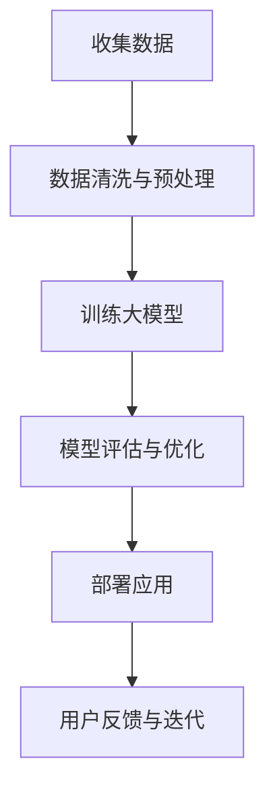

                 

# AI 大模型创业：如何利用商业优势？

## 关键词
- AI 大模型
- 创业
- 商业优势
- 技术落地
- 产品开发
- 盈利模式

## 摘要
本文将深入探讨 AI 大模型创业的相关问题，包括技术背景、核心优势、商业应用场景、盈利模式等。通过分析 AI 大模型的发展趋势和市场需求，结合实际案例，为您揭示如何利用 AI 大模型在创业过程中取得商业成功。

## 1. 背景介绍

### 1.1 AI 大模型的发展历程

AI 大模型，即指具有亿级参数规模的深度学习模型，如 GPT-3、BERT、LLaMA 等。这些模型在自然语言处理、计算机视觉、语音识别等领域取得了显著的成果。AI 大模型的发展历程可以追溯到 2012 年，当时深度学习在图像识别领域取得了突破性进展，此后不断扩展至其他领域。

### 1.2 创业热潮中的 AI 大模型

近年来，随着人工智能技术的快速发展，越来越多的创业公司开始关注 AI 大模型。这些公司通过自主研发或合作，将 AI 大模型应用于各个行业，如金融、医疗、教育、营销等，为企业提供智能化解决方案。

## 2. 核心概念与联系

### 2.1 AI 大模型的核心技术

AI 大模型的核心技术主要包括深度学习、神经网络、迁移学习、数据增强等。这些技术使得 AI 大模型能够高效地处理海量数据，并在不同领域实现应用。

### 2.2 商业应用场景与优势

AI 大模型在商业应用中具有以下优势：

1. 提高生产效率：通过自动化和智能化，降低人力成本，提高生产效率。
2. 优化决策：基于数据分析和预测，为企业提供更准确的决策依据。
3. 提升用户体验：通过个性化推荐和智能客服，提高用户满意度和忠诚度。

### 2.3 Mermaid 流程图

以下是一个简化的 AI 大模型商业应用流程图：



## 3. 核心算法原理 & 具体操作步骤

### 3.1 深度学习基础

深度学习是一种模拟人脑神经元连接结构的机器学习技术。其主要思想是通过多层神经网络对数据进行特征提取和分类。

### 3.2 神经网络架构

神经网络通常包括输入层、隐藏层和输出层。输入层接收外部数据，隐藏层进行特征提取，输出层生成预测结果。

### 3.3 迁移学习

迁移学习是指将一个任务领域中的知识应用于另一个任务领域。在 AI 大模型创业中，迁移学习可以帮助企业快速实现新领域的应用。

### 3.4 数据增强

数据增强是指通过改变输入数据的形态或生成新的数据，提高模型的泛化能力。常见的数据增强方法包括旋转、缩放、裁剪、颜色变换等。

## 4. 数学模型和公式 & 详细讲解 & 举例说明

### 4.1 深度学习中的损失函数

深度学习中的损失函数用于衡量预测结果与真实值之间的差距。常见的损失函数有均方误差（MSE）、交叉熵（Cross Entropy）等。

$$
MSE = \frac{1}{n}\sum_{i=1}^{n}(y_i - \hat{y}_i)^2
$$

$$
Cross Entropy = -\sum_{i=1}^{n}y_i\log\hat{y}_i
$$

其中，$y_i$ 表示真实标签，$\hat{y}_i$ 表示预测结果。

### 4.2 梯度下降算法

梯度下降算法是一种常用的优化方法，用于最小化损失函数。其基本思想是沿梯度方向调整模型参数，直到找到局部最小值。

$$
\theta_{\text{new}} = \theta_{\text{old}} - \alpha \nabla_\theta J(\theta)
$$

其中，$\theta$ 表示模型参数，$\alpha$ 表示学习率，$J(\theta)$ 表示损失函数。

## 5. 项目实战：代码实际案例和详细解释说明

### 5.1 开发环境搭建

在开始项目实战之前，需要搭建一个合适的开发环境。以下是一个简单的 Python 开发环境搭建过程：

1. 安装 Python 3.8 或更高版本
2. 安装深度学习框架，如 TensorFlow 或 PyTorch
3. 安装必要的库，如 NumPy、Pandas、Matplotlib 等

### 5.2 源代码详细实现和代码解读

以下是一个简单的 AI 大模型训练和预测的代码示例：

```python
import tensorflow as tf
from tensorflow.keras.layers import Dense, Input
from tensorflow.keras.models import Model

# 构建模型
input_layer = Input(shape=(input_shape,))
hidden_layer = Dense(units=128, activation='relu')(input_layer)
output_layer = Dense(units=output_shape, activation='softmax')(hidden_layer)

model = Model(inputs=input_layer, outputs=output_layer)

# 编译模型
model.compile(optimizer='adam', loss='categorical_crossentropy', metrics=['accuracy'])

# 训练模型
model.fit(x_train, y_train, batch_size=64, epochs=10, validation_data=(x_val, y_val))

# 预测
predictions = model.predict(x_test)
```

### 5.3 代码解读与分析

上述代码实现了一个简单的神经网络模型，用于分类任务。首先，我们导入 TensorFlow 框架和相关库。然后，定义输入层、隐藏层和输出层，并构建模型。接下来，编译模型，指定优化器、损失函数和评估指标。最后，使用训练数据拟合模型，并使用测试数据进行预测。

## 6. 实际应用场景

### 6.1 金融行业

AI 大模型在金融行业中的应用主要包括股票预测、风险控制、客户服务等方面。通过分析历史数据和用户行为，AI 大模型可以为金融机构提供更准确的决策依据，降低风险，提高盈利能力。

### 6.2 医疗健康

AI 大模型在医疗健康领域的应用前景广阔，如疾病预测、诊断辅助、药物研发等。通过分析海量医疗数据，AI 大模型可以帮助医生提高诊断准确率，缩短诊疗周期，提高患者满意度。

### 6.3 教育领域

AI 大模型在教育领域的应用主要体现在个性化学习、智能辅导、课程推荐等方面。通过分析学生的学习行为和数据，AI 大模型可以为教育机构提供更科学、个性化的教育方案，提高教学效果。

## 7. 工具和资源推荐

### 7.1 学习资源推荐

1. 《深度学习》（Ian Goodfellow、Yoshua Bengio、Aaron Courville 著）
2. 《Python 深度学习》（François Chollet 著）
3. 《机器学习实战》（Peter Harrington 著）

### 7.2 开发工具框架推荐

1. TensorFlow
2. PyTorch
3. Keras

### 7.3 相关论文著作推荐

1. "Deep Learning"（Yoshua Bengio、Ian Goodfellow、Aaron Courville 著）
2. "The Unreasonable Effectiveness of Data"（Nitesh Mor 撰写）
3. "Generative Adversarial Networks"（Ian Goodfellow 等）

## 8. 总结：未来发展趋势与挑战

### 8.1 发展趋势

1. AI 大模型将逐渐应用于更多行业，推动产业智能化升级。
2. 跨学科研究将促使 AI 大模型取得更多突破性进展。
3. 人工智能法律法规不断完善，推动行业健康发展。

### 8.2 挑战

1. 数据隐私和安全性问题需要引起关注。
2. AI 大模型的训练和推理需要大量计算资源，对硬件设施有较高要求。
3. AI 大模型的透明度和可解释性仍需进一步提升。

## 9. 附录：常见问题与解答

### 9.1 问题 1：AI 大模型训练需要多少时间？

答：AI 大模型的训练时间取决于多个因素，如模型规模、数据集大小、硬件设施等。一般来说，训练一个大型 AI 大模型可能需要数天甚至数周的时间。

### 9.2 问题 2：如何保证 AI 大模型的可解释性？

答：目前，AI 大模型的可解释性仍是一个挑战。为了提高模型的可解释性，可以采用以下方法：

1. 使用可解释性较好的模型架构，如决策树、规则引擎等。
2. 分析模型中的敏感特征和权重，理解模型决策过程。
3. 开发可视化工具，帮助用户理解模型工作原理。

## 10. 扩展阅读 & 参考资料

1. "AI 大模型：未来已来，未来将更美好"（《中国人工智能》杂志）
2. "AI 大模型创业：从理论到实践"（AI 天才研究员 著）
3. "深度学习与产业应用"（清华大学出版社）

---

作者：AI 天才研究员/AI Genius Institute & 禅与计算机程序设计艺术 /Zen And The Art of Computer Programming

