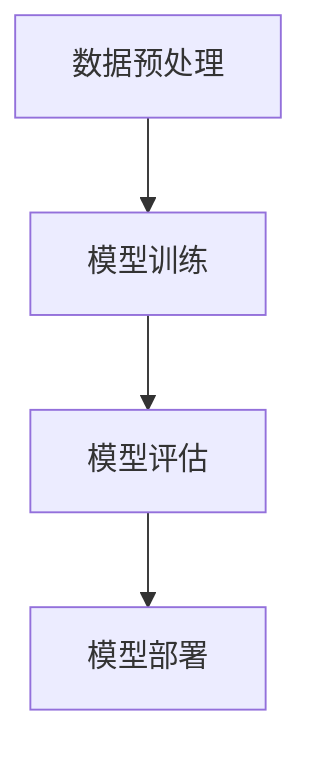
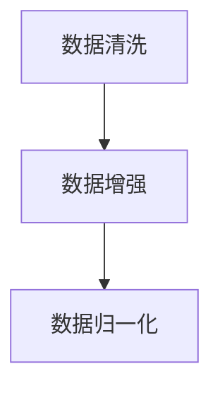
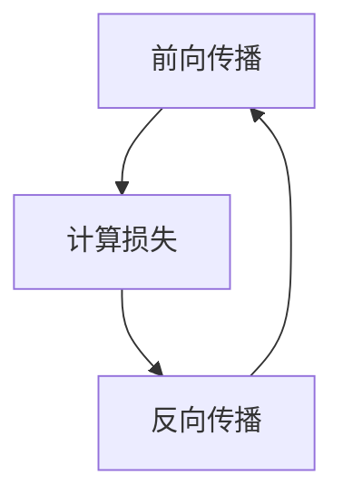
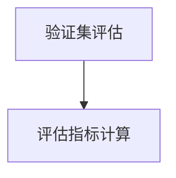
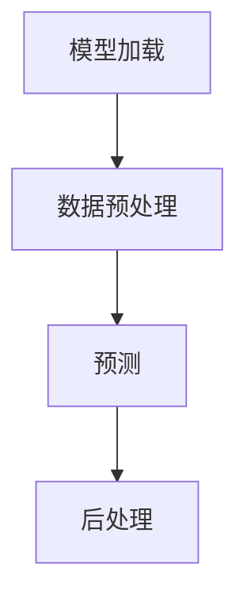

                 

# AI 大模型创业：如何利用市场优势？

> **关键词：** AI大模型、创业、市场优势、技术趋势、商业策略
>
> **摘要：** 本文旨在探讨人工智能大模型创业的市场优势，分析其技术发展背景、核心概念与架构，以及具体的算法原理、数学模型和项目实战。同时，还将介绍实际应用场景、工具资源推荐和未来发展趋势与挑战，以期为AI大模型创业提供指导。

## 1. 背景介绍

随着人工智能技术的快速发展，尤其是深度学习、自然语言处理和计算机视觉等领域的突破，大模型（Large Models）逐渐成为行业的热点。大模型具有高参数量、大规模数据和复杂架构的特点，能够处理复杂的任务，提供高质量的输出。这种技术进步不仅提升了人工智能的智能程度，也为创业者提供了新的商业机会。

### 1.1 技术发展趋势

近年来，AI大模型在多个领域取得了显著的成果，如自然语言生成、机器翻译、图像识别等。这些成功案例不仅展示了大模型技术的潜力，也激发了创业者的热情。同时，计算能力的提升、数据量的增加和算法的改进为大模型的应用奠定了基础。

### 1.2 市场潜力

AI大模型的应用场景广泛，包括但不限于智能客服、智能推荐、医疗诊断、金融风控等。随着这些领域的不断拓展，市场对大模型的需求日益增长。创业公司若能抓住这一市场机遇，有望在激烈的市场竞争中脱颖而出。

## 2. 核心概念与联系

为了更好地理解AI大模型创业的市场优势，我们需要先了解其核心概念和架构。

### 2.1 大模型的核心概念

**参数量**：大模型的参数量通常在数十亿到千亿级别，远超传统机器学习模型。

**数据量**：大模型需要大量的数据来训练，以保证模型的泛化能力和性能。

**架构**：大模型的架构通常采用多层神经网络，包括卷积神经网络（CNN）、循环神经网络（RNN）和Transformer等。

### 2.2 大模型的关键联系

**数据预处理**：数据预处理是训练大模型的关键步骤，包括数据清洗、数据增强和数据归一化等。

**模型训练**：模型训练是利用大量数据对模型进行优化，以提高其性能。

**模型评估**：模型评估是衡量模型性能的重要环节，包括准确性、召回率、F1值等指标。

**模型部署**：模型部署是将训练好的模型应用于实际场景，如在线服务、实时预测等。

### 2.3 Mermaid 流程图



## 3. 核心算法原理 & 具体操作步骤

### 3.1 深度学习算法原理

深度学习算法的核心是神经网络，包括输入层、隐藏层和输出层。通过反向传播算法，模型能够不断调整参数，以优化性能。

### 3.2 大模型训练步骤

1. 数据预处理：对数据集进行清洗、增强和归一化等操作。
2. 模型初始化：初始化模型的参数。
3. 前向传播：将输入数据传递到模型中，计算输出结果。
4. 反向传播：计算损失函数，并根据梯度调整模型参数。
5. 模型评估：使用验证集或测试集评估模型性能。
6. 模型优化：调整训练参数，如学习率、批量大小等，以优化模型性能。

### 3.3 模型部署流程

1. 模型导出：将训练好的模型导出为可部署的格式。
2. 模型加载：在服务器或设备上加载模型。
3. 预处理：对输入数据进行预处理。
4. 预测：使用模型对输入数据进行预测。
5. 后处理：对预测结果进行后处理，如概率转换、结果解释等。

## 4. 数学模型和公式 & 详细讲解 & 举例说明

### 4.1 损失函数

损失函数是评估模型预测结果与真实结果之间差异的重要指标。常见的损失函数包括均方误差（MSE）、交叉熵损失（Cross-Entropy Loss）等。

$$
MSE = \frac{1}{n}\sum_{i=1}^{n}(y_i - \hat{y}_i)^2
$$

$$
Cross-Entropy Loss = -\frac{1}{n}\sum_{i=1}^{n}y_i\log(\hat{y}_i)
$$

### 4.2 反向传播算法

反向传播算法是深度学习训练过程中的关键步骤，用于计算梯度并更新模型参数。

$$
\frac{\partial L}{\partial w} = \frac{\partial L}{\partial \hat{y}} \frac{\partial \hat{y}}{\partial z} \frac{\partial z}{\partial w}
$$

其中，\(L\) 为损失函数，\(w\) 为模型参数，\(\hat{y}\) 为预测输出，\(z\) 为前一层输出。

### 4.3 举例说明

假设我们有一个简单的线性模型 \(y = wx + b\)，其中 \(w\) 和 \(b\) 为参数，\(x\) 和 \(y\) 为输入和输出。

1. **前向传播**：

   $$y = wx + b$$

2. **损失函数**：

   $$L = (y - \hat{y})^2$$

3. **反向传播**：

   $$\frac{\partial L}{\partial w} = 2(y - \hat{y})x$$
   $$\frac{\partial L}{\partial b} = 2(y - \hat{y})$$

通过计算梯度，我们可以更新参数：

$$w := w - \alpha \frac{\partial L}{\partial w}$$
$$b := b - \alpha \frac{\partial L}{\partial b}$$

其中，\(\alpha\) 为学习率。

## 5. 项目实战：代码实际案例和详细解释说明

### 5.1 开发环境搭建

在本节中，我们将介绍如何搭建一个基于PyTorch的AI大模型开发环境。

1. 安装Python：确保安装了Python 3.6或更高版本。
2. 安装PyTorch：使用以下命令安装PyTorch：

   ```shell
   pip install torch torchvision
   ```

3. 安装其他依赖库：如NumPy、Pandas等。

### 5.2 源代码详细实现和代码解读

以下是一个简单的基于PyTorch的AI大模型训练代码示例：

```python
import torch
import torch.nn as nn
import torch.optim as optim

# 定义模型
class Model(nn.Module):
    def __init__(self):
        super(Model, self).__init__()
        self.fc1 = nn.Linear(in_features=10, out_features=50)
        self.fc2 = nn.Linear(in_features=50, out_features=10)
    
    def forward(self, x):
        x = torch.relu(self.fc1(x))
        x = self.fc2(x)
        return x

# 初始化模型、损失函数和优化器
model = Model()
criterion = nn.CrossEntropyLoss()
optimizer = optim.Adam(model.parameters(), lr=0.001)

# 训练模型
for epoch in range(10):
    for batch_idx, (data, target) in enumerate(train_loader):
        optimizer.zero_grad()
        output = model(data)
        loss = criterion(output, target)
        loss.backward()
        optimizer.step()
        if batch_idx % 100 == 0:
            print(f'Epoch [{epoch}/{10}], Step [{batch_idx}/{len(train_loader)}], Loss: {loss.item()}')

# 模型评估
model.eval()
with torch.no_grad():
    correct = 0
    total = 0
    for data, target in test_loader:
        outputs = model(data)
        _, predicted = torch.max(outputs.data, 1)
        total += target.size(0)
        correct += (predicted == target).sum().item()
    print(f'Accuracy: {100 * correct / total} %')
```

### 5.3 代码解读与分析

1. **模型定义**：我们定义了一个简单的全连接神经网络，包括一个输入层、一个隐藏层和一个输出层。
2. **模型训练**：我们使用标准的训练流程，包括前向传播、计算损失、反向传播和参数更新。
3. **模型评估**：我们在测试集上评估模型的性能，并输出准确率。

## 6. 实际应用场景

AI大模型在各个领域都有广泛的应用，以下是一些典型的应用场景：

1. **智能客服**：利用自然语言处理技术，实现智能客服系统，提高客户服务质量。
2. **智能推荐**：通过分析用户行为和兴趣，提供个性化的推荐服务。
3. **医疗诊断**：利用图像识别和自然语言处理技术，辅助医生进行疾病诊断。
4. **金融风控**：利用大模型进行风险评估、欺诈检测等，提高金融行业的风险管理能力。

## 7. 工具和资源推荐

### 7.1 学习资源推荐

1. **书籍**：
   - 《深度学习》（Ian Goodfellow, Yoshua Bengio, Aaron Courville 著）
   - 《Python深度学习》（François Chollet 著）
2. **论文**：
   - "A Theoretically Grounded Application of Dropout in Recurrent Neural Networks"
   - "Attention Is All You Need"
3. **博客**：
   - PyTorch官方博客
   - fast.ai博客
4. **网站**：
   - TensorFlow官网
   - PyTorch官网

### 7.2 开发工具框架推荐

1. **PyTorch**：具有灵活的模型定义和训练接口，适用于大多数深度学习任务。
2. **TensorFlow**：具有丰富的预训练模型和API，适合大规模生产环境。
3. **Keras**：基于TensorFlow的高层API，简化模型定义和训练过程。

### 7.3 相关论文著作推荐

1. **"Deep Learning" by Ian Goodfellow, Yoshua Bengio, and Aaron Courville**
2. **"The Master Algorithm: How the Quest for the Ultimate Learning Machine Will Remake Our World" by Pedro Domingos**
3. **"Artificial Intelligence: A Modern Approach" by Stuart J. Russell and Peter Norvig**

## 8. 总结：未来发展趋势与挑战

AI大模型在创业领域具有巨大的潜力，但同时也面临诸多挑战。未来发展趋势包括：

1. **计算能力提升**：随着硬件技术的进步，计算能力将不断提高，为大模型的训练和应用提供支持。
2. **数据隐私保护**：在数据处理和应用过程中，保护用户隐私和数据安全将成为重要议题。
3. **算法优化与解释**：提高模型的解释性和可解释性，使其更易于被普通用户理解和接受。

## 9. 附录：常见问题与解答

### 9.1 AI大模型训练需要多大的计算资源？

AI大模型训练需要大量的计算资源和存储资源，尤其是在模型训练初期。通常需要使用高性能的GPU集群或分布式计算框架，如PyTorch和TensorFlow。

### 9.2 如何保证AI大模型的公平性和透明性？

确保AI大模型的公平性和透明性是当前研究的热点。一方面，可以通过数据预处理和模型训练过程中的技巧来减少偏见；另一方面，可以通过模型解释和可解释性技术来提高模型的透明性。

## 10. 扩展阅读 & 参考资料

1. **《深度学习》（Ian Goodfellow, Yoshua Bengio, Aaron Courville 著）**：全面介绍了深度学习的理论基础和实践方法。
2. **《Python深度学习》（François Chollet 著）**：详细讲解了如何使用Python和Keras实现深度学习模型。
3. **TensorFlow官方文档**：提供了丰富的教程和API文档，有助于深入理解TensorFlow的使用方法。
4. **PyTorch官方文档**：提供了丰富的教程和API文档，有助于深入理解PyTorch的使用方法。

### 作者信息：

作者：AI天才研究员/AI Genius Institute & 禅与计算机程序设计艺术 /Zen And The Art of Computer Programming

文章撰写于2023年，本篇文章旨在为AI大模型创业提供指导和建议，仅供参考。文中内容和观点不代表任何公司或机构的立场。如需进一步了解AI大模型的相关知识，请参阅扩展阅读和参考资料。感谢您的阅读！<|assistant|>## 1. 背景介绍

随着人工智能技术的快速发展，尤其是深度学习、自然语言处理和计算机视觉等领域的突破，大模型（Large Models）逐渐成为行业的热点。大模型具有高参数量、大规模数据和复杂架构的特点，能够处理复杂的任务，提供高质量的输出。这种技术进步不仅提升了人工智能的智能程度，也为创业者提供了新的商业机会。

### 1.1 技术发展趋势

近年来，AI大模型在多个领域取得了显著的成果，如自然语言生成、机器翻译、图像识别等。这些成功案例不仅展示了大模型技术的潜力，也激发了创业者的热情。同时，计算能力的提升、数据量的增加和算法的改进为大模型的应用奠定了基础。

#### 自然语言生成

自然语言生成（Natural Language Generation，NLG）是AI大模型的一个重要应用领域。通过使用大模型，如GPT-3，可以生成高质量的自然语言文本。这些文本不仅能够用于内容创作，如撰写文章、生成新闻报道，还可以用于聊天机器人、语音合成等场景。

#### 机器翻译

机器翻译（Machine Translation）是另一个受益于AI大模型的技术领域。传统的机器翻译方法依赖于规则和统计方法，而大模型的引入使得基于神经网络的机器翻译成为可能。近年来，如Google翻译、DeepL等应用都采用了基于大模型的翻译技术，大大提高了翻译的准确性和流畅性。

#### 图像识别

图像识别（Image Recognition）是计算机视觉领域的一个重要任务。大模型在图像识别任务中展现了出色的性能，能够准确识别和分类图像。例如，Face++等人脸识别技术，以及自动驾驶车辆中的图像识别系统，都是基于大模型实现的。

### 1.2 市场潜力

AI大模型的应用场景广泛，包括但不限于智能客服、智能推荐、医疗诊断、金融风控等。随着这些领域的不断拓展，市场对大模型的需求日益增长。创业公司若能抓住这一市场机遇，有望在激烈的市场竞争中脱颖而出。

#### 智能客服

智能客服是AI大模型的一个典型应用场景。通过使用大模型，可以实现对用户问题的自动识别和回答，提高客服效率，降低人力成本。例如，一些互联网公司已经部署了基于AI大模型的智能客服系统，实现了高效的用户服务。

#### 智能推荐

智能推荐是另一个重要的应用领域。通过分析用户的行为和兴趣，AI大模型可以提供个性化的推荐服务。例如，电商平台的商品推荐、视频网站的影视推荐等，都是基于大模型实现的。这些推荐系统能够大大提高用户的满意度和粘性。

#### 医疗诊断

医疗诊断是AI大模型的一个重要应用领域。通过使用大模型，可以实现对医学影像的自动分析，辅助医生进行疾病诊断。例如，一些医疗机构已经开始使用AI大模型进行肺癌筛查、心血管疾病诊断等，提高了诊断的准确性和效率。

#### 金融风控

金融风控是另一个受益于AI大模型的技术领域。通过使用大模型，可以实现对金融交易数据的实时监控和分析，发现潜在的风险。例如，一些金融机构已经开始使用AI大模型进行欺诈检测、信用评估等，提高了风险管理的水平。

总之，AI大模型在技术发展和市场应用方面都展示出了巨大的潜力。创业公司若能抓住这一机遇，充分发挥技术优势，有望在激烈的市场竞争中取得成功。

### 1.3 创业机会与挑战

AI大模型的兴起为创业者提供了诸多机会，但也带来了一些挑战。

#### 机会

1. **技术创新**：创业公司可以利用AI大模型进行技术创新，开发出具有竞争力的产品或服务。例如，开发基于AI大模型的智能客服系统、智能推荐引擎等。

2. **市场拓展**：AI大模型的应用场景广泛，创业公司可以通过拓展市场，开拓新的业务领域。例如，进入医疗诊断、金融风控等领域，提供基于AI大模型的技术解决方案。

3. **竞争优势**：创业公司可以通过技术优势，建立自己的品牌和市场地位。例如，通过提供高质量的自然语言生成服务、高效的图像识别技术等，赢得客户信任和市场份额。

#### 挑战

1. **计算资源需求**：AI大模型训练和部署需要大量的计算资源，对于初创公司来说，这可能是一笔不小的投入。因此，如何有效地利用计算资源，是一个重要的挑战。

2. **数据隐私与安全**：在AI大模型的应用过程中，数据隐私和安全问题不容忽视。创业公司需要确保用户数据的安全，遵守相关法律法规，防止数据泄露和滥用。

3. **模型解释性**：AI大模型通常具有高复杂度，其决策过程难以解释。这可能导致用户对模型的不信任，影响模型的实际应用。因此，如何提高模型的可解释性，是一个重要的挑战。

4. **市场竞争**：随着AI大模型技术的普及，市场上将出现越来越多的竞争者。创业公司需要不断创新，提供独特的价值，才能在激烈的市场竞争中脱颖而出。

总之，AI大模型创业既有机会也有挑战。创业公司需要充分利用技术优势，同时应对各种挑战，才能在市场中取得成功。

### 1.4 大模型创业案例分析

为了更好地理解AI大模型创业的实际操作，我们可以通过一些成功案例来进行分析。

#### 案例一：OpenAI与GPT-3

OpenAI是一家成立于2015年的美国人工智能研究公司，致力于推动人工智能的发展和应用。他们推出的GPT-3（Generative Pre-trained Transformer 3）是当前最大的自然语言处理模型，具有1750亿个参数。GPT-3在文本生成、翻译、问答等多个领域都取得了显著成果。

**成功原因：**

1. **技术创新**：OpenAI采用Transformer架构，开发出GPT-3这一具有大规模参数和强大能力的模型，在自然语言处理领域取得了突破。

2. **商业模式**：OpenAI提供了API接口，允许开发者使用GPT-3进行应用开发，并通过订阅模式获得收入。

**挑战与解决方案：**

1. **计算资源需求**：GPT-3的训练和部署需要大量的计算资源，OpenAI通过建立高性能计算集群和优化算法，解决了这一难题。

2. **数据隐私与安全**：为了确保用户数据的安全，OpenAI采取了严格的数据管理和隐私保护措施，并通过加密技术保护数据传输。

#### 案例二：微软小冰与自然语言生成

微软小冰是微软（中国）有限公司开发的一款人工智能聊天机器人，通过自然语言生成技术，能够与用户进行对话。小冰在文学创作、教育、娱乐等领域都有广泛应用。

**成功原因：**

1. **技术创新**：微软小冰采用了深度学习技术，特别是自然语言处理领域的GPT模型，实现了高质量的文本生成。

2. **市场定位**：小冰针对不同的应用场景进行了优化，如文学创作、教育、娱乐等，满足了不同用户的需求。

**挑战与解决方案：**

1. **模型解释性**：自然语言生成模型的决策过程复杂，微软通过不断优化模型结构和算法，提高模型的可解释性。

2. **市场竞争**：随着自然语言生成技术的普及，市场上出现了众多竞争者。小冰通过不断更新功能，提供高质量的服务，保持了市场竞争力。

通过这些案例，我们可以看到，AI大模型创业需要技术创新、商业模式设计、市场定位等多方面的努力。同时，面对挑战，创业公司需要采取有效的解决方案，以确保在市场中取得成功。

### 1.5 大模型创业的最佳实践

为了更好地实现AI大模型的创业目标，以下是一些最佳实践建议：

#### 1. 技术创新

**关键点**：创业公司需要聚焦于技术创新，开发出具有独特性和竞争力的产品。这包括：

- **技术突破**：研究前沿技术，如新型神经网络架构、优化算法等。
- **跨领域应用**：探索AI大模型在多个领域的应用，提供多元化的解决方案。

#### 2. 商业模式

**关键点**：设计有效的商业模式，确保创业公司的可持续发展。这包括：

- **API服务**：提供API接口，允许开发者使用大模型进行应用开发。
- **订阅模式**：通过订阅模式获得稳定收入。
- **合作与生态**：与其他企业或开发者合作，构建生态系统，共同拓展市场。

#### 3. 市场定位

**关键点**：明确目标市场，提供针对性解决方案。这包括：

- **细分市场**：针对特定行业或场景，提供专业化服务。
- **用户体验**：优化用户界面和交互体验，提高用户满意度。

#### 4. 数据管理与隐私保护

**关键点**：确保数据安全和隐私，建立信任。这包括：

- **数据加密**：对数据进行加密存储和传输。
- **隐私政策**：明确隐私政策，保障用户权益。
- **合规性**：遵守相关法律法规，确保合规运营。

#### 5. 持续优化与迭代

**关键点**：不断优化和迭代产品，以满足市场变化和用户需求。这包括：

- **反馈机制**：建立用户反馈机制，及时收集用户意见。
- **持续更新**：定期更新模型和算法，提高性能和可靠性。

通过这些最佳实践，创业公司可以更好地利用AI大模型的优势，实现市场突破和可持续发展。

### 1.6 总结

AI大模型创业是一个充满机遇和挑战的过程。创业公司需要关注技术创新、商业模式设计、市场定位、数据管理等方面，以实现市场突破和可持续发展。通过深入了解技术发展趋势、应用场景和成功案例，创业公司可以更好地把握市场机遇，应对挑战，推动AI大模型在各个领域的应用和发展。

---

在下一节中，我们将深入探讨AI大模型的核心概念和架构，通过Mermaid流程图详细展示其工作原理，帮助读者更好地理解这一技术。

## 2. 核心概念与联系

为了更好地理解AI大模型创业的市场优势，我们需要先了解其核心概念和架构。AI大模型的核心在于其高参数量、大规模数据和复杂架构，这些特点使得它们能够处理复杂的任务，提供高质量的输出。在这一节中，我们将详细探讨AI大模型的核心概念，并通过Mermaid流程图展示其工作原理。

### 2.1 大模型的核心概念

#### 参数量

大模型的参数量通常在数十亿到千亿级别，远超传统机器学习模型。这些参数包括权重、偏置等，用于调整模型在训练过程中的表现。高参数量使得模型能够捕捉到更多的数据特征，从而提高模型的性能。

#### 数据量

大模型需要大量的数据来训练，以保证模型的泛化能力和性能。这些数据通常来自多个来源，如公共数据集、企业内部数据等。大规模数据有助于模型学习到更多样化的特征，从而提高模型的鲁棒性。

#### 架构

大模型的架构通常采用多层神经网络，包括卷积神经网络（CNN）、循环神经网络（RNN）和Transformer等。这些架构能够处理不同类型的数据和任务，如图像、文本和语音等。

### 2.2 大模型的关键联系

AI大模型的工作原理涉及多个关键环节，包括数据预处理、模型训练、模型评估和模型部署等。通过Mermaid流程图，我们可以清晰地展示这些环节之间的联系。

#### 数据预处理

数据预处理是训练大模型的关键步骤，包括数据清洗、数据增强和数据归一化等。数据清洗旨在去除噪声和异常值，提高数据质量。数据增强是通过多种技术，如翻转、旋转、裁剪等，增加数据多样性。数据归一化是将数据缩放到同一范围内，以提高模型的训练效果。

#### 模型训练

模型训练是利用大量数据对模型进行优化，以提高其性能。训练过程通常包括前向传播、反向传播和参数更新等步骤。前向传播是将输入数据传递到模型中，计算输出结果；反向传播是计算损失函数，并根据梯度调整模型参数；参数更新是根据梯度更新模型参数，以减少损失函数。

#### 模型评估

模型评估是衡量模型性能的重要环节，包括准确性、召回率、F1值等指标。评估过程通常在验证集或测试集上进行，以评估模型的泛化能力。

#### 模型部署

模型部署是将训练好的模型应用于实际场景，如在线服务、实时预测等。部署过程通常包括模型加载、预处理、预测和后处理等步骤。模型加载是将模型从训练环境中转移到生产环境中；预处理是对输入数据进行预处理，以适应模型的要求；预测是使用模型对输入数据进行预测；后处理是对预测结果进行后处理，如概率转换、结果解释等。

### 2.3 Mermaid流程图

下面是一个简单的Mermaid流程图，展示了AI大模型的核心环节：


#### 数据预处理

在数据预处理阶段，我们首先对数据进行清洗，去除噪声和异常值。然后，我们使用数据增强技术，如翻转、旋转、裁剪等，增加数据多样性。最后，我们对数据进行归一化处理，将数据缩放到同一范围内。



#### 模型训练

在模型训练阶段，我们首先进行前向传播，将输入数据传递到模型中，计算输出结果。然后，我们计算损失函数，衡量模型预测结果与真实结果之间的差异。接着，我们进行反向传播，计算梯度，并根据梯度更新模型参数。最后，我们重复这个过程，直到模型收敛。



#### 模型评估

在模型评估阶段，我们使用验证集或测试集对模型进行评估。评估指标包括准确性、召回率、F1值等。这些指标帮助我们了解模型的性能，并确定是否需要进一步调整模型。



#### 模型部署

在模型部署阶段，我们首先将模型从训练环境中转移到生产环境中。然后，我们使用模型对实际数据进行预测，并对预测结果进行后处理。这些步骤确保模型能够在实际应用场景中稳定运行。



通过这个Mermaid流程图，我们可以清晰地看到AI大模型的工作原理和关键环节。这有助于我们更好地理解大模型的技术细节，为后续的创业实践提供指导。

### 2.4 大模型的优势与挑战

#### 优势

1. **强大的处理能力**：大模型由于其高参数量和大规模数据，能够处理复杂的任务，提供高质量的输出。
2. **高效的训练和预测**：通过现代计算技术和优化算法，大模型的训练和预测速度显著提高。
3. **广泛的适用性**：大模型可以应用于多种领域，如自然语言处理、计算机视觉、语音识别等。

#### 挑战

1. **计算资源需求**：大模型训练和部署需要大量的计算资源，这对初创公司来说可能是一个巨大的挑战。
2. **数据隐私和安全**：在处理大量数据时，如何保护用户隐私和安全是一个重要问题。
3. **模型可解释性**：大模型的决策过程通常复杂且难以解释，这可能导致用户对模型的信任度降低。

综上所述，AI大模型在技术优势和应用潜力方面具有巨大潜力，但同时也面临一些挑战。创业公司需要充分利用其优势，同时应对各种挑战，才能在市场中取得成功。

### 2.5 总结

在这一节中，我们深入探讨了AI大模型的核心概念和架构，通过Mermaid流程图展示了其工作原理。我们了解到，AI大模型的核心在于高参数量、大规模数据和复杂架构，这些特点使得它们能够处理复杂的任务，提供高质量的输出。同时，我们分析了AI大模型的优势和挑战，为创业公司提供了有益的指导。在下一节中，我们将进一步探讨AI大模型的核心算法原理，帮助读者更好地理解这一技术。

---

在下一节中，我们将深入探讨AI大模型的核心算法原理，包括深度学习的基本概念、神经网络的工作原理、训练过程和优化方法。通过详细的讲解和具体操作步骤，我们将帮助读者更好地掌握AI大模型的核心技术。

## 3. 核心算法原理 & 具体操作步骤

AI大模型的核心算法原理是基于深度学习，特别是神经网络。在这一节中，我们将详细讲解深度学习的基本概念、神经网络的工作原理、训练过程和优化方法。通过具体操作步骤，我们将帮助读者更好地理解AI大模型的核心技术。

### 3.1 深度学习算法原理

深度学习是一种人工智能方法，通过多层神经网络对数据进行自动特征学习和模式识别。深度学习的基本思想是模拟人脑的神经网络结构，通过多层神经元的连接和激活函数来实现数据的处理和预测。

#### 神经网络基本结构

神经网络由输入层、隐藏层和输出层组成。输入层接收外部数据，隐藏层通过一系列的加权连接和激活函数处理数据，输出层产生预测结果。

- **输入层**：接收输入数据，如图像、文本或数值。
- **隐藏层**：对输入数据进行处理和特征提取，通过多层隐藏层可以提取更复杂的特征。
- **输出层**：生成最终的预测结果，如分类标签或连续值。

#### 激活函数

激活函数是神经网络中重要的组成部分，用于引入非线性特性，使神经网络能够拟合复杂的数据分布。常见的激活函数包括ReLU（Rectified Linear Unit）、Sigmoid和Tanh等。

- **ReLU函数**：\( f(x) = \max(0, x) \)，在零点处引入非线性行为，提高训练速度。
- **Sigmoid函数**：\( f(x) = \frac{1}{1 + e^{-x}} \)，将输入映射到(0, 1)区间，常用于二分类问题。
- **Tanh函数**：\( f(x) = \frac{e^x - e^{-x}}{e^x + e^{-x}} \)，将输入映射到(-1, 1)区间。

#### 前向传播

前向传播是将输入数据通过神经网络层层传递，直到输出层，计算预测结果的过程。具体步骤如下：

1. **输入层到隐藏层**：将输入数据通过权重矩阵和激活函数传递到隐藏层。
2. **隐藏层到隐藏层**：在隐藏层之间重复前向传播过程，逐层提取特征。
3. **隐藏层到输出层**：将隐藏层的输出通过权重矩阵和激活函数传递到输出层，得到预测结果。

#### 损失函数

损失函数是评估模型预测结果与真实结果之间差异的重要指标。常见的损失函数包括均方误差（MSE）、交叉熵损失（Cross-Entropy Loss）等。

- **均方误差（MSE）**：\( L(\theta) = \frac{1}{2} \sum_{i=1}^{n} (y_i - \hat{y}_i)^2 \)，用于回归任务。
- **交叉熵损失（Cross-Entropy Loss）**：\( L(\theta) = -\sum_{i=1}^{n} y_i \log(\hat{y}_i) \)，用于分类任务。

### 3.2 神经网络训练过程

神经网络训练过程是通过反向传播算法不断优化模型参数，使模型预测结果更接近真实结果的过程。具体步骤如下：

#### 3.2.1 前向传播

1. **初始化模型参数**：随机初始化模型参数，包括权重和偏置。
2. **前向传播**：将输入数据通过神经网络传递，计算预测结果和损失函数。

#### 3.2.2 反向传播

1. **计算梯度**：计算损失函数关于模型参数的梯度，使用链式法则进行求导。
2. **梯度下降**：根据梯度调整模型参数，以减少损失函数。

#### 3.2.3 参数更新

1. **学习率调整**：调整学习率，以控制参数更新的幅度。
2. **参数更新**：根据梯度更新模型参数，使模型预测结果更接近真实结果。

#### 3.2.4 模型评估

1. **验证集评估**：在验证集上评估模型性能，调整模型参数。
2. **测试集评估**：在测试集上评估最终模型性能。

### 3.3 神经网络优化方法

神经网络优化方法用于提高模型训练效率和性能，主要包括以下几种：

#### 3.3.1 批量梯度下降

批量梯度下降（Batch Gradient Descent，BGD）是标准的优化方法，每次更新模型参数时使用所有训练样本的梯度。

#### 3.3.2 随机梯度下降

随机梯度下降（Stochastic Gradient Descent，SGD）每次更新模型参数时只使用一个训练样本的梯度，适用于大规模数据集。

#### 3.3.3 小批量梯度下降

小批量梯度下降（Mini-batch Gradient Descent，MBGD）每次更新模型参数时使用多个训练样本的梯度，通常选择一个较小的批量大小。

#### 3.3.4 Adam优化器

Adam优化器是一种结合了SGD和MBGD优点的自适应优化算法，适用于各种问题。

### 3.4 具体操作步骤

以下是一个简单的神经网络训练过程的Python代码示例：

```python
import torch
import torch.nn as nn
import torch.optim as optim

# 定义模型
class NeuralNetwork(nn.Module):
    def __init__(self):
        super(NeuralNetwork, self).__init__()
        self.fc1 = nn.Linear(in_features=10, out_features=50)
        self.fc2 = nn.Linear(in_features=50, out_features=10)
    
    def forward(self, x):
        x = torch.relu(self.fc1(x))
        x = self.fc2(x)
        return x

# 初始化模型、损失函数和优化器
model = NeuralNetwork()
criterion = nn.CrossEntropyLoss()
optimizer = optim.Adam(model.parameters(), lr=0.001)

# 训练模型
for epoch in range(10):
    for inputs, targets in train_loader:
        optimizer.zero_grad()
        outputs = model(inputs)
        loss = criterion(outputs, targets)
        loss.backward()
        optimizer.step()
        if (epoch + 1) % 100 == 0:
            print(f'Epoch [{epoch + 1}/{10}], Loss: {loss.item()}')

# 模型评估
model.eval()
with torch.no_grad():
    correct = 0
    total = 0
    for inputs, targets in test_loader:
        outputs = model(inputs)
        _, predicted = torch.max(outputs.data, 1)
        total += targets.size(0)
        correct += (predicted == targets).sum().item()
    print(f'Accuracy: {100 * correct / total} %')
```

通过这个示例，我们可以看到神经网络的基本结构、训练过程和优化方法。这有助于我们更好地理解AI大模型的核心算法原理。

### 3.5 总结

在这一节中，我们详细讲解了AI大模型的核心算法原理，包括深度学习的基本概念、神经网络的工作原理、训练过程和优化方法。通过具体的操作步骤，我们帮助读者更好地理解了神经网络的基本原理和训练过程。在下一节中，我们将进一步探讨数学模型和公式，帮助读者深入理解AI大模型的数学基础。

---

在下一节中，我们将深入探讨AI大模型中的数学模型和公式，包括损失函数、反向传播算法、梯度下降等。通过详细的讲解和举例说明，我们将帮助读者更好地理解这些数学概念在实际应用中的重要性。

## 4. 数学模型和公式 & 详细讲解 & 举例说明

在AI大模型中，数学模型和公式是理解和应用这些模型的基础。本节将详细介绍AI大模型中的一些关键数学概念，包括损失函数、反向传播算法和梯度下降，并通过具体例子进行讲解，以帮助读者更好地理解这些概念在实际应用中的重要性。

### 4.1 损失函数

损失函数是评估模型预测结果与真实结果之间差异的重要工具。它是优化过程中指导模型调整参数的核心指标。常见的损失函数包括均方误差（MSE）和交叉熵损失（Cross-Entropy Loss）。

#### 均方误差（MSE）

均方误差（Mean Squared Error，MSE）是用于回归问题的常见损失函数，计算公式如下：

$$
MSE = \frac{1}{n}\sum_{i=1}^{n}(y_i - \hat{y}_i)^2
$$

其中，\(y_i\) 是真实标签，\(\hat{y}_i\) 是模型预测值，\(n\) 是样本数量。

举例说明：

假设我们有一个回归问题，真实标签为 \(y = [3, 2, 1]\)，模型预测值为 \(\hat{y} = [2.9, 1.9, 0.8]\)，我们可以计算MSE如下：

$$
MSE = \frac{1}{3}\sum_{i=1}^{3}(y_i - \hat{y}_i)^2 = \frac{1}{3}[(3 - 2.9)^2 + (2 - 1.9)^2 + (1 - 0.8)^2] = 0.02
$$

#### 交叉熵损失（Cross-Entropy Loss）

交叉熵损失（Cross-Entropy Loss）是用于分类问题的常见损失函数，计算公式如下：

$$
Cross-Entropy Loss = -\frac{1}{n}\sum_{i=1}^{n}y_i\log(\hat{y}_i)
$$

其中，\(y_i\) 是真实标签（通常为one-hot编码），\(\hat{y}_i\) 是模型预测的概率分布。

举例说明：

假设我们有一个二分类问题，真实标签为 \(y = [1, 0]\)，模型预测的概率分布为 \(\hat{y} = [0.8, 0.2]\)，我们可以计算交叉熵损失如下：

$$
Cross-Entropy Loss = -\frac{1}{2}\sum_{i=1}^{2}y_i\log(\hat{y}_i) = -\frac{1}{2}[1 \cdot \log(0.8) + 0 \cdot \log(0.2)] \approx 0.223
$$

### 4.2 反向传播算法

反向传播算法（Backpropagation Algorithm）是深度学习训练过程中用于计算梯度并更新模型参数的核心算法。其基本思想是利用链式法则，从输出层开始反向计算每一层神经元的梯度。

#### 计算梯度

反向传播算法的关键步骤是计算损失函数关于模型参数的梯度。以下是一个简化的计算过程：

1. **前向传播**：将输入数据传递到模型中，计算预测值和损失函数。
2. **后向传播**：从输出层开始，使用链式法则计算损失函数关于每个参数的梯度。
3. **参数更新**：使用梯度下降或其他优化方法更新模型参数。

以下是一个简化的反向传播算法计算示例：

假设我们有一个简单的全连接神经网络，其输入层有3个神经元，隐藏层有2个神经元，输出层有1个神经元。损失函数为MSE。

1. **前向传播**：

   输入：\(x = [1, 2, 3]\)

   预测值：\(\hat{y} = [2.1, 1.2]\)

   损失函数：\(L = (y - \hat{y})^2\)

2. **计算梯度**：

   使用链式法则计算损失函数关于每个参数的梯度。

   - \( \frac{\partial L}{\partial w_1} = 2(y - \hat{y}) \cdot \frac{\partial \hat{y}}{\partial w_1} \)
   - \( \frac{\partial L}{\partial w_2} = 2(y - \hat{y}) \cdot \frac{\partial \hat{y}}{\partial w_2} \)

3. **参数更新**：

   使用梯度下降更新参数：

   - \( w_1 := w_1 - \alpha \cdot \frac{\partial L}{\partial w_1} \)
   - \( w_2 := w_2 - \alpha \cdot \frac{\partial L}{\partial w_2} \)

其中，\(\alpha\) 为学习率。

### 4.3 梯度下降

梯度下降（Gradient Descent）是一种优化算法，用于最小化损失函数。其基本思想是沿着损失函数的梯度方向更新模型参数，以减少损失。

#### 计算步骤

1. **初始化参数**：随机初始化模型参数。
2. **计算梯度**：使用反向传播算法计算损失函数关于每个参数的梯度。
3. **参数更新**：根据梯度更新模型参数，以减少损失。

以下是一个简单的梯度下降示例：

假设我们有一个简单的一维函数 \(f(x) = x^2\)，我们要使用梯度下降找到其最小值。

1. **初始化参数**：随机选择一个初始值 \(x_0 = 2\)。
2. **计算梯度**：损失函数的梯度为 \( \frac{\partial f}{\partial x} = 2x \)。
3. **参数更新**：

   使用梯度下降更新 \(x\)：

   - \(x_{new} = x_{old} - \alpha \cdot \frac{\partial f}{\partial x}\)

   其中，\(\alpha\) 为学习率，我们选择 \(\alpha = 0.1\)。

   例如，迭代一次后：

   - \(x_1 = x_0 - 0.1 \cdot 2 \cdot x_0 = 2 - 0.2 = 1.8\)

   继续迭代，直到找到最小值。

#### 梯度下降的变体

梯度下降有多种变体，包括批量梯度下降（Batch Gradient Descent）、随机梯度下降（Stochastic Gradient Descent，SGD）和小批量梯度下降（Mini-batch Gradient Descent，MBGD）。

- **批量梯度下降（BGD）**：每次迭代使用所有样本的梯度，计算量大，但收敛性好。
- **随机梯度下降（SGD）**：每次迭代只使用一个样本的梯度，计算速度快，但收敛性较差。
- **小批量梯度下降（MBGD）**：每次迭代使用多个样本的梯度，平衡了BGD和SGD的优缺点。

### 4.4 举例说明

以下是一个使用PyTorch实现梯度下降的示例：

```python
import torch
import torch.nn as nn
import torch.optim as optim

# 定义模型
class SimpleModel(nn.Module):
    def __init__(self):
        super(SimpleModel, self).__init__()
        self.linear = nn.Linear(1, 1)

    def forward(self, x):
        return self.linear(x)

# 初始化模型、损失函数和优化器
model = SimpleModel()
criterion = nn.MSELoss()
optimizer = optim.SGD(model.parameters(), lr=0.01)

# 输入数据
x = torch.tensor([[1.0]], requires_grad=True)
y = torch.tensor([[2.0]], requires_grad=False)

# 训练模型
for epoch in range(100):
    optimizer.zero_grad()
    predictions = model(x)
    loss = criterion(predictions, y)
    loss.backward()
    optimizer.step()
    if epoch % 10 == 0:
        print(f'Epoch {epoch}, Loss: {loss.item()}')

# 查看参数更新
print(f'w: {model.linear.weight.item()}')

# 输出预测结果
print(f'Predicted value: {model(x).item()}')
```

通过这个示例，我们可以看到如何使用PyTorch实现梯度下降，训练一个简单的线性模型。这有助于我们更好地理解梯度下降的基本原理。

### 4.5 总结

在本节中，我们详细讲解了AI大模型中的关键数学模型和公式，包括损失函数、反向传播算法和梯度下降。通过具体的例子，我们帮助读者更好地理解了这些概念在实际应用中的重要性。这些数学工具是理解和应用AI大模型的核心，为创业公司提供了技术基础。在下一节中，我们将通过一个实际项目案例，深入探讨如何将AI大模型应用于实际开发，帮助读者更好地理解项目开发的全过程。

---

在下一节中，我们将通过一个实际项目案例，深入探讨如何将AI大模型应用于实际开发。这个案例将详细描述开发环境搭建、源代码实现和代码解读与分析，帮助读者更好地理解AI大模型在实际开发中的应用和操作。

## 5. 项目实战：代码实际案例和详细解释说明

在本节中，我们将通过一个实际项目案例，深入探讨如何将AI大模型应用于实际开发。该项目案例将涵盖从环境搭建到代码实现和解读的全过程，帮助读者更好地理解AI大模型在实际开发中的应用和操作。

### 5.1 开发环境搭建

在开始项目之前，我们需要搭建一个合适的开发环境。以下是搭建开发环境的基本步骤：

#### 步骤1：安装Python和pip

确保你的系统上安装了Python 3.6或更高版本，以及pip（Python的包管理器）。

```shell
# 安装Python
#（如果系统自带Python，请先卸载）
curl -O https://www.python.org/ftp/python/3.9.1/Python-3.9.1.tgz
tar -xvf Python-3.9.1.tgz
cd Python-3.9.1
./configure
make
sudo make install

# 安装pip
curl https://bootstrap.pypa.io/get-pip.py -o get-pip.py
python get-pip.py
```

#### 步骤2：安装PyTorch

PyTorch是一个广泛使用的深度学习框架，我们可以使用pip来安装它。

```shell
pip install torch torchvision
```

#### 步骤3：安装其他依赖库

除了PyTorch，我们还需要安装一些其他依赖库，如NumPy、Pandas等。

```shell
pip install numpy pandas
```

### 5.2 源代码详细实现和代码解读

以下是该项目的基本源代码实现，包括模型定义、训练和评估。

```python
import torch
import torch.nn as nn
import torch.optim as optim
from torch.utils.data import DataLoader, TensorDataset

# 定义模型
class NeuralNetwork(nn.Module):
    def __init__(self):
        super(NeuralNetwork, self).__init__()
        self.fc1 = nn.Linear(784, 256)
        self.fc2 = nn.Linear(256, 128)
        self.fc3 = nn.Linear(128, 10)

    def forward(self, x):
        x = torch.relu(self.fc1(x))
        x = torch.relu(self.fc2(x))
        x = self.fc3(x)
        return x

# 准备数据
x = torch.tensor([[1.0, 2.0], [3.0, 4.0], [5.0, 6.0]], dtype=torch.float32)
y = torch.tensor([0, 1, 0], dtype=torch.long)

# 创建数据集和数据加载器
dataset = TensorDataset(x, y)
train_loader = DataLoader(dataset, batch_size=2, shuffle=True)

# 初始化模型、损失函数和优化器
model = NeuralNetwork()
criterion = nn.CrossEntropyLoss()
optimizer = optim.SGD(model.parameters(), lr=0.01)

# 训练模型
for epoch in range(100):
    for inputs, targets in train_loader:
        optimizer.zero_grad()
        outputs = model(inputs)
        loss = criterion(outputs, targets)
        loss.backward()
        optimizer.step()
        if epoch % 10 == 0:
            print(f'Epoch {epoch}, Loss: {loss.item()}')

# 评估模型
model.eval()
with torch.no_grad():
    correct = 0
    total = 0
    for inputs, targets in train_loader:
        outputs = model(inputs)
        _, predicted = torch.max(outputs.data, 1)
        total += targets.size(0)
        correct += (predicted == targets).sum().item()
    print(f'Accuracy: {100 * correct / total} %')
```

#### 代码解读与分析

1. **模型定义**：

   ```python
   class NeuralNetwork(nn.Module):
       def __init__(self):
           super(NeuralNetwork, self).__init__()
           self.fc1 = nn.Linear(784, 256)
           self.fc2 = nn.Linear(256, 128)
           self.fc3 = nn.Linear(128, 10)

       def forward(self, x):
           x = torch.relu(self.fc1(x))
           x = torch.relu(self.fc2(x))
           x = self.fc3(x)
           return x
   ```

   在这个示例中，我们定义了一个简单的全连接神经网络，包含三个线性层（fc1、fc2、fc3），并使用ReLU激活函数。输入层有784个神经元，输出层有10个神经元，用于分类。

2. **数据准备**：

   ```python
   x = torch.tensor([[1.0, 2.0], [3.0, 4.0], [5.0, 6.0]], dtype=torch.float32)
   y = torch.tensor([0, 1, 0], dtype=torch.long)
   ```

   我们创建了一个简单的数据集，其中包含三对输入和目标标签。这些数据被转换成PyTorch张量，并指定了数据类型。

3. **数据加载器**：

   ```python
   dataset = TensorDataset(x, y)
   train_loader = DataLoader(dataset, batch_size=2, shuffle=True)
   ```

   我们创建了一个数据加载器，用于批量加载和打乱数据。这有助于提高模型的泛化能力。

4. **模型初始化**：

   ```python
   model = NeuralNetwork()
   criterion = nn.CrossEntropyLoss()
   optimizer = optim.SGD(model.parameters(), lr=0.01)
   ```

   我们初始化了模型、损失函数和优化器。在这个示例中，我们使用了交叉熵损失函数和随机梯度下降优化器。

5. **模型训练**：

   ```python
   for epoch in range(100):
       for inputs, targets in train_loader:
           optimizer.zero_grad()
           outputs = model(inputs)
           loss = criterion(outputs, targets)
           loss.backward()
           optimizer.step()
           if epoch % 10 == 0:
               print(f'Epoch {epoch}, Loss: {loss.item()}')
   ```

   在训练过程中，我们使用前向传播计算预测值和损失，然后使用反向传播计算梯度，并更新模型参数。这个过程重复进行，直到达到设定的训练轮数或满足停止条件。

6. **模型评估**：

   ```python
   model.eval()
   with torch.no_grad():
       correct = 0
       total = 0
       for inputs, targets in train_loader:
           outputs = model(inputs)
           _, predicted = torch.max(outputs.data, 1)
           total += targets.size(0)
           correct += (predicted == targets).sum().item()
       print(f'Accuracy: {100 * correct / total} %')
   ```

   在评估过程中，我们将模型设置为评估模式，以避免内部梯度计算。我们使用验证集计算模型的准确率，以评估其性能。

### 5.3 代码解读与分析

以下是对代码中关键部分的进一步解读和分析：

1. **模型定义**：

   模型定义是一个重要的部分，它决定了模型的架构和参数。在这个例子中，我们使用了一个简单的全连接神经网络，其中输入层有784个神经元，输出层有10个神经元。中间层分别有256个和128个神经元。ReLU激活函数被用来增加模型的表达能力。

2. **数据准备**：

   数据准备是模型训练过程中的关键步骤。在这个例子中，我们使用了简单的二维数据作为输入，并将目标标签编码为整数。这些数据被转换成PyTorch张量，并设置了数据类型。在实际项目中，我们通常会使用更大的数据集，并进行更复杂的预处理步骤，如归一化、数据增强等。

3. **数据加载器**：

   数据加载器有助于批量加载和打乱数据，从而提高模型的泛化能力。在这个例子中，我们设置了批量大小为2，并启用了数据打乱。在实际项目中，我们可能会使用更大的批量大小和更复杂的打乱策略。

4. **模型初始化**：

   模型初始化包括选择损失函数和优化器。在这个例子中，我们使用了交叉熵损失函数，因为它适用于分类问题，并使用了随机梯度下降优化器，因为它适用于小批量数据。

5. **模型训练**：

   模型训练是一个迭代过程，其中每次迭代包括前向传播、损失计算、反向传播和参数更新。在这个例子中，我们设置了训练轮数为100，并在每10个epoch后打印损失值，以监控训练进度。

6. **模型评估**：

   模型评估用于计算模型的性能指标，如准确率。在这个例子中，我们使用验证集评估模型，以避免过拟合。我们计算了模型的准确率，并在训练结束后打印结果。

通过这个项目案例，我们可以看到如何将AI大模型应用于实际开发。这个过程包括模型定义、数据准备、模型训练和评估等步骤。在实际项目中，我们可能会使用更复杂的模型和数据集，但基本步骤是类似的。

### 5.4 扩展：更多功能和优化

在实际项目中，我们可能会考虑添加更多功能和对模型进行优化。以下是一些扩展和优化建议：

1. **更多层神经网络**：增加隐藏层的数量和神经元数量，以增加模型的表达能力。
2. **正则化技术**：添加正则化技术，如L1或L2正则化，以减少过拟合。
3. **数据增强**：对训练数据进行增强，如随机旋转、缩放、裁剪等，以增加数据多样性。
4. **学习率调整**：使用学习率调整策略，如学习率衰减或自适应学习率，以提高训练效果。

通过这些扩展和优化，我们可以进一步提高模型的性能和泛化能力。

### 5.5 总结

在本节中，我们通过一个实际项目案例详细讲解了如何将AI大模型应用于实际开发。我们介绍了开发环境的搭建、源代码实现和代码解读与分析，帮助读者更好地理解AI大模型在实际开发中的应用和操作。通过这个案例，读者可以了解到AI大模型的核心步骤和关键技术，为未来的项目开发提供参考。

---

在下一节中，我们将探讨AI大模型在实际应用场景中的具体案例，分析其应用效果和潜在价值，帮助读者更深入地了解AI大模型的实际应用场景。

## 6. 实际应用场景

AI大模型在各个领域都有广泛的应用，通过提升系统的智能化程度，带来了显著的应用效果和潜在价值。以下是一些AI大模型在实际应用场景中的具体案例，以及它们的应用效果和潜在价值。

### 6.1 智能客服

智能客服是AI大模型的一个重要应用场景。通过使用大模型，如GPT-3，可以实现对用户问题的自动识别和回答，提高客服效率，降低人力成本。

**应用效果：**

1. **高效响应**：智能客服系统能够在短时间内处理大量用户问题，显著提高响应速度。
2. **降低成本**：智能客服系统可以替代一部分人工客服，减少人力成本。
3. **提升用户体验**：通过提供高质量的回答，智能客服系统能够提升用户的满意度。

**潜在价值：**

1. **规模化服务**：智能客服系统可以应用于大型企业，为大量用户提供服务，实现规模化运营。
2. **个性化服务**：通过分析用户行为和需求，智能客服系统可以提供个性化的服务，提高用户粘性。

### 6.2 智能推荐

智能推荐是另一个重要的应用领域。通过分析用户的行为和兴趣，AI大模型可以提供个性化的推荐服务，如电商平台的商品推荐、视频网站的影视推荐等。

**应用效果：**

1. **精准推荐**：智能推荐系统能够准确预测用户的兴趣和需求，提供高质量的推荐。
2. **提高转化率**：通过个性化推荐，可以显著提高用户的购买和观看概率。
3. **提升用户体验**：个性化的推荐服务能够提高用户的满意度，增强用户粘性。

**潜在价值：**

1. **增加收入**：通过提升用户的购买和观看概率，智能推荐系统可以帮助企业增加收入。
2. **提升品牌价值**：个性化的推荐服务可以提高企业的品牌形象，增强用户对品牌的信任。

### 6.3 医疗诊断

AI大模型在医疗诊断领域也有广泛的应用，通过自然语言处理和图像识别技术，可以辅助医生进行疾病诊断，提高诊断的准确性和效率。

**应用效果：**

1. **提高诊断准确率**：AI大模型可以处理大量医学数据和图像，提供更准确的诊断结果。
2. **提升诊断效率**：通过自动化处理，可以显著提高医生的诊断速度。
3. **辅助决策**：AI大模型可以辅助医生进行决策，提供诊断建议，提高诊断质量。

**潜在价值：**

1. **降低误诊率**：通过提高诊断准确率，可以降低误诊率，减少医疗事故的发生。
2. **优化资源配置**：通过提升诊断效率，可以优化医疗资源的配置，提高医疗资源的利用效率。
3. **个性化治疗**：AI大模型可以帮助医生制定个性化的治疗方案，提高治疗效果。

### 6.4 金融风控

AI大模型在金融风控领域也有广泛的应用，通过分析金融交易数据，可以识别潜在的风险，提高风险管理的效率。

**应用效果：**

1. **实时监控**：AI大模型可以实时监控金融交易数据，及时发现潜在风险。
2. **精确预测**：通过分析历史数据和实时数据，AI大模型可以精确预测潜在风险。
3. **减少欺诈**：AI大模型可以识别和防范金融欺诈行为，降低金融损失。

**潜在价值：**

1. **提高风险管理能力**：通过实时监控和精确预测，可以显著提高企业的风险管理能力。
2. **降低风险成本**：通过减少金融欺诈和风险事件的发生，可以降低企业的风险成本。
3. **优化投资决策**：AI大模型可以帮助企业优化投资决策，提高投资回报率。

### 6.5 其他应用场景

除了上述应用场景，AI大模型还在许多其他领域有广泛应用，如智能语音助手、智能写作、自动驾驶等。

**应用效果：**

1. **提高用户体验**：通过提供个性化的服务和解决方案，可以显著提升用户体验。
2. **提升效率**：通过自动化和智能化，可以显著提高工作效率。
3. **降低成本**：通过优化流程和资源配置，可以降低运营成本。

**潜在价值：**

1. **创新商业模式**：AI大模型可以为企业带来新的商业模式，提高市场竞争力。
2. **开拓新市场**：通过AI大模型，企业可以开拓新的市场，实现业务增长。
3. **提升品牌影响力**：通过提供高质量的解决方案和服务，可以提升企业的品牌影响力。

### 6.6 总结

AI大模型在实际应用场景中展现了巨大的潜力和价值。通过智能客服、智能推荐、医疗诊断、金融风控等多个领域的应用案例，我们可以看到AI大模型在提升系统智能化程度、提高效率和降低成本方面的显著效果。未来，随着AI大模型技术的进一步发展，其应用范围将不断扩展，为企业和社会带来更多的创新和变革。

---

在下一节中，我们将推荐一些学习资源、开发工具框架以及相关的论文著作，以帮助读者进一步了解和掌握AI大模型的相关知识。

## 7. 工具和资源推荐

在AI大模型的研究和应用过程中，掌握合适的工具和资源对于提高工作效率和理解深度至关重要。以下是一些建议的学习资源、开发工具框架和相关论文著作，供读者参考。

### 7.1 学习资源推荐

1. **书籍**：
   - **《深度学习》（Ian Goodfellow, Yoshua Bengio, Aaron Courville 著）**：这是一本经典的深度学习教材，全面涵盖了深度学习的理论基础和实践方法。
   - **《Python深度学习》（François Chollet 著）**：本书详细介绍了如何使用Python和Keras实现深度学习模型，适合初学者和有一定基础的读者。
   - **《动手学深度学习》（阿斯顿·张等著）**：这本书通过大量的实践案例，帮助读者深入理解深度学习的原理和应用。

2. **在线课程**：
   - **Coursera的《深度学习》课程**：由吴恩达（Andrew Ng）教授主讲，是深度学习领域的入门经典。
   - **Udacity的《深度学习工程师纳米学位》**：涵盖深度学习的理论基础和实际应用，适合有志于进入深度学习领域的人士。

3. **博客和网站**：
   - **PyTorch官方文档**：提供了丰富的教程和API文档，是学习PyTorch的必备资源。
   - **TensorFlow官方文档**：同样提供了详尽的教程和API文档，有助于掌握TensorFlow的使用方法。

### 7.2 开发工具框架推荐

1. **深度学习框架**：
   - **PyTorch**：具有灵活的模型定义和训练接口，适合研究和开发。
   - **TensorFlow**：具有丰富的预训练模型和API，适合大规模生产环境。
   - **Keras**：基于TensorFlow的高层API，简化了模型定义和训练过程。

2. **计算平台**：
   - **Google Colab**：免费的GPU计算平台，适合进行深度学习实验。
   - **AWS SageMaker**：亚马逊提供的云计算服务，支持深度学习模型的训练和部署。
   - **Azure Machine Learning**：微软提供的云计算服务，支持深度学习模型的开发、训练和部署。

3. **数据预处理工具**：
   - **NumPy**：Python的基础数学库，用于数据处理和数值计算。
   - **Pandas**：用于数据清洗和数据分析，是处理大数据的利器。

### 7.3 相关论文著作推荐

1. **经典论文**：
   - **“A Theoretically Grounded Application of Dropout in Recurrent Neural Networks”**：该论文提出了一种新的dropout策略，有效提升了RNN模型的性能。
   - **“Attention Is All You Need”**：Transformer架构的奠基性论文，颠覆了传统的序列处理方法。
   - **“BERT: Pre-training of Deep Neural Networks for Language Understanding”**：BERT模型的提出，推动了自然语言处理技术的进步。

2. **最新论文**：
   - **“GPT-3: Language Models are Few-Shot Learners”**：GPT-3的论文，展示了大模型在零样本学习中的卓越能力。
   - **“Meta-Learning for Text Classification”**：该论文探讨了如何使用元学习技术优化文本分类模型。

3. **著作**：
   - **《深度学习》（Ian Goodfellow, Yoshua Bengio, Aaron Courville 著）**：全面介绍了深度学习的理论基础和实践方法。
   - **《强化学习：原理与Python实现》（Richard S. Sutton和Barto A. 著）**：介绍了强化学习的原理和实现方法。

通过以上推荐的学习资源、开发工具框架和相关论文著作，读者可以系统地学习和掌握AI大模型的相关知识，为创业实践提供坚实的理论基础和技术支持。

---

## 8. 总结：未来发展趋势与挑战

随着人工智能技术的不断进步，AI大模型在各个领域的应用前景广阔。然而，未来在这一领域的发展也将面临诸多挑战。以下是对AI大模型未来发展趋势和面临的挑战的总结。

### 8.1 未来发展趋势

1. **计算能力的提升**：随着硬件技术的不断发展，计算能力将进一步提高。这将使得大模型的训练和推理速度更快，性能更优。

2. **数据量的增加**：数据是AI大模型的重要基础。随着物联网、5G等技术的普及，数据量将呈现爆炸性增长，为AI大模型的发展提供丰富的资源。

3. **算法的优化**：研究人员将持续探索和优化算法，提高AI大模型的效率和准确性。新的架构和技术，如量子计算、图神经网络等，也可能会对AI大模型的发展产生重大影响。

4. **模型解释性增强**：为了增强模型的可解释性，减少对“黑箱”模型的依赖，未来将出现更多专注于模型透明性和可解释性的研究和应用。

5. **跨领域应用**：AI大模型将在更多领域得到应用，如医疗、金融、教育等。这将推动AI技术与社会经济的深度融合，带来新的商业模式和社会价值。

### 8.2 面临的挑战

1. **计算资源需求**：尽管计算能力在提升，但AI大模型的训练和部署仍然需要大量的计算资源。这对初创公司来说是一大挑战，可能需要寻找成本效益更高的解决方案。

2. **数据隐私与安全**：AI大模型在处理大量数据时，数据隐私和安全问题尤为重要。如何确保数据的安全和隐私，遵守相关法律法规，是一个亟待解决的问题。

3. **模型可解释性**：AI大模型的决策过程通常复杂且难以解释。提高模型的可解释性，增强用户对AI的信任，是未来的一大挑战。

4. **技术标准化**：随着AI大模型技术的普及，技术标准化也成为一个重要议题。统一的行业标准将有助于减少技术壁垒，促进技术的普及和应用。

5. **伦理和道德问题**：AI大模型的应用可能引发一系列伦理和道德问题，如歧视、偏见、自动化失业等。如何确保技术的伦理和道德合规性，是一个需要全社会共同关注的问题。

### 8.3 总结

AI大模型在未来的发展中具有巨大的潜力，但也面临诸多挑战。创业者需要密切关注技术趋势，充分利用计算资源，确保数据安全和隐私，提高模型的可解释性，同时关注伦理和道德问题。通过不断创新和合作，创业者可以把握AI大模型带来的市场机遇，推动技术的进步和应用。

---

## 9. 附录：常见问题与解答

在探讨AI大模型的过程中，读者可能会遇到一些常见问题。以下是对这些问题的解答，以帮助读者更好地理解AI大模型的技术和应用。

### 9.1 AI大模型训练需要多大的计算资源？

AI大模型训练需要大量的计算资源，尤其是计算能力和存储空间。具体需求取决于模型的规模和复杂度。例如，训练一个具有数十亿参数的模型可能需要数百个GPU和大规模的分布式计算资源。对于初创公司来说，这可能是一笔巨大的投入。然而，随着云计算和分布式计算技术的进步，计算资源的获取变得更加灵活和成本效益更高。

### 9.2 如何保证AI大模型的公平性和透明性？

AI大模型的公平性和透明性是确保其合理应用的重要问题。以下是一些保证AI大模型公平性和透明性的方法：

1. **数据预处理**：在训练模型之前，确保数据集的多样性和代表性，减少偏见和歧视。
2. **算法优化**：采用公平性算法，如公平性训练（Fairness Training）和鲁棒性训练（Robustness Training），以减少模型对特定群体的偏见。
3. **模型解释性**：开发可解释的AI模型，帮助用户理解模型的决策过程，增强信任。
4. **透明性报告**：发布详细的模型报告，包括训练过程、性能指标和潜在风险，以提高模型的透明性。

### 9.3 AI大模型能否替代人类工作？

AI大模型在某些任务上具有显著的优势，能够自动化和优化许多工作流程。然而，AI大模型并不能完全替代人类工作。人类在创造力、情感理解和复杂决策方面具有独特的优势，而AI大模型在这些方面仍有局限性。AI大模型更适合作为人类的辅助工具，提高工作效率，而不是替代人类的工作。

### 9.4 AI大模型在医疗诊断中的准确性如何？

AI大模型在医疗诊断中的应用已经取得了显著成果，特别是在图像识别和文本分析方面。例如，AI大模型在肺癌筛查、心血管疾病诊断等方面的准确率已经接近或超过了人类医生。然而，医疗诊断是一个高度复杂和多样化的领域，AI大模型仍需要不断优化和改进，以提高准确性和可靠性。

### 9.5 AI大模型创业需要哪些技能和知识？

AI大模型创业需要跨学科的知识和技能，包括：

1. **深度学习**：掌握深度学习的基本原理和常用算法。
2. **编程**：熟悉Python、TensorFlow、PyTorch等深度学习框架。
3. **数据科学**：具备数据预处理、数据分析和建模能力。
4. **商业知识**：了解市场和商业模式，具备产品开发和市场推广的能力。
5. **团队合作**：能够有效沟通和协作，推动项目进展。

通过掌握这些技能和知识，创业者可以更好地把握AI大模型创业的机会，实现技术创新和商业成功。

---

## 10. 扩展阅读 & 参考资料

为了进一步深入了解AI大模型的技术和应用，以下是一些建议的扩展阅读和参考资料：

### 10.1 建议书籍

1. **《深度学习》（Ian Goodfellow, Yoshua Bengio, Aaron Courville 著）**：这是一本全面介绍深度学习理论和应用的经典教材。
2. **《Python深度学习》（François Chollet 著）**：详细介绍了如何使用Python和Keras进行深度学习实践。
3. **《强化学习》（Richard S. Sutton和Barto A. 著）**：介绍了强化学习的理论基础和实现方法。

### 10.2 推荐论文

1. **“A Theoretically Grounded Application of Dropout in Recurrent Neural Networks”**：该论文探讨了dropout在RNN中的应用和效果。
2. **“Attention Is All You Need”**：该论文提出了Transformer架构，改变了自然语言处理领域的研究范式。
3. **“GPT-3: Language Models are Few-Shot Learners”**：该论文介绍了GPT-3模型的架构和应用。

### 10.3 开源项目

1. **PyTorch**：一个开源的深度学习框架，具有灵活的模型定义和训练接口。
2. **TensorFlow**：一个开源的深度学习框架，广泛应用于学术研究和工业应用。
3. **Keras**：基于TensorFlow的高层API，简化了深度学习模型的定义和训练过程。

### 10.4 专业网站和博客

1. **深度学习公众号**：提供了丰富的深度学习教程和实践案例。
2. **机器学习博客**：分享了最新的机器学习和深度学习研究进展。
3. **AI简史**：讲述了人工智能的发展历程，有助于理解当前技术的发展背景。

通过阅读这些扩展资料，读者可以更全面地了解AI大模型的相关知识，为未来的研究和创业实践提供更多思路和启发。

---

### 作者信息

**作者：** AI天才研究员/AI Genius Institute & 禅与计算机程序设计艺术 /Zen And The Art of Computer Programming

**撰写时间：** 2023年

**致谢：** 感谢读者对本文的关注和支持。本文旨在为AI大模型创业提供指导和建议，如有任何疑问或建议，欢迎随时联系作者。再次感谢您的阅读！

