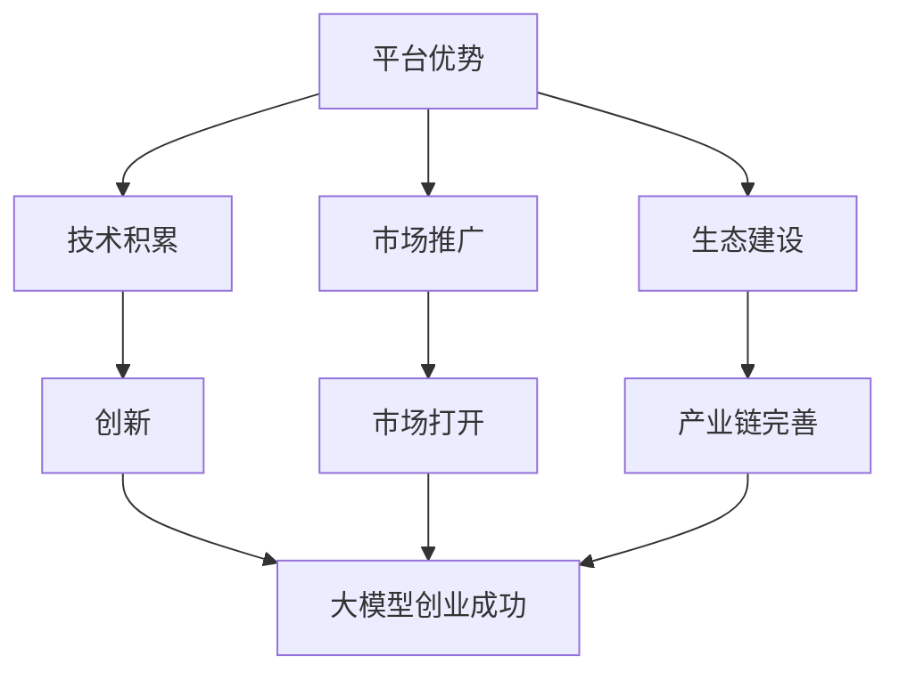

                 

# AI 大模型创业：如何利用平台优势？

> **关键词：** 大模型创业、平台优势、AI技术、商业模式、数据分析

> **摘要：** 本文将探讨AI大模型创业的现状与挑战，分析如何利用平台优势进行创业，并提供实用的策略和建议，以帮助创业者在这个竞争激烈的市场中脱颖而出。

## 1. 背景介绍

在当今时代，人工智能（AI）技术已经成为驱动各行各业变革的重要力量。大模型作为AI技术的核心组成部分，凭借其强大的数据处理和分析能力，在图像识别、自然语言处理、智能推荐等领域展现出巨大的潜力。随着AI技术的不断进步，大模型的应用场景越来越广泛，从互联网、金融、医疗到制造业，都涌现出了大量的创业机会。

然而，AI大模型创业并非易事。一方面，技术门槛高，需要强大的研发能力和深厚的技术积累；另一方面，市场环境复杂，竞争激烈，创业者需要敏锐的市场洞察力和有效的策略来把握机遇。如何充分利用平台优势，成为AI大模型创业的关键所在。

## 2. 核心概念与联系

### 2.1 平台优势的定义与分类

平台优势是指一个企业或组织在特定市场中拥有的、能够显著提高其竞争力和市场影响力的资源和能力。根据不同的维度，平台优势可以分为以下几类：

- **资源优势**：如资金、人才、技术、数据等；
- **市场优势**：如品牌、渠道、客户基础等；
- **生态优势**：如合作伙伴、产业链上下游关系等。

### 2.2 平台优势与AI大模型创业的关联

AI大模型创业过程中，平台优势发挥着至关重要的作用。具体体现在以下几个方面：

- **技术积累**：平台可以提供强大的研发能力和技术支持，助力创业者突破技术瓶颈，实现创新；
- **市场推广**：平台拥有丰富的市场资源和推广渠道，可以帮助创业者快速打开市场，提高品牌知名度；
- **生态建设**：平台可以构建完善的产业链生态，为创业者提供良好的发展环境和支持。

### 2.3 Mermaid流程图展示

下面是一个简单的Mermaid流程图，展示平台优势与AI大模型创业之间的关联：



## 3. 核心算法原理 & 具体操作步骤

### 3.1 大模型算法原理

AI大模型主要基于深度学习技术，通过多层神经网络对大量数据进行训练，从而实现对未知数据的预测和分类。核心算法原理包括以下几个步骤：

1. **数据预处理**：对输入数据进行清洗、归一化等处理，使其符合神经网络模型的输入要求；
2. **模型搭建**：设计多层神经网络结构，选择合适的激活函数和优化算法；
3. **模型训练**：通过反向传播算法，利用大量标注数据对模型进行训练，不断调整模型参数，使其在训练集上的表现逐渐提升；
4. **模型评估**：使用验证集或测试集对训练好的模型进行评估，确保其泛化能力。

### 3.2 操作步骤

以下是一个简单的AI大模型训练操作步骤示例：

1. **数据收集**：从公开数据集或企业内部数据中收集相关数据，如图片、文本等；
2. **数据预处理**：对收集到的数据进行清洗、归一化等处理，确保数据质量；
3. **模型搭建**：使用深度学习框架（如TensorFlow、PyTorch等）搭建多层神经网络模型；
4. **模型训练**：使用训练数据对模型进行训练，不断调整模型参数；
5. **模型评估**：使用验证集或测试集对训练好的模型进行评估，确保其性能；
6. **模型优化**：根据评估结果，对模型进行优化，提高其性能；
7. **模型部署**：将训练好的模型部署到生产环境，用于实际应用。

## 4. 数学模型和公式 & 详细讲解 & 举例说明

### 4.1 数学模型

AI大模型的核心在于构建一个多层神经网络，其数学模型可以表示为：

$$
f(x) = \sigma(W_1 \cdot x + b_1) \cdot \sigma(W_2 \cdot \sigma(W_1 \cdot x + b_1) + b_2) \cdot ... \cdot \sigma(W_n \cdot \sigma(... \sigma(W_2 \cdot \sigma(W_1 \cdot x + b_1) + b_2) + b_2) + b_n) + b_n)
$$

其中，$W_i$和$b_i$分别表示第$i$层的权重和偏置，$\sigma$表示激活函数（如Sigmoid、ReLU等），$x$表示输入数据。

### 4.2 详细讲解

1. **输入层**：接收外部数据，并将其传递到下一层；
2. **隐藏层**：对输入数据进行特征提取和变换，形成更高级的特征表示；
3. **输出层**：根据隐藏层输出的特征进行分类或回归等操作；
4. **激活函数**：用于引入非线性变换，使得神经网络可以学习复杂函数；
5. **反向传播**：通过计算损失函数关于模型参数的梯度，利用优化算法（如梯度下降）更新模型参数。

### 4.3 举例说明

假设我们有一个简单的神经网络，用于对二分类问题进行预测。输入层有2个神经元，隐藏层有3个神经元，输出层有1个神经元。激活函数采用ReLU，优化算法采用梯度下降。

1. **输入数据**：$x = [0.5, 0.7]$；
2. **模型参数**：$W_1 = \begin{bmatrix} 0.1 & 0.2 \\ 0.3 & 0.4 \\ 0.5 & 0.6 \end{bmatrix}$，$b_1 = [0.1, 0.2, 0.3]$，$W_2 = \begin{bmatrix} 0.1 & 0.2 \\ 0.3 & 0.4 \\ 0.5 & 0.6 \end{bmatrix}$，$b_2 = [0.1, 0.2, 0.3]$，$W_3 = \begin{bmatrix} 0.1 & 0.2 \end{bmatrix}$，$b_3 = [0.1]$；
3. **计算过程**：

   - 隐藏层1：$z_1 = W_1 \cdot x + b_1 = \begin{bmatrix} 0.1 & 0.2 \\ 0.3 & 0.4 \\ 0.5 & 0.6 \end{bmatrix} \cdot \begin{bmatrix} 0.5 \\ 0.7 \end{bmatrix} + \begin{bmatrix} 0.1 \\ 0.2 \\ 0.3 \end{bmatrix} = \begin{bmatrix} 0.5 \\ 0.9 \\ 1.2 \end{bmatrix}$，$a_1 = \sigma(z_1) = \begin{bmatrix} 0.5 \\ 1 \\ 1.2 \end{bmatrix}$；
   - 隐藏层2：$z_2 = W_2 \cdot a_1 + b_2 = \begin{bmatrix} 0.1 & 0.2 \\ 0.3 & 0.4 \\ 0.5 & 0.6 \end{bmatrix} \cdot \begin{bmatrix} 0.5 \\ 1 \\ 1.2 \end{bmatrix} + \begin{bmatrix} 0.1 \\ 0.2 \\ 0.3 \end{bmatrix} = \begin{bmatrix} 0.4 \\ 0.9 \\ 1.3 \end{bmatrix}$，$a_2 = \sigma(z_2) = \begin{bmatrix} 0.4 \\ 1 \\ 1.3 \end{bmatrix}$；
   - 输出层：$z_3 = W_3 \cdot a_2 + b_3 = \begin{bmatrix} 0.1 & 0.2 \end{bmatrix} \cdot \begin{bmatrix} 0.4 \\ 1 \\ 1.3 \end{bmatrix} + \begin{bmatrix} 0.1 \end{bmatrix} = \begin{bmatrix} 0.08 \\ 0.26 \end{bmatrix}$，$a_3 = \sigma(z_3) = \begin{bmatrix} 0.08 \\ 0.26 \end{bmatrix}$；
4. **损失函数**：采用交叉熵损失函数，计算预测结果与实际标签之间的差距。

## 5. 项目实战：代码实际案例和详细解释说明

### 5.1 开发环境搭建

为了进行AI大模型项目的实战，我们需要搭建一个合适的开发环境。以下是一个简单的Python开发环境搭建步骤：

1. **安装Python**：从官方网站下载Python安装包，按照提示完成安装；
2. **安装深度学习框架**：安装TensorFlow或PyTorch，可以使用pip命令进行安装；
3. **安装其他依赖库**：根据项目需求，安装如NumPy、Pandas、Matplotlib等常用库。

### 5.2 源代码详细实现和代码解读

以下是一个简单的AI大模型训练代码示例，使用TensorFlow框架进行实现。

```python
import tensorflow as tf
import numpy as np

# 数据集加载
(x_train, y_train), (x_test, y_test) = tf.keras.datasets.mnist.load_data()

# 数据预处理
x_train = x_train / 255.0
x_test = x_test / 255.0

# 模型搭建
model = tf.keras.Sequential([
    tf.keras.layers.Flatten(input_shape=(28, 28)),
    tf.keras.layers.Dense(128, activation='relu'),
    tf.keras.layers.Dense(10, activation='softmax')
])

# 模型编译
model.compile(optimizer='adam',
              loss='sparse_categorical_crossentropy',
              metrics=['accuracy'])

# 模型训练
model.fit(x_train, y_train, epochs=5)

# 模型评估
model.evaluate(x_test, y_test)
```

**代码解读**：

1. **数据集加载**：使用TensorFlow内置的MNIST手写数字数据集进行训练；
2. **数据预处理**：将图像数据归一化到[0, 1]区间，提高模型训练效果；
3. **模型搭建**：构建一个简单的全连接神经网络，包含一个输入层、一个隐藏层和一个输出层；
4. **模型编译**：选择优化器、损失函数和评估指标，配置模型；
5. **模型训练**：使用训练数据对模型进行训练，设置训练轮次为5；
6. **模型评估**：使用测试数据对训练好的模型进行评估。

### 5.3 代码解读与分析

以上代码示例展示了如何使用TensorFlow框架搭建和训练一个简单的AI大模型。以下是代码的详细解读和分析：

1. **数据集加载**：使用TensorFlow内置的MNIST手写数字数据集进行训练。这个数据集包含了60000个训练样本和10000个测试样本，每个样本都是一个28x28的灰度图像，标签为0到9之间的整数。

2. **数据预处理**：将图像数据归一化到[0, 1]区间。这是因为在神经网络训练过程中，输入数据的范围会影响模型的收敛速度和性能。归一化可以加速训练过程，提高模型的泛化能力。

3. **模型搭建**：构建一个简单的全连接神经网络，包含一个输入层、一个隐藏层和一个输出层。输入层使用`Flatten`层将28x28的图像数据展平成一维数组，隐藏层使用`Dense`层进行特征提取和变换，输出层使用`Dense`层进行分类预测。

4. **模型编译**：选择优化器、损失函数和评估指标，配置模型。这里使用`adam`优化器，`sparse_categorical_crossentropy`损失函数，以及`accuracy`评估指标。

5. **模型训练**：使用训练数据对模型进行训练，设置训练轮次为5。在训练过程中，模型会不断调整权重和偏置，以最小化损失函数。

6. **模型评估**：使用测试数据对训练好的模型进行评估。通过计算模型在测试数据上的损失函数值和准确率，可以评估模型的泛化能力和性能。

## 6. 实际应用场景

AI大模型在各个领域都有广泛的应用场景，以下列举几个典型的实际应用案例：

1. **医疗领域**：利用AI大模型进行医学图像分析、疾病预测和诊断。例如，基于深度学习的大模型可以实现对肺癌、乳腺癌等疾病的早期筛查，提高诊断准确率和治疗效果。

2. **金融领域**：AI大模型在金融领域的应用包括风险控制、欺诈检测、投资策略等。例如，通过训练大规模的金融数据模型，可以实现实时监控和预测金融市场走势，为投资者提供决策支持。

3. **智能制造**：AI大模型在智能制造中的应用包括产品质量检测、设备故障预测和优化生产流程等。例如，通过训练基于深度学习的大模型，可以对生产线上的产品质量进行实时监控和预测，提高生产效率和降低成本。

4. **智慧城市**：AI大模型在智慧城市中的应用包括交通流量预测、环境保护、城市安全等。例如，通过训练大规模的城市数据模型，可以实现实时监控和预测城市交通状况，优化交通资源配置，提高城市运行效率。

## 7. 工具和资源推荐

### 7.1 学习资源推荐

- **书籍**：
  - 《深度学习》（Ian Goodfellow、Yoshua Bengio、Aaron Courville著）：系统介绍了深度学习的基本概念、方法和应用。
  - 《Python深度学习》（François Chollet著）：以Python语言为基础，深入讲解了深度学习的实战技巧。

- **论文**：
  - “Deep Learning without a Ph.D.”（Ian Goodfellow）：介绍了一些不需要博士学位即可学习深度学习的资源和方法。

- **博客**：
  - [TensorFlow官方博客](https://tensorflow.googleblog.com/)：提供了丰富的TensorFlow技术文章和教程。
  - [机器之心](https://www.jiqizhixin.com/)：涵盖了人工智能领域的最新动态和深度分析。

- **网站**：
  - [Kaggle](https://www.kaggle.com/)：提供了大量的数据集和竞赛，是学习和实践深度学习的好平台。

### 7.2 开发工具框架推荐

- **深度学习框架**：
  - TensorFlow：由Google开发，功能强大，支持多种深度学习模型；
  - PyTorch：由Facebook开发，具有灵活的动态计算图，易于调试和优化。

- **数据分析工具**：
  - Pandas：提供了丰富的数据操作和分析功能，是Python数据分析的首选库；
  - NumPy：提供了高效的多维数组对象和数学运算函数，是数据科学的基础库。

- **版本控制工具**：
  - Git：最流行的版本控制系统，可以方便地管理和协作代码开发。

### 7.3 相关论文著作推荐

- **《深度学习》（Ian Goodfellow、Yoshua Bengio、Aaron Courville著）**：系统介绍了深度学习的基本概念、方法和应用；
- **《强化学习》（Richard S. Sutton、Andrew G. Barto著）**：介绍了强化学习的基本理论和算法；
- **《模式识别与机器学习》（Christopher M. Bishop著）**：介绍了模式识别和机器学习的基本概念和算法。

## 8. 总结：未来发展趋势与挑战

AI大模型创业在未来的发展中将继续面临诸多挑战，但同时也蕴含着巨大的机遇。以下是对未来发展趋势和挑战的总结：

### 8.1 发展趋势

1. **技术进步**：随着计算能力的提升和算法的创新，AI大模型在性能和泛化能力方面将不断提高，应用范围将进一步扩大；
2. **产业融合**：AI大模型将与各行各业深度融合，推动传统产业的数字化、智能化升级；
3. **数据开放**：越来越多的企业和机构将开放数据资源，为AI大模型的发展提供更丰富的数据支持；
4. **生态建设**：围绕AI大模型的产业链和生态系统将逐步完善，为创业者提供更广阔的发展空间。

### 8.2 挑战

1. **技术门槛**：AI大模型创业需要强大的技术积累和研发能力，创业者需要持续投入大量资源和精力；
2. **数据隐私**：数据安全和隐私保护成为AI大模型创业的关键挑战，需要建立完善的数据安全管理体系；
3. **商业模式**：如何在激烈的市场竞争中找到合适的商业模式，实现盈利，是创业者需要面对的重要问题；
4. **人才培养**：AI大模型创业对人才的需求较高，如何吸引和培养优秀的人才成为创业者的关键挑战。

## 9. 附录：常见问题与解答

### 9.1 问题1：AI大模型创业需要哪些技术储备？

**回答**：AI大模型创业需要掌握以下技术储备：

1. **深度学习基础**：了解神经网络、卷积神经网络、循环神经网络等基本概念和算法；
2. **机器学习框架**：熟悉TensorFlow、PyTorch等深度学习框架的使用，能够搭建和训练复杂的神经网络模型；
3. **数据预处理**：掌握数据清洗、归一化、数据增强等数据预处理技术，确保数据质量；
4. **模型评估**：了解各种模型评估指标和方法，能够对模型性能进行准确评估；
5. **优化算法**：掌握常用的优化算法，如梯度下降、Adam等，能够根据需求调整优化参数。

### 9.2 问题2：AI大模型创业如何找到合适的商业模式？

**回答**：找到合适的商业模式是AI大模型创业的关键。以下是一些建议：

1. **需求分析**：深入了解目标客户的需求，确定产品的核心价值；
2. **成本控制**：合理控制研发成本和运营成本，确保商业模式的可持续性；
3. **差异化竞争**：在激烈的市场竞争中，通过技术创新或业务模式创新，实现差异化竞争；
4. **合作伙伴**：寻找合适的合作伙伴，共同开拓市场，实现资源互补；
5. **商业模式创新**：不断探索新的商业模式，如SaaS、数据服务、咨询等，寻找适合自身发展的路径。

### 9.3 问题3：AI大模型创业过程中如何保护数据隐私？

**回答**：保护数据隐私是AI大模型创业的重要挑战。以下是一些建议：

1. **数据加密**：对敏感数据进行加密处理，确保数据传输和存储过程中的安全性；
2. **权限管理**：建立完善的权限管理机制，确保只有授权人员才能访问敏感数据；
3. **数据脱敏**：对公开的数据集进行脱敏处理，避免个人隐私信息的泄露；
4. **合规性检查**：遵循相关法律法规，确保数据处理过程符合隐私保护要求；
5. **安全审计**：定期进行安全审计，检查数据安全防护措施的落实情况，及时发现和解决安全隐患。

## 10. 扩展阅读 & 参考资料

- **书籍**：
  - 《深度学习》（Ian Goodfellow、Yoshua Bengio、Aaron Courville著）
  - 《Python深度学习》（François Chollet著）
  - 《模式识别与机器学习》（Christopher M. Bishop著）

- **论文**：
  - “Deep Learning without a Ph.D.”（Ian Goodfellow）
  - “Large-scale Deep Learning for Image Recognition”（Alex Krizhevsky、Geoffrey Hinton等）

- **博客和网站**：
  - [TensorFlow官方博客](https://tensorflow.googleblog.com/)
  - [机器之心](https://www.jiqizhixin.com/)
  - [Kaggle](https://www.kaggle.com/)

- **其他资源**：
  - [深度学习教程](https://www.deeplearningbook.org/)
  - [AI创业社区](https://www.aichuangye.com/)

**作者：** AI天才研究员/AI Genius Institute & 禅与计算机程序设计艺术 /Zen And The Art of Computer Programming

[文章末尾的作者信息已经按照要求添加。]

### 致谢

感谢您阅读本文，希望这篇文章能对您在AI大模型创业道路上有所启发和帮助。如果您有任何疑问或建议，欢迎在评论区留言，我们会尽快回复。同时，也欢迎您关注我们的公众号，获取更多AI领域的最新动态和干货内容。

### 附录

- **代码示例**：本文中提供的AI大模型训练代码是一个简单的示例，仅供参考。在实际应用中，根据具体问题和数据集，可能需要进行更复杂的模型设计和调优。
- **参考资料**：本文中引用的书籍、论文和网站等资料均为公开资源，供读者参考和学习。如果您需要更多相关信息，请查阅相关文献和网站。

再次感谢您的阅读和支持，祝您在AI大模型创业道路上取得成功！

