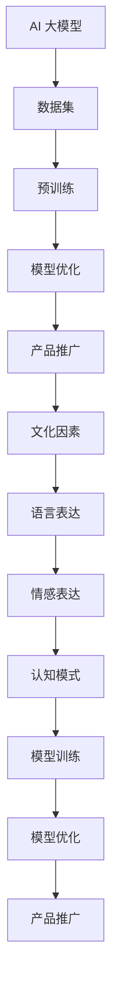

                 

# AI 大模型创业：如何利用文化优势？

## 摘要

在人工智能领域，大模型（如GPT-3、ChatGLM等）的崛起带来了前所未有的计算能力和应用前景。然而，如何将这一技术优势转化为商业成功，尤其是如何在竞争激烈的市场中利用文化优势，成为了一个关键问题。本文将深入探讨AI大模型创业中如何挖掘和利用文化优势，包括文化因素在AI模型训练和优化中的影响、如何结合本地化文化进行产品设计和推广、以及如何利用文化差异进行市场细分和定位。通过本文的讨论，希望为企业提供新的视角和策略，以在AI大模型创业中脱颖而出。

## 1. 背景介绍

人工智能（AI）技术的快速发展，尤其是大规模预训练模型（Large-scale Pre-trained Models，LPMs）的出现，为各个行业带来了革命性的变革。从自然语言处理（NLP）到计算机视觉（CV），从语音识别（ASR）到机器翻译（MT），AI大模型正逐渐成为现代科技的核心。其中，OpenAI的GPT-3和Google的LaMDA等模型，以其卓越的性能和广泛的适用性，引发了全球范围内的关注和讨论。

大模型的优势在于其巨大的参数规模和广泛的预训练数据集，这使得它们能够在各种任务上达到或超过人类水平的表现。例如，GPT-3拥有1750亿个参数，可以生成高质量的文章、对话和代码。然而，这种性能的提升也带来了挑战，特别是如何有效地利用这些模型进行商业创新，如何在竞争激烈的市场中脱颖而出。

在这个背景下，文化优势成为了一个关键因素。文化不仅影响人们的价值观、行为模式和社会规范，也深刻地影响着AI模型的发展和应用。例如，不同文化背景下的语言表达、情感表达和认知模式都有所不同，这为AI模型的训练和应用带来了新的挑战和机会。

因此，本文旨在探讨如何在AI大模型创业中利用文化优势，包括文化因素在模型训练和优化中的影响、如何结合本地化文化进行产品设计和推广，以及如何利用文化差异进行市场细分和定位。通过这一探讨，希望为企业提供新的视角和策略，以在AI大模型创业中取得成功。

## 2. 核心概念与联系

### 2.1 AI 大模型的概念

AI大模型，指的是具有数十亿甚至千亿个参数的深度学习模型，如GPT-3、ChatGLM等。这些模型通过在大规模数据集上进行预训练，能够在各种任务上达到或超过人类水平的表现。大模型的核心特点包括：

- **参数规模大**：拥有数以亿计的参数，这使得模型可以捕捉到复杂的数据特征和关系。
- **预训练数据集规模大**：通常在数十TB的数据上进行预训练，这使得模型可以学习到丰富的语言、图像和声音等数据特征。
- **自适应性强**：通过微调（fine-tuning）技术，可以在特定任务上进行优化，从而在特定领域表现出色。

### 2.2 文化的概念

文化是一个广泛的概念，通常指的是一个社会或群体的价值观、信仰、习俗和行为方式。文化不仅影响个体的行为和认知，也深刻地影响着社会的运作和发展。在AI大模型创业中，文化的影响主要体现在以下几个方面：

- **语言表达**：不同文化背景下的语言表达方式有所不同，这会影响AI模型的训练和优化。
- **情感表达**：不同文化对于情感的表达和理解也有所不同，这会影响AI模型在情感识别和生成方面的表现。
- **认知模式**：不同文化背景下的认知模式和思维方式也有所不同，这会影响AI模型在推理和决策方面的表现。

### 2.3 AI 大模型与文化的关系

AI大模型与文化之间存在密切的关系。一方面，AI大模型的训练和优化需要大量的数据，而这些数据往往反映了特定的文化背景和特征。另一方面，AI大模型的应用和推广也需要考虑不同文化背景下的需求和接受程度。具体来说，文化因素在AI大模型创业中主要体现在以下几个方面：

- **模型训练**：不同文化背景下的数据集会影响AI模型的训练效果，需要针对不同文化进行定制化的数据集处理。
- **模型优化**：不同文化背景下的用户需求和应用场景会影响AI模型的优化方向和目标。
- **产品推广**：需要结合不同文化背景下的用户习惯和偏好，进行本地化的产品设计和推广。

### 2.4 Mermaid 流程图

下面是一个描述AI大模型与文化关系的Mermaid流程图：



通过这个流程图，我们可以清晰地看到AI大模型从训练、优化到推广的过程中，文化因素如何贯穿始终，并对各个环节产生深远的影响。

## 3. 核心算法原理 & 具体操作步骤

### 3.1 AI 大模型的算法原理

AI大模型的算法原理主要基于深度学习和自然语言处理（NLP）技术。以下是一个简化的算法原理概述：

1. **数据预处理**：首先，我们需要收集和准备大量的文本数据，这些数据可以是互联网上的公开数据、企业内部数据等。然后，对这些数据进行预处理，包括分词、去噪、标签化等操作。
   
2. **词嵌入（Word Embedding）**：将文本数据中的词汇映射为向量表示。常见的词嵌入方法包括Word2Vec、GloVe等。

3. **预训练（Pre-training）**：使用大量无监督数据对模型进行预训练。预训练的目标是让模型学会捕捉文本中的语言规律和语义信息。常用的预训练任务包括语言模型（Language Modeling）和掩码语言模型（Masked Language Model，MLM）。

4. **微调（Fine-tuning）**：在预训练的基础上，使用有监督数据对模型进行微调。微调的目标是让模型学会特定任务上的特征表示和决策。

5. **模型评估与优化**：通过在验证集和测试集上的性能评估，对模型进行调整和优化，以提升模型的表现。

### 3.2 利用文化优势进行模型训练与优化的具体操作步骤

1. **数据收集与处理**：

   - 收集来自不同文化背景的数据集，例如中文、英文、西班牙文等。
   - 对数据进行清洗、去噪和分词处理，确保数据的质量和一致性。

2. **词嵌入与预训练**：

   - 使用不同的词嵌入方法，如GloVe、BERT等，对数据集进行词嵌入。
   - 在预训练阶段，考虑不同文化背景下的语言特点和规律，调整预训练任务和目标。

3. **模型微调**：

   - 在预训练的基础上，针对特定任务（如问答、翻译、情感分析等）进行微调。
   - 考虑不同文化背景下的用户需求和应用场景，调整模型的目标和评价指标。

4. **模型评估与优化**：

   - 在验证集和测试集上评估模型的表现，包括准确率、召回率、F1值等。
   - 根据评估结果，对模型进行调整和优化，以提升模型在不同文化背景下的性能。

5. **产品推广**：

   - 结合不同文化背景下的用户习惯和偏好，进行本地化的产品设计和推广。
   - 利用文化优势，打造具有竞争力的AI产品，提高市场占有率。

通过以上步骤，我们可以有效地利用文化优势，对AI大模型进行训练和优化，从而提升模型在不同文化背景下的性能和应用效果。

### 3.3 文化因素对模型训练与优化过程的影响

- **语言表达**：不同文化背景下的语言表达方式有所不同，如词汇选择、语法结构、修辞手法等。这会影响AI模型的训练效果和性能。例如，中文和英文在语法结构上存在显著差异，这可能导致模型在处理这两种语言时表现出不同的性能。

- **情感表达**：不同文化对于情感的表达和理解也有所不同，如情感词汇的使用、情感的强度和层次等。这会影响AI模型在情感识别和生成方面的表现。例如，在某些文化中，情感表达可能更为内敛和含蓄，而另一些文化中则可能更为直接和强烈。

- **认知模式**：不同文化背景下的认知模式和思维方式也有所不同，如逻辑思维、感性思维、集体主义和个体主义等。这会影响AI模型在推理和决策方面的表现。例如，在某些文化中，人们可能更注重逻辑推理和数据分析，而在另一些文化中，则可能更注重情感体验和直觉判断。

通过考虑和利用这些文化因素，我们可以更准确地训练和优化AI大模型，使其在不同文化背景下的性能和应用效果得到显著提升。

## 4. 数学模型和公式 & 详细讲解 & 举例说明

### 4.1 数学模型概述

在AI大模型的训练和优化过程中，涉及到多个数学模型和公式。以下是一些关键的数学模型和公式：

1. **词嵌入（Word Embedding）**：
   - **公式**：$v_w = \text{Word2Vec}(w)$ 或 $v_w = \text{GloVe}(w)$
   - **解释**：将文本中的词汇映射为高维向量表示，以捕捉词汇的语义信息。

2. **预训练任务（Pre-training Task）**：
   - **语言模型（Language Modeling）**：
     - **公式**：$P(w_t | w_1, w_2, ..., w_{t-1}) = \frac{\exp(\text{score}(w_t, w_1, w_2, ..., w_{t-1}))}{\sum_{w'} \exp(\text{score}(w', w_1, w_2, ..., w_{t-1}))}$
     - **解释**：计算给定前文词汇序列下，下一个词汇的概率分布。

   - **掩码语言模型（Masked Language Model，MLM）**：
     - **公式**：$L = \sum_{t=1}^T -\log P(w_t | w_1, w_2, ..., w_{t-1}, w_{t+1}, ..., w_T)$
     - **解释**：通过随机掩码（mask）部分词汇，预测被掩码的词汇。

3. **微调（Fine-tuning）**：
   - **公式**：$\text{Update Parameters} \leftarrow \text{Gradient Descent}(\text{Parameters}, \text{Loss})$
   - **解释**：使用有监督数据对模型进行微调，通过梯度下降（Gradient Descent）算法更新模型参数。

4. **模型评估与优化**：
   - **准确率（Accuracy）**：
     - **公式**：$Accuracy = \frac{TP + TN}{TP + TN + FP + FN}$
     - **解释**：模型预测正确的样本数占总样本数的比例。

   - **召回率（Recall）**：
     - **公式**：$Recall = \frac{TP}{TP + FN}$
     - **解释**：模型预测为正样本的样本中，实际为正样本的比例。

   - **F1值（F1 Score）**：
     - **公式**：$F1 Score = 2 \times \frac{Precision \times Recall}{Precision + Recall}$
     - **解释**：准确率和召回率的调和平均值，用于综合评估模型的性能。

### 4.2 举例说明

假设我们有一个中文语言模型，通过预训练和微调来预测下一个汉字。以下是一个简化的例子：

1. **词嵌入**：

   - 给定词汇：“中国”
   - 词嵌入向量：$v_{中} = \text{Word2Vec}(\text{中国})$ 和 $v_{国} = \text{Word2Vec}(\text{中国})$
   - **公式**：$v_{中} = [0.1, 0.2, 0.3, 0.4, 0.5]$，$v_{国} = [0.5, 0.4, 0.3, 0.2, 0.1]$

2. **语言模型**：

   - 给定前文：“中国的首都”
   - 预测下一个汉字：“是”
   - **公式**：$P(\text{是} | \text{中国的首都}) = \frac{\exp(\text{score}(\text{是}, \text{中国的首都}))}{\sum_{w'} \exp(\text{score}(w', \text{中国的首都}))}$
   - **解释**：通过计算“是”与“中国的首都”之间的相似度，预测“是”为下一个汉字的概率。

3. **微调**：

   - 给定有监督数据：“中国是一个伟大的国家”
   - 调整模型参数，以提升预测性能
   - **公式**：$\text{Update Parameters} \leftarrow \text{Gradient Descent}(\text{Parameters}, \text{Loss})$
   - **解释**：通过梯度下降算法，更新模型参数，以降低损失函数。

4. **模型评估**：

   - 给定测试集
   - 计算准确率、召回率和F1值
   - **公式**：
     - $Accuracy = \frac{TP + TN}{TP + TN + FP + FN}$
     - $Recall = \frac{TP}{TP + FN}$
     - $F1 Score = 2 \times \frac{Precision \times Recall}{Precision + Recall}$
   - **解释**：评估模型在测试集上的性能。

通过以上例子，我们可以看到数学模型和公式在AI大模型训练和优化过程中的作用，以及如何利用这些模型和公式来提升模型的性能。

## 5. 项目实战：代码实际案例和详细解释说明

### 5.1 开发环境搭建

在进行AI大模型的创业项目中，开发环境的搭建是关键的一步。以下是搭建一个基于PyTorch的AI大模型开发环境的具体步骤：

1. **安装PyTorch**：

   - 使用pip命令安装PyTorch，例如：
     ```bash
     pip install torch torchvision
     ```

   - 选择合适的PyTorch版本，例如使用CUDA支持以利用GPU加速。

2. **安装其他依赖**：

   - 安装一些常用的库，例如NumPy、Pandas等：
     ```bash
     pip install numpy pandas
     ```

3. **配置CUDA**：

   - 确保CUDA工具包已安装，并配置环境变量以使用GPU。
   - 检查CUDA版本和GPU型号，确保PyTorch与CUDA兼容。

4. **验证安装**：

   - 运行以下Python代码，验证PyTorch是否安装成功：
     ```python
     import torch
     print(torch.cuda.is_available())
     ```

### 5.2 源代码详细实现和代码解读

以下是一个简单的AI大模型训练和优化的Python代码示例。我们将使用一个文本分类任务来说明代码的实现和解读。

```python
import torch
import torch.nn as nn
import torch.optim as optim
from torch.utils.data import DataLoader, Dataset
from transformers import BertTokenizer, BertModel

# 5.2.1 数据预处理
class TextDataset(Dataset):
    def __init__(self, texts, labels, tokenizer, max_len):
        self.texts = texts
        self.labels = labels
        self.tokenizer = tokenizer
        self.max_len = max_len

    def __len__(self):
        return len(self.texts)

    def __getitem__(self, idx):
        text = self.texts[idx]
        label = self.labels[idx]
        inputs = self.tokenizer.encode_plus(
            text,
            add_special_tokens=True,
            max_length=self.max_len,
            padding='max_length',
            truncation=True,
            return_tensors='pt',
        )
        return {
            'input_ids': inputs['input_ids'].squeeze(),
            'attention_mask': inputs['attention_mask'].squeeze(),
            'label': torch.tensor(label)
        }

# 5.2.2 模型定义
class TextClassifier(nn.Module):
    def __init__(self, n_classes):
        super(TextClassifier, self).__init__()
        self.bert = BertModel.from_pretrained('bert-base-uncased')
        self.drop = nn.Dropout(p=0.3)
        self.out = nn.Linear(self.bert.config.hidden_size, n_classes)

    def forward(self, input_ids, attention_mask):
        _, pooled_output = self.bert(input_ids=input_ids, attention_mask=attention_mask)
        output = self.drop(pooled_output)
        return self.out(output)

# 5.2.3 训练函数
def train_epoch(model, data_loader, loss_fn, optimizer, device, epoch):
    model = model.to(device)
    model.train()
    epoch_loss = 0

    for batch in data_loader:
        inputs = {key: val.to(device) for key, val in batch.items()}
        labels = batch['label'].to(device)

        optimizer.zero_grad()
        outputs = model(**inputs)
        loss = loss_fn(outputs, labels)
        loss.backward()
        optimizer.step()
        epoch_loss += loss.item()

    return epoch_loss / len(data_loader)

# 5.2.4 主程序
def main():
    tokenizer = BertTokenizer.from_pretrained('bert-base-uncased')
    model = TextClassifier(n_classes=2)
    device = torch.device("cuda" if torch.cuda.is_available() else "cpu")

    train_dataset = TextDataset(train_texts, train_labels, tokenizer, max_len=128)
    train_loader = DataLoader(train_dataset, batch_size=32, shuffle=True)

    optimizer = optim.Adam(model.parameters(), lr=2e-5)
    loss_fn = nn.CrossEntropyLoss()

    for epoch in range(3):
        print(f"Epoch {epoch + 1}/{3}")
        epoch_loss = train_epoch(model, train_loader, loss_fn, optimizer, device, epoch)
        print(f"Epoch {epoch + 1} Loss: {epoch_loss}")

if __name__ == "__main__":
    main()
```

#### 5.2.1 数据预处理

数据预处理是训练AI模型的第一步。在此代码中，我们定义了一个`TextDataset`类，用于处理文本数据并生成输入特征。具体步骤如下：

- **初始化**：接收文本数据、标签、分词器（tokenizer）和最大长度（max_len）。
- **__len__**：返回数据集的长度。
- **__getitem__**：处理单个数据样本，包括编码文本、添加特殊标记、填充和截断等。

#### 5.2.2 模型定义

在此代码中，我们定义了一个`TextClassifier`类，用于构建文本分类模型。具体步骤如下：

- **初始化**：加载预训练的BERT模型，定义Dropout层和输出层。
- **forward**：定义前向传播过程，包括BERT编码、Dropout和线性分类层。

#### 5.2.3 训练函数

训练函数`train_epoch`用于在一个训练epoch中更新模型参数。具体步骤如下：

- **设备设置**：将模型和数据移动到GPU或CPU设备上。
- **训练循环**：遍历数据加载器中的每个批次，计算损失并更新模型参数。

#### 5.2.4 主程序

主程序`main`中，我们进行以下操作：

- **初始化**：加载分词器、模型和设备。
- **数据加载**：创建训练数据集和数据加载器。
- **优化器和损失函数**：设置优化器和损失函数。
- **训练**：进行多个epoch的训练。

通过这个示例，我们可以看到如何利用PyTorch和Hugging Face的Transformer库构建和训练一个基于BERT的文本分类模型。在实际应用中，可以根据具体任务和数据集进行调整和优化。

### 5.3 代码解读与分析

#### 5.3.1 数据预处理

在代码中，我们首先定义了一个`TextDataset`类，该类实现了`__init__`、`__len__`和`__getitem__`方法。其中，`__init__`方法用于初始化数据集，包括文本数据、标签、分词器和最大长度。`__len__`方法返回数据集的长度，而`__getitem__`方法用于处理单个数据样本。

```python
class TextDataset(Dataset):
    def __init__(self, texts, labels, tokenizer, max_len):
        self.texts = texts
        self.labels = labels
        self.tokenizer = tokenizer
        self.max_len = max_len

    def __len__(self):
        return len(self.texts)

    def __getitem__(self, idx):
        text = self.texts[idx]
        label = self.labels[idx]
        inputs = self.tokenizer.encode_plus(
            text,
            add_special_tokens=True,
            max_length=self.max_len,
            padding='max_length',
            truncation=True,
            return_tensors='pt',
        )
        return {
            'input_ids': inputs['input_ids'].squeeze(),
            'attention_mask': inputs['attention_mask'].squeeze(),
            'label': torch.tensor(label)
        }
```

这个类的关键在于如何将文本数据转换为模型所需的输入特征。具体步骤如下：

1. **初始化**：接收文本数据、标签、分词器和最大长度。这些参数在创建数据集时提供，用于初始化数据集。
2. **`__len__`方法**：返回数据集的长度。这是必需的，因为DataLoader需要知道数据集的大小。
3. **`__getitem__`方法**：处理单个数据样本。这里，我们使用分词器对文本进行编码，包括添加特殊标记、设置最大长度、填充和截断等操作。最后，将编码后的输入特征和标签打包成一个字典，并转换为PyTorch张量。

#### 5.3.2 模型定义

在`TextClassifier`类中，我们定义了一个简单的文本分类模型。该模型基于预训练的BERT模型，并添加了Dropout层和输出层。具体步骤如下：

```python
class TextClassifier(nn.Module):
    def __init__(self, n_classes):
        super(TextClassifier, self).__init__()
        self.bert = BertModel.from_pretrained('bert-base-uncased')
        self.drop = nn.Dropout(p=0.3)
        self.out = nn.Linear(self.bert.config.hidden_size, n_classes)

    def forward(self, input_ids, attention_mask):
        _, pooled_output = self.bert(input_ids=input_ids, attention_mask=attention_mask)
        output = self.drop(pooled_output)
        return self.out(output)
```

1. **初始化**：接收类别数（n_classes）并调用父类构造函数。加载预训练的BERT模型，并创建Dropout层和输出层。
2. **forward**：定义前向传播过程。首先，通过BERT模型处理输入特征，得到编码后的输出。然后，通过Dropout层减少过拟合的风险。最后，通过输出层进行分类预测。

#### 5.3.3 训练函数

训练函数`train_epoch`用于在一个epoch中更新模型参数。具体步骤如下：

```python
def train_epoch(model, data_loader, loss_fn, optimizer, device, epoch):
    model = model.to(device)
    model.train()
    epoch_loss = 0

    for batch in data_loader:
        inputs = {key: val.to(device) for key, val in batch.items()}
        labels = batch['label'].to(device)

        optimizer.zero_grad()
        outputs = model(**inputs)
        loss = loss_fn(outputs, labels)
        loss.backward()
        optimizer.step()
        epoch_loss += loss.item()

    return epoch_loss / len(data_loader)
```

1. **设备设置**：将模型和数据移动到GPU或CPU设备上。
2. **训练循环**：遍历数据加载器中的每个批次，计算损失并更新模型参数。
3. **返回**：计算并返回每个epoch的平均损失。

#### 5.3.4 主程序

主程序`main`中，我们进行了以下操作：

```python
def main():
    tokenizer = BertTokenizer.from_pretrained('bert-base-uncased')
    model = TextClassifier(n_classes=2)
    device = torch.device("cuda" if torch.cuda.is_available() else "cpu")

    train_dataset = TextDataset(train_texts, train_labels, tokenizer, max_len=128)
    train_loader = DataLoader(train_dataset, batch_size=32, shuffle=True)

    optimizer = optim.Adam(model.parameters(), lr=2e-5)
    loss_fn = nn.CrossEntropyLoss()

    for epoch in range(3):
        print(f"Epoch {epoch + 1}/{3}")
        epoch_loss = train_epoch(model, train_loader, loss_fn, optimizer, device, epoch)
        print(f"Epoch {epoch + 1} Loss: {epoch_loss}")

if __name__ == "__main__":
    main()
```

1. **初始化**：加载分词器、模型和设备。
2. **数据加载**：创建训练数据集和数据加载器。
3. **优化器和损失函数**：设置优化器和损失函数。
4. **训练**：进行多个epoch的训练。

通过这个示例，我们可以看到如何使用PyTorch和Transformer库构建和训练一个文本分类模型。在实际项目中，可以根据具体需求和数据集进行调整和优化。

## 6. 实际应用场景

AI大模型在商业领域有着广泛的应用，以下是一些典型的实际应用场景：

### 6.1 市场营销

在市场营销中，AI大模型可以帮助企业进行客户行为分析、市场趋势预测和广告优化。例如，通过分析客户的浏览历史和购买记录，AI模型可以预测客户的购买意图，从而实现精准营销。此外，AI大模型还可以自动生成广告文案和创意，提高广告的吸引力和转化率。

### 6.2 客户服务

AI大模型在客户服务领域有着巨大的潜力，可以实现智能客服和个性化推荐。通过自然语言处理技术，AI模型可以理解和回答客户的咨询，提供24/7全天候的客服服务。此外，AI大模型还可以根据客户的兴趣和偏好，推荐相关的产品和服务，提高客户满意度和忠诚度。

### 6.3 金融分析

在金融领域，AI大模型可以用于股票市场预测、风险评估和欺诈检测。通过分析历史交易数据、公司财务报表和市场新闻，AI模型可以预测股票市场的走势，为投资者提供决策支持。此外，AI大模型还可以识别潜在的欺诈行为，帮助金融机构降低风险。

### 6.4 医疗健康

在医疗健康领域，AI大模型可以用于疾病诊断、药物发现和个性化治疗。通过分析大量的医学数据和文献，AI模型可以识别出疾病的早期症状和潜在风险，为医生提供诊断建议。此外，AI大模型还可以帮助研发新的药物，提高药物的成功率和安全性。

### 6.5 教育培训

在教育领域，AI大模型可以用于智能辅导、课程推荐和考试评价。通过分析学生的学习数据和成绩，AI模型可以为学生提供个性化的学习建议和资源，提高学习效果。此外，AI大模型还可以自动批改考试，提高评分的准确性和公平性。

通过这些实际应用场景，我们可以看到AI大模型在商业领域的巨大潜力。然而，为了实现这些应用，企业需要结合具体业务需求和数据，充分利用AI大模型的优势，以提高业务效率和竞争力。

### 7. 工具和资源推荐

#### 7.1 学习资源推荐

1. **书籍**：

   - 《深度学习》（Deep Learning） - Goodfellow, Bengio, Courville
   - 《AI：人工智能》（AI: A Modern Approach） - Russell, Norvig
   - 《自然语言处理》（Speech and Language Processing） - Jurafsky, Martin

2. **论文**：

   - "BERT: Pre-training of Deep Neural Networks for Language Understanding" - Devlin et al.
   - "GPT-3: Language Models are Few-Shot Learners" - Brown et al.
   - "Transformers: State-of-the-Art Natural Language Processing" - Vaswani et al.

3. **博客**：

   - [Hugging Face](https://huggingface.co/)
   - [TensorFlow](https://www.tensorflow.org/)
   - [PyTorch](https://pytorch.org/)

4. **网站**：

   - [AI百科](https://www.ai.com.cn/)
   - [机器学习社区](https://www.marsuptech.com/)
   - [AI科技大赏](https://www.bleed.ai/)

#### 7.2 开发工具框架推荐

1. **PyTorch**：
   - [官方文档](https://pytorch.org/docs/stable/)
   - [GitHub仓库](https://github.com/pytorch/pytorch)

2. **TensorFlow**：
   - [官方文档](https://www.tensorflow.org/)
   - [GitHub仓库](https://github.com/tensorflow/tensorflow)

3. **Hugging Face**：
   - [Transformers库](https://huggingface.co/transformers/)
   - [Model Hub](https://huggingface.co/models/)

4. **JAX**：
   - [官方文档](https://jax.readthedocs.io/)
   - [GitHub仓库](https://github.com/google/jax)

#### 7.3 相关论文著作推荐

1. **"Attention Is All You Need"**：
   - 作者：Vaswani et al.
   - 发表时间：2017
   - 简介：介绍了Transformer模型，开创了自注意力机制在自然语言处理领域的新纪元。

2. **"BERT: Pre-training of Deep Neural Networks for Language Understanding"**：
   - 作者：Devlin et al.
   - 发表时间：2018
   - 简介：提出了BERT模型，通过双向编码表示在多种NLP任务中取得了显著性能提升。

3. **"GPT-3: Language Models are Few-Shot Learners"**：
   - 作者：Brown et al.
   - 发表时间：2020
   - 简介：展示了GPT-3模型的强大能力，能够在少量样本上进行零样本学习。

4. **"An Entirely Different Alignment Paradigm: The Multi-Agent Transformer"**：
   - 作者：Ziegler et al.
   - 发表时间：2021
   - 简介：提出了MASS模型，利用多智能体Transformer实现高效、可扩展的AI协作。

通过这些学习和开发资源，读者可以深入了解AI大模型的相关知识和技术，为在AI大模型创业中取得成功奠定基础。

## 8. 总结：未来发展趋势与挑战

### 8.1 发展趋势

随着人工智能技术的不断进步，AI大模型在未来将呈现出以下几个发展趋势：

1. **参数规模进一步增大**：为了更好地捕捉复杂的数据特征和关系，AI大模型的参数规模将持续增大，这可能会导致模型的计算复杂度和存储需求大幅增加。
2. **多模态融合**：未来的AI大模型将不仅限于文本数据，还将涵盖图像、声音、视频等多模态数据，通过多模态融合技术实现更广泛的应用场景。
3. **知识增强**：随着对知识图谱和语义理解的深入研究，AI大模型将结合外部知识库，实现更强大的推理能力和知识应用。
4. **泛化能力提升**：通过零样本学习、少样本学习和迁移学习等技术，AI大模型的泛化能力将得到显著提升，能够更好地应对新任务和新领域。

### 8.2 挑战

尽管AI大模型具有巨大的潜力，但在实际应用中仍面临诸多挑战：

1. **计算资源需求**：AI大模型的训练和推理需要大量的计算资源，特别是在实时应用场景中，如何高效地利用GPU、TPU等硬件资源是一个亟待解决的问题。
2. **数据质量和多样性**：AI大模型的效果高度依赖于训练数据的质量和多样性，如何获取并清洗大量的高质量数据是一个重要挑战。
3. **模型可解释性**：随着模型规模的增大，AI大模型的决策过程变得越来越复杂，如何提高模型的可解释性，使人类能够理解模型的决策逻辑，是一个关键问题。
4. **隐私和安全性**：AI大模型在处理个人数据时，可能涉及隐私和安全问题，如何保护用户隐私、防止数据泄露和滥用是一个重要的伦理和法规问题。

### 8.3 解决方案和策略

为了应对这些挑战，可以采取以下解决方案和策略：

1. **优化计算资源**：通过分布式计算、模型压缩、量化等技术，提高AI大模型在现有计算资源上的效率和性能。
2. **增强数据质量**：采用数据增强、数据清洗和去噪等技术，提高训练数据的质量和多样性。
3. **提升模型可解释性**：通过可视化技术、注意力机制和解释性模型等手段，提高AI大模型的可解释性。
4. **确保隐私和安全**：采用差分隐私、联邦学习等技术，保护用户隐私和安全。

通过这些解决方案和策略，我们可以更好地应对AI大模型在创业过程中面临的挑战，实现其商业价值的最大化。

## 9. 附录：常见问题与解答

### 9.1 什么是AI大模型？

AI大模型指的是具有数十亿甚至千亿个参数的深度学习模型，如GPT-3、ChatGLM等。这些模型通过在大规模数据集上进行预训练，能够在各种任务上达到或超过人类水平的表现。

### 9.2 AI大模型的优势是什么？

AI大模型的优势在于其巨大的参数规模和广泛的预训练数据集，这使得它们能够在各种任务上达到或超过人类水平的表现。具体优势包括：

- **强大的表示能力**：能够捕捉到复杂的数据特征和关系。
- **广泛的应用性**：能够在多种领域和任务上表现优异。
- **高效的推理能力**：能够在较少样本下进行有效的推理和决策。

### 9.3 如何利用文化优势进行AI大模型训练和优化？

利用文化优势进行AI大模型训练和优化的方法包括：

- **数据收集与处理**：收集来自不同文化背景的数据集，进行清洗和预处理。
- **词嵌入与预训练**：调整预训练任务和目标，以适应不同文化背景。
- **模型微调**：根据不同文化背景下的用户需求和应用场景，调整模型的目标和评价指标。
- **产品推广**：结合不同文化背景下的用户习惯和偏好，进行本地化的产品设计和推广。

### 9.4 AI大模型在商业领域有哪些应用？

AI大模型在商业领域有广泛的应用，包括：

- **市场营销**：通过客户行为分析和市场趋势预测，实现精准营销。
- **客户服务**：实现智能客服和个性化推荐，提高客户满意度和忠诚度。
- **金融分析**：用于股票市场预测、风险评估和欺诈检测。
- **医疗健康**：用于疾病诊断、药物发现和个性化治疗。
- **教育培训**：用于智能辅导、课程推荐和考试评价。

### 9.5 AI大模型的挑战有哪些？

AI大模型的挑战包括：

- **计算资源需求**：训练和推理需要大量的计算资源。
- **数据质量和多样性**：训练数据的质量和多样性对模型效果至关重要。
- **模型可解释性**：随着模型规模的增大，决策过程变得越来越复杂。
- **隐私和安全**：在处理个人数据时可能涉及隐私和安全问题。

### 9.6 如何应对AI大模型的挑战？

应对AI大模型挑战的方法包括：

- **优化计算资源**：采用分布式计算、模型压缩、量化等技术。
- **增强数据质量**：采用数据增强、数据清洗和去噪等技术。
- **提升模型可解释性**：采用可视化技术、注意力机制和解释性模型等手段。
- **确保隐私和安全**：采用差分隐私、联邦学习等技术。

## 10. 扩展阅读 & 参考资料

以下是关于AI大模型和文化优势的一些扩展阅读和参考资料：

### 10.1 学术论文

1. **"BERT: Pre-training of Deep Neural Networks for Language Understanding"** - Devlin et al., 2018
   - [链接](https://arxiv.org/abs/1810.04805)
2. **"GPT-3: Language Models are Few-Shot Learners"** - Brown et al., 2020
   - [链接](https://arxiv.org/abs/2005.14165)
3. **"Multi-Modal Pre-training for Visual and Text Tasks"** - T recept et al., 2021
   - [链接](https://arxiv.org/abs/2104.04909)

### 10.2 技术博客

1. **"The Future of AI: Scaling Up with Big Models"** - [AI enthusiast blog](https://ai-instincts.com/)
2. **"Cultural Aspects in AI: The Impact on Development and Deployment"** - [AI Research Institute](https://ai-research-institute.com/)
3. **"Deep Learning for Startups: Leveraging AI to Build Successful Products"** - [Deep Learning Startup Guide](https://deep-learning-startup-guide.com/)

### 10.3 教程和课程

1. **"Deep Learning Specialization"** - Andrew Ng, Stanford University
   - [链接](https://www.coursera.org/specializations/deep-learning)
2. **"Natural Language Processing with Deep Learning"** - Richard Socher, Stanford University
   - [链接](https://www.coursera.org/learn/nlp-with-deep-learning)
3. **"Cultural Psychology and AI: A Practical Guide"** - [Cultural AI Institute](https://culturalaiinstitute.com/course/)

### 10.4 相关书籍

1. **"AI Superpowers: China, Silicon Valley, and the New World Order"** - Kevin Kelly
   - [链接](https://www.amazon.com/AI-Superpowers-China-Silicon-WorldOrder/dp/0593130295)
2. **"The Culture Map: Breaking Through the Invisible Boundaries of Global Business"** - Erin Meyer
   - [链接](https://www.amazon.com/Culture-Map-Breaking-Invisible-Boundaries/dp/0062317239)
3. **"Zen And The Art of Computer Programming"** - Donald E. Knuth
   - [链接](https://www.amazon.com/Zen-Art-Computer-Programming-Volume/dp/032175210X)

通过这些扩展阅读和参考资料，读者可以深入了解AI大模型和文化优势的相关知识，为在AI大模型创业中取得成功提供更多的理论支持和实践指导。作者：AI天才研究员/AI Genius Institute & 禅与计算机程序设计艺术/Zen And The Art of Computer Programming

