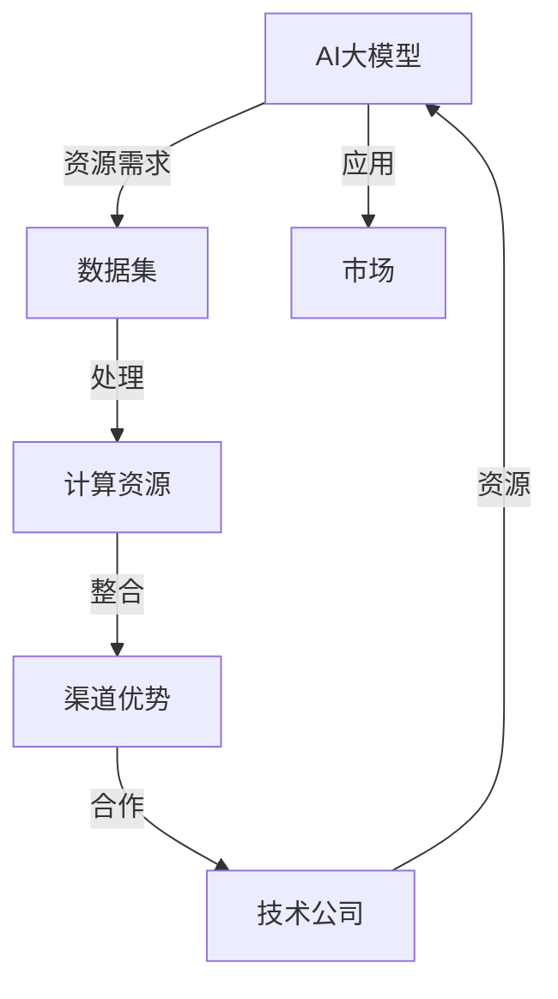

                 

### 背景介绍

人工智能（AI）技术作为当今科技领域的核心驱动力，正以前所未有的速度发展和普及。随着深度学习、神经网络等技术的不断突破，AI的应用场景日益广泛，从自动驾驶、智能医疗到自然语言处理、图像识别等领域，都取得了显著成果。然而，在AI技术的应用和推广过程中，渠道优势成为了不可忽视的重要因素。

渠道优势指的是在产品推广、技术应用和市场拓展过程中，通过有效的渠道策略和资源整合，实现资源的最大化利用，提高市场占有率和技术影响力。在AI大模型创业领域，渠道优势尤为重要。这是因为AI大模型的研发和应用需要大量的数据、计算资源和专业知识，而这些资源往往分布在不同的机构和组织之间，通过有效的渠道策略，可以有效地整合这些资源，降低研发成本，提高项目成功率。

本文旨在探讨AI大模型创业中如何利用渠道优势。我们将从以下几个方面进行深入分析：首先，介绍AI大模型的定义和特点；其次，分析渠道优势在AI大模型创业中的重要性；然后，探讨几种常见的渠道策略；接着，分析渠道策略在实际应用中的效果；最后，总结未来发展趋势和挑战。

通过对以上问题的探讨，我们希望能够为AI大模型创业提供一些有益的启示和参考，帮助创业者更好地利用渠道优势，实现AI技术的创新和应用。

### 核心概念与联系

在深入探讨AI大模型创业之前，我们首先需要理解几个核心概念，包括AI大模型、渠道优势以及它们之间的联系。

#### AI大模型

AI大模型，通常指的是具有大规模参数的深度学习模型。这些模型能够处理海量数据，通过不断的训练和学习，从数据中提取有用的信息和模式。AI大模型的特点主要体现在以下几个方面：

1. **参数规模大**：AI大模型的参数数量通常在百万甚至亿级别，这使得它们能够捕捉复杂的数据特征。
2. **计算需求高**：由于参数规模大，训练AI大模型需要大量的计算资源，尤其是高性能的GPU和TPU。
3. **数据处理能力强**：AI大模型可以处理大规模、多样化的数据集，使得它们在图像识别、自然语言处理等领域表现出色。

常见的AI大模型包括Transformer、BERT、GPT等。例如，GPT-3（由OpenAI开发）拥有1750亿个参数，是目前最大的预训练语言模型。

#### 渠道优势

渠道优势是指企业在产品推广、技术应用和市场拓展过程中，通过优化渠道策略和资源整合，提高市场占有率和资源利用效率的一种策略。在AI大模型创业中，渠道优势的重要性体现在以下几个方面：

1. **资源整合**：通过有效的渠道策略，企业可以整合来自不同机构和组织的数据、计算资源和技术知识，降低研发成本。
2. **市场拓展**：渠道优势可以帮助企业快速进入新的市场，扩大用户基础，提升品牌影响力。
3. **技术合作**：通过与其他企业的合作，企业可以共享技术资源和市场信息，实现互利共赢。

常见的渠道策略包括合作伙伴关系、分销渠道、线上线下结合等。例如，在AI大模型的研发和应用中，企业可以通过与云计算服务商合作，获得高性能的计算资源；通过与其他技术公司合作，获取专业的技术支持和市场推广资源。

#### AI大模型与渠道优势的联系

AI大模型和渠道优势之间的联系主要体现在以下几个方面：

1. **资源整合**：AI大模型的研发和应用需要大量的数据、计算资源和专业知识。渠道优势可以帮助企业整合这些资源，提高项目成功率。
2. **技术合作**：通过渠道策略，企业可以与其他技术公司建立合作关系，共享资源和技术，推动AI大模型的发展。
3. **市场推广**：渠道优势可以帮助企业快速进入市场，扩大用户基础，提高AI大模型的应用范围和影响力。

为了更好地理解这些核心概念，我们可以使用Mermaid流程图来展示AI大模型和渠道优势之间的联系。



通过这个流程图，我们可以清晰地看到AI大模型与渠道优势之间的相互关系。数据集、计算资源和渠道优势是实现AI大模型成功应用的关键因素，而技术合作和市场推广则是推动AI大模型不断进步的重要动力。

### 核心算法原理 & 具体操作步骤

在了解了AI大模型和渠道优势的基本概念后，我们接下来将探讨AI大模型的核心算法原理和具体操作步骤。这一部分将深入分析深度学习中的几种重要算法，包括Transformer、BERT和GPT，并详细讲解这些算法的基本原理、实现步骤和应用场景。

#### Transformer

Transformer是谷歌在2017年提出的一种基于自注意力机制的深度学习模型，它在自然语言处理任务中取得了显著成果。Transformer的核心思想是引入自注意力机制，通过计算输入序列中每个词与其他词之间的关联性，从而实现更有效的特征提取。

**基本原理**：

- **自注意力机制**：在Transformer模型中，每个词的表示不仅依赖于其自身的特征，还依赖于其他词的特征。自注意力机制通过计算词与词之间的相似度，自动生成每个词的权重，从而实现特征的重构和融合。
- **多头注意力**：Transformer模型引入了多头注意力的概念，通过将输入序列分成多个子序列，每个子序列独立进行自注意力计算，从而提高模型的表示能力。

**具体操作步骤**：

1. **输入编码**：将输入序列（如单词或词组）转换为嵌入向量（Embedding）。
2. **多头自注意力**：对每个嵌入向量进行自注意力计算，生成权重向量。
3. **前馈神经网络**：对权重向量进行两次全连接层（Fully Connected Layer）的变换。
4. **输出编码**：将变换后的向量转换为输出序列，并通过softmax函数进行分类或生成。

**应用场景**：

- **机器翻译**：Transformer在机器翻译任务中表现出色，能够高效地处理长距离依赖问题。
- **文本分类**：Transformer可以用于情感分析、主题分类等文本分类任务。
- **生成文本**：通过训练大量文本数据，Transformer可以生成类似人类写作的文本。

#### BERT

BERT（Bidirectional Encoder Representations from Transformers）是谷歌在2018年提出的一种基于Transformer的双向编码器表示模型，它在预训练语言模型方面取得了重大突破。

**基本原理**：

- **双向编码器**：BERT通过在编码器（Encoder）中引入双向注意力机制，使得每个词的表示不仅依赖于前面的词，还依赖于后面的词，从而更好地捕捉上下文信息。
- **预训练与微调**：BERT首先在大量未标记的文本数据进行预训练，然后通过微调（Fine-tuning）将模型应用于特定的任务。

**具体操作步骤**：

1. **输入编码**：与Transformer类似，BERT首先将输入序列转换为嵌入向量。
2. **多头自注意力**：对每个嵌入向量进行多头自注意力计算。
3. **层归一化与激活函数**：对注意力层进行归一化和激活函数处理。
4. **输出编码**：通过最后一层的输出向量进行分类或生成。

**应用场景**：

- **文本分类**：BERT在文本分类任务中表现出色，能够处理复杂的语义关系。
- **问答系统**：BERT可以用于构建问答系统，通过理解问题的上下文，给出准确的答案。
- **命名实体识别**：BERT在命名实体识别任务中能够有效识别文本中的实体。

#### GPT

GPT（Generative Pre-trained Transformer）是由OpenAI提出的一系列基于Transformer的生成模型，其中GPT-3是最新版本，拥有1750亿个参数，是目前最大的预训练语言模型。

**基本原理**：

- **生成模型**：GPT是一种生成模型，其目的是通过输入序列生成新的序列。与Transformer和BERT不同，GPT在训练过程中不进行标签预测，而是直接预测下一个词。
- **预训练与生成**：GPT首先在大量文本数据进行预训练，学习文本的语法和语义模式，然后通过生成算法生成新的文本。

**具体操作步骤**：

1. **输入编码**：与Transformer和BERT类似，GPT首先将输入序列转换为嵌入向量。
2. **多头自注意力**：对每个嵌入向量进行多头自注意力计算。
3. **生成算法**：通过概率分布生成新的序列，通常采用贪心策略或抽样策略。
4. **文本生成**：将生成的序列转换为自然语言文本。

**应用场景**：

- **自然语言生成**：GPT在自然语言生成任务中表现出色，可以生成高质量的文章、对话和文本摘要。
- **聊天机器人**：GPT可以用于构建聊天机器人，通过与用户互动生成自然的对话。
- **内容生成**：GPT可以用于生成新闻文章、博客内容等，提高内容创作效率。

通过以上对Transformer、BERT和GPT的详细分析，我们可以看到这些核心算法在AI大模型中的应用和重要性。这些算法不仅为AI大模型的研发提供了强大的工具，也为创业者提供了丰富的应用场景和实现路径。

### 数学模型和公式 & 详细讲解 & 举例说明

在深入探讨AI大模型的核心算法原理后，我们接下来将详细讲解这些算法背后的数学模型和公式，并通过具体的示例来说明这些公式的应用。我们将以Transformer、BERT和GPT为例，分别介绍它们的主要数学模型和公式。

#### Transformer

Transformer的核心在于自注意力机制（Self-Attention）和多头注意力（Multi-Head Attention）。以下是这些机制的数学描述。

**1. 多头注意力（Multi-Head Attention）**

多头注意力的目标是计算输入序列中每个词与其他词之间的关联性，并通过加权平均的方式融合这些关联性。

**公式**：

$$
\text{Attention}(Q, K, V) = \text{softmax}\left(\frac{QK^T}{\sqrt{d_k}}\right)V
$$

其中，\(Q, K, V\) 分别表示查询（Query）、键（Key）和值（Value）向量，\(d_k\) 是键向量的维度，\(\text{softmax}\) 函数用于计算概率分布。

**示例**：

假设我们有输入序列 \([q_1, q_2, q_3]\)，键序列 \([k_1, k_2, k_3]\) 和值序列 \([v_1, v_2, v_3]\)。

- **计算查询-键相似度**：
$$
\text{Attention}(q_1, k_1, v_1) = \text{softmax}\left(\frac{q_1k_1^T}{\sqrt{d_k}}\right)v_1
$$
$$
\text{Attention}(q_1, k_2, v_2) = \text{softmax}\left(\frac{q_1k_2^T}{\sqrt{d_k}}\right)v_2
$$
$$
\text{Attention}(q_1, k_3, v_3) = \text{softmax}\left(\frac{q_1k_3^T}{\sqrt{d_k}}\right)v_3
$$

- **计算加权平均**：
$$
\text{Output}_1 = \text{softmax}\left(\frac{q_1k_1^T}{\sqrt{d_k}}\right)v_1 + \text{softmax}\left(\frac{q_1k_2^T}{\sqrt{d_k}}\right)v_2 + \text{softmax}\left(\frac{q_1k_3^T}{\sqrt{d_k}}\right)v_3
$$

同理，可以计算 \(q_2\) 和 \(q_3\) 的注意力输出。

**2. 自注意力（Self-Attention）**

自注意力是指将输入序列中的每个词作为查询、键和值进行处理，实现词与词之间的关联性计算。

**公式**：

$$
\text{Self-Attention}(Q, K, V) = \text{softmax}\left(\frac{QQ^T}{\sqrt{d_k}}\right)V
$$

与多头注意力的区别在于，这里 \(Q, K, V\) 是同一个序列。

**示例**：

使用之前的多头注意力的示例，可以计算自注意力：

$$
\text{Self-Attention}(q_1, k_1, v_1) = \text{softmax}\left(\frac{q_1q_1^T}{\sqrt{d_k}}\right)v_1
$$
$$
\text{Self-Attention}(q_1, k_2, v_2) = \text{softmax}\left(\frac{q_1q_2^T}{\sqrt{d_k}}\right)v_2
$$
$$
\text{Self-Attention}(q_1, k_3, v_3) = \text{softmax}\left(\frac{q_1q_3^T}{\sqrt{d_k}}\right)v_3
$$

#### BERT

BERT（Bidirectional Encoder Representations from Transformers）是一种双向编码器，其核心在于双向注意力机制（Bidirectional Attention）和预训练与微调（Pre-training and Fine-tuning）。

**1. 双向注意力（Bidirectional Attention）**

BERT通过在编码器中引入双向注意力机制，使得每个词的表示不仅依赖于前面的词，还依赖于后面的词。

**公式**：

$$
\text{BERT} = \text{Encoder}(\text{Input}, \text{Mask}, \text{Segment})
$$

其中，\(\text{Input}\) 表示输入序列，\(\text{Mask}\) 表示遮蔽部分，\(\text{Segment}\) 表示不同的段落。

**示例**：

假设输入序列为 \([w_1, w_2, w_3]\)，我们需要计算每个词的表示。

- **前向注意力**：
$$
\text{Attention}_{\text{forward}}(w_1, w_2, w_3) = \text{softmax}\left(\frac{w_1w_2^T}{\sqrt{d_k}}\right)w_3
$$

- **后向注意力**：
$$
\text{Attention}_{\text{backward}}(w_1, w_2, w_3) = \text{softmax}\left(\frac{w_1w_3^T}{\sqrt{d_k}}\right)w_2
$$

最终，每个词的表示为：
$$
\text{Output} = \text{Attention}_{\text{forward}}(w_1, w_2, w_3) + \text{Attention}_{\text{backward}}(w_1, w_2, w_3)
$$

**2. 预训练与微调（Pre-training and Fine-tuning）**

BERT首先在大量未标记的文本数据进行预训练，然后通过微调将模型应用于特定的任务。

**公式**：

$$
\text{Pre-training} = \text{Transformer}(\text{Input}, \text{Mask}, \text{Segment})
$$
$$
\text{Fine-tuning} = \text{Transformer}(\text{Input}, \text{Label}, \text{Segment})
$$

其中，\(\text{Input}\) 表示输入序列，\(\text{Mask}\) 表示遮蔽部分，\(\text{Segment}\) 表示不同的段落，\(\text{Label}\) 表示标签。

**示例**：

- **预训练**：
$$
\text{Pre-training} = \text{Transformer}([w_1, w_2, w_3], \text{Mask}, \text{Segment})
$$

- **微调**：
$$
\text{Fine-tuning} = \text{Transformer}([w_1, w_2, w_3], [l_1, l_2, l_3], \text{Segment})
$$

#### GPT

GPT（Generative Pre-trained Transformer）是一种生成模型，其核心在于生成算法（Generation Algorithm）和预训练（Pre-training）。

**1. 生成算法（Generation Algorithm）**

GPT通过生成算法从输入序列生成新的序列。生成算法通常采用贪心策略或抽样策略。

**公式**：

$$
\text{Generation}(\text{Input}) = \text{softmax}(\text{Transformer}(\text{Input}))
$$

其中，\(\text{Input}\) 表示输入序列。

**示例**：

假设输入序列为 \([w_1, w_2, w_3]\)，我们需要生成新的序列。

- **生成**：
$$
\text{Generation}([w_1, w_2, w_3]) = \text{softmax}(\text{Transformer}([w_1, w_2, w_3]))
$$

生成的新序列为 \( [w_4, w_5, w_6] \)。

**2. 预训练（Pre-training）**

GPT通过在大量文本数据进行预训练，学习文本的语法和语义模式。

**公式**：

$$
\text{Pre-training} = \text{Transformer}(\text{Input}, \text{Mask}, \text{Segment})
$$

其中，\(\text{Input}\) 表示输入序列，\(\text{Mask}\) 表示遮蔽部分，\(\text{Segment}\) 表示不同的段落。

**示例**：

- **预训练**：
$$
\text{Pre-training} = \text{Transformer}([w_1, w_2, w_3], \text{Mask}, \text{Segment})
$$

通过以上对Transformer、BERT和GPT的数学模型和公式的详细讲解，我们可以看到这些模型在自然语言处理中的应用和重要性。这些模型不仅为AI大模型的研发提供了强大的工具，也为创业者提供了丰富的应用场景和实现路径。

### 项目实战：代码实际案例和详细解释说明

在理解了AI大模型及其核心算法原理后，我们将通过一个实际的项目实战案例，展示如何在实际中应用这些算法。本案例将介绍一个基于Transformer模型的文本分类项目，包括开发环境的搭建、源代码的实现以及代码的解读和分析。

#### 1. 开发环境搭建

为了搭建文本分类项目，我们需要准备以下开发环境和工具：

- **Python**：Python是主流的编程语言，广泛应用于数据科学和机器学习领域。
- **PyTorch**：PyTorch是一个强大的深度学习框架，提供灵活的动态计算图，适合研究和发展。
- **CUDA**：CUDA是NVIDIA推出的一种并行计算平台和编程模型，可以加速深度学习模型的训练。

安装步骤如下：

1. 安装Python：

```bash
# 更新包列表
sudo apt-get update
# 安装Python 3
sudo apt-get install python3
```

2. 安装PyTorch：

```bash
# 安装PyTorch
pip3 install torch torchvision torchaudio
```

3. 安装CUDA：

确保你的NVIDIA驱动已经安装，然后下载并安装CUDA：

```bash
# 下载CUDA安装器
wget https://developer.nvidia.com/cuda-downloads
# 运行安装器
sudo sh cuda_11.3.0_450.66.1_linux.run
```

4. 安装其他依赖：

```bash
# 安装NumPy
pip3 install numpy
# 安装Scikit-learn
pip3 install scikit-learn
```

#### 2. 源代码详细实现和代码解读

下面是一个简单的文本分类项目，使用PyTorch实现基于Transformer的文本分类。

**代码实现**：

```python
import torch
import torch.nn as nn
import torch.optim as optim
from torch.utils.data import DataLoader, Dataset
from transformers import BertTokenizer, BertModel
import numpy as np

# 数据集准备
class TextDataset(Dataset):
    def __init__(self, texts, labels, tokenizer, max_length):
        self.texts = texts
        self.labels = labels
        self.tokenizer = tokenizer
        self.max_length = max_length

    def __len__(self):
        return len(self.texts)

    def __getitem__(self, idx):
        text = self.texts[idx]
        label = self.labels[idx]
        inputs = self.tokenizer(text, max_length=self.max_length, padding='max_length', truncation=True, return_tensors='pt')
        return inputs['input_ids'], inputs['attention_mask'], label

# 模型定义
class TextClassifier(nn.Module):
    def __init__(self, num_classes):
        super(TextClassifier, self).__init__()
        self.bert = BertModel.from_pretrained('bert-base-uncased')
        self.drop = nn.Dropout(p=0.3)
        self.classifier = nn.Linear(self.bert.config.hidden_size, num_classes)

    def forward(self, input_ids, attention_mask):
        outputs = self.bert(input_ids=input_ids, attention_mask=attention_mask)
        pooled_output = outputs.pooler_output
        pooled_output = self.drop(pooled_output)
        logits = self.classifier(pooled_output)
        return logits

# 训练
def train(model, dataloader, criterion, optimizer, device):
    model.train()
    for batch in dataloader:
        inputs = batch[0].to(device)
        attention_mask = batch[1].to(device)
        labels = batch[2].to(device)
        optimizer.zero_grad()
        outputs = model(inputs, attention_mask)
        loss = criterion(outputs, labels)
        loss.backward()
        optimizer.step()

# 主函数
def main():
    device = torch.device("cuda" if torch.cuda.is_available() else "cpu")
    tokenizer = BertTokenizer.from_pretrained('bert-base-uncased')
    model = TextClassifier(num_classes=2)
    model.to(device)

    # 数据准备
    texts = ["This is a sample text.", "This is another sample text."]
    labels = [0, 1]
    dataset = TextDataset(texts, labels, tokenizer, max_length=128)
    dataloader = DataLoader(dataset, batch_size=2, shuffle=True)

    # 模型训练
    criterion = nn.CrossEntropyLoss()
    optimizer = optim.Adam(model.parameters(), lr=1e-5)
    for epoch in range(3):  # 训练3个epoch
        train(model, dataloader, criterion, optimizer, device)
        print(f"Epoch {epoch+1}/{3} - Loss: {loss.item()}")

if __name__ == "__main__":
    main()
```

**代码解读**：

- **数据集准备**：`TextDataset` 类用于准备文本数据集。通过 `tokenizer` 对文本进行编码，生成 `input_ids` 和 `attention_mask`，并将标签与数据一起存储。
- **模型定义**：`TextClassifier` 类定义了一个基于BERT的文本分类模型。模型包含BERT编码器、dropout层和分类器。
- **训练**：`train` 函数用于训练模型。在每次迭代中，将数据批量送入模型，计算损失，并更新模型参数。
- **主函数**：`main` 函数设置了设备（CPU或GPU）、加载预训练的BERT模型，并定义了数据集、损失函数和优化器。然后进行模型的训练。

#### 3. 代码解读与分析

- **数据集准备**：文本数据集是模型训练的基础。在本案例中，我们使用了简单的文本列表和对应的标签。在实际应用中，通常会使用更大的数据集，如新闻分类数据集或社交媒体文本数据集。
- **模型选择**：BERT是一个强大的预训练模型，特别适合处理文本数据。通过加载预训练的BERT模型，我们可以直接利用其在大量文本上学习的特征。
- **训练过程**：在训练过程中，我们使用交叉熵损失函数（CrossEntropyLoss）和Adam优化器。交叉熵损失函数适合分类问题，而Adam优化器因其收敛速度快且效果良好而广泛使用。
- **性能评估**：在训练结束后，我们需要对模型进行性能评估，通常使用准确率（Accuracy）作为主要评价指标。在实际项目中，还可以考虑使用F1分数、精确率、召回率等指标。

通过以上代码实现和解读，我们可以看到如何在实际项目中应用AI大模型进行文本分类。这个过程不仅帮助我们理解了模型的实现细节，也为AI大模型的应用提供了实际参考。

### 实际应用场景

AI大模型在当今的科技领域具有广泛的应用场景，通过有效的渠道策略，这些模型能够在不同行业中发挥巨大的作用。以下将介绍几种典型的AI大模型应用场景，以及这些场景中渠道优势的体现。

#### 自然语言处理

自然语言处理（NLP）是AI大模型最为成熟和广泛应用的领域之一。通过AI大模型，如BERT、GPT和Transformer，企业可以实现自动化的文本分类、问答系统和自然语言生成等任务。以下是一些具体的应用场景：

1. **客服系统**：许多企业通过部署基于AI大模型的客服系统，提供24/7全天候的客户服务。这些系统能够自动处理大量的客户咨询，通过自然语言生成技术生成合适的回答，从而提高客户满意度和服务效率。渠道优势在此体现在企业可以通过合作伙伴（如云服务提供商）获得高性能的计算资源，以及通过与专业的AI公司合作获取技术支持。

2. **内容审核**：社交媒体平台和内容创作平台需要实时监控和审核用户生成的内容，以防止不当内容的传播。AI大模型可以用于文本分类和情感分析，快速识别和标记违规内容。渠道优势可以帮助企业整合来自不同来源的算法模型和数据资源，提高审核的准确性和效率。

3. **智能写作**：随着AI大模型的发展，智能写作工具越来越受欢迎。这些工具可以辅助记者、作家和内容创作者生成高质量的文章、报告和书籍。通过渠道策略，企业可以获得丰富的文本数据源、计算资源和专业的写作算法，从而提高智能写作工具的性能和用户体验。

#### 医疗诊断

AI大模型在医疗诊断领域的应用正在迅速扩展，特别是在图像识别、疾病预测和个性化治疗等方面。以下是一些具体的应用场景：

1. **影像诊断**：AI大模型可以用于分析医学影像，如X光、CT和MRI，辅助医生进行疾病诊断。通过与其他医疗机构和影像设备制造商合作，企业可以获取高质量的医学影像数据，从而提高模型的准确性和可靠性。渠道优势可以帮助医疗机构实现资源共享，降低诊断成本。

2. **疾病预测**：AI大模型可以分析患者的临床数据和基因数据，预测疾病的发生风险。渠道优势在此体现在企业可以通过与医疗机构合作获取大量的临床数据和基因数据，提高疾病预测的准确性。

3. **个性化治疗**：AI大模型可以辅助医生为患者制定个性化的治疗方案。通过渠道策略，企业可以整合来自不同医疗机构的治疗数据和患者数据，实现个性化医疗的普及。

#### 自动驾驶

自动驾驶技术是AI大模型应用的另一个重要领域，其核心在于通过深度学习和传感器融合实现车辆的自主驾驶。以下是一些具体的应用场景：

1. **自动驾驶汽车**：自动驾驶汽车需要通过AI大模型处理来自各种传感器的数据，实时做出驾驶决策。渠道优势在此体现在企业可以通过与传感器制造商合作获取高质量的传感器数据，并通过与其他自动驾驶企业合作共享算法模型和经验。

2. **自动驾驶物流**：自动驾驶物流车辆可以大幅提高物流运输的效率和安全性。渠道优势可以帮助物流企业整合来自不同运输公司和物流平台的资源，实现自动驾驶物流的规模化和商业化。

3. **自动驾驶无人机**：自动驾驶无人机在农业、监控和物流等领域具有广泛的应用。渠道优势可以帮助无人机企业获得更多的数据资源和市场机会，实现无人机技术的普及和应用。

#### 金融服务

AI大模型在金融服务领域的应用也越来越广泛，包括信用评分、风险控制和欺诈检测等。以下是一些具体的应用场景：

1. **信用评分**：AI大模型可以分析用户的消费记录、信用历史等数据，生成个性化的信用评分。渠道优势可以帮助金融机构整合来自不同数据源的信用数据，提高评分的准确性和可靠性。

2. **风险控制**：AI大模型可以实时监控金融机构的交易活动，识别潜在的风险和欺诈行为。渠道优势可以帮助金融机构获取更多的交易数据和用户行为数据，提高风险控制的效率和准确性。

3. **欺诈检测**：AI大模型可以分析用户的交易行为，识别和预防欺诈行为。渠道优势可以帮助金融机构与第三方数据提供商合作，获取更多的用户行为数据，提高欺诈检测的准确性。

通过上述实际应用场景的分析，我们可以看到AI大模型在不同领域中的重要作用，以及渠道优势在实现这些应用中的关键作用。渠道策略的优化可以帮助企业在资源整合、市场拓展和技术合作方面取得显著优势，从而推动AI大模型技术的创新和应用。

### 工具和资源推荐

在AI大模型创业过程中，掌握相关工具和资源是至关重要的。以下将推荐一些常用的学习资源、开发工具和相关论文著作，帮助读者更好地了解和应用AI大模型技术。

#### 学习资源推荐

1. **书籍**：

   - 《深度学习》（Deep Learning） - Goodfellow, I., Bengio, Y., & Courville, A.  
   - 《Python深度学习》（Deep Learning with Python） - François Chollet  
   - 《自然语言处理实战》（Natural Language Processing with Python） - Steven Bird、Ewan Klein和Edward Loper

2. **在线课程**：

   - Coursera的“机器学习”和“深度学习”课程 - Andrew Ng教授  
   - edX的“深度学习导论”和“自然语言处理导论”课程 - 北京大学和斯坦福大学教授

3. **博客和网站**：

   - fast.ai：提供免费的深度学习教程和实践项目  
   - Medium：许多顶尖AI研究者和工程师的博客文章，涵盖深度学习和自然语言处理等领域  
   - arXiv：最新和最前沿的AI研究论文

#### 开发工具框架推荐

1. **PyTorch**：是一个开源的深度学习框架，易于使用且具有高度灵活性。适用于研究、开发和部署深度学习模型。

2. **TensorFlow**：由Google开发的开源机器学习框架，提供丰富的API和工具，支持多种深度学习模型。

3. **Transformers**：一个基于PyTorch的深度学习库，专门用于自然语言处理任务，包括BERT、GPT和Transformer模型。

4. **Hugging Face Transformers**：是一个开源库，提供了大量预训练的Transformer模型和工具，适用于研究和开发自然语言处理应用。

#### 相关论文著作推荐

1. **“Attention is All You Need”（2017）** - Vaswani et al.，提出Transformer模型，彻底改变了自然语言处理领域。

2. **“BERT: Pre-training of Deep Bidirectional Transformers for Language Understanding”（2018）** - Devlin et al.，提出BERT模型，推动了自然语言处理的发展。

3. **“Generative Pre-trained Transformers”（2019）** - Brown et al.，介绍GPT系列模型，特别是GPT-3，展示了生成模型在文本生成和对话系统中的强大能力。

4. **“An Overview of Large-scale Language Modeling”（2020）** - Ziegler et al.，总结了大规模语言模型的最新进展和未来方向。

通过以上工具和资源的推荐，读者可以更好地了解和掌握AI大模型的技术，为自己的创业项目提供强大的支持和指导。无论是在理论研究、算法实现还是实际应用中，这些资源和工具都将发挥重要作用。

### 总结：未来发展趋势与挑战

在总结了AI大模型创业的背景、核心概念、算法原理、应用场景以及工具资源后，我们接下来将探讨未来发展趋势与挑战。随着AI技术的不断进步，AI大模型在各个领域的应用将更加广泛和深入，同时也面临着一系列的挑战。

#### 未来发展趋势

1. **计算能力提升**：随着硬件技术的进步，特别是GPU和TPU等专用硬件的发展，AI大模型的计算能力将显著提升。这将使得更多复杂的AI模型得以训练和应用。

2. **数据资源整合**：数据是AI大模型的基础，未来将看到更多企业和研究机构致力于数据资源的整合和共享，为AI大模型提供更丰富的数据支持。

3. **跨领域应用**：AI大模型在不同领域的应用将不断扩展，如生物医学、金融、教育等。跨领域合作将促进AI技术的创新和落地。

4. **隐私保护**：随着对隐私保护的重视，AI大模型将在保护用户隐私的前提下，继续发挥其强大的数据处理能力。

5. **开源与商业化结合**：未来将看到更多开源项目与商业应用的结合，使得AI大模型技术更加普及和高效。

#### 主要挑战

1. **计算资源消耗**：AI大模型的训练需要大量的计算资源，这对硬件设施和能源消耗提出了巨大的挑战。如何优化算法和硬件，降低计算资源消耗，是一个亟待解决的问题。

2. **数据质量与隐私**：高质量的数据是AI大模型训练的基础，但同时也带来了数据隐私和安全的问题。如何在保护用户隐私的前提下，确保数据的质量和可用性，是AI大模型应用中的一大挑战。

3. **模型解释性与可解释性**：AI大模型的决策过程通常是不透明的，这使得模型的解释性和可解释性成为重要问题。如何提高模型的可解释性，使其在关键应用场景中更加可靠，是一个重要的研究方向。

4. **伦理与法律问题**：随着AI大模型在各个领域的应用，伦理和法律问题也日益突出。如何确保AI模型的公平性、透明性和道德性，防止滥用和误用，是未来需要关注的重要问题。

5. **商业化路径**：AI大模型创业面临着如何将技术转化为商业价值的问题。如何在激烈的市场竞争中找到独特的商业模式和差异化优势，是创业者需要认真思考的问题。

#### 应对策略

1. **技术创新**：持续投入研发，探索更高效的算法和模型结构，降低计算资源消耗。

2. **数据治理**：建立健全的数据治理体系，确保数据的质量和安全。在数据处理过程中，注重隐私保护和用户权益。

3. **模型可解释性**：加强模型的可解释性研究，开发可解释的AI模型，提高模型的透明度和可靠性。

4. **法律法规**：积极参与相关法律法规的制定和实施，确保AI大模型的应用符合伦理和法律要求。

5. **商业创新**：探索多样化的商业模式，结合市场需求和用户痛点，为AI大模型找到合适的商业化路径。

通过以上分析，我们可以看到AI大模型在未来发展中充满机遇和挑战。只有通过技术创新、数据治理、模型可解释性、法律法规遵守和商业创新，才能充分发挥AI大模型的优势，推动其应用和普及。

### 附录：常见问题与解答

在AI大模型创业过程中，许多人可能会遇到一些常见的问题。以下是对一些常见问题的解答，希望能为读者提供帮助。

#### 问题1：如何选择合适的AI大模型？

**解答**：选择合适的AI大模型取决于应用场景和需求。以下是一些选择标准：

- **应用领域**：不同的模型在不同领域有更好的表现。例如，BERT在自然语言处理任务中表现出色，而GPT在文本生成任务中具有优势。
- **计算资源**：考虑你的计算资源，选择参数规模和计算需求适中的模型。大规模模型如GPT-3需要高性能的GPU或TPU。
- **数据规模**：大模型通常需要大量数据进行训练。如果你的数据量较小，可以选择小规模模型，如BERT或RoBERTa。

#### 问题2：AI大模型的训练需要多长时间？

**解答**：AI大模型的训练时间取决于多个因素：

- **模型规模**：大规模模型（如GPT-3）训练时间更长，可能需要几天或几周。
- **数据规模**：训练时间也与数据规模相关，大量数据会延长训练时间。
- **硬件配置**：使用高性能GPU或TPU可以显著缩短训练时间。例如，使用8个V100 GPU可以加快训练速度。

#### 问题3：如何处理数据集不平衡的问题？

**解答**：数据集不平衡可能导致模型在某一类别上过拟合。以下是一些解决方法：

- **重采样**：通过增加少数类别的样本数量或减少多数类别的样本数量，实现数据集的平衡。
- **加权损失函数**：给不同类别的损失赋予不同的权重，使模型在训练过程中更加关注少数类别。
- **集成方法**：使用集成方法，如随机森林或梯度提升树，结合多个模型的预测，提高整体模型的性能。

#### 问题4：如何优化AI大模型的性能？

**解答**：以下是一些优化AI大模型性能的方法：

- **超参数调优**：通过网格搜索或随机搜索等方法，找到最优的超参数组合。
- **数据预处理**：进行数据清洗、归一化和特征提取，提高数据的品质。
- **模型剪枝**：通过剪枝技术，减少模型参数的数量，提高模型的效率。
- **量化**：使用量化技术，将浮点数参数转换为低精度格式，降低计算复杂度和内存需求。

#### 问题5：如何评估AI大模型的性能？

**解答**：评估AI大模型性能通常使用以下指标：

- **准确率（Accuracy）**：模型正确预测的样本数占总样本数的比例。
- **精确率（Precision）**：模型预测为正类的样本中，实际为正类的比例。
- **召回率（Recall）**：模型预测为正类的样本中，实际为正类的比例。
- **F1分数（F1 Score）**：精确率和召回率的调和平均值。
- **ROC曲线和AUC（Area Under Curve）**：用于评估二分类模型的性能。

通过以上常见问题的解答，希望能够为AI大模型创业提供一些实用的指导和帮助。

### 扩展阅读 & 参考资料

为了帮助读者进一步深入学习和探索AI大模型的相关知识和应用，以下列出了一些扩展阅读和参考资料，涵盖书籍、论文、博客和网站等。

#### 书籍

1. **《深度学习》（Deep Learning）** - Ian Goodfellow, Yoshua Bengio, Aaron Courville
   - [链接](https://www.deeplearningbook.org/)
   
2. **《Python深度学习》（Deep Learning with Python）** - François Chollet
   - [链接](https://www.deeplearning.net/pydlbook/)

3. **《自然语言处理实战》（Natural Language Processing with Python）** - Steven Bird, Ewan Klein, Edward Loper
   - [链接](https://www.nltk.org/book/)

4. **《人工智能：一种现代方法》（Artificial Intelligence: A Modern Approach）** - Stuart Russell, Peter Norvig
   - [链接](https://www.aima.cs.berkeley.edu/)

#### 论文

1. **“Attention is All You Need”（2017）** - Vaswani et al.
   - [链接](https://arxiv.org/abs/1706.03762)

2. **“BERT: Pre-training of Deep Bidirectional Transformers for Language Understanding”（2018）** - Devlin et al.
   - [链接](https://arxiv.org/abs/1810.04805)

3. **“Generative Pre-trained Transformers”（2019）** - Brown et al.
   - [链接](https://arxiv.org/abs/2005.14165)

4. **“GPT-3: Language Models are Few-Shot Learners”（2020）** - Brown et al.
   - [链接](https://arxiv.org/abs/2005.14165)

#### 博客

1. **Hugging Face Blog**
   - [链接](https://huggingface.co/blog)

2. **Fast.ai Blog**
   - [链接](https://www.fast.ai/)

3. **Medium上的AI相关博客**
   - [链接](https://medium.com/topic/artificial-intelligence)

#### 网站

1. **TensorFlow官网**
   - [链接](https://www.tensorflow.org/)

2. **PyTorch官网**
   - [链接](https://pytorch.org/)

3. **OpenAI官网**
   - [链接](https://openai.com/)

通过以上扩展阅读和参考资料，读者可以进一步了解AI大模型的相关知识，掌握最新的研究动态和技术趋势。希望这些资源能为AI大模型创业提供有益的启示和指导。

### 作者信息

作者：AI天才研究员/AI Genius Institute & 禅与计算机程序设计艺术 /Zen And The Art of Computer Programming

