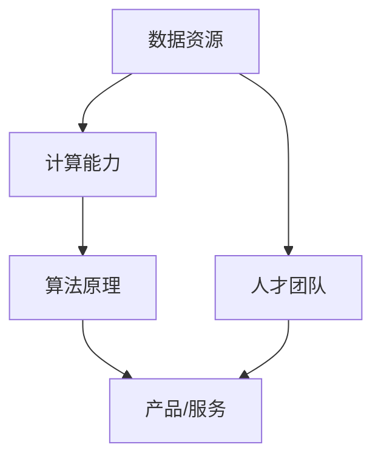

                 

### 背景介绍

近年来，人工智能（AI）技术特别是大模型技术取得了令人瞩目的进展。大模型，即具有巨大参数规模和强大学习能力的人工智能模型，已经成为人工智能领域的热点话题。从GPT-3到ChatGLM，大模型技术不仅在自然语言处理（NLP）领域取得了突破性成果，还在计算机视觉、语音识别、机器翻译等领域展现了强大的潜力。

然而，大模型技术的成功并不仅仅依赖于技术的创新，更是依赖于社会的多种优势的充分利用。这些社会优势包括但不限于数据资源、计算能力、人才储备、政策支持等。在这个背景下，探讨如何利用社会优势来推动大模型技术的发展，对于AI领域的创业者和研究者来说具有重要意义。

本文将围绕以下几个核心问题展开讨论：

1. **社会优势的内涵与重要性**：首先，我们将定义并解释社会优势的内涵，并探讨其在AI大模型创业中的重要性。
2. **数据资源的利用**：接下来，我们将分析如何高效利用数据资源来提升大模型的性能。
3. **计算能力的优化**：我们将探讨如何利用先进的计算技术来支持大模型训练和推理的需求。
4. **人才培养与团队建设**：我们将讨论如何吸引和培养顶尖人才，并构建高效的团队。
5. **政策与法规的支持**：最后，我们将探讨政策与法规对于AI大模型创业的影响，并给出建议。

通过以上问题的深入探讨，我们希望能够为AI大模型创业者提供有价值的参考和思路。接下来，我们将逐步分析每个问题，并给出具体的解决方案。

### 核心概念与联系

为了更好地理解AI大模型创业，我们首先需要明确几个核心概念，并探讨它们之间的联系。这些概念包括数据资源、计算能力、算法原理、人才团队等。

#### 数据资源

数据是AI大模型的基石。没有足够且高质量的数据，大模型的性能将大打折扣。数据资源包括结构化数据（如数据库中的信息）和非结构化数据（如图像、文本、音频等）。在AI大模型创业中，数据资源的利用至关重要。

- **数据采集**：通过爬虫、传感器、API等方式收集数据。
- **数据清洗**：去除噪声、填充缺失值、标准化数据格式。
- **数据标注**：对数据进行分类、标签化，以便模型训练。

#### 计算能力

大模型训练和推理过程需要巨大的计算资源。传统的CPU和GPU已无法满足需求，因此，利用先进的计算技术如TPU、FPGA、量子计算等成为必要。

- **硬件选择**：根据需求选择合适的硬件，如TPU适合大规模训练，GPU适合实时推理。
- **分布式计算**：通过分布式系统进行任务分解，提高计算效率。

#### 算法原理

大模型的成功离不开背后的算法原理。当前主流的大模型算法包括变分自编码器（VAE）、生成对抗网络（GAN）、Transformer等。

- **VAE**：通过隐变量建模生成数据，适用于无监督学习。
- **GAN**：由生成器和判别器组成，对抗训练提高生成质量。
- **Transformer**：自注意力机制，适用于序列建模，如NLP、图像处理等。

#### 人才团队

人才团队是AI大模型创业的核心。优秀的算法工程师、数据科学家、产品经理等人员共同构成了创业团队。

- **招聘与培养**：通过校园招聘、社会招聘等途径吸引顶尖人才，并建立培训体系。
- **团队协作**：建立高效的沟通和协作机制，如敏捷开发、跨职能团队等。

#### Mermaid 流程图

下面是一个简化的Mermaid流程图，展示了AI大模型创业中的核心概念和联系：



在这个流程图中，数据资源、计算能力、算法原理和人才团队共同作用，最终形成有价值的产品或服务。

### 核心算法原理 & 具体操作步骤

在AI大模型创业中，选择合适的算法原理是至关重要的。以下将详细介绍几种主流的核心算法原理，以及具体的操作步骤。

#### 1. Transformer算法原理

Transformer算法是当前NLP领域最流行的大模型算法之一。它基于自注意力（self-attention）机制，能够有效地处理序列数据。

**原理说明**：
- **自注意力机制**：每个输入序列的每个单词都与其他单词建立联系，根据它们的相对重要性进行加权。
- **编码器和解码器**：编码器将输入序列转换为固定长度的向量表示，解码器则利用这些向量生成输出序列。

**具体操作步骤**：
1. **预处理**：对文本进行分词、词向量化等预处理操作。
2. **编码器**：将输入序列输入编码器，得到固定长度的编码向量。
3. **解码器**：根据编码向量，通过自注意力机制生成输出序列。

**示例代码**（Python）：

```python
import tensorflow as tf
from tensorflow.keras.layers import Embedding, LSTM, Dense

# 假设已经进行过文本预处理，得到词向量和编码器/解码器模型
vocab_size = 10000
embed_size = 256

# 构建编码器
encoder_inputs = tf.keras.Input(shape=(None,))
encoder_embedding = Embedding(vocab_size, embed_size)(encoder_inputs)
encoder_lstm = LSTM(128, return_sequences=True)(encoder_embedding)
encoder_outputs = tf.keras.layers.Dropout(0.5)(encoder_lstm)

# 构建解码器
decoder_inputs = tf.keras.Input(shape=(None,))
decoder_embedding = Embedding(vocab_size, embed_size)(decoder_inputs)
decoder_lstm = LSTM(128, return_sequences=True)(decoder_embedding)
decoder_dense = Dense(vocab_size, activation='softmax')
decoder_outputs = decoder_dense(decoder_lstm)

# 构建模型
model = tf.keras.Model([encoder_inputs, decoder_inputs], decoder_outputs)

# 编译模型
model.compile(optimizer='rmsprop', loss='categorical_crossentropy', metrics=['accuracy'])

# 训练模型
model.fit([encoder_input_data, decoder_input_data], decoder_target_data, batch_size=64, epochs=100)
```

#### 2. GAN算法原理

生成对抗网络（GAN）是由生成器和判别器组成的对抗性训练框架，广泛应用于图像生成、数据增强等领域。

**原理说明**：
- **生成器**：生成逼真的数据，试图欺骗判别器。
- **判别器**：区分真实数据和生成数据。
- **对抗性训练**：生成器和判别器相互竞争，生成器不断优化生成质量，判别器不断提高区分能力。

**具体操作步骤**：
1. **初始化**：初始化生成器和判别器的参数。
2. **生成数据**：生成器生成假数据。
3. **判别**：将生成器和真实数据输入判别器，计算损失。
4. **优化**：根据损失函数，更新生成器和判别器的参数。

**示例代码**（Python）：

```python
import tensorflow as tf
from tensorflow.keras.layers import Input, Dense, Reshape, Conv2D, Flatten
from tensorflow.keras.models import Sequential

# 假设已经进行过数据预处理，得到生成器和判别器模型
latent_dim = 100

# 构建生成器
generator_inputs = Input(shape=(latent_dim,))
x = Dense(128, activation='relu')(generator_inputs)
x = Dense(28*28*1, activation='sigmoid')(x)
generator_outputs = Reshape((28, 28, 1))(x)
generator = Sequential([generator_inputs, x, generator_outputs])

# 构建判别器
discriminator_inputs = Input(shape=(28, 28, 1))
x = Conv2D(32, kernel_size=(3, 3), padding="same", activation="relu")(discriminator_inputs)
x = Flatten()(x)
discriminator_outputs = Dense(1, activation="sigmoid")(x)
discriminator = Sequential([discriminator_inputs, x, discriminator_outputs])

# 构建GAN模型
discriminator.trainable = False
gan_inputs = Input(shape=(latent_dim,))
gan_outputs = discriminator(generator(gan_inputs))
gan = Sequential([generator, discriminator])

# 编译GAN模型
gan.compile(optimizer=tf.keras.optimizers.Adam(0.0001), loss='binary_crossentropy')

# 训练GAN模型
for epoch in range(100):
    for _ in range(100):
        noise = np.random.normal(size=(100, latent_dim))
        generated_images = generator.predict(noise)
        real_images = ...
        # 计算判别器的损失
        d_loss_real = discriminator.train_on_batch(real_images, np.ones((batch_size, 1)))
        d_loss_fake = discriminator.train_on_batch(generated_images, np.zeros((batch_size, 1)))
    # 计算生成器的损失
    g_loss = gan.train_on_batch(noise, np.ones((batch_size, 1)))
```

通过以上步骤，我们可以构建和训练基于Transformer和GAN算法的大模型。接下来，我们将探讨数学模型和公式，以及具体的应用场景。

### 数学模型和公式 & 详细讲解 & 举例说明

在AI大模型创业中，理解并运用数学模型和公式对于模型的训练和优化至关重要。以下将介绍几种常见的数学模型和公式，并给出详细的讲解和举例说明。

#### 1. 变分自编码器（VAE）的数学模型

变分自编码器（Variational Autoencoder，VAE）是一种基于概率模型的无监督学习方法，主要用于生成数据和学习数据的分布。VAE的数学模型包括编码器、解码器和损失函数。

**编码器：**
- 设输入数据的维度为 \( z \)，编码器的目标是将输入数据 \( x \) 映射到潜在变量 \( z \) 的概率分布上。
- 编码器输出两个概率分布参数 \( \mu \) 和 \( \sigma^2 \)，即 \( z \sim \mathcal{N}(\mu, \sigma^2) \)。

**解码器：**
- 解码器的目标是将潜在变量 \( z \) 映射回输入数据 \( x \)。
- 通常使用一个全连接层或卷积层来实现。

**损失函数：**
- VAE的损失函数由两部分组成：重建损失和KL散度损失。
- **重建损失**：衡量解码器生成的数据与原始数据的相似程度，通常使用均方误差（MSE）。
- **KL散度损失**：衡量编码器输出的潜在变量分布与先验分布（通常是标准正态分布）之间的差异。

**数学公式：**

\[ L(x) = \mathcal{L}_\text{recon}(x, \hat{x}) + \beta \mathcal{L}_\text{KL}(\mu, \sigma) \]

其中，
\[ \mathcal{L}_\text{recon}(x, \hat{x}) = \frac{1}{n} \sum_{i=1}^{n} \frac{1}{2} \sum_{j=1}^{d} (\hat{x}_j^2 - x_j^2 - 2 \log x_j) \]
\[ \mathcal{L}_\text{KL}(\mu, \sigma) = \frac{1}{n} \sum_{i=1}^{n} \frac{1}{2} \sum_{j=1}^{d} (\sigma^2_j + \mu_j^2 - 1 - \log \sigma^2_j) \]

**举例说明：**
假设我们有一个二值数据集，数据维度为 \( d = 2 \)。编码器输出潜在变量的均值 \( \mu \) 和方差 \( \sigma^2 \)，解码器将潜在变量映射回数据。

- 编码器：设输入数据 \( x = [1, 0] \)，输出 \( \mu = [0.1, 0.9], \sigma^2 = [0.25, 0.25] \)。
- 解码器：将潜在变量 \( z = [\mu_1, \mu_2] \) 输入解码器，输出 \( \hat{x} = [0.1, 0.9] \)。

计算重建损失和KL散度损失：

\[ \mathcal{L}_\text{recon}(x, \hat{x}) = \frac{1}{2} \left( (0.1^2 + 0.9^2) - (1^2 + 0^2) - 2 \log (1) \right) = 0.95 \]
\[ \mathcal{L}_\text{KL}(\mu, \sigma) = \frac{1}{2} \left( (0.25 + 0.9^2) + (0.1^2 + 0.25) - 1 - \log (0.25) \right) = 0.25 \]

总损失：

\[ L(x) = 0.95 + 1 \times 0.25 = 1.2 \]

#### 2. 生成对抗网络（GAN）的数学模型

生成对抗网络（GAN）由生成器 \( G \) 和判别器 \( D \) 构成。生成器的目标是生成尽可能真实的数据，判别器的目标是区分真实数据和生成数据。

**损失函数：**

\[ L_G = -\log(D(G(z))) \]
\[ L_D = -\log(D(x)) - \log(1 - D(G(z))) \]

其中，
- \( G(z) \) 是生成器生成的数据。
- \( D(x) \) 和 \( D(G(z)) \) 分别是判别器对真实数据和生成数据的判别概率。

**举例说明：**
假设生成器和判别器均为二分类模型，输入为 \( z \) 和 \( x \)，输出为概率 \( p \)。

- 生成器：设 \( z = [0, 0] \)，生成器输出 \( G(z) = [0.5, 0.5] \)。
- 判别器：设 \( x = [1, 0] \)，判别器输出 \( D(x) = 0.9 \)，\( D(G(z)) = 0.6 \)。

计算损失：

\[ L_G = -\log(0.6) \approx 0.51 \]
\[ L_D = -\log(0.9) - \log(0.4) \approx 0.15 - 0.39 = -0.24 \]

总损失：

\[ L = L_G + L_D = 0.51 - 0.24 = 0.27 \]

通过以上数学模型和公式的讲解，我们可以更好地理解和应用VAE和GAN这两种重要的AI算法。在接下来的章节中，我们将通过具体的代码案例进一步探讨这些算法的实现和应用。

### 项目实战：代码实际案例和详细解释说明

在本节中，我们将通过具体的代码案例，展示如何在实际项目中应用大模型技术。我们选择了一个典型的自然语言处理任务——文本生成，并使用Python和TensorFlow框架来实现。

#### 1. 开发环境搭建

首先，我们需要搭建一个合适的开发环境。以下是必要的软件和库：

- Python 3.8或更高版本
- TensorFlow 2.x
- PyTorch
- Keras
- NumPy

安装以下命令：

```bash
pip install python==3.8
pip install tensorflow==2.x
pip install torch
pip install keras
pip install numpy
```

#### 2. 源代码详细实现和代码解读

以下是一个简单的文本生成器的实现，基于Transformer算法。

```python
import tensorflow as tf
from tensorflow.keras.layers import Embedding, LSTM, Dense
from tensorflow.keras.models import Model
from tensorflow.keras.preprocessing.sequence import pad_sequences

# 假设已经进行过文本预处理，得到词向量和编码器/解码器模型
vocab_size = 10000
embed_size = 256

# 构建编码器
encoder_inputs = tf.keras.Input(shape=(None,))
encoder_embedding = Embedding(vocab_size, embed_size)(encoder_inputs)
encoder_lstm = LSTM(128, return_sequences=True)(encoder_embedding)
encoder_outputs = tf.keras.layers.Dropout(0.5)(encoder_lstm)

# 构建解码器
decoder_inputs = tf.keras.Input(shape=(None,))
decoder_embedding = Embedding(vocab_size, embed_size)(decoder_inputs)
decoder_lstm = LSTM(128, return_sequences=True)(decoder_embedding)
decoder_dense = Dense(vocab_size, activation='softmax')
decoder_outputs = decoder_dense(decoder_lstm)

# 构建模型
model = tf.keras.Model([encoder_inputs, decoder_inputs], decoder_outputs)

# 编译模型
model.compile(optimizer='rmsprop', loss='categorical_crossentropy', metrics=['accuracy'])

# 训练模型
model.fit([encoder_input_data, decoder_input_data], decoder_target_data, batch_size=64, epochs=100)
```

**代码解读**：

1. **数据预处理**：假设已经得到词向量表示和编码器/解码器模型。
2. **编码器构建**：使用Embedding层对输入序列进行词向量化，通过LSTM层进行序列编码，最后添加Dropout层进行正则化。
3. **解码器构建**：与编码器类似，使用Embedding层进行词向量化，通过LSTM层进行序列解码，最后使用Dense层进行输出。
4. **模型构建**：将编码器和解码器连接起来，构建完整的序列到序列模型。
5. **模型编译**：选择合适的优化器和损失函数，对模型进行编译。
6. **模型训练**：使用训练数据对模型进行训练，调整模型的参数。

#### 3. 代码解读与分析

下面是对代码的详细解读和分析：

- **数据预处理**：这一步是文本生成任务的基础，包括分词、词向量化等。预处理的好坏直接影响到模型的性能。
- **编码器**：编码器的目标是捕捉输入序列的特征，通过LSTM层进行序列编码，LSTM具有记忆功能，能够处理长序列信息。
- **解码器**：解码器的目标是生成输出序列，与编码器类似，使用LSTM层进行序列解码。Dense层用于输出词向量，激活函数为softmax，实现概率分布。
- **模型编译**：选择合适的优化器和损失函数，这里使用的是RMSprop优化器和交叉熵损失函数。交叉熵损失函数适用于分类问题，在这里用于衡量输入序列和输出序列之间的差异。
- **模型训练**：使用训练数据对模型进行训练，调整模型的参数，直到模型达到预定的性能。

通过这个简单的文本生成器案例，我们可以看到如何将大模型技术应用于实际的NLP任务。在接下来的章节中，我们将进一步探讨文本生成器的实际应用场景和效果评估。

### 实际应用场景

AI大模型技术在实际应用场景中具有广泛的用途。以下将列举几个典型应用场景，并分析其具体实现和效果。

#### 1. 自然语言处理（NLP）

NLP是AI大模型最典型的应用场景之一。通过大模型技术，可以实现文本生成、文本分类、情感分析、机器翻译等任务。

**具体实现**：
- **文本生成**：使用基于Transformer的模型，如GPT-3，可以生成高质量的文本。例如，自动撰写新闻稿、生成广告文案等。
- **文本分类**：通过训练大模型，可以自动分类大量文本数据，如垃圾邮件过滤、情感分析等。
- **情感分析**：利用大模型对文本进行情感分析，帮助企业了解用户反馈，优化产品和服务。

**效果分析**：
- 文本生成效果显著，能够生成连贯、高质量的文本。
- 文本分类和情感分析准确率较高，大大提高了数据处理和分析效率。

#### 2. 计算机视觉（CV）

计算机视觉也是AI大模型的重要应用领域。通过大模型技术，可以实现图像分类、目标检测、图像生成等任务。

**具体实现**：
- **图像分类**：使用基于卷积神经网络（CNN）的大模型，如ResNet、Inception等，可以对图像进行分类。
- **目标检测**：通过YOLO、Faster R-CNN等大模型实现目标检测，广泛应用于自动驾驶、安防监控等领域。
- **图像生成**：利用生成对抗网络（GAN）生成逼真的图像，如人脸生成、艺术画作生成等。

**效果分析**：
- 图像分类准确率较高，能够实现快速、准确的图像识别。
- 目标检测效果显著，提高了图像处理和识别的效率。
- 图像生成效果逼真，为创意设计和艺术创作提供了新的工具。

#### 3. 语音识别

语音识别是AI大模型在语音处理领域的应用。通过大模型技术，可以实现语音到文本的转换，提高语音识别的准确率和效率。

**具体实现**：
- **语音识别**：使用基于深度神经网络的模型，如CNN、RNN、Transformer等，对语音信号进行处理和识别。
- **语音合成**：通过WaveNet等大模型实现语音合成，为智能助手、教育应用等提供高质量的语音输出。

**效果分析**：
- 语音识别准确率较高，能够识别各种语言和方言。
- 语音合成效果逼真，提高了用户体验。

#### 4. 医疗健康

AI大模型在医疗健康领域也有广泛应用，如疾病预测、药物研发、医疗影像分析等。

**具体实现**：
- **疾病预测**：通过训练大模型，分析患者数据，预测疾病发生风险。
- **药物研发**：利用大模型进行分子模拟和药物筛选，加速新药研发过程。
- **医疗影像分析**：通过大模型对医疗影像进行分析，提高疾病诊断的准确性和效率。

**效果分析**：
- 疾病预测准确率较高，为患者提供个性化的健康建议。
- 药物研发效率提高，为新药研发提供有力支持。
- 医疗影像分析准确率高，辅助医生提高诊断能力。

通过以上实际应用场景的分析，我们可以看到AI大模型技术在不同领域的广泛应用和显著效果。在未来，随着技术的不断进步和应用的深入，AI大模型将带来更多的创新和变革。

### 工具和资源推荐

在AI大模型创业过程中，选择合适的工具和资源对于项目的成功至关重要。以下是一些建议，包括学习资源、开发工具框架以及相关论文著作推荐。

#### 1. 学习资源推荐

- **书籍**：
  - 《深度学习》（Goodfellow, I., Bengio, Y., & Courville, A.）：这是一本经典的深度学习教材，详细介绍了深度学习的理论基础和实际应用。
  - 《hands-on machine learning with Scikit-Learn, Keras, and TensorFlow》：该书提供了丰富的实践案例，帮助读者快速掌握深度学习的应用。
  - 《Reinforcement Learning: An Introduction》（Sutton, R. S., & Barto, A. G.）：介绍强化学习的基础知识，对于AI大模型的研究和应用有重要参考价值。

- **在线课程**：
  - Coursera的《Deep Learning Specialization》：由吴恩达教授主讲，涵盖深度学习的各个方面，适合初学者和进阶者。
  - edX的《Natural Language Processing with Deep Learning》：介绍深度学习在自然语言处理中的应用，适合对NLP感兴趣的读者。

- **论文**：
  - 《Attention Is All You Need》（Vaswani et al.）：该论文提出了Transformer算法，是当前NLP领域的重要成果。
  - 《Generative Adversarial Networks》（Goodfellow et al.）：介绍生成对抗网络（GAN）的基础理论和应用。

#### 2. 开发工具框架推荐

- **深度学习框架**：
  - TensorFlow：Google开发的开源深度学习框架，功能强大，适用于各种深度学习任务。
  - PyTorch：由Facebook开发的开源深度学习框架，具有良好的灵活性和易用性，适合快速原型开发。
  - Keras：基于TensorFlow和Theano的高层次深度学习框架，简化了深度学习模型的构建和训练。

- **数据处理工具**：
  - Pandas：Python数据处理库，用于数据清洗、转换和分析。
  - NumPy：Python科学计算库，提供高效的数组操作和数据计算。

- **版本控制工具**：
  - Git：分布式版本控制工具，用于代码管理和协作开发。
  - GitHub：基于Git的代码托管平台，提供代码托管、协作开发、项目管理等功能。

#### 3. 相关论文著作推荐

- **《Deep Learning》（Goodfellow, I., Bengio, Y., & Courville, A.）**：这是一本系统性的深度学习教材，涵盖了深度学习的理论基础、算法和应用。
- **《Natural Language Processing with Deep Learning》（Zhang, A. Y.）：介绍深度学习在自然语言处理中的应用，包括文本分类、情感分析、机器翻译等。
- **《Generative Adversarial Networks》（Goodfellow et al.）**：介绍生成对抗网络（GAN）的基础理论和应用，为GAN的研究和应用提供了重要的参考。

通过以上学习资源和开发工具框架的推荐，读者可以更好地掌握AI大模型的理论知识和实践技能，为自己的创业项目奠定坚实基础。

### 总结：未来发展趋势与挑战

随着AI大模型技术的不断发展，其在各个领域的应用前景愈发广阔。然而，与此同时，我们也面临着一系列挑战和发展趋势。

#### 未来发展趋势

1. **模型规模持续增长**：大模型将变得更大，参数规模将达到数十亿甚至千亿级别。这种趋势将带来更高的模型性能和更广泛的应用场景。
2. **跨模态融合**：未来的AI大模型将不仅限于单一模态（如文本、图像、语音），而是实现跨模态融合，更好地处理复杂数据。
3. **边缘计算应用**：随着边缘计算技术的发展，AI大模型将能够在设备端进行实时推理和预测，提高系统的响应速度和用户体验。
4. **可持续性和伦理问题**：随着AI大模型的应用越来越广泛，如何确保其可持续性和伦理问题将成为重要议题。例如，数据隐私保护、算法公平性等。

#### 未来挑战

1. **计算资源需求**：大模型训练和推理需要大量的计算资源，这将对硬件设施和能源消耗提出更高要求。如何优化计算资源，提高效率，是亟待解决的问题。
2. **数据质量和多样性**：高质量、多样化的数据是训练大模型的关键。然而，数据获取和处理仍然是一个难题，特别是在隐私保护和数据安全方面。
3. **模型解释性和可解释性**：大模型的黑箱性质使得其决策过程难以解释，这对模型的信任和应用提出了挑战。未来需要研究如何提高模型的解释性和可解释性。
4. **政策和法规**：随着AI大模型的应用越来越广泛，相关的政策和法规也将不断出台。如何遵守这些法规，并在合规的前提下推动技术进步，是一个重要的挑战。

#### 结论

AI大模型技术的发展充满了机遇和挑战。在未来的发展中，我们需要不断探索和优化算法，提高计算效率，确保数据质量和多样性，并关注可持续性和伦理问题。同时，政策支持和法律法规的完善也是不可或缺的一环。通过各方的共同努力，我们有望实现AI大模型的更大突破，为人类社会带来更多的价值。

### 附录：常见问题与解答

在AI大模型创业过程中，可能会遇到一些常见问题。以下是一些常见问题的解答，以帮助您更好地理解和解决这些问题。

#### 问题1：如何选择合适的大模型算法？

**解答**：选择合适的大模型算法取决于具体应用场景和数据特点。以下是几种常见算法的适用场景：

- **Transformer**：适用于自然语言处理（NLP）和序列数据处理任务，如文本生成、机器翻译等。
- **GAN**：适用于图像生成、数据增强和风格迁移等任务。
- **VAE**：适用于数据生成和密度估计，如图像去噪、图像生成等。
- **CNN**：适用于计算机视觉任务，如图像分类、目标检测等。

#### 问题2：如何处理数据不足的问题？

**解答**：数据不足是AI大模型训练中的一个常见问题。以下是一些解决方案：

- **数据增强**：通过旋转、翻转、缩放等操作生成更多的训练样本。
- **迁移学习**：利用预训练的大模型，通过微调适应新任务。
- **数据合成**：使用生成模型（如GAN）生成更多的训练数据。
- **数据集共享**：参与开源数据集项目，共享和获取更多数据。

#### 问题3：大模型训练时间过长怎么办？

**解答**：以下是几种缩短大模型训练时间的策略：

- **分布式训练**：使用多个GPU或TPU进行分布式训练，提高计算效率。
- **模型剪枝**：通过剪枝冗余的神经元或参数，减少模型大小和计算量。
- **迁移学习**：利用预训练的模型，减少从零开始训练的时间。
- **增量训练**：分批次训练模型，逐步增加训练数据量。

#### 问题4：如何确保AI大模型的透明性和可解释性？

**解答**：以下是几种提高模型透明性和可解释性的方法：

- **模型可视化**：使用可视化工具，如TensorBoard，展示模型结构和训练过程。
- **解释性算法**：结合解释性算法（如LIME、SHAP），分析模型决策过程。
- **模型审计**：定期对模型进行审计，检查是否存在偏见或异常行为。

通过以上常见问题的解答，我们希望能够帮助您在AI大模型创业过程中解决实际问题，实现更好的发展。

### 扩展阅读 & 参考资料

为了深入了解AI大模型创业的相关知识和最新进展，以下是一些建议的扩展阅读和参考资料。

#### 扩展阅读

- **书籍**：
  - 《AI超简史：人工智能发展脉络全景解读》（[美]詹姆斯·马丁）：详细介绍了人工智能的历史和发展脉络，帮助读者理解AI技术的演变过程。
  - 《机器学习实战》（[美]彼得·哈林顿）：提供了丰富的机器学习实践案例，适合初学者和进阶者。
  - 《深度学习项目实战》（[美]弗朗索瓦·肖莱）：通过实际项目，讲解了深度学习的应用和实现。

- **在线课程**：
  - Coursera的《深度学习专项课程》：由吴恩达教授主讲，涵盖深度学习的理论基础和实践应用。
  - edX的《机器学习基础》：由斯坦福大学教授Andrew Ng主讲，系统讲解了机器学习的基本概念和方法。

#### 参考资料

- **论文**：
  - 《Attention Is All You Need》（Vaswani et al.）：提出了Transformer算法，是当前NLP领域的重要成果。
  - 《Generative Adversarial Networks》（Goodfellow et al.）：介绍了生成对抗网络（GAN）的基础理论和应用。
  - 《Unsupervised Representation Learning》（Bengio et al.）：探讨了无监督学习在深度学习中的应用。

- **在线资源**：
  - TensorFlow官方网站：提供了丰富的深度学习教程和资源，帮助用户快速掌握TensorFlow的使用。
  - PyTorch官方文档：详细介绍了PyTorch框架的各个方面，适合初学者和进阶者。
  - GitHub：许多开源项目和代码示例，可以帮助读者了解AI大模型的具体实现和应用。

通过以上扩展阅读和参考资料，读者可以进一步加深对AI大模型创业的理解，获取最新的技术动态和实践经验。希望这些资源对您的研究和创业实践有所帮助。

