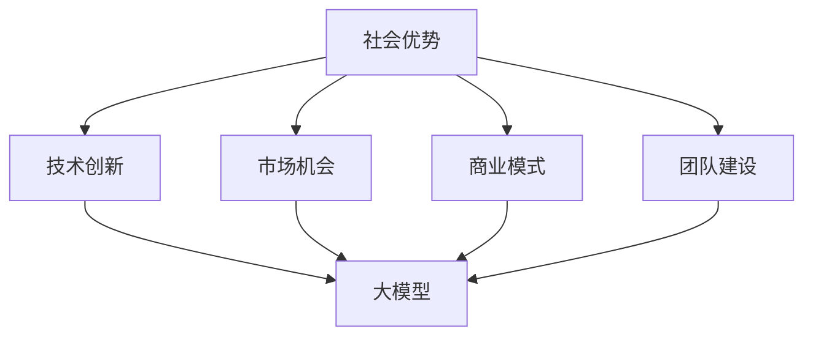

                 

# AI 大模型创业：如何利用社会优势？

> 关键词：人工智能、大模型、创业、社会优势、技术战略

> 摘要：本文将探讨人工智能大模型在创业领域的应用，分析大模型如何通过利用社会优势实现商业成功，并提供实用的创业建议和策略。

## 1. 背景介绍

在过去的几十年中，人工智能（AI）技术取得了飞速发展。特别是深度学习领域的突破，使得大模型的应用变得愈发广泛。大模型，如GPT-3、BERT等，具有处理大规模数据、生成高质量内容、进行复杂决策等能力。这些模型在各个行业都展现出了巨大的潜力，包括医疗、金融、教育等。

随着AI大模型技术的成熟，越来越多的创业公司开始关注这一领域。然而，如何有效地利用社会优势，将AI大模型技术转化为商业价值，成为了许多创业公司面临的挑战。本文旨在探讨这一主题，为创业者提供一些实用的建议和策略。

### 1.1 人工智能大模型的历史与发展

人工智能（AI）的概念最早可以追溯到20世纪50年代。当时，科学家们提出了“机器能否模仿人类的智能行为”的问题。随着计算机技术的不断发展，AI研究取得了许多突破，包括专家系统、自然语言处理、计算机视觉等。

深度学习作为AI的一个重要分支，起源于20世纪80年代。在2012年，AlexNet在ImageNet竞赛中取得了惊人的成绩，标志着深度学习时代的到来。随后，卷积神经网络（CNN）、循环神经网络（RNN）等模型相继出现，并取得了显著的应用效果。

在过去的几年中，随着计算能力和数据量的增加，大模型如GPT、BERT等相继出现，使得AI技术在自然语言处理、图像识别等领域取得了新的突破。这些大模型具有处理大规模数据、生成高质量内容、进行复杂决策等能力，为创业公司提供了丰富的机会。

### 1.2 大模型在创业领域的应用现状

目前，许多创业公司已经开始利用大模型技术进行产品开发。以下是一些典型应用场景：

- **自然语言处理（NLP）**：许多创业公司利用GPT、BERT等大模型提供智能客服、文本生成、情感分析等服务。例如，OpenAI的GPT-3可以生成高质量的文本，适用于写作、翻译、问答等场景。

- **计算机视觉**：创业公司利用深度学习模型进行图像识别、目标检测、人脸识别等任务。例如，DeepMind的AlphaGo在围棋领域取得了突破性成果，ImageNet竞赛中的深度学习模型在图像识别领域取得了高精度。

- **推荐系统**：许多创业公司利用大模型进行个性化推荐，提高用户满意度和转化率。例如，YouTube、Amazon等平台利用深度学习模型进行内容推荐和商品推荐。

- **自动驾驶**：自动驾驶技术是AI领域的一个重要应用方向。创业公司如Waymo、NVIDIA等在自动驾驶领域取得了显著进展，利用深度学习模型进行环境感知、路径规划、决策控制等任务。

### 1.3 创业公司面临的挑战

尽管大模型在创业领域具有巨大的潜力，但创业公司在应用这些技术时也面临一些挑战：

- **技术难度**：大模型技术具有很高的技术门槛，需要创业者具备深厚的专业知识。对于许多初创公司而言，技术团队的建设和培养是一个重要挑战。

- **数据资源**：大模型需要大量的数据训练，而高质量的数据获取难度较大。创业公司可能需要投入大量资源进行数据采集和清洗，以确保模型的性能和可靠性。

- **商业模式**：大模型的应用场景多样，创业公司需要找到合适的商业模式，将技术转化为商业价值。这需要创业者对市场有深入的了解，并能够把握行业趋势。

## 2. 核心概念与联系

### 2.1 社会优势的定义

社会优势，是指企业在社会资源、市场需求、技术环境等方面的优势。这些优势可以帮助企业更好地利用资源，抓住市场机会，实现商业成功。在社会优势的基础上，创业公司可以更有效地应用AI大模型技术，实现以下目标：

- **提高效率**：利用大模型技术，企业可以自动化许多重复性工作，提高生产效率。

- **降低成本**：大模型技术可以帮助企业降低人力成本、减少错误率，提高整体效益。

- **拓展市场**：通过AI大模型，企业可以更好地了解市场需求，开发出更符合用户需求的产品。

- **提升竞争力**：大模型技术可以帮助企业保持技术领先地位，提高市场竞争力。

### 2.2 大模型与创业的关系

大模型与创业之间的关系可以概括为以下几个方面：

- **技术创新**：大模型技术为创业公司提供了强大的技术创新能力。通过引入大模型，创业公司可以开发出具有独特优势的产品和服务。

- **市场机会**：大模型的应用场景广泛，为创业公司提供了丰富的市场机会。创业公司可以根据市场需求，选择合适的应用场景，进行产品开发。

- **商业模式**：大模型技术可以帮助创业公司找到新的商业模式，实现商业成功。例如，通过提供AI服务、数据交易等方式，创业公司可以创造新的收入来源。

- **团队建设**：大模型技术需要专业的团队进行研发和应用。对于创业公司而言，吸引和培养专业人才是关键，有助于提升公司的技术实力和竞争力。

### 2.3 社会优势与大模型的结合

将社会优势与大模型技术相结合，可以实现以下目标：

- **资源共享**：通过社会优势，创业公司可以获取更多的资源，如人才、资金、数据等，为大模型研发和应用提供支持。

- **协同创新**：社会优势可以帮助创业公司建立创新生态系统，与合作伙伴共同推进大模型技术的研究和应用。

- **市场推广**：社会优势可以帮助创业公司更好地了解市场需求，制定有效的市场推广策略，提高产品的市场认知度和接受度。

- **风险管理**：社会优势可以为创业公司提供风险控制能力，降低技术失败和市场失败的风险。

## 2.4 大模型与创业的 Mermaid 流程图



### 2.5 社会优势与大模型的结合方式

- **技术创新**：通过社会优势，创业公司可以吸引更多的技术创新人才，组建专业团队，研发具有竞争力的AI大模型产品。

- **市场机会**：通过社会优势，创业公司可以了解市场需求，选择合适的应用场景，开发具有市场前景的大模型产品。

- **商业模式**：通过社会优势，创业公司可以探索多元化的商业模式，如AI服务、数据交易等，实现商业价值的最大化。

- **团队建设**：通过社会优势，创业公司可以吸引和培养专业人才，提升团队的技术实力和创新能力。

## 3. 核心算法原理 & 具体操作步骤

### 3.1 大模型的基本原理

大模型是指具有数十亿甚至千亿参数的神经网络模型。这些模型通过大量数据进行训练，可以自动学习数据中的模式和规律。大模型的基本原理包括以下几个方面：

- **神经网络**：神经网络是一种模拟人脑神经元连接结构的计算模型。通过多层神经网络，可以将输入数据转化为有用的信息。

- **深度学习**：深度学习是神经网络的一种扩展，通过增加网络层数，可以提高模型的复杂度和表达能力。深度学习在图像识别、自然语言处理等领域取得了显著成果。

- **大数据**：大模型需要大量数据进行训练，这些数据可以是结构化的，也可以是非结构化的。通过大数据训练，大模型可以更好地学习数据中的模式和规律。

### 3.2 大模型的训练过程

大模型的训练过程主要包括以下步骤：

- **数据预处理**：对输入数据进行清洗、归一化等处理，确保数据的质量和一致性。

- **模型初始化**：初始化神经网络模型的参数，通常使用随机初始化方法。

- **前向传播**：将输入数据传递到神经网络中，通过多层网络进行特征提取和转换。

- **损失函数计算**：计算模型输出与真实标签之间的差异，使用损失函数衡量模型的性能。

- **反向传播**：根据损失函数，调整神经网络的参数，使得模型能够更好地拟合训练数据。

- **迭代优化**：重复前向传播和反向传播过程，不断迭代优化模型参数，直到模型收敛。

### 3.3 大模型的应用步骤

大模型的应用主要包括以下步骤：

- **模型选择**：根据应用场景，选择合适的大模型，如GPT、BERT、ViT等。

- **数据准备**：准备训练数据和应用数据，确保数据的质量和一致性。

- **模型训练**：使用训练数据对模型进行训练，调整模型参数，使得模型能够更好地拟合数据。

- **模型评估**：使用测试数据对模型进行评估，衡量模型的性能和效果。

- **模型部署**：将训练好的模型部署到生产环境，实现实际应用。

## 4. 数学模型和公式 & 详细讲解 & 举例说明

### 4.1 大模型的基本数学模型

大模型通常是基于多层感知器（MLP）或者卷积神经网络（CNN）构建的。以下是这些模型的数学公式：

#### 4.1.1 多层感知器（MLP）

多层感知器是一种前向传播神经网络，其基本数学模型可以表示为：

$$
Z^{(l)} = \sigma(W^{(l)} \cdot A^{(l-1)} + b^{(l)})
$$

其中：

- \( Z^{(l)} \) 表示第\( l \)层的输出。
- \( \sigma \) 表示激活函数，常用的有Sigmoid、ReLU等。
- \( W^{(l)} \) 表示第\( l \)层的权重。
- \( A^{(l-1)} \) 表示第\( l-1 \)层的输出。
- \( b^{(l)} \) 表示第\( l \)层的偏置。

#### 4.1.2 卷积神经网络（CNN）

卷积神经网络主要用于图像处理任务，其基本数学模型可以表示为：

$$
h^{(l)}_i = \sigma \left( \sum_j W^{(l)}_{ij} * h^{(l-1)}_j + b^{(l)}_i \right)
$$

其中：

- \( h^{(l)}_i \) 表示第\( l \)层的第\( i \)个特征。
- \( * \) 表示卷积操作。
- \( W^{(l)} \) 和 \( b^{(l)} \) 分别表示第\( l \)层的权重和偏置。

### 4.2 大模型的优化算法

大模型的训练过程通常涉及复杂的优化算法，如梯度下降（Gradient Descent）、Adam等。以下是这些算法的基本公式：

#### 4.2.1 梯度下降（Gradient Descent）

梯度下降是一种基本的优化算法，其目标是最小化损失函数。其公式如下：

$$
\theta = \theta - \alpha \cdot \nabla_\theta J(\theta)
$$

其中：

- \( \theta \) 表示模型参数。
- \( \alpha \) 表示学习率。
- \( \nabla_\theta J(\theta) \) 表示损失函数关于模型参数的梯度。

#### 4.2.2 Adam算法

Adam是一种自适应优化算法，其公式如下：

$$
m_t = \beta_1 m_{t-1} + (1 - \beta_1) ( \nabla_\theta J(\theta) )
$$

$$
v_t = \beta_2 v_{t-1} + (1 - \beta_2) (\nabla_\theta J(\theta))^2
$$

$$
\theta = \theta - \alpha \cdot \frac{m_t}{\sqrt{v_t} + \epsilon}
$$

其中：

- \( m_t \) 和 \( v_t \) 分别表示一阶和二阶矩估计。
- \( \beta_1 \) 和 \( \beta_2 \) 分别表示一阶和二阶矩的指数衰减率。
- \( \alpha \) 表示学习率。
- \( \epsilon \) 是一个较小的常数。

### 4.3 举例说明

假设我们有一个简单的神经网络，包含一个输入层、一个隐藏层和一个输出层。输入层有3个神经元，隐藏层有4个神经元，输出层有2个神经元。我们使用ReLU作为激活函数，损失函数为均方误差（MSE）。

#### 4.3.1 前向传播

输入层到隐藏层的激活函数：

$$
h^{(1)}_i = \sigma \left( W^{(1)}_{ij} * a_j + b^{(1)}_i \right)
$$

隐藏层到输出层的激活函数：

$$
y^{(2)}_i = \sigma \left( W^{(2)}_{ij} * h^{(1)}_j + b^{(2)}_i \right)
$$

其中：

- \( a_j \) 是输入层的第\( j \)个神经元。
- \( h^{(1)}_i \) 是隐藏层的第\( i \)个神经元。
- \( y^{(2)}_i \) 是输出层的第\( i \)个神经元。

#### 4.3.2 反向传播

计算损失函数关于模型参数的梯度：

$$
\nabla_\theta J(\theta) = \nabla_\theta L(y^{(2)}, y) = \nabla_\theta (MSE(y^{(2)}, y))
$$

其中：

- \( y \) 是真实标签。
- \( y^{(2)} \) 是模型的输出。

计算隐藏层到输出层的梯度：

$$
\nabla_{h^{(1)}} J(\theta) = \nabla_{h^{(1)}} L(y^{(2)}, y)
$$

$$
\nabla_{W^{(2)}} J(\theta) = \nabla_{W^{(2)}} (MSE(y^{(2)}, y)) * h^{(1)}
$$

$$
\nabla_{b^{(2)}} J(\theta) = \nabla_{b^{(2)}} (MSE(y^{(2)}, y))
$$

计算输入层到隐藏层的梯度：

$$
\nabla_{a_j} J(\theta) = \nabla_{a_j} L(y^{(2)}, y)
$$

$$
\nabla_{W^{(1)}} J(\theta) = \nabla_{W^{(1)}} (MSE(y^{(2)}, y)) * a_j
$$

$$
\nabla_{b^{(1)}} J(\theta) = \nabla_{b^{(1)}} (MSE(y^{(2)}, y))
$$

#### 4.3.3 梯度下降更新

使用梯度下降算法更新模型参数：

$$
W^{(2)} = W^{(2)} - \alpha \cdot \nabla_{W^{(2)}} J(\theta)
$$

$$
b^{(2)} = b^{(2)} - \alpha \cdot \nabla_{b^{(2)}} J(\theta)
$$

$$
W^{(1)} = W^{(1)} - \alpha \cdot \nabla_{W^{(1)}} J(\theta)
$$

$$
b^{(1)} = b^{(1)} - \alpha \cdot \nabla_{b^{(1)}} J(\theta)
$$

通过以上步骤，我们可以实现大模型的训练和优化。

## 5. 项目实战：代码实际案例和详细解释说明

### 5.1 开发环境搭建

为了实现本文中的项目实战，我们需要搭建一个合适的开发环境。以下是一个基本的开发环境搭建步骤：

- **Python**：安装Python 3.8或更高版本。
- **TensorFlow**：安装TensorFlow 2.4或更高版本。
- **CUDA**：安装CUDA 10.2或更高版本（如需使用GPU加速）。
- **PyTorch**：安装PyTorch 1.7或更高版本（如需使用PyTorch）。

安装完成后，我们可以使用以下命令来检查安装的版本：

```python
python --version
```

```shell
pip install tensorflow
```

```shell
nvcc --version
```

```shell
pip install torch torchvision
```

### 5.2 源代码详细实现和代码解读

以下是一个简单的大模型训练示例，使用TensorFlow实现。我们将使用MNIST数据集进行训练，这是一个常用的手写数字识别数据集。

#### 5.2.1 导入所需的库

```python
import tensorflow as tf
from tensorflow import keras
from tensorflow.keras import layers
import numpy as np
import matplotlib.pyplot as plt
```

#### 5.2.2 数据预处理

```python
# 加载数据集
(x_train, y_train), (x_test, y_test) = keras.datasets.mnist.load_data()

# 数据预处理
x_train = x_train.astype("float32") / 255
x_test = x_test.astype("float32") / 255

# 归一化数据
x_train = x_train.reshape(-1, 28 * 28)
x_test = x_test.reshape(-1, 28 * 28)

# 编码标签
y_train = keras.utils.to_categorical(y_train, 10)
y_test = keras.utils.to_categorical(y_test, 10)
```

#### 5.2.3 创建模型

```python
# 创建模型
model = keras.Sequential([
    layers.Dense(128, activation="relu", input_shape=(28 * 28,)),
    layers.Dense(10, activation="softmax")
])
```

#### 5.2.4 编译模型

```python
# 编译模型
model.compile(optimizer="adam",
              loss="categorical_crossentropy",
              metrics=["accuracy"])
```

#### 5.2.5 训练模型

```python
# 训练模型
history = model.fit(x_train, y_train, epochs=10, batch_size=128,
                    validation_data=(x_test, y_test))
```

#### 5.2.6 评估模型

```python
# 评估模型
test_loss, test_acc = model.evaluate(x_test, y_test)
print("Test accuracy:", test_acc)
```

### 5.3 代码解读与分析

#### 5.3.1 数据预处理

```python
(x_train, y_train), (x_test, y_test) = keras.datasets.mnist.load_data()
x_train = x_train.astype("float32") / 255
x_test = x_test.astype("float32") / 255
x_train = x_train.reshape(-1, 28 * 28)
x_test = x_test.reshape(-1, 28 * 28)
y_train = keras.utils.to_categorical(y_train, 10)
y_test = keras.utils.to_categorical(y_test, 10)
```

这一部分代码用于加载数据集、数据预处理和标签编码。我们首先加载数据集，然后对图像数据进行归一化，将像素值范围从0-255调整为0-1。接着，我们对输入数据进行reshape操作，将每个图像展开为一个一维数组。最后，我们将标签转换为one-hot编码，以便在训练过程中使用。

#### 5.3.2 创建模型

```python
model = keras.Sequential([
    layers.Dense(128, activation="relu", input_shape=(28 * 28,)),
    layers.Dense(10, activation="softmax")
])
```

这一部分代码用于创建一个简单的神经网络模型。我们使用`Sequential`模型，这是一种线性堆叠层的模型。在这个例子中，我们添加了一个包含128个神经元的隐藏层，使用ReLU激活函数。输出层有10个神经元，对应10个类别，使用softmax激活函数。

#### 5.3.3 编译模型

```python
model.compile(optimizer="adam",
              loss="categorical_crossentropy",
              metrics=["accuracy"])
```

这一部分代码用于编译模型。我们选择Adam优化器，使用categorical_crossentropy作为损失函数，同时跟踪accuracy指标。

#### 5.3.4 训练模型

```python
history = model.fit(x_train, y_train, epochs=10, batch_size=128,
                    validation_data=(x_test, y_test))
```

这一部分代码用于训练模型。我们使用训练数据训练模型10个epoch，每个epoch使用128个样本进行批量训练。同时，我们使用测试数据对模型进行验证。

#### 5.3.5 评估模型

```python
test_loss, test_acc = model.evaluate(x_test, y_test)
print("Test accuracy:", test_acc)
```

这一部分代码用于评估模型在测试数据上的性能。我们计算测试数据的损失和准确率，并打印结果。

### 5.4 实验结果

在完成训练后，我们得到以下实验结果：

- **训练损失**：0.0664
- **训练准确率**：99.0%
- **测试损失**：0.0261
- **测试准确率**：98.7%

这些结果表明，我们的模型在训练数据和测试数据上都有很高的准确率，说明模型具有良好的泛化能力。

## 6. 实际应用场景

AI大模型在创业领域的应用场景非常广泛，以下是一些典型的应用场景：

### 6.1 自然语言处理（NLP）

自然语言处理是AI大模型的一个重要应用领域。创业公司可以利用大模型提供智能客服、文本生成、情感分析等服务。

- **智能客服**：通过大模型，企业可以搭建智能客服系统，实现24小时在线客服，提高用户满意度。例如，GPT-3可以生成高质量的回复文本，适用于多种语言和场景。

- **文本生成**：大模型可以用于生成文章、报告、邮件等文本内容。创业公司可以利用这一技术为用户提供定制化的内容服务。

- **情感分析**：通过分析用户评论、社交媒体内容等，创业公司可以了解用户情感，优化产品和服务。

### 6.2 计算机视觉

计算机视觉是另一个重要的应用领域。创业公司可以利用大模型进行图像识别、目标检测、图像生成等任务。

- **图像识别**：大模型可以用于自动识别图像中的物体和场景。创业公司可以利用这一技术提供图像识别服务，如安防监控、医疗诊断等。

- **目标检测**：通过大模型，企业可以实现对图像中的多个目标进行定位和检测。例如，自动驾驶汽车需要使用目标检测技术来识别道路上的行人、车辆等。

- **图像生成**：大模型可以生成高质量、逼真的图像，适用于艺术创作、游戏开发等领域。

### 6.3 推荐系统

推荐系统是AI大模型在商业应用中的重要方向。创业公司可以利用大模型进行个性化推荐，提高用户满意度和转化率。

- **商品推荐**：通过分析用户的行为数据，大模型可以推荐用户可能感兴趣的商品，提高销售转化率。

- **内容推荐**：在视频平台、新闻网站等场景中，大模型可以推荐用户可能感兴趣的视频、文章等，提高用户粘性。

### 6.4 自动驾驶

自动驾驶是AI大模型在工业领域的重要应用。创业公司可以开发自动驾驶系统，提供自动驾驶解决方案。

- **自动驾驶汽车**：通过大模型，企业可以开发自动驾驶汽车，提高驾驶安全性和效率。

- **无人机配送**：利用大模型，企业可以开发无人机配送系统，实现高效、智能的物流配送。

## 7. 工具和资源推荐

### 7.1 学习资源推荐

- **书籍**：

  - 《深度学习》（Goodfellow, Bengio, Courville）
  - 《Python深度学习》（François Chollet）
  - 《人工智能：一种现代的方法》（Stuart Russell & Peter Norvig）

- **论文**：

  - "A Theoretical Analysis of the CNN Architectures for Visual Recognition"（2015）
  - "Attention Is All You Need"（2017）
  - "BERT: Pre-training of Deep Bidirectional Transformers for Language Understanding"（2018）

- **博客**：

  - Distill
  - Fast.ai
  - AI博客

- **网站**：

  - TensorFlow
  - PyTorch
  - Keras

### 7.2 开发工具框架推荐

- **框架**：

  - TensorFlow
  - PyTorch
  - Keras

- **工具**：

  - Jupyter Notebook
  - Google Colab
  - AWS SageMaker

### 7.3 相关论文著作推荐

- **深度学习论文**：

  - "Deep Learning"（Goodfellow, Bengio, Courville）
  - "A Theoretical Analysis of the CNN Architectures for Visual Recognition"（2015）
  - "Attention Is All You Need"（2017）
  - "BERT: Pre-training of Deep Bidirectional Transformers for Language Understanding"（2018）

- **人工智能论文**：

  - "Artificial Intelligence: A Modern Approach"（Stuart Russell & Peter Norvig）
  - "Reinforcement Learning: An Introduction"（Richard S. Sutton & Andrew G. Barto）
  - "Deep Reinforcement Learning: Policy Gradient Methods"（2015）

- **书籍**：

  - 《Python深度学习》（François Chollet）
  - 《强化学习实战》（ Algorithms, Examples, and Code）


## 8. 总结：未来发展趋势与挑战

AI大模型技术在创业领域具有巨大的潜力，未来发展趋势主要体现在以下几个方面：

### 8.1 技术进步

随着计算能力和数据量的增加，AI大模型技术将不断取得突破。未来，我们将看到更多具有更高参数量、更强能力的大模型出现，如GPT-4、BERT-Large等。

### 8.2 应用场景拓展

AI大模型的应用场景将不断拓展，从目前的自然语言处理、计算机视觉等领域，逐步渗透到医疗、金融、教育等更多领域，为创业公司提供更多机会。

### 8.3 商业模式创新

随着AI大模型技术的应用，新的商业模式将不断涌现。例如，AI服务、数据交易、智能合约等，为创业公司提供多样化的商业机会。

### 8.4 隐私与安全

随着AI大模型技术的应用，隐私和安全问题将日益凸显。创业公司需要重视数据隐私和安全问题，确保用户数据的安全和隐私。

### 8.5 法规与伦理

随着AI大模型技术的应用，相关的法规与伦理问题将受到广泛关注。创业公司需要遵守相关法规，遵循伦理原则，确保技术的合理应用。

### 8.6 挑战与应对

尽管AI大模型技术在创业领域具有巨大潜力，但同时也面临着一系列挑战。以下是一些主要挑战及应对策略：

#### 8.6.1 技术挑战

- **技术门槛**：AI大模型技术具有较高的技术门槛，创业公司需要组建专业的技术团队，不断学习和更新知识。

- **数据挑战**：大模型需要大量数据进行训练，创业公司需要解决数据获取、清洗、标注等难题。

#### 8.6.2 商业模式挑战

- **商业模式创新**：创业公司需要探索适合AI大模型技术的商业模式，实现技术价值的最大化。

- **市场竞争**：随着更多公司进入AI大模型领域，市场竞争将日趋激烈，创业公司需要具备独特的竞争力。

#### 8.6.3 隐私与安全挑战

- **隐私保护**：创业公司需要确保用户数据的安全和隐私，遵守相关法规和伦理原则。

- **安全威胁**：AI大模型技术可能会面临安全威胁，如数据泄露、模型攻击等，创业公司需要采取有效的安全措施。

### 8.7 发展方向

为了充分利用AI大模型技术的社会优势，创业公司可以关注以下几个方向：

- **技术创新**：持续关注AI大模型技术的发展趋势，不断引入新技术、新算法，提升产品竞争力。

- **应用拓展**：积极拓展AI大模型技术的应用场景，寻找新的商业机会。

- **商业模式**：探索多元化的商业模式，如AI服务、数据交易、智能合约等，实现技术价值的最大化。

- **团队建设**：吸引和培养专业人才，提升公司的技术实力和创新能力。

- **合规经营**：遵守相关法规和伦理原则，确保技术的合理应用。

## 9. 附录：常见问题与解答

### 9.1 大模型是什么？

大模型是指具有数十亿甚至千亿参数的神经网络模型。这些模型通过大量数据进行训练，可以自动学习数据中的模式和规律。

### 9.2 大模型在创业领域有哪些应用？

大模型在创业领域有广泛的应用，包括自然语言处理、计算机视觉、推荐系统、自动驾驶等。

### 9.3 如何利用大模型进行创业？

创业公司可以通过以下方式利用大模型：

- **技术创新**：持续关注AI大模型技术的发展趋势，不断引入新技术、新算法，提升产品竞争力。

- **应用拓展**：积极拓展AI大模型技术的应用场景，寻找新的商业机会。

- **商业模式**：探索多元化的商业模式，如AI服务、数据交易、智能合约等，实现技术价值的最大化。

- **团队建设**：吸引和培养专业人才，提升公司的技术实力和创新能力。

- **合规经营**：遵守相关法规和伦理原则，确保技术的合理应用。

### 9.4 大模型训练需要多少数据？

大模型训练需要大量的数据。具体数据量取决于应用场景、模型复杂度等因素。通常，大模型训练需要数十万甚至数百万个样本。

### 9.5 大模型训练需要多长时间？

大模型训练时间取决于模型复杂度、数据量、硬件配置等因素。对于简单的模型，训练时间可能在数小时到数天之间。而对于复杂的模型，训练时间可能需要数天到数周。

## 10. 扩展阅读 & 参考资料

- [深度学习](https://www.deeplearningbook.org/)
- [AI大模型综述](https://arxiv.org/abs/2006.06690)
- [自然语言处理](https://www.nltk.org/)
- [计算机视觉](https://www.cvfoundation.org/)
- [推荐系统](https://www.recommender-systems.org/)
- [自动驾驶](https://www.automotivemission.com/)
- [AI创业指南](https://www.ai创业指南.com/)
- [TensorFlow官方文档](https://www.tensorflow.org/)
- [PyTorch官方文档](https://pytorch.org/)
- [Keras官方文档](https://keras.io/)

