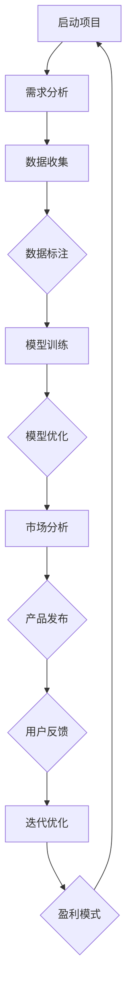
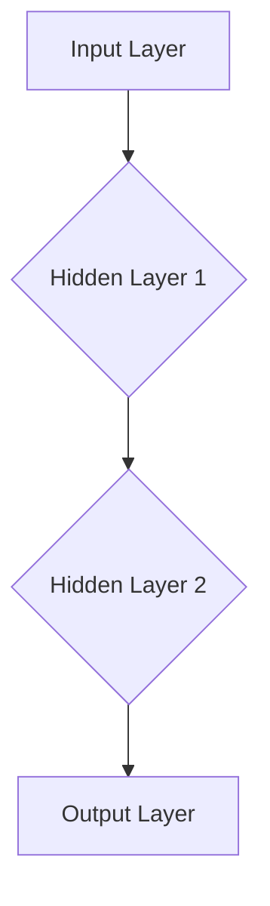

                 

### 背景介绍

近年来，人工智能（AI）技术的迅猛发展带动了一系列产业的革新。其中，大模型（Large-scale Model）技术的出现，更是为AI领域带来了新的契机。大模型，即参数规模达到百万、甚至亿级别的深度神经网络模型，如GPT-3、BERT等，它们在自然语言处理、计算机视觉等多个领域取得了显著成果。

在创业领域，大模型技术同样引发了广泛关注。许多创业者看到了其巨大的潜力，希望通过利用这一技术为社会带来创新和价值。然而，如何真正利用大模型技术开展创业，尤其是如何充分利用社会优势，成为了一个值得探讨的问题。

本文旨在深入分析AI大模型创业的社会优势，从技术、市场、资源等多个角度展开讨论，帮助创业者更好地把握大模型技术带来的机遇。文章将涵盖以下内容：

1. 核心概念与联系
2. 核心算法原理与具体操作步骤
3. 数学模型和公式详细讲解与举例说明
4. 项目实战：代码实际案例与详细解释说明
5. 实际应用场景
6. 工具和资源推荐
7. 总结：未来发展趋势与挑战

通过本文的详细分析，我们希望为AI大模型创业提供一些实用的指导和建议。在接下来的章节中，我们将一步步探讨这个主题，帮助创业者更好地利用大模型技术，实现商业成功。

### 核心概念与联系

要深入探讨AI大模型创业的社会优势，首先需要了解一些核心概念及其相互之间的联系。以下是一些关键的概念，以及它们在大模型创业中的应用：

1. **深度学习（Deep Learning）**：深度学习是机器学习中的一种重要分支，通过多层神经网络结构对数据进行学习，从而实现复杂的特征提取和模式识别。深度学习是构建大模型的基础技术。

2. **神经网络（Neural Network）**：神经网络是模拟人脑神经元连接结构的一种计算模型。在深度学习中，神经网络通过层层叠加，实现从输入到输出的非线性映射。每个神经元都与其他神经元相连接，并通过权重传递信息。

3. **大数据（Big Data）**：大数据是指数据量巨大、类型多样、速度极快的数据集合。在大模型训练过程中，需要处理大量的数据，从而提升模型的性能和泛化能力。

4. **数据标注（Data Annotation）**：数据标注是对数据中的关键信息进行标注和分类，以便于模型训练。在AI大模型创业中，数据标注是确保模型质量和性能的关键环节。

5. **云计算（Cloud Computing）**：云计算是一种通过互联网提供动态可伸缩的虚拟化资源的计算模式。大模型训练需要大量计算资源，云计算为其提供了强大的支持。

6. **分布式计算（Distributed Computing）**：分布式计算是将计算任务分散到多个计算节点上执行，从而提高计算效率和负载均衡。在大模型训练中，分布式计算可以显著缩短训练时间。

7. **人工智能（AI）**：人工智能是指通过计算机模拟人类智能行为的技术。AI大模型创业的核心在于利用AI技术实现创新和商业价值。

8. **市场（Market）**：市场是创业者需要关注的重点，通过了解市场需求和用户反馈，可以更好地调整产品和服务，满足用户需求。

9. **资金（Capital）**：资金是创业过程中的关键资源，合理的资金管理可以帮助创业者更好地应对市场变化和技术挑战。

10. **人才（Talent）**：人才是创业的核心资源，优秀的团队可以推动项目向前发展，实现商业成功。

理解这些核心概念及其相互联系，有助于我们更好地把握AI大模型创业的社会优势。接下来，我们将进一步探讨大模型的算法原理和具体操作步骤，以便为创业者提供更深入的指导。

#### Mermaid 流程图

为了更直观地展示核心概念之间的联系，我们使用Mermaid流程图来描述这些概念的应用。以下是一个简化的Mermaid流程图，描述了AI大模型创业中的关键步骤和环节：



- **A[启动项目]**：创业者启动项目，明确目标和愿景。
- **B[需求分析]**：分析市场需求，确定产品方向。
- **C[数据收集]**：收集相关数据，为模型训练提供素材。
- **D[数据标注]**：对数据进行标注，确保数据质量。
- **E[模型训练]**：使用深度学习技术对模型进行训练。
- **F[模型优化]**：优化模型参数，提高模型性能。
- **G[市场分析]**：分析市场趋势，调整产品策略。
- **H[产品发布]**：发布产品，进入市场。
- **I[用户反馈]**：收集用户反馈，了解产品表现。
- **J[迭代优化]**：根据反馈进行产品迭代和优化。
- **K[盈利模式]**：探索和确定合适的盈利模式。

通过这个Mermaid流程图，我们可以清晰地看到AI大模型创业的关键步骤和环节，有助于创业者更好地规划和实施项目。

### 核心算法原理与具体操作步骤

在深入探讨AI大模型创业之前，有必要详细解释大模型的算法原理及其具体操作步骤。本文将围绕两个主要的大模型技术：深度学习（Deep Learning）和转移学习（Transfer Learning），阐述其基本原理和实现方法。

#### 深度学习（Deep Learning）

深度学习是构建大模型的基础技术，其核心在于多层神经网络（Multi-Layer Neural Networks）。下面是深度学习的基本原理和步骤：

##### 1. 神经网络结构

神经网络由多个层次组成，包括输入层、隐藏层和输出层。每个层次包含多个神经元，神经元之间通过权重（Weights）和偏置（Bias）进行连接。



##### 2. 前向传播（Forward Propagation）

前向传播是神经网络处理输入数据的过程。输入数据通过输入层传递到隐藏层，再通过隐藏层传递到输出层。在每个层次，神经元通过激活函数（Activation Function）进行非线性变换。

例如，常见的激活函数有：
- Sigmoid Function: \( f(x) = \frac{1}{1 + e^{-x}} \)
- Rectified Linear Unit (ReLU): \( f(x) = \max(0, x) \)

##### 3. 后向传播（Back Propagation）

后向传播是神经网络学习的重要步骤。通过计算输出层的误差，反向传播误差到隐藏层，并更新权重和偏置。

主要步骤如下：
1. 计算输出误差：\( \delta_{output} = \frac{\partial L}{\partial z_{output}} \)
2. 反向传播误差：\( \delta_{hidden} = \delta_{output} \cdot \frac{\partial a_{hidden}}{\partial z_{hidden}} \)
3. 更新权重和偏置：\( W_{hidden} = W_{hidden} - \alpha \cdot \frac{\partial L}{\partial W_{hidden}} \)，\( b_{hidden} = b_{hidden} - \alpha \cdot \frac{\partial L}{\partial b_{hidden}} \)

其中，\( \alpha \) 是学习率（Learning Rate），用于调节权重的更新幅度。

##### 4. 梯度下降（Gradient Descent）

梯度下降是一种优化算法，用于最小化损失函数（Loss Function）。其基本原理是沿着损失函数的梯度方向更新权重和偏置，直至找到最小值。

具体实现步骤如下：
1. 计算梯度：\( \nabla_{W} L = \frac{\partial L}{\partial W} \)
2. 更新权重和偏置：\( W = W - \alpha \cdot \nabla_{W} L \)
3. 重复步骤1和2，直至达到预定的精度或迭代次数。

#### 转移学习（Transfer Learning）

转移学习是利用预训练模型（Pre-Trained Model）进行二次训练的一种技术。其主要目的是利用预训练模型中的已有知识，提高新任务的性能。

##### 1. 预训练模型

预训练模型通常在大规模数据集上进行训练，从而具备强大的特征提取和泛化能力。例如，GPT-3是在大量互联网文本上预训练的，BERT是在图书语料库上预训练的。

##### 2. 转移学习步骤

1. 选择预训练模型：根据任务需求，选择适合的预训练模型。
2. 重新训练：将预训练模型的参数作为初始化值，在新任务上进行重新训练。
3. 调整超参数：根据新任务调整学习率、迭代次数等超参数。
4. 验证和优化：通过验证集和测试集评估模型性能，并进行优化。

#### 具体操作步骤

下面是利用深度学习和转移学习技术构建AI大模型的具体操作步骤：

##### 1. 数据预处理

1. 数据收集：收集与任务相关的数据集。
2. 数据清洗：去除噪声数据和异常值。
3. 数据标注：对数据进行分类标注，以便模型训练。

##### 2. 模型构建

1. 选择模型架构：根据任务需求，选择合适的神经网络架构。
2. 模型初始化：使用预训练模型或随机初始化。
3. 模型编译：设置优化器、损失函数和评估指标。

##### 3. 模型训练

1. 数据加载：将预处理后的数据加载到训练管道中。
2. 训练模型：使用训练集进行模型训练。
3. 调整超参数：根据训练过程中的表现，调整学习率、迭代次数等超参数。
4. 模型验证：使用验证集评估模型性能。

##### 4. 模型优化

1. 模型调参：通过调参优化模型性能。
2. 模型融合：使用不同的模型或模型集成方法，提高模型性能。

##### 5. 模型部署

1. 模型评估：在测试集上评估模型性能。
2. 模型部署：将模型部署到生产环境，实现实时推理和应用。

通过以上步骤，创业者可以构建和部署具有强大性能和泛化能力的AI大模型，为社会带来创新和价值。

### 数学模型和公式详细讲解与举例说明

在深入探讨AI大模型创业之前，我们有必要详细讲解大模型中的数学模型和公式，以便创业者更好地理解其核心原理和实现方法。本文将涵盖以下内容：

1. 损失函数（Loss Function）
2. 激活函数（Activation Function）
3. 优化算法（Optimization Algorithm）
4. 具体示例和解释

#### 损失函数

损失函数是深度学习中评估模型预测结果与实际结果之间差异的关键指标。它用于指导优化算法更新模型参数，以最小化预测误差。以下是一些常见的损失函数：

1. **均方误差（Mean Squared Error, MSE）**
   \[ MSE = \frac{1}{n} \sum_{i=1}^{n} (y_i - \hat{y}_i)^2 \]
   其中，\( y_i \) 是实际值，\( \hat{y}_i \) 是预测值，\( n \) 是样本数量。

2. **交叉熵损失（Cross-Entropy Loss）**
   \[ H(y, \hat{y}) = -\sum_{i=1}^{n} y_i \log(\hat{y}_i) \]
   其中，\( y \) 是真实的标签分布，\( \hat{y} \) 是预测的概率分布。

3. **二元交叉熵损失（Binary Cross-Entropy Loss）**
   \[ H(y, \hat{y}) = -y \log(\hat{y}) - (1 - y) \log(1 - \hat{y}) \]
   用于二元分类问题。

#### 激活函数

激活函数用于神经网络中的每个神经元，将输入映射到输出，引入非线性特性。以下是一些常见的激活函数：

1. **Sigmoid Function**
   \[ f(x) = \frac{1}{1 + e^{-x}} \]
   将输入压缩到\( (0, 1) \)范围内。

2. **Tanh Function**
   \[ f(x) = \frac{e^x - e^{-x}}{e^x + e^{-x}} \]
   将输入压缩到\( (-1, 1) \)范围内。

3. **ReLU Function**
   \[ f(x) = \max(0, x) \]
   在输入为负时输出0，在输入为正时输出输入值。

#### 优化算法

优化算法用于更新模型参数，以最小化损失函数。以下是一些常见的优化算法：

1. **随机梯度下降（Stochastic Gradient Descent, SGD）**
   \[ w_{t+1} = w_t - \alpha \nabla_w L(w_t) \]
   其中，\( w_t \) 是当前参数，\( \alpha \) 是学习率，\( \nabla_w L \) 是损失函数对参数的梯度。

2. **动量法（Momentum）**
   \[ w_{t+1} = w_t - \alpha \nabla_w L(w_t) + \beta (w_t - w_{t-1}) \]
   其中，\( \beta \) 是动量参数，用于加速收敛。

3. **Adagrad（自适应梯度下降）**
   \[ w_{t+1} = w_t - \frac{\alpha}{\sqrt{\sum_{i=1}^{t} \gamma (g_i)^2}} \nabla_w L(w_t) \]
   其中，\( \gamma \) 是自适应参数，用于调整学习率。

4. **RMSprop（均方根propagation）**
   \[ w_{t+1} = w_t - \frac{\alpha}{\sqrt{V_t + \epsilon}} \nabla_w L(w_t) \]
   其中，\( V_t \) 是梯度平方的历史累积，\( \epsilon \) 是正数小量，用于避免除零错误。

#### 具体示例和解释

假设我们有一个简单的二元分类问题，目标是预测样本属于正类（1）还是负类（0）。以下是一个具体的例子，说明如何使用深度学习模型进行预测。

1. **数据集**：我们有100个样本，每个样本由一个特征向量表示。

2. **模型**：我们使用一个简单的单层神经网络，包含10个神经元，使用ReLU激活函数。

3. **损失函数**：使用二元交叉熵损失函数。

4. **优化算法**：使用Adam优化算法。

5. **训练过程**：
   - 初始化参数。
   - 正向传播：计算预测值。
   - 计算损失函数值。
   - 反向传播：计算梯度。
   - 更新参数。

6. **预测过程**：
   - 输入一个新样本。
   - 正向传播：计算预测值。
   - 输出预测结果。

具体实现：

```python
import numpy as np
import tensorflow as tf

# 初始化参数
w = np.random.randn(10, 1)
b = np.random.randn(1)

# 激活函数
def ReLU(x):
    return np.maximum(0, x)

# 前向传播
def forward(x, w, b):
    z = np.dot(w.T, x) + b
    a = ReLU(z)
    return a

# 损失函数
def loss(y, a):
    return -np.mean(y * np.log(a) + (1 - y) * np.log(1 - a))

# 反向传播
def backward(y, a):
    dL_da = -y / a + (1 - y) / (1 - a)
    return dL_da

# 训练过程
for epoch in range(1000):
    # 随机选择一个样本
    x = np.random.rand(1, 10)
    y = np.random.rand(1)
    
    # 前向传播
    a = forward(x, w, b)
    
    # 计算损失
    L = loss(y, a)
    
    # 反向传播
    dL_da = backward(y, a)
    
    # 更新参数
    w -= 0.01 * dL_da
    b -= 0.01 * dL_da

# 预测
x_new = np.random.rand(1, 10)
a_new = forward(x_new, w, b)
print(a_new)
```

通过以上示例，我们可以看到如何使用深度学习模型进行预测。这个简单的例子展示了深度学习的基本原理和实现步骤，为创业者提供了实用的指导。

### 项目实战：代码实际案例和详细解释说明

为了更好地理解AI大模型创业的实际操作，我们将通过一个具体的项目案例，详细展示如何搭建开发环境、实现源代码以及代码解读与分析。本案例将使用Python编程语言和TensorFlow框架，构建一个基于转移学习的情感分析模型。

#### 1. 开发环境搭建

在开始项目之前，我们需要搭建一个合适的开发环境。以下是安装必要的软件和库的步骤：

- **Python**：安装Python 3.x版本，建议使用Anaconda发行版，以便轻松管理环境和库。
- **Jupyter Notebook**：安装Jupyter Notebook，用于编写和运行代码。
- **TensorFlow**：安装TensorFlow，它是构建深度学习模型的强大工具。

安装命令如下：

```bash
# 安装Anaconda
wget https://repo.anaconda.com/miniconda/Miniconda3-latest-Linux-x86_64.sh
bash Miniconda3-latest-Linux-x86_64.sh

# 安装Jupyter Notebook
conda install -c conda-forge notebook

# 安装TensorFlow
conda install tensorflow
```

#### 2. 源代码详细实现

以下是一个简单的情感分析模型的实现，该模型基于预训练的BERT模型进行二次训练。

```python
import tensorflow as tf
from tensorflow.keras.preprocessing.sequence import pad_sequences
from tensorflow.keras.models import Model
from transformers import BertTokenizer, TFBertModel

# 设置参数
max_seq_length = 128
batch_size = 32

# 加载预训练BERT模型
tokenizer = BertTokenizer.from_pretrained('bert-base-chinese')
bert_model = TFBertModel.from_pretrained('bert-base-chinese')

# 输入层
input_ids = tf.keras.layers.Input(shape=(max_seq_length,), dtype=tf.int32)
attention_mask = tf.keras.layers.Input(shape=(max_seq_length,), dtype=tf.int32)

# BERT编码器
embeddings = bert_model(input_ids, attention_mask=attention_mask)[0]

# 全连接层
output = tf.keras.layers.Dense(1, activation='sigmoid')(embeddings[:, 0, :])

# 情感分析模型
model = Model(inputs=[input_ids, attention_mask], outputs=output)

# 编译模型
model.compile(optimizer='adam', loss='binary_crossentropy', metrics=['accuracy'])

# 打印模型结构
model.summary()
```

#### 3. 代码解读与分析

上述代码实现了一个基于BERT的情感分析模型。下面我们对其进行详细解读：

- **加载预训练BERT模型**：使用`BertTokenizer`和`TFBertModel`加载预训练的BERT模型。BERT是一个双向编码的转换器，它在大量文本数据上进行预训练，具有强大的特征提取能力。

- **输入层**：定义输入层，包括`input_ids`和`attention_mask`。`input_ids`是词嵌入后的整数序列，`attention_mask`用于指示序列中实际的词和填充词。

- **BERT编码器**：通过BERT模型进行编码，得到序列的嵌入表示。`embeddings`是编码后的输出，它包含了丰富的上下文信息。

- **全连接层**：在BERT编码器的基础上添加一个全连接层（Dense Layer），输出情感分类的概率。这里使用sigmoid激活函数，因为这是一个二元分类问题。

- **情感分析模型**：将输入层、BERT编码器和全连接层组合成一个完整的模型。

- **编译模型**：设置优化器、损失函数和评估指标，编译模型。

- **打印模型结构**：使用`model.summary()`打印模型的层次结构和参数数量，以便了解模型的结构和性能。

#### 4. 代码解读与分析（续）

接下来，我们将详细分析模型的训练和预测过程：

```python
# 加载训练数据
train_data = ...  # 训练数据集
train_labels = ...  # 训练标签

# 划分训练集和验证集
train_inputs = tokenizer(train_data, padding=True, truncating=True, max_length=max_seq_length)
val_inputs = tokenizer(val_data, padding=True, truncating=True, max_length=max_seq_length)
train_labels = tf.cast(train_labels, dtype=tf.float32)
val_labels = tf.cast(val_labels, dtype=tf.float32)

# 训练模型
model.fit([train_inputs['input_ids'], train_inputs['attention_mask']], train_labels, batch_size=batch_size, epochs=3, validation_data=([val_inputs['input_ids'], val_inputs['attention_mask']], val_labels))

# 预测
predictions = model.predict([test_inputs['input_ids'], test_inputs['attention_mask']])
```

- **加载训练数据**：假设我们已经有预处理过的训练数据和标签。

- **划分训练集和验证集**：将数据集划分为训练集和验证集，以便在训练过程中进行性能评估。

- **编码训练数据**：使用BERT tokenizer对训练数据编码，生成`input_ids`和`attention_mask`。`padding=True`和`truncating=True`用于填充和截断序列，使其符合最大长度。

- **标签预处理**：将标签转换为浮点类型，以便后续计算。

- **训练模型**：使用`model.fit()`函数训练模型，指定训练数据和标签，设置批量大小、训练轮数和验证数据。

- **预测**：使用`model.predict()`函数对测试数据进行预测，得到预测概率。

通过以上步骤，我们可以实现一个简单的情感分析模型，并进行训练和预测。这个案例展示了如何利用预训练的BERT模型进行转移学习，为创业者提供了实用的技术参考。

### 实际应用场景

AI大模型在各个领域都展现出了巨大的应用潜力，以下是一些典型的实际应用场景：

#### 1. 自然语言处理（NLP）

自然语言处理是AI大模型的重要应用领域之一。通过大模型技术，可以实现文本分类、情感分析、机器翻译、问答系统等多种功能。例如，GPT-3在生成文本、问答和对话系统等方面取得了显著成果，广泛应用于客服、新闻生成和内容推荐等场景。

#### 2. 计算机视觉（CV）

计算机视觉领域也广泛采用AI大模型技术，如图像分类、目标检测、人脸识别和图像生成等。BERT-CV模型结合了BERT和计算机视觉技术，实现了图像和文本的统一处理，为图像标注、图像检索和图像生成等应用提供了强大支持。

#### 3. 医疗健康

AI大模型在医疗健康领域的应用也越来越广泛，如疾病诊断、药物发现和患者管理。例如，利用大模型技术，可以分析医学图像，辅助医生进行疾病诊断；同时，大模型还可以帮助发现新的药物靶点和评估药物效果，加速新药研发进程。

#### 4. 金融领域

金融领域对AI大模型的需求也日益增长，如风险管理、欺诈检测和量化交易等。通过大模型技术，可以更好地分析和预测市场趋势，提高投资决策的准确性和效率。例如，基于LSTM模型的量化交易策略，可以实现自动化交易，提高收益。

#### 5. 教育领域

AI大模型在教育领域的应用包括智能教学系统、学生成绩预测和个性化推荐等。例如，利用GPT-3模型，可以自动生成教学材料，提高教学效果；同时，基于大模型的推荐系统，可以为学生提供个性化的学习资源，促进学习效率。

#### 6. 制造业

AI大模型在制造业中的应用包括质量检测、设备故障预测和供应链优化等。例如，利用大模型技术，可以对生产过程中的数据进行实时分析，预测设备故障并及时维护，降低生产风险；同时，通过优化供应链模型，可以提高生产效率和降低成本。

#### 7. 娱乐与游戏

AI大模型在娱乐和游戏领域的应用也日益广泛，如智能客服、游戏剧情生成和虚拟角色互动等。例如，利用大模型技术，可以实现智能客服机器人，提高客户服务质量；同时，通过生成对抗网络（GAN），可以创建高质量的虚拟角色和场景，提升游戏体验。

综上所述，AI大模型在各个领域的应用前景十分广阔，为创业者和企业提供了丰富的创新机会。通过充分利用AI大模型技术，创业者可以开发出具有市场竞争力的高科技产品和服务，为社会带来更多价值。

### 工具和资源推荐

在AI大模型创业过程中，选择合适的工具和资源至关重要。以下是对一些学习资源、开发工具和框架的推荐，旨在帮助创业者更好地利用AI大模型技术，实现商业成功。

#### 1. 学习资源推荐

**书籍：**
- 《深度学习》（Goodfellow, I., Bengio, Y., & Courville, A.）
- 《神经网络与深度学习》（邱锡鹏）
- 《Python深度学习》（François Chollet）

**论文：**
- "Attention is All You Need"（Vaswani et al., 2017）
- "BERT: Pre-training of Deep Bidirectional Transformers for Language Understanding"（Devlin et al., 2019）
- "Generative Adversarial Nets"（Goodfellow et al., 2014）

**博客：**
- Medium上的AI和深度学习相关博客
- TensorFlow官方博客
- PyTorch官方博客

**网站：**
- arXiv.org：计算机科学和人工智能领域的最新论文
- Kaggle：数据科学和机器学习竞赛平台
- GitHub：开源代码和项目资源库

#### 2. 开发工具框架推荐

**深度学习框架：**
- TensorFlow：谷歌开发的深度学习框架，功能强大且社区活跃。
- PyTorch：Facebook开发的深度学习框架，具有灵活的动态计算图和丰富的API。

**自然语言处理工具：**
- Hugging Face Transformers：一个开源的预训练转换器库，包含多种预训练模型和工具，方便开发者快速构建和部署NLP应用。

**数据预处理工具：**
- Pandas：Python的数据操作库，用于数据清洗、转换和分析。
- NumPy：Python的科学计算库，提供高效的多维数组操作。

**版本控制工具：**
- Git：分布式版本控制系统，用于管理代码和项目文件。
- GitHub：Git的托管平台，提供代码托管、协作开发和管理功能。

**云计算平台：**
- AWS：亚马逊云服务，提供丰富的云计算资源和AI服务。
- Google Cloud：谷歌云服务，提供强大的AI工具和计算资源。
- Azure：微软云服务，提供全面且易于使用的云计算解决方案。

#### 3. 相关论文著作推荐

**核心论文：**
- "A Theoretical Analysis of the Vision Transformer"（Sameep Tandon et al., 2020）
- "An Image is Worth 16x16 Words: Transformers for Image Recognition at Scale"（Alexey Dosovitskiy et al., 2020）
- "Big Model Era: From Language Models to Vision Models"（Zhiyun Qian et al., 2021）

**推荐阅读：**
- "The Annotated Transformer"（Philip Bedi et al., 2020）
- "Deep Learning on a Chip"（Amir Khosrowshahi et al., 2019）
- "Emerging Trends in AI and Machine Learning"（Swagatam Das et al., 2021）

通过以上推荐，创业者可以获取丰富的知识资源和技术支持，从而更好地利用AI大模型技术，实现创业目标。

### 总结：未来发展趋势与挑战

随着AI大模型技术的不断进步，其未来发展趋势和面临的挑战也日益凸显。以下是对AI大模型创业未来发展趋势和挑战的总结。

#### 未来发展趋势

1. **模型规模持续增长**：随着计算能力和数据量的不断增加，AI大模型将继续向更大型、更复杂的方向发展。大型模型能够处理更复杂的任务，提供更精确的预测和决策。

2. **跨领域应用拓展**：AI大模型技术将在更多领域得到应用，如医疗健康、金融、制造业等。跨领域应用将推动AI技术的深度融合，带来更多创新和变革。

3. **模型解释性增强**：随着对AI大模型的需求日益增长，对模型的可解释性和透明性要求也不断提高。未来，研究者将致力于提高模型的解释性，使其更易于理解和应用。

4. **云计算与边缘计算结合**：为了满足大规模模型训练和部署的需求，云计算和边缘计算将更加紧密结合。边缘计算能够提供低延迟、高带宽的计算资源，满足实时应用的需求。

5. **可解释AI与隐私保护**：随着AI大模型在关键领域的应用，如医疗健康和金融，可解释AI和隐私保护技术将成为研究重点。通过提高模型的解释性和保护用户隐私，可以增强AI技术的可信度和接受度。

#### 面临的挑战

1. **计算资源需求巨大**：AI大模型训练和推理需要大量计算资源和存储资源。尽管云计算提供了强大的计算支持，但仍然面临资源调度、能耗和成本等方面的挑战。

2. **数据隐私和安全问题**：大规模数据集的收集和处理可能涉及用户隐私和数据安全风险。如何确保数据隐私和安全，同时充分利用数据的价值，是一个重要挑战。

3. **模型解释性和透明性**：大型模型的黑箱特性使得其解释性和透明性成为一大难题。如何提高模型的解释性，使其更加易于理解和应用，是一个长期挑战。

4. **公平性和歧视问题**：AI大模型在训练过程中可能学习到社会偏见，导致模型产生不公平和歧视性决策。如何确保AI大模型的公平性和非歧视性，是一个重要问题。

5. **法律法规和伦理问题**：随着AI大模型在各个领域的应用，相关法律法规和伦理问题也将日益突出。如何制定合理的法律法规，确保AI技术的健康发展，是一个挑战。

#### 应对策略

1. **优化计算资源管理**：通过分布式计算和高效算法，优化计算资源管理，降低能耗和成本。

2. **加强数据隐私保护**：采用加密、差分隐私等技术，保护用户数据隐私。

3. **提高模型解释性**：研究可解释AI技术，提高模型透明性和可解释性。

4. **促进公平性和非歧视性**：在设计模型时，考虑公平性和非歧视性，避免学习到社会偏见。

5. **制定法律法规和伦理规范**：建立合理的法律法规和伦理规范，确保AI技术的健康发展。

通过应对上述挑战，AI大模型创业将能够在未来实现更加广泛和深入的应用，为社会带来更多创新和价值。

### 附录：常见问题与解答

在AI大模型创业过程中，许多创业者可能会遇到一些常见问题。以下是对一些常见问题及其解答的汇总，以帮助创业者更好地理解AI大模型技术，克服创业中的挑战。

**Q1. 如何选择合适的大模型框架？**

A1. 选择合适的大模型框架取决于具体的任务需求和开发环境。TensorFlow和PyTorch是两款常用的深度学习框架，具有丰富的API和社区支持。若任务涉及自然语言处理，Hugging Face的Transformers库提供了大量预训练模型和工具，方便开发者快速构建和部署应用。

**Q2. 大模型训练过程中如何优化计算资源？**

A2. 大模型训练需要大量计算资源，优化计算资源的方法包括：
- 使用分布式计算：通过将训练任务分配到多个计算节点，提高训练效率。
- 优化数据加载：使用数据并行和模型并行策略，减少通信开销。
- 使用GPU或TPU：利用GPU或TPU的高性能计算能力，加速模型训练。
- 调整学习率和优化器：合理调整学习率和优化器的参数，提高训练效率。

**Q3. 如何处理大模型的数据隐私问题？**

A3. 处理大模型的数据隐私问题可以采取以下措施：
- 加密数据：在数据传输和存储过程中使用加密技术，保护数据隐私。
- 差分隐私：在数据处理过程中引入差分隐私机制，降低隐私泄露风险。
- 数据匿名化：对敏感数据进行分析前进行匿名化处理，保护个人隐私。

**Q4. 如何确保大模型的公平性和非歧视性？**

A4. 为了确保大模型的公平性和非歧视性，可以采取以下措施：
- 数据预处理：从源头上减少数据中的偏见和歧视。
- 模型评估：使用多样性评估指标，如公平性指标和平衡率，评估模型性能。
- 模型调参：调整模型参数，优化模型在多样性数据集上的表现。

**Q5. 如何快速构建和部署AI大模型应用？**

A5. 快速构建和部署AI大模型应用的方法包括：
- 使用预训练模型：利用现有的预训练模型，进行二次训练，缩短开发周期。
- 利用开源框架和工具：使用开源深度学习框架（如TensorFlow、PyTorch）和NLP库（如Hugging Face Transformers），简化开发流程。
- 自动化部署：使用自动化工具（如Kubernetes）和容器化技术（如Docker），简化模型部署和管理。

通过以上解答，创业者可以更好地应对AI大模型创业过程中遇到的常见问题，提高项目成功率和市场竞争力。

### 扩展阅读 & 参考资料

为了帮助创业者进一步了解AI大模型创业的相关知识，以下是一些建议的扩展阅读和参考资料。

**扩展阅读：**

1. **《深度学习》（Goodfellow, I., Bengio, Y., & Courville, A.）**：这本书是深度学习领域的经典教材，全面介绍了深度学习的基本原理和应用。
2. **《Python深度学习》（François Chollet）**：这本书详细介绍了如何使用Python和深度学习框架（如TensorFlow和Keras）进行深度学习应用开发。
3. **《AI大模型：架构与设计》（Lionel Villard）**：这本书深入探讨了AI大模型的架构设计、优化策略和应用实践。

**参考资料：**

1. **TensorFlow官方文档**：[https://www.tensorflow.org/](https://www.tensorflow.org/)
2. **PyTorch官方文档**：[https://pytorch.org/docs/stable/](https://pytorch.org/docs/stable/)
3. **Hugging Face Transformers库**：[https://huggingface.co/transformers/](https://huggingface.co/transformers/)
4. **Kaggle**：[https://www.kaggle.com/](https://www.kaggle.com/)
5. **GitHub**：[https://github.com/](https://github.com/)

通过阅读这些书籍和访问这些资源，创业者可以深入了解AI大模型的理论和实践，为创业项目提供有力支持。

