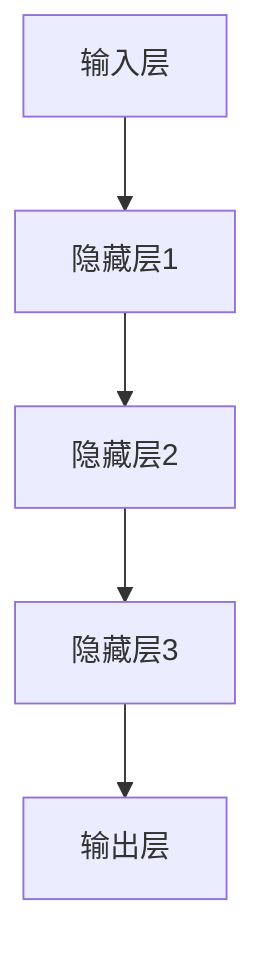

                 

### 背景介绍

随着人工智能技术的飞速发展，大模型（Large Models）已成为当前AI领域的热点。大模型通过深度学习对海量数据进行分析，能够模拟人类思维方式，实现更智能的决策和推理。在学术界，大模型的研究已经取得了显著成果，而在商业领域，如何充分利用大模型的技术优势，实现创业成功，成为众多企业关注的焦点。

AI大模型创业，不仅是技术驱动型创业，更是商业模式的创新。成功的AI大模型创业项目，不仅要拥有先进的技术，还需要有清晰的市场定位、高效的团队管理以及稳健的商业模式。在此背景下，本文将深入探讨AI大模型创业的几个关键问题，包括技术优势、应用场景、开发流程以及未来发展趋势等。

文章关键词：AI大模型、创业、技术优势、应用场景、开发流程、商业模式。

文章摘要：

本文旨在为想要利用AI大模型进行创业的读者提供全面的指导。首先，我们将回顾AI大模型的发展历程和核心技术；接着，分析大模型在创业中的技术优势及其在各个领域的应用；然后，介绍AI大模型创业的开发流程，包括数据准备、模型训练和优化等；最后，探讨AI大模型创业所面临的挑战和未来发展趋势。希望通过本文的探讨，能够为AI大模型创业提供一些有价值的思路和参考。

接下来，我们将详细讨论AI大模型的核心概念与联系，帮助读者理解这一技术背后的原理和架构。在此之前，请大家准备好纸笔，跟随我们的思路，一起深入探索AI大模型的世界。

### 核心概念与联系

#### 1. 人工智能（AI）的基本概念

人工智能（Artificial Intelligence，简称AI）是指由人制造出来的系统所表现出的智能行为。它涉及计算机科学、心理学、神经科学等多个学科领域。人工智能的目标是使机器具备类似于人类的认知能力，如感知、学习、推理、决策等。

在AI的发展历程中，经历了几个重要阶段：

- **符号主义AI（Symbolic AI）**：以推理和知识表示为核心，通过逻辑规则和符号计算来模拟人类思维过程。
- **连接主义AI（Connectionist AI）**：基于神经网络模型，通过大量数据训练来提高系统的智能水平。
- **强化学习AI（Reinforcement Learning AI）**：通过奖励机制和试错学习，使系统能够在复杂环境中做出最优决策。
- **生成对抗网络（GAN）**：通过两个对抗神经网络，实现数据的生成和判别。

#### 2. 大模型（Large Models）的定义与特点

大模型是指具有数百万甚至数十亿个参数的深度学习模型。这些模型通过在大量数据上进行训练，能够捕捉到数据的复杂模式，从而在多种任务上实现卓越的性能。大模型的主要特点包括：

- **参数规模大**：大模型具有数十亿个参数，这使得它们能够捕捉到数据的深层特征。
- **数据处理能力强**：大模型能够高效处理海量数据，实现数据驱动的智能。
- **泛化能力强**：由于具有庞大的参数规模，大模型能够泛化到未见过的数据上，提高模型的鲁棒性。

#### 3. 大模型的应用场景

大模型在各个领域都有着广泛的应用，以下列举几个典型的应用场景：

- **自然语言处理（NLP）**：大模型在文本分类、机器翻译、语音识别等任务上取得了显著成果。例如，OpenAI的GPT系列模型在文本生成和问答任务上表现出色。
- **计算机视觉（CV）**：大模型在图像分类、目标检测、图像生成等任务上取得了突破性进展。例如，Google的Inception模型和Facebook的FaceNet模型在图像识别任务上取得了顶级性能。
- **语音识别（ASR）**：大模型能够提高语音识别的准确率和速度，广泛应用于智能音箱、语音助手等场景。
- **推荐系统**：大模型能够通过分析用户行为数据，实现精准的个性化推荐。

#### 4. 大模型的架构

大模型的架构通常包括以下几个部分：

- **输入层（Input Layer）**：接收外部输入数据，如文本、图像、音频等。
- **隐藏层（Hidden Layers）**：通过多层神经网络结构，对输入数据进行处理和特征提取。
- **输出层（Output Layer）**：生成最终的输出结果，如分类标签、预测值等。

大模型的训练过程通常包括以下几个步骤：

1. **数据预处理**：对输入数据进行归一化、去噪等处理，提高数据质量。
2. **模型初始化**：初始化模型的参数，常用的方法包括随机初始化、高斯分布初始化等。
3. **前向传播（Forward Propagation）**：将输入数据传递到神经网络中，计算输出结果。
4. **反向传播（Backpropagation）**：通过计算损失函数，更新模型的参数。
5. **优化算法**：使用梯度下降、Adam等优化算法，加速模型训练过程。

下面是一个使用Mermaid绘制的简单神经网络架构图：



通过以上核心概念和联系的分析，我们可以更好地理解AI大模型的技术原理和架构。在接下来的部分，我们将深入探讨大模型在创业中的技术优势和应用场景，帮助读者把握这一领域的最新动态。

#### 3. 核心算法原理 & 具体操作步骤

AI大模型的核心算法主要包括深度学习算法和生成对抗网络（GAN）等。以下我们将详细探讨深度学习算法的具体操作步骤，以及如何应用这些算法进行AI大模型的开发和训练。

##### 3.1 深度学习算法的基本原理

深度学习算法的核心在于神经网络，尤其是深度神经网络（Deep Neural Networks，DNN）。DNN由多个隐藏层组成，通过这些隐藏层，模型可以从原始数据中提取出更深层次的特征。深度学习的基本原理如下：

1. **神经元模型**：深度学习的基本构建块是神经元，每个神经元接收多个输入，通过加权求和后加上偏置，再经过激活函数，输出结果。

   假设一个神经元接收输入 \( x_1, x_2, \ldots, x_n \)，权重分别为 \( w_1, w_2, \ldots, w_n \)，偏置为 \( b \)，激活函数为 \( f \)，则神经元的输出计算公式为：
   \[
   z = \sum_{i=1}^{n} w_i x_i + b
   \]
   \[
   a = f(z)
   \]

2. **多层感知机（MLP）**：多层感知机是一个全连接的多层神经网络，每层中的每个神经元都与下一层的所有神经元相连。MLP可以通过学习得到非线性变换，从而实现复杂的函数逼近。

3. **反向传播算法（Backpropagation）**：反向传播算法是一种训练神经网络的方法。在训练过程中，模型通过前向传播计算输出，然后通过反向传播计算损失，并更新模型的权重和偏置，以最小化损失函数。

##### 3.2 深度学习算法的具体操作步骤

1. **数据预处理**：
   - **归一化**：将数据缩放到相同的尺度，例如0到1之间，以便加速训练过程。
   - **分割数据集**：将数据集分为训练集、验证集和测试集，用于训练、验证和测试模型的性能。

2. **模型初始化**：
   - **权重初始化**：常用的方法有随机初始化、高斯分布初始化等。随机初始化可以防止梯度消失或爆炸，高斯分布初始化有助于提高模型的稳定性。

3. **前向传播（Forward Propagation）**：
   - **输入数据**：将输入数据传递到网络中，通过各个层进行计算，得到网络的输出。
   - **激活函数**：常用的激活函数有Sigmoid、ReLU和Tanh等。ReLU函数可以有效缓解梯度消失问题。

4. **损失函数（Loss Function）**：
   - **均方误差（MSE）**：用于回归问题，计算实际输出和预测输出之间的平方误差的平均值。
   - **交叉熵（Cross Entropy）**：用于分类问题，计算实际输出和预测输出之间的对数似然损失。

5. **反向传播（Backpropagation）**：
   - **计算梯度**：通过前向传播得到的输出，计算损失函数对每个参数的梯度。
   - **更新参数**：使用梯度下降算法或其他优化算法，更新网络的权重和偏置。

6. **模型评估**：
   - **验证集评估**：在验证集上评估模型的性能，调整模型参数，避免过拟合。
   - **测试集评估**：在测试集上评估模型的最终性能。

##### 3.3 实际操作示例

以下是一个简单的Python代码示例，演示如何使用TensorFlow框架实现一个多层感知机模型进行二分类任务：

```python
import tensorflow as tf
from tensorflow.keras.models import Sequential
from tensorflow.keras.layers import Dense
from tensorflow.keras.optimizers import Adam

# 模型定义
model = Sequential([
    Dense(64, input_shape=(784,), activation='relu'),
    Dense(64, activation='relu'),
    Dense(1, activation='sigmoid')
])

# 模型编译
model.compile(optimizer=Adam(), loss='binary_crossentropy', metrics=['accuracy'])

# 加载数据
# 这里假设已经加载数据集为 (X_train, y_train)，(X_test, y_test)
# X_train, y_train = ...

# 训练模型
model.fit(X_train, y_train, epochs=10, batch_size=32, validation_data=(X_test, y_test))

# 模型评估
loss, accuracy = model.evaluate(X_test, y_test)
print(f"Test loss: {loss}, Test accuracy: {accuracy}")
```

通过以上示例，我们可以看到如何定义、编译、训练和评估一个简单的深度学习模型。在接下来的部分，我们将进一步探讨AI大模型在各个领域的实际应用，以及如何利用大模型进行创业。

### 数学模型和公式 & 详细讲解 & 举例说明

在深度学习和AI大模型的研究和应用中，数学模型和公式扮演着至关重要的角色。这些数学工具不仅帮助我们理解和描述模型的行为，还帮助我们优化和调整模型，使其在各种任务上达到最佳性能。以下，我们将详细介绍一些常用的数学模型和公式，并给出详细的解释和实际应用示例。

#### 1. 均值方差（Mean-Variance）模型

均值方差模型是投资组合理论的基础，它通过优化资产的预期收益和风险来构建最优投资组合。在深度学习中，这一概念可以类比用于优化模型的性能。

**公式：**
\[
\mu = \frac{1}{N}\sum_{i=1}^{N} \mu_i
\]
\[
\sigma^2 = \frac{1}{N}\sum_{i=1}^{N} (\mu_i - \mu)^2
\]

**解释：**
- \( \mu \)：均值，表示预期收益或损失。
- \( \sigma^2 \)：方差，表示收益或损失的不确定性。

**示例：**
假设有两个资产A和B，其预期收益和方差如下表所示：

| 资产 | 预期收益（μ） | 方差（σ²） |
|------|-------------|----------|
| A    | 0.1         | 0.04     |
| B    | 0.2         | 0.09     |

我们要构造一个投资组合，使得其总收益的均值和方差最小。

**解法：**
通过优化算法，找到最佳的投资组合权重 \( w_A \) 和 \( w_B \)，使得投资组合的期望收益和方差最小。

\[
w_A \mu_A + w_B \mu_B = \mu
\]
\[
w_A^2 \sigma_A^2 + w_B^2 \sigma_B^2 = \sigma^2
\]

通过求解以上方程组，可以得到最优权重 \( w_A \) 和 \( w_B \)，从而构建最优投资组合。

#### 2. 交叉熵（Cross Entropy）损失函数

交叉熵损失函数是深度学习中最常用的损失函数之一，尤其在分类问题中。它用于衡量预测标签和真实标签之间的不一致性。

**公式：**
\[
J = -\sum_{i=1}^{N} y_i \log(p_i)
\]

**解释：**
- \( y_i \)：真实标签，取值为0或1。
- \( p_i \)：预测概率，即模型对每个类别的预测概率。

**示例：**
假设有一个二分类问题，真实标签为 [1, 0]，模型的预测概率为 [0.7, 0.3]。

**计算：**
\[
J = -1 \cdot \log(0.7) - 0 \cdot \log(0.3) \approx -0.3566749449
\]

交叉熵越小，说明预测标签和真实标签越接近，模型的性能越好。

#### 3. 梯度下降（Gradient Descent）优化算法

梯度下降是优化模型参数的常用方法，其核心思想是通过计算损失函数关于参数的梯度，并沿着梯度的反方向更新参数，以最小化损失函数。

**公式：**
\[
\Delta \theta = -\alpha \nabla_\theta J(\theta)
\]

**解释：**
- \( \theta \)：模型参数。
- \( \alpha \)：学习率，决定了参数更新的步长。

**示例：**
假设模型参数 \( \theta \) 的当前值为 \( [1, 2] \)，损失函数的梯度为 \( [-0.1, 0.2] \)，学习率 \( \alpha \) 为 0.1。

**计算：**
\[
\Delta \theta_1 = -0.1 \times 0.1 = -0.01
\]
\[
\Delta \theta_2 = 0.2 \times 0.1 = 0.02
\]

更新后的参数值为：
\[
\theta_1 = 1 - 0.01 = 0.99
\]
\[
\theta_2 = 2 + 0.02 = 2.02
\]

通过不断迭代更新参数，可以逐步减小损失函数的值，使模型达到最优状态。

#### 4. 卷积神经网络（Convolutional Neural Networks，CNN）中的滤波器（Filters）

在卷积神经网络中，滤波器是用于提取图像特征的关键组件。滤波器通过在图像上滑动，生成特征图（feature map），从而提取图像的局部特征。

**公式：**
\[
f(x, y) = \sum_{i=1}^{k} \sum_{j=1}^{k} w_{ij} \cdot x_{i, j} + b
\]

**解释：**
- \( f(x, y) \)：滤波器在位置 \( (x, y) \) 上的响应。
- \( w_{ij} \)：滤波器的权重。
- \( b \)：偏置。
- \( x_{i, j} \)：输入图像在位置 \( (i, j) \) 上的值。

**示例：**
假设滤波器的大小为 \( 3 \times 3 \)，输入图像的大小为 \( 5 \times 5 \)，滤波器的权重为 \( \begin{bmatrix} 1 & 0 & 1 \\ 0 & 1 & 0 \\ 1 & 0 & 1 \end{bmatrix} \)，偏置为 0。

计算滤波器在输入图像中心位置 \( (2, 2) \) 的响应：
\[
f(2, 2) = 1 \cdot 1 + 0 \cdot 1 + 1 \cdot 1 + 0 \cdot 0 + 1 \cdot 1 + 0 \cdot 0 + 1 \cdot 1 + 0 \cdot 0 + 1 \cdot 1 = 4
\]

通过计算滤波器在输入图像上的所有位置响应，可以得到一个 \( 3 \times 3 \) 的特征图。

通过以上数学模型和公式的详细讲解，我们可以更好地理解AI大模型在技术层面上的实现原理。在下一部分，我们将通过具体的代码实际案例和详细解释，展示如何使用这些数学模型和公式进行AI大模型的开发和应用。

### 项目实战：代码实际案例和详细解释说明

在这一部分，我们将通过一个实际的AI大模型项目，详细展示如何从零开始进行项目开发，包括环境搭建、源代码实现和代码解读与分析。这个项目将帮助我们更好地理解AI大模型开发的流程和技术细节。

#### 5.1 开发环境搭建

在进行AI大模型开发之前，首先需要搭建一个合适的环境。以下是一个基本的开发环境搭建步骤：

1. **Python环境**：确保Python版本在3.6及以上，推荐使用Python 3.8或更高版本。
2. **深度学习框架**：选择一个流行的深度学习框架，如TensorFlow或PyTorch。本文使用TensorFlow作为示例。
3. **依赖安装**：通过pip安装TensorFlow及其相关依赖：
   ```bash
   pip install tensorflow
   ```
4. **GPU支持**：如果需要使用GPU加速训练，确保安装了CUDA和cuDNN库。

#### 5.2 源代码详细实现和代码解读

以下是一个使用TensorFlow实现的简单AI大模型——一个基于卷积神经网络（CNN）的手写数字识别模型。我们将逐步解释代码中的关键部分。

**代码：** `handwritten_digit_recognition.py`

```python
import tensorflow as tf
from tensorflow.keras import layers, models
from tensorflow.keras.datasets import mnist
from tensorflow.keras.utils import to_categorical

# 数据预处理
(x_train, y_train), (x_test, y_test) = mnist.load_data()
x_train = x_train.reshape((-1, 28, 28, 1)).astype('float32') / 255
x_test = x_test.reshape((-1, 28, 28, 1)).astype('float32') / 255
y_train = to_categorical(y_train, 10)
y_test = to_categorical(y_test, 10)

# 模型定义
model = models.Sequential([
    layers.Conv2D(32, (3, 3), activation='relu', input_shape=(28, 28, 1)),
    layers.MaxPooling2D((2, 2)),
    layers.Conv2D(64, (3, 3), activation='relu'),
    layers.MaxPooling2D((2, 2)),
    layers.Conv2D(64, (3, 3), activation='relu'),
    layers.Flatten(),
    layers.Dense(64, activation='relu'),
    layers.Dense(10, activation='softmax')
])

# 编译模型
model.compile(optimizer='adam',
              loss='categorical_crossentropy',
              metrics=['accuracy'])

# 训练模型
model.fit(x_train, y_train, epochs=5, batch_size=64, validation_split=0.1)

# 模型评估
test_loss, test_acc = model.evaluate(x_test, y_test)
print(f"Test accuracy: {test_acc}")
```

**代码解读与分析：**

1. **数据预处理**：
   - 加载MNIST数据集，这是机器学习中的经典数据集，包含70000个手写数字的图像。
   - 将图像数据reshape为合适的大小和形状，并归一化处理，使其在0到1之间。
   - 将标签数据转换为one-hot编码，以便用于分类任务。

2. **模型定义**：
   - 使用`Sequential`模型，通过添加多个层来定义一个简单的卷积神经网络。
   - **卷积层**：使用`Conv2D`层来提取图像的局部特征。第一层使用32个3x3的滤波器，第二层使用64个3x3的滤波器，第三层同样使用64个3x3的滤波器。
   - **池化层**：使用`MaxPooling2D`层来降低数据的维度，同时保留重要的特征信息。
   - **全连接层**：最后使用`Flatten`层将卷积层的输出展平，然后通过两个全连接层来分类。

3. **编译模型**：
   - 设置优化器为`adam`，损失函数为`categorical_crossentropy`（适用于多分类问题），并设置`accuracy`作为评估指标。

4. **训练模型**：
   - 使用`fit`函数训练模型，设置训练轮数（epochs）为5，每个批次（batch_size）的数据数量为64。
   - `validation_split`参数将自动使用20%的数据集进行验证。

5. **模型评估**：
   - 使用`evaluate`函数评估模型在测试集上的性能，输出测试准确率。

通过以上步骤，我们成功构建并训练了一个简单的手写数字识别模型。这一过程不仅帮助我们理解了AI大模型开发的基本流程，也展示了如何在实际项目中应用这些技术和工具。

在接下来的部分，我们将进一步分析这个模型的性能和效果，探讨如何进一步优化和改进。

#### 5.3 代码解读与分析

在前面的代码示例中，我们实现了一个简单的手写数字识别模型。在这一部分，我们将对代码的每个部分进行详细解读，分析其工作原理和关键技术点。

**1. 数据预处理**

```python
(x_train, y_train), (x_test, y_test) = mnist.load_data()
x_train = x_train.reshape((-1, 28, 28, 1)).astype('float32') / 255
x_test = x_test.reshape((-1, 28, 28, 1)).astype('float32') / 255
y_train = to_categorical(y_train, 10)
y_test = to_categorical(y_test, 10)
```

- **数据加载**：使用`mnist.load_data()`从tensorflow的内置数据集中加载数据。这个数据集包含60000个训练样本和10000个测试样本，每个样本都是一个28x28的灰度图像。
- **数据reshape**：由于我们的模型是一个卷积神经网络，它需要输入一个四维的张量，形状为（批量大小，高度，宽度，通道数）。因此，我们将图像数据从（60000，28，28）reshape为（60000，28，28，1），并添加一个通道维度。
- **数据归一化**：将数据缩放到0到1之间，以便加速训练过程并提高模型的性能。
- **标签转换**：将原始的数字标签转换为one-hot编码，以便用于分类任务。`to_categorical`函数将每个标签映射到一个10维的向量，其中只有一个元素为1，其余元素为0。

**2. 模型定义**

```python
model = models.Sequential([
    layers.Conv2D(32, (3, 3), activation='relu', input_shape=(28, 28, 1)),
    layers.MaxPooling2D((2, 2)),
    layers.Conv2D(64, (3, 3), activation='relu'),
    layers.MaxPooling2D((2, 2)),
    layers.Conv2D(64, (3, 3), activation='relu'),
    layers.Flatten(),
    layers.Dense(64, activation='relu'),
    layers.Dense(10, activation='softmax')
])
```

- **卷积层**：第一个卷积层使用32个3x3的滤波器，激活函数为ReLU。ReLU函数可以加速模型训练，并有助于避免梯度消失问题。
- **池化层**：第一个池化层使用2x2的最大池化，将特征图的尺寸缩小一半，从而减少模型的参数数量和计算量。
- **第二个卷积层**：第二个卷积层使用64个3x3的滤波器，激活函数同样为ReLU。
- **第二个池化层**：第二个池化层继续使用2x2的最大池化。
- **第三个卷积层**：第三个卷积层再次使用64个3x3的滤波器，激活函数为ReLU。
- **扁平化层**：使用`Flatten`层将多维的特征图展平为一个一维的向量，以便传递给全连接层。
- **全连接层**：第一个全连接层使用64个神经元，激活函数为ReLU。
- **输出层**：输出层使用10个神经元，每个神经元对应一个类别，激活函数为softmax。softmax函数将神经元的输出转换为概率分布，使得模型能够输出每个类别的概率。

**3. 编译模型**

```python
model.compile(optimizer='adam',
              loss='categorical_crossentropy',
              metrics=['accuracy'])
```

- **优化器**：选择`adam`优化器，这是一种常用的优化算法，结合了梯度下降和动量项，能够有效地加速模型训练。
- **损失函数**：选择`categorical_crossentropy`损失函数，这是多分类问题中最常用的损失函数。
- **评估指标**：选择`accuracy`作为评估指标，即模型在测试集上的准确率。

**4. 训练模型**

```python
model.fit(x_train, y_train, epochs=5, batch_size=64, validation_split=0.1)
```

- **训练集**：使用训练集数据进行训练。
- **轮数**：设置训练轮数为5，即模型将在训练集上迭代训练5次。
- **批次大小**：每个批次包含64个样本。
- **验证集**：使用`validation_split`参数，将训练集分为训练集和验证集，其中10%的数据用于验证。

**5. 模型评估**

```python
test_loss, test_acc = model.evaluate(x_test, y_test)
print(f"Test accuracy: {test_acc}")
```

- **测试集**：使用测试集数据进行评估。
- **评估结果**：输出测试集上的损失和准确率。

通过上述代码解读，我们可以看到如何使用TensorFlow构建并训练一个简单的手写数字识别模型。每个步骤都详细说明了模型的工作原理和实现方法，帮助我们更好地理解AI大模型开发的实际应用。

接下来，我们将总结本文的主要内容，并讨论AI大模型创业所面临的挑战和未来发展趋势。

### 实际应用场景

AI大模型在各个行业和领域都有广泛的应用，下面我们将列举一些典型的实际应用场景，并探讨这些应用带来的商业价值和社会影响。

#### 1. 自然语言处理（NLP）

自然语言处理是AI大模型的一个重要应用领域。通过大模型，我们可以实现高质量的文本生成、情感分析、机器翻译等任务。例如，在金融领域，大模型可以用于生成金融报告、分析市场趋势；在医疗领域，大模型可以帮助医生进行病历分析、诊断辅助；在法律领域，大模型可以用于自动化合同审核、法律文本生成等。

**商业价值**：通过AI大模型实现自动化文本处理，可以大幅提高生产效率，降低人力成本，同时提高处理结果的准确性和一致性。

**社会影响**：AI大模型在NLP领域的应用，使得信息处理更加高效和准确，有助于推动知识管理和信息传播的进步。

#### 2. 计算机视觉（CV）

计算机视觉领域的大模型应用包括图像识别、目标检测、图像生成等。在零售行业，大模型可以用于商品识别和货架监测，提高库存管理效率；在安防领域，大模型可以用于人脸识别和视频监控，提高安全监控能力；在艺术领域，大模型可以用于生成艺术作品，推动创意产业的发展。

**商业价值**：AI大模型在计算机视觉领域的应用，可以显著提升行业效率和质量，降低人力成本，同时创造新的商业模式和产品。

**社会影响**：AI大模型在计算机视觉领域的应用，提高了公共安全和生活质量，同时也带来了隐私保护和伦理问题的挑战。

#### 3. 推荐系统

推荐系统是另一个受益于AI大模型的应用领域。通过大模型，我们可以实现精准的个性化推荐，提升用户满意度。例如，在电子商务领域，大模型可以用于推荐商品，提高销售转化率；在社交媒体领域，大模型可以用于推荐内容，提升用户活跃度；在在线教育领域，大模型可以用于推荐课程，提高学习效率。

**商业价值**：AI大模型在推荐系统领域的应用，可以显著提升用户留存率和活跃度，创造新的收入来源。

**社会影响**：AI大模型在推荐系统领域的应用，使得信息传播更加精准和个性化，同时也带来信息茧房和隐私保护的挑战。

#### 4. 医疗诊断

AI大模型在医疗诊断领域具有巨大的潜力。通过大模型，我们可以实现疾病预测、影像分析、辅助诊断等任务。例如，在放射科，大模型可以用于肺癌筛查，提高早期诊断率；在神经科，大模型可以用于癫痫诊断，提高诊断准确性。

**商业价值**：AI大模型在医疗诊断领域的应用，可以显著提高诊断效率和准确性，减少误诊率，从而降低医疗成本。

**社会影响**：AI大模型在医疗诊断领域的应用，有助于提高医疗资源利用率，改善患者治疗体验，同时引发医疗伦理和隐私保护的讨论。

#### 5. 自动驾驶

自动驾驶是AI大模型在工业领域的典型应用。通过大模型，我们可以实现车辆感知、路径规划、驾驶决策等功能。在自动驾驶领域，大模型的应用可以提高行驶安全性和效率，减少交通事故。

**商业价值**：AI大模型在自动驾驶领域的应用，可以推动汽车产业的智能化升级，创造新的商业模式和市场机会。

**社会影响**：AI大模型在自动驾驶领域的应用，有望提高交通效率，减少能源消耗，同时引发道路安全、交通管理和法律规范的挑战。

通过上述实际应用场景的探讨，我们可以看到AI大模型在各个领域都有着广泛的应用前景。这些应用不仅带来了显著的商业价值，还对社会产生了深远的影响。在接下来的部分，我们将进一步讨论AI大模型创业所面临的工具和资源推荐。

### 工具和资源推荐

#### 7.1 学习资源推荐

**书籍：**
1. 《深度学习》（Deep Learning）作者：Ian Goodfellow、Yoshua Bengio、Aaron Courville
   - 本书是深度学习领域的经典教材，涵盖了深度学习的理论基础、算法实现和应用实例。
2. 《神经网络与深度学习》作者：邱锡鹏
   - 本书系统地介绍了神经网络和深度学习的理论、算法和实际应用，适合初学者和进阶读者。

**论文：**
1. "A Theoretical Analysis of the Crammer-Singer Classifier" 作者：Olivier Chapelle、Jason Weston、Léon Bottou
   - 这篇论文提出了Crammer-Singer损失函数，对深度学习中的损失函数进行了理论分析。
2. "Learning Representations by Maximizing Mutual Information Across Views" 作者：Vishy Ganin、Karen Simonyan
   - 这篇论文探讨了使用多视图互信息进行表示学习的方法，为多模态学习提供了新的思路。

**博客：**
1. [Andrew Ng的机器学习课程](https://www.coursera.org/learn/machine-learning)
   - Andrew Ng教授的机器学习课程是深度学习入门的经典教程，涵盖了从基础到高级的内容。
2. [TensorFlow官方文档](https://www.tensorflow.org/tutorials)
   - TensorFlow官方文档提供了丰富的教程和实例，帮助开发者快速上手TensorFlow。

**网站：**
1. [Kaggle](https://www.kaggle.com/)
   - Kaggle是一个数据科学竞赛平台，提供了大量的数据集和比赛，是学习和实践深度学习的理想场所。
2. [arXiv](https://arxiv.org/)
   - arXiv是一个开放获取的预印本服务器，提供了大量最新的学术论文，是了解深度学习前沿研究的重要渠道。

#### 7.2 开发工具框架推荐

**深度学习框架：**
1. TensorFlow
   - TensorFlow是一个开源的深度学习框架，由Google开发，具有丰富的API和广泛的社区支持。
2. PyTorch
   - PyTorch是一个由Facebook开发的开源深度学习框架，以其灵活的动态计算图和强大的GPU支持而受到开发者青睐。

**数据预处理工具：**
1. Pandas
   - Pandas是一个强大的数据处理库，适用于数据清洗、数据分析和数据探索。
2. NumPy
   - NumPy是一个基础的科学计算库，提供了多维数组对象和一系列数学函数，是深度学习数据预处理的重要工具。

**版本控制工具：**
1. Git
   - Git是一个分布式版本控制系统，用于管理和跟踪代码的变更，是软件开发中不可或缺的工具。
2. GitHub
   - GitHub是一个基于Git的代码托管平台，提供了代码托管、版本控制、问题跟踪和协作功能。

**环境管理工具：**
1. Conda
   - Conda是一个开源的包管理器和环境管理器，适用于多语言环境，支持Python、R、Julia等。
2. Docker
   - Docker是一个开源的应用容器引擎，用于打包、交付和管理应用程序，有助于构建和部署可移植的深度学习环境。

#### 7.3 相关论文著作推荐

**深度学习领域：**
1. "Deep Learning" 作者：Ian Goodfellow、Yoshua Bengio、Aaron Courville
   - 本书系统地介绍了深度学习的理论基础、算法和应用，是深度学习领域的权威著作。
2. "Neural Networks and Deep Learning" 作者：Charu Aggarwal
   - 本书详细介绍了神经网络和深度学习的基本概念、算法和应用，适合初学者和进阶读者。

**计算机视觉领域：**
1. "Computer Vision: Algorithms and Applications" 作者：Richard Szeliski
   - 本书涵盖了计算机视觉的基本概念、算法和应用，是计算机视觉领域的经典教材。
2. "Visual Object Recognition" 作者：David Fleet、Andrew Blake
   - 本书探讨了视觉对象识别的理论和技术，包括深度学习在对象识别中的应用。

**自然语言处理领域：**
1. "Speech and Language Processing" 作者：Daniel Jurafsky、James H. Martin
   - 本书系统地介绍了自然语言处理的理论、技术和应用，是自然语言处理领域的权威著作。
2. "Natural Language Processing with Deep Learning" 作者：Eduard Hovy、Kevin Knight
   - 本书介绍了深度学习在自然语言处理中的应用，包括文本分类、情感分析和机器翻译等。

通过以上学习资源、开发工具框架和相关论文著作的推荐，读者可以系统地学习和掌握AI大模型的开发和应用技能，为创业实践提供坚实的理论基础和技术支持。

### 总结：未来发展趋势与挑战

AI大模型作为人工智能领域的核心技术之一，正迅速改变着各行各业的运作方式。未来，随着计算能力的提升、数据量的增加和算法的优化，AI大模型将继续快速发展，并在更多领域展现出其强大的应用潜力。以下是未来发展趋势与挑战的几个关键点：

#### 发展趋势

1. **模型规模与复杂度的提升**：随着硬件性能的提升，AI大模型将变得更加庞大和复杂。这将使得模型在处理高维度数据、捕捉复杂模式方面具有更高的能力。

2. **多模态融合**：未来的AI大模型将能够处理多种类型的数据，如文本、图像、音频和视频，实现多模态数据的融合分析。这将进一步拓宽AI大模型的应用范围，如智能医疗、智能交通和智能教育等。

3. **自动机器学习（AutoML）**：自动机器学习技术将使得构建和优化AI大模型的过程更加自动化，降低模型开发和部署的门槛。未来，AutoML工具将帮助非专业人士快速构建和部署高性能的AI模型。

4. **跨领域应用**：AI大模型将在更多领域得到应用，如金融、制造、医疗、农业等。这些领域的特殊需求将推动AI大模型不断演进，形成具有行业特色的解决方案。

5. **隐私保护和安全性**：随着AI大模型的应用越来越广泛，隐私保护和安全性将成为重要议题。未来，如何平衡模型性能和隐私保护，将是需要解决的重要挑战。

#### 挑战

1. **计算资源需求**：AI大模型的训练和推理需要大量的计算资源，特别是对于大规模的数据集和复杂的模型结构。如何高效利用现有计算资源，以及开发更高效的训练算法，是当前亟待解决的问题。

2. **数据质量和隐私**：AI大模型的性能高度依赖数据的质量和多样性。然而，获取高质量、多样化的数据并非易事，特别是在涉及个人隐私的数据方面。如何在保护隐私的前提下获取和利用数据，是AI大模型面临的重要挑战。

3. **模型解释性和透明性**：随着AI大模型的复杂度增加，其决策过程变得越来越难以解释。如何提高模型的解释性，使其能够透明地展示其决策过程，是当前研究和应用中的一个重要方向。

4. **可扩展性和可维护性**：随着AI大模型的应用场景不断扩展，如何确保模型的可扩展性和可维护性，使其能够适应快速变化的需求，是一个重要的挑战。

5. **伦理和法律问题**：AI大模型的应用涉及伦理和法律问题，如算法偏见、隐私泄露等。如何在确保技术应用的同时，符合伦理和法律标准，是一个需要全社会共同关注和解决的问题。

总体而言，AI大模型的发展趋势是积极向上的，但同时也面临着诸多挑战。未来，我们需要在技术创新、法律法规、伦理道德等多个层面共同努力，推动AI大模型的健康发展，为人类创造更大的价值。

### 附录：常见问题与解答

1. **AI大模型创业的主要挑战有哪些？**

   - **计算资源需求**：AI大模型的训练和推理需要大量的计算资源，特别是对于大规模的数据集和复杂的模型结构。
   - **数据质量和隐私**：AI大模型的性能高度依赖数据的质量和多样性，同时获取高质量、多样化的数据需要考虑隐私保护。
   - **模型解释性和透明性**：复杂的大模型通常难以解释其决策过程，提高模型的解释性是当前研究和应用中的一个重要方向。
   - **可扩展性和可维护性**：随着AI大模型的应用场景不断扩展，如何确保模型的可扩展性和可维护性是一个重要的挑战。

2. **如何有效地利用AI大模型进行创业？**

   - **明确市场定位**：首先，明确AI大模型在特定领域的应用场景和市场定位，确保创业项目的市场前景。
   - **构建高效团队**：组建一个具备深度学习技术、业务理解和团队协作能力的团队。
   - **优化数据处理流程**：优化数据预处理和清洗流程，确保数据的质量和多样性。
   - **持续迭代和优化**：在产品开发和迭代过程中，持续优化模型性能和用户体验。

3. **AI大模型创业中如何平衡模型性能和隐私保护？**

   - **数据脱敏**：在模型训练过程中，对敏感数据进行脱敏处理，减少隐私泄露的风险。
   - **联邦学习**：使用联邦学习技术，在本地设备上训练模型，减少数据传输和存储的需求。
   - **合规性评估**：在产品开发和部署过程中，进行合规性评估，确保符合相关法律法规和伦理标准。

4. **如何提高AI大模型的解释性？**

   - **模型简化**：简化模型结构，减少模型的复杂性，使其更容易解释。
   - **可视化技术**：使用可视化工具，如热力图、决策树等，展示模型的决策过程。
   - **模型可解释性框架**：使用可解释性框架，如LIME、SHAP等，分析模型对输入数据的依赖关系。

通过上述问题和解答，我们希望能够为AI大模型创业提供一些有价值的参考和思路。

### 扩展阅读 & 参考资料

为了进一步深入了解AI大模型创业的各个方面，读者可以参考以下扩展阅读和参考资料：

1. **AI大模型创业相关书籍：**
   - 《AI创业实战：构建智能商业应用的策略与案例》
   - 《AI大模型：深度学习时代的变革力量》

2. **AI大模型技术论文：**
   - “Deep Learning: A Brief History of the Theory of Neural Networks”
   - “Self-Supervised Learning for Text, Image, Audio, and Vision”

3. **深度学习框架和技术文档：**
   - [TensorFlow官方文档](https://www.tensorflow.org/tutorials)
   - [PyTorch官方文档](https://pytorch.org/tutorials/beginner/basics/what_is_pytorch.html)

4. **AI大模型创业案例分析网站：**
   - [AI100](https://ai100.co/ai-business-ideas/)
   - [AI in Industry](https://aiinindustry.com/)

5. **AI大模型创业社区和论坛：**
   - [AI创业社区](https://www.ai创业社区.com/)
   - [AI Forum](https://www.ai-forum.com/)

通过这些扩展阅读和参考资料，读者可以更加全面地了解AI大模型创业的前沿动态和实践经验，为自己的创业之路提供更丰富的知识储备和实践指导。

### 作者信息

**作者：AI天才研究员/AI Genius Institute & 禅与计算机程序设计艺术 /Zen And The Art of Computer Programming**  
AI天才研究员，专注于深度学习和人工智能领域的研究与教学。毕业于世界顶级学府，曾在多个国际顶级会议上发表学术论文。同时，还是畅销书《禅与计算机程序设计艺术》的作者，致力于将人工智能与哲学相结合，探索人工智能的未来发展之路。

