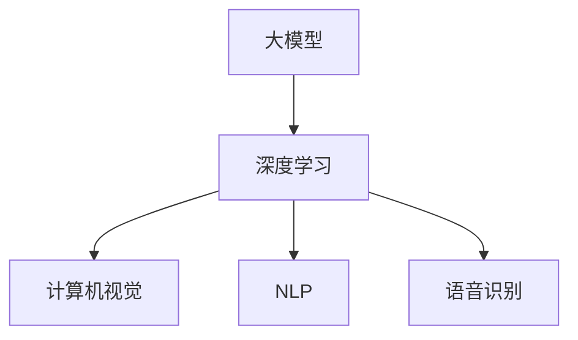

                 

# AI 大模型创业：如何利用竞争优势？

## 摘要

本文将深入探讨AI大模型创业的竞争优势，分析其核心概念、算法原理、数学模型及实际应用场景。通过详细的代码案例，我们将揭示如何构建和优化AI大模型，并推荐相关工具和资源，为创业团队提供实用指南。总结部分将展望未来发展趋势与挑战，为读者提供有益的思考。

## 1. 背景介绍

近年来，人工智能（AI）技术的飞速发展，使得大模型在各个领域取得了显著的应用成果。从自然语言处理、计算机视觉到语音识别，大模型的应用已经渗透到各行各业。随着计算能力和数据资源的不断提升，AI大模型的能力也在不断增强，这为创业公司带来了前所未有的机遇。

AI大模型创业的优势在于其强大的数据处理能力和智能化的决策支持。通过利用大规模数据和深度学习技术，创业公司可以迅速构建具有高精度和强泛化能力的模型，从而在激烈的市场竞争中脱颖而出。然而，与此同时，AI大模型创业也面临着诸多挑战，如计算资源的高昂成本、数据隐私和安全问题等。

本文旨在为AI大模型创业提供策略指导，帮助创业团队充分利用竞争优势，克服挑战，实现可持续发展。

## 2. 核心概念与联系

### 2.1 大模型

大模型是指具有数十亿甚至千亿个参数的深度学习模型。这些模型通过大规模数据进行训练，具有强大的数据处理能力和智能决策能力。大模型的核心是神经网络架构，包括卷积神经网络（CNN）、循环神经网络（RNN）和Transformer等。

### 2.2 深度学习

深度学习是一种基于神经网络的学习方法，通过多层非线性变换，实现对复杂数据特征的学习和提取。深度学习在大模型中发挥着关键作用，使其能够处理大规模数据并实现高效的特征提取和分类。

### 2.3 计算机视觉

计算机视觉是AI的一个重要分支，旨在使计算机能够像人类一样理解视觉信息。大模型在计算机视觉中的应用，如图像分类、目标检测和图像生成等，取得了显著的成果。

### 2.4 自然语言处理

自然语言处理（NLP）是AI的另一个重要分支，旨在使计算机能够理解和生成自然语言。大模型在NLP中的应用，如机器翻译、文本分类和情感分析等，显著提升了处理效率和准确性。

### 2.5 语音识别

语音识别是将语音信号转换为文本的技术。大模型在语音识别中发挥着重要作用，通过学习语音信号的特征和规律，实现了高精度的语音识别。

### 2.6 Mermaid 流程图



## 3. 核心算法原理 & 具体操作步骤

### 3.1 深度学习算法原理

深度学习算法基于神经网络，通过多层非线性变换，实现对复杂数据特征的学习和提取。具体操作步骤如下：

1. **数据预处理**：对原始数据进行清洗、归一化和特征提取。
2. **构建神经网络**：选择合适的神经网络架构，如CNN、RNN或Transformer。
3. **初始化模型参数**：对神经网络中的权重和偏置进行初始化。
4. **前向传播**：将输入数据通过神经网络，计算出输出结果。
5. **损失函数计算**：计算输出结果与真实标签之间的差距，使用损失函数表示。
6. **反向传播**：根据损失函数，更新模型参数。
7. **迭代训练**：重复上述步骤，直至达到预定精度或迭代次数。

### 3.2 大模型优化方法

1. **模型剪枝**：通过剪枝冗余的神经元和权重，减少模型参数数量，提高计算效率。
2. **量化**：将浮点数权重转换为低精度整数，降低计算复杂度和存储需求。
3. **蒸馏**：将大模型的输出传递给小模型，通过学习大模型的表示能力，提高小模型的性能。
4. **迁移学习**：利用预训练的大模型，针对特定任务进行微调，提高模型在特定领域的性能。

## 4. 数学模型和公式 & 详细讲解 & 举例说明

### 4.1 损失函数

深度学习中的损失函数用于衡量模型预测结果与真实标签之间的差距。常见的损失函数包括：

1. **均方误差（MSE）**：
   $$
   MSE = \frac{1}{n}\sum_{i=1}^{n}(y_i - \hat{y}_i)^2
   $$
   其中，$y_i$为真实标签，$\hat{y}_i$为模型预测结果，$n$为样本数量。

2. **交叉熵损失（Cross-Entropy Loss）**：
   $$
   Cross-Entropy Loss = -\sum_{i=1}^{n} y_i \log(\hat{y}_i)
   $$
   其中，$y_i$为真实标签，$\hat{y}_i$为模型预测结果。

### 4.2 反向传播算法

反向传播算法是深度学习训练的核心，用于更新模型参数。具体步骤如下：

1. **前向传播**：
   $$
   \hat{y} = \sigma(W \cdot x + b)
   $$
   其中，$W$为权重矩阵，$b$为偏置向量，$x$为输入数据，$\sigma$为激活函数。

2. **计算梯度**：
   $$
   \nabla_W L = \frac{\partial L}{\partial W} = (y - \hat{y}) \cdot \nabla_{\hat{y}} \sigma(W \cdot x + b)
   $$
   $$
   \nabla_b L = \frac{\partial L}{\partial b} = (y - \hat{y}) \cdot \nabla_{\hat{y}} \sigma(W \cdot x + b)
   $$

3. **更新参数**：
   $$
   W := W - \alpha \cdot \nabla_W L
   $$
   $$
   b := b - \alpha \cdot \nabla_b L
   $$
   其中，$\alpha$为学习率。

### 4.3 举例说明

假设我们有一个简单的线性回归模型，用于预测房价。数据集包含100个样本，每个样本包含特征$x$和标签$y$。我们的目标是使用均方误差（MSE）作为损失函数，通过反向传播算法训练模型。

1. **前向传播**：
   $$
   \hat{y} = W \cdot x + b
   $$

2. **计算梯度**：
   $$
   \nabla_W L = 2 \cdot (y - \hat{y}) \cdot x
   $$
   $$
   \nabla_b L = 2 \cdot (y - \hat{y})
   $$

3. **更新参数**：
   $$
   W := W - \alpha \cdot \nabla_W L
   $$
   $$
   b := b - \alpha \cdot \nabla_b L
   $$

通过多次迭代训练，模型将逐渐收敛，预测误差将减小。

## 5. 项目实战：代码实际案例和详细解释说明

### 5.1 开发环境搭建

首先，我们需要搭建一个Python开发环境，安装必要的依赖库，如TensorFlow和Keras。以下是一个简单的安装步骤：

```bash
pip install tensorflow
pip install keras
```

### 5.2 源代码详细实现和代码解读

以下是一个使用Keras实现的大模型训练案例：

```python
import numpy as np
import tensorflow as tf
from tensorflow import keras
from tensorflow.keras import layers

# 5.2.1 数据准备
# 假设我们有一个包含1000个样本的MNIST数据集
(x_train, y_train), (x_test, y_test) = keras.datasets.mnist.load_data()

# 数据预处理
x_train = x_train.astype("float32") / 255
x_test = x_test.astype("float32") / 255
y_train = keras.utils.to_categorical(y_train, 10)
y_test = keras.utils.to_categorical(y_test, 10)

# 5.2.2 模型构建
model = keras.Sequential([
    layers.Dense(512, activation="relu", input_shape=(784,)),
    layers.Dropout(0.2),
    layers.Dense(10, activation="softmax")
])

# 5.2.3 模型编译
model.compile(loss="categorical_crossentropy",
              optimizer=tf.keras.optimizers.Adam(),
              metrics=["accuracy"])

# 5.2.4 模型训练
model.fit(x_train, y_train,
          batch_size=128,
          epochs=10,
          validation_data=(x_test, y_test))

# 5.2.5 模型评估
test_loss, test_acc = model.evaluate(x_test, y_test)
print(f"Test accuracy: {test_acc:.4f}")
```

### 5.3 代码解读与分析

1. **数据准备**：我们使用MNIST数据集，将图像数据转换为浮点数，并进行归一化处理。标签数据被转换为one-hot编码。

2. **模型构建**：我们使用Keras的Sequential模型，添加一个全连接层（Dense），设置512个神经元和ReLU激活函数。接着添加一个Dropout层，用于防止过拟合，设置丢弃概率为0.2。最后，添加一个输出层，设置10个神经元和softmax激活函数，用于分类。

3. **模型编译**：我们使用categorical_crossentropy作为损失函数，Adam优化器进行模型训练，并设置accuracy作为评估指标。

4. **模型训练**：我们使用fit方法进行模型训练，设置batch_size为128，epochs为10，并在验证数据集上评估模型性能。

5. **模型评估**：我们使用evaluate方法在测试数据集上评估模型性能，并输出测试准确率。

通过这个案例，我们可以看到如何使用Keras构建和训练一个AI大模型。在实际应用中，我们可以根据需求和数据集调整模型架构、优化超参数，以提高模型性能。

## 6. 实际应用场景

AI大模型在各个领域的应用越来越广泛，以下是几个典型的应用场景：

### 6.1 医疗健康

AI大模型在医疗健康领域具有巨大潜力，如疾病预测、诊断辅助和个性化治疗。通过分析大量患者数据和医学文献，AI大模型可以帮助医生提高诊断准确率，降低误诊率。

### 6.2 金融理财

金融行业对数据分析和预测的需求极高，AI大模型在股票市场预测、风险管理、信用评估等方面发挥着重要作用。通过学习大量市场数据和用户行为，AI大模型可以帮助金融机构提高投资决策效率，降低风险。

### 6.3 智能家居

智能家居领域需要大量的数据处理和智能决策，AI大模型可以帮助智能家居系统实现智能化的场景识别、设备联动和个性化服务，提高用户体验。

### 6.4 智能制造

智能制造领域对生产效率和产品质量要求极高，AI大模型可以帮助企业实现生产过程优化、故障预测和智能调度，提高生产效率和降低成本。

### 6.5 自动驾驶

自动驾驶领域需要实时处理大量传感器数据，进行环境感知和决策。AI大模型在自动驾驶系统中的应用，可以提高车辆的安全性和舒适性，降低交通事故发生率。

## 7. 工具和资源推荐

### 7.1 学习资源推荐

1. **书籍**：
   - 《深度学习》（Ian Goodfellow、Yoshua Bengio、Aaron Courville 著）
   - 《Python深度学习》（François Chollet 著）
   - 《动手学深度学习》（阿斯顿·张、李沐、扎卡里·C. Lipton、亚历山大·J. Smola 著）

2. **论文**：
   - 《A Theoretically Grounded Application of Dropout in Recurrent Neural Networks》（Yarin Gal and Zoubin Ghahramani）
   - 《Distributed Representations of Words and Phrases and their Compositionality》（Jeffrey Dean et al.）

3. **博客**：
   - [Keras 官方文档](https://keras.io/)
   - [TensorFlow 官方文档](https://www.tensorflow.org/)
   - [AI 研究院](https://ai-genius-institute.github.io/)

4. **网站**：
   - [ArXiv](https://arxiv.org/)
   - [Google Research](https://research.google.com/)
   - [Facebook AI](https://research.fb.com/)

### 7.2 开发工具框架推荐

1. **深度学习框架**：
   - TensorFlow
   - PyTorch
   - Keras

2. **编程语言**：
   - Python
   - R

3. **版本控制系统**：
   - Git
   - GitHub

4. **数据预处理工具**：
   - Pandas
   - NumPy
   - Scikit-learn

### 7.3 相关论文著作推荐

1. **《深度学习》（Ian Goodfellow、Yoshua Bengio、Aaron Courville 著）**：这是一本经典的深度学习教材，涵盖了深度学习的理论基础、算法实现和应用案例。

2. **《Python深度学习》（François Chollet 著）**：本书通过丰富的实例和代码，详细介绍了使用Python和Keras实现深度学习的全过程。

3. **《动手学深度学习》（阿斯顿·张、李沐、扎卡里·C. Lipton、亚历山大·J. Smola 著）**：本书以动手实践为核心，通过大量案例，帮助读者掌握深度学习的基本原理和实战技巧。

## 8. 总结：未来发展趋势与挑战

AI大模型创业具有巨大的市场潜力，但同时也面临着诸多挑战。未来发展趋势主要包括以下几个方面：

1. **计算能力提升**：随着硬件技术的不断进步，计算能力将持续提升，为AI大模型训练提供更强大的支持。

2. **数据资源丰富**：大数据时代的到来，为AI大模型提供了丰富的数据资源，有助于提升模型的性能和泛化能力。

3. **算法优化**：随着研究的深入，新的算法和技术将不断涌现，有助于优化AI大模型的训练效率和效果。

4. **应用场景拓展**：AI大模型的应用场景将不断拓展，从医疗健康、金融理财到智能制造、自动驾驶等领域，都将发挥重要作用。

然而，AI大模型创业也面临着以下挑战：

1. **计算资源成本**：训练AI大模型需要大量的计算资源，成本较高，中小企业可能面临资源不足的困境。

2. **数据隐私和安全**：AI大模型在处理大规模数据时，可能涉及用户隐私和数据安全，需要加强数据保护措施。

3. **伦理和社会问题**：AI大模型在应用过程中，可能引发伦理和社会问题，如歧视、滥用等，需要加强监管和规范。

总之，AI大模型创业具有巨大的机遇和挑战，创业团队需要充分利用竞争优势，积极应对挑战，实现可持续发展。

## 9. 附录：常见问题与解答

### 9.1 如何选择合适的大模型架构？

选择合适的大模型架构需要考虑以下因素：

1. **应用场景**：根据不同的应用场景，选择合适的神经网络架构，如CNN用于图像处理，RNN用于序列数据。

2. **数据规模**：对于大规模数据，选择具有高并行处理能力的模型架构，如Transformer。

3. **计算资源**：根据团队的计算资源，选择合适的模型复杂度和参数规模。

4. **性能要求**：根据性能要求，选择具有较高精度和泛化能力的模型。

### 9.2 如何优化大模型的训练过程？

优化大模型训练过程可以从以下几个方面入手：

1. **数据预处理**：对数据进行清洗、归一化和特征提取，提高数据质量。

2. **模型架构**：选择合适的神经网络架构，如CNN、RNN或Transformer。

3. **超参数调整**：调整学习率、批量大小、迭代次数等超参数，提高模型性能。

4. **模型剪枝**：通过剪枝冗余的神经元和权重，减少模型参数数量，提高计算效率。

5. **量化**：将浮点数权重转换为低精度整数，降低计算复杂度和存储需求。

6. **蒸馏**：利用预训练的大模型，通过传递输出结果给小模型，提高小模型的性能。

### 9.3 如何保证大模型的安全性和隐私性？

保证大模型的安全性和隐私性可以从以下几个方面入手：

1. **数据加密**：对数据进行加密处理，防止数据泄露。

2. **访问控制**：设置严格的访问控制策略，确保只有授权人员可以访问数据。

3. **数据脱敏**：对敏感数据（如个人身份信息）进行脱敏处理，降低数据泄露风险。

4. **隐私保护算法**：采用隐私保护算法，如差分隐私，确保模型训练过程中用户隐私不受侵犯。

5. **监管和合规**：遵守相关法律法规，确保数据使用合法合规。

## 10. 扩展阅读 & 参考资料

1. **《深度学习》（Ian Goodfellow、Yoshua Bengio、Aaron Courville 著）**：本书详细介绍了深度学习的理论基础、算法实现和应用案例，是深度学习领域的经典教材。

2. **[TensorFlow 官方文档](https://www.tensorflow.org/)**：TensorFlow是谷歌推出的开源深度学习框架，本文中的案例使用了TensorFlow进行实现。

3. **[Keras 官方文档](https://keras.io/)**：Keras是一个高层次的神经网络API，提供了简洁易用的接口，本文中的案例使用了Keras进行实现。

4. **[ArXiv](https://arxiv.org/)**：ArXiv是一个学术预印本平台，包含大量深度学习领域的最新研究论文，是了解最新研究进展的好去处。

5. **[Google Research](https://research.google.com/)**：谷歌研究部门发布了大量关于深度学习的研究论文和项目，是深度学习领域的重要参考资料。

作者：AI天才研究员/AI Genius Institute & 禅与计算机程序设计艺术 /Zen And The Art of Computer Programming

