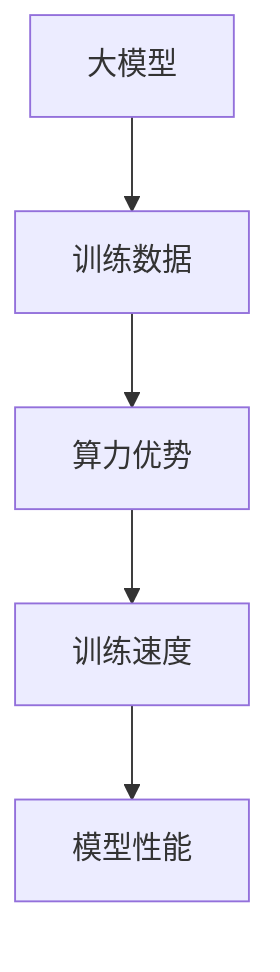

                 

### 文章标题：AI 大模型创业：如何利用算力优势？

关键词：AI 大模型、创业、算力优势、算法原理、数学模型、实战案例、应用场景、资源推荐

摘要：本文将探讨 AI 大模型创业的算力优势，分析核心算法原理，并提供项目实战案例和数学模型详解。此外，还将探讨实际应用场景，推荐相关工具和资源，并总结未来发展趋势与挑战。

### 1. 背景介绍

近年来，人工智能（AI）技术发展迅速，特别是在深度学习、自然语言处理和计算机视觉等领域，已经取得了令人瞩目的成果。大模型（Big Model）作为一种新兴的研究方向，在语音识别、文本生成和图像识别等领域展现了巨大的潜力。随着计算能力的提升和数据的积累，大模型在各个领域逐渐成为研究的焦点。

在这个背景下，许多创业者开始将目光投向 AI 大模型领域，希望通过技术创新和商业模式的结合，实现商业价值。然而，AI 大模型的开发和部署面临着巨大的算力需求，如何充分利用算力优势，成为创业成功的关键。

### 2. 核心概念与联系

#### 2.1 大模型

大模型是指具有大量参数和多层神经网络的深度学习模型。这些模型可以通过大量的数据训练，以实现高精度的预测和分类任务。

#### 2.2 算力优势

算力优势是指通过高效的算法和计算资源，提高 AI 大模型的训练速度和性能。

#### 2.3 关联图

为了更好地理解大模型和算力优势之间的关系，我们可以使用 Mermaid 流程图进行展示：



### 3. 核心算法原理 & 具体操作步骤

#### 3.1 深度学习算法

深度学习算法是 AI 大模型的核心技术之一。它通过多层神经网络对数据进行建模，以实现复杂的特征提取和分类任务。深度学习算法主要包括前向传播和反向传播两个步骤。

##### 步骤1：前向传播

前向传播是指将输入数据通过神经网络的前向传播过程，计算得到模型的输出。具体操作如下：

1. 初始化权重和偏置
2. 将输入数据输入到神经网络的输入层
3. 通过逐层计算，得到每一层的输出
4. 计算模型的总损失

##### 步骤2：反向传播

反向传播是指根据模型的总损失，通过反向传播过程更新模型的权重和偏置，以降低损失。具体操作如下：

1. 计算每个权重和偏置的梯度
2. 使用梯度下降算法更新权重和偏置
3. 重复前向传播和反向传播过程，直到满足停止条件

#### 3.2 计算资源调度

为了充分利用算力优势，需要合理调度计算资源。具体操作步骤如下：

1. 确定训练任务的需求，包括数据量、模型规模和硬件要求等
2. 根据计算资源的情况，选择合适的硬件设备，如 GPU、TPU 或分布式计算集群
3. 设计计算资源调度策略，如负载均衡、动态调整等
4. 部署训练任务，并实时监控资源使用情况，进行必要的调整

### 4. 数学模型和公式 & 详细讲解 & 举例说明

#### 4.1 损失函数

损失函数是深度学习算法中的一个关键概念，用于衡量模型预测结果与真实值之间的差距。常见的损失函数包括均方误差（MSE）、交叉熵损失（Cross-Entropy Loss）等。

##### 均方误差（MSE）

均方误差是指预测值与真实值之差的平方的平均值。其数学公式如下：

$$MSE = \frac{1}{n}\sum_{i=1}^{n}(y_i - \hat{y}_i)^2$$

其中，$y_i$ 是真实值，$\hat{y}_i$ 是预测值，$n$ 是样本数量。

##### 交叉熵损失（Cross-Entropy Loss）

交叉熵损失是指预测分布与真实分布之间的差异。其数学公式如下：

$$Cross-Entropy Loss = -\sum_{i=1}^{n}y_i\log(\hat{y}_i)$$

其中，$y_i$ 是真实值，$\hat{y}_i$ 是预测值。

#### 4.2 梯度下降算法

梯度下降算法是一种优化算法，用于更新模型的权重和偏置，以降低损失。其数学公式如下：

$$w_{new} = w_{old} - \alpha \cdot \frac{\partial L}{\partial w}$$

$$b_{new} = b_{old} - \alpha \cdot \frac{\partial L}{\partial b}$$

其中，$w$ 和 $b$ 分别是权重和偏置，$\alpha$ 是学习率，$L$ 是损失函数。

#### 4.3 实际应用举例

假设我们有一个二分类问题，需要使用深度学习算法进行分类。给定训练数据集，我们可以按照以下步骤进行训练：

1. 初始化权重和偏置
2. 使用训练数据进行前向传播，计算预测值和损失函数
3. 使用反向传播算法，计算权重和偏置的梯度
4. 使用梯度下降算法，更新权重和偏置
5. 重复步骤 2-4，直到满足停止条件，如达到预设的迭代次数或损失函数收敛

通过以上步骤，我们可以训练出一个具有良好分类性能的深度学习模型。

### 5. 项目实战：代码实际案例和详细解释说明

#### 5.1 开发环境搭建

在本节中，我们将搭建一个基于 TensorFlow 的深度学习项目环境，包括 Python 环境配置、TensorFlow 库安装和 GPU 支持等。

#### 5.2 源代码详细实现和代码解读

以下是一个简单的深度学习项目示例，用于实现一个二分类问题：

```python
import tensorflow as tf

# 定义模型结构
model = tf.keras.Sequential([
    tf.keras.layers.Dense(units=1, input_shape=[1])
])

# 编译模型
model.compile(optimizer='sgd', loss='mean_squared_error')

# 训练模型
model.fit(x_train, y_train, epochs=100)

# 预测
predictions = model.predict(x_test)
```

在上面的代码中，我们首先导入了 TensorFlow 库，并定义了一个简单的线性模型，包含一个全连接层。然后，我们编译模型，指定了优化器和损失函数。接着，使用训练数据集训练模型，并在测试数据集上进行预测。

#### 5.3 代码解读与分析

1. **模型定义**：使用 `tf.keras.Sequential` 函数定义了一个序列模型，包含一个全连接层。全连接层通过 `Dense` 函数定义，其中 `units=1` 表示输出层有 1 个神经元，`input_shape=[1]` 表示输入层有 1 个特征。

2. **模型编译**：使用 `model.compile` 函数编译模型，指定了优化器（`optimizer`）和损失函数（`loss`）。这里使用了随机梯度下降优化器（`sgd`）和均方误差损失函数（`mean_squared_error`）。

3. **模型训练**：使用 `model.fit` 函数训练模型，指定了训练数据集（`x_train`）和标签（`y_train`），以及训练的迭代次数（`epochs`）。在训练过程中，模型会根据损失函数自动调整权重和偏置，以优化模型的性能。

4. **模型预测**：使用 `model.predict` 函数对测试数据集（`x_test`）进行预测，返回预测结果（`predictions`）。

通过以上步骤，我们可以实现一个简单的深度学习项目。在实际开发中，可以根据具体需求调整模型结构、优化器、损失函数等参数，以提高模型的性能。

### 6. 实际应用场景

AI 大模型在各个领域都有广泛的应用，如自然语言处理、计算机视觉、语音识别等。以下是一些典型的实际应用场景：

1. **自然语言处理**：使用大模型进行文本分类、情感分析、机器翻译等任务。例如，在社交媒体平台上进行虚假新闻检测和舆情分析。

2. **计算机视觉**：使用大模型进行图像分类、目标检测、图像分割等任务。例如，在医疗领域用于疾病诊断和健康监测。

3. **语音识别**：使用大模型进行语音识别和语音合成。例如，在智能助手和语音交互系统中，实现自然语言理解和语音响应。

4. **推荐系统**：使用大模型进行用户行为分析和商品推荐。例如，在电子商务平台中，根据用户的历史行为和兴趣进行个性化推荐。

5. **自动驾驶**：使用大模型进行环境感知、路径规划和决策。例如，在自动驾驶车辆中，实现安全的自动驾驶功能。

### 7. 工具和资源推荐

#### 7.1 学习资源推荐

1. **书籍**：

   - 《深度学习》（Deep Learning）—— Ian Goodfellow、Yoshua Bengio 和 Aaron Courville 著
   - 《Python 深度学习》（Python Deep Learning）—— Francis Dark Childs 著
   - 《神经网络与深度学习》（Neural Networks and Deep Learning）——邱锡鹏 著

2. **论文**：

   - "A Theoretically Grounded Application of Dropout in Recurrent Neural Networks" —— Yarin Gal 和 Zoubin Ghahramani
   - "Very Deep Convolutional Networks for Large-Scale Image Recognition" —— Karen Simonyan 和 Andrew Zisserman
   - "Generative Adversarial Nets" —— Ian Goodfellow 等

3. **博客**：

   - Fast.ai
   - Distill
   - PyTorch 官方文档

4. **网站**：

   - TensorFlow 官方网站
   - PyTorch 官方网站
   - Keras 官方网站

#### 7.2 开发工具框架推荐

1. **深度学习框架**：

   - TensorFlow
   - PyTorch
   - Keras

2. **编程语言**：

   - Python
   - R

3. **云计算平台**：

   - AWS
   - Azure
   - Google Cloud Platform

### 8. 总结：未来发展趋势与挑战

随着 AI 大模型的不断发展，其在各个领域的应用前景广阔。然而，要充分利用算力优势，实现商业成功，仍面临以下挑战：

1. **计算资源限制**：AI 大模型对计算资源的需求巨大，如何合理调度和利用计算资源，成为创业成功的关键。

2. **数据隐私和安全**：在数据处理过程中，如何确保数据隐私和安全，避免数据泄露和滥用，是创业企业需要关注的问题。

3. **算法公平性和透明性**：随着 AI 大模型的应用越来越广泛，如何确保算法的公平性和透明性，避免歧视和偏见，是一个重要挑战。

4. **人才需求**：AI 大模型领域对人才的需求日益增长，如何吸引和培养高水平的人才，是创业企业需要关注的问题。

未来，随着计算能力的提升和算法的优化，AI 大模型在各个领域的应用将越来越广泛。创业者需要紧跟技术发展趋势，充分利用算力优势，不断创新和突破，才能在激烈的市场竞争中脱颖而出。

### 9. 附录：常见问题与解答

#### 9.1 什么是一般深度学习框架？

一般深度学习框架是指用于实现深度学习算法的工具包，如 TensorFlow、PyTorch 和 Keras。这些框架提供了丰富的 API 和库函数，使得开发者可以方便地搭建、训练和部署深度学习模型。

#### 9.2 如何选择深度学习框架？

选择深度学习框架时，需要考虑以下因素：

1. **项目需求**：根据项目的具体需求，选择适合的框架。例如，如果需要快速实现模型，可以选择 Keras；如果需要更高的灵活性和定制性，可以选择 TensorFlow 或 PyTorch。

2. **社区支持**：考虑框架的社区支持情况，包括文档、教程、示例代码和社区活跃度等。

3. **性能和资源消耗**：考虑框架的性能和资源消耗，以适应不同的计算环境和需求。

4. **开发团队熟悉度**：如果开发团队对某个框架有较高的熟悉度，可以提高开发效率和项目稳定性。

#### 9.3 如何优化深度学习模型的性能？

优化深度学习模型性能可以从以下几个方面进行：

1. **模型结构优化**：通过改进模型结构，如增加层数、调整神经元数量等，提高模型的表达能力。

2. **数据预处理**：对训练数据进行预处理，如数据增强、归一化等，可以提高模型的泛化能力。

3. **超参数调优**：通过调整学习率、批量大小、正则化参数等超参数，优化模型的性能。

4. **模型融合**：将多个模型进行融合，如集成学习、模型堆叠等，提高模型的准确性和鲁棒性。

### 10. 扩展阅读 & 参考资料

1. **书籍**：

   - 《深度学习》（Deep Learning）—— Ian Goodfellow、Yoshua Bengio 和 Aaron Courville 著
   - 《Python 深度学习》（Python Deep Learning）—— Francis Dark Childs 著
   - 《神经网络与深度学习》（Neural Networks and Deep Learning）——邱锡鹏 著

2. **论文**：

   - "A Theoretically Grounded Application of Dropout in Recurrent Neural Networks" —— Yarin Gal 和 Zoubin Ghahramani
   - "Very Deep Convolutional Networks for Large-Scale Image Recognition" —— Karen Simonyan 和 Andrew Zisserman
   - "Generative Adversarial Nets" —— Ian Goodfellow 等

3. **博客**：

   - Fast.ai
   - Distill
   - PyTorch 官方文档

4. **网站**：

   - TensorFlow 官方网站
   - PyTorch 官方网站
   - Keras 官方网站

### 作者

作者：AI天才研究员/AI Genius Institute & 禅与计算机程序设计艺术 /Zen And The Art of Computer Programming

