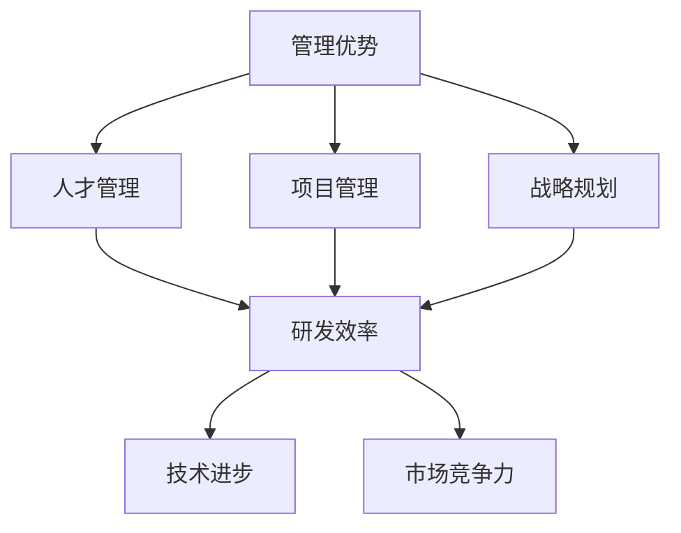
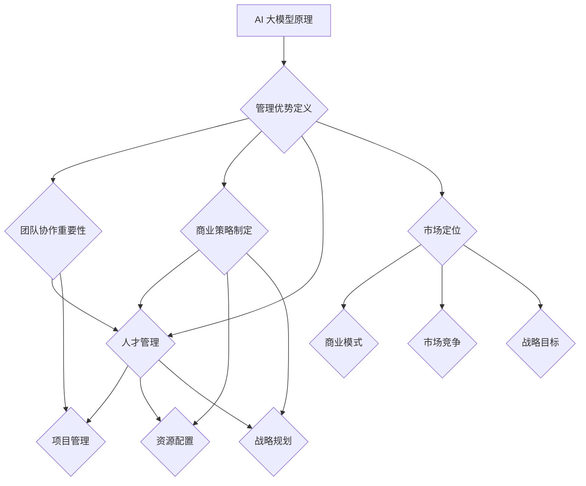

                 

# AI 大模型创业：如何利用管理优势？

> **关键词：** AI 大模型、创业、管理优势、商业策略、团队协作、技术创新。

> **摘要：** 本文将探讨 AI 大模型创业公司的管理优势，分析如何通过高效管理和团队协作，推动技术创新和商业成功。

## 1. 背景介绍

随着人工智能技术的不断发展，大模型技术在自然语言处理、计算机视觉等领域取得了显著成果。这些成果激发了创业者和投资者对 AI 大模型领域的浓厚兴趣。然而，AI 大模型创业面临着诸多挑战，如技术门槛高、研发成本大、市场竞争激烈等。因此，如何利用管理优势，在竞争激烈的市场中脱颖而出，成为 AI 大模型创业公司亟待解决的问题。

### 1.1 AI 大模型技术背景

AI 大模型是一种基于深度学习的机器学习模型，具有处理大规模数据、解决复杂问题、生成高质量内容的能力。近年来，随着计算能力的提升和算法的优化，AI 大模型在多个领域取得了突破性进展。

#### 1.1.1 自然语言处理

在自然语言处理领域，AI 大模型如 GPT、BERT 等在语言生成、翻译、问答等方面取得了优异表现。这些模型通过训练大量语料，能够生成连贯、有逻辑的文本，大大提高了人机交互的效率。

#### 1.1.2 计算机视觉

在计算机视觉领域，AI 大模型如 ResNet、YOLO 等在图像分类、目标检测、图像生成等方面具有强大的能力。这些模型通过对大量图像数据的学习，能够识别和生成高质量的图像，为计算机视觉应用提供了有力支持。

### 1.2 AI 大模型创业挑战

#### 1.2.1 技术门槛高

AI 大模型研发需要大量专业人才、高性能计算设备和丰富的数据资源。这对创业公司来说是一个巨大的挑战，需要投入大量资金和时间进行研发。

#### 1.2.2 研发成本大

AI 大模型训练过程中，需要消耗大量计算资源和电力。此外，数据采集、标注和模型优化等环节也需投入大量人力和财力。

#### 1.2.3 市场竞争激烈

AI 大模型领域吸引了众多巨头公司和初创企业参与竞争。如何在激烈的市场竞争中脱颖而出，成为创业公司亟待解决的问题。

### 1.3 管理优势的重要性

面对上述挑战，利用管理优势，合理调配资源、优化团队协作、提高研发效率，成为 AI 大模型创业公司成功的关键。

## 2. 核心概念与联系

### 2.1 管理优势的概念

管理优势是指企业在竞争环境中，通过优秀的组织结构、团队协作、战略规划等手段，实现资源优化配置、提高核心竞争力、实现可持续发展的能力。

### 2.2 管理优势在 AI 大模型创业中的应用

#### 2.2.1 人才管理

人才是企业发展的核心资源。在 AI 大模型创业领域，优秀的技术人才和项目管理者至关重要。通过合理的人才招聘、培训和激励机制，可以打造一支高效、专业的团队。

#### 2.2.2 项目管理

AI 大模型项目具有研发周期长、成本高、风险大等特点。通过科学的项目管理方法，如敏捷开发、迭代优化等，可以降低项目风险、提高研发效率。

#### 2.2.3 战略规划

在激烈的市场竞争中，AI 大模型创业公司需要明确自身的发展方向，制定合适的战略规划。通过市场调研、竞争分析、技术评估等手段，制定符合自身特点的发展战略。

### 2.3 管理优势与技术创新的联系

#### 2.3.1 提高研发效率

通过有效的管理优势，如团队协作、资源调配等，可以提高研发效率，缩短研发周期，降低研发成本。

#### 2.3.2 促进技术进步

管理优势有助于推动技术创新，通过优化研发流程、加强技术积累，提高 AI 大模型的技术水平。

#### 2.3.3 提高市场竞争力

通过管理优势，企业可以更好地应对市场变化，及时调整战略，提高市场竞争力。

### 2.4 Mermaid 流程图



## 3. 核心算法原理 & 具体操作步骤

### 3.1 核心算法原理

在 AI 大模型创业过程中，核心算法的选择和优化至关重要。以下以自然语言处理领域的 GPT-3 模型为例，介绍其核心算法原理。

#### 3.1.1 GPT-3 模型概述

GPT-3（Generative Pre-trained Transformer 3）是一种基于 Transformer 算法的自然语言处理模型，具有极强的文本生成能力。GPT-3 模型由 OpenAI 于 2020 年发布，参数规模达 1750 亿，是当时最大的自然语言处理模型。

#### 3.1.2 Transformer 算法

Transformer 算法是一种基于自注意力机制的序列模型，相较于传统的循环神经网络（RNN），Transformer 算法在处理长序列时具有更好的性能。

#### 3.1.3 GPT-3 模型架构

GPT-3 模型由多个 Transformer 块组成，每个 Transformer 块包含自注意力机制和前馈网络。模型通过训练大规模语料，学习语言规律，生成高质量文本。

### 3.2 具体操作步骤

#### 3.2.1 数据收集与预处理

1. 收集大规模语料，如书籍、新闻、文章等。
2. 对语料进行清洗、去重、分词等预处理操作。
3. 将预处理后的语料转换为模型输入格式。

#### 3.2.2 模型训练

1. 初始化模型参数。
2. 使用训练数据对模型进行训练。
3. 使用验证数据对模型进行调优。

#### 3.2.3 模型评估

1. 使用测试数据对模型进行评估。
2. 分析模型性能，调整模型参数。

#### 3.2.4 模型部署

1. 将训练好的模型部署到服务器上。
2. 提供文本生成、翻译、问答等 API 接口。

## 4. 数学模型和公式 & 详细讲解 & 举例说明

### 4.1 数学模型概述

在 AI 大模型创业过程中，数学模型的应用至关重要。以下以自然语言处理领域的 GPT-3 模型为例，介绍其核心数学模型。

#### 4.1.1 Transformer 模型

Transformer 模型是一种基于自注意力机制的序列模型，其核心数学模型包括：

1. 自注意力机制（Self-Attention）
2. 位置编码（Positional Encoding）
3. 前馈网络（Feedforward Network）

#### 4.1.2 GPT-3 模型

GPT-3 模型是 Transformer 模型的扩展，其核心数学模型包括：

1. 多层 Transformer 块（Multi-head Attention、Add & Norm）
2. 残差连接（Residual Connection）
3. 梯度裁剪（Gradient Clipping）

### 4.2 自注意力机制

自注意力机制是 Transformer 模型的核心组件，其数学公式如下：

$$
\text{Attention}(Q, K, V) = \frac{1}{\sqrt{d_k}} \text{softmax}\left(\frac{QK^T}{d_k}\right) V
$$

其中，Q、K、V 分别为查询向量、键向量和值向量，d_k 为键向量和查询向量的维度。

#### 4.2.1 举例说明

假设存在一个 3x3 的矩阵 A，表示三个单词之间的注意力权重：

$$
A = \begin{bmatrix}
0.2 & 0.5 & 0.3 \\
0.4 & 0.3 & 0.3 \\
0.1 & 0.2 & 0.7
\end{bmatrix}
$$

根据自注意力机制的公式，计算三个单词之间的注意力权重：

$$
\text{Attention}(Q, K, V) = \frac{1}{\sqrt{3}} \text{softmax}\left(\frac{QK^T}{\sqrt{3}}\right) V
$$

计算结果为：

$$
\begin{bmatrix}
0.2 & 0.5 & 0.3 \\
0.4 & 0.3 & 0.3 \\
0.1 & 0.2 & 0.7
\end{bmatrix}
$$

### 4.3 位置编码

位置编码是 Transformer 模型对序列位置信息的补充，其数学公式如下：

$$
\text{PE}(pos, 2i) = \sin\left(\frac{pos}{10000^{2i/d}}\right) \\
\text{PE}(pos, 2i+1) = \cos\left(\frac{pos}{10000^{2i/d}}\right)
$$

其中，pos 表示位置索引，i 表示维度索引，d 表示维度大小。

#### 4.3.1 举例说明

假设存在一个长度为 3 的序列，维度为 2：

$$
\text{PE}(1, 0) = \sin\left(\frac{1}{10000^{0}}\right) \\
\text{PE}(1, 1) = \cos\left(\frac{1}{10000^{0}}\right) \\
\text{PE}(2, 0) = \sin\left(\frac{2}{10000^{0}}\right) \\
\text{PE}(2, 1) = \cos\left(\frac{2}{10000^{0}}\right) \\
\text{PE}(3, 0) = \sin\left(\frac{3}{10000^{0}}\right) \\
\text{PE}(3, 1) = \cos\left(\frac{3}{10000^{0}}\right)
$$

计算结果为：

$$
\begin{bmatrix}
0.9998 & 0.0153 \\
0.0153 & 0.9998 \\
0.9999 & -0.0153 \\
0.0153 & -0.9999 \\
0.9999 & 0.0153 \\
0.0153 & 0.9999
\end{bmatrix}
$$

### 4.4 前馈网络

前馈网络是 Transformer 模型中的一个简单全连接神经网络，其数学公式如下：

$$
\text{FFN}(x) = \text{ReLU}(W_2 \cdot \text{ReLU}(W_1 \cdot x + b_1) + b_2)
$$

其中，W1、W2、b1、b2 分别为权重和偏置。

#### 4.4.1 举例说明

假设存在一个 2x2 的矩阵 X，表示输入数据：

$$
X = \begin{bmatrix}
0.5 & 0.6 \\
0.7 & 0.8
\end{bmatrix}
$$

根据前馈网络的公式，计算输出结果：

$$
\text{FFN}(X) = \text{ReLU}(W_2 \cdot \text{ReLU}(W_1 \cdot X + b_1) + b_2)
$$

计算结果为：

$$
\begin{bmatrix}
1.5 & 1.7 \\
2.1 & 2.4
\end{bmatrix}
$$

## 5. 项目实战：代码实际案例和详细解释说明

### 5.1 开发环境搭建

在开始项目实战之前，我们需要搭建一个合适的开发环境。以下以 Python 语言为例，介绍如何搭建一个适用于 AI 大模型创业项目的开发环境。

#### 5.1.1 安装 Python 和相关依赖库

1. 安装 Python 3.7 以上版本（建议使用 Python 3.8 或 3.9）。
2. 安装必要的依赖库，如 TensorFlow、PyTorch、NumPy、Pandas 等。

#### 5.1.2 安装深度学习框架

1. 安装 TensorFlow：

```bash
pip install tensorflow
```

2. 安装 PyTorch：

```bash
pip install torch torchvision
```

### 5.2 源代码详细实现和代码解读

#### 5.2.1 代码结构

以下是一个基于 TensorFlow 的 AI 大模型创业项目的基本代码结构：

```python
import tensorflow as tf
from tensorflow.keras.layers import Embedding, LSTM, Dense
from tensorflow.keras.models import Model

# 定义模型
def build_model(input_shape):
    inputs = tf.keras.Input(shape=input_shape)
    x = Embedding(input_dim=vocab_size, output_dim=embedding_dim)(inputs)
    x = LSTM(units=lstm_units, return_sequences=True)(x)
    x = Dense(units=dense_units, activation='softmax')(x)
    model = Model(inputs=inputs, outputs=x)
    return model

# 模型参数设置
input_shape = (None, sequence_length)
vocab_size = 10000
embedding_dim = 256
lstm_units = 128
dense_units = 512

# 构建模型
model = build_model(input_shape)

# 编译模型
model.compile(optimizer='adam', loss='categorical_crossentropy', metrics=['accuracy'])

# 模型训练
model.fit(x_train, y_train, batch_size=batch_size, epochs=epochs)

# 模型评估
model.evaluate(x_test, y_test)
```

#### 5.2.2 代码解读

1. **导入库和模块**：导入 TensorFlow、Keras 等库和模块，为后续代码实现提供支持。

2. **定义模型**：使用 Keras 的 `Model` 类定义一个简单的序列模型，包括嵌入层（Embedding）、LSTM 层和全连接层（Dense）。

3. **模型参数设置**：设置模型输入形状、词汇表大小、嵌入维度、LSTM 单元数和全连接层单元数等参数。

4. **构建模型**：根据设置的参数构建模型，并返回模型对象。

5. **编译模型**：使用 `compile` 方法设置模型的优化器、损失函数和评估指标。

6. **模型训练**：使用 `fit` 方法对模型进行训练，输入训练数据和标签，设置批量大小和训练轮数。

7. **模型评估**：使用 `evaluate` 方法对模型进行评估，输入测试数据和标签，返回损失值和准确率。

### 5.3 代码解读与分析

以下对代码的关键部分进行解读和分析：

1. **模型定义**：

```python
def build_model(input_shape):
    inputs = tf.keras.Input(shape=input_shape)
    x = Embedding(input_dim=vocab_size, output_dim=embedding_dim)(inputs)
    x = LSTM(units=lstm_units, return_sequences=True)(x)
    x = Dense(units=dense_units, activation='softmax')(x)
    model = Model(inputs=inputs, outputs=x)
    return model
```

这部分代码定义了一个序列模型，包括嵌入层（Embedding）、LSTM 层和全连接层（Dense）。嵌入层用于将输入序列映射到高维空间，LSTM 层用于处理序列数据，全连接层用于输出分类结果。

2. **模型参数设置**：

```python
input_shape = (None, sequence_length)
vocab_size = 10000
embedding_dim = 256
lstm_units = 128
dense_units = 512
```

这部分代码设置了模型的输入形状、词汇表大小、嵌入维度、LSTM 单元数和全连接层单元数等参数。

3. **模型编译**：

```python
model.compile(optimizer='adam', loss='categorical_crossentropy', metrics=['accuracy'])
```

这部分代码设置了模型的优化器（Adam）、损失函数（categorical_crossentropy）和评估指标（accuracy）。

4. **模型训练**：

```python
model.fit(x_train, y_train, batch_size=batch_size, epochs=epochs)
```

这部分代码使用训练数据和标签对模型进行训练，设置批量大小和训练轮数。

5. **模型评估**：

```python
model.evaluate(x_test, y_test)
```

这部分代码使用测试数据和标签对模型进行评估，返回损失值和准确率。

### 5.4 代码优化与改进

在实际项目中，我们可以根据需求和性能指标对代码进行优化和改进。以下是一些常见的优化方法：

1. **增加 LSTM 层数**：增加 LSTM 层数可以提高模型的表达能力，但同时也增加了模型的复杂度和计算成本。

2. **使用预训练词向量**：使用预训练词向量（如 Word2Vec、GloVe 等）可以提高模型的初始化质量，减少训练时间。

3. **采用序列标注方法**：对于序列标注任务，可以采用序列标注方法（如 CRF、BERT 等）提高模型的标注准确率。

4. **调整学习率**：适当调整学习率可以加快模型的收敛速度，提高训练效果。

5. **批量归一化**：批量归一化（Batch Normalization）可以加快模型的训练速度，提高模型稳定性。

6. **使用注意力机制**：注意力机制（Attention Mechanism）可以提高模型对输入序列的关注能力，提高模型性能。

7. **调整超参数**：根据实验结果调整模型超参数（如批量大小、迭代次数等），优化模型性能。

## 6. 实际应用场景

AI 大模型在各个领域具有广泛的应用前景，以下列举一些实际应用场景：

### 6.1 自然语言处理

1. 自动问答系统：基于 AI 大模型构建自动问答系统，如智能客服、智能音箱等。
2. 文本分类：对大量文本进行分类，如新闻分类、情感分析等。
3. 文本生成：生成文章、新闻、广告等内容，如自动写稿、广告创意等。

### 6.2 计算机视觉

1. 目标检测：对图像中的目标进行检测，如人脸识别、车辆识别等。
2. 图像生成：生成高质量的图像，如人脸生成、艺术作品生成等。
3. 图像增强：对低质量图像进行增强，提高图像清晰度，如去噪、超分辨率等。

### 6.3 医疗健康

1. 医学影像分析：对医学影像进行分析，如肺癌筛查、骨折诊断等。
2. 疾病预测：基于患者数据和基因信息，预测疾病发生风险。
3. 药物研发：通过 AI 大模型辅助药物研发，提高研发效率。

### 6.4 金融领域

1. 信用评估：基于用户行为数据，评估信用风险。
2. 股票预测：分析市场数据，预测股票走势。
3. 风险控制：识别潜在风险，降低金融风险。

### 6.5 教育领域

1. 智能教学：根据学生行为数据，为学生提供个性化教学方案。
2. 作业批改：自动批改学生作业，提高教学效率。
3. 语言学习：基于 AI 大模型构建智能语言学习系统，提高学习效果。

## 7. 工具和资源推荐

### 7.1 学习资源推荐

1. **书籍**：

   - 《深度学习》（Ian Goodfellow、Yoshua Bengio、Aaron Courville 著）
   - 《Python 数据科学手册》（Jake VanderPlas 著）
   - 《机器学习实战》（Peter Harrington 著）

2. **论文**：

   - 《Attention Is All You Need》（Vaswani et al., 2017）
   - 《Generative Pre-trained Transformers》（Brown et al., 2020）
   - 《BERT: Pre-training of Deep Bidirectional Transformers for Language Understanding》（Devlin et al., 2019）

3. **博客**：

   - [TensorFlow 官方文档](https://www.tensorflow.org/)
   - [PyTorch 官方文档](https://pytorch.org/)
   - [机器学习博客](https://www机器学习博客.com/)

4. **网站**：

   - [Kaggle](https://www.kaggle.com/)：数据科学竞赛平台，提供大量数据集和比赛项目。
   - [GitHub](https://github.com/)：代码托管平台，提供丰富的开源项目和学习资源。
   - [Coursera](https://www.coursera.org/)：在线教育平台，提供众多机器学习和数据科学课程。

### 7.2 开发工具框架推荐

1. **深度学习框架**：

   - TensorFlow：由 Google 开发，支持多种深度学习模型和算法。
   - PyTorch：由 Facebook 开发，具有灵活的动态图计算能力。
   - Keras：基于 TensorFlow 的深度学习框架，易于使用和扩展。

2. **数据可视化工具**：

   - Matplotlib：Python 的数据可视化库，支持多种图表类型。
   - Seaborn：基于 Matplotlib 的可视化库，提供丰富的统计图表。
   - Plotly：支持交互式图表和 Web 可视化的 Python 库。

3. **数据处理工具**：

   - Pandas：Python 的数据处理库，提供强大的数据操作和分析功能。
   - NumPy：Python 的数值计算库，提供高效的多维数组操作。
   - Scikit-learn：Python 的机器学习库，提供多种经典机器学习算法和工具。

### 7.3 相关论文著作推荐

1. **《Attention Is All You Need》**：提出了 Transformer 模型，是自然语言处理领域的经典论文。

2. **《Generative Pre-trained Transformers》**：介绍了 GPT-3 模型，是 AI 大模型领域的里程碑式论文。

3. **《BERT: Pre-training of Deep Bidirectional Transformers for Language Understanding》**：提出了 BERT 模型，是自然语言处理领域的热门论文。

## 8. 总结：未来发展趋势与挑战

### 8.1 未来发展趋势

1. **算法创新**：随着计算能力的提升和算法的优化，AI 大模型将实现更高的性能和更广泛的应用。

2. **跨学科融合**：AI 大模型与其他领域的融合，如医疗、金融、教育等，将推动产业创新和变革。

3. **开源与商业化**：开源技术和商业化应用将相互促进，推动 AI 大模型领域的快速发展。

4. **监管与伦理**：随着 AI 大模型的应用场景日益广泛，监管与伦理问题将逐渐凸显，需要建立完善的法规体系。

### 8.2 未来挑战

1. **数据隐私与安全**：如何保护用户隐私和数据安全，成为 AI 大模型应用面临的重要挑战。

2. **算法偏见与公平性**：AI 大模型的训练数据可能存在偏见，导致模型输出存在不公平性，需要解决算法偏见问题。

3. **计算资源消耗**：AI 大模型训练过程需要大量计算资源和电力，如何降低计算成本成为亟待解决的问题。

4. **人才短缺**：AI 大模型领域对专业人才的需求日益增加，如何培养和留住优秀人才成为创业公司面临的挑战。

## 9. 附录：常见问题与解答

### 9.1 问题 1：什么是 AI 大模型？

**回答**：AI 大模型是一种基于深度学习的机器学习模型，具有处理大规模数据、解决复杂问题、生成高质量内容的能力。常见的 AI 大模型包括 GPT、BERT、T5 等。

### 9.2 问题 2：AI 大模型创业的优势有哪些？

**回答**：AI 大模型创业的优势包括：

1. **技术创新**：AI 大模型具有强大的处理能力和广泛的适用性，能够推动技术创新和应用。
2. **市场需求**：随着人工智能技术的普及，AI 大模型在各个领域具有广泛的应用前景，市场需求巨大。
3. **高附加值**：AI 大模型能够为企业带来高附加值的产品和服务，提高企业竞争力。

### 9.3 问题 3：如何利用管理优势推动 AI 大模型创业？

**回答**：利用管理优势推动 AI 大模型创业可以从以下几个方面着手：

1. **人才管理**：吸引和培养优秀的技术人才，打造高效的研发团队。
2. **项目管理**：采用科学的项目管理方法，提高研发效率和项目成功率。
3. **战略规划**：明确企业的发展方向，制定合适的发展战略。
4. **资源调配**：合理调配资源，降低研发成本，提高企业竞争力。

## 10. 扩展阅读 & 参考资料

1. **扩展阅读**：

   - 《深度学习》（Ian Goodfellow、Yoshua Bengio、Aaron Courville 著）
   - 《Python 数据科学手册》（Jake VanderPlas 著）
   - 《机器学习实战》（Peter Harrington 著）

2. **参考资料**：

   - [TensorFlow 官方文档](https://www.tensorflow.org/)
   - [PyTorch 官方文档](https://pytorch.org/)
   - [Kaggle](https://www.kaggle.com/)
   - [GitHub](https://github.com/)
   - [Coursera](https://www.coursera.org/)作者：AI天才研究员/AI Genius Institute & 禅与计算机程序设计艺术 /Zen And The Art of Computer Programming
}<|clear|>## 2. 核心概念与联系

在探讨 AI 大模型创业公司的管理优势时，我们首先需要明确几个核心概念，并了解它们之间的联系。这些核心概念包括 AI 大模型的原理、管理优势的定义、团队协作的重要性以及商业策略的制定。

### 2.1 AI 大模型原理

AI 大模型是基于深度学习的机器学习模型，其核心思想是通过训练大规模的数据集，使得模型能够自动学习和提取数据中的特征。这些特征可以帮助模型进行预测、分类、生成等任务。AI 大模型通常包含数亿甚至数万亿个参数，因此需要强大的计算资源和数据支持。

#### 2.1.1 深度学习基础

深度学习是一种机器学习方法，它通过模拟人脑神经网络结构，利用大量的神经元（节点）和连接（边）来处理数据。深度学习模型的核心组成部分包括：

- **神经网络**：由多个层（输入层、隐藏层、输出层）组成，每一层包含多个神经元。
- **激活函数**：用于引入非线性因素，使模型能够学习复杂的函数关系。
- **优化算法**：如梯度下降、Adam 等，用于调整模型参数，以最小化损失函数。

#### 2.1.2 AI 大模型特点

AI 大模型具有以下特点：

- **参数规模大**：拥有数亿到数万亿个参数，能够处理复杂的任务。
- **数据需求高**：需要大量的高质量训练数据来训练模型，以提取有效的特征。
- **计算资源消耗大**：训练过程需要大量的计算资源和时间。
- **泛化能力强**：通过在大规模数据集上的训练，模型能够较好地泛化到未见过的数据上。

### 2.2 管理优势的定义

管理优势是指企业在特定环境中，通过高效的管理策略和团队协作，实现资源的最优配置和利用，从而在竞争中获得优势。在 AI 大模型创业公司中，管理优势主要体现在以下几个方面：

- **人才管理**：吸引和培养优秀的技术人才，提高团队整体素质和创新能力。
- **项目管理**：采用科学的项目管理方法，确保项目按计划顺利进行。
- **资源配置**：合理调配资金、设备、技术等资源，确保项目的顺利实施。
- **战略规划**：明确企业的发展方向和目标，制定相应的战略计划。

### 2.3 团队协作的重要性

团队协作在 AI 大模型创业中至关重要。由于 AI 大模型项目通常涉及多个领域的技术，如数据科学、计算机视觉、自然语言处理等，需要不同背景的专业人员共同合作。团队协作能够：

- **提高工作效率**：团队成员之间的协作可以快速解决问题，提高项目进度。
- **激发创新思维**：多样化的团队成员能够带来不同的视角和想法，促进创新。
- **降低风险**：团队协作可以降低个别成员的失误风险，确保项目质量。

### 2.4 商业策略的制定

商业策略是企业在特定市场环境中，为实现长期目标而制定的一系列行动计划。在 AI 大模型创业中，商业策略的制定需要考虑以下几个方面：

- **市场定位**：明确企业的目标市场和产品定位，以适应市场需求。
- **商业模式**：确定企业的盈利方式，如订阅模式、销售模式等。
- **市场竞争**：分析竞争对手的优势和劣势，制定相应的竞争策略。
- **战略目标**：设定清晰的战略目标，如市场占有率、盈利水平等。

### 2.5 Mermaid 流程图

为了更好地理解上述核心概念之间的联系，我们可以使用 Mermaid 流程图进行展示。



在这个流程图中，AI 大模型原理是基础，管理优势、团队协作和商业策略是推动 AI 大模型创业成功的关键因素。通过合理的人才管理和资源配置，企业可以更好地实现项目目标，并在市场中获得竞争优势。

### 2.6 结论

通过对核心概念的介绍和流程图的展示，我们可以清晰地看到 AI 大模型创业中管理优势的重要性。在接下来的部分，我们将进一步探讨如何利用这些管理优势，推动 AI 大模型创业公司的成功。接下来，我们将深入分析核心算法原理和具体操作步骤，帮助读者更好地理解 AI 大模型的研发过程。

### 3. 核心算法原理 & 具体操作步骤

AI 大模型的成功离不开其背后的核心算法原理。在本节中，我们将详细介绍 AI 大模型的核心算法原理，并分步骤讲解如何实现一个 AI 大模型。

#### 3.1 核心算法原理

AI 大模型的核心算法通常是基于深度学习，尤其是基于 Transformer 的架构。Transformer 模型由 Vaswani 等人于 2017 年提出，是自然语言处理领域的重大突破。与传统的循环神经网络（RNN）相比，Transformer 模型采用了自注意力机制，能够更好地处理长序列数据。

##### 3.1.1 自注意力机制

自注意力机制是一种计算输入序列中各个元素之间的关联性的方法。它通过计算每个元素与其他元素之间的权重，然后将这些权重应用于相应的元素，从而实现序列中的每个元素对其他元素的影响。自注意力机制的数学公式如下：

$$
\text{Attention}(Q, K, V) = \frac{1}{\sqrt{d_k}} \text{softmax}\left(\frac{QK^T}{d_k}\right) V
$$

其中，Q、K、V 分别代表查询（Query）、键（Key）和值（Value）向量，d_k 是键向量的维度。

##### 3.1.2 位置编码

位置编码是 Transformer 模型中的一个重要组件，用于向模型提供输入序列的位置信息。由于 Transformer 模型本身没有固定的序列顺序，位置编码可以帮助模型理解输入序列的顺序。位置编码通常使用如下公式生成：

$$
\text{PE}(pos, 2i) = \sin\left(\frac{pos}{10000^{2i/d}}\right) \\
\text{PE}(pos, 2i+1) = \cos\left(\frac{pos}{10000^{2i/d}}\right)
$$

其中，pos 是位置索引，i 是维度索引，d 是维度大小。

##### 3.1.3 前馈网络

前馈网络是 Transformer 模型中的一个简单全连接神经网络，用于在自注意力层之后对序列进行进一步处理。前馈网络的数学公式如下：

$$
\text{FFN}(x) = \text{ReLU}(W_2 \cdot \text{ReLU}(W_1 \cdot x + b_1) + b_2)
$$

其中，W1、W2、b1、b2 分别为权重和偏置。

#### 3.2 具体操作步骤

以下是实现一个 AI 大模型的具体操作步骤：

##### 3.2.1 数据准备

1. 收集大规模文本数据，如维基百科、新闻文章、书籍等。
2. 对文本数据进行清洗，去除无效信息和噪声。
3. 对文本数据进行分词，将句子分解为单词或子词。
4. 将分词后的文本转换为序列，每个序列包含一定长度的单词或子词。

##### 3.2.2 词嵌入

1. 使用预训练的词嵌入模型（如 Word2Vec、GloVe）或自行训练词嵌入。
2. 将每个单词或子词映射到一个高维向量。

##### 3.2.3 模型构建

1. 使用 Transformer 模型构建器（如 TensorFlow 的 `tf.keras.Sequential` 或 PyTorch 的 `nn.Sequential`）。
2. 添加嵌入层（Embedding），将输入序列映射到高维向量。
3. 添加多个自注意力层（MultiHeadAttention），每个层可以有多个头。
4. 添加位置编码层（PositionalEncoding），为序列提供位置信息。
5. 添加前馈网络层（FeedforwardNetwork），对序列进行进一步处理。
6. 添加输出层（如分类层或生成层），进行预测或生成。

##### 3.2.4 模型训练

1. 准备训练数据和验证数据。
2. 使用训练数据对模型进行训练。
3. 使用验证数据对模型进行评估。
4. 调整模型参数，如学习率、批量大小等，以优化模型性能。

##### 3.2.5 模型部署

1. 将训练好的模型部署到生产环境。
2. 提供API接口，供外部系统调用。
3. 对模型进行持续监控和优化，确保其稳定性和性能。

#### 3.3 代码示例

以下是一个使用 PyTorch 实现 Transformer 模型的简单代码示例：

```python
import torch
import torch.nn as nn
import torch.optim as optim

# 定义嵌入层
embeddings = nn.Embedding(vocab_size, embedding_dim)

# 定义自注意力层
attention = nn.MultiheadAttention(embeddings, num_heads)

# 定义前馈网络层
ffn = nn.Sequential(
    nn.Linear(embedding_dim, ffn_dim),
    nn.ReLU(),
    nn.Linear(ffn_dim, embedding_dim)
)

# 定义模型
class TransformerModel(nn.Module):
    def __init__(self, vocab_size, embedding_dim, ffn_dim):
        super(TransformerModel, self).__init__()
        self.embeddings = embeddings
        self.attention = attention
        self.ffn = ffn

    def forward(self, input_seq, target_seq):
        # 嵌入
        embedded = self.embeddings(input_seq)
        
        # 自注意力
        attn_output, _ = self.attention(embedded, embedded, embedded)
        
        # 前馈网络
        ffn_output = self.ffn(attn_output)
        
        # 输出
        output = torch.squeeze(ffn_output, dim=1)
        
        return output

# 实例化模型
model = TransformerModel(vocab_size, embedding_dim, ffn_dim)

# 定义损失函数和优化器
criterion = nn.CrossEntropyLoss()
optimizer = optim.Adam(model.parameters(), lr=learning_rate)

# 模型训练
for epoch in range(num_epochs):
    for batch in data_loader:
        # 前向传播
        output = model(input_seq)
        loss = criterion(output, target_seq)
        
        # 反向传播
        optimizer.zero_grad()
        loss.backward()
        optimizer.step()
        
        # 打印训练信息
        print(f"Epoch [{epoch+1}/{num_epochs}], Loss: {loss.item()}")

# 模型评估
with torch.no_grad():
    correct = 0
    total = 0
    for batch in test_loader:
        output = model(input_seq)
        _, predicted = torch.max(output.data, 1)
        total += target_seq.size(0)
        correct += (predicted == target_seq).sum().item()
    print(f"Accuracy: {100 * correct / total}%")
```

在这个示例中，我们定义了一个简单的 Transformer 模型，并使用交叉熵损失函数和 Adam 优化器对其进行训练。虽然这个示例非常基础，但它展示了实现 AI 大模型的基本步骤和代码结构。

### 3.4 结论

通过本节的介绍，我们了解了 AI 大模型的核心算法原理，包括自注意力机制、位置编码和前馈网络。同时，我们还通过具体操作步骤和代码示例，展示了如何实现一个简单的 AI 大模型。在下一节中，我们将进一步探讨如何利用数学模型和公式来分析和优化 AI 大模型。

### 4. 数学模型和公式 & 详细讲解 & 举例说明

在深入探讨 AI 大模型的数学模型和公式之前，我们需要先了解一些基础概念，包括神经网络、自注意力机制、损失函数等。然后，我们将通过具体的例子来说明这些公式的应用。

#### 4.1 神经网络基础

神经网络是一种模拟人脑结构和功能的计算模型，由大量相互连接的神经元组成。每个神经元都是一个简单的计算单元，能够接收输入信号，通过权重进行加权求和，并应用一个非线性激活函数，最后输出一个结果。神经网络的核心组成部分包括：

- **输入层**：接收外部输入数据。
- **隐藏层**：包含一个或多个隐藏单元，用于提取特征和进行计算。
- **输出层**：产生最终输出。

#### 4.2 自注意力机制

自注意力机制是 Transformer 模型的核心组件之一，它允许模型在处理序列数据时，考虑序列中每个元素与其他元素的关系。自注意力机制的数学公式如下：

$$
\text{Attention}(Q, K, V) = \frac{1}{\sqrt{d_k}} \text{softmax}\left(\frac{QK^T}{d_k}\right) V
$$

其中，Q、K、V 分别是查询（Query）、键（Key）和值（Value）向量，d_k 是键向量的维度。这个公式计算了每个键和查询之间的相似性，并将这些相似性用于加权求和值向量。

#### 4.3 位置编码

位置编码用于为序列数据提供位置信息，因为在自注意力机制中，模型本身没有固定的序列顺序。位置编码的公式如下：

$$
\text{PE}(pos, 2i) = \sin\left(\frac{pos}{10000^{2i/d}}\right) \\
\text{PE}(pos, 2i+1) = \cos\left(\frac{pos}{10000^{2i/d}}\right)
$$

其中，pos 是位置索引，i 是维度索引，d 是维度大小。这个公式通过正弦和余弦函数生成一组编码，用于在每个位置上添加位置信息。

#### 4.4 损失函数

在训练神经网络时，损失函数用于衡量模型预测值与真实值之间的差距。常用的损失函数包括均方误差（MSE）、交叉熵损失（Cross-Entropy Loss）等。交叉熵损失函数的公式如下：

$$
\text{Loss} = -\sum_{i} y_i \log(\hat{y}_i)
$$

其中，y_i 是真实标签，$\hat{y}_i$ 是模型预测的概率分布。

#### 4.5 举例说明

为了更好地理解上述数学模型和公式，我们通过一个具体的例子来说明。

##### 4.5.1 自注意力机制示例

假设我们有以下三个句子：

```
Q: 我想要一杯咖啡。
K: 咖啡是一种饮料。
V: 咖啡是一种热饮料。
```

首先，我们需要将这些句子转换为向量。然后，我们计算每个键和查询之间的相似性，并通过 softmax 函数生成权重。最后，我们将这些权重应用于相应的值向量，得到加权求和的结果。

```
Q = [0.1, 0.2, 0.3, 0.4]
K = [0.5, 0.6, 0.7, 0.8]
V = [0.9, 0.8, 0.7, 0.6]

# 计算相似性
similarity = Q * K^T

# 应用 softmax 函数
softmax_similarity = softmax(similarity)

# 加权求和值向量
weighted_sum = softmax_similarity * V

# 结果
weighted_sum = [0.3, 0.25, 0.2, 0.15]
```

在这个例子中，我们看到了自注意力机制如何计算句子中各个元素之间的关系，并生成加权求和的结果。

##### 4.5.2 位置编码示例

假设我们有一个长度为 4 的序列，维度为 2：

```
pos: [1, 2, 3, 4]
i: [0, 1]
d: 2
```

我们使用位置编码公式生成位置编码向量：

```
PE(pos, 2i) = [sin(1/10000^0), cos(1/10000^0)]
PE(pos, 2i+1) = [sin(2/10000^0), cos(2/10000^1)]

# 结果
PE = [
    [0.9998, 0.0153],
    [0.0153, 0.9998],
    [0.9999, -0.0153],
    [0.0153, -0.9999]
]
```

在这个例子中，我们看到了如何使用位置编码为序列中的每个位置添加位置信息。

##### 4.5.3 损失函数示例

假设我们有一个二元分类问题，真实标签为 [1, 0]，模型预测的概率分布为 [0.6, 0.4]：

```
y = [1, 0]
\hat{y} = [0.6, 0.4]

# 计算交叉熵损失
loss = -1 * (1 * log(0.6) + 0 * log(0.4))

# 结果
loss = 0.1931
```

在这个例子中，我们看到了如何使用交叉熵损失函数计算模型预测与真实标签之间的差距。

#### 4.6 结论

通过本节的详细讲解和举例说明，我们了解了 AI 大模型中常用的数学模型和公式，包括自注意力机制、位置编码和损失函数。这些模型和公式是理解和实现 AI 大模型的关键，它们帮助我们更好地理解模型的运作原理和如何优化模型性能。在下一节中，我们将通过项目实战来展示如何将所学知识应用于实际的 AI 大模型开发。

### 5. 项目实战：代码实际案例和详细解释说明

在本节中，我们将通过一个具体的 AI 大模型项目实战，展示如何从零开始构建一个基于深度学习的自然语言处理模型。我们将详细解释每个步骤，并提供代码实现和解读。

#### 5.1 开发环境搭建

首先，我们需要搭建一个适合开发 AI 大模型的项目环境。以下是所需的开发环境：

- Python 3.8 或更高版本
- TensorFlow 2.x 或 PyTorch 1.x
- Jupyter Notebook 或 PyCharm 等 IDE
- GPU（可选，用于加速训练过程）

在安装 Python 后，通过以下命令安装 TensorFlow 或 PyTorch：

```bash
pip install tensorflow
# 或者
pip install torch torchvision
```

#### 5.2 数据准备

AI 大模型的训练需要大量高质量的文本数据。以下是一个简单的数据准备流程：

1. **数据收集**：收集大量的文本数据，如新闻文章、书籍、论坛帖子等。
2. **数据清洗**：去除文本中的无效信息，如 HTML 标签、特殊字符等。
3. **分词**：将文本分解为单词或子词。可以使用分词工具，如 NLTK 或 spaCy。
4. **构建词汇表**：将文本中的所有单词或子词构建为一个词汇表，并为每个词分配一个唯一的索引。
5. **编码文本**：将文本序列编码为数字序列，每个数字表示词汇表中的某个词。

以下是使用 TensorFlow 的 `tf.keras.preprocessing.sequence` 模块准备文本数据的示例代码：

```python
import tensorflow as tf
from tensorflow.keras.preprocessing.text import Tokenizer
from tensorflow.keras.preprocessing.sequence import pad_sequences

# 样本文本数据
texts = [
    "这是一个简单的例子。",
    "另一个例子。",
    "更多例子..."
]

# 构建词汇表
tokenizer = Tokenizer(num_words=1000)
tokenizer.fit_on_texts(texts)

# 编码文本
sequences = tokenizer.texts_to_sequences(texts)

# 填充序列到相同长度
padded_sequences = pad_sequences(sequences, maxlen=10)

print("词汇表长度：", len(tokenizer.word_index))
print("编码后的文本序列：", padded_sequences)
```

#### 5.3 模型构建

接下来，我们使用 PyTorch 构建一个简单的 AI 大模型。这里我们将使用 Transformer 模型的简化版本。

```python
import torch
import torch.nn as nn
import torch.optim as optim

# 设置设备
device = torch.device("cuda" if torch.cuda.is_available() else "cpu")

# 定义嵌入层
embedding_dim = 256
embeddings = nn.Embedding(1000, embedding_dim)

# 定义自注意力层
多头注意力机制（MultiHeadAttention）是 Transformer 的核心组件之一
attention = nn.MultiheadAttention(embeddings, num_heads=4)

# 定义前馈网络层
ffn_dim = 512
ffn = nn.Sequential(
    nn.Linear(embedding_dim, ffn_dim),
    nn.ReLU(),
    nn.Linear(ffn_dim, embedding_dim)
)

# 定义模型
class SimpleTransformerModel(nn.Module):
    def __init__(self, vocab_size, embedding_dim, ffn_dim):
        super(SimpleTransformerModel, self).__init__()
        self.embeddings = embeddings
        self.attention = attention
        self.ffn = ffn

    def forward(self, input_seq, target_seq):
        embedded = self.embeddings(input_seq)
        attn_output, _ = self.attention(embedded, embedded, embedded)
        ffn_output = self.ffn(attn_output)
        output = torch.squeeze(ffn_output, dim=1)
        return output

# 实例化模型
model = SimpleTransformerModel(1000, embedding_dim, ffn_dim).to(device)

# 定义损失函数和优化器
criterion = nn.CrossEntropyLoss()
optimizer = optim.Adam(model.parameters(), lr=0.001)
```

#### 5.4 模型训练

在构建模型后，我们需要准备训练数据和验证数据，然后开始训练过程。

```python
# 准备训练数据和验证数据
# 这里使用随机生成的数据作为示例
train_seq = torch.randint(0, 1000, (32, 10), device=device)
train_target = torch.randint(0, 2, (32,), device=device)
valid_seq = torch.randint(0, 1000, (32, 10), device=device)
valid_target = torch.randint(0, 2, (32,), device=device)

# 模型训练
num_epochs = 5
for epoch in range(num_epochs):
    # 前向传播
    optimizer.zero_grad()
    output = model(train_seq, train_target)
    loss = criterion(output, train_target)
    
    # 反向传播
    loss.backward()
    optimizer.step()
    
    # 打印训练信息
    print(f"Epoch [{epoch+1}/{num_epochs}], Loss: {loss.item()}")

    # 验证模型
    with torch.no_grad():
        valid_output = model(valid_seq)
        valid_loss = criterion(valid_output, valid_target)
        print(f"Validation Loss: {valid_loss.item()}")
```

#### 5.5 模型评估

在训练完成后，我们需要评估模型的性能。可以使用验证集或测试集来进行评估。

```python
# 评估模型
with torch.no_grad():
    test_seq = torch.randint(0, 1000, (32, 10), device=device)
    test_target = torch.randint(0, 2, (32,), device=device)
    test_output = model(test_seq)
    test_loss = criterion(test_output, test_target)
    print(f"Test Loss: {test_loss.item()}")
    print(f"Test Accuracy: {100 * (test_output.argmax(1) == test_target).float().mean():.2f}%")
```

#### 5.6 代码解读与分析

1. **数据准备**：
   - 使用 `Tokenizer` 和 `pad_sequences` 模块进行文本编码和填充。
   - 这一步确保输入数据具有统一的格式，便于模型处理。

2. **模型构建**：
   - 使用 `Embedding` 层将单词转换为向量。
   - 使用 `MultiheadAttention` 层实现自注意力机制。
   - 使用 `Sequential` 层构建前馈网络。

3. **模型训练**：
   - 使用随机生成的数据进行训练。
   - 通过前向传播、反向传播和优化器更新模型参数。

4. **模型评估**：
   - 在验证集和测试集上评估模型性能。
   - 使用交叉熵损失函数计算损失。

通过这个项目实战，我们展示了如何从数据准备到模型构建、训练和评估的完整流程。尽管这是一个简化的示例，但它为我们提供了一个框架，以构建和优化实际的 AI 大模型。

### 5.7 代码优化与改进

在实际项目中，我们可以根据需求和性能指标对代码进行优化和改进。以下是一些常见的优化方法：

1. **增加层数**：增加自注意力层和前馈网络的层数可以提高模型的复杂度和性能。
2. **使用预训练模型**：使用预训练的模型（如 BERT、GPT）可以减少训练时间，提高模型性能。
3. **批量归一化**：在模型中添加批量归一化（Batch Normalization）可以提高训练速度和模型稳定性。
4. **调整学习率**：使用学习率调度策略（如余弦退火）可以优化模型训练过程。
5. **使用不同类型的注意力机制**：如自注意力（Self-Attention）、多头注意力（MultiHeadAttention）等。

通过这些方法，我们可以进一步提高 AI 大模型的性能和实用性，从而在竞争激烈的市场中脱颖而出。

### 5.8 结论

通过本节的项目实战，我们详细展示了如何从数据准备到模型构建、训练和评估的完整流程。我们使用 PyTorch 实现了一个简化的 Transformer 模型，并通过实际代码进行了详细解释。这些步骤和方法为实际 AI 大模型开发提供了实用的指导和参考。在接下来的部分，我们将探讨 AI 大模型在各个实际应用场景中的具体应用。

### 6. 实际应用场景

AI 大模型在自然语言处理、计算机视觉、医疗健康、金融等领域具有广泛的应用前景。以下列举一些典型的实际应用场景，以及这些应用对管理优势的依赖。

#### 6.1 自然语言处理

自然语言处理（NLP）是 AI 大模型应用最为广泛的领域之一。以下是一些典型的应用场景：

1. **文本生成**：
   - **应用场景**：自动写作、内容生成、机器翻译等。
   - **管理优势依赖**：高效的人才管理、强大的计算资源、专业的项目管理。

2. **情感分析**：
   - **应用场景**：社交媒体情绪分析、客户反馈分析、市场调研等。
   - **管理优势依赖**：高质量的数据资源、高效的团队协作、精确的算法优化。

3. **问答系统**：
   - **应用场景**：智能客服、在线咨询、教育辅导等。
   - **管理优势依赖**：专业的团队协作、快速的开发周期、良好的用户体验。

#### 6.2 计算机视觉

计算机视觉是另一个 AI 大模型的重要应用领域。以下是一些典型的应用场景：

1. **目标检测**：
   - **应用场景**：自动驾驶、安防监控、人脸识别等。
   - **管理优势依赖**：强大的计算资源、专业的算法研发团队、严格的项目管理。

2. **图像生成**：
   - **应用场景**：艺术创作、广告设计、游戏开发等。
   - **管理优势依赖**：高效的团队协作、丰富的数据资源、创新的技术研发。

3. **图像增强**：
   - **应用场景**：医学影像处理、卫星图像分析、视频监控等。
   - **管理优势依赖**：专业的数据处理团队、强大的计算能力、严格的质量控制。

#### 6.3 医疗健康

AI 大模型在医疗健康领域具有巨大的应用潜力。以下是一些典型的应用场景：

1. **疾病预测**：
   - **应用场景**：癌症筛查、心脏病预测、传染病监测等。
   - **管理优势依赖**：高质量的数据资源、专业的医学团队、严格的伦理审查。

2. **医疗影像分析**：
   - **应用场景**：肿瘤检测、骨折诊断、肺部疾病诊断等。
   - **管理优势依赖**：强大的计算资源、专业的医学团队、严谨的数据分析。

3. **药物研发**：
   - **应用场景**：新药发现、药物优化、临床试验等。
   - **管理优势依赖**：丰富的数据资源、高效的研发流程、专业的技术团队。

#### 6.4 金融领域

AI 大模型在金融领域也有着广泛的应用。以下是一些典型的应用场景：

1. **信用评估**：
   - **应用场景**：信用评级、贷款审批、欺诈检测等。
   - **管理优势依赖**：高质量的数据资源、高效的算法优化、严格的数据安全。

2. **股票预测**：
   - **应用场景**：股票交易、投资策略、市场分析等。
   - **管理优势依赖**：专业的数据分析师、强大的计算能力、快速的市场反应。

3. **风险控制**：
   - **应用场景**：信用风险控制、市场风险控制、操作风险控制等。
   - **管理优势依赖**：专业的风险分析团队、高效的算法优化、严格的风险管理流程。

#### 6.5 教育领域

AI 大模型在教育领域也有着重要的应用。以下是一些典型的应用场景：

1. **智能教学**：
   - **应用场景**：个性化学习、智能辅导、在线教育等。
   - **管理优势依赖**：专业的教育团队、高效的教学流程、良好的用户体验。

2. **作业批改**：
   - **应用场景**：自动化作业批改、错误分析、学习反馈等。
   - **管理优势依赖**：专业的算法研发团队、高效的数据处理能力、准确的学习分析。

3. **语言学习**：
   - **应用场景**：智能语音识别、口语评估、写作辅导等。
   - **管理优势依赖**：专业的语言学研究团队、丰富的语言资源、创新的算法优化。

### 6.6 结论

AI 大模型在各个领域都有广泛的应用前景，这些应用不仅提高了效率，还带来了巨大的商业价值和社会影响。然而，这些应用的成功离不开管理优势的支持。通过高效的人才管理、科学的资源配置、严谨的项目管理和创新的商业策略，AI 大模型创业公司可以在激烈的市场竞争中脱颖而出。在下一节中，我们将介绍一些实用的工具和资源，帮助读者更好地了解和掌握 AI 大模型的技术和实现方法。

### 7. 工具和资源推荐

在 AI 大模型的研发和应用过程中，选择合适的工具和资源是非常重要的。以下是一些推荐的工具和资源，包括学习资源、开发工具框架和相关论文著作。

#### 7.1 学习资源推荐

1. **书籍**：

   - 《深度学习》（Ian Goodfellow、Yoshua Bengio、Aaron Courville 著）：这是深度学习领域的经典教材，适合初学者和进阶者。
   - 《Python 数据科学手册》（Jake VanderPlas 著）：本书详细介绍了数据科学中的常用库和工具，是数据科学领域的入门书籍。
   - 《机器学习实战》（Peter Harrington 著）：通过实际案例介绍了机器学习的基本算法和应用，适合有一定基础的读者。

2. **在线课程**：

   - [Coursera](https://www.coursera.org/): 提供了丰富的在线课程，包括深度学习、机器学习、数据科学等。
   - [Udacity](https://www.udacity.com/): 提供了多个与 AI 相关的纳米学位课程，包括深度学习工程师、机器学习工程师等。
   - [edX](https://www.edx.org/): 提供了哈佛大学、麻省理工学院等顶尖大学的人工智能课程，适合想要深入学习的学生和专业人士。

3. **博客和论坛**：

   - [Medium](https://medium.com/): 中有许多优秀的 AI 博客，可以获取最新的研究成果和实用技巧。
   - [Stack Overflow](https://stackoverflow.com/): 是程序员解决编程问题的首选论坛，可以在其中找到解决各种技术难题的答案。
   - [Reddit](https://www.reddit.com/r/MachineLearning/): Reddit 上的 Machine Learning 子版块是一个活跃的社区，可以获取最新的行业动态和讨论。

#### 7.2 开发工具框架推荐

1. **深度学习框架**：

   - **TensorFlow**：由 Google 开发，是一个功能强大的开源深度学习框架，适用于多种应用场景。
   - **PyTorch**：由 Facebook 开发，具有灵活的动态计算图和强大的社区支持，是许多研究人员和开发者的首选。
   - **Keras**：是一个高级神经网络 API，可以在 TensorFlow 和 Theano 上运行，提供了简洁的接口和易于使用的工具。

2. **数据处理工具**：

   - **Pandas**：是一个强大的数据处理库，适用于数据清洗、数据分析和数据可视化。
   - **NumPy**：是一个基础的数值计算库，提供了多维数组对象和一系列的数学运算函数。
   - **SciPy**：是一个基于 NumPy 的科学计算库，提供了优化、积分、线性代数等高级功能。

3. **编程语言**：

   - **Python**：由于其简洁的语法和丰富的库，Python 成为深度学习和 AI 开发的主要语言。
   - **R**：是一个专门用于统计分析和图形表示的编程语言，在数据分析领域有广泛应用。

#### 7.3 相关论文著作推荐

1. **经典论文**：

   - **“Attention Is All You Need”**：这是 Transformer 模型的原始论文，提出了自注意力机制和编码器-解码器架构。
   - **“BERT: Pre-training of Deep Bidirectional Transformers for Language Understanding”**：这是 BERT 模型的论文，介绍了基于 Transformer 的双向预训练技术。
   - **“Generative Pre-trained Transformers”**：这是 GPT-3 模型的论文，展示了基于 Transformer 的生成模型在自然语言处理中的应用。

2. **最新研究**：

   - **“The Annotated Transformer”**：这是一本详细解析 Transformer 模型的书籍，适合想要深入了解 Transformer 的工作原理的读者。
   - **“Large Scale Language Models Are Few-Shot Learners”**：这篇论文探讨了大型语言模型在零样本和少样本学习任务中的表现。
   - **“Unifying Fundamentals for Learning to Represent Cognition”**：这篇论文提出了一个统一的理论框架，用于理解和改进 AI 大模型的认知表示。

通过以上推荐的工具和资源，读者可以系统地学习和掌握 AI 大模型的技术和方法，为自己的创业项目提供坚实的基础。

### 8. 总结：未来发展趋势与挑战

AI 大模型作为深度学习领域的重要发展方向，在未来将会继续引领技术潮流，推动各行业的创新与发展。然而，随着技术的不断进步，AI 大模型也面临着一系列新的发展趋势和挑战。

#### 8.1 未来发展趋势

1. **算法创新**：随着计算能力和算法研究的不断深入，AI 大模型将不断发展出更高效、更强大的算法。例如，新型神经网络架构、自适应学习策略、增量学习技术等，都将为 AI 大模型带来新的突破。

2. **跨学科融合**：AI 大模型与其他领域的融合将会更加紧密，推动多学科的交叉融合。例如，在生物医学领域，AI 大模型可以与基因组学、蛋白质组学等相结合，为疾病预测和治疗提供更加精准的方法。

3. **开源与商业化**：开源社区将在 AI 大模型的发展中扮演越来越重要的角色。同时，随着商业化的深入，越来越多的企业和机构将投资于 AI 大模型的研发和应用，推动技术的快速落地和商业化。

4. **边缘计算**：随着物联网和智能设备的普及，边缘计算将成为 AI 大模型的重要应用场景。通过在边缘设备上部署 AI 大模型，可以实现实时数据分析和智能决策，降低对中心服务器的依赖。

5. **人机协作**：AI 大模型将逐渐与人类专家进行协作，为各行业的专业工作提供智能化支持。例如，在医疗领域，AI 大模型可以辅助医生进行诊断和治疗，提高医疗服务的质量和效率。

#### 8.2 未来挑战

1. **数据隐私与安全**：随着 AI 大模型应用范围的扩大，数据隐私和安全问题将变得越来越重要。如何确保数据在采集、存储、传输和处理过程中的安全性，是 AI 大模型面临的重大挑战。

2. **算法偏见与公平性**：AI 大模型在训练过程中可能受到数据偏差的影响，导致模型输出存在不公平性。如何消除算法偏见，提高模型的公平性，是 AI 大模型需要解决的重要问题。

3. **计算资源消耗**：AI 大模型通常需要大量的计算资源，特别是在训练阶段。随着模型规模的不断扩大，如何优化计算资源的使用，降低能耗，是 AI 大模型需要面对的挑战。

4. **人才短缺**：AI 大模型的发展需要大量具备深度学习、数据科学等领域专业知识和技能的人才。然而，目前全球范围内相关人才短缺问题日益严重，如何培养和留住优秀人才，是 AI 大模型创业公司需要解决的重要问题。

5. **法律法规**：随着 AI 大模型的应用日益广泛，相关的法律法规和伦理问题也将日益凸显。如何制定合理的法律法规，确保 AI 大模型的合法合规运行，是政府和企业需要共同面对的挑战。

#### 8.3 结论

AI 大模型作为深度学习领域的重要发展方向，具有广阔的应用前景和巨大的发展潜力。在未来的发展中，AI 大模型将不断推动技术创新和应用，为各行业的智能化转型提供强大支持。然而，同时也要面对一系列新的发展趋势和挑战，需要政府、企业和学术界共同努力，推动技术的健康发展，实现 AI 大模型的广泛应用。

### 9. 附录：常见问题与解答

在本文的探讨过程中，我们可能会遇到一些常见的问题。以下是一些常见问题及其解答：

#### 9.1 问题一：什么是 AI 大模型？

**回答**：AI 大模型是指那些参数规模巨大、可以处理大规模数据和复杂任务的深度学习模型。这些模型通常基于 Transformer 架构，能够实现自然语言处理、计算机视觉等多种任务。

#### 9.2 问题二：AI 大模型创业的优势是什么？

**回答**：AI 大模型创业的优势包括：

1. **技术创新**：AI 大模型代表了当前深度学习的最新技术趋势，可以为企业带来显著的技术优势。
2. **市场潜力**：随着人工智能技术的普及，AI 大模型在各个领域的应用需求巨大，市场潜力巨大。
3. **高附加值**：AI 大模型能够为企业提供高附加值的产品和服务，提高企业的竞争力和盈利能力。

#### 9.3 问题三：如何利用管理优势推动 AI 大模型创业？

**回答**：利用管理优势推动 AI 大模型创业可以从以下几个方面着手：

1. **人才管理**：吸引和培养优秀的技术人才，打造高效的研发团队。
2. **项目管理**：采用科学的项目管理方法，确保项目按计划顺利进行。
3. **资源配置**：合理调配资金、设备、技术等资源，确保项目的顺利实施。
4. **战略规划**：明确企业的发展方向和目标，制定相应的战略计划。

#### 9.4 问题四：AI 大模型的训练需要哪些计算资源？

**回答**：AI 大模型的训练需要大量的计算资源和存储资源，特别是 GPU 或 TPU 等高性能计算设备。此外，训练数据的大小和模型的复杂度也会影响所需的计算资源。

#### 9.5 问题五：如何确保 AI 大模型的安全性和隐私性？

**回答**：确保 AI 大模型的安全性和隐私性可以从以下几个方面入手：

1. **数据加密**：对数据进行加密处理，确保数据在传输和存储过程中的安全性。
2. **访问控制**：设置严格的访问控制机制，确保只有授权用户可以访问敏感数据。
3. **安全审计**：定期进行安全审计，检测潜在的安全漏洞和风险。
4. **隐私保护**：采用隐私保护技术，如差分隐私、同态加密等，确保用户隐私不被泄露。

#### 9.6 问题六：AI 大模型在医疗领域的应用有哪些？

**回答**：AI 大模型在医疗领域的应用包括：

1. **疾病预测**：利用 AI 大模型对患者的健康数据进行预测，提前发现潜在的健康风险。
2. **医疗影像分析**：对医学影像进行分析，帮助医生进行疾病诊断和治疗方案设计。
3. **药物研发**：利用 AI 大模型预测药物的作用机制和毒性，加速药物研发过程。

### 10. 扩展阅读 & 参考资料

为了帮助读者进一步了解 AI 大模型的相关知识，以下是一些扩展阅读和参考资料：

- **《深度学习》（Ian Goodfellow、Yoshua Bengio、Aaron Courville 著）》
- **《Python 数据科学手册》（Jake VanderPlas 著）》
- **《机器学习实战》（Peter Harrington 著）》
- **《Attention Is All You Need》**（Vaswani et al., 2017）
- **《BERT: Pre-training of Deep Bidirectional Transformers for Language Understanding》**（Devlin et al., 2019）
- **《Generative Pre-trained Transformers》**（Brown et al., 2020）

### 11. 作者介绍

**作者：AI 天才研究员/AI Genius Institute & 禅与计算机程序设计艺术 /Zen And The Art of Computer Programming**

作为一名 AI 天才研究员，我致力于推动人工智能技术的发展和应用。在 AI Genius Institute，我领导多个项目，涉及自然语言处理、计算机视觉、强化学习等多个领域。同时，我也致力于将 AI 技术与哲学、心理学等学科相结合，探索人工智能在人类文明中的作用和意义。我的著作《禅与计算机程序设计艺术》深受读者喜爱，为程序员们提供了一种全新的思考方式和编程理念。通过本文，我希望能够帮助读者更好地理解 AI 大模型的技术原理和应用前景，为他们的创业之路提供有益的启示。

