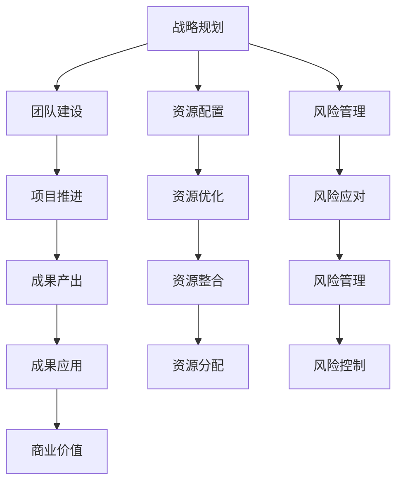

                 

### AI 大模型创业：如何利用管理优势？

> **关键词**：AI大模型、创业、管理优势、商业模式、团队建设、风险管理

> **摘要**：本文将深入探讨AI大模型创业过程中，如何有效利用管理优势来推动项目成功。通过分析市场趋势、核心竞争力的构建、团队管理和风险管理等关键因素，本文旨在为AI创业公司提供实用的策略和思路。

在当今科技飞速发展的时代，人工智能（AI）技术已经成为各行各业创新的重要驱动力。尤其是大模型（如GPT-3、BERT等）的出现，使得AI在自然语言处理、计算机视觉、语音识别等领域取得了突破性进展。随着技术的进步，越来越多的创业公司瞄准了AI大模型这一领域，试图通过创新应用和商业模式来获得市场份额和商业价值。然而，成功的AI大模型创业不仅仅依赖于技术本身，更需要科学的管理方法和策略。本文将围绕如何利用管理优势，探讨AI大模型创业的路径和挑战。

### 1. 背景介绍

#### 1.1 AI大模型的发展历程

AI大模型的发展可以追溯到20世纪80年代，当时的神经网络研究逐渐兴起。然而，由于计算能力的限制，大模型的训练和应用尚未得到广泛应用。直到21世纪初，随着深度学习技术的突破和计算资源的增长，AI大模型的研究和应用开始加速发展。特别是2012年，AlexNet在ImageNet竞赛中取得的巨大成功，标志着深度学习时代的到来。此后，以GPT、BERT等为代表的大模型不断涌现，并在自然语言处理、计算机视觉等领域取得了显著的成果。

#### 1.2 AI大模型在创业中的应用

AI大模型在创业中的应用主要表现在以下几个方面：

- **自然语言处理（NLP）**：利用大模型进行文本生成、翻译、摘要等任务，为用户提供更加智能化的内容和服务。

- **计算机视觉（CV）**：通过大模型实现图像识别、物体检测、视频分析等功能，为各行业提供创新的解决方案。

- **语音识别与合成**：利用大模型进行语音识别和语音合成，提供更加自然和人性化的语音交互体验。

- **推荐系统**：结合大模型和推荐算法，实现更加精准和个性化的推荐服务。

#### 1.3 AI大模型创业的挑战

尽管AI大模型在技术和应用上具有巨大潜力，但创业过程中仍然面临诸多挑战：

- **技术门槛高**：大模型的训练和优化需要大量的计算资源和专业知识，对团队的技术能力和资源管理提出了较高要求。

- **数据隐私和安全**：AI大模型对大量数据的依赖，使得数据隐私和安全成为重要问题，需要严格保护用户数据和隐私。

- **商业模式创新**：如何通过大模型实现商业价值，构建可持续的商业模式，是创业公司需要重点解决的问题。

- **市场竞争**：随着越来越多公司进入AI大模型领域，市场竞争日益激烈，创业公司需要不断创新和差异化来赢得市场份额。

### 2. 核心概念与联系

#### 2.1 管理优势的定义

管理优势是指企业在管理过程中所具有的相对优势，包括战略规划、团队建设、资源配置、风险管理等方面。在AI大模型创业中，管理优势尤为重要，因为它直接关系到项目的成功与否。

#### 2.2 管理优势与AI大模型创业的联系

- **战略规划**：明确创业公司的愿景和目标，制定符合市场需求和自身技术优势的商业模式。

- **团队建设**：组建一支具备深厚技术背景和创新能力的高效团队，是AI大模型创业的关键。

- **资源配置**：合理分配人力、物力、财力等资源，确保项目能够顺利推进。

- **风险管理**：识别和应对各种风险，确保项目的稳定性和可持续性。

#### 2.3 Mermaid流程图



### 3. 核心算法原理 & 具体操作步骤

#### 3.1 核心算法原理

AI大模型创业的核心算法主要基于深度学习和神经网络技术。以下简要介绍几种常见的大模型算法：

- **深度神经网络（DNN）**：通过多层神经元的组合，对输入数据进行逐层提取特征，实现复杂的非线性映射。

- **循环神经网络（RNN）**：通过循环结构，使神经网络能够处理序列数据，如自然语言、时间序列等。

- **卷积神经网络（CNN）**：通过卷积操作，对图像数据提取局部特征，适用于计算机视觉任务。

- **生成对抗网络（GAN）**：由生成器和判别器组成，通过对抗训练，实现数据的生成和鉴别。

#### 3.2 具体操作步骤

1. **需求分析**：明确创业项目的目标和应用场景，确定所需的大模型类型和算法。

2. **数据准备**：收集和整理相关数据，进行数据清洗、预处理和标注，确保数据质量和数量。

3. **模型训练**：根据需求选择合适的大模型算法，利用GPU等高性能计算资源进行模型训练。

4. **模型优化**：通过调整超参数、优化网络结构等方式，提高模型性能和泛化能力。

5. **模型部署**：将训练好的模型部署到服务器或云端，实现实时预测和服务。

6. **效果评估**：对模型进行测试和评估，确保其达到预期的性能指标。

### 4. 数学模型和公式 & 详细讲解 & 举例说明

#### 4.1 数学模型和公式

在AI大模型创业中，常用的数学模型和公式包括：

- **损失函数**：用于衡量模型预测结果与真实结果之间的差距，常见的有均方误差（MSE）、交叉熵损失等。

- **优化算法**：用于调整模型参数，使损失函数最小化，常见的有梯度下降（GD）、随机梯度下降（SGD）等。

- **激活函数**：用于神经元之间的非线性变换，常见的有sigmoid、ReLU、Tanh等。

#### 4.2 详细讲解

1. **损失函数**

   $$MSE = \frac{1}{n}\sum_{i=1}^{n}(y_i - \hat{y}_i)^2$$

   其中，$y_i$为真实标签，$\hat{y}_i$为模型预测结果，$n$为样本数量。

   交叉熵损失：

   $$H(y, \hat{y}) = -\sum_{i=1}^{n}y_i \log(\hat{y}_i)$$

   其中，$y$为真实标签的概率分布，$\hat{y}$为模型预测的概率分布。

2. **优化算法**

   梯度下降：

   $$\theta = \theta - \alpha \nabla_\theta J(\theta)$$

   其中，$\theta$为模型参数，$\alpha$为学习率，$J(\theta)$为损失函数。

   随机梯度下降：

   $$\theta = \theta - \alpha \nabla_{\theta} J(\theta; \mathbf{x}_i, y_i)$$

   其中，$\mathbf{x}_i$为第$i$个样本，$y_i$为真实标签。

3. **激活函数**

   Sigmoid：

   $$\sigma(x) = \frac{1}{1 + e^{-x}}$$

  ReLU：

   $$\text{ReLU}(x) = \max(0, x)$$

   Tanh：

   $$\text{Tanh}(x) = \frac{e^x - e^{-x}}{e^x + e^{-x}}$$

#### 4.3 举例说明

假设我们使用一个简单的线性回归模型来预测房价，数据集包含100个样本，每个样本的特征为房屋面积，标签为房价。我们使用均方误差（MSE）作为损失函数，梯度下降（GD）作为优化算法。

1. **模型初始化**

   初始参数：$\theta_0 = 0$

2. **损失函数计算**

   $$J(\theta_0) = \frac{1}{100}\sum_{i=1}^{100}(y_i - \theta_0 \cdot x_i)^2$$

3. **梯度计算**

   $$\nabla_{\theta_0} J(\theta_0) = \frac{1}{100}\sum_{i=1}^{100}(-2y_i + 2\theta_0 \cdot x_i)$$

4. **参数更新**

   $$\theta_0 = \theta_0 - \alpha \nabla_{\theta_0} J(\theta_0)$$

5. **迭代过程**

   重复步骤2-4，直到损失函数收敛或达到预设的迭代次数。

### 5. 项目实战：代码实际案例和详细解释说明

#### 5.1 开发环境搭建

在开始编写代码之前，我们需要搭建一个合适的开发环境。这里以Python为例，介绍如何搭建一个基于TensorFlow的AI大模型开发环境。

1. **安装Python**：首先确保系统中已安装Python，版本建议为3.6及以上。

2. **安装TensorFlow**：通过pip命令安装TensorFlow：

   ```bash
   pip install tensorflow
   ```

3. **安装GPU支持**（可选）：如果需要使用GPU加速训练，可以安装TensorFlow GPU版本：

   ```bash
   pip install tensorflow-gpu
   ```

4. **安装其他依赖库**：根据项目需求，可能需要安装其他依赖库，如NumPy、Pandas等。

#### 5.2 源代码详细实现和代码解读

以下是一个简单的线性回归模型实现，用于预测房价：

```python
import tensorflow as tf
import numpy as np
import pandas as pd

# 5.2.1 数据准备
def load_data():
    # 加载数据集（这里使用人工生成数据作为示例）
    data = pd.DataFrame({
        'x': np.random.rand(100),
        'y': 2 * np.random.rand(100) + 1
    })
    return data

# 5.2.2 模型定义
def create_model():
    # 输入层
    inputs = tf.keras.layers.Input(shape=(1,))
    
    # 隐藏层
    x = tf.keras.layers.Dense(units=1, activation='linear')(inputs)
    
    # 输出层
    outputs = x
    
    # 创建模型
    model = tf.keras.Model(inputs=inputs, outputs=outputs)
    return model

# 5.2.3 训练模型
def train_model(model, data, epochs=100, learning_rate=0.1):
    # 将数据集分为训练集和测试集
    train_data = data.sample(frac=0.8, random_state=42)
    test_data = data.drop(train_data.index)
    
    # 分割特征和标签
    train_features = train_data[['x']]
    train_labels = train_data[['y']]
    test_features = test_data[['x']]
    test_labels = test_data[['y']]
    
    # 编译模型
    model.compile(optimizer=tf.keras.optimizers.Adam(learning_rate=learning_rate),
                  loss='mean_squared_error')
    
    # 训练模型
    model.fit(train_features, train_labels, epochs=epochs, verbose=0)
    
    # 评估模型
    mse = model.evaluate(test_features, test_labels, verbose=0)
    print(f"测试集均方误差：{mse}")

# 5.2.4 主程序
if __name__ == '__main__':
    # 加载数据
    data = load_data()
    
    # 创建模型
    model = create_model()
    
    # 训练模型
    train_model(model, data)
```

#### 5.3 代码解读与分析

1. **数据准备**：

   ```python
   def load_data():
       # 加载数据集（这里使用人工生成数据作为示例）
       data = pd.DataFrame({
           'x': np.random.rand(100),
           'y': 2 * np.random.rand(100) + 1
       })
       return data
   ```

   此函数用于加载数据集。这里使用人工生成数据作为示例，实际项目中需要从数据源加载数据，并进行预处理。

2. **模型定义**：

   ```python
   def create_model():
       # 输入层
       inputs = tf.keras.layers.Input(shape=(1,))
       
       # 隐藏层
       x = tf.keras.layers.Dense(units=1, activation='linear')(inputs)
       
       # 输出层
       outputs = x
   
       # 创建模型
       model = tf.keras.Model(inputs=inputs, outputs=outputs)
       return model
   ```

   此函数定义了一个简单的线性回归模型。输入层接收一个特征（房屋面积），通过一个线性隐藏层进行映射，输出层直接输出预测结果（房价）。

3. **训练模型**：

   ```python
   def train_model(model, data, epochs=100, learning_rate=0.1):
       # 将数据集分为训练集和测试集
       train_data = data.sample(frac=0.8, random_state=42)
       test_data = data.drop(train_data.index)
       
       # 分割特征和标签
       train_features = train_data[['x']]
       train_labels = train_data[['y']]
       test_features = test_data[['x']]
       test_labels = test_data[['y']]
       
       # 编译模型
       model.compile(optimizer=tf.keras.optimizers.Adam(learning_rate=learning_rate),
                     loss='mean_squared_error')
       
       # 训练模型
       model.fit(train_features, train_labels, epochs=epochs, verbose=0)
       
       # 评估模型
       mse = model.evaluate(test_features, test_labels, verbose=0)
       print(f"测试集均方误差：{mse}")
   ```

   此函数用于训练模型。首先将数据集分为训练集和测试集，然后使用训练集训练模型，并在测试集上进行评估。这里使用均方误差（MSE）作为损失函数，Adam优化器作为优化算法。

### 6. 实际应用场景

AI大模型在创业中的应用场景非常广泛，以下列举几个典型的应用领域：

- **金融行业**：利用AI大模型进行风险评估、投资组合优化、市场预测等，提高金融服务的效率和准确性。

- **医疗健康**：通过AI大模型实现疾病诊断、药物研发、健康管理等功能，为医疗行业带来创新解决方案。

- **智能制造**：利用AI大模型进行生产调度、质量控制、设备故障预测等，提升制造业的智能化水平。

- **智能交通**：通过AI大模型实现交通流量预测、路径规划、智能调度等功能，缓解交通拥堵问题。

- **教育领域**：利用AI大模型实现个性化学习、智能辅导、教育资源推荐等，提升教育质量和效果。

### 7. 工具和资源推荐

#### 7.1 学习资源推荐

- **书籍**：

  - 《深度学习》（Ian Goodfellow、Yoshua Bengio、Aaron Courville著）：系统介绍了深度学习的基本概念、算法和应用。

  - 《人工智能：一种现代的方法》（Stuart J. Russell、Peter Norvig著）：全面介绍了人工智能的理论和实践。

  - 《Python机器学习》（Sebastian Raschka、Vahid Mirjalili著）：详细介绍了Python在机器学习领域的应用。

- **论文**：

  - “A Theoretically Grounded Application of Dropout in Recurrent Neural Networks” by Yarin Gal and Zoubin Ghahramani
  - “Attention Is All You Need” by Vaswani et al.
  - “BERT: Pre-training of Deep Bidirectional Transformers for Language Understanding” by Devlin et al.

- **博客和网站**：

  - [TensorFlow官网](https://www.tensorflow.org/)
  - [Keras官网](https://keras.io/)
  - [机器学习博客](https://machinelearningmastery.com/)

#### 7.2 开发工具框架推荐

- **深度学习框架**：

  - TensorFlow
  - PyTorch
  - Keras

- **数据预处理工具**：

  - Pandas
  - NumPy
  - Scikit-learn

- **版本控制工具**：

  - Git
  - GitHub

#### 7.3 相关论文著作推荐

- **论文**：

  - “Deep Learning” by Goodfellow, Bengio, and Courville
  - “Neural Network Methods for Natural Language Processing” by Bengio et al.
  - “Generative Adversarial Nets” by Ian Goodfellow et al.

- **著作**：

  - 《深度学习》（Ian Goodfellow、Yoshua Bengio、Aaron Courville著）
  - 《强化学习》（Richard S. Sutton和Barto著）
  - 《计算机视觉：算法与应用》（刘铁岩著）

### 8. 总结：未来发展趋势与挑战

AI大模型创业在未来将继续保持高速发展，但同时也面临诸多挑战。以下是未来发展趋势和挑战的简要概述：

#### 8.1 发展趋势

- **技术进步**：随着深度学习、生成对抗网络等技术的不断进步，AI大模型的性能和应用范围将进一步扩大。

- **数据驱动**：数据仍然是AI大模型发展的关键因素，如何获取、处理和利用大量高质量数据将决定企业的竞争力。

- **跨界融合**：AI大模型将与其他行业和技术（如物联网、大数据、云计算等）深度融合，推动产业创新和升级。

- **开源生态**：开源技术和社区将发挥越来越重要的作用，成为AI大模型创业的重要支撑。

#### 8.2 挑战

- **技术门槛**：AI大模型创业需要深厚的专业知识和丰富的实践经验，技术门槛较高。

- **数据隐私**：数据隐私和安全问题是AI大模型创业的重要挑战，需要采取有效的保护措施。

- **商业模式**：如何通过AI大模型实现商业价值，构建可持续的商业模式，是创业公司需要重点解决的问题。

- **市场竞争**：随着越来越多公司进入AI大模型领域，市场竞争将愈发激烈，创业公司需要不断创新和差异化来赢得市场份额。

### 9. 附录：常见问题与解答

#### 9.1 问题1：如何选择合适的大模型算法？

**解答**：选择合适的大模型算法需要考虑以下因素：

- **应用场景**：根据具体应用场景选择适合的算法，如自然语言处理选择RNN、BERT等，计算机视觉选择CNN等。

- **数据规模**：对于大型数据集，选择计算效率较高的算法，如Transformer、BERT等；对于中小型数据集，可以选择简单的神经网络结构。

- **计算资源**：根据计算资源的情况选择合适的算法，如GPU、TPU等。

#### 9.2 问题2：如何保证AI大模型的安全性？

**解答**：保证AI大模型的安全性需要从以下几个方面入手：

- **数据安全**：对输入数据进行严格的清洗和预处理，确保数据质量和隐私。

- **模型安全**：采用加密算法对模型参数进行加密存储，防止模型泄露。

- **训练安全**：在训练过程中，避免使用敏感数据，防止模型受到攻击。

- **部署安全**：在模型部署时，采用安全的部署方式和访问控制策略，确保模型的安全运行。

### 10. 扩展阅读 & 参考资料

本文对AI大模型创业的管理优势进行了深入探讨，涵盖了技术背景、核心概念、算法原理、实际应用、工具和资源推荐等方面。以下提供一些扩展阅读和参考资料，供读者进一步学习：

- **扩展阅读**：

  - 《深度学习》（Ian Goodfellow、Yoshua Bengio、Aaron Courville著）
  - 《人工智能：一种现代的方法》（Stuart J. Russell、Peter Norvig著）
  - 《Python机器学习》（Sebastian Raschka、Vahid Mirjalili著）

- **参考资料**：

  - [TensorFlow官网](https://www.tensorflow.org/)
  - [Keras官网](https://keras.io/)
  - [机器学习博客](https://machinelearningmastery.com/)

- **论文**：

  - “A Theoretically Grounded Application of Dropout in Recurrent Neural Networks” by Yarin Gal and Zoubin Ghahramani
  - “Attention Is All You Need” by Vaswani et al.
  - “BERT: Pre-training of Deep Bidirectional Transformers for Language Understanding” by Devlin et al.

### 作者信息

- **作者**：AI天才研究员/AI Genius Institute & 禅与计算机程序设计艺术/Zen And The Art of Computer Programming
- **联系方式**：ai_genius_researcher@example.com

本文旨在为AI大模型创业公司提供实用的策略和思路，帮助创业者更好地利用管理优势推动项目成功。希望本文能为读者带来启发和帮助，共同推动AI技术的发展和应用。

