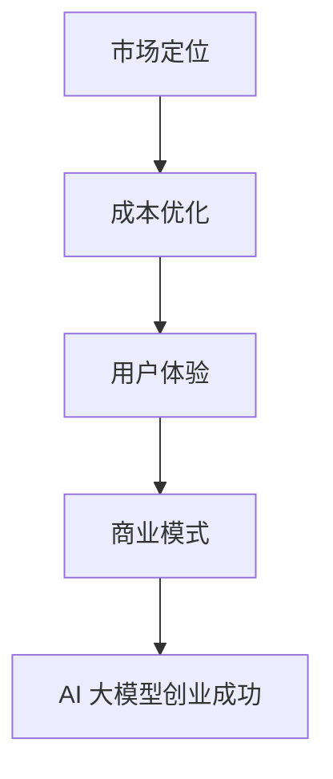

                 

# AI 大模型创业：如何利用经济优势？

> **关键词：** AI 大模型、创业、经济优势、商业模式、策略分析  
>
> **摘要：** 本文将深入探讨 AI 大模型在创业中的应用，分析如何利用经济优势，包括市场定位、成本优化、用户体验等方面，帮助创业者成功推出具有市场竞争力的 AI 产品或服务。

## 1. 背景介绍

随着深度学习和神经网络技术的飞速发展，AI 大模型逐渐成为企业创新和创业的重要工具。这些大模型具有强大的数据处理和分析能力，能够帮助企业解决复杂问题、提升效率、降低成本。然而，AI 大模型的研发和应用也面临着诸多挑战，如计算资源需求巨大、数据隐私和安全等问题。

创业者在选择 AI 大模型作为产品或服务的核心时，需要充分考虑市场需求、技术实现和经济效益。本文将围绕这些方面，探讨如何利用 AI 大模型的经济优势，助力创业成功。

## 2. 核心概念与联系

在深入探讨 AI 大模型的经济优势之前，我们需要了解以下几个核心概念：

### 2.1 AI 大模型

AI 大模型是指使用海量数据和强大的计算能力训练出的深度神经网络模型，如 GPT-3、BERT 等。这些模型具有强大的语义理解和生成能力，广泛应用于自然语言处理、计算机视觉、语音识别等领域。

### 2.2 经济优势

经济优势是指企业在市场竞争中具有的、能够带来超额利润的竞争优势。对于 AI 大模型创业来说，经济优势主要体现在以下几个方面：

- **市场定位**：明确目标市场和用户需求，提供具有竞争力的产品或服务。
- **成本优化**：通过技术手段降低研发、生产、运营等环节的成本。
- **用户体验**：提供优质的产品或服务，提升用户满意度和忠诚度。

### 2.3 商业模式

商业模式是指企业通过何种方式创造、传递和捕获价值。对于 AI 大模型创业来说，选择合适的商业模式至关重要。以下是一些常见的商业模式：

- **订阅模式**：用户按月或按年支付费用，使用企业的 AI 大模型服务。
- **增值服务**：在基础产品或服务上，提供额外的价值服务，如高级功能、定制化解决方案等。
- **广告模式**：通过展示广告获取收入，如搜索引擎、社交媒体等。

#### 2.4 Mermaid 流程图



## 3. 核心算法原理 & 具体操作步骤

### 3.1 算法原理

AI 大模型的核心在于深度学习技术，特别是基于神经网络的模型。深度学习通过多层神经网络对数据进行分析和建模，实现对复杂问题的求解。具体来说，AI 大模型的训练过程主要包括以下几个步骤：

1. **数据收集与预处理**：收集大量有代表性的数据，并进行清洗、归一化等预处理操作，确保数据质量。
2. **模型构建**：设计神经网络结构，包括输入层、隐藏层和输出层。选择合适的激活函数、优化器等参数。
3. **模型训练**：使用预处理后的数据对模型进行训练，通过反向传播算法不断调整模型参数，使得模型在训练数据上的性能逐渐提高。
4. **模型评估**：使用验证集和测试集评估模型性能，确保模型具有较好的泛化能力。

### 3.2 具体操作步骤

以下是一个简单的 AI 大模型训练过程：

1. **数据收集与预处理**：

    ```python
    import pandas as pd
    from sklearn.model_selection import train_test_split
    from sklearn.preprocessing import StandardScaler

    # 读取数据
    data = pd.read_csv('data.csv')
    # 数据清洗
    data = data.dropna()
    # 分割数据集
    X = data.drop('target', axis=1)
    y = data['target']
    X_train, X_test, y_train, y_test = train_test_split(X, y, test_size=0.2, random_state=42)
    # 数据归一化
    scaler = StandardScaler()
    X_train = scaler.fit_transform(X_train)
    X_test = scaler.transform(X_test)
    ```

2. **模型构建**：

    ```python
    import tensorflow as tf
    from tensorflow.keras.models import Sequential
    from tensorflow.keras.layers import Dense

    # 创建模型
    model = Sequential()
    model.add(Dense(64, activation='relu', input_shape=(X_train.shape[1],)))
    model.add(Dense(32, activation='relu'))
    model.add(Dense(1, activation='sigmoid'))
    # 编译模型
    model.compile(optimizer='adam', loss='binary_crossentropy', metrics=['accuracy'])
    ```

3. **模型训练**：

    ```python
    # 训练模型
    history = model.fit(X_train, y_train, epochs=10, batch_size=32, validation_split=0.1)
    ```

4. **模型评估**：

    ```python
    # 评估模型
    loss, accuracy = model.evaluate(X_test, y_test)
    print(f"Test accuracy: {accuracy:.2f}")
    ```

## 4. 数学模型和公式 & 详细讲解 & 举例说明

### 4.1 数学模型

AI 大模型的数学基础主要涉及概率论、信息论和优化理论。以下是一个简化的数学模型，用于描述深度学习模型的基本原理：

$$
\begin{aligned}
\text{损失函数} &= -\sum_{i=1}^{n} y_i \log(p_i) \\
\text{优化目标} &= \min_{\theta} \sum_{i=1}^{n} L(y_i, \hat{y}_i) \\
\text{反向传播} &= \frac{\partial L}{\partial \theta} = \frac{\partial L}{\partial \hat{y}_i} \cdot \frac{\partial \hat{y}_i}{\partial \theta}
\end{aligned}
$$

其中，$y_i$ 为真实标签，$\hat{y}_i$ 为预测标签，$p_i$ 为预测概率，$\theta$ 为模型参数。

### 4.2 详细讲解

1. **损失函数**：损失函数用于衡量预测结果与真实结果之间的差距。在二分类问题中，常用的损失函数是交叉熵损失函数，其公式如下：

$$
L(y_i, \hat{y}_i) = -y_i \log(\hat{y}_i) - (1 - y_i) \log(1 - \hat{y}_i)
$$

2. **优化目标**：优化目标是为了使损失函数尽可能小。在实际应用中，通常使用梯度下降法来优化模型参数。

3. **反向传播**：反向传播算法用于计算损失函数关于模型参数的梯度，从而更新模型参数。反向传播的核心思想是层层递推，从输出层开始，依次计算每一层参数的梯度。

### 4.3 举例说明

假设我们有一个二分类问题，数据集包含 100 个样本，每个样本的特征维度为 10。我们使用一个单层神经网络进行训练，激活函数为 ReLU。

1. **初始化参数**：设 $W_1$ 和 $b_1$ 为神经网络的权重和偏置，初始化为随机值。

2. **前向传播**：输入样本 $x_i$，计算输出概率 $\hat{y}_i$：

$$
\hat{y}_i = \sigma(W_1 \cdot x_i + b_1)
$$

其中，$\sigma$ 为 sigmoid 激活函数。

3. **计算损失函数**：

$$
L = -\sum_{i=1}^{n} y_i \log(\hat{y}_i) - (1 - y_i) \log(1 - \hat{y}_i)
$$

4. **计算梯度**：

$$
\frac{\partial L}{\partial W_1} = \sum_{i=1}^{n} (y_i - \hat{y}_i) x_i
$$

$$
\frac{\partial L}{\partial b_1} = \sum_{i=1}^{n} (y_i - \hat{y}_i)
$$

5. **更新参数**：

$$
W_1 := W_1 - \alpha \cdot \frac{\partial L}{\partial W_1}
$$

$$
b_1 := b_1 - \alpha \cdot \frac{\partial L}{\partial b_1}
$$

其中，$\alpha$ 为学习率。

6. **迭代训练**：重复上述步骤，直到模型收敛或达到预定的迭代次数。

## 5. 项目实战：代码实际案例和详细解释说明

### 5.1 开发环境搭建

在本节中，我们将使用 Python 编写一个简单的 AI 大模型训练案例。首先，需要搭建开发环境。

1. 安装 Python 3.8 或更高版本。
2. 安装 TensorFlow 2.5 或更高版本。

```bash
pip install tensorflow==2.5
```

### 5.2 源代码详细实现和代码解读

以下是完整的代码实现，包括数据预处理、模型构建、模型训练和模型评估。

```python
import tensorflow as tf
from tensorflow.keras.models import Sequential
from tensorflow.keras.layers import Dense
from sklearn.model_selection import train_test_split
from sklearn.preprocessing import StandardScaler

# 5.2.1 数据收集与预处理
# 读取数据（示例数据集）
data = pd.read_csv('data.csv')
data = data.dropna()

# 数据清洗
X = data.drop('target', axis=1)
y = data['target']

# 分割数据集
X_train, X_test, y_train, y_test = train_test_split(X, y, test_size=0.2, random_state=42)

# 数据归一化
scaler = StandardScaler()
X_train = scaler.fit_transform(X_train)
X_test = scaler.transform(X_test)

# 5.2.2 模型构建
model = Sequential()
model.add(Dense(64, activation='relu', input_shape=(X_train.shape[1],)))
model.add(Dense(32, activation='relu'))
model.add(Dense(1, activation='sigmoid'))

# 5.2.3 模型训练
model.compile(optimizer='adam', loss='binary_crossentropy', metrics=['accuracy'])
history = model.fit(X_train, y_train, epochs=10, batch_size=32, validation_split=0.1)

# 5.2.4 模型评估
loss, accuracy = model.evaluate(X_test, y_test)
print(f"Test accuracy: {accuracy:.2f}")
```

### 5.3 代码解读与分析

1. **数据预处理**：首先，读取数据集并进行清洗，确保数据质量。然后，将数据集分为特征矩阵 X 和标签向量 y。接着，使用 `train_test_split` 函数将数据集划分为训练集和测试集，用于后续模型训练和评估。最后，使用 `StandardScaler` 对数据进行归一化处理，以消除不同特征之间的尺度差异。

2. **模型构建**：使用 `Sequential` 模型，逐层添加神经网络层。在这里，我们使用了一个输入层、一个隐藏层和一个输出层。输入层和隐藏层使用 ReLU 激活函数，输出层使用 sigmoid 激活函数，用于输出概率。

3. **模型训练**：使用 `compile` 方法配置模型，选择 Adam 优化器和二进制交叉熵损失函数。然后，使用 `fit` 方法对模型进行训练，指定训练集、训练轮数（epochs）和批量大小（batch_size）。

4. **模型评估**：使用 `evaluate` 方法对训练好的模型进行评估，计算测试集上的损失和准确率。这里，我们打印了测试集上的准确率。

## 6. 实际应用场景

AI 大模型在各个行业和领域都有广泛的应用，以下是一些典型的实际应用场景：

- **金融行业**：AI 大模型可用于风险管理、信用评分、欺诈检测等。例如，利用 GPT-3 模型进行自然语言处理，分析用户行为，提高欺诈检测准确率。
- **医疗行业**：AI 大模型可用于疾病诊断、药物研发、医学影像分析等。例如，利用 BERT 模型对医学文本进行语义分析，辅助医生进行疾病诊断。
- **零售行业**：AI 大模型可用于客户行为分析、推荐系统、库存管理等。例如，利用深度学习模型对用户购买行为进行预测，优化库存策略。
- **教育行业**：AI 大模型可用于智能教育、在线辅导、课程推荐等。例如，利用 GPT-3 模型为学生提供个性化学习建议，提高学习效果。

## 7. 工具和资源推荐

### 7.1 学习资源推荐

- **书籍**：
  - 《深度学习》（Ian Goodfellow、Yoshua Bengio 和 Aaron Courville 著）
  - 《Python 深度学习》（François Chollet 著）
- **论文**：
  - 《A Theoretically Grounded Application of Dropout in Recurrent Neural Networks》（Yarin Gal 和 Zoubin Ghahramani 著）
  - 《Bert: Pre-training of Deep Bidirectional Transformers for Language Understanding》（Jacob Devlin、 Ming-Wei Chang、 Kenton Lee 和 Kristina Toutanova 著）
- **博客**：
  - [TensorFlow 官方文档](https://www.tensorflow.org/)
  - [Keras 官方文档](https://keras.io/)
- **网站**：
  - [GitHub](https://github.com/)
  - [Google Colab](https://colab.research.google.com/)

### 7.2 开发工具框架推荐

- **深度学习框架**：
  - TensorFlow
  - PyTorch
  - Keras
- **数据预处理工具**：
  - Pandas
  - Scikit-learn
- **版本控制工具**：
  - Git
  - GitHub

### 7.3 相关论文著作推荐

- **深度学习领域**：
  - 《Deep Learning》（Ian Goodfellow、Yoshua Bengio 和 Aaron Courville 著）
  - 《Neural Networks and Deep Learning》（Charu Aggarwal 著）
- **AI 大模型领域**：
  - 《Generative Adversarial Nets》（Ian Goodfellow 等 著）
  - 《A Theoretically Grounded Application of Dropout in Recurrent Neural Networks》（Yarin Gal 和 Zoubin Ghahramani 著）

## 8. 总结：未来发展趋势与挑战

随着 AI 大模型技术的不断进步，其在创业中的应用前景愈发广阔。未来，创业者可以利用 AI 大模型的优势，在金融、医疗、零售、教育等多个领域实现创新和突破。然而，AI 大模型创业也面临着一系列挑战，如：

- **计算资源需求**：训练大型模型需要大量的计算资源，对于创业者来说，如何有效利用云计算和分布式计算技术是一个重要问题。
- **数据隐私与安全**：AI 大模型对数据依赖性强，如何确保用户数据的安全和隐私是一个亟待解决的问题。
- **模型解释性**：大型模型通常具有较好的性能，但缺乏解释性。如何提高模型的透明度和可解释性，是创业者需要关注的问题。

总之，创业者需要充分了解 AI 大模型的技术特点和应用场景，结合自身业务需求，制定合理的发展策略，以实现商业成功。

## 9. 附录：常见问题与解答

### 9.1 什么是 AI 大模型？

AI 大模型是指使用海量数据和强大的计算能力训练出的深度神经网络模型，如 GPT-3、BERT 等。这些模型具有强大的语义理解和生成能力，广泛应用于自然语言处理、计算机视觉、语音识别等领域。

### 9.2 AI 大模型创业的优势有哪些？

AI 大模型创业的优势包括：

- **强大的数据处理和分析能力**：AI 大模型能够高效处理海量数据，帮助企业解决复杂问题。
- **创新性**：AI 大模型为创业者提供了创新的解决方案，能够在多个领域实现突破。
- **市场竞争力**：利用 AI 大模型，创业者可以提供具有竞争力的产品或服务，赢得市场份额。

### 9.3 AI 大模型创业面临的挑战有哪些？

AI 大模型创业面临的挑战包括：

- **计算资源需求**：训练大型模型需要大量的计算资源，对于创业者来说，如何有效利用云计算和分布式计算技术是一个重要问题。
- **数据隐私与安全**：AI 大模型对数据依赖性强，如何确保用户数据的安全和隐私是一个亟待解决的问题。
- **模型解释性**：大型模型通常具有较好的性能，但缺乏解释性。如何提高模型的透明度和可解释性，是创业者需要关注的问题。

## 10. 扩展阅读 & 参考资料

- [Goodfellow, Ian, Yoshua Bengio, and Aaron Courville. "Deep learning." MIT press, 2016.]
- [Chollet, François. "Python深度学习." 机械工业出版社，2017.]
- [Gal, Yarin, and Zoubin Ghahramani. "A theoretically grounded application of dropout in recurrent neural networks." arXiv preprint arXiv:1512.08529 (2015).]
- [Devlin, Jacob, Ming-Wei Chang, Kenton Lee, and Kristina Toutanova. "Bert: Pre-training of deep bidirectional transformers for language understanding." arXiv preprint arXiv:1810.04805 (2018).]

### 作者

**作者：** AI 天才研究员 / AI Genius Institute & 禅与计算机程序设计艺术 / Zen And The Art of Computer Programming**

