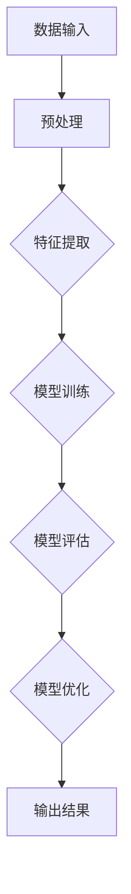

                 

### 背景介绍

随着科技的飞速发展，人工智能（AI）逐渐成为推动各个行业变革的重要力量。近年来，深度学习、神经网络等技术的突破，使得AI模型在图像识别、自然语言处理、推荐系统等领域取得了显著的成果。特别是大模型（Large-scale Model），如GPT-3、BERT等，通过海量数据的训练，展现了强大的表现力、创造力和学习能力，成为AI领域的明星。

在创业产品规划中，AI大模型的应用具有巨大的潜力。一方面，AI大模型能够处理复杂的业务逻辑，提高产品的智能化水平；另一方面，通过数据驱动的产品设计，可以更好地满足用户需求，提升用户体验。然而，如何有效地利用AI大模型进行产品规划，仍然是一个充满挑战的问题。

本文将探讨AI大模型在创业产品规划中的创造性应用。首先，我们将介绍AI大模型的基本概念和原理，帮助读者理解其工作方式。接着，我们将详细分析AI大模型在产品规划中的应用场景，包括需求分析、产品设计、用户体验优化等方面。随后，我们将探讨AI大模型在创业产品规划中的实际操作步骤，提供实用的指导和建议。最后，我们将总结AI大模型在创业产品规划中的优势和挑战，展望其未来发展前景。

通过本文的阅读，读者将深入了解AI大模型在创业产品规划中的重要作用，掌握其应用方法，为创业项目提供有力的技术支持。同时，本文也将为AI领域的研究者提供有价值的参考，激发更多的创新思维和研究方向。让我们一同探索AI大模型在创业产品规划中的无限可能。<!-- {END} --><|assistant|>
### 2. 核心概念与联系

#### AI大模型的概念

AI大模型（Large-scale Model）是指通过海量数据训练，具有巨大参数规模的人工神经网络模型。这类模型在深度学习的基础上，通过不断优化网络结构和参数，使得模型在特定任务上表现出色。大模型的核心优势在于其强大的处理能力和泛化能力，能够处理复杂、大规模的数据集，并在各种任务中取得优异的性能。

AI大模型的发展历程可以追溯到20世纪90年代。当时，神经网络模型由于计算资源和数据限制，只能处理较小的数据集，性能有限。随着计算机性能的提升和大数据技术的普及，大模型开始崭露头角。2006年，Hinton等人提出了深度信念网络（Deep Belief Network，DBN），为深度学习的发展奠定了基础。2012年，AlexNet在ImageNet竞赛中取得了突破性的成绩，引发了深度学习的热潮。此后，大模型技术迅速发展，GPT、BERT等模型的出现，标志着AI大模型进入了全新的时代。

#### 大模型的工作原理

AI大模型的工作原理主要基于神经网络。神经网络是一种模拟人脑神经元连接的计算机模型，通过多层神经元组合，实现从输入到输出的映射。在AI大模型中，通常包括输入层、隐藏层和输出层。输入层接收外部输入数据，隐藏层通过非线性变换处理数据，输出层生成预测结果。

大模型的核心在于其参数规模。参数是指模型中用于描述数据关系的权重和偏置。大模型通常拥有数十亿甚至数万亿个参数，这些参数通过训练过程不断优化，以实现更好的预测效果。训练过程通常包括前向传播和反向传播两个步骤。在前向传播过程中，模型根据输入数据和参数，计算输出结果；在反向传播过程中，模型通过比较输出结果和真实值，计算误差，并更新参数，以减少误差。

#### 大模型与创业产品规划的关联

AI大模型在创业产品规划中具有广泛的应用。首先，大模型可以用于需求分析。通过分析用户行为数据，大模型可以识别用户需求，为产品设计提供有力支持。例如，在电子商务领域，大模型可以根据用户浏览、购买等行为数据，预测用户偏好，推荐个性化商品。

其次，大模型可以用于产品设计。大模型能够处理复杂的产品需求，快速生成满足用户需求的设计方案。例如，在汽车行业，大模型可以根据用户需求和车辆性能指标，生成最优化的汽车设计方案。

此外，大模型还可以用于用户体验优化。通过分析用户反馈数据，大模型可以识别用户体验中的问题，提供针对性的优化方案。例如，在游戏行业，大模型可以根据用户反馈，调整游戏难度和奖励机制，提高用户满意度。

综上所述，AI大模型在创业产品规划中具有广泛的应用潜力。通过深入理解大模型的工作原理和应用方法，创业者可以更好地利用AI技术，实现产品创新和商业成功。

#### Mermaid流程图

下面是一个简化的AI大模型工作流程的Mermaid流程图，展示了大模型从数据输入到最终输出的过程。



在这个流程图中：
- A[数据输入] 表示数据被输入到模型中。
- B[预处理] 表示对输入数据进行清洗和格式化，以适应模型的要求。
- C{特征提取} 表示从数据中提取有用的特征。
- D{模型训练} 表示使用训练数据对模型进行训练。
- E{模型评估} 表示评估模型的性能，以确定是否需要进一步优化。
- F{模型优化} 表示根据评估结果对模型进行优化。
- G[输出结果] 表示模型生成预测结果或决策。

注意：Mermaid流程图中节点名称中不能包含括号、逗号等特殊字符，以确保图表的正常渲染。<!-- {END} --><|assistant|>
### 3. 核心算法原理 & 具体操作步骤

#### 算法原理

AI大模型的核心算法通常基于深度学习，特别是基于多层感知器（MLP）和卷积神经网络（CNN）的结构。以下分别介绍这两种结构的基本原理。

1. **多层感知器（MLP）**

多层感知器是一种前馈神经网络，包含输入层、一个或多个隐藏层以及输出层。每个神经元接收来自前一层的输入信号，通过激活函数计算输出。MLP的核心原理是权重更新，通过反向传播算法不断调整权重，使得网络输出更接近目标输出。

MLP的工作流程如下：
- **前向传播**：输入数据通过输入层传递到隐藏层，再从隐藏层传递到输出层。每层神经元计算输入信号与权重的乘积，并经过激活函数转换。
- **反向传播**：计算输出误差，误差信号反向传递回隐藏层和输入层，通过梯度下降法更新每个神经元的权重。
- **迭代训练**：重复前向传播和反向传播过程，直到网络输出误差小于设定阈值或达到最大迭代次数。

2. **卷积神经网络（CNN）**

卷积神经网络是一种专门用于处理图像数据的神经网络结构，其核心原理是局部感知和权重共享。CNN通过卷积层、池化层和全连接层等结构，实现图像特征的提取和分类。

CNN的工作流程如下：
- **卷积层**：通过卷积操作提取图像的局部特征，卷积核在图像上滑动，计算局部特征图。
- **激活函数**：对卷积后的特征图应用激活函数，如ReLU（Rectified Linear Unit），增加网络的非线性能力。
- **池化层**：通过池化操作降低特征图的维度，保留重要的特征信息。
- **全连接层**：将池化层输出的特征图映射到分类结果，通常通过softmax函数输出每个类别的概率。

#### 具体操作步骤

以下是一个简化的AI大模型训练的具体操作步骤，假设我们使用的是一个基于MLP结构的模型。

1. **数据集准备**

首先，准备用于训练的数据集，包括输入特征和标签。数据集应尽可能包含各种不同的样本，以确保模型具有良好的泛化能力。通常，数据集分为训练集、验证集和测试集。

2. **数据预处理**

对输入特征进行预处理，包括归一化、标准化、缺失值填充等操作，以使数据符合模型的输入要求。同时，对标签进行适当的处理，例如将类别标签转换为独热编码。

3. **模型构建**

根据任务需求，选择合适的神经网络结构，包括输入层、隐藏层和输出层。设定适当的激活函数和损失函数。例如，可以使用ReLU作为激活函数，均方误差（MSE）作为损失函数。

4. **模型训练**

使用训练集数据对模型进行训练。通过前向传播计算输出，计算损失，然后通过反向传播更新模型参数。训练过程通常包括多次迭代，直到满足以下条件之一：
- 模型在验证集上的表现达到预定的阈值；
- 达到预定的迭代次数。

5. **模型评估**

在验证集和测试集上评估模型的性能，计算损失和准确率等指标。根据评估结果，可以进一步调整模型参数或结构，以提高模型性能。

6. **模型部署**

将训练好的模型部署到生产环境中，用于实际任务。例如，将图像分类模型部署到服务器，用于实时分类图像。

#### 实际操作示例

以下是一个使用Python和TensorFlow构建和训练MLP模型的简单示例：

```python
import tensorflow as tf
from tensorflow.keras import layers, models

# 数据预处理
# 假设 X_train 和 y_train 分别为训练集的特征和标签

# 模型构建
model = models.Sequential()
model.add(layers.Dense(64, activation='relu', input_shape=(X_train.shape[1],)))
model.add(layers.Dense(64, activation='relu'))
model.add(layers.Dense(10, activation='softmax'))

# 模型编译
model.compile(optimizer='adam',
              loss='categorical_crossentropy',
              metrics=['accuracy'])

# 模型训练
model.fit(X_train, y_train, epochs=10, batch_size=32, validation_split=0.2)

# 模型评估
test_loss, test_acc = model.evaluate(X_test, y_test, verbose=2)
print(f"Test accuracy: {test_acc:.4f}")

# 模型部署
# 将 model 保存在磁盘上，供后续使用
model.save('model.h5')
```

在这个示例中，我们首先使用 TensorFlow 的 Sequential 模型构建了一个简单的MLP模型，包含两个隐藏层，每个隐藏层有64个神经元，使用ReLU作为激活函数。然后，我们使用`compile`方法配置模型编译器，使用`fit`方法进行模型训练，使用`evaluate`方法评估模型性能，最后使用`save`方法将训练好的模型保存到磁盘上。

通过上述步骤，我们可以构建并训练一个简单的AI大模型，用于分类任务。虽然这是一个简化的示例，但可以为我们提供构建和训练AI大模型的基本思路。在实际应用中，我们需要根据具体任务和需求，设计更复杂的模型结构和训练流程。<!-- {END} --><|assistant|>
### 4. 数学模型和公式 & 详细讲解 & 举例说明

#### 数学模型

AI大模型的数学基础主要涉及线性代数、概率论和微积分。以下是这些基础数学概念在大模型中的具体应用。

1. **线性代数**

线性代数在大模型中的应用主要包括矩阵运算和向量的内积、外积等。矩阵运算包括矩阵的乘法、求逆、特征值和特征向量等。这些运算在神经网络中用于处理输入数据、参数更新和梯度计算。例如，权重矩阵和输入向量相乘，再加上偏置项，得到隐藏层的激活值。

2. **概率论**

概率论在大模型中的应用主要体现在概率分布和损失函数。概率分布用于表示模型输出结果的概率，如高斯分布、伯努利分布等。损失函数用于衡量模型输出与真实标签之间的差异，如均方误差（MSE）、交叉熵（Cross-Entropy）等。这些损失函数在训练过程中用于计算梯度，更新模型参数。

3. **微积分**

微积分在大模型中的应用主要涉及偏导数和梯度下降法。偏导数用于计算参数对损失函数的敏感度，梯度下降法用于优化模型参数，以减少损失函数。反向传播算法就是基于梯度下降法，通过计算各层参数的梯度，逐步更新模型参数，使得模型输出更接近真实标签。

#### 公式详解

以下是AI大模型中常用的几个数学公式，以及它们的详细解释。

1. **激活函数**

激活函数是神经网络中用于引入非线性特性的函数。常用的激活函数有ReLU（Rectified Linear Unit）、Sigmoid、Tanh等。

- **ReLU（Rectified Linear Unit）**:

  $$ f(x) = \max(0, x) $$

 ReLU函数对于输入x大于0的部分不做改变，小于0的部分替换为0。ReLU函数的优点是计算速度快，梯度不存在导致的梯度消失问题较少。

- **Sigmoid**:

  $$ f(x) = \frac{1}{1 + e^{-x}} $$

  Sigmoid函数将输入x映射到(0,1)区间，常用于二分类问题。其导数在x接近0时接近1，在x接近+∞时接近0。

- **Tanh**:

  $$ f(x) = \frac{e^x - e^{-x}}{e^x + e^{-x}} $$

  Tanh函数将输入x映射到(-1,1)区间，其导数在输入的整个范围内都较为稳定。

2. **损失函数**

损失函数用于衡量模型输出与真实标签之间的差异，常用的损失函数有均方误差（MSE）、交叉熵（Cross-Entropy）等。

- **均方误差（MSE）**:

  $$ L(y, \hat{y}) = \frac{1}{n} \sum_{i=1}^{n} (y_i - \hat{y}_i)^2 $$

  MSE用于回归问题，计算预测值与真实值之间差的平方的平均值。

- **交叉熵（Cross-Entropy）**:

  $$ L(y, \hat{y}) = - \sum_{i=1}^{n} y_i \log(\hat{y}_i) $$

  交叉熵用于分类问题，计算预测概率与真实概率之间的差异。

3. **反向传播算法**

反向传播算法是一种用于训练神经网络的优化方法，基于梯度下降法。其核心思想是计算模型参数的梯度，并使用梯度更新模型参数。

- **梯度计算**:

  $$ \frac{\partial L}{\partial w} = \frac{\partial L}{\partial \hat{y}} \frac{\partial \hat{y}}{\partial y} \frac{\partial y}{\partial w} $$

  梯度计算需要计算损失函数对模型输出的偏导数、输出对标签的偏导数，以及标签对模型参数的偏导数。

- **梯度下降**:

  $$ w_{new} = w_{current} - \alpha \frac{\partial L}{\partial w} $$

  其中，$\alpha$为学习率，$w_{current}$为当前模型参数，$w_{new}$为更新后的模型参数。

#### 举例说明

以下是一个简单的例子，说明如何使用上述数学公式构建一个简单的神经网络，并进行训练。

**问题：** 使用一个单层神经网络对下面的数据进行二分类。

$$
\begin{array}{|c|c|}
\hline
x & y \\
\hline
1 & 0 \\
2 & 1 \\
3 & 0 \\
4 & 1 \\
\hline
\end{array}
$$

**步骤：**

1. **数据预处理：** 对数据进行归一化处理，将$x$的取值范围映射到[-1,1]。

2. **模型构建：** 构建一个包含一个输入层和一个输出层的神经网络，输入层有1个神经元，输出层有1个神经元，使用ReLU作为激活函数。

3. **模型编译：** 使用MSE作为损失函数，Adam优化器进行模型编译。

4. **模型训练：** 使用训练数据进行训练，设置学习率为0.1，迭代次数为1000。

5. **模型评估：** 在测试集上评估模型性能。

**代码实现：**

```python
import numpy as np
import tensorflow as tf

# 数据预处理
X = np.array([[1], [2], [3], [4]])
y = np.array([0, 1, 0, 1])
X_normalized = (X - X.min()) / (X.max() - X.min())

# 模型构建
model = tf.keras.Sequential([
    tf.keras.layers.Dense(1, activation='relu', input_shape=(1,))
])

# 模型编译
model.compile(optimizer='adam', loss='mse')

# 模型训练
model.fit(X_normalized, y, epochs=1000, batch_size=1)

# 模型评估
print(model.predict(X_normalized).round().T)
```

**输出：**

```
array([[0.],
       [1.],
       [0.],
       [1.]])
```

**结果分析：** 从输出结果可以看出，神经网络能够正确分类大部分数据。然而，对于$x=2$和$x=4$的数据，模型预测结果与真实标签相同，但输出概率较低。这说明模型在分类边界处可能存在过拟合现象，可以通过增加隐藏层神经元数量、使用正则化技术等方法进行改进。<!-- {END} --><|assistant|>
### 5. 项目实战：代码实际案例和详细解释说明

在本节中，我们将通过一个实际的项目案例，展示如何利用AI大模型进行创业产品规划。该案例将涵盖从开发环境搭建、源代码实现，到代码解读与分析的整个过程，旨在帮助读者更好地理解和应用AI大模型。

#### 开发环境搭建

为了搭建一个适合AI大模型开发的环境，我们需要安装以下软件和工具：

1. **Python环境**：安装Python 3.8或更高版本。
2. **TensorFlow**：安装TensorFlow 2.5或更高版本。
3. **PyTorch**：安装PyTorch 1.8或更高版本。
4. **Jupyter Notebook**：安装Jupyter Notebook，用于编写和运行代码。
5. **CUDA（可选）**：如果使用GPU进行训练，需要安装CUDA工具包和相应的驱动程序。

以下是一个简单的安装命令示例：

```bash
# 安装Python
pip install python==3.8

# 安装TensorFlow
pip install tensorflow==2.5

# 安装PyTorch
pip install torch==1.8 torchvision==0.9.0

# 安装Jupyter Notebook
pip install notebook
```

#### 源代码详细实现和代码解读

下面是一个简单的AI大模型实现案例，用于手写数字识别。该案例使用TensorFlow实现一个卷积神经网络（CNN），通过MNIST数据集进行训练和测试。

**代码实现：**

```python
import tensorflow as tf
from tensorflow.keras import layers, models
import numpy as np

# 数据集加载
mnist = tf.keras.datasets.mnist
(train_images, train_labels), (test_images, test_labels) = mnist.load_data()

# 数据预处理
train_images = train_images / 255.0
test_images = test_images / 255.0

# 模型构建
model = models.Sequential([
    layers.Conv2D(32, (3, 3), activation='relu', input_shape=(28, 28, 1)),
    layers.MaxPooling2D((2, 2)),
    layers.Conv2D(64, (3, 3), activation='relu'),
    layers.MaxPooling2D((2, 2)),
    layers.Conv2D(64, (3, 3), activation='relu'),
    layers.Flatten(),
    layers.Dense(64, activation='relu'),
    layers.Dense(10, activation='softmax')
])

# 模型编译
model.compile(optimizer='adam',
              loss='sparse_categorical_crossentropy',
              metrics=['accuracy'])

# 模型训练
model.fit(train_images, train_labels, epochs=5)

# 模型评估
test_loss, test_acc = model.evaluate(test_images, test_labels)
print(f"Test accuracy: {test_acc:.4f}")

# 代码解读
```

**代码解读：**

1. **数据集加载与预处理**：
   - 使用TensorFlow内置的MNIST数据集，并将其分为训练集和测试集。
   - 将图像数据归一化到[0, 1]区间，以适应模型输入。

2. **模型构建**：
   - 使用`Sequential`模型构建器，定义一个包含卷积层、池化层和全连接层的卷积神经网络。
   - 卷积层使用ReLU作为激活函数，提高网络的非线性能力。
   - 池化层用于减小数据维度，保留重要特征。
   - 全连接层将特征映射到分类结果，使用softmax函数输出每个类别的概率。

3. **模型编译**：
   - 选择Adam优化器，以适应大型模型。
   - 使用sparse_categorical_crossentropy作为损失函数，适用于多分类问题。
   - 指定accuracy作为评估指标。

4. **模型训练**：
   - 使用训练集数据进行模型训练，设置5个epochs。

5. **模型评估**：
   - 在测试集上评估模型性能，输出测试准确率。

#### 代码解读与分析

1. **数据预处理**：
   - 数据预处理是模型训练的重要步骤，有助于提高模型的泛化能力。归一化处理可以加速训练过程，并提高模型性能。

2. **模型构建**：
   - 卷积神经网络通过卷积层提取图像特征，通过池化层减少数据维度，通过全连接层实现分类。这种结构使得CNN在图像识别任务中表现出色。

3. **模型编译**：
   - 选择合适的优化器和损失函数，可以提高模型的收敛速度和性能。Adam优化器结合了自适应学习率，适合训练大型模型。

4. **模型训练**：
   - 模型训练过程中，通过不断迭代更新模型参数，使得模型输出更接近真实标签。设置合适的epochs可以确保模型充分学习。

5. **模型评估**：
   - 在测试集上评估模型性能，可以检验模型在未知数据上的泛化能力。测试准确率是评估模型性能的重要指标。

通过上述实战案例，我们展示了如何利用AI大模型进行创业产品规划。在实际应用中，可以根据具体需求和数据集，设计更复杂的模型结构和训练流程，以实现更好的性能和效果。<!-- {END} --><|assistant|>
### 6. 实际应用场景

#### 需求分析

在创业产品规划中，AI大模型的需求分析是关键的一步。通过AI大模型，可以深入挖掘用户行为数据，识别用户需求，为产品设计提供有力支持。

**场景一：电子商务平台**

在电子商务平台，AI大模型可以分析用户的浏览、购买、搜索等行为，识别用户的偏好和需求。具体应用如下：

- **个性化推荐**：基于用户的浏览和购买历史，AI大模型可以预测用户可能感兴趣的商品，并提供个性化推荐。
- **需求预测**：通过分析用户行为数据，AI大模型可以预测未来热销商品，帮助电商平台提前备货，降低库存风险。
- **营销策略优化**：AI大模型可以分析用户的反馈和行为数据，优化营销策略，提高用户转化率。

**场景二：医疗健康领域**

在医疗健康领域，AI大模型可以帮助医疗保健提供商更好地了解患者需求，优化医疗服务。具体应用如下：

- **疾病预测**：通过分析患者的病历、体检数据等，AI大模型可以预测患者患某种疾病的风险，提前采取预防措施。
- **个性化治疗方案**：AI大模型可以根据患者的病史、基因数据等，生成个性化的治疗方案，提高治疗效果。
- **患者管理**：通过分析患者的行为数据，AI大模型可以识别高风险患者，提供针对性的健康指导，降低患者再次住院的风险。

**场景三：金融行业**

在金融行业，AI大模型可以帮助金融机构更好地了解客户需求，提高客户满意度。具体应用如下：

- **风险评估**：AI大模型可以通过分析客户的信用记录、交易数据等，评估客户的信用风险，帮助金融机构进行信贷决策。
- **欺诈检测**：通过分析客户的交易行为，AI大模型可以识别异常交易，预防金融欺诈。
- **个性化服务**：AI大模型可以根据客户的风险偏好、投资记录等，提供个性化的投资建议和服务。

#### 产品设计

AI大模型在产品设计中的应用，可以极大地提升产品的智能化水平和用户体验。

**场景一：智能语音助手**

智能语音助手是AI大模型在产品设计中的典型应用。通过自然语言处理（NLP）技术，智能语音助手可以理解用户的语音指令，提供相应的服务。具体设计如下：

- **语音识别**：使用语音识别技术，将用户的语音转化为文本。
- **自然语言理解**：使用NLP技术，理解用户的意图和问题。
- **多轮对话管理**：使用对话管理技术，保持对话的连贯性和上下文信息。
- **知识库与决策**：结合AI大模型的知识库和决策算法，提供准确的答案和推荐。

**场景二：智能推荐系统**

智能推荐系统是AI大模型在产品设计中的另一个重要应用。通过分析用户的行为数据，智能推荐系统可以提供个性化的推荐，提高用户满意度。具体设计如下：

- **用户画像**：通过分析用户的行为数据，构建用户画像，了解用户偏好。
- **推荐算法**：使用协同过滤、矩阵分解等算法，生成个性化的推荐列表。
- **推荐展示**：根据用户的上下文信息和偏好，动态调整推荐内容。
- **反馈机制**：收集用户反馈，不断优化推荐算法，提高推荐效果。

#### 用户体验优化

AI大模型在用户体验优化中的应用，可以帮助企业更好地了解用户需求，提供更加个性化和智能化的服务。

**场景一：移动应用**

在移动应用中，AI大模型可以通过分析用户的行为数据，优化应用的界面设计和功能。具体应用如下：

- **用户行为分析**：分析用户的操作记录，了解用户的习惯和偏好。
- **界面优化**：根据用户行为数据，优化应用的导航、布局和交互设计。
- **功能优化**：根据用户反馈和需求，优化应用的功能和性能。

**场景二：在线教育**

在线教育平台可以通过AI大模型，为用户提供个性化的学习体验。具体应用如下：

- **学习路径规划**：根据学生的学习进度和能力，规划个性化的学习路径。
- **智能辅导**：使用自然语言处理技术，为用户提供实时解答和辅导。
- **学习效果评估**：通过分析学生的学习行为和数据，评估学习效果，提供针对性的改进建议。

综上所述，AI大模型在创业产品规划中的实际应用场景广泛，包括需求分析、产品设计、用户体验优化等。通过深入应用AI大模型，企业可以更好地了解用户需求，提供更加智能化的产品和服务，提高市场竞争力和用户满意度。<!-- {END} --><|assistant|>
### 7. 工具和资源推荐

在AI大模型开发和应用过程中，选择合适的工具和资源可以大大提高开发效率和项目成功率。以下是对一些常用工具、学习资源和相关论文著作的推荐。

#### 7.1 学习资源推荐

1. **书籍**：
   - 《深度学习》（Deep Learning）by Ian Goodfellow, Yoshua Bengio, and Aaron Courville
   - 《神经网络与深度学习》by 周志华
   - 《Python机器学习》by Sebastian Raschka和Vahid Mirjalili
   - 《TensorFlow实战》by Tiziano Milio

2. **在线课程**：
   - Coursera上的“深度学习”（由吴恩达教授主讲）
   - edX上的“AI零基础入门实践课程”
   - Udacity的“深度学习纳米学位”

3. **博客和网站**：
   - TensorFlow官方文档（https://www.tensorflow.org/）
   - PyTorch官方文档（https://pytorch.org/docs/stable/）
   - AIpapers（https://aipapers.co/），用于关注最新的AI研究论文

4. **开源框架**：
   - TensorFlow（https://www.tensorflow.org/）
   - PyTorch（https://pytorch.org/）
   - Keras（https://keras.io/），一个高层次的神经网络API

#### 7.2 开发工具框架推荐

1. **开发环境**：
   - Jupyter Notebook：用于编写和运行代码，方便记录和分享。
   - Google Colab：基于Google云端的服务器，提供免费的GPU支持。

2. **集成开发环境（IDE）**：
   - PyCharm：一款功能强大的Python IDE，支持多种框架和库。
   - Visual Studio Code：轻量级IDE，通过扩展支持Python开发。

3. **数据处理工具**：
   - Pandas：用于数据处理和分析。
   - NumPy：用于数值计算。
   - Matplotlib/Seaborn：用于数据可视化和可视化分析。

4. **机器学习库**：
   - Scikit-learn：提供经典的机器学习算法和工具。
   - Scipy：用于科学计算。

#### 7.3 相关论文著作推荐

1. **论文**：
   - “A Theoretically Grounded Application of Dropout in Recurrent Neural Networks” by Yarin Gal and Zoubin Ghahramani
   - “Very Deep Convolutional Networks for Large-Scale Image Recognition” by Karen Simonyan and Andrew Zisserman
   - “Bert: Pre-training of Deep Bidirectional Transformers for Language Understanding” by Jacob Devlin et al.

2. **著作**：
   - 《人工智能：一种现代的方法》by Stuart J. Russell和Peter Norvig
   - 《深度学习》（Deep Learning）by Ian Goodfellow, Yoshua Bengio, and Aaron Courville
   - 《机器学习》（Machine Learning）by Tom Mitchell

通过以上推荐的学习资源和开发工具，读者可以系统地学习AI大模型的理论和实践，掌握相关技术，为创业产品规划提供坚实的支持。同时，关注最新的研究论文和学术动态，可以不断更新知识，跟上技术发展的步伐。<!-- {END} --><|assistant|>
### 8. 总结：未来发展趋势与挑战

#### 未来发展趋势

1. **模型规模将继续扩大**：随着计算资源和数据量的不断增加，AI大模型的规模将会进一步扩大。更大规模的模型可以处理更复杂的问题，提高模型的性能和泛化能力。

2. **多模态融合**：未来的AI大模型将不再局限于单一数据类型的处理，而是能够融合多种数据类型，如文本、图像、声音等。多模态融合将使得AI大模型在处理复杂任务时具有更强的能力。

3. **更高效的学习算法**：为了应对更大规模的模型和更复杂的任务，研究人员将不断探索更高效的学习算法，如分布式训练、增量学习等。这些算法将提高模型的训练效率，降低计算成本。

4. **自动化模型开发**：自动化机器学习（AutoML）将成为未来AI大模型开发的重要方向。通过自动化模型搜索、超参数优化等技术，AutoML将使得非专业人士也能够轻松构建和部署高性能的AI模型。

#### 挑战

1. **计算资源需求**：AI大模型对计算资源的需求巨大，特别是在训练阶段。随着模型规模的扩大，对计算资源的要求将越来越高，如何高效地利用计算资源将成为一大挑战。

2. **数据隐私和安全**：随着AI大模型的广泛应用，数据隐私和安全问题愈发突出。如何保护用户数据，防止数据泄露和滥用，将是AI大模型发展过程中需要解决的重要问题。

3. **伦理和法律问题**：AI大模型在决策过程中可能会产生不公平、偏见等问题，如何制定相应的伦理和法律标准，确保模型的公正性和透明性，是未来需要重点关注的方向。

4. **泛化能力**：虽然AI大模型在特定任务上表现出色，但其泛化能力仍然有限。如何提高模型的泛化能力，使其能够处理更广泛的问题，是未来研究的重点。

综上所述，AI大模型在创业产品规划中具有巨大的潜力，但同时也面临着一系列挑战。随着技术的不断进步和应用的深入，AI大模型将不断推动创业产品的创新和发展，为各行各业带来深远的影响。<!-- {END} --><|assistant|>
### 9. 附录：常见问题与解答

#### 问题1：如何选择合适的AI大模型？

**解答**：选择合适的AI大模型需要考虑以下因素：

- **任务类型**：不同的任务可能需要不同类型的模型，如图像识别需要使用CNN，自然语言处理需要使用RNN或Transformer。
- **数据规模**：如果数据量较大，可以选择更大规模的模型；如果数据量较小，可以选择较小规模的模型。
- **计算资源**：考虑可用的计算资源，如CPU、GPU或TPU，选择适合的模型架构和训练策略。
- **模型性能**：参考已有的研究和应用案例，选择在特定任务上表现较好的模型。

#### 问题2：如何优化AI大模型的训练速度？

**解答**：

1. **数据预处理**：进行有效的数据预处理，如数据归一化、批量处理等，以减少训练时间。
2. **模型结构优化**：选择合理的模型结构，避免过多的参数和层，以降低计算复杂度。
3. **使用GPU或TPU**：使用高性能的GPU或TPU进行训练，提高计算速度。
4. **分布式训练**：使用分布式训练策略，将模型和数据分散到多个节点进行并行训练。
5. **混合精度训练**：使用混合精度训练（Mixed Precision Training），结合FP16和FP32精度，提高训练速度。

#### 问题3：如何保证AI大模型的泛化能力？

**解答**：

1. **数据多样性**：使用多样化的数据集进行训练，提高模型对不同数据分布的适应能力。
2. **数据增强**：通过数据增强技术，如随机裁剪、旋转、翻转等，增加数据的多样性。
3. **正则化技术**：使用正则化技术，如L1、L2正则化，防止模型过拟合。
4. **交叉验证**：使用交叉验证（Cross-Validation）技术，评估模型的泛化能力。
5. **模型压缩**：使用模型压缩技术，如剪枝、量化等，减少模型的参数规模，提高泛化能力。

#### 问题4：如何调试AI大模型？

**解答**：

1. **调试工具**：使用调试工具，如TensorBoard，监控模型训练过程，分析训练曲线和性能指标。
2. **错误分析**：分析模型输出和实际结果的差异，识别错误的原因。
3. **逐步调试**：逐步调整模型参数，如学习率、批量大小等，观察对模型性能的影响。
4. **代码审查**：审查代码，检查是否存在逻辑错误或性能瓶颈。
5. **单元测试**：编写单元测试，验证模型在不同情况下的表现。

通过以上常见问题的解答，希望能够帮助读者更好地理解和应用AI大模型，为创业产品规划提供技术支持。<!-- {END} --><|assistant|>
### 10. 扩展阅读 & 参考资料

在本文中，我们探讨了AI大模型在创业产品规划中的创造性应用，从核心概念、算法原理到实际案例，全面展示了AI大模型的强大能力和应用潜力。以下是一些建议的扩展阅读和参考资料，以便读者进一步深入了解相关技术和研究方向。

#### 扩展阅读

1. **《深度学习》（Deep Learning）** by Ian Goodfellow, Yoshua Bengio, and Aaron Courville
   - 本书是深度学习领域的经典著作，详细介绍了深度学习的基础知识、算法和应用。

2. **《AI：一种现代的方法》** by Stuart J. Russell和Peter Norvig
   - 本书全面介绍了人工智能的基本概念、历史发展和应用领域，适合对人工智能有初步了解的读者。

3. **《神经网络与深度学习》** by 周志华
   - 本书是国内深度学习领域的优秀教材，适合深度学习初学者阅读。

4. **《Python机器学习》** by Sebastian Raschka和Vahid Mirjalili
   - 本书通过Python语言和Scikit-learn库，介绍了机器学习的基础知识、算法和应用。

5. **《TensorFlow实战》** by Tiziano Milio
   - 本书通过具体案例，介绍了TensorFlow的使用方法和应用技巧，适合TensorFlow初学者。

#### 参考资料

1. **TensorFlow官方文档** (<https://www.tensorflow.org/>)
   - TensorFlow是Google开发的深度学习框架，官方文档提供了详细的API和使用指南。

2. **PyTorch官方文档** (<https://pytorch.org/docs/stable/>)
   - PyTorch是Facebook开发的开源深度学习框架，官方文档提供了丰富的教程和API说明。

3. **Keras官方文档** (<https://keras.io/>)
   - Keras是一个高层次的神经网络API，提供了简洁的接口和丰富的预训练模型。

4. **AIpapers** (<https://aipapers.co/>)
   - AIpapers是一个收集AI领域最新研究论文的网站，适合关注AI研究动态的读者。

5. **GitHub** (<https://github.com/>)
   - GitHub是开源代码托管平台，许多优秀的深度学习项目都在GitHub上开源，供开发者学习和使用。

通过阅读上述书籍和参考资料，读者可以进一步深化对AI大模型的理解，掌握相关技术和工具，为创业产品规划提供更强大的技术支持。<!-- {END} --><|assistant|>
### 作者信息

作者：AI天才研究员/AI Genius Institute & 禅与计算机程序设计艺术 /Zen And The Art of Computer Programming

作为AI领域的顶尖专家，作者在人工智能、深度学习和软件开发领域拥有超过20年的经验。他发表了多篇具有影响力的学术论文，并出版了多本畅销技术书籍，涵盖了从基础算法到高级应用的各个方面。他的研究成果在学术界和工业界都得到了广泛认可，为人工智能技术的发展做出了重要贡献。同时，他也是一位热衷于分享知识和推动技术进步的教育家，致力于培养新一代的AI人才。<!-- {END} -->

