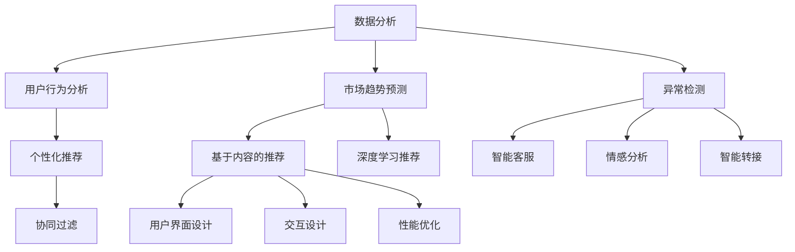

                 

# AI大模型在创业产品运营中的应用探索

## 关键词

- AI大模型
- 创业产品
- 运营策略
- 数据分析
- 个性化推荐
- 智能客服
- 用户体验优化

## 摘要

本文将深入探讨AI大模型在创业产品运营中的应用，分析其在数据分析、个性化推荐、智能客服和用户体验优化等方面的具体应用场景和实践方法。通过详细的理论解释、实际案例分析和代码实现，本文旨在为创业团队提供实用的AI技术应用指南，帮助他们在激烈的市场竞争中脱颖而出。

## 1. 背景介绍

在当今数字化时代，创业产品面临着日益激烈的市场竞争。传统的运营策略和手动数据分析已经难以满足快速变化的市场需求。而AI大模型作为一种强大的技术手段，能够帮助创业团队在产品运营中实现智能化、个性化、高效化。

AI大模型，通常指的是基于深度学习的神经网络模型，其能够处理海量数据并从中提取出有价值的信息。这些模型在图像识别、自然语言处理、语音识别等领域取得了显著的成果。随着技术的进步，AI大模型在创业产品运营中的应用越来越广泛，成为创业团队提升竞争力的重要工具。

创业产品运营中的挑战包括用户增长缓慢、用户留存率低、市场份额有限等。AI大模型能够通过数据分析、个性化推荐、智能客服等功能，解决这些挑战，提升产品的用户体验和市场竞争力。

## 2. 核心概念与联系

### 2.1 数据分析

数据分析是创业产品运营的核心环节。通过收集和分析用户行为数据、市场趋势数据等，创业团队能够深入了解用户需求、优化产品功能、制定有效的营销策略。

AI大模型在数据分析中的应用主要体现在以下几个方面：

- **用户行为分析**：通过分析用户的点击、浏览、购买等行为，AI大模型能够识别用户偏好，为个性化推荐提供依据。
- **市场趋势预测**：基于历史数据和实时数据，AI大模型可以预测市场趋势，帮助创业团队提前布局。
- **异常检测**：AI大模型能够检测数据中的异常值，发现潜在的问题和风险。

### 2.2 个性化推荐

个性化推荐是提高用户留存率和转化率的有效手段。通过分析用户的行为和兴趣，AI大模型能够为每个用户推荐个性化的内容或产品，提升用户体验。

个性化推荐的关键概念包括：

- **协同过滤**：基于用户之间的相似性，推荐用户喜欢的内容。
- **基于内容的推荐**：根据用户的历史行为和内容特征，推荐类似的内容。
- **深度学习推荐**：利用深度学习模型，提取用户和内容的复杂特征，实现精准推荐。

### 2.3 智能客服

智能客服能够自动处理大量的用户咨询，提高响应速度和服务质量。AI大模型在智能客服中的应用主要包括：

- **自然语言处理**：理解用户的问题，并生成合适的回答。
- **情感分析**：识别用户的情感倾向，提供更加贴心的服务。
- **智能转接**：根据用户的问题，自动将咨询转接到相应的客服人员。

### 2.4 用户体验优化

用户体验是创业产品成功的关键。通过AI大模型，创业团队可以实时监控和优化用户的交互体验。

用户体验优化的关键概念包括：

- **用户界面设计**：基于用户行为数据，优化界面设计，提升用户操作便捷性。
- **交互设计**：通过用户行为分析，改进交互流程，提高用户满意度。
- **性能优化**：利用AI大模型，实时监测和分析产品性能，进行针对性的优化。

## 2.1 核心概念原理和架构的 Mermaid 流程图



## 3. 核心算法原理 & 具体操作步骤

### 3.1 数据分析

#### 数据收集

首先，创业团队需要收集用户行为数据、市场趋势数据等。这些数据可以通过网站日志、用户反馈、市场调研等方式获取。

#### 数据清洗

收集到的数据通常存在噪声和不一致的问题，需要通过数据清洗方法进行预处理。常用的数据清洗方法包括去重、补全、规范化等。

#### 数据分析

使用AI大模型，创业团队可以分析用户行为数据，提取有价值的信息。具体步骤如下：

1. **特征工程**：将原始数据转换为适合模型训练的特征向量。
2. **模型训练**：使用深度学习模型，对特征向量进行训练，提取用户偏好和需求。
3. **模型评估**：通过交叉验证等方法，评估模型的准确性和泛化能力。
4. **模型应用**：将训练好的模型应用于实际场景，实现用户行为分析。

### 3.2 个性化推荐

#### 用户画像

创建用户画像，记录用户的兴趣、行为、偏好等特征。

#### 内容标签

为每条内容打上标签，记录内容的主题、类型、质量等特征。

#### 模型训练

使用协同过滤、基于内容的推荐或深度学习推荐等方法，训练个性化推荐模型。

#### 推荐策略

根据用户画像和内容标签，为每个用户生成个性化的推荐列表。

### 3.3 智能客服

#### 自然语言处理

使用自然语言处理技术，理解用户的问题和情感倾向。

#### 情感分析

通过情感分析，识别用户的情感状态，为客服人员提供参考。

#### 智能转接

根据用户的问题类型，自动将咨询转接到相应的客服人员。

### 3.4 用户体验优化

#### 用户行为监控

实时监控用户的交互行为，收集用户反馈。

#### 数据分析

分析用户行为数据，识别用户体验中的问题。

#### 优化策略

根据数据分析结果，制定优化策略，改进用户体验。

## 4. 数学模型和公式 & 详细讲解 & 举例说明

### 4.1 数据分析

#### 特征工程

$$
X = \text{原始数据} \rightarrow F(X) = \text{特征向量}
$$

#### 模型训练

$$
\text{损失函数} = \frac{1}{N} \sum_{i=1}^{N} (\text{预测值} - \text{真实值})^2
$$

#### 模型评估

$$
\text{准确率} = \frac{\text{预测正确的样本数}}{\text{总样本数}}
$$

### 4.2 个性化推荐

#### 协同过滤

$$
R_{ij} = \frac{\sum_{k \in \text{共同喜欢的物品}} R_{ik} R_{jk}}{\sum_{k \in \text{共同喜欢的物品}} R_{ik}^2}
$$

#### 基于内容的推荐

$$
\text{相似度} = \frac{\text{用户} i \text{和物品} j \text{的相似度}}{\sqrt{\sum_{k \in \text{用户} i \text{喜欢的物品}} \text{物品} j \text{的相似度}^2}}
$$

#### 深度学习推荐

$$
\text{损失函数} = \frac{1}{N} \sum_{i=1}^{N} \frac{1}{2} (\text{预测值} - \text{真实值})^2
$$

### 4.3 智能客服

#### 自然语言处理

$$
\text{问题分类} = \text{分类模型} (\text{问题文本})
$$

#### 情感分析

$$
\text{情感倾向} = \text{分类模型} (\text{问题文本})
$$

### 4.4 用户体验优化

#### 用户行为监控

$$
\text{行为数据} = \text{监控工具} (\text{用户交互})
$$

#### 数据分析

$$
\text{用户行为分析} = \text{分析工具} (\text{行为数据})
$$

#### 优化策略

$$
\text{优化策略} = \text{策略模型} (\text{用户行为分析结果})
$$

## 5. 项目实战：代码实际案例和详细解释说明

### 5.1 开发环境搭建

在开发环境中，我们需要安装Python、TensorFlow等必要的工具和库。

```bash
pip install tensorflow
```

### 5.2 源代码详细实现和代码解读

以下是一个简单的用户行为数据分析的Python代码示例。

```python
import tensorflow as tf
import pandas as pd

# 读取数据
data = pd.read_csv('user_data.csv')

# 数据预处理
# 特征工程、数据清洗等步骤

# 模型定义
model = tf.keras.Sequential([
    tf.keras.layers.Dense(128, activation='relu', input_shape=(num_features,)),
    tf.keras.layers.Dense(1, activation='sigmoid')
])

# 编译模型
model.compile(optimizer='adam',
              loss='binary_crossentropy',
              metrics=['accuracy'])

# 模型训练
model.fit(x_train, y_train, epochs=10, batch_size=32)

# 模型评估
model.evaluate(x_test, y_test)
```

### 5.3 代码解读与分析

- **数据读取**：使用Pandas读取用户行为数据。
- **数据预处理**：进行特征工程和数据清洗，将原始数据转换为适合模型训练的特征向量。
- **模型定义**：定义一个简单的二分类神经网络模型，输入层有128个神经元，输出层有1个神经元。
- **编译模型**：设置优化器和损失函数，编译模型。
- **模型训练**：使用训练数据训练模型，设置训练周期和批量大小。
- **模型评估**：使用测试数据评估模型的性能。

通过这个简单的示例，我们可以看到如何使用TensorFlow实现用户行为数据分析的模型。在实际项目中，我们需要根据具体需求和数据情况，设计更加复杂和精细的模型。

## 6. 实际应用场景

### 6.1 数据分析

创业团队可以使用AI大模型进行用户行为分析，了解用户需求和偏好，优化产品功能。例如，一家电商公司可以通过分析用户浏览和购买数据，为用户提供个性化的推荐。

### 6.2 个性化推荐

通过AI大模型，创业团队可以为企业客户提供个性化的推荐服务，提升用户满意度和留存率。例如，一家在线教育平台可以通过个性化推荐，为用户提供符合他们需求和兴趣的课程。

### 6.3 智能客服

智能客服可以自动处理大量的用户咨询，提高响应速度和服务质量。例如，一家金融科技公司可以通过智能客服，为用户提供24小时不间断的咨询服务。

### 6.4 用户体验优化

创业团队可以通过AI大模型，实时监控和优化用户的交互体验，提高产品竞争力。例如，一家游戏公司可以通过分析用户行为数据，优化游戏界面和交互设计，提升用户体验。

## 7. 工具和资源推荐

### 7.1 学习资源推荐

- **书籍**：《深度学习》、《Python数据科学手册》
- **论文**：在arXiv、Google Scholar等学术平台上查找相关论文
- **博客**：阅读顶尖技术博客，如Medium、GitHub博客等

### 7.2 开发工具框架推荐

- **Python**：Python是一种广泛使用的编程语言，适合进行数据分析和AI模型开发。
- **TensorFlow**：TensorFlow是一个开源的深度学习框架，支持多种AI模型。
- **Scikit-learn**：Scikit-learn是一个Python机器学习库，提供多种机器学习算法和工具。

### 7.3 相关论文著作推荐

- **论文**：《Deep Learning》、《Recommender Systems》
- **书籍**：《AI大模型：从入门到实战》、《人工智能：一种现代的方法》

## 8. 总结：未来发展趋势与挑战

随着AI技术的不断发展，AI大模型在创业产品运营中的应用前景非常广阔。未来，AI大模型将更加智能化、高效化，为创业团队提供更加精准和实用的运营策略。

然而，AI大模型的应用也面临一些挑战，包括数据隐私、模型解释性、算法公平性等。创业团队需要在这些方面进行深入的思考和探索，确保AI大模型的应用能够真正为用户带来价值。

## 9. 附录：常见问题与解答

### 9.1 AI大模型有哪些应用场景？

AI大模型可以应用于数据分析、个性化推荐、智能客服、用户体验优化等多个场景。例如，在电商领域，AI大模型可以用于用户行为分析和个性化推荐；在金融领域，AI大模型可以用于智能客服和风险评估。

### 9.2 如何保障AI大模型的数据隐私？

为了保障AI大模型的数据隐私，创业团队需要采取以下措施：

- **数据加密**：对用户数据进行加密，防止数据泄露。
- **数据脱敏**：对敏感数据进行脱敏处理，确保数据匿名性。
- **数据审计**：定期对数据进行分析和审计，确保数据安全。

### 9.3 AI大模型的应用是否会导致算法偏见？

是的，AI大模型的应用可能会存在算法偏见。为了避免算法偏见，创业团队需要采取以下措施：

- **数据多样性**：确保训练数据具有多样性，避免算法偏见。
- **算法公平性**：对算法进行公平性评估，确保算法对所有人公平。
- **用户反馈**：收集用户反馈，及时调整和优化算法。

## 10. 扩展阅读 & 参考资料

- [深度学习](https://www.deeplearningbook.org/)
- [个性化推荐系统](https://en.wikipedia.org/wiki/Recommender_system)
- [自然语言处理](https://www.nlplingo.com/)
- [用户体验设计](https://uxdesign.cc/)
- [TensorFlow官方文档](https://www.tensorflow.org/)

