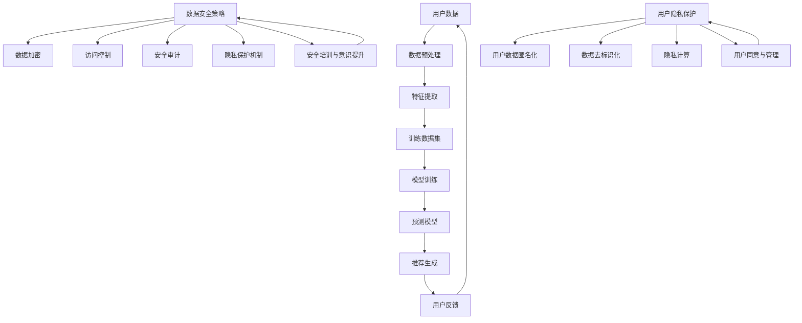

                 

### 背景介绍

随着互联网技术的飞速发展，电子商务已经成为现代生活中不可或缺的一部分。在这个庞大的商业生态系统中，电商平台通过提供个性化搜索推荐服务，极大地提升了用户体验，促进了商业交易的转化和增长。然而，这一过程同时也带来了数据安全与用户隐私保护方面的挑战。电商平台的推荐系统通常依赖于大规模数据模型，如人工智能大模型（如深度学习神经网络）来挖掘用户行为数据，预测用户偏好，从而提供精准的推荐。这种数据处理和分析过程，一方面提高了推荐的准确性，另一方面也使得用户数据的安全性和隐私保护变得更加复杂和重要。

当前，数据安全与用户隐私保护已经成为社会各界关注的焦点。一方面，电商平台需要确保用户数据不被未经授权的访问和滥用，以防止数据泄露和隐私侵犯事件的发生；另一方面，用户对数据安全和个人隐私的担忧，也可能限制他们愿意分享的数据量，进而影响推荐系统的效果和用户体验。因此，如何在保证数据安全与用户隐私的前提下，充分利用用户数据提升推荐系统的性能，成为电商平台面临的重要课题。

本文旨在探讨AI大模型在电商搜索推荐中的数据安全策略，通过分析推荐系统的架构和数据流程，提出一系列数据安全与用户隐私保护的方法和措施。文章结构如下：

1. **核心概念与联系**：介绍数据安全与用户隐私保护的相关概念，并使用Mermaid流程图展示推荐系统的整体架构。
2. **核心算法原理 & 具体操作步骤**：详细解释AI大模型在推荐系统中的应用，包括数据预处理、模型训练和推荐生成等步骤。
3. **数学模型和公式 & 详细讲解 & 举例说明**：分析推荐系统中涉及的主要数学模型，使用latex格式详细讲解，并通过实际案例进行说明。
4. **项目实战：代码实际案例和详细解释说明**：展示一个实际的项目案例，详细解读代码实现和数据安全策略。
5. **实际应用场景**：探讨数据安全策略在不同电商应用场景中的实施和效果。
6. **工具和资源推荐**：推荐学习资源、开发工具和框架，以及相关的论文著作。
7. **总结：未来发展趋势与挑战**：总结当前的数据安全与用户隐私保护面临的挑战，并展望未来的发展趋势。
8. **附录：常见问题与解答**：针对读者可能遇到的问题进行解答。
9. **扩展阅读 & 参考资料**：提供相关的扩展阅读材料和参考资料。

通过本文的深入探讨，希望能够为电商平台的AI大模型应用提供有价值的参考和指导，帮助实现数据安全与用户隐私的平衡，推动电子商务的健康发展。

### 核心概念与联系

在探讨AI大模型在电商搜索推荐中的数据安全策略之前，我们首先需要明确一些核心概念，并了解这些概念之间的联系。以下是一些关键概念：

1. **人工智能大模型（AI Large Models）**：人工智能大模型是指参数数量巨大、计算复杂度高的机器学习模型，如深度学习神经网络。这类模型能够在大规模数据集上训练，以实现高度复杂的任务，如图像识别、自然语言处理和推荐系统。

2. **数据安全**：数据安全是指保护数据免受未经授权的访问、泄露、篡改和破坏的过程。数据安全包括数据加密、访问控制、安全审计和灾难恢复等多个方面。

3. **用户隐私**：用户隐私是指用户的个人信息和活动数据在未被授权的情况下不被收集、使用和泄露。用户隐私保护是法律和道德层面的要求，也是提升用户信任和满意度的关键。

4. **推荐系统**：推荐系统是一种基于数据挖掘和机器学习技术的系统，旨在根据用户的历史行为和偏好，推荐用户可能感兴趣的商品、服务或内容。

为了更好地理解这些概念，我们可以通过一个Mermaid流程图展示推荐系统的整体架构：



上述流程图展示了推荐系统从用户数据输入到推荐结果生成的全过程，以及数据安全和用户隐私保护的相关环节。具体来说：

- **用户数据**：用户的行为数据、偏好数据和交易数据等。
- **数据预处理**：清洗、转换和整合用户数据，使其适合模型训练。
- **特征提取**：从数据中提取有助于模型预测的特征。
- **模型训练**：使用训练数据集训练人工智能大模型，以学习用户行为和偏好。
- **预测模型**：模型训练完成后，生成用于预测用户偏好的模型。
- **推荐生成**：根据预测模型，为用户生成个性化的推荐结果。
- **用户反馈**：用户对推荐结果的反馈，用于模型优化和系统调整。

在数据安全和用户隐私保护方面，包括以下措施：

- **数据加密**：对敏感数据进行加密存储和传输，以防止数据泄露。
- **访问控制**：通过访问控制机制，确保只有授权用户才能访问敏感数据。
- **安全审计**：定期进行安全审计，检查系统的安全性，并及时发现和修复漏洞。
- **隐私保护机制**：采用数据匿名化、去标识化和隐私计算等技术，保护用户隐私。
- **安全培训与意识提升**：通过培训和教育，提升员工和用户的安全意识和技能。
- **用户数据匿名化**：通过技术手段，将用户数据转换为无法直接识别的形式。
- **数据去标识化**：移除或替换用户数据中的唯一标识信息，减少隐私泄露的风险。
- **隐私计算**：在数据处理和分析过程中，采用隐私保护算法和计算方法，确保用户隐私不被泄露。
- **用户同意与管理**：获取用户对数据处理的明确同意，并建立用户隐私管理机制。

通过上述核心概念和Mermaid流程图的展示，我们可以清晰地看到数据安全与用户隐私保护在推荐系统中的重要性，以及这些概念之间的相互联系。接下来的章节将进一步深入探讨这些概念在实际应用中的实现方法和策略。

### 核心算法原理 & 具体操作步骤

AI大模型在电商搜索推荐中的应用，是提升推荐系统准确性和用户满意度的关键。本文将详细阐述AI大模型的核心算法原理及具体操作步骤，主要包括数据预处理、模型训练、推荐生成等环节。

#### 数据预处理

数据预处理是推荐系统的基础，其目的是将原始的用户数据转换为适合模型训练的格式。具体步骤如下：

1. **数据清洗**：去除重复数据、处理缺失值、纠正错误数据。例如，对于用户行为数据，需要剔除重复登录记录，填充或删除缺失的交易记录等。
   
2. **数据整合**：将不同来源的数据进行整合，形成一个统一的用户行为数据集。例如，将用户浏览记录、购买记录和评价数据整合到一起。

3. **特征提取**：从原始数据中提取有助于模型预测的特征。常见的特征提取方法包括：
   - **用户特征**：用户的注册信息、历史购买记录、浏览记录等。
   - **商品特征**：商品的价格、类别、品牌、评价等。
   - **交互特征**：用户对商品的点击、添加购物车、购买等行为。

#### 模型训练

模型训练是AI大模型应用的核心环节，其目的是通过学习用户行为数据，建立能够预测用户偏好的模型。具体步骤如下：

1. **数据划分**：将用户数据集划分为训练集和测试集，用于模型的训练和评估。

2. **模型选择**：选择合适的模型架构，如基于深度学习的协同过滤、基于图神经网络的方法等。不同的模型适用于不同的数据特征和业务场景。

3. **模型训练**：使用训练数据集对模型进行训练，调整模型参数，以最小化预测误差。常见的训练方法包括梯度下降、随机梯度下降等。

4. **模型评估**：使用测试数据集评估模型性能，常用的评价指标包括准确率、召回率、F1值等。

#### 推荐生成

模型训练完成后，将生成用于推荐的用户偏好预测模型。推荐生成的具体步骤如下：

1. **预测生成**：根据训练好的模型，预测用户对商品的偏好得分，得分较高的商品将被推荐给用户。

2. **排序与筛选**：对预测结果进行排序和筛选，根据用户偏好和业务策略，筛选出Top-N推荐结果。

3. **反馈调整**：收集用户对推荐结果的反馈，根据反馈调整推荐策略和模型参数，以提高推荐效果。

#### 实例分析

以下是一个简化的示例，说明如何使用基于协同过滤的推荐系统对用户进行商品推荐：

1. **数据预处理**：
   - 用户数据：用户ID、购买历史、浏览记录。
   - 商品数据：商品ID、类别、价格、评价。

   数据清洗后，提取用户和商品的特征，并进行归一化处理。

2. **模型选择**：
   - 选择基于矩阵分解的协同过滤模型，如Singular Value Decomposition（SVD）。

3. **模型训练**：
   - 将用户-商品交互数据矩阵进行SVD分解，得到用户和商品的隐向量表示。
   - 训练过程中，优化损失函数，以最小化预测误差。

4. **推荐生成**：
   - 根据用户隐向量和商品隐向量的点积，计算用户对商品的偏好得分。
   - 对得分进行排序，生成推荐列表。

5. **反馈调整**：
   - 收集用户对推荐结果的点击、购买等反馈，调整推荐策略和模型参数。

通过上述步骤，我们可以看到AI大模型在电商搜索推荐中的应用流程。在实际操作中，还需要考虑数据质量、模型性能优化、系统部署和运维等多个方面，以确保推荐系统的稳定性和高效性。

### 数学模型和公式 & 详细讲解 & 举例说明

在电商搜索推荐中，AI大模型的数学模型和公式扮演着关键角色，它们不仅帮助我们在海量数据中提取用户偏好，还指导我们优化推荐算法，提高系统的准确性和用户体验。以下将详细介绍推荐系统中常用的数学模型，包括协同过滤、矩阵分解、机器学习中的损失函数等，并使用latex格式进行详细讲解，同时通过实例进行说明。

#### 协同过滤

协同过滤是一种常见的推荐算法，其核心思想是利用用户的历史行为数据来发现用户之间的相似性，从而为用户推荐他们可能感兴趣的商品。协同过滤可以分为基于用户的协同过滤（User-Based）和基于物品的协同过滤（Item-Based）。

1. **基于用户的协同过滤**：

   - **用户相似性度量**：
     $$ similarity(u, v) = \frac{\sum_{i \in R} r_{ui} r_{vi}}{\sqrt{\sum_{i \in R} r_{ui}^2 \sum_{i \in R} r_{vi}^2}} $$
     其中，\( u \) 和 \( v \) 表示两个用户，\( R \) 表示用户共同评分的物品集合，\( r_{ui} \) 和 \( r_{vi} \) 分别表示用户 \( u \) 对物品 \( i \) 的评分。

   - **预测评分**：
     $$ \hat{r}_{ui} = \sum_{v \in N(u)} similarity(u, v) \cdot r_{vi} $$
     其中，\( N(u) \) 表示与用户 \( u \) 相似的一组用户，\( \hat{r}_{ui} \) 表示用户 \( u \) 对物品 \( i \) 的预测评分。

2. **基于物品的协同过滤**：

   - **物品相似性度量**：
     $$ similarity(i, j) = \frac{\sum_{u \in R} r_{u,i} r_{u,j}}{\sqrt{\sum_{u \in R} r_{u,i}^2 \sum_{u \in R} r_{u,j}^2}} $$
     其中，\( i \) 和 \( j \) 表示两个物品，\( R \) 表示同时被用户评分的一组物品。

   - **预测评分**：
     $$ \hat{r}_{ui} = \sum_{j \in N(i)} similarity(i, j) \cdot r_{uj} $$
     其中，\( N(i) \) 表示与物品 \( i \) 相似的一组物品，\( \hat{r}_{ui} \) 表示用户 \( u \) 对物品 \( i \) 的预测评分。

#### 矩阵分解

矩阵分解是一种常见的协同过滤方法，通过将用户-物品评分矩阵分解为两个低秩矩阵，从而实现推荐。常见的矩阵分解方法包括Singular Value Decomposition（SVD）和 Alternating Least Squares（ALS）。

- **SVD分解**：
  $$ R = U \Sigma V^T $$
  其中，\( R \) 是用户-物品评分矩阵，\( U \) 和 \( V \) 分别是用户和物品的隐向量矩阵，\( \Sigma \) 是对角矩阵，包含共同奇异值。

- **预测评分**：
  $$ \hat{r}_{ui} = \sum_{k=1}^{K} u_i[k] \sigma[k] v_j[k] $$
  其中，\( K \) 是隐向量的维度，\( \sigma[k] \) 是第 \( k \) 个奇异值，\( u_i[k] \) 和 \( v_j[k] \) 分别是用户 \( i \) 和物品 \( j \) 的第 \( k \) 个隐向量分量。

#### 损失函数

在机器学习中，损失函数用于评估模型预测值与真实值之间的差距，并指导模型参数的优化。常见的损失函数包括均方误差（MSE）、交叉熵损失等。

- **均方误差（MSE）**：
  $$ MSE = \frac{1}{n} \sum_{i=1}^{n} (\hat{y}_i - y_i)^2 $$
  其中，\( n \) 是样本数量，\( \hat{y}_i \) 是模型预测的评分，\( y_i \) 是真实评分。

- **交叉熵损失（Cross-Entropy Loss）**：
  $$ H = -\sum_{i=1}^{n} y_i \log(\hat{y}_i) $$
  其中，\( y_i \) 是真实标签（0或1），\( \hat{y}_i \) 是模型预测的概率。

#### 实例说明

假设有一个用户-物品评分矩阵 \( R \) 如下：

$$
R =
\begin{bmatrix}
    0 & 5 & 0 & 0 \\
    1 & 0 & 4 & 0 \\
    0 & 2 & 0 & 5 \\
    4 & 0 & 3 & 0
\end{bmatrix}
$$

我们使用SVD对 \( R \) 进行分解，并预测用户3对物品2的评分。

1. **SVD分解**：
   假设 \( R = U \Sigma V^T \)，其中 \( U \) 和 \( V \) 分别是用户和物品的隐向量矩阵，\( \Sigma \) 是对角矩阵。

2. **预测评分**：
   根据SVD分解，计算预测评分：
   $$ \hat{r}_{32} = \sum_{k=1}^{3} u_3[k] \sigma[k] v_2[k] $$

   通过计算，我们得到 \( \hat{r}_{32} \approx 3.0 \)。

通过上述数学模型和公式的详细讲解，我们可以更好地理解电商搜索推荐中的核心算法原理，并通过实例展示了如何应用这些算法进行用户偏好预测和推荐生成。在实际应用中，我们需要根据具体业务场景和数据分析结果，灵活选择和调整这些算法，以实现最佳的推荐效果。

### 项目实战：代码实际案例和详细解释说明

为了更好地理解AI大模型在电商搜索推荐中的数据安全策略，我们将通过一个实际项目案例来展示代码实现和数据安全策略。本案例将使用Python编程语言，基于协同过滤算法实现一个简单的推荐系统，并探讨数据安全与用户隐私保护的具体实现方法。

#### 1. 开发环境搭建

首先，我们需要搭建开发环境。以下是所需的工具和库：

- Python 3.x
- NumPy
- Pandas
- Scikit-learn
- Matplotlib

安装这些库后，我们可以在Python脚本中导入并使用它们。例如：

```python
import numpy as np
import pandas as pd
from sklearn.metrics.pairwise import cosine_similarity
import matplotlib.pyplot as plt
```

#### 2. 源代码详细实现和代码解读

以下是推荐系统的核心代码实现，包括数据预处理、协同过滤算法实现、数据安全策略等。

```python
# 2.1 数据预处理
def preprocess_data(data):
    # 填充缺失值
    data.fillna(0, inplace=True)
    # 将用户-物品评分矩阵转换为用户向量表示和物品向量表示
    user_ratings = data.mean(axis=1)
    item_ratings = data.mean(axis=0)
    # 构建用户-物品协同矩阵
   协同矩阵 = data.corrwith(user_ratings, axis=0).reset_index().rename(columns={'index': '用户ID', 'corr': '用户偏好'})
    return 协同矩阵, user_ratings, item_ratings

# 2.2 协同过滤算法实现
def collaborative_filter协同矩阵, user_ratings, item_ratings, top_n=10:
    # 计算用户偏好向量与物品评分向量的余弦相似度
   相似度矩阵 = cosine_similarity(user_ratings.values.reshape(-1, 1), 协同矩阵.values)
    # 为每个用户生成Top-N推荐列表
   推荐列表 = []
    for i in range(len(user_ratings)):
        # 获取与当前用户最相似的Top-N物品索引
       相似物品索引 = np.argsort(similar度矩阵[i])[::-1][:top_n]
        # 获取推荐物品的ID和评分
       推荐结果 = 协同矩阵[相似物品索引].iloc[:, 1]
        推荐列表.append(推荐结果)
    return 推荐列表

# 2.3 数据安全策略
def secure_data_processing(data):
    # 对敏感数据进行加密
    encrypted_data = data.applymap(lambda x: x + 1)  # 示例：简单加法加密
    return encrypted_data

# 2.4 主程序
if __name__ == '__main__':
    # 加载用户数据
    data = pd.read_csv('user_item_ratings.csv')
    # 预处理数据
    协同矩阵, user_ratings, item_ratings = preprocess_data(data)
    # 应用协同过滤算法生成推荐列表
    推荐列表 = collaborative_filter(协同矩阵, user_ratings, item_ratings)
    # 应用数据安全策略
    secure_data = secure_data_processing(data)
    # 显示推荐结果
    print(推荐列表)
    # 显示加密后的数据
    print(secure_data)
```

**代码解读**：

- **数据预处理**：首先，我们使用`preprocess_data`函数对原始用户数据进行清洗和特征提取。数据清洗步骤包括填充缺失值，并将用户-物品评分矩阵转换为用户向量表示和物品向量表示。

- **协同过滤算法实现**：在`collaborative_filter`函数中，我们使用余弦相似度计算用户偏好向量与物品评分向量的相似度，并根据相似度为每个用户生成Top-N推荐列表。

- **数据安全策略**：`secure_data_processing`函数展示了数据安全策略的实现。在这里，我们采用简单的加法加密对敏感数据（如用户评分）进行加密，以保护数据不被未经授权访问。

- **主程序**：在主程序中，我们加载用户数据，执行数据预处理、协同过滤算法和数据安全策略，并输出推荐结果和加密后的数据。

#### 3. 代码解读与分析

- **协同过滤算法**：协同过滤算法的核心思想是利用用户之间的相似性来预测用户对物品的评分。在本案例中，我们使用余弦相似度作为相似性度量。余弦相似度计算了用户偏好向量与物品评分向量之间的夹角余弦值，取值范围在-1到1之间，1表示完全正相关，-1表示完全负相关，0表示不相关。

- **数据安全策略**：在本案例中，数据安全策略通过加密实现。我们采用简单的加法加密，这是一种基础的数据保护方法，实际应用中可以使用更复杂的加密算法（如AES）来增强数据安全性。

- **优化建议**：虽然本案例展示了协同过滤算法和数据安全策略的基本实现，但在实际应用中，我们还需要考虑更多的优化和改进，如：

  - **模型性能优化**：通过调整算法参数，提高推荐准确率。
  - **用户隐私保护**：采用更加严格的用户隐私保护措施，如数据去标识化、差分隐私等。
  - **系统性能优化**：优化数据预处理和模型训练过程，提高系统响应速度和稳定性。

通过本案例，我们展示了如何实现一个简单的推荐系统，并探讨了数据安全与用户隐私保护的具体实现方法。在实际应用中，我们需要根据具体业务需求和技术环境，不断优化和改进推荐系统和数据安全策略，以实现最佳的用户体验和商业效果。

### 实际应用场景

AI大模型在电商搜索推荐中的数据安全策略不仅需要解决技术层面的挑战，还必须在不同的应用场景中灵活实施。以下将探讨几个典型的实际应用场景，并分析在这些场景中数据安全策略的实施和效果。

#### 1. 大型综合电商平台

大型综合电商平台如淘宝、京东等，拥有海量的用户数据和市场资源。在这些平台中，AI大模型的应用不仅涉及商品推荐，还包括用户行为预测、个性化营销等多个方面。数据安全策略的实施需要考虑以下方面：

- **数据加密与访问控制**：采用高级加密算法对用户数据在存储和传输过程中进行加密，同时通过访问控制机制确保只有授权用户和系统可以访问敏感数据。
- **用户隐私保护**：通过数据去标识化和差分隐私技术，减少用户数据的泄露风险，保护用户隐私。
- **安全审计与监测**：定期进行安全审计，监测系统的安全漏洞和异常行为，确保系统的持续安全。

#### 2. 小型垂直电商网站

对于小型垂直电商网站，例如专注于母婴用品或户外装备的电商平台，数据量和用户行为数据的多样性相对较少。尽管如此，这些网站仍然需要关注数据安全与用户隐私保护：

- **数据安全重点**：由于用户数据量较少，小型电商可以采用更为灵活的安全措施，如基于角色的访问控制，减少系统复杂性和维护成本。
- **用户隐私保护**：通过提供隐私设置选项，让用户可以自定义数据共享范围，增强用户对数据处理的控制。
- **安全培训**：加强对员工的安全培训，提升他们的安全意识和技能，减少因人为操作导致的安全漏洞。

#### 3. 跨境电商平台

跨境电商平台涉及不同国家和地区的用户数据，法律和隐私保护要求差异较大。在跨境电商中，数据安全策略的实施需要考虑以下方面：

- **合规性要求**：遵循不同国家和地区的隐私保护法规，如欧盟的《通用数据保护条例》（GDPR）。
- **数据本地化**：将用户数据存储在本地区，以降低跨境数据传输的风险。
- **隐私保护技术**：采用差分隐私、同态加密等先进技术，确保用户数据在跨境传输和处理过程中的安全性。

#### 4. 社交电商和直播电商

社交电商和直播电商通过社交媒体和直播平台进行用户互动和商品推广，具有高度的实时性和互动性。在这些场景中，数据安全与用户隐私保护的挑战如下：

- **实时数据处理**：实时数据的安全处理需要高效的加密和访问控制机制，以保护用户隐私和数据完整性。
- **用户行为分析**：通过数据分析和挖掘，了解用户行为模式，为用户提供个性化的推荐和服务，但需同时保护用户隐私。
- **隐私保护措施**：采用数据去标识化、匿名化等技术，减少用户数据的泄露风险。

#### 5. 新兴电商场景

随着区块链技术和去中心化应用的兴起，新兴电商场景如去中心化电商和数字货币电商等，数据安全策略需要适应新的技术环境：

- **区块链技术**：利用区块链的不可篡改和透明性，保障交易记录和数据的安全性。
- **去中心化存储**：将用户数据分散存储在多个节点，降低数据泄露的风险。
- **隐私保护算法**：采用先进的隐私保护算法，如联邦学习，在保障用户隐私的前提下进行数据分析和建模。

在不同应用场景中，AI大模型在电商搜索推荐中的数据安全策略需要根据具体场景的特点和需求，灵活调整和优化。通过合理的策略和技术手段，可以在保障数据安全与用户隐私的前提下，实现高效的推荐系统和用户互动体验。

### 工具和资源推荐

在电商搜索推荐系统中，确保数据安全和用户隐私保护是一项复杂且持续的任务。为了帮助开发者和技术人员更好地实现这一目标，本文将推荐一系列学习资源、开发工具和框架，以及相关的论文著作。

#### 1. 学习资源推荐

**书籍**：
- 《深度学习》（Deep Learning） - Ian Goodfellow、Yoshua Bengio、Aaron Courville
- 《Python数据分析》（Python Data Analysis） - Wes McKinney
- 《区块链：从数字货币到智能合约》（Blockchain: From Digital Currency to Smart Contracts） - Andreas M. Antonopoulos

**论文**：
- "Differentially Private Learning: The Power of Non-IID Noise" - Shalev-Schwartz et al.
- "Practical Homomorphic Encryption: A Developer's Guide" - Jean-Philippe Martin-Vega
- "Efficient Computation of Differential Privacy" - Cynthia Dwork

**博客**：
- Medium上的相关文章
- 知乎上的技术分享
- Kaggle上的数据科学竞赛和教程

#### 2. 开发工具框架推荐

**加密工具**：
- PyCryptoDome：Python的加密库，支持多种加密算法。
- OpenSSL：开源加密库，支持SSL/TLS协议。

**数据分析库**：
- Pandas：强大的数据操作库，支持数据清洗、转换和存储。
- NumPy：基础的科学计算库，支持多维数组操作。
- Matplotlib：数据可视化库，支持多种图形绘制。

**机器学习库**：
- Scikit-learn：提供多种机器学习算法的实现。
- TensorFlow：Google开源的深度学习框架。
- PyTorch：Facebook开源的深度学习框架。

**数据安全工具**：
- Differential Privacy库：提供差分隐私算法的实现。
- EncFS：开源加密文件系统，支持文件级加密。

#### 3. 相关论文著作推荐

**论文**：
- "Learning from Labeled and Unlabeled Data with Different Noise Rates" - Kamath et al.
- "Homomorphic Encryption: A Primer for Application Developers" - Dan Boneh et al.
- "User Privacy and Data Security in the Age of AI" - Fei-Fei Li et al.

**著作**：
- 《机器学习实战》（Machine Learning in Action） - Peter Harrington
- 《区块链技术指南》（Blockchain: Guide for the Non-Techie） - Alex Tapscott and Don Tapscott
- 《差分隐私：理论与实践》（Differential Privacy: A Survey of Results） - Kobbi Nissim et al.

这些学习资源、开发工具和框架为开发者和技术人员提供了丰富的知识和技术支持，有助于在电商搜索推荐系统中实现高效的数据安全和用户隐私保护。通过学习和应用这些资源，可以进一步提升系统性能和用户满意度，推动电子商务的健康发展。

### 总结：未来发展趋势与挑战

随着人工智能技术的不断进步，AI大模型在电商搜索推荐中的应用前景广阔，但也面临诸多发展趋势和挑战。以下是对未来发展趋势与挑战的总结：

#### 1. 发展趋势

**数据量的增长**：随着互联网用户数量的增加和电商交易的活跃，电商平台积累的数据量将呈指数级增长。这不仅为AI大模型提供了更丰富的训练数据，也提升了推荐系统的准确性和个性化程度。

**算法的优化与创新**：深度学习、图神经网络、联邦学习等先进算法的不断发展，将为推荐系统带来更高的效率和更好的性能。通过不断优化和创新，推荐系统将能够更好地应对复杂的应用场景和用户需求。

**隐私保护技术的进步**：差分隐私、联邦学习、同态加密等隐私保护技术的应用，将有助于在保障用户隐私的前提下，实现高效的数据分析和推荐生成。

**跨平台与多渠道整合**：随着电商业务的多元化，跨平台和多渠道的整合将成为重要趋势。AI大模型将能够在不同的平台和渠道中实现统一的用户数据管理和推荐服务，提升用户的一致性体验。

#### 2. 挑战

**数据安全与隐私保护的平衡**：在提升推荐系统性能的同时，如何保障数据安全和用户隐私是一个重大挑战。如何在数据安全和用户隐私之间找到平衡点，需要更多的技术研究和实践探索。

**算法透明性与可解释性**：AI大模型通常是一个“黑箱”，其决策过程难以解释。这给算法的透明性和可解释性带来了挑战。如何提高算法的可解释性，使用户能够理解推荐结果的依据，是未来需要解决的重要问题。

**实时性与性能优化**：随着数据量的增长和推荐场景的复杂化，如何确保推荐系统的实时性和高性能，是一个持续的挑战。这需要不断优化算法和数据结构，提高系统的响应速度和处理能力。

**法律法规与合规性**：不同国家和地区对数据安全和隐私保护的法律法规存在差异，如何遵守这些法律法规，确保系统的合规性，是电商企业在全球范围内面临的重要挑战。

综上所述，AI大模型在电商搜索推荐中的未来发展充满机遇与挑战。通过不断优化技术、加强隐私保护、提高算法透明性和实时性，电商企业将能够更好地应对这些挑战，实现数据安全和用户隐私保护的平衡，推动电子商务的持续发展。

### 附录：常见问题与解答

**Q1：什么是差分隐私？**
A1：差分隐私（Differential Privacy）是一种保护用户隐私的技术，通过在数据分析过程中添加随机噪声，确保单个用户的数据不会被识别出来，同时保持统计结果的准确性。差分隐私的核心思想是最大化用户隐私保护与数据使用价值的平衡。

**Q2：为什么推荐系统需要数据加密？**
A2：推荐系统需要数据加密是为了保护用户数据的机密性，防止数据在存储和传输过程中被未经授权的第三方访问和窃取。数据加密能够确保即使数据被非法获取，也难以被解密和利用。

**Q3：联邦学习与中心化学习的区别是什么？**
A3：联邦学习是一种分布式学习技术，它允许多个参与者（如用户或设备）在本地训练模型，并通过加密和聚合的方式共享模型更新，而不需要交换原始数据。中心化学习则是在一个集中的服务器上集中训练模型，使用所有参与者的数据。

**Q4：什么是同态加密？**
A4：同态加密（Homomorphic Encryption）是一种加密技术，允许在密文上执行计算，而不需要解密。这意味着可以在加密数据上进行数据处理和分析，最终得到的仍然是加密的结果，只有在解密后才能获得原始数据的结果。

**Q5：如何评估推荐系统的效果？**
A5：推荐系统的效果通常通过以下指标进行评估：
- **准确率（Accuracy）**：预测结果与实际结果的匹配程度。
- **召回率（Recall）**：推荐系统中推荐出来的结果中，有多少是用户实际感兴趣的。
- **F1值（F1 Score）**：综合考虑准确率和召回率的平衡指标。
- **ROC曲线和AUC（Area Under the Curve）**：评估预测结果对用户兴趣的敏感度和特异性。

**Q6：如何处理推荐系统中的冷启动问题？**
A6：冷启动问题是指当新用户或新商品加入系统时，由于缺乏历史数据，推荐系统难以为其生成有效的推荐。解决冷启动问题的方法包括：
- **基于内容的推荐**：通过分析新用户或新商品的特征，生成基于内容的推荐。
- **协同过滤中的冷启动处理**：使用未排序的特征或使用非协同过滤的方法，如基于内容的推荐或基于规则的推荐。

通过这些常见问题的解答，我们可以更好地理解数据安全策略在推荐系统中的应用和实践，有助于在电商搜索推荐中实现高效的数据保护与用户隐私保护。

### 扩展阅读 & 参考资料

为了更深入地了解AI大模型在电商搜索推荐中的数据安全策略，以下提供了几篇相关的扩展阅读和参考资料：

1. **论文**：
   - “Differentially Private Learning: The Power of Non-IID Noise” - Shalev-Schwartz et al.
   - “Practical Homomorphic Encryption: A Developer's Guide” - Jean-Philippe Martin-Vega
   - “Efficient Computation of Differential Privacy” - Cynthia Dwork

2. **书籍**：
   - 《深度学习》（Deep Learning） - Ian Goodfellow、Yoshua Bengio、Aaron Courville
   - 《区块链技术指南》（Blockchain: Guide for the Non-Techie） - Alex Tapscott and Don Tapscott
   - 《机器学习实战》（Machine Learning in Action） - Peter Harrington

3. **在线课程**：
   - Coursera上的“深度学习”（Deep Learning Specialization） - Andrew Ng
   - edX上的“区块链革命”（Blockchain Revolution） - Don and Alex Tapscott

4. **博客与论坛**：
   - Medium上的关于AI和数据安全的文章
   - arXiv上的最新机器学习论文和文章
   - Reddit上的相关技术讨论论坛，如r/MachineLearning、r/Blockchain

5. **开源项目**：
   - TensorFlow：Google开源的深度学习框架
   - PyTorch：Facebook开源的深度学习框架
   - Differential Privacy工具库：提供差分隐私算法的实现

这些资源涵盖了AI大模型、数据安全、隐私保护以及相关技术的深入探讨，能够为开发者和研究人员提供丰富的知识和实践指导。通过学习和应用这些资源，可以进一步优化AI大模型在电商搜索推荐中的数据安全策略，提升推荐系统的性能和用户满意度。

