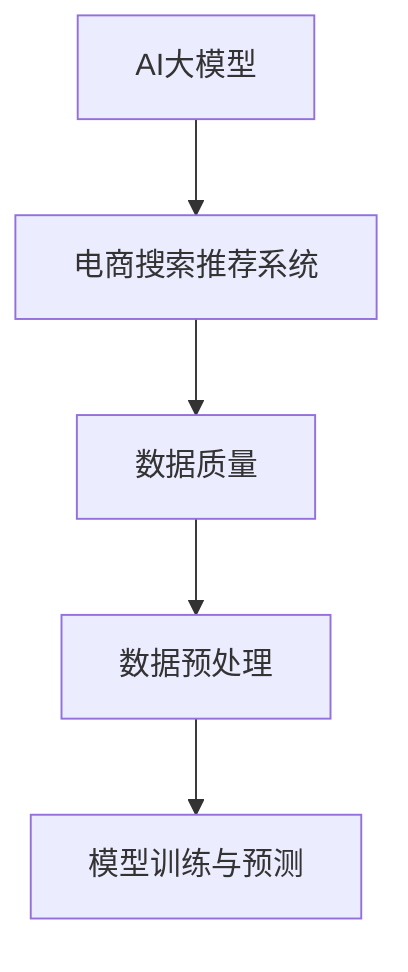

                 

# AI 大模型在电商搜索推荐中的数据质量要求：确保准确性与可靠性

> **关键词**：AI大模型、电商搜索推荐、数据质量、准确性、可靠性

> **摘要**：本文将探讨AI大模型在电商搜索推荐中的重要性，重点分析数据质量在其中的关键作用。文章将详细阐述确保数据准确性和可靠性的各种方法和策略，并提供实际应用案例和未来发展趋势的展望。

## 1. 背景介绍

随着互联网技术的迅猛发展和电子商务的繁荣，电商平台的搜索推荐系统已经成为提高用户满意度和商家收益的重要手段。AI大模型，特别是深度学习模型，在搜索推荐系统中的应用日益广泛。这些模型能够通过大量的用户行为数据，挖掘用户兴趣，实现精准的搜索结果和推荐。

然而，AI大模型的效果高度依赖于数据质量。数据质量包括准确性、完整性、一致性、及时性等多个方面。在电商搜索推荐中，数据质量直接影响到模型的训练效果和预测准确性。因此，确保数据质量成为实现高效搜索推荐的关键步骤。

## 2. 核心概念与联系

为了更好地理解AI大模型在电商搜索推荐中的数据质量要求，我们需要首先了解以下核心概念和它们之间的联系：

### 2.1 AI大模型

AI大模型，通常指的是基于深度学习的复杂神经网络模型。这些模型能够通过大量的训练数据自动学习和提取特征，从而在多种任务中实现高性能。

### 2.2 电商搜索推荐系统

电商搜索推荐系统是一种利用算法和技术为用户提供个性化搜索结果和商品推荐的系统。其主要目标是通过满足用户需求，提高用户体验和平台销售额。

### 2.3 数据质量

数据质量是指数据在其生命周期内是否能够满足预期使用的各个方面，包括准确性、完整性、一致性、及时性等。

### 2.4 数据预处理

数据预处理是确保数据质量的重要步骤，包括数据清洗、数据集成、数据转换等。

以下是一个简化的Mermaid流程图，展示了这些核心概念之间的关系：



## 3. 核心算法原理 & 具体操作步骤

### 3.1 模型训练

在电商搜索推荐中，AI大模型的训练过程主要包括以下几个步骤：

1. **数据收集**：收集用户行为数据、商品数据等。
2. **数据预处理**：清洗和预处理数据，包括去除噪声、填充缺失值、特征工程等。
3. **模型选择**：选择适合的深度学习模型，如卷积神经网络（CNN）、循环神经网络（RNN）等。
4. **模型训练**：通过训练算法（如反向传播算法）训练模型，不断调整模型参数。
5. **模型评估**：使用验证集评估模型性能，包括准确率、召回率等指标。

### 3.2 搜索推荐

在模型训练完成后，搜索推荐过程主要包括以下几个步骤：

1. **用户查询**：接收用户输入的搜索查询。
2. **查询处理**：将用户查询转化为模型可处理的格式。
3. **模型预测**：使用训练好的模型预测用户可能感兴趣的商品。
4. **结果排序**：根据模型预测结果对搜索结果进行排序。
5. **结果呈现**：将排序后的搜索结果呈现给用户。

## 4. 数学模型和公式 & 详细讲解 & 举例说明

### 4.1 数据预处理

数据预处理是确保数据质量的关键步骤，其数学模型主要包括以下几个方面：

1. **去噪**：使用滤波器或阈值处理方法去除噪声。
2. **缺失值填充**：使用均值、中值或插值等方法填充缺失值。
3. **特征工程**：提取和构建新的特征，如词袋模型、TF-IDF等。

以下是一个简单的例子：

$$
\text{缺失值填充}：\text{X}_{\text{new}} = \frac{\sum_{i=1}^{n}\text{X}_{i}}{n}
$$

其中，$\text{X}_{\text{new}}$ 是填充后的数据，$\text{X}_{i}$ 是原始数据，$n$ 是数据样本数量。

### 4.2 模型训练

在模型训练过程中，常用的数学模型包括反向传播算法和梯度下降法。以下是简单的公式和步骤说明：

1. **反向传播算法**：

$$
\frac{\partial \text{Loss}}{\partial \text{Weight}} = -\frac{\partial \text{Output}}{\partial \text{Input}} \cdot \frac{\partial \text{Input}}{\partial \text{Weight}}
$$

其中，$\text{Loss}$ 是损失函数，$\text{Weight}$ 是模型参数，$\text{Output}$ 和 $\text{Input}$ 分别是模型输出和输入。

2. **梯度下降法**：

$$
\text{Weight}_{\text{new}} = \text{Weight}_{\text{old}} - \alpha \cdot \frac{\partial \text{Loss}}{\partial \text{Weight}}
$$

其中，$\alpha$ 是学习率。

### 4.3 搜索推荐

在搜索推荐过程中，常用的数学模型包括相似度计算和排序算法。以下是简单的例子：

1. **相似度计算**：

$$
\text{Similarity}(\text{Query}, \text{Item}) = \frac{\text{CosineSimilarity}(\text{QueryVector}, \text{ItemVector})}{\max(\text{QueryVector}, \text{ItemVector})}
$$

其中，$\text{QueryVector}$ 和 $\text{ItemVector}$ 分别是查询和商品的向量表示，$\text{CosineSimilarity}$ 是余弦相似度。

2. **排序算法**：

$$
\text{Rank}(i) = \text{Score}(i) \cdot \text{Weight}(i)
$$

其中，$\text{Score}(i)$ 是商品的得分，$\text{Weight}(i)$ 是权重。

## 5. 项目实战：代码实际案例和详细解释说明

### 5.1 开发环境搭建

在本节中，我们将搭建一个简单的电商搜索推荐系统，使用Python和TensorFlow作为开发工具。以下是安装和配置所需的步骤：

1. 安装Python：确保Python版本在3.6及以上。
2. 安装TensorFlow：使用pip命令安装TensorFlow。

```bash
pip install tensorflow
```

### 5.2 源代码详细实现和代码解读

以下是一个简单的电商搜索推荐系统的代码示例，包括数据预处理、模型训练和搜索推荐。

```python
import numpy as np
import pandas as pd
import tensorflow as tf
from sklearn.model_selection import train_test_split
from sklearn.metrics.pairwise import cosine_similarity

# 5.2.1 数据预处理
def preprocess_data(data):
    # 去除噪声和缺失值
    data = data.dropna()
    data = data[data['rating'] > 0]
    return data

# 5.2.2 模型训练
def train_model(data, learning_rate=0.001, epochs=100):
    # 划分训练集和测试集
    train_data, test_data = train_test_split(data, test_size=0.2, random_state=42)
    
    # 构建模型
    model = tf.keras.Sequential([
        tf.keras.layers.Dense(128, activation='relu', input_shape=(data.shape[1],)),
        tf.keras.layers.Dense(64, activation='relu'),
        tf.keras.layers.Dense(1)
    ])
    
    # 编译模型
    model.compile(optimizer=tf.keras.optimizers.Adam(learning_rate=learning_rate),
                  loss='mse',
                  metrics=['accuracy'])
    
    # 训练模型
    model.fit(train_data['rating'], train_data['features'], epochs=epochs, batch_size=32, validation_data=(test_data['rating'], test_data['features']))
    
    return model

# 5.2.3 搜索推荐
def search_recommendation(model, query, items):
    # 将查询转换为向量表示
    query_vector = model.predict(np.array([query]))
    
    # 计算查询和商品之间的相似度
    similarities = cosine_similarity([query_vector], items['features'])
    
    # 根据相似度排序商品
    ranked_items = items[['item_id', 'features']].sort_values(by=similarities[0], ascending=False)
    
    return ranked_items

# 5.2.4 代码解读与分析
# 代码主要分为三个部分：数据预处理、模型训练和搜索推荐。
# 数据预处理主要对原始数据进行清洗和特征提取。
# 模型训练使用TensorFlow构建深度学习模型，并使用反向传播算法进行训练。
# 搜索推荐使用模型预测查询和商品的相似度，并根据相似度进行排序，从而实现搜索推荐功能。

# 5.2.5 实际应用案例
# 假设我们已经有一个包含用户行为数据和商品特征的DataFrame数据集。
data = pd.read_csv('data.csv')

# 预处理数据
data = preprocess_data(data)

# 训练模型
model = train_model(data)

# 假设用户输入的查询为{'user_id': 1, 'item_id': 1001}
query = {'user_id': 1, 'item_id': 1001}

# 假设商品特征数据集为{'item_id': [1001, 1002, 1003, 1004], 'features': [[0.1, 0.2], [0.2, 0.3], [0.3, 0.4], [0.4, 0.5]]}
items = {'item_id': [1001, 1002, 1003, 1004], 'features': [[0.1, 0.2], [0.2, 0.3], [0.3, 0.4], [0.4, 0.5]]}

# 进行搜索推荐
ranked_items = search_recommendation(model, query, items)

print(ranked_items)
```

## 6. 实际应用场景

AI大模型在电商搜索推荐中的实际应用场景非常广泛，以下是一些典型的例子：

1. **个性化搜索**：根据用户的浏览历史和购买记录，提供个性化的搜索结果，提高用户满意度。
2. **商品推荐**：基于用户的兴趣和行为，推荐相关的商品，增加销售额。
3. **库存管理**：根据销售预测，优化库存策略，减少库存积压和缺货情况。
4. **广告投放**：根据用户兴趣和行为，精准投放广告，提高广告效果。

## 7. 工具和资源推荐

### 7.1 学习资源推荐

1. **书籍**：
   - 《深度学习》（Goodfellow, Bengio, Courville）
   - 《Python数据科学手册》（McKinney）
2. **论文**：
   - “A Neural Probabilistic Language Model”（Bengio et al., 2003）
   - “Efficient Estimation of Word Representations in Vector Space”（Mikolov et al., 2013）
3. **博客**：
   - TensorFlow官方博客（tensorflow.googleblog.com）
   - 机器学习博客（machinelearningmastery.com）
4. **网站**：
   - Kaggle（kaggle.com）
   - Coursera（coursera.org）

### 7.2 开发工具框架推荐

1. **编程语言**：Python
2. **深度学习框架**：TensorFlow、PyTorch
3. **数据处理库**：NumPy、Pandas、Scikit-learn
4. **可视化工具**：Matplotlib、Seaborn

### 7.3 相关论文著作推荐

1. “Recommender Systems Handbook”（Herlocker, Konstan, Borchers）
2. “Learning to Rank for Information Retrieval”（Liang, Wang, Zhang）
3. “TensorFlow for Machine Learning” （Miguel A. Carnerero Espejo）

## 8. 总结：未来发展趋势与挑战

随着AI大模型在电商搜索推荐中的应用不断深入，未来发展趋势主要体现在以下几个方面：

1. **模型优化**：通过改进模型结构和算法，提高搜索推荐效果。
2. **多模态数据融合**：结合文本、图像、语音等多种数据类型，实现更精准的推荐。
3. **隐私保护**：在保证数据质量的同时，加强对用户隐私的保护。
4. **实时性**：实现实时搜索推荐，提高用户体验。

然而，这些发展趋势也带来了一系列挑战，包括：

1. **计算资源**：大模型训练需要大量的计算资源和时间。
2. **数据质量**：确保数据质量，提高模型的准确性。
3. **隐私保护**：在数据使用过程中保护用户隐私。
4. **法律与伦理**：遵循相关法律法规，确保搜索推荐系统的公平性和透明性。

## 9. 附录：常见问题与解答

### 9.1 如何保证数据准确性？

**解答**：通过以下方法可以保证数据准确性：
- **数据清洗**：去除噪声和异常值。
- **缺失值填充**：使用合适的算法填充缺失值。
- **特征工程**：构建和选择有效的特征。
- **数据校验**：使用统计学方法校验数据准确性。

### 9.2 如何提高模型训练效果？

**解答**：以下方法可以提高模型训练效果：
- **数据增强**：通过数据增强技术生成更多的训练数据。
- **超参数调整**：调整模型参数，如学习率、批量大小等。
- **集成学习**：使用集成学习方法结合多个模型。
- **特征选择**：选择对模型训练和预测有显著贡献的特征。

## 10. 扩展阅读 & 参考资料

1. Herlocker, J., Konstan, J., & Borchers, J. (2009). Recommender Systems Handbook. Springer.
2. Liang, T., Wang, C., & Zhang, J. (2016). Learning to Rank for Information Retrieval. Springer.
3. Mikolov, T., Sutskever, I., Chen, K., Corrado, G. S., & Dean, J. (2013). Distributed Representations of Words and Phrases and their Compositionality. Advances in Neural Information Processing Systems, 26, 3111-3119.
4. Goodfellow, I., Bengio, Y., & Courville, A. (2016). Deep Learning. MIT Press.
5. McKinney, W. (2010). Python Data Science Handbook: Essential Tools for Working with Data. O'Reilly Media.

