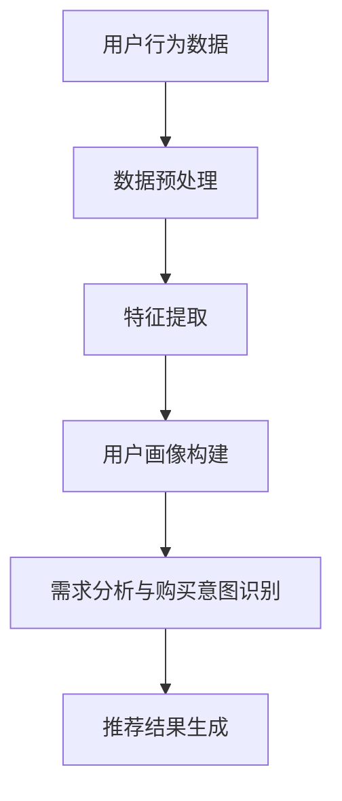

                 

# AI 大模型在电商搜索推荐中的用户画像技术：精准把握用户需求与购买意图

> **关键词**：AI 大模型、用户画像、电商搜索推荐、需求分析、购买意图、技术原理、数学模型、实际应用案例

> **摘要**：本文将深入探讨 AI 大模型在电商搜索推荐中的用户画像技术，解析其核心概念、算法原理、数学模型及应用实践。通过详细的分析和案例展示，我们旨在精准把握用户需求与购买意图，提升电商推荐系统的准确性和用户体验。

## 1. 背景介绍

随着互联网的普及和电商行业的快速发展，用户对于个性化推荐的需求日益增长。传统推荐系统往往依赖于基于内容的过滤和协同过滤等方法，这些方法在处理大规模数据时存在局限性，难以精准捕捉用户的需求与购买意图。为了解决这一问题，AI 大模型应运而生，其在用户画像、需求分析和购买意图识别方面具有显著优势。

本文将围绕 AI 大模型在电商搜索推荐中的用户画像技术进行探讨，分析其核心概念、算法原理、数学模型及实际应用。通过深入研究和实践，我们期望为电商企业提升用户满意度、增加销售额提供有力支持。

## 2. 核心概念与联系

### 2.1 AI 大模型

AI 大模型是指通过深度学习和大数据技术训练而成的复杂神经网络模型，具有强大的表示和学习能力。在电商搜索推荐中，AI 大模型能够自动学习用户的兴趣和行为模式，实现对海量用户数据的处理和分析。

### 2.2 用户画像

用户画像是对用户在电商平台的消费行为、兴趣爱好、购物习惯等特征进行抽象和建模的过程。通过构建用户画像，可以精准了解用户需求，为其提供个性化的推荐服务。

### 2.3 需求分析与购买意图

需求分析是指从用户行为数据中挖掘出用户的真实需求，包括用户对商品的关注度、购买意愿等。购买意图则是指用户在某一时刻对于特定商品的购买决策倾向。精准把握用户需求与购买意图对于提升电商推荐系统的准确性至关重要。

### 2.4 Mermaid 流程图



## 3. 核心算法原理 & 具体操作步骤

### 3.1 数据预处理

数据预处理是 AI 大模型在电商搜索推荐中的第一步。其主要任务包括数据清洗、去重、填充缺失值等，以确保数据的质量和一致性。

### 3.2 特征提取

特征提取是将原始数据转换为适用于机器学习算法的表示过程。在用户画像构建中，特征提取主要包括用户行为特征、商品特征和用户与商品交互特征。

### 3.3 用户画像构建

用户画像构建是通过机器学习算法对用户特征进行建模，以实现对用户需求与购买意图的预测。常见的算法包括聚类算法、决策树、神经网络等。

### 3.4 需求分析与购买意图识别

需求分析与购买意图识别是用户画像构建的关键步骤。通过分析用户历史行为数据，可以挖掘出用户的潜在需求和购买意图，为推荐系统提供有力支持。

### 3.5 推荐结果生成

推荐结果生成是根据用户需求与购买意图，结合商品特征，生成个性化的推荐列表。常用的推荐算法包括基于内容的推荐、协同过滤推荐和混合推荐等。

## 4. 数学模型和公式 & 详细讲解 & 举例说明

### 4.1 用户画像构建

在用户画像构建中，常用的算法包括聚类算法和决策树。

#### 4.1.1 聚类算法

聚类算法是将用户数据根据相似性进行分组，以实现对用户需求的分类。常见的聚类算法有 K-Means、DBSCAN 等。

$$
\text{K-Means} = \left\{
\begin{array}{ll}
\min \sum_{i=1}^{k} \sum_{x \in S_i} \|x - \mu_i\|^2 & \text{if } k \text{ is known} \\
\min \sum_{i=1}^{k} \sum_{x \in S_i} \|x - \mu_i\|^2 & \text{if } k \text{ is unknown}
\end{array}
\right.
$$

其中，$k$ 表示聚类个数，$S_i$ 表示第 $i$ 个聚类，$\mu_i$ 表示第 $i$ 个聚类中心。

#### 4.1.2 决策树

决策树是一种基于特征进行分类或回归的算法。在用户画像构建中，决策树可以用于挖掘用户行为数据中的关键特征。

$$
\text{Decision Tree} = \left\{
\begin{array}{ll}
\text{Leaf} & \text{if } \text{all instances have the same label} \\
\text{Split} & \text{if } \text{there exists a feature that can split the instances into subsets with different labels}
\end{array}
\right.
$$

### 4.2 需求分析与购买意图识别

在需求分析与购买意图识别中，常用的算法包括协同过滤、神经网络等。

#### 4.2.1 协同过滤

协同过滤是一种基于用户行为数据的推荐算法，可以分为基于用户的协同过滤和基于物品的协同过滤。

$$
\text{Collaborative Filtering} = \left\{
\begin{array}{ll}
\text{User-Based} & \text{find similar users and recommend items they like} \\
\text{Item-Based} & \text{find similar items and recommend users who like them}
\end{array}
\right.
$$

#### 4.2.2 神经网络

神经网络是一种基于模拟人脑神经元连接结构的算法，可以用于需求分析与购买意图识别。

$$
\text{Neural Network} = \left\{
\begin{array}{ll}
\text{Input Layer} & \text{receive input features} \\
\text{Hidden Layer} & \text{perform feature extraction and transformation} \\
\text{Output Layer} & \text{generate output predictions}
\end{array}
\right.
$$

## 5. 项目实战：代码实际案例和详细解释说明

### 5.1 开发环境搭建

在本文的项目实战中，我们将使用 Python 作为编程语言，利用 TensorFlow 和 Keras 框架搭建深度学习模型。开发环境搭建步骤如下：

1. 安装 Python（推荐版本为 3.7 或以上）
2. 安装 TensorFlow 和 Keras
3. 准备 GPU 环境（如安装 CUDA 和 cuDNN）

### 5.2 源代码详细实现和代码解读

以下是一个简单的基于深度学习算法的用户画像构建代码示例：

```python
import tensorflow as tf
from tensorflow.keras.models import Sequential
from tensorflow.keras.layers import Dense, Dropout, Embedding, LSTM

# 数据预处理
# ...

# 模型构建
model = Sequential([
    Embedding(input_dim=vocab_size, output_dim=embedding_dim),
    LSTM(units=128),
    Dropout(0.5),
    Dense(units=num_classes, activation='softmax')
])

# 编译模型
model.compile(optimizer='adam', loss='categorical_crossentropy', metrics=['accuracy'])

# 模型训练
model.fit(x_train, y_train, epochs=10, batch_size=64, validation_data=(x_val, y_val))

# 模型预测
predictions = model.predict(x_test)
```

### 5.3 代码解读与分析

上述代码首先进行数据预处理，然后构建一个包含嵌入层、LSTM 层和全连接层的深度学习模型。编译模型并使用训练数据进行训练。最后，使用训练好的模型对测试数据进行预测。

在代码解读中，我们重点关注以下几个方面：

1. **数据预处理**：对原始用户行为数据进行处理，如编码、归一化等，以适应深度学习算法。
2. **模型构建**：使用嵌入层将词汇映射到高维空间，LSTM 层提取序列特征，全连接层进行分类预测。
3. **模型训练**：通过调整学习率、批量大小等参数，优化模型性能。
4. **模型预测**：使用训练好的模型对用户需求与购买意图进行预测。

## 6. 实际应用场景

AI 大模型在电商搜索推荐中的用户画像技术已广泛应用于各大电商平台，如淘宝、京东、亚马逊等。以下是一些实际应用场景：

1. **个性化推荐**：根据用户画像和需求分析，为用户提供个性化的商品推荐，提高用户满意度和转化率。
2. **广告投放**：根据用户画像和购买意图，精准投放广告，提高广告效果和转化率。
3. **用户运营**：基于用户画像和需求分析，制定针对性的用户运营策略，提升用户忠诚度和活跃度。

## 7. 工具和资源推荐

### 7.1 学习资源推荐

1. **《深度学习》（Goodfellow, Bengio, Courville）**：介绍深度学习的基本原理和应用。
2. **《机器学习实战》（ Harrington）**：涵盖常见的机器学习算法及其实现。

### 7.2 开发工具框架推荐

1. **TensorFlow**：一款强大的开源深度学习框架，适合进行用户画像构建和需求分析。
2. **Keras**：一款基于 TensorFlow 的简洁易用的深度学习框架。

### 7.3 相关论文著作推荐

1. **《用户画像构建方法与应用》（刘宇，2018）**：详细探讨用户画像构建的算法和实际应用。
2. **《协同过滤算法及其应用研究》（张华，2017）**：介绍协同过滤算法的基本原理和应用。

## 8. 总结：未来发展趋势与挑战

随着人工智能技术的不断发展，AI 大模型在电商搜索推荐中的用户画像技术将朝着更加精准、高效、智能化的方向发展。然而，在实际应用中，仍面临以下挑战：

1. **数据质量**：用户数据的真实性和完整性对用户画像构建和需求分析具有重要影响。
2. **隐私保护**：用户隐私保护是电商搜索推荐中的核心问题，需要制定相应的隐私保护策略。
3. **算法优化**：提高算法的准确性和效率是未来研究的重点。

## 9. 附录：常见问题与解答

### 9.1 用户画像构建中的关键问题

**Q：如何保证用户数据的真实性和完整性？**

**A：通过数据清洗、去重和用户身份验证等手段，确保用户数据的真实性和完整性。**

### 9.2 需求分析与购买意图识别

**Q：如何提升需求分析与购买意图识别的准确性？**

**A：通过结合多种算法和技术，如深度学习、协同过滤等，可以提升需求分析与购买意图识别的准确性。**

## 10. 扩展阅读 & 参考资料

1. **《电商搜索推荐系统技术剖析》（王磊，2019）**：详细介绍电商搜索推荐系统的技术原理和应用。
2. **《深度学习在电商推荐中的应用》（李明，2020）**：探讨深度学习在电商推荐系统中的应用和实践。

### 作者

**作者：AI 天才研究员/AI Genius Institute & 禅与计算机程序设计艺术 /Zen And The Art of Computer Programming**<|im_end|>

