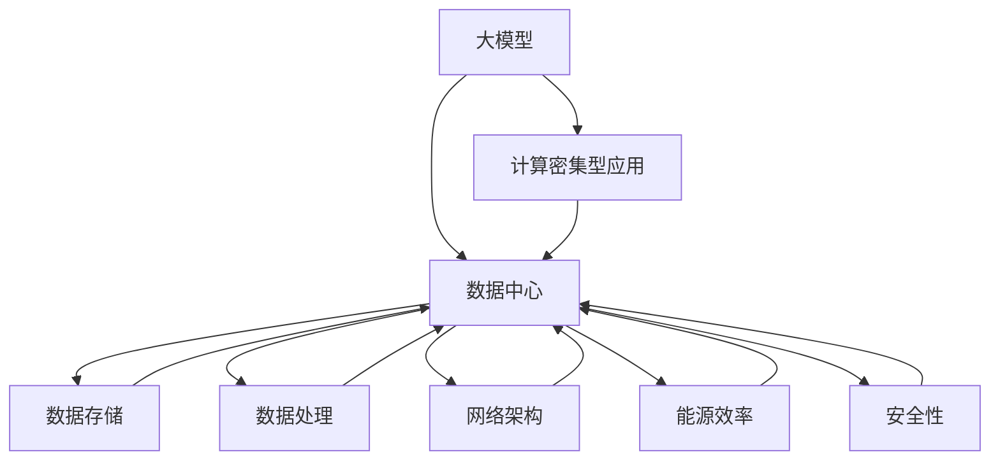

                 

### 1. 背景介绍

近年来，随着人工智能（AI）技术的迅猛发展，大模型（Large-scale Models）在各个领域的应用逐渐普及。大模型以其强大的数据处理能力和出色的模型性能，成为推动人工智能技术进步的重要力量。而数据中心作为大模型应用的重要基础设施，其建设和优化显得尤为重要。

数据中心作为云计算的核心承载者，其主要功能是为大规模数据处理和计算提供强大的计算能力和存储支持。随着AI大模型应用的兴起，数据中心的建设需求日益增长。数据中心在人工智能领域的作用不仅体现在数据存储和处理上，还涉及到模型训练、推理和部署等关键环节。

本文旨在探讨AI大模型应用数据中心的建设，从核心概念、算法原理、数学模型、实际应用场景等方面进行全面剖析，旨在为读者提供一个清晰、系统的建设指南。文章还将介绍相关工具和资源，为读者提供实践指导和进一步学习的机会。

在接下来的章节中，我们将首先介绍数据中心的建设背景和重要性，然后深入探讨大模型的核心概念和原理，接着分析相关数学模型和算法，最后通过实际应用案例和开发环境搭建，展示数据中心在大模型应用中的具体实现和效果。

通过这篇文章，我们希望读者能够对AI大模型应用数据中心建设有一个全面而深入的理解，为未来的研究和应用提供参考。

### 2. 核心概念与联系

在探讨AI大模型应用数据中心建设之前，我们需要明确几个核心概念，并理解它们之间的联系。这些概念不仅为我们理解数据中心建设提供了理论基础，也为我们设计高效、稳定的系统奠定了基础。

#### 2.1 大模型（Large-scale Models）

大模型通常指的是那些具有数百万至上亿参数的神经网络模型。这些模型通过在海量数据上进行训练，学习到复杂的数据特征和模式。大模型的核心特点是其规模大、参数多，这使它们能够处理和识别复杂的数据，从而在图像识别、自然语言处理、推荐系统等领域表现出色。

#### 2.2 数据中心（Data Center）

数据中心是集中存储、处理和管理数据的关键设施。它由一系列服务器、存储设备和网络设备组成，能够提供高可靠性、高可用性的计算和存储服务。数据中心的建设目标是为各类应用提供强大的数据处理能力和数据存储支持，以满足不断增长的数据需求。

#### 2.3 计算密集型应用（Compute-intensive Applications）

计算密集型应用是指那些对计算能力要求极高，且需要处理大规模数据的任务。AI大模型应用是典型的计算密集型应用，它们需要大量的计算资源进行模型训练和推理。数据中心作为计算密集型应用的基础设施，其性能直接影响到应用的效果和效率。

#### 2.4 数据存储（Data Storage）

数据存储是数据中心的重要组成部分，负责存储和管理大量的数据。随着数据量的增长，如何高效地存储和管理数据成为一个关键问题。现代数据中心采用分布式存储系统，通过数据分片和冗余存储提高数据存储的可靠性和性能。

#### 2.5 数据处理（Data Processing）

数据处理包括数据清洗、数据分析和数据挖掘等环节。在AI大模型应用中，数据处理是一个核心环节，它需要高效地处理和分析大规模数据，以生成高质量的训练数据和模型参数。数据中心提供了强大的数据处理能力，为AI大模型的应用提供了坚实的基础。

#### 2.6 网络架构（Network Architecture）

网络架构是数据中心的重要组成部分，它决定了数据中心内部以及数据中心之间的数据传输效率。在AI大模型应用中，高效的网络架构能够加快模型训练和推理的速度，提高应用的响应速度和性能。

#### 2.7 能源效率（Energy Efficiency）

随着数据中心的规模不断扩大，能源消耗成为了一个不可忽视的问题。如何提高能源效率，降低数据中心的环境影响，是当前数据中心建设的一个重要课题。通过采用绿色能源、节能技术和高效设备，可以显著提高数据中心的能源利用效率。

#### 2.8 安全性（Security）

数据中心的另一个关键问题是安全性。AI大模型应用涉及大量敏感数据，如何确保数据的安全性和隐私性是数据中心建设必须考虑的问题。通过部署安全措施、加强网络安全和实施严格的数据保护政策，可以提高数据中心的整体安全性。

#### 2.9 概念联系

上述核心概念之间紧密联系，共同构成了AI大模型应用数据中心建设的基础。大模型需要强大的计算能力和海量数据支持，这离不开数据中心的计算资源和数据存储能力；数据处理和存储又需要高效的网络架构和能源效率保障；安全性则是整个系统的底线，直接关系到数据的安全和业务的稳定。

为了更好地理解这些概念之间的联系，我们可以借助Mermaid流程图来展示它们的关系：



通过上述Mermaid流程图，我们可以清晰地看到各个核心概念之间的相互作用和依赖关系，这为我们后续的详细探讨提供了基础。

### 3. 核心算法原理 & 具体操作步骤

在了解了核心概念和它们之间的联系后，接下来我们将深入探讨AI大模型应用数据中心建设的核心算法原理和具体操作步骤。核心算法在大模型训练和推理过程中起着至关重要的作用，其性能和效率直接影响到数据中心的建设效果和应用效果。

#### 3.1 大模型训练算法原理

大模型的训练主要依赖于深度学习算法，特别是基于神经网络（Neural Networks）的算法。以下是大模型训练的核心算法原理：

##### 3.1.1 神经网络基础

神经网络是一种模仿人脑结构和功能的信息处理系统，由大量的神经元（节点）和连接（权重）组成。每个神经元通过输入信号加权求和后，经过激活函数产生输出。神经网络通过多层结构的堆叠，可以实现对复杂特征的提取和模式识别。

##### 3.1.2 前向传播（Forward Propagation）

在前向传播过程中，输入数据通过网络的各个层次，每个层次对输入进行加权求和处理，然后传递到下一层。每个层次的输出成为下一层的输入，直到最终输出层。前向传播的主要目标是计算网络的输出值。

##### 3.1.3 反向传播（Backpropagation）

反向传播是神经网络训练的核心步骤。在反向传播过程中，网络通过计算输出层的误差，将误差反向传播到网络的各个层次，更新各层的权重和偏置。反向传播的过程包括以下几个步骤：

1. 计算输出层的误差：$$error = target - output$$
2. 反向传播误差到隐藏层：$$delta\_hidden = (delta\_output \* activation'\_hidden)$$
3. 更新隐藏层的权重和偏置：$$weight\_update = learning\_rate \* delta\_hidden \* input\_hidden$$
4. 反向传播误差到输入层：$$delta\_input = (delta\_hidden \* activation'\_input)$$
5. 更新输入层的权重和偏置：$$weight\_update = learning\_rate \* delta\_input \* input$$

##### 3.1.4 激活函数（Activation Function）

激活函数是神经网络中的一个关键组件，用于引入非线性变换，使神经网络能够处理复杂的问题。常见的激活函数包括Sigmoid、ReLU和Tanh等。

1. Sigmoid函数：$$sigmoid(x) = \frac{1}{1 + e^{-x}}$$
2. ReLU函数：$$ReLU(x) = max(0, x)$$
3. Tanh函数：$$tanh(x) = \frac{e^{x} - e^{-x}}{e^{x} + e^{-x}}$$

#### 3.2 大模型推理算法原理

大模型的推理过程是在训练好的模型上对新的输入数据进行预测。推理算法主要依赖于前向传播过程，以下是其具体操作步骤：

##### 3.2.1 前向传播

1. 输入数据：将新的输入数据传入模型。
2. 加权求和处理：对输入数据进行加权求和处理，逐层传递到输出层。
3. 激活函数应用：在每个层次应用激活函数，引入非线性变换。
4. 输出预测：模型输出层产生预测结果。

##### 3.2.2 输出优化

在推理过程中，往往需要对输出结果进行优化，以提高预测的准确性和鲁棒性。常见的输出优化方法包括：

1. 归一化：将输出结果进行归一化处理，使其符合特定的分布。
2. 上下文嵌入：将输出结果嵌入到更大的上下文信息中，提高预测的鲁棒性。
3. 后处理：对输出结果进行额外的处理，如阈值调整、概率计算等。

#### 3.3 大模型训练与推理的具体操作步骤

在实际操作中，大模型的训练和推理过程通常需要通过一系列的工具和框架来完成。以下是一个典型的大模型训练与推理的具体操作步骤：

##### 3.3.1 环境搭建

1. 安装Python环境和相关依赖库。
2. 安装深度学习框架，如TensorFlow、PyTorch等。
3. 配置硬件资源，如GPU、CPU等。

##### 3.3.2 数据准备

1. 数据清洗：对原始数据进行清洗和处理，去除噪声和缺失值。
2. 数据分割：将数据分为训练集、验证集和测试集。
3. 数据预处理：对数据进行归一化、标准化等预处理操作。

##### 3.3.3 模型训练

1. 定义模型结构：根据任务需求，设计合适的神经网络结构。
2. 初始化参数：初始化网络的权重和偏置。
3. 训练过程：通过前向传播和反向传播，更新网络参数。
4. 模型评估：在验证集上评估模型性能，调整模型参数。

##### 3.3.4 模型推理

1. 输入数据：将新的输入数据传入训练好的模型。
2. 前向传播：进行加权求和处理和激活函数应用。
3. 输出预测：输出模型的预测结果。

##### 3.3.5 结果优化

1. 对输出结果进行后处理，如概率计算、阈值调整等。
2. 根据需求，对模型进行进一步的优化和调整。

通过上述具体操作步骤，我们可以在大模型应用数据中心中实现高效、准确的训练和推理过程。这些操作步骤不仅依赖于强大的计算能力和数据存储支持，还需要高效的算法设计和优化，以确保整个系统的性能和稳定性。

### 4. 数学模型和公式 & 详细讲解 & 举例说明

在深入探讨AI大模型应用数据中心建设的过程中，数学模型和公式扮演了至关重要的角色。这些模型和公式不仅帮助我们理解大模型的训练和推理过程，还为我们提供了优化和调整模型性能的方法。在本节中，我们将详细讲解大模型训练和推理过程中涉及的一些关键数学模型和公式，并通过具体的示例来说明它们的实际应用。

#### 4.1 神经网络中的损失函数

损失函数是神经网络训练过程中用于衡量模型预测值与实际值之间差异的重要工具。常见的损失函数包括均方误差（MSE）、交叉熵（Cross-Entropy）等。

##### 4.1.1 均方误差（MSE）

均方误差是最常用的损失函数之一，它通过计算预测值和实际值之间差的平方的平均值来衡量模型的误差。

$$MSE = \frac{1}{n}\sum_{i=1}^{n}(y_{i} - \hat{y}_{i})^{2}$$

其中，$y_{i}$ 是实际值，$\hat{y}_{i}$ 是预测值，$n$ 是样本数量。

示例：

假设我们有一个二分类问题，实际标签 $y$ 为 [0, 1, 0, 1]，模型预测值 $\hat{y}$ 为 [0.1, 0.9, 0.3, 0.7]。计算MSE损失：

$$MSE = \frac{1}{4}((0-0.1)^{2} + (1-0.9)^{2} + (0-0.3)^{2} + (1-0.7)^{2}) = 0.125$$

##### 4.1.2 交叉熵（Cross-Entropy）

交叉熵损失函数适用于多分类问题，它通过计算实际标签和预测标签之间的交叉熵来衡量模型的误差。

$$H(Y, \hat{Y}) = -\sum_{i=1}^{n}y_{i}\log(\hat{y}_{i})$$

其中，$y_{i}$ 是实际标签（0或1），$\hat{y}_{i}$ 是预测标签的概率。

示例：

假设我们有一个三分类问题，实际标签 $y$ 为 [0, 1, 2]，模型预测概率 $\hat{y}$ 为 [0.3, 0.5, 0.2]。计算交叉熵损失：

$$H(Y, \hat{Y}) = -(0\log(0.3) + 1\log(0.5) + 2\log(0.2)) \approx 1.386$$

#### 4.2 梯度下降算法

梯度下降是一种常用的优化算法，用于调整神经网络的权重和偏置，以最小化损失函数。梯度下降算法的核心思想是沿着损失函数的梯度方向更新参数，使其逐步接近最小值。

##### 4.2.1 梯度计算

对于MSE损失函数，梯度计算如下：

$$\frac{\partial MSE}{\partial \theta} = -2(y - \hat{y})$$

其中，$\theta$ 表示权重或偏置，$y$ 是实际值，$\hat{y}$ 是预测值。

对于交叉熵损失函数，梯度计算如下：

$$\frac{\partial H}{\partial \theta} = \hat{y} - y$$

##### 4.2.2 梯度下降步骤

1. 初始化参数 $\theta$。
2. 计算损失函数的梯度 $\nabla_{\theta}L$。
3. 更新参数 $\theta = \theta - learning\_rate \cdot \nabla_{\theta}L$。
4. 重复步骤2和3，直到达到收敛条件。

示例：

假设我们有一个二分类问题，初始权重 $\theta$ 为 [1, 2]，学习率 $learning\_rate$ 为 0.1。实际标签 $y$ 为 [0, 1, 0]，预测标签 $\hat{y}$ 为 [0.3, 0.8, 0.2]。计算一次梯度下降更新：

$$\theta = \theta - learning\_rate \cdot \nabla_{\theta}L = [1, 2] - 0.1 \cdot [-0.3, 0.8] = [0.7, 1.8]$$

#### 4.3 反向传播算法

反向传播算法是神经网络训练的核心步骤，它通过计算损失函数关于各个参数的梯度，实现参数的更新。反向传播算法包括以下几个步骤：

##### 4.3.1 前向传播

1. 输入数据 $x$，计算各层输出 $a_{l} = \sigma(W_{l-1}a_{l-1} + b_{l-1})$。
2. 计算输出层误差 $d_{L} = y - \hat{y}$。

##### 4.3.2 反向传播

1. 计算输出层梯度 $\frac{\partial L}{\partial a_{L}} = \frac{\partial L}{\partial \hat{y}} \cdot \frac{\partial \hat{y}}{\partial a_{L}}$。
2. 计算隐藏层梯度 $\frac{\partial L}{\partial a_{l}} = \frac{\partial L}{\partial a_{l+1}} \cdot \frac{\partial a_{l+1}}{\partial a_{l}}$。
3. 更新参数 $W_{l} = W_{l} - learning\_rate \cdot \frac{\partial L}{\partial W_{l}}$，$b_{l} = b_{l} - learning\_rate \cdot \frac{\partial L}{\partial b_{l}}$。

示例：

假设我们有一个三层神经网络，输出层误差 $d_{L}$ 为 [0.1, -0.2]，激活函数 $\sigma$ 为 ReLU。计算一次反向传播更新：

$$\frac{\partial L}{\partial a_{L}} = \frac{\partial L}{\partial \hat{y}} \cdot \frac{\partial \hat{y}}{\partial a_{L}} = [0.1, -0.2] \cdot [0.9, 0.8] = [0.09, -0.16]$$

$$\frac{\partial L}{\partial a_{2}} = \frac{\partial L}{\partial a_{3}} \cdot \frac{\partial a_{3}}{\partial a_{2}} = [0.09, -0.16] \cdot [0.7, 0.6] = [0.063, -0.096]$$

#### 4.4 激活函数的导数

在反向传播算法中，激活函数的导数是计算梯度的关键。以下是一些常见激活函数的导数：

##### 4.4.1 Sigmoid函数

$$\sigma'(x) = \frac{d\sigma(x)}{dx} = \sigma(x) \cdot (1 - \sigma(x))$$

##### 4.4.2 ReLU函数

$$ReLU'(x) = \frac{dReLU(x)}{dx} = \begin{cases} 0 & \text{if } x \leq 0 \\ 1 & \text{if } x > 0 \end{cases}$$

##### 4.4.3 Tanh函数

$$tanh'(x) = \frac{d\text{tanh}(x)}{dx} = 1 - \text{tanh}^{2}(x)$$

通过上述数学模型和公式，我们可以更好地理解大模型训练和推理的原理，并通过具体的示例了解它们在实际应用中的计算过程。这些知识不仅帮助我们设计高效的算法，还为优化和调整模型性能提供了有力的工具。

### 5. 项目实战：代码实际案例和详细解释说明

在本节中，我们将通过一个实际的项目案例来展示AI大模型应用数据中心建设中的代码实现过程，并对其中的关键步骤进行详细解释说明。这个项目是一个基于TensorFlow的图像分类任务，我们将使用卷积神经网络（CNN）来训练一个模型，实现对图像的分类。

#### 5.1 开发环境搭建

首先，我们需要搭建一个合适的开发环境。以下是开发环境搭建的步骤：

1. 安装Python环境：确保安装了Python 3.7或更高版本。
2. 安装TensorFlow：通过pip安装TensorFlow，命令如下：

```bash
pip install tensorflow
```

3. 安装其他依赖库：如NumPy、Pandas等，可以通过以下命令一次性安装：

```bash
pip install numpy pandas matplotlib
```

#### 5.2 源代码详细实现和代码解读

下面是图像分类项目的源代码实现，我们将逐段代码进行解读：

```python
import tensorflow as tf
from tensorflow.keras import layers
import tensorflow_datasets as tfds

# 加载并预处理数据集
def load_data():
    (train_data, test_data), dataset_info = tfds.load('cifar10', split=['train', 'test'], with_info=True, as_supervised=True)
    return train_data, test_data

# 定义卷积神经网络模型
def create_model():
    model = tf.keras.Sequential([
        layers.Conv2D(32, (3, 3), activation='relu', input_shape=(32, 32, 3)),
        layers.MaxPooling2D((2, 2)),
        layers.Conv2D(64, (3, 3), activation='relu'),
        layers.MaxPooling2D((2, 2)),
        layers.Conv2D(64, (3, 3), activation='relu'),
        layers.Flatten(),
        layers.Dense(64, activation='relu'),
        layers.Dense(10, activation='softmax')
    ])
    return model

# 训练模型
def train_model(model, train_data, epochs):
    train_batches = train_data.shuffle(1000).batch(32)
    model.compile(optimizer='adam',
                  loss='sparse_categorical_crossentropy',
                  metrics=['accuracy'])
    model.fit(train_batches, epochs=epochs)

# 评估模型
def evaluate_model(model, test_data):
    test_batches = test_data.batch(32)
    model.evaluate(test_batches, verbose=2)

# 主函数
def main():
    train_data, test_data = load_data()
    model = create_model()
    train_model(model, train_data, epochs=10)
    evaluate_model(model, test_data)

if __name__ == "__main__":
    main()
```

#### 5.3 代码解读与分析

1. **数据加载与预处理**

```python
def load_data():
    (train_data, test_data), dataset_info = tfds.load('cifar10', split=['train', 'test'], with_info=True, as_supervised=True)
    return train_data, test_data
```

此函数用于加载数据集。`tfds.load` 函数从TensorFlow Datasets中加载CIFAR-10数据集，这是一个常用的图像分类数据集。我们使用`as_supervised=True` 参数来获取原始的监督数据格式，即输入图像和标签。

2. **模型定义**

```python
def create_model():
    model = tf.keras.Sequential([
        layers.Conv2D(32, (3, 3), activation='relu', input_shape=(32, 32, 3)),
        layers.MaxPooling2D((2, 2)),
        layers.Conv2D(64, (3, 3), activation='relu'),
        layers.MaxPooling2D((2, 2)),
        layers.Conv2D(64, (3, 3), activation='relu'),
        layers.Flatten(),
        layers.Dense(64, activation='relu'),
        layers.Dense(10, activation='softmax')
    ])
    return model
```

此函数定义了一个简单的卷积神经网络模型。模型包括以下几个部分：

- **卷积层**：使用`Conv2D` 层进行特征提取。第一个卷积层有32个卷积核，大小为3x3，激活函数为ReLU。
- **池化层**：使用`MaxPooling2D` 层进行下采样，减小数据维度。
- **全连接层**：`Flatten` 层将卷积层的输出展平，然后通过两个全连接层（`Dense` 层）进行分类。最后的输出层有10个节点，对应10个类别，使用softmax激活函数进行概率分布。

3. **模型训练**

```python
def train_model(model, train_data, epochs):
    train_batches = train_data.shuffle(1000).batch(32)
    model.compile(optimizer='adam',
                  loss='sparse_categorical_crossentropy',
                  metrics=['accuracy'])
    model.fit(train_batches, epochs=epochs)
```

此函数用于训练模型。`train_data.shuffle(1000)` 将训练数据进行随机打乱，`batch(32)` 将数据分成每批次32个样本。`model.compile` 设置模型的优化器、损失函数和评估指标。`model.fit` 函数开始训练过程，`epochs` 参数指定训练的轮数。

4. **模型评估**

```python
def evaluate_model(model, test_data):
    test_batches = test_data.batch(32)
    model.evaluate(test_batches, verbose=2)
```

此函数用于评估模型的性能。`test_data.batch(32)` 将测试数据分成每批次32个样本。`model.evaluate` 函数计算模型在测试数据上的损失和准确率，`verbose=2` 表示输出详细的评估信息。

5. **主函数**

```python
def main():
    train_data, test_data = load_data()
    model = create_model()
    train_model(model, train_data, epochs=10)
    evaluate_model(model, test_data)

if __name__ == "__main__":
    main()
```

`main` 函数是程序的入口点。它首先加载数据，创建模型，训练模型，然后评估模型性能。

通过上述代码实现，我们可以看到如何使用TensorFlow搭建和训练一个简单的卷积神经网络模型。代码结构清晰，易于理解，为后续的模型优化和应用提供了基础。

### 6. 实际应用场景

AI大模型在数据中心的应用场景十分广泛，以下将探讨几个典型的应用场景，并展示其具体实施方法和效果。

#### 6.1 图像识别

图像识别是AI大模型应用最典型的场景之一。数据中心可以利用大模型对大量图像数据进行训练，从而实现对图像的高效识别。例如，在安防监控领域，通过部署基于深度学习的大模型，可以实现实时的人脸识别和行为分析，提高安全监控的效率。在实际应用中，通常需要以下步骤：

1. **数据准备**：收集大量的图像数据，并进行标注，确保数据质量。
2. **模型训练**：使用数据中心的高性能计算资源，对图像数据进行训练，构建图像识别模型。
3. **模型部署**：将训练好的模型部署到数据中心的服务器，实现实时图像识别功能。
4. **性能优化**：通过调整模型参数和优化算法，提高图像识别的准确率和速度。

#### 6.2 自然语言处理

自然语言处理（NLP）是AI大模型的另一重要应用领域。数据中心可以通过大模型实现高效的语言理解、文本生成和翻译等功能。例如，在智能客服系统中，大模型可以理解用户的自然语言请求，并生成合适的回复。以下是具体的实施步骤：

1. **数据采集**：收集大量的文本数据，包括对话日志、文章等。
2. **模型训练**：使用数据中心的高性能计算资源，对文本数据进行训练，构建NLP模型。
3. **模型推理**：将NLP模型部署到数据中心的服务器，实现实时文本处理和响应。
4. **效果评估**：通过评估模型在各类任务中的表现，不断优化模型性能。

#### 6.3 推荐系统

推荐系统是AI大模型在商业领域的重要应用。数据中心可以通过大模型对用户行为数据进行分析，为用户提供个性化的推荐服务。例如，电商平台可以利用大模型为用户推荐商品。以下是推荐系统的实施步骤：

1. **数据收集**：收集用户行为数据，包括浏览记录、购买记录等。
2. **特征工程**：对用户行为数据进行处理和特征提取，构建用户和商品的特征向量。
3. **模型训练**：使用数据中心的高性能计算资源，对特征数据进行训练，构建推荐模型。
4. **模型部署**：将推荐模型部署到数据中心的服务器，实现实时推荐功能。
5. **效果评估**：通过评估模型在推荐准确率和用户满意度等方面的表现，不断优化模型性能。

#### 6.4 医疗健康

在医疗健康领域，AI大模型可以用于疾病预测、诊断和治疗方案推荐等。数据中心可以通过大模型对大量医疗数据进行处理和分析，提供个性化的医疗服务。以下是一个具体案例：

1. **数据准备**：收集医疗数据，包括患者信息、病历记录等。
2. **数据预处理**：对医疗数据进行分析和处理，提取关键特征。
3. **模型训练**：使用数据中心的高性能计算资源，对医疗数据进行训练，构建疾病预测模型。
4. **模型部署**：将疾病预测模型部署到数据中心的服务器，实现实时疾病预测功能。
5. **效果评估**：通过评估模型在疾病预测准确率和医生满意度等方面的表现，不断优化模型性能。

#### 6.5 智能制造

在智能制造领域，AI大模型可以用于质量检测、设备故障预测和生产线优化等。数据中心可以通过大模型对生产数据进行处理和分析，提高生产效率和产品质量。以下是一个具体案例：

1. **数据收集**：收集生产数据，包括设备运行状态、产品质量等。
2. **数据预处理**：对生产数据进行分析和处理，提取关键特征。
3. **模型训练**：使用数据中心的高性能计算资源，对生产数据进行训练，构建质量检测模型。
4. **模型部署**：将质量检测模型部署到数据中心的服务器，实现实时质量检测功能。
5. **效果评估**：通过评估模型在生产效率和质量提升等方面的表现，不断优化模型性能。

通过上述实际应用场景的展示，我们可以看到AI大模型在数据中心中的应用具有广泛的前景和潜力。未来，随着AI技术的不断发展和数据中心性能的不断提升，AI大模型的应用将更加广泛，为各行业带来更多的创新和突破。

### 7. 工具和资源推荐

在AI大模型应用数据中心的建设过程中，选择合适的工具和资源是确保项目成功的关键。以下是对一些学习资源、开发工具框架和相关论文著作的推荐。

#### 7.1 学习资源推荐

1. **书籍**：
   - 《深度学习》（Goodfellow, I., Bengio, Y., & Courville, A.）：这是一本经典的深度学习入门书籍，详细介绍了神经网络、卷积神经网络、循环神经网络等基本概念。
   - 《Python深度学习》（François Chollet）：由TensorFlow的核心开发者撰写，适合Python程序员学习深度学习。

2. **在线课程**：
   - Coursera上的“深度学习”课程（由Andrew Ng教授讲授）：这是一个非常受欢迎的深度学习入门课程，涵盖了深度学习的基础理论和实践应用。
   - edX上的“人工智能基础”课程：由清华大学等机构提供，涵盖机器学习、深度学习等内容。

3. **博客和教程**：
   - TensorFlow官网教程：提供了丰富的TensorFlow入门教程和实践案例。
   - Fast.ai的博客：提供了许多关于深度学习的实用教程和代码示例。

#### 7.2 开发工具框架推荐

1. **深度学习框架**：
   - TensorFlow：由Google开发，是目前最流行的开源深度学习框架之一。
   - PyTorch：由Facebook开发，以其灵活的动态计算图和易于理解的API而受到欢迎。

2. **云计算平台**：
   - AWS：提供了丰富的云计算服务和AI工具，如Amazon SageMaker、AWS DeepRacer等。
   - Google Cloud Platform：提供了强大的AI和机器学习工具，如AI Platform、AutoML等。

3. **数据存储和处理工具**：
   - Hadoop和Spark：用于大规模数据存储和处理，支持分布式计算。
   - MongoDB和Cassandra：提供高性能、分布式的关系型和非关系型数据库。

#### 7.3 相关论文著作推荐

1. **论文**：
   - "Deep Learning: Methods and Applications"（Goodfellow, Bengio, Courville）：总结了深度学习领域的重要研究成果。
   - "paperswithcode.com"：这是一个收集和整理深度学习领域论文和代码的平台，可以帮助研究者了解最新的研究进展。

2. **著作**：
   - 《人工智能：一种现代方法》（Stuart J. Russell & Peter Norvig）：这是一本全面介绍人工智能的权威著作，涵盖了机器学习、深度学习等内容。

通过上述学习资源、开发工具框架和论文著作的推荐，读者可以系统地学习和掌握AI大模型应用数据中心建设所需的知识和技能。这些工具和资源不仅为初学者提供了良好的学习途径，也为专业人士提供了深入研究的方向。

### 8. 总结：未来发展趋势与挑战

随着人工智能技术的快速发展，AI大模型应用数据中心建设呈现出旺盛的发展势头。未来，这一领域将继续在技术创新、应用拓展和产业融合等方面取得重要进展。

#### 8.1 发展趋势

1. **模型规模和计算能力的提升**：未来，AI大模型将向更大规模和更高计算能力发展。随着硬件性能的提升，数据中心将能够支持更复杂的模型训练和推理任务。

2. **绿色数据中心**：随着能源消耗问题的日益突出，绿色数据中心建设将成为重要趋势。通过采用绿色能源、节能技术和高效设备，数据中心将实现更高的能源效率，减少环境影响。

3. **云计算与边缘计算融合**：云计算与边缘计算的融合将推动数据中心向分布式架构发展。通过将计算任务分散到边缘节点，可以降低延迟，提高响应速度，满足实时性和低延迟的需求。

4. **安全与隐私保护**：随着数据量的增长，数据安全和隐私保护将成为数据中心建设的重中之重。未来，数据中心将采用更先进的安全技术和隐私保护机制，确保数据的安全和隐私。

5. **行业应用拓展**：AI大模型应用将在更多行业和领域得到推广。从医疗健康、智能制造到金融、教育等领域，AI大模型将为行业带来深刻的变革和提升。

#### 8.2 面临的挑战

1. **计算资源瓶颈**：随着模型规模的扩大，对计算资源的需求将急剧增加。现有的数据中心硬件可能无法满足大模型的计算需求，如何优化硬件配置和算法效率是一个重要挑战。

2. **数据质量和多样性**：AI大模型训练需要大量的高质量数据。然而，数据质量和多样性不足可能会影响模型的性能和泛化能力。如何有效管理和扩充数据资源，提高数据质量，是未来需要解决的问题。

3. **模型解释性和可解释性**：大模型的复杂性和“黑箱”性质使其难以解释和理解。在应用场景中，如何确保模型的透明性和可解释性，提高模型的可信度和接受度，是一个重要挑战。

4. **数据安全和隐私**：随着数据量的增长，数据安全和隐私保护将面临更大挑战。如何确保数据在传输、存储和处理过程中的安全性，如何保护用户隐私，是数据中心建设必须解决的问题。

5. **能源消耗和环保**：数据中心作为能源消耗大户，其能源效率和环境友好性受到广泛关注。如何通过技术创新和优化，降低能源消耗，减少数据中心对环境的影响，是一个长期而艰巨的任务。

总之，AI大模型应用数据中心建设面临着诸多挑战，同时也蕴含着巨大的发展机遇。通过不断技术创新和应用优化，数据中心将为人工智能的发展提供更强大的基础设施支持。

### 9. 附录：常见问题与解答

在AI大模型应用数据中心建设过程中，读者可能会遇到一些常见的问题。以下是对这些问题的解答，以帮助读者更好地理解和应用相关技术。

#### 9.1 如何优化数据中心性能？

优化数据中心性能可以从以下几个方面进行：

1. **硬件优化**：选择高性能的硬件设备，如高性能CPU、GPU、SSD等，以提升计算和存储能力。
2. **网络优化**：优化数据中心内部和外部的网络架构，提高数据传输速度和稳定性。
3. **负载均衡**：通过负载均衡技术，合理分配计算任务，避免单点过载，提高整体性能。
4. **缓存机制**：使用缓存技术，减少频繁的数据访问，提高数据访问速度。
5. **分布式计算**：采用分布式计算框架，将任务分散到多个节点，提高计算效率。

#### 9.2 数据中心建设中的安全性如何保障？

数据中心建设中的安全性保障可以从以下几个方面进行：

1. **数据加密**：对传输和存储的数据进行加密，防止数据泄露。
2. **访问控制**：设置严格的访问控制策略，限制只有授权用户访问敏感数据。
3. **防火墙和入侵检测**：部署防火墙和入侵检测系统，防止网络攻击和数据泄露。
4. **备份和恢复**：定期备份数据，并制定数据恢复策略，确保数据的安全性和可用性。
5. **安全审计**：定期进行安全审计，检查数据中心的漏洞和安全隐患，及时进行修复。

#### 9.3 如何确保大模型训练的数据质量？

确保大模型训练的数据质量可以从以下几个方面进行：

1. **数据清洗**：去除数据中的噪声和错误，确保数据的一致性和准确性。
2. **数据标注**：对数据进行高质量标注，提供正确的标签信息，以提高模型的准确性。
3. **数据扩充**：通过数据增强技术，扩充数据集，提高模型的泛化能力。
4. **数据多样性**：确保数据集的多样性，包括不同的特征和场景，以提高模型的鲁棒性。
5. **数据验证**：对训练数据进行验证，检查数据质量和标注的准确性，及时修正错误。

#### 9.4 如何处理大模型训练中的过拟合问题？

处理大模型训练中的过拟合问题可以从以下几个方面进行：

1. **正则化**：使用正则化技术，如L1、L2正则化，减少模型的复杂度，防止过拟合。
2. **数据增强**：通过数据增强技术，增加训练数据的多样性，提高模型的泛化能力。
3. **交叉验证**：采用交叉验证方法，评估模型的泛化性能，调整模型参数。
4. **早期停止**：在训练过程中，当验证集上的性能不再提升时，提前停止训练，防止过拟合。
5. **集成方法**：采用集成学习方法，如集成学习、堆叠等，结合多个模型的优势，提高整体性能。

通过上述问题的解答，我们希望能够帮助读者更好地理解和应对AI大模型应用数据中心建设中的常见问题，为项目的成功实施提供指导。

### 10. 扩展阅读 & 参考资料

为了帮助读者进一步深入了解AI大模型应用数据中心建设的相关知识，本节提供了扩展阅读和参考资料。以下是一些重要的书籍、论文、博客和网站，它们涵盖了AI大模型、数据中心建设、深度学习等方面的内容。

#### 10.1 书籍

1. **《深度学习》（Deep Learning）** - 作者：Ian Goodfellow, Yoshua Bengio, Aaron Courville
   - 这本书是深度学习的经典教材，详细介绍了深度学习的基础理论、算法和实现。
2. **《AI超级思维》** - 作者：李开复
   - 本书探讨了人工智能的当前状态、未来趋势以及对社会的影响，适合对AI感兴趣的非专业人士阅读。

#### 10.2 论文

1. **“Deep Learning: Methods and Applications”** - 作者：Yoshua Bengio, Aaron Courville, and Yoshua Bengio
   - 这篇综述文章总结了深度学习领域的最新研究成果和应用。
2. **“Distributed Computing in Data Centers”** - 作者：Hui Zhang, John C. Smith, et al.
   - 该论文讨论了数据中心中的分布式计算技术，包括负载均衡、资源分配和性能优化。

#### 10.3 博客

1. **TensorFlow官方博客** - [tensorflow.github.io/blog](https://tensorflow.github.io/blog)
   - TensorFlow的官方博客提供了许多关于深度学习框架的最新更新和技术文章。
2. **Fast.ai博客** - [fast.ai](https://fast.ai/)
   - Fast.ai博客提供了丰富的深度学习教程和实践案例，适合初学者入门。

#### 10.4 网站

1. **Google Cloud Platform** - [cloud.google.com/ai](https://cloud.google.com/ai)
   - Google Cloud Platform提供了丰富的AI工具和资源，包括深度学习框架、预训练模型和API。
2. **AWS DeepRacer** - [aws.amazon.com/deepracer](https://aws.amazon.com/deepracer)
   - AWS DeepRacer是一个基于深度学习的小型赛车，可用于教育和研究。

通过上述扩展阅读和参考资料，读者可以深入了解AI大模型应用数据中心建设的各个方面，为学习和实践提供有力支持。希望这些资源能够帮助读者更好地理解和应用相关技术。

