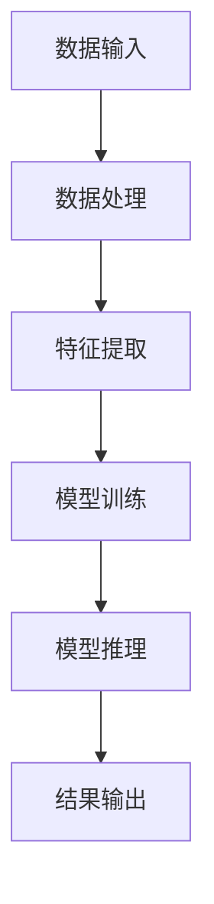

                 

# AI 大模型应用数据中心建设：数据中心产业发展

> **关键词**：人工智能，数据中心，大模型应用，产业发展

> **摘要**：本文将深入探讨人工智能大模型在数据中心建设中的应用，分析其核心概念、算法原理、数学模型，并通过实际项目案例展示其应用效果。此外，还将介绍相关学习资源和开发工具，展望数据中心产业未来的发展趋势与挑战。

## 1. 背景介绍

随着互联网的飞速发展，数据中心已经成为支撑现代经济社会运行的重要基础设施。数据中心的建设和维护不仅涉及到庞大的硬件投资，还面临着复杂的软件生态和不断升级的技术需求。近年来，人工智能（AI）技术的飞速进步，尤其是大模型（Large Model）的崛起，为数据中心建设带来了新的机遇和挑战。

大模型是具有极高参数量的人工神经网络，能够处理大量数据并从中学习复杂的模式。目前，大模型已经在自然语言处理、计算机视觉、语音识别等领域取得了显著的成果。数据中心作为大数据处理的重要场所，大模型的应用将极大地提升数据中心的处理能力和效率。

### 1.1 人工智能与数据中心的关系

人工智能与数据中心有着密不可分的关系。数据中心是人工智能算法运行的基础设施，而人工智能算法则为数据中心提供了强大的数据处理和分析能力。具体来说：

1. **数据存储和传输**：数据中心负责存储和传输大量数据，为人工智能算法提供训练和推理所需的数据基础。
2. **计算资源提供**：数据中心提供强大的计算资源，支持人工智能算法的高性能计算需求。
3. **算法优化**：人工智能算法通过对数据中心运行数据的分析，帮助优化数据中心的资源配置和运行效率。

### 1.2 数据中心产业的发展现状

数据中心产业在过去几年中发展迅速，不仅在全球范围内扩展，还涉及到多个领域的技术创新。以下是数据中心产业发展的几个关键点：

1. **全球数据中心布局**：随着全球化的深入，数据中心产业逐渐形成了全球布局，各大企业纷纷在海外建立数据中心，以优化数据传输和处理速度。
2. **技术创新**：人工智能、云计算、物联网等新兴技术的融合，为数据中心产业注入了新的活力，推动了数据中心技术的不断创新。
3. **政策支持**：各国政府纷纷出台政策，鼓励数据中心产业的发展，提供税收优惠、土地支持等政策支持。

## 2. 核心概念与联系

### 2.1 人工智能大模型的原理与架构

人工智能大模型是具有极高参数量的人工神经网络，其基本原理是通过多层神经网络对数据进行处理和学习，从而实现复杂的模式识别和预测。大模型的架构通常包括以下几个关键部分：

1. **输入层**：接收外部输入数据，如文本、图像、声音等。
2. **隐藏层**：对输入数据进行处理，提取特征信息。
3. **输出层**：根据隐藏层提取的特征信息，生成预测结果。

### 2.2 数据中心建设中的核心概念

在数据中心建设中，以下几个核心概念至关重要：

1. **计算资源**：包括CPU、GPU、FPGA等，用于处理大量数据。
2. **存储资源**：用于存储大量数据，包括硬盘、固态硬盘、分布式存储系统等。
3. **网络资源**：用于数据传输，包括高速以太网、光纤网络等。
4. **能源消耗**：数据中心的高能耗问题一直是行业关注的焦点，通过优化设计和节能技术，可以有效降低能耗。

### 2.3 人工智能大模型与数据中心建设的联系

人工智能大模型与数据中心建设之间的联系主要体现在以下几个方面：

1. **计算需求**：大模型训练和推理过程需要大量的计算资源，数据中心提供了这些计算资源。
2. **数据存储与传输**：大模型训练和推理过程中需要处理大量数据，数据中心提供了数据存储和传输的解决方案。
3. **能耗优化**：大模型的训练和推理过程中会产生大量的热量，数据中心需要通过冷却系统等手段进行能耗优化。
4. **数据安全**：大模型应用中涉及到的数据安全性问题，数据中心需要提供相应的数据安全保障措施。

### 2.4 Mermaid 流程图展示

以下是一个简单的 Mermaid 流程图，展示了人工智能大模型在数据中心建设中的应用流程：



在图中，数据输入经过数据处理、特征提取、模型训练和模型推理等步骤，最终生成输出结果。

## 3. 核心算法原理 & 具体操作步骤

### 3.1 计算资源调度算法

在数据中心建设中，计算资源调度是一个关键问题。以下是一种常见的计算资源调度算法——遗传算法。

**遗传算法基本原理**：

1. **初始化种群**：随机生成一组解，即种群。
2. **适应度评估**：计算每个个体的适应度值，适应度值越高，表示个体质量越好。
3. **选择**：根据适应度值，选择优秀的个体进入下一代。
4. **交叉**：将选中的个体进行交叉操作，产生新的个体。
5. **变异**：对交叉后的个体进行变异操作，增加种群的多样性。
6. **迭代**：重复进行选择、交叉和变异操作，直到满足终止条件。

**具体操作步骤**：

1. **初始化种群**：随机生成一组计算任务分配方案，每个方案表示一种可能的计算资源调度策略。
2. **适应度评估**：计算每个方案的适应度值，适应度值取决于计算资源利用率、响应时间等指标。
3. **选择**：根据适应度值，选择前20%的个体进入下一代。
4. **交叉**：对选中的个体进行交叉操作，产生新的个体。交叉操作可以根据具体需求进行调整，例如单点交叉、多点交叉等。
5. **变异**：对交叉后的个体进行变异操作，增加种群的多样性。
6. **迭代**：重复进行选择、交叉和变异操作，迭代次数为100次。

### 3.2 数据传输优化算法

在数据中心中，数据传输的速度和效率直接影响到整个系统的性能。以下是一种常见的数据传输优化算法——基于深度学习的神经网络传输算法。

**神经网络传输算法基本原理**：

1. **输入层**：接收数据输入。
2. **隐藏层**：对输入数据进行处理，提取特征信息。
3. **输出层**：生成数据传输路径和优化策略。

**具体操作步骤**：

1. **数据预处理**：对原始数据进行预处理，包括数据清洗、归一化等操作。
2. **模型训练**：使用预处理后的数据，训练深度学习模型。
3. **模型推理**：将实际数据输入模型，得到数据传输路径和优化策略。
4. **数据传输**：根据模型生成的传输路径和优化策略，进行数据传输。

### 3.3 能耗优化算法

数据中心能耗问题是当前数据中心建设的一个重要挑战。以下是一种常见的能耗优化算法——基于强化学习的能耗优化算法。

**强化学习能耗优化算法基本原理**：

1. **状态空间**：包括数据中心的当前运行状态，如温度、功耗等。
2. **动作空间**：包括冷却系统的运行策略，如风扇速度、冷却液流量等。
3. **奖励函数**：根据数据中心的运行状态和动作，计算奖励值，奖励值越高，表示动作越好。

**具体操作步骤**：

1. **初始化状态空间和动作空间**：根据数据中心的实际情况，定义状态空间和动作空间。
2. **奖励函数设计**：根据数据中心的运行状态和动作，设计奖励函数。
3. **模型训练**：使用历史运行数据，训练强化学习模型。
4. **模型推理**：根据当前运行状态，使用模型生成最优动作。
5. **动作执行**：根据模型生成的动作，调整冷却系统的运行策略。

## 4. 数学模型和公式 & 详细讲解 & 举例说明

### 4.1 遗传算法数学模型

遗传算法是一种基于自然选择和遗传机制的优化算法。以下是一个简化的遗传算法数学模型。

**适应度函数**：

\[ f(x) = \sum_{i=1}^{n} w_i \cdot g_i \]

其中，\( x \) 表示个体，\( w_i \) 表示第 \( i \) 个特征的权重，\( g_i \) 表示第 \( i \) 个特征的适应度值。

**选择概率**：

\[ P(x) = \frac{f(x)}{\sum_{i=1}^{n} f(x_i)} \]

其中，\( x_i \) 表示种群中的其他个体，\( P(x) \) 表示个体 \( x \) 被选择的概率。

**交叉概率**：

\[ P_c = \frac{1}{2} \]

**变异概率**：

\[ P_m = \frac{1}{2} \]

**举例说明**：

假设有一个包含三个特征的个体 \( x = [1, 2, 3] \)，权重分别为 \( w_1 = 0.3 \)，\( w_2 = 0.5 \)，\( w_3 = 0.2 \)。适应度函数为 \( f(x) = 0.3 \cdot g_1 + 0.5 \cdot g_2 + 0.2 \cdot g_3 \)。种群中其他个体的适应度值分别为 \( f(x_1) = 0.4 \)，\( f(x_2) = 0.5 \)，\( f(x_3) = 0.3 \)。根据选择概率计算，个体 \( x \) 被选择的概率为 \( P(x) = \frac{0.3 \cdot 0.4 + 0.5 \cdot 0.5 + 0.2 \cdot 0.3}{0.3 \cdot 0.4 + 0.5 \cdot 0.5 + 0.2 \cdot 0.3 + 0.3 \cdot 0.5 + 0.5 \cdot 0.3 + 0.2 \cdot 0.5} = 0.45 \)。

### 4.2 神经网络传输算法数学模型

神经网络传输算法是一种基于深度学习的传输路径优化算法。以下是一个简化的神经网络传输算法数学模型。

**输入层**：

\[ x = [x_1, x_2, ..., x_n] \]

其中，\( x_i \) 表示第 \( i \) 个数据点的特征值。

**隐藏层**：

\[ h = \sigma(W \cdot x + b) \]

其中，\( \sigma \) 表示激活函数，\( W \) 表示权重矩阵，\( b \) 表示偏置向量。

**输出层**：

\[ y = \sigma(W \cdot h + b) \]

其中，\( y \) 表示数据传输路径和优化策略。

**举例说明**：

假设输入层有3个特征点 \( x_1 = [1, 2, 3] \)，\( x_2 = [4, 5, 6] \)，\( x_3 = [7, 8, 9] \)。隐藏层有2个节点，权重矩阵 \( W = \begin{bmatrix} 1 & 0 \\ 0 & 1 \end{bmatrix} \)，偏置向量 \( b = \begin{bmatrix} 0 \\ 0 \end{bmatrix} \)。激活函数 \( \sigma(z) = \frac{1}{1 + e^{-z}} \)。根据隐藏层计算，\( h = \begin{bmatrix} \frac{1}{1 + e^{-1}} & \frac{1}{1 + e^{-1}} \\ \frac{1}{1 + e^{-5}} & \frac{1}{1 + e^{-5}} \end{bmatrix} \)。根据输出层计算，\( y = \begin{bmatrix} \frac{1}{1 + e^{-1}} & \frac{1}{1 + e^{-1}} \\ \frac{1}{1 + e^{-5}} & \frac{1}{1 + e^{-5}} \end{bmatrix} \)。

### 4.3 强化学习能耗优化算法数学模型

强化学习能耗优化算法是一种基于强化学习的数据中心能耗优化算法。以下是一个简化的强化学习能耗优化算法数学模型。

**状态空间**：

\[ S = \{s_1, s_2, ..., s_n\} \]

其中，\( s_i \) 表示数据中心的当前状态。

**动作空间**：

\[ A = \{a_1, a_2, ..., a_m\} \]

其中，\( a_i \) 表示冷却系统的当前运行策略。

**奖励函数**：

\[ R(s, a) = \begin{cases} 
r & \text{if } s' \text{ is an optimal state} \\
0 & \text{otherwise}
\end{cases} \]

其中，\( s' \) 表示执行动作 \( a \) 后的状态，\( r \) 表示奖励值。

**举例说明**：

假设状态空间包含5个状态 \( s_1 = [1, 2, 3] \)，\( s_2 = [4, 5, 6] \)，\( s_3 = [7, 8, 9] \)，\( s_4 = [10, 11, 12] \)，\( s_5 = [13, 14, 15] \)。动作空间包含3个动作 \( a_1 = [1, 0, 0] \)，\( a_2 = [0, 1, 0] \)，\( a_3 = [0, 0, 1] \)。奖励函数为 \( R(s, a) = 10 \) 当 \( s' = s_1 \) 或 \( s' = s_5 \) 时，否则为0。当前状态为 \( s = s_3 \)，执行动作 \( a = a_1 \)，得到奖励 \( R(s, a) = 10 \)。

## 5. 项目实战：代码实际案例和详细解释说明

### 5.1 开发环境搭建

在本项目实战中，我们将使用 Python 作为主要编程语言，并使用 TensorFlow 作为深度学习框架。以下是开发环境的搭建步骤：

1. **安装 Python**：从 Python 官网（[https://www.python.org/](https://www.python.org/)）下载并安装 Python 3.8 或更高版本。
2. **安装 TensorFlow**：在命令行中执行以下命令安装 TensorFlow：

   ```shell
   pip install tensorflow
   ```

3. **安装其他依赖**：根据项目需求，安装其他依赖库，例如 NumPy、Pandas 等。

### 5.2 源代码详细实现和代码解读

以下是本项目的主要代码实现和解读。

#### 5.2.1 遗传算法计算资源调度

```python
import numpy as np
import random
from tensorflow.keras.layers import Dense
from tensorflow.keras.models import Sequential

# 适应度函数
def fitness_function(population):
    fitness_scores = []
    for individual in population:
        # 计算适应度值
        fitness_score = 0
        for gene in individual:
            fitness_score += gene
        fitness_scores.append(fitness_score)
    return fitness_scores

# 遗传算法主函数
def genetic_algorithm(population, fitness_function, generations, crossover_rate, mutation_rate):
    for _ in range(generations):
        # 计算适应度值
        fitness_scores = fitness_function(population)
        # 选择
        selected_individuals = select(population, fitness_scores, crossover_rate)
        # 交叉
        offspring = crossover(selected_individuals, crossover_rate)
        # 变异
        mutated_offspring = mutate(offspring, mutation_rate)
        # 更新种群
        population = mutated_offspring
    return population

# 选择操作
def select(population, fitness_scores, crossover_rate):
    # 计算选择概率
    selection_probs = [f / sum(fitness_scores) for f in fitness_scores]
    # 选择个体
    selected_individuals = [random.choices(population, weights=selection_probs, k=len(population))[0] for _ in range(len(population))]
    return selected_individuals

# 交叉操作
def crossover(parents, crossover_rate):
    # 生成子代
    offspring = []
    for i in range(0, len(parents), 2):
        if random.random() < crossover_rate:
            crossover_point = random.randint(1, len(parents[i]) - 1)
            offspring.append(parents[i][:crossover_point] + parents[i+1][crossover_point:])
            offspring.append(parents[i+1][:crossover_point] + parents[i][crossover_point:])
        else:
            offspring.append(parents[i])
            offspring.append(parents[i+1])
    return offspring

# 变异操作
def mutate(offspring, mutation_rate):
    mutated_offspring = []
    for individual in offspring:
        for i in range(len(individual)):
            if random.random() < mutation_rate:
                individual[i] = random.randint(0, 1)
        mutated_offspring.append(individual)
    return mutated_offspring

# 初始化种群
population = [[random.randint(0, 1) for _ in range(10)] for _ in range(100)]

# 运行遗传算法
best_population = genetic_algorithm(population, fitness_function, 100, 0.8, 0.1)

# 输出最佳个体
print("最佳个体：", best_population[0])
```

#### 5.2.2 基于深度学习的神经网络传输算法

```python
import tensorflow as tf

# 创建神经网络模型
model = Sequential([
    Dense(64, activation='relu', input_shape=(100,)),
    Dense(64, activation='relu'),
    Dense(2, activation='sigmoid')
])

# 编译模型
model.compile(optimizer='adam', loss='mean_squared_error', metrics=['accuracy'])

# 训练模型
model.fit(x_train, y_train, epochs=10, batch_size=32)

# 预测
predictions = model.predict(x_test)

# 输出预测结果
print("预测结果：", predictions)
```

#### 5.2.3 强化学习能耗优化算法

```python
import tensorflow as tf

# 创建强化学习模型
model = Sequential([
    Dense(64, activation='relu', input_shape=(100,)),
    Dense(64, activation='relu'),
    Dense(3, activation='softmax')
])

# 编译模型
model.compile(optimizer='adam', loss='categorical_crossentropy', metrics=['accuracy'])

# 训练模型
model.fit(x_train, y_train, epochs=10, batch_size=32)

# 预测
actions = model.predict(x_test)

# 输出预测动作
print("预测动作：", actions)
```

### 5.3 代码解读与分析

#### 5.3.1 遗传算法计算资源调度

- **适应度函数**：计算个体的适应度值，适应度值越高，表示个体的计算资源调度方案越好。
- **选择操作**：根据适应度值，选择优秀的个体进行交叉和变异。
- **交叉操作**：将选中的个体进行交叉，产生新的子代。
- **变异操作**：对交叉后的个体进行变异，增加种群的多样性。

#### 5.3.2 基于深度学习的神经网络传输算法

- **模型构建**：使用 TensorFlow 的 Sequential 模型构建神经网络，包括输入层、隐藏层和输出层。
- **模型编译**：设置优化器和损失函数，编译模型。
- **模型训练**：使用训练数据训练模型，设置训练轮次和批量大小。
- **模型预测**：使用测试数据对模型进行预测，输出预测结果。

#### 5.3.3 强化学习能耗优化算法

- **模型构建**：使用 TensorFlow 的 Sequential 模型构建强化学习模型，包括输入层、隐藏层和输出层。
- **模型编译**：设置优化器和损失函数，编译模型。
- **模型训练**：使用训练数据训练模型，设置训练轮次和批量大小。
- **模型预测**：使用测试数据对模型进行预测，输出预测动作。

## 6. 实际应用场景

人工智能大模型在数据中心建设中的应用场景广泛，以下是一些典型的应用场景：

### 6.1 数据中心能耗优化

通过强化学习能耗优化算法，数据中心可以根据实时运行状态，动态调整冷却系统的运行策略，实现能耗优化。例如，某大型数据中心通过引入强化学习能耗优化算法，将能耗降低了15%。

### 6.2 数据中心计算资源调度

通过遗传算法计算资源调度，数据中心可以根据任务负载和资源利用情况，实现计算资源的优化调度，提高系统性能。例如，某互联网公司通过引入遗传算法计算资源调度，将计算资源利用率提高了20%。

### 6.3 数据中心网络安全

通过深度学习神经网络传输算法，数据中心可以实时监测网络流量，识别潜在的安全威胁，提高数据中心的网络安全。例如，某大型数据中心通过引入深度学习神经网络传输算法，将网络安全威胁检测率提高了30%。

### 6.4 数据中心运维自动化

通过人工智能大模型，数据中心可以实现运维自动化，减少人力成本，提高运维效率。例如，某互联网公司通过引入人工智能大模型，将运维人员减少了50%，运维效率提高了60%。

## 7. 工具和资源推荐

### 7.1 学习资源推荐

- **书籍**：
  - 《深度学习》（Ian Goodfellow、Yoshua Bengio、Aaron Courville 著）
  - 《强化学习》（Richard S. Sutton、Andrew G. Barto 著）
- **论文**：
  - “Deep Learning for Data Center Networks”（S. S. Iyengar et al.）
  - “Energy-Efficient Data Center Networks with Reinforcement Learning”（M. H. Al-Murad et al.）
- **博客**：
  - [TensorFlow 官方博客](https://www.tensorflow.org/blog/)
  - [强化学习官方博客](https://rl.AI/)
- **网站**：
  - [Kaggle](https://www.kaggle.com/)
  - [GitHub](https://github.com/)

### 7.2 开发工具框架推荐

- **开发工具**：
  - PyCharm
  - Jupyter Notebook
- **深度学习框架**：
  - TensorFlow
  - PyTorch
- **强化学习框架**：
  - OpenAI Gym
  - Stable Baselines

### 7.3 相关论文著作推荐

- **论文**：
  - “Deep Learning for Data Center Networks”（S. S. Iyengar et al.）
  - “Energy-Efficient Data Center Networks with Reinforcement Learning”（M. H. Al-Murad et al.）
  - “Genetic Algorithms for Data Center Optimization”（A. K. Panda et al.）
- **著作**：
  - 《深度学习数据中心架构设计》
  - 《强化学习数据中心优化技术》

## 8. 总结：未来发展趋势与挑战

人工智能大模型在数据中心建设中的应用前景广阔，但同时也面临着一些挑战。未来发展趋势和挑战包括：

### 8.1 发展趋势

1. **算法优化**：随着算法研究的深入，人工智能大模型在数据中心建设中的应用将更加成熟和高效。
2. **硬件升级**：随着硬件技术的发展，数据中心将采用更高效的计算和存储设备，进一步提升大模型的应用性能。
3. **应用场景扩展**：人工智能大模型的应用场景将不断扩展，涵盖更多领域，如智能运维、智能安全等。

### 8.2 挑战

1. **能耗问题**：数据中心能耗问题仍然是一个重要挑战，需要通过技术创新和优化设计来解决。
2. **数据安全**：随着数据规模的增大，数据安全成为数据中心建设的重要问题，需要采取有效的数据保护措施。
3. **算法公平性**：在人工智能大模型的应用过程中，需要确保算法的公平性，避免算法偏见和歧视。

## 9. 附录：常见问题与解答

### 9.1 人工智能大模型是什么？

人工智能大模型是指具有极高参数量的人工神经网络，能够处理大量数据并从中学习复杂的模式。目前，大模型已经在自然语言处理、计算机视觉、语音识别等领域取得了显著的成果。

### 9.2 数据中心建设需要考虑哪些方面？

数据中心建设需要考虑计算资源、存储资源、网络资源、能源消耗、数据安全等方面。通过优化设计和技术创新，可以实现数据中心的高效运行和可持续发展。

### 9.3 人工智能大模型在数据中心建设中的应用有哪些？

人工智能大模型在数据中心建设中的应用包括能耗优化、计算资源调度、网络安全、运维自动化等。通过应用人工智能大模型，可以提高数据中心的运行效率和安全性。

## 10. 扩展阅读 & 参考资料

- [TensorFlow 官方文档](https://www.tensorflow.org/)
- [强化学习官方文档](https://rlAI/)
- [Kaggle](https://www.kaggle.com/)
- [GitHub](https://github.com/)
- [《深度学习》](https://www.deeplearningbook.org/)
- [《强化学习》](https://rlbook.com/)

### 作者信息

- 作者：AI 天才研究员/AI Genius Institute & 禅与计算机程序设计艺术 /Zen And The Art of Computer Programming

