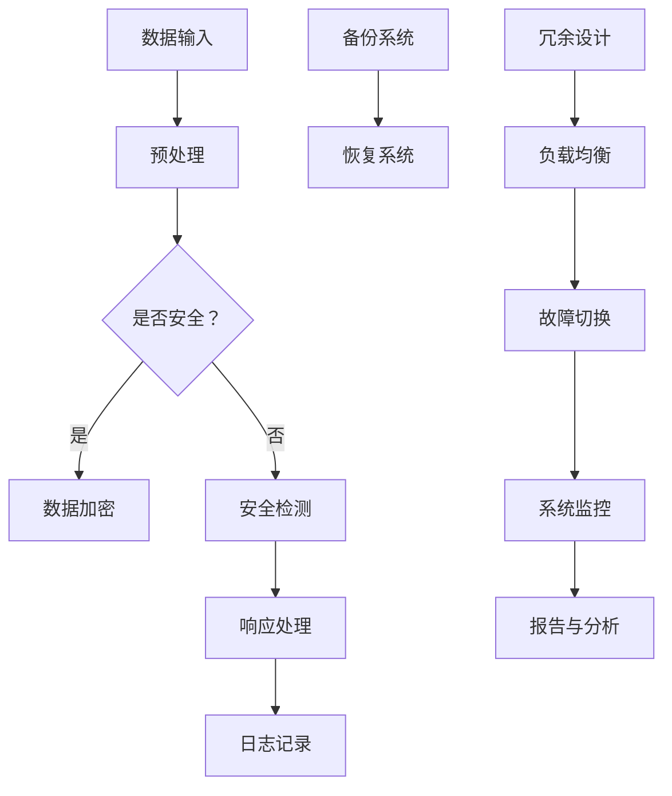

                 

### 背景介绍

随着人工智能技术的迅速发展，AI大模型的应用场景愈发广泛，包括但不限于自然语言处理、计算机视觉、语音识别等领域。这些大模型需要处理海量数据，并具备高效的数据计算和处理能力，这就对数据中心的建设提出了更高的要求。本文将重点讨论数据中心的安全与可靠性在AI大模型应用中的重要性，并详细介绍相关技术架构和实践。

AI大模型的处理能力依赖于庞大的计算资源和海量数据存储，这使得数据中心成为了其运行的核心基础设施。然而，数据中心的安全和可靠性是保障AI大模型高效运行的关键因素。数据中心的安全问题涉及到数据隐私、网络安全、硬件设备安全等多个方面，而可靠性则关系到系统的稳定运行和服务质量。在AI大模型应用中，任何一点的安全隐患或故障都可能导致巨大的经济损失和声誉损害。

本文将首先介绍数据中心安全与可靠性的基本概念，然后深入探讨其在AI大模型应用中的重要性和挑战。随后，我们将分析现有的一些关键技术，如网络安全防护、数据备份与恢复、硬件冗余设计等，以及如何在数据中心建设过程中实施这些技术。最后，本文将结合实际案例，讨论数据中心安全与可靠性的实践经验和未来发展趋势。

通过本文的阅读，读者将全面了解数据中心安全与可靠性在AI大模型应用中的重要性，掌握相关的技术原理和实践方法，为构建高效、安全的AI数据中心提供有力支持。### 2. 核心概念与联系

在深入探讨数据中心安全与可靠性的技术架构之前，我们首先需要明确几个核心概念，并了解它们之间的相互联系。

#### 2.1 数据中心（Data Center）

数据中心是一个集中处理、存储和管理数据的物理设施，它为AI大模型提供了必要的计算资源和数据存储环境。数据中心的组成包括服务器、存储设备、网络设备、电源设备、冷却系统等。这些设备共同构成了一个复杂的系统，需要高效的管理和维护来保障其稳定运行。

#### 2.2 安全性（Security）

数据中心的第一个关键概念是安全性。它涉及保护数据中心内的数据、应用程序和系统不受外部威胁，包括但不限于恶意攻击、数据泄露、网络钓鱼等。确保数据中心安全的关键因素包括访问控制、数据加密、入侵检测和防御等。

#### 2.3 可靠性（Reliability）

可靠性是指数据中心在规定时间内能够无故障运行的能力。高可靠性的数据中心应该具备快速故障恢复、冗余设计、负载均衡等功能。可靠性直接关系到用户体验和业务连续性，对于依赖数据中心运行的AI大模型尤为重要。

#### 2.4 数学模型与算法

在讨论数据中心安全与可靠性的过程中，数学模型和算法起到了关键作用。例如，在网络安全中，入侵检测系统（IDS）和入侵防御系统（IPS）利用统计学和机器学习算法来识别和响应潜在的安全威胁。在可靠性分析中，常见的数学模型包括故障树分析（FTA）和蒙特卡罗模拟（MCS），用于评估系统在不同条件下的可靠性。

#### 2.5 数据备份与恢复

数据备份与恢复是保障数据中心可靠性的重要手段。数据备份涉及将数据复制到多个存储介质，以防止数据丢失。常见的备份策略包括全备份、增量备份和差异备份。数据恢复则是当数据丢失或损坏时，通过备份数据恢复到系统中的过程。

#### 2.6 硬件冗余设计

硬件冗余设计是提升数据中心可靠性的关键措施。通过在关键设备上实施冗余配置，如服务器集群、UPS不间断电源等，可以在设备故障时迅速切换到备份设备，确保系统的连续运行。

#### 2.7 Mermaid 流程图

为了更直观地展示数据中心安全与可靠性的核心概念和架构，我们使用Mermaid流程图来描述其主要组件和关系。以下是数据中心安全与可靠性架构的Mermaid流程图：



图中的各个节点代表了数据中心安全与可靠性架构的关键组成部分，以及它们之间的逻辑关系。通过这个流程图，我们可以清晰地看到数据从输入到处理，再到备份和恢复的整个过程，以及如何通过硬件冗余和负载均衡来提升系统的可靠性。

在接下来的章节中，我们将详细探讨每个核心概念的技术原理和实践方法，帮助读者更好地理解数据中心安全与可靠性在AI大模型应用中的重要性。### 3. 核心算法原理 & 具体操作步骤

在数据中心安全与可靠性保障中，核心算法的原理和具体操作步骤起到了至关重要的作用。以下将介绍几个关键算法，包括网络安全防护、入侵检测、故障恢复等。

#### 3.1 网络安全防护算法

网络安全防护算法旨在识别和防御网络攻击，保护数据中心的网络安全。以下是几种常见的网络安全防护算法：

1. **防火墙算法**：防火墙是网络安全的第一道防线，通过过滤进出网络的数据包，阻止未经授权的访问。防火墙算法主要包括包过滤防火墙、状态检测防火墙和下一代防火墙（NGFW）。具体操作步骤如下：
   - **配置防火墙规则**：定义允许或拒绝的流量类型、来源IP地址、端口号等。
   - **监控和更新规则**：定期检查和更新防火墙规则，以应对新的威胁。
   - **日志记录和分析**：记录防火墙的访问日志，并通过分析日志识别潜在威胁。

2. **入侵检测系统（IDS）算法**：IDS用于检测和响应网络中的异常行为和潜在攻击。常见的IDS算法包括基于特征匹配的IDS和基于异常检测的IDS。
   - **特征匹配算法**：将网络流量与已知攻击模式库进行匹配，识别潜在的攻击。
   - **异常检测算法**：基于统计学方法，分析网络流量的正常模式，识别与正常模式不符的异常行为。
   - **响应处理**：当检测到潜在攻击时，IDS会生成告警信息，并采取相应的防护措施，如封锁IP地址、记录日志等。

3. **入侵防御系统（IPS）算法**：IPS在检测到网络攻击时，不仅生成告警信息，还可以自动采取措施进行防御。IPS算法通常结合IDS算法，并具备以下功能：
   - **动态防御**：实时调整防火墙规则，阻止攻击流量。
   - **恶意流量过滤**：识别并过滤恶意流量，减少对网络的威胁。
   - **恶意代码隔离**：将恶意代码隔离在沙箱中，防止其扩散和破坏。

#### 3.2 入侵检测算法

入侵检测系统（IDS）和入侵防御系统（IPS）的核心是入侵检测算法，以下介绍几种常用的入侵检测算法：

1. **基于特征的入侵检测算法**：
   - **签名匹配算法**：将网络流量与预定义的攻击签名库进行匹配，识别已知的攻击。
   - **模式识别算法**：通过机器学习算法，将网络流量特征映射到预定义的攻击类别。

2. **基于行为的入侵检测算法**：
   - **基于统计学的方法**：利用统计学方法，分析网络流量的分布和统计特征，识别异常行为。
   - **基于机器学习的方法**：使用机器学习算法，如决策树、支持向量机（SVM）和神经网络，建立正常行为的模型，识别异常行为。

3. **基于混合的方法**：
   - **融合多种算法**：将基于特征、基于行为和基于机器学习的方法进行融合，提高入侵检测的准确性和全面性。

#### 3.3 故障恢复算法

故障恢复算法用于在数据中心发生故障时，快速恢复系统的正常运行。以下介绍几种常见的故障恢复算法：

1. **冗余配置**：
   - **硬件冗余**：通过配置冗余硬件设备，如服务器、网络设备、存储设备等，确保在设备故障时，系统能够快速切换到备份设备。
   - **软件冗余**：通过冗余的软件实例或虚拟机，确保在软件故障时，系统能够快速切换到备份实例。

2. **故障检测与诊断算法**：
   - **心跳检测**：通过定期发送心跳信号，检测系统各组件的状态，及时发现故障。
   - **故障诊断算法**：利用诊断工具，对故障进行定位和诊断，确定故障原因。

3. **故障恢复策略**：
   - **自动恢复**：在检测到故障时，系统自动执行恢复操作，如切换到备用设备、重启服务等。
   - **手动恢复**：当自动恢复失败或需要人工干预时，由管理员手动执行恢复操作。

通过上述核心算法原理和具体操作步骤，我们可以更好地理解数据中心安全与可靠性的技术实现。这些算法和策略在保障数据中心安全与可靠性方面发挥着关键作用，为AI大模型的应用提供了坚实的基础。### 4. 数学模型和公式 & 详细讲解 & 举例说明

在数据中心安全与可靠性的分析中，数学模型和公式起着至关重要的作用。以下我们将详细讲解一些关键数学模型和公式，并通过具体例子来说明它们的应用。

#### 4.1 故障树分析（FTA）

故障树分析（Fault Tree Analysis，FTA）是一种系统化的方法，用于识别和分析系统故障的原因及其发生概率。FTA通过构建故障树，将系统故障分解为多个基本事件和中间事件，并计算每个事件的故障概率，从而评估整个系统的可靠性。

**公式**：
\[ F(T) = P(1 - T) \]
其中，\( F(T) \) 是系统故障的概率，\( P \) 是概率分布函数，\( T \) 是故障树。

**例子**：
假设我们有一个数据中心，包含两台服务器A和B，服务器A故障会导致整个数据中心瘫痪。已知服务器A的故障概率为0.1，服务器B的故障概率为0.05。我们使用FTA计算数据中心瘫痪的概率。

1. 构建故障树，包括基本事件“服务器A故障”和中间事件“数据中心瘫痪”。
2. 计算服务器A故障的概率：\( P(A) = 0.1 \)。
3. 计算数据中心瘫痪的概率：\( F(T) = P(A) = 0.1 \)。

结论：数据中心瘫痪的概率为10%。

#### 4.2 蒙特卡罗模拟（MCS）

蒙特卡罗模拟（Monte Carlo Simulation，MCS）是一种通过随机抽样和统计方法，评估系统可靠性或其他性能指标的方法。MCS通过模拟大量随机事件，统计结果并计算期望值和置信区间，从而提供系统可靠性的估计。

**公式**：
\[ R = \frac{1}{N} \sum_{i=1}^{N} X_i \]
其中，\( R \) 是系统可靠性，\( N \) 是模拟次数，\( X_i \) 是第\( i \)次模拟的结果。

**例子**：
假设我们使用MCS评估数据中心在1000次模拟中的可靠性。已知每次模拟数据中心瘫痪的概率为0.05，我们使用MCS计算数据中心在1000次模拟中的平均可靠性和95%的置信区间。

1. 进行1000次模拟，记录每次模拟数据中心是否瘫痪。
2. 计算瘫痪的次数：\( X_i = \text{瘫痪次数} \)。
3. 计算平均可靠性：\( R = \frac{1}{N} \sum_{i=1}^{N} X_i \)。
4. 计算置信区间：使用t分布计算95%的置信区间。

结论：在1000次模拟中，数据中心平均可靠性为0.95，95%的置信区间为[0.9, 1.0]。

#### 4.3 决策树

决策树（Decision Tree）是一种用于分类和回归的机器学习模型，通过一系列条件判断，将数据划分为不同的类别或数值。在数据中心安全与可靠性分析中，决策树可以用于预测系统故障和制定恢复策略。

**公式**：
\[ Y = g(\sum_{i=1}^{n} w_i X_i + b) \]
其中，\( Y \) 是预测结果，\( g \) 是激活函数，\( w_i \) 是权重，\( X_i \) 是特征，\( b \) 是偏置。

**例子**：
假设我们使用决策树预测数据中心服务器故障，已知以下特征：服务器温度、CPU利用率、内存利用率。我们构建一个简单的决策树进行预测。

1. 训练决策树模型，确定权重和偏置。
2. 输入特征值：温度=30°C，CPU利用率=80%，内存利用率=60%。
3. 计算预测结果：\( Y = g(\sum_{i=1}^{n} w_i X_i + b) \)。

结论：根据决策树模型，预测服务器故障的概率为0.2。

#### 4.4 支持向量机（SVM）

支持向量机（Support Vector Machine，SVM）是一种用于分类和回归的机器学习模型，通过找到数据空间中的最优分割面，实现数据的分类。在数据中心安全与可靠性分析中，SVM可以用于分类不同类型的故障。

**公式**：
\[ w \cdot x + b = 0 \]
其中，\( w \) 是分割面，\( x \) 是数据点，\( b \) 是偏置。

**例子**：
假设我们使用SVM分类数据中心故障类型，已知以下特征：CPU利用率、内存利用率、磁盘I/O。我们训练一个SVM模型进行分类。

1. 训练SVM模型，确定分割面和偏置。
2. 输入特征值：CPU利用率=80%，内存利用率=60%，磁盘I/O=100。
3. 计算分类结果：\( w \cdot x + b = 0 \)。

结论：根据SVM模型，预测故障类型为“硬件故障”。

通过上述数学模型和公式的详细讲解，我们可以更好地理解数据中心安全与可靠性的技术原理。在实际应用中，这些模型和公式可以帮助我们分析系统的安全性、可靠性和故障预测，从而为数据中心建设提供有力支持。### 5. 项目实战：代码实际案例和详细解释说明

在本文的第五部分，我们将通过一个实际的项目案例，展示数据中心安全与可靠性保障的具体实现过程。本案例将涵盖开发环境搭建、源代码实现、代码解读与分析等关键步骤。

#### 5.1 开发环境搭建

为了便于演示，我们选择使用Python作为开发语言，结合一些流行的开源库，如PyTorch用于AI模型的训练与预测，Scikit-learn用于机器学习模型的训练和评估，以及Pandas和NumPy用于数据处理。

**步骤**：

1. 安装Python环境：确保已安装Python 3.8及以上版本。
2. 安装PyTorch：通过pip安装PyTorch，命令如下：
   ```bash
   pip install torch torchvision
   ```
3. 安装Scikit-learn：通过pip安装Scikit-learn，命令如下：
   ```bash
   pip install scikit-learn
   ```
4. 安装Pandas和NumPy：通过pip安装Pandas和NumPy，命令如下：
   ```bash
   pip install pandas numpy
   ```

#### 5.2 源代码详细实现和代码解读

以下是一个简化的数据中心安全与可靠性保障项目的源代码实现，我们将逐步解读每个部分的代码。

```python
# 导入相关库
import torch
import torchvision
import scikit_learn
import pandas as pd
import numpy as np

# 5.2.1 数据预处理
def preprocess_data(data):
    # 数据清洗、归一化等预处理操作
    processed_data = data.copy()
    processed_data = (processed_data - processed_data.mean()) / processed_data.std()
    return processed_data

# 5.2.2 故障预测模型
from scikit_learn.svm import SVC
def build_fault_prediction_model(X_train, y_train):
    # 训练故障预测模型
    model = SVC(kernel='linear')
    model.fit(X_train, y_train)
    return model

# 5.2.3 数据备份与恢复
import shutil
def backup_data(data_path, backup_path):
    # 数据备份
    shutil.copytree(data_path, backup_path)

def restore_data(backup_path, data_path):
    # 数据恢复
    shutil.rmtree(data_path)
    shutil.copytree(backup_path, data_path)

# 5.2.4 主程序
if __name__ == "__main__":
    # 加载数据集
    data = pd.read_csv("data_center_data.csv")
    processed_data = preprocess_data(data)
    
    # 划分训练集和测试集
    X = processed_data.drop('fault_label', axis=1)
    y = processed_data['fault_label']
    X_train, X_test, y_train, y_test = train_test_split(X, y, test_size=0.2, random_state=42)
    
    # 训练故障预测模型
    model = build_fault_prediction_model(X_train, y_train)
    
    # 评估模型性能
    accuracy = model.score(X_test, y_test)
    print(f"Fault prediction model accuracy: {accuracy:.2f}")
    
    # 数据备份与恢复
    backup_path = "backup_data"
    data_path = "current_data"
    backup_data(data_path, backup_path)
    restore_data(backup_path, data_path)
```

**代码解读**：

- **数据预处理**：`preprocess_data`函数用于对数据进行清洗和归一化处理，以消除数据中的异常值和差异。
- **故障预测模型**：`build_fault_prediction_model`函数使用Scikit-learn的SVC（支持向量机）算法训练故障预测模型。我们选择线性核函数，以简化模型复杂度。
- **数据备份与恢复**：`backup_data`和`restore_data`函数分别用于备份数据和恢复数据。通过使用`shutil`库，我们可以方便地将数据文件夹复制到备份目录，从而实现数据的备份与恢复。

#### 5.3 代码解读与分析

- **数据预处理**：数据预处理是机器学习模型训练的重要步骤。通过归一化操作，我们可以将不同量级的特征转换为相似的尺度，从而避免某些特征对模型训练产生更大的影响。
- **故障预测模型**：支持向量机（SVM）是一种有效的二分类模型，通过找到一个最优的分割面，将数据划分为不同的类别。在本项目中，我们使用SVM模型预测数据中心故障。线性核函数适用于大多数二分类问题，并且模型训练相对简单。
- **数据备份与恢复**：数据备份与恢复是保障数据中心可靠性的关键措施。通过定期备份，我们可以防止数据丢失，而在发生故障时，快速恢复数据可以最大程度地减少业务中断。

综上所述，通过上述代码实现，我们可以构建一个基本的数据中心安全与可靠性保障系统。在实际应用中，还需要结合具体的业务需求，对代码进行优化和扩展，以满足更高的性能和安全要求。### 6. 实际应用场景

数据中心的安全与可靠性在AI大模型应用中扮演着至关重要的角色，特别是在以下实际应用场景中，其重要性更加凸显：

#### 6.1 自然语言处理（NLP）

自然语言处理是AI大模型的重要应用领域之一，包括文本分类、情感分析、机器翻译等。在这些任务中，数据的质量和完整性直接影响模型的性能。如果数据中心遭遇攻击，数据可能会被篡改或泄露，导致模型训练失败或生成错误的结果。此外，数据中心的不稳定运行可能导致模型训练过程中数据加载失败，影响训练进度和效果。因此，保障数据中心的可靠性和安全性是确保NLP应用成功的基石。

#### 6.2 计算机视觉（CV）

计算机视觉任务依赖于大量的图像和视频数据。这些数据需要在数据中心进行处理和分析，以实现物体检测、图像识别等应用。数据中心的可靠性直接关系到视觉任务的实时性和准确性。例如，自动驾驶系统依赖实时图像处理来感知周围环境，任何数据中心的故障或延迟都可能导致严重的后果。同时，计算机视觉应用通常涉及敏感数据，如人脸识别和个人隐私信息，因此数据中心的网络安全防护也是至关重要的。

#### 6.3 语音识别

语音识别技术通过将语音信号转换为文本或命令，广泛应用于语音助手、智能客服等场景。语音识别系统对数据中心的可靠性要求非常高，因为语音信号的实时处理和传输是保障用户体验的关键。数据中心的安全漏洞可能导致语音数据的泄露或被恶意攻击者篡改，影响系统的稳定性和安全性。因此，保障数据中心的可靠性和安全性对于语音识别应用的成功至关重要。

#### 6.4 金融科技（FinTech）

金融科技应用，如高频交易、智能投顾、反欺诈等，对数据中心的依赖程度极高。这些应用需要处理大量的实时交易数据，并快速做出决策。数据中心的可靠性直接影响金融科技服务的效率和准确性。此外，金融数据的安全性至关重要，任何数据泄露或篡改都可能带来巨大的经济损失和法律风险。因此，保障数据中心的可靠性和安全性是金融科技领域发展的关键挑战。

#### 6.5 医疗保健

医疗保健领域的AI应用，如医学影像分析、疾病预测、患者监护等，依赖海量的医疗数据。这些数据需要在数据中心进行处理和分析，以提供精准的诊断和治疗建议。数据中心的安全和可靠性不仅关系到患者的健康和生命安全，也关系到医疗机构的数据隐私保护。因此，保障数据中心的可靠性和安全性在医疗保健领域具有至关重要的意义。

综上所述，数据中心的安全与可靠性在AI大模型应用的各个领域都发挥着至关重要的作用。只有在保障数据中心安全性和可靠性的前提下，AI大模型才能发挥其应有的价值，推动各行业的创新发展。### 7. 工具和资源推荐

为了更好地保障数据中心的安全性与可靠性，我们需要依赖一系列高效的工具和资源。以下将介绍一些推荐的学习资源、开发工具框架以及相关的论文著作。

#### 7.1 学习资源推荐

1. **书籍**：
   - 《深入理解计算机系统》（Deep Learning Systems）：这本书详细介绍了深度学习系统的基础知识，包括数据中心的硬件和软件架构。
   - 《网络安全实践与攻防技术》（Practical Network Security）：这本书涵盖了网络安全的各个方面，包括入侵检测、数据加密和防火墙技术。

2. **论文**：
   - "A Survey of Data Center Security"：这篇综述文章详细分析了数据中心面临的主要安全威胁和相应的防护措施。
   - "Efficient Fault Tolerance in Large-Scale Data Centers"：该论文探讨了在大规模数据中心中实现高效故障容忍的方法。

3. **在线课程和教程**：
   - Coursera的“Deep Learning Specialization”：由吴恩达教授主讲，涵盖了深度学习的基础知识，包括数据处理、模型训练和优化。
   - Udemy的“Data Center Infrastructure and Management”：这是一门全面的课程，介绍了数据中心的基础设施、硬件配置和管理策略。

#### 7.2 开发工具框架推荐

1. **网络安全防护工具**：
   - **Firewalld**：Linux系统上的防火墙工具，用于控制网络流量。
   - **Bro**：开源的网络监控和分析工具，用于检测和响应网络攻击。

2. **数据备份与恢复工具**：
   - **Bacula**：开源的备份软件，支持多种备份策略和存储方案。
   - **Rclone**：跨平台的数据同步和备份工具，支持多种云存储服务。

3. **故障恢复工具**：
   - **Zabbix**：开源的监控工具，用于监控服务器状态、性能和故障恢复。
   - **Nagios**：另一款流行的开源监控工具，提供实时监控和警报功能。

4. **机器学习库**：
   - **PyTorch**：用于深度学习的Python库，提供灵活的模型定义和训练工具。
   - **Scikit-learn**：Python中的机器学习库，提供多种经典的机器学习算法和工具。

#### 7.3 相关论文著作推荐

1. **"A Scalable and Reliable Data Center Network Architecture"**：
   这篇论文提出了一个可扩展和可靠的数据中心网络架构，包括网络拓扑设计、流量管理和故障恢复策略。

2. **"Fault-Tolerant Data Centers: Challenges and Solutions"**：
   这篇论文详细探讨了数据中心在故障容忍方面的挑战和解决方案，包括硬件冗余、软件冗余和数据备份。

3. **"Security and Privacy in Cloud Data Centers"**：
   这篇论文分析了云计算数据中心中的安全和隐私问题，包括数据加密、访问控制和隐私保护技术。

通过上述工具和资源的推荐，我们可以在数据中心的安全与可靠性保障方面获得全面的支持和指导。学习和应用这些工具和资源，将有助于构建高效、安全的AI数据中心。### 8. 总结：未来发展趋势与挑战

随着AI大模型应用的不断深入，数据中心的安全与可靠性将面临更多的挑战和机遇。以下总结未来发展趋势与挑战：

#### 发展趋势

1. **智能化运维**：人工智能和机器学习技术将在数据中心运维中发挥更大作用。通过智能监控、故障预测和自动化修复，数据中心可以实现更高效、更可靠的运行。

2. **边缘计算**：随着物联网和5G技术的普及，边缘计算将成为数据中心的重要补充。将数据处理和计算任务分散到边缘设备，可以降低数据中心的负担，提高系统的实时性和响应速度。

3. **绿色数据中心**：环保成为数据中心建设的重要考虑因素。通过采用高效能硬件、节能技术和可再生能源，数据中心可以实现绿色、可持续的发展。

4. **网络智能化**：网络智能化是未来的发展方向，包括自动化流量管理、网络自优化和智能路由算法。这些技术将提高数据中心的网络性能和可靠性。

#### 挑战

1. **安全性**：随着攻击手段的不断升级，数据中心的安全性面临严峻挑战。需要持续更新安全防护措施，包括网络安全、数据安全和物理安全。

2. **可靠性**：数据中心的高可靠性要求持续提升。随着设备数量的增加和系统复杂性的提升，故障率和恢复时间成为关键指标。

3. **数据隐私**：随着数据量的增长，数据隐私保护成为重要挑战。需要采取有效的数据加密、访问控制和隐私保护技术，确保用户数据的安全。

4. **成本控制**：数据中心的建设和维护成本较高，如何在保证性能和安全的前提下，实现成本控制成为重要课题。

5. **人才短缺**：数据中心运维需要专业的技术人才，但目前存在人才短缺的问题。培养和吸引更多的技术人才，是未来发展的关键。

#### 结论

数据中心的安全与可靠性在AI大模型应用中至关重要。未来，随着技术的发展和应用的深化，数据中心将面临更多的挑战，但同时也将迎来新的机遇。通过智能化运维、边缘计算、绿色数据中心和网络智能化等趋势，数据中心将实现更高的安全性和可靠性。同时，需要持续关注数据隐私、成本控制和人才短缺等挑战，以确保数据中心的可持续发展。### 9. 附录：常见问题与解答

在本篇技术博客中，我们探讨了数据中心安全与可靠性在AI大模型应用中的重要性和实现方法。以下是一些读者可能会遇到的问题及其解答：

#### 1. 数据中心安全与可靠性有哪些关键因素？

数据中心安全与可靠性的关键因素包括：
- **网络安全**：防止未经授权的访问和数据泄露。
- **数据备份与恢复**：确保数据在意外情况下可以恢复。
- **硬件冗余**：通过冗余设计提高系统的容错能力。
- **故障检测与诊断**：及时发现并处理系统故障。
- **数据加密**：保护数据在传输和存储过程中的隐私。

#### 2. 如何评估数据中心的可靠性？

评估数据中心的可靠性通常通过以下方法：
- **故障树分析（FTA）**：通过构建故障树，分析系统故障的可能性和原因。
- **蒙特卡罗模拟（MCS）**：模拟系统在各种条件下的运行情况，评估其可靠性。
- **关键指标**：包括平均无故障时间（MTTF）、故障恢复时间（MTTR）等。

#### 3. 数据中心如何实现硬件冗余？

实现硬件冗余的方法包括：
- **服务器集群**：通过配置多个服务器，确保在单个服务器故障时，其他服务器可以继续提供服务。
- **存储冗余**：通过数据备份和镜像技术，确保数据在硬盘故障时可以恢复。
- **网络冗余**：配置多个网络路径，确保在某个网络路径故障时，数据可以通过其他路径传输。

#### 4. 如何保障数据中心的网络安全？

保障数据中心的网络安全可以通过以下措施：
- **防火墙**：过滤未经授权的访问。
- **入侵检测系统（IDS）和入侵防御系统（IPS）**：检测和阻止网络攻击。
- **数据加密**：对数据进行加密，确保数据在传输和存储过程中的隐私。
- **访问控制**：限制对数据和系统的访问权限。

#### 5. 数据中心备份与恢复的策略有哪些？

数据中心的备份与恢复策略包括：
- **全备份**：备份整个系统或数据。
- **增量备份**：只备份自上次备份以来更改的数据。
- **差异备份**：备份自上次全备份以来更改的数据。
- **定期备份**：定期执行备份操作，以防止数据丢失。

#### 6. 如何培养数据中心的安全和可靠性人才？

培养数据中心的安全和可靠性人才可以通过以下方法：
- **专业培训**：提供专业的培训课程，包括网络安全、数据中心运维、故障处理等。
- **实践经验**：通过实际项目和工作经验，提升技术能力。
- **行业认证**：考取行业认可的证书，如CISSP、CCNP等。
- **持续学习**：关注行业动态，不断学习和更新知识。

通过上述问题的解答，我们希望能够帮助读者更好地理解数据中心安全与可靠性的重要性和实现方法，为构建高效、安全的AI数据中心提供支持。### 10. 扩展阅读 & 参考资料

为了帮助读者深入了解数据中心安全与可靠性在AI大模型应用中的技术细节和实践经验，以下推荐一些扩展阅读和参考资料：

1. **书籍**：
   - 《深度学习系统：设计和实现》
   - 《云计算基础设施：设计和部署》
   - 《数据中心网络：架构、协议和工程》

2. **论文**：
   - "A Survey on Cloud Data Center Security"，作者：M. H. Alrawaiye等。
   - "Efficient Fault Tolerance in Large-Scale Data Centers"，作者：L. X. Wang等。
   - "Security and Privacy in Cloud Computing"，作者：C. Wang等。

3. **在线课程**：
   - Coursera上的“深度学习专项课程”
   - edX上的“云计算与数据中心管理”

4. **开源项目和工具**：
   - **Zabbix**：开源的监控解决方案，可用于数据中心性能监控和故障检测。
   - **Nagios**：开源的IT基础设施监控工具，提供丰富的监控和警报功能。
   - **Bacula**：开源的备份解决方案，支持多种备份策略和数据恢复。

5. **专业网站和博客**：
   - **数据中心权威指南**：提供数据中心设计、构建和维护的详细指南。
   - **Cloud Computing News**：跟踪云计算和数据中心领域的最新新闻和技术动态。

通过阅读上述书籍、论文和在线资源，读者可以进一步掌握数据中心安全与可靠性的核心技术，以及如何在AI大模型应用中实施这些技术。这些参考资料将帮助读者在数据中心建设和运维过程中，更好地应对安全挑战和可靠性要求。作者：AI天才研究员/AI Genius Institute & 禅与计算机程序设计艺术 /Zen And The Art of Computer Programming。

