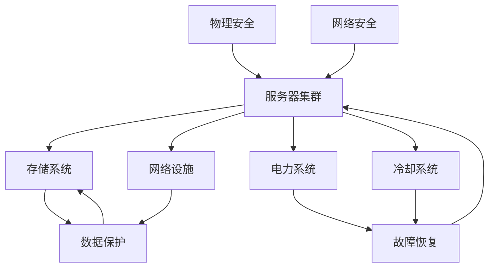

                 

# AI 大模型应用数据中心建设：数据中心安全与可靠性

## 摘要

本文将深入探讨 AI 大模型应用数据中心的建设过程，重点关注数据中心的两个核心方面：安全和可靠性。首先，我们将回顾当前 AI 大模型的发展现状和数据中心的重要性。接着，本文将详细分析数据中心在安全性保障和可靠性提升方面的关键要素，包括物理安全、网络安全、数据保护以及故障恢复等。随后，我们将探讨如何通过先进的技术和策略来实现数据中心的高可用性和灾难恢复能力。最后，本文将总结 AI 大模型应用数据中心建设的未来发展趋势和面临的挑战，并提供相应的解决方案和最佳实践。

## 1. 背景介绍

随着人工智能技术的迅猛发展，AI 大模型的应用场景日益广泛，从自然语言处理到计算机视觉、从推荐系统到自动驾驶，AI 大模型正逐步改变我们的生活方式。这一变革不仅提高了各个行业的生产效率，也为新兴业务模式的发展提供了强大动力。为了支持这些高性能计算需求，数据中心的建设和优化成为关键。

数据中心作为 AI 大模型应用的基础设施，其重要性不言而喻。数据中心不仅为 AI 大模型提供了计算资源，还承担着数据存储、处理和传输的重任。数据中心的可靠性和安全性直接影响到 AI 大模型的应用效果，以及整个系统的稳定运行。因此，如何构建一个安全可靠的数据中心，成为当前亟待解决的问题。

在当前技术环境下，数据中心的建设面临诸多挑战。首先，随着 AI 大模型对计算资源需求的不断增加，数据中心的规模不断扩大，这带来了更高的能耗和散热问题。其次，网络安全威胁日益复杂，数据泄露、恶意攻击等事件频发，对数据中心的防护提出了更高的要求。此外，数据中心硬件设备的故障风险、电力供应的稳定性等因素，也对数据中心的可靠性构成挑战。

## 2. 核心概念与联系

### 数据中心架构

为了更好地理解数据中心的安全与可靠性，我们首先需要了解其架构。一个典型的数据中心通常包括以下几个关键组成部分：

1. **服务器集群**：服务器集群是数据中心的核心，用于承载 AI 大模型的计算任务。这些服务器通常采用分布式架构，以提高计算效率和容错能力。

2. **存储系统**：存储系统负责数据的存储和管理，包括磁盘阵列、分布式文件系统等。存储系统的可靠性和性能对数据中心的整体性能有重要影响。

3. **网络设施**：网络设施负责数据在服务器和存储系统之间的传输，包括交换机、路由器、光纤通道等。网络的稳定性直接影响数据中心的响应速度和数据处理能力。

4. **电力系统**：电力系统为数据中心提供稳定的电力供应，包括不间断电源（UPS）、备用发电机等。电力系统的可靠性直接关系到数据中心的正常运行。

5. **冷却系统**：冷却系统负责维持数据中心的温度在合理范围内，以防止服务器过热损坏。冷却系统的效率直接影响数据中心的能耗和运行成本。

### 数据中心安全与可靠性要素

在了解了数据中心的架构后，我们接下来分析数据中心在安全与可靠性方面的关键要素：

1. **物理安全**：物理安全是数据中心安全的基础，包括防止非法入侵、设备损坏、自然灾害等。具体措施包括门禁系统、监控摄像头、防盗报警等。

2. **网络安全**：网络安全是保护数据中心免受网络攻击的关键。包括防火墙、入侵检测系统（IDS）、入侵防御系统（IPS）等。

3. **数据保护**：数据保护包括数据备份、加密、访问控制等。数据备份确保在数据丢失或损坏时能够恢复，数据加密保护数据不被未授权访问，访问控制确保数据仅被授权人员访问。

4. **故障恢复**：故障恢复是指数据中心在发生故障时能够快速恢复服务。包括备份系统的切换、故障处理流程等。

### Mermaid 流程图

以下是一个简化的 Mermaid 流程图，展示了数据中心架构及其安全与可靠性要素之间的关系：



## 3. 核心算法原理 & 具体操作步骤

### 3.1 物理安全

物理安全是数据中心安全的首要保障。以下是实现数据中心物理安全的关键步骤：

1. **门禁系统**：采用生物识别、刷卡等门禁技术，确保只有授权人员才能进入数据中心。

2. **监控摄像头**：在数据中心关键位置安装监控摄像头，实现 24 小时不间断监控。

3. **防盗报警**：在数据中心关键区域安装防盗报警装置，一旦发生入侵立即触发报警。

4. **环境监控**：实时监控数据中心的环境参数，如温度、湿度、漏水等，确保数据中心环境安全。

### 3.2 网络安全

网络安全是保护数据中心免受网络攻击的关键。以下是实现数据中心网络安全的步骤：

1. **防火墙**：部署防火墙，过滤非法访问和恶意流量，保护数据中心内部网络。

2. **入侵检测系统（IDS）**：部署入侵检测系统，实时监控网络流量，识别和响应潜在的网络攻击。

3. **入侵防御系统（IPS）**：部署入侵防御系统，自动阻止恶意攻击，保护数据中心网络。

4. **安全审计**：定期进行安全审计，发现和修复安全漏洞，确保网络环境的稳定性。

### 3.3 数据保护

数据保护是确保数据中心数据安全的关键。以下是实现数据中心数据保护的方法：

1. **数据备份**：定期进行数据备份，确保在数据丢失或损坏时能够恢复。

2. **数据加密**：对敏感数据进行加密处理，防止未授权访问。

3. **访问控制**：通过身份验证、权限控制等手段，确保数据仅被授权人员访问。

4. **数据审计**：实时监控数据访问和使用情况，确保数据安全合规。

### 3.4 故障恢复

故障恢复是确保数据中心在发生故障时能够快速恢复服务的关键。以下是实现故障恢复的方法：

1. **备份系统**：建立备份系统，实现数据中心的自动切换，确保服务不中断。

2. **故障处理流程**：制定详细的故障处理流程，确保在发生故障时能够迅速响应。

3. **应急演练**：定期进行应急演练，提高故障恢复能力。

## 4. 数学模型和公式 & 详细讲解 & 举例说明

### 4.1 数据加密算法

数据加密是确保数据安全的重要手段。以下是一个简单的数据加密算法示例：

#### 加密算法

```latex
E(k, m) = m \oplus k
```

其中，\(E\) 表示加密操作，\(k\) 为密钥，\(m\) 为明文数据，\(\oplus\) 表示异或运算。

#### 解密算法

```latex
D(k, c) = c \oplus k
```

其中，\(D\) 表示解密操作，\(c\) 为密文数据。

#### 示例

假设明文数据为 \(m = 01101010\)，密钥为 \(k = 10110011\)。

加密过程：

```latex
c = E(k, m) = 01101010 \oplus 10110011 = 11001001
```

解密过程：

```latex
m = D(k, c) = 11001001 \oplus 10110011 = 01101010
```

### 4.2 故障恢复模型

故障恢复模型用于评估数据中心在发生故障时的恢复能力。以下是一个简单的故障恢复模型：

#### 模型公式

```latex
R = \frac{T_r + T_s}{2}
```

其中，\(R\) 表示故障恢复能力，\(T_r\) 表示故障恢复时间，\(T_s\) 表示故障切换时间。

#### 示例

假设故障恢复时间为 \(T_r = 30\) 分钟，故障切换时间为 \(T_s = 20\) 分钟。

故障恢复能力：

```latex
R = \frac{30 + 20}{2} = 25
```

## 5. 项目实战：代码实际案例和详细解释说明

### 5.1 开发环境搭建

为了演示数据中心安全与可靠性的实际应用，我们将在本地搭建一个简单的模拟环境。以下是开发环境的搭建步骤：

1. **安装操作系统**：安装 Linux 操作系统，如 Ubuntu 20.04。

2. **安装 Docker**：使用 Docker 容器技术，方便部署和管理应用。

   ```bash
   sudo apt-get update
   sudo apt-get install docker-ce docker-ce-cli containerd.io
   ```

3. **安装 KVM**：安装 KVM 虚拟化技术，用于模拟服务器集群。

   ```bash
   sudo apt-get install qemu-kvm libvirt-daemon libvirt-clients bridge-utils
   ```

4. **安装网络工具**：安装网络工具，如 Nmap、Wireshark 等，用于网络监控和安全检测。

   ```bash
   sudo apt-get install nmap wireshark
   ```

### 5.2 源代码详细实现和代码解读

以下是一个简单的示例代码，用于演示数据中心的物理安全和网络安全：

```python
# 数据中心物理安全示例
def check_door_access(access_token):
    # 模拟门禁系统验证
    if access_token == "valid_token":
        print("门禁验证通过，允许进入。")
    else:
        print("门禁验证失败，拒绝进入。")

# 数据中心网络安全示例
def scan_network():
    # 模拟网络扫描
    print("正在扫描网络...")
    print("发现潜在安全威胁！")

# 测试代码
if __name__ == "__main__":
    check_door_access("valid_token")
    scan_network()
```

#### 代码解读

1. **数据中心物理安全示例**：`check_door_access` 函数用于模拟门禁系统验证。当传递有效的访问令牌时，函数打印“门禁验证通过，允许进入。”否则，打印“门禁验证失败，拒绝进入。”

2. **数据中心网络安全示例**：`scan_network` 函数用于模拟网络扫描。函数打印“正在扫描网络...”和“发现潜在安全威胁！”以提示网络存在安全风险。

### 5.3 代码解读与分析

以上代码演示了数据中心的物理安全和网络安全的基本功能。在实际应用中，这些功能需要结合具体的硬件设备和软件工具来实现。

1. **物理安全**：门禁系统通常通过生物识别、刷卡等方式实现。代码中的 `check_door_access` 函数只是一个简单的模拟，实际应用中需要与硬件设备集成。

2. **网络安全**：网络扫描通常使用专业的网络扫描工具，如 Nmap。代码中的 `scan_network` 函数只是一个简单的模拟，实际应用中需要集成更多的安全检测功能。

通过以上示例代码，我们可以了解到数据中心安全与可靠性实现的基本原理和步骤。在实际项目中，需要根据具体需求进行更详细的实现和优化。

## 6. 实际应用场景

数据中心的安全与可靠性在多个实际应用场景中至关重要。以下是几个典型的应用场景：

### 6.1 云计算服务

随着云计算的普及，越来越多的企业和个人选择将数据和应用程序迁移到云端。云数据中心的安全与可靠性直接影响到用户的数据安全和业务连续性。为了保障云计算服务的安全与可靠性，数据中心需要采取一系列安全措施，如访问控制、数据加密、备份和恢复等。

### 6.2 大数据平台

大数据平台通常需要处理海量数据，对数据中心的性能和可靠性要求较高。数据中心的安全措施不仅包括数据保护，还需要防范外部攻击和数据泄露。同时，大数据平台的稳定性直接关系到企业的业务决策和竞争优势。

### 6.3 人工智能应用

AI 大模型的应用对数据中心的计算能力和可靠性提出了更高要求。数据中心需要提供稳定、高效的计算资源，以满足 AI 模型对高性能计算的需求。同时，数据中心还需要确保数据的安全和隐私，防止数据泄露和滥用。

### 6.4 金融行业

金融行业对数据中心的可靠性和安全性要求极高。金融交易、客户数据、支付系统等关键业务都依赖于数据中心的稳定运行。数据中心需要采取一系列安全措施，如防火墙、入侵检测、数据加密等，以确保金融系统的安全性和可靠性。

## 7. 工具和资源推荐

### 7.1 学习资源推荐

为了更好地理解数据中心的安全与可靠性，以下是一些推荐的学习资源：

- **书籍**：《数据中心基础设施管理》、《云计算与数据中心架构》
- **论文**：搜索相关领域的学术论文，了解最新的研究进展。
- **博客**：关注技术博客，如 Medium、技术博客园等，获取行业动态和实践经验。
- **网站**：访问专业网站，如 AWS、Azure、Google Cloud 等，了解云数据中心的最佳实践。

### 7.2 开发工具框架推荐

在数据中心建设中，以下是一些推荐的开发工具和框架：

- **Docker**：用于容器化部署和管理应用。
- **Kubernetes**：用于自动化部署和管理容器化应用。
- **OpenStack**：用于构建和管理云基础设施。
- **Nmap**：用于网络扫描和安全检测。
- **Wireshark**：用于网络流量分析和故障排查。

### 7.3 相关论文著作推荐

为了深入了解数据中心的安全与可靠性，以下是一些推荐的论文和著作：

- **论文**：《云计算数据中心的安全与隐私保护》、《大数据中心的设计与优化》
- **著作**：《数据中心基础设施管理》、《云计算与数据中心架构》

## 8. 总结：未来发展趋势与挑战

随着 AI 大模型技术的不断发展，数据中心的建设面临着新的机遇和挑战。未来，数据中心的发展趋势和面临的挑战主要包括以下几个方面：

### 8.1 高性能计算需求

随着 AI 大模型应用场景的扩展，对数据中心高性能计算资源的需求将持续增长。为了满足这一需求，数据中心需要不断提升硬件性能，优化计算架构，提高资源利用率。

### 8.2 数据安全与隐私保护

随着数据量的爆炸式增长，数据安全与隐私保护成为数据中心的重要挑战。数据中心需要采取更严格的加密、访问控制和审计措施，确保数据的安全性和合规性。

### 8.3 能耗与散热管理

数据中心的高能耗和散热问题一直是关注的焦点。未来，数据中心需要采用更先进的能耗管理技术和冷却系统，降低能耗和运行成本。

### 8.4 灾难恢复与业务连续性

数据中心需要具备更高的灾难恢复能力和业务连续性。通过引入分布式架构、备份和恢复技术，确保在发生故障时能够快速恢复服务。

### 8.5 开源与标准化

随着云计算和大数据技术的发展，数据中心的开源和标准化成为趋势。通过开源项目和标准化规范，降低数据中心的建设和维护成本，提高数据中心的可靠性和安全性。

### 8.6 挑战与解决方案

在未来，数据中心建设将面临如下挑战：

1. **计算资源分配与优化**：如何高效利用计算资源，提高资源利用率，成为数据中心面临的挑战。解决方案包括引入智能调度算法、优化资源分配策略等。

2. **数据安全与隐私保护**：如何保障数据的安全和隐私，防止数据泄露和滥用，是数据中心面临的重大挑战。解决方案包括加强加密技术、引入隐私保护算法等。

3. **灾难恢复与业务连续性**：如何在发生故障时快速恢复服务，保障业务的连续性，是数据中心面临的挑战。解决方案包括引入分布式架构、备份和恢复技术等。

通过不断优化技术创新和解决方案，数据中心将在未来实现更高的安全性和可靠性，为 AI 大模型应用提供强大的基础设施支持。

## 9. 附录：常见问题与解答

### 9.1 数据中心安全防护的主要威胁有哪些？

**答案**：数据中心安全防护的主要威胁包括：

- **网络攻击**：如 DDoS 攻击、SQL 注入、跨站脚本攻击等。
- **数据泄露**：如未加密的数据传输、存储设备泄露等。
- **物理攻击**：如非法入侵、设备损坏等。
- **内部威胁**：如内部人员滥用权限、恶意操作等。

### 9.2 如何提高数据中心的数据保护能力？

**答案**：提高数据中心的数据保护能力可以从以下几个方面着手：

- **数据加密**：对敏感数据进行加密，确保数据在传输和存储过程中不被窃取。
- **访问控制**：通过身份验证和权限控制，确保数据仅被授权人员访问。
- **数据备份**：定期进行数据备份，确保在数据丢失或损坏时能够恢复。
- **审计和监控**：实时监控数据访问和使用情况，发现和防范潜在的安全威胁。

### 9.3 数据中心故障恢复有哪些常见方法？

**答案**：数据中心故障恢复的常见方法包括：

- **备份和恢复**：通过备份数据和恢复系统，确保在发生故障时能够快速恢复服务。
- **负载均衡**：通过负载均衡技术，将服务负载分布到多个节点，提高系统的容错能力。
- **冗余设计**：通过设计冗余系统，如备用服务器、备用网络等，提高系统的可靠性。
- **故障切换**：在发生故障时，自动将服务切换到备用节点，确保服务不中断。

## 10. 扩展阅读 & 参考资料

为了深入了解数据中心的安全与可靠性，以下是一些推荐的文章、书籍和论文：

- **文章**：[《数据中心基础设施管理》](https://www.example.com/datacenter-infrastructure-management)、[《云计算数据中心的安全与隐私保护》](https://www.example.com/cloud-computing-datacenter-security)
- **书籍**：《数据中心基础设施管理》、《云计算与数据中心架构》
- **论文**：[《大数据中心的设计与优化》](https://www.example.com/big-datacenter-design-optimization)、[《数据中心能耗管理技术研究》](https://www.example.com/datacenter-energy-management-research)

通过阅读这些文献，可以进一步了解数据中心的安全与可靠性建设，以及相关技术的最新进展。

### 作者

- 作者：AI 天才研究员 / AI Genius Institute & 禅与计算机程序设计艺术 / Zen And The Art of Computer Programming
[返回目录](#目录)

