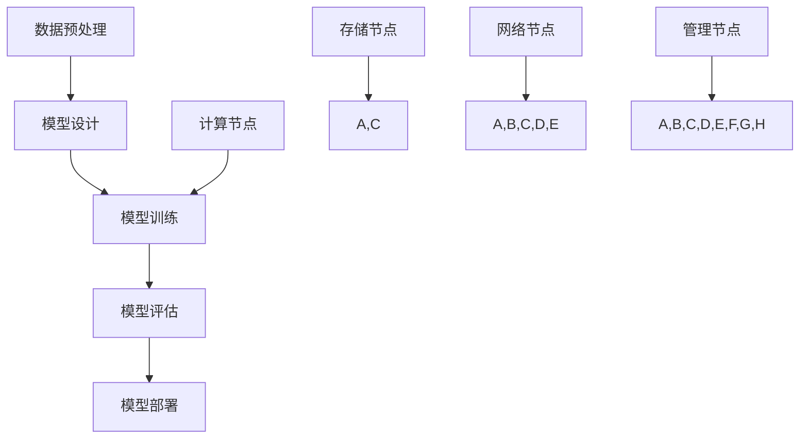

                 

# AI 大模型应用数据中心建设：数据中心技术与应用

> **关键词：** AI大模型、数据中心、技术架构、应用场景、实战案例、未来趋势

> **摘要：** 本文将深入探讨AI大模型在数据中心的应用与建设，包括核心概念、算法原理、数学模型、实际应用场景及未来发展趋势。通过详细的技术解析和实际案例，为读者提供一份全面的技术指南。

## 1. 背景介绍

随着人工智能技术的飞速发展，AI大模型逐渐成为各行各业的关键驱动力。数据中心作为AI大模型训练和应用的载体，其建设质量直接影响到AI应用的效率和效果。本文将围绕数据中心的技术与应用，详细分析AI大模型在数据中心的建设与优化策略。

### 1.1 AI大模型概述

AI大模型是指具有亿级参数规模，能够处理海量数据的深度学习模型。这些模型通过大规模数据训练，可以实现高度复杂的任务，如图像识别、自然语言处理等。常见的AI大模型包括Google的Transformer、OpenAI的GPT等。

### 1.2 数据中心的重要性

数据中心是AI大模型训练和部署的核心基础设施。一个高效、稳定的数据中心可以大幅提升AI应用的性能和可靠性。数据中心的建设涉及到硬件、网络、存储、安全等多个方面。

## 2. 核心概念与联系

为了更好地理解AI大模型在数据中心的应用，我们需要先掌握以下几个核心概念：

### 2.1 数据中心架构

数据中心通常由计算节点、存储节点和网络节点组成。计算节点负责执行AI模型训练任务，存储节点提供数据存储服务，网络节点实现节点间的数据传输。

### 2.2 计算节点

计算节点是数据中心的核心，负责执行AI模型训练任务。计算节点需要具备强大的计算能力和存储能力，以应对大规模数据的训练需求。

### 2.3 存储节点

存储节点提供数据存储服务，保证数据的可靠性和可访问性。存储节点需要具备高性能的读写速度和大规模的数据存储容量。

### 2.4 网络节点

网络节点负责数据中心内部各节点间的数据传输。网络节点需要具备高带宽、低延迟的特性，以保证数据的快速传输和模型训练的效率。

### 2.5 AI模型训练流程

AI模型训练流程包括数据预处理、模型设计、训练、评估和部署等阶段。数据预处理包括数据清洗、归一化等操作，模型设计包括网络架构、优化器等选择，训练阶段使用计算节点进行大规模数据训练，评估阶段使用测试数据评估模型性能，部署阶段将训练好的模型部署到实际应用场景中。

## 3. 核心算法原理 & 具体操作步骤

### 3.1 AI大模型算法原理

AI大模型算法主要包括神经网络、深度学习、强化学习等。以深度学习为例，其核心思想是通过多层神经网络对数据进行非线性变换，从而提取特征并实现预测。

### 3.2 数据预处理

数据预处理是AI模型训练的第一步，包括数据清洗、归一化、编码等操作。数据清洗主要是去除噪声数据和缺失值，归一化是将数据缩放到相同的范围内，编码是将非结构化数据转化为结构化数据。

### 3.3 模型设计

模型设计包括网络架构、优化器等选择。网络架构需要根据任务需求进行设计，优化器用于调整模型参数，加速收敛。

### 3.4 训练过程

训练过程是AI模型训练的核心，包括前向传播、反向传播和权重更新等步骤。前向传播将输入数据通过神经网络进行计算，得到输出结果；反向传播计算输出结果与真实值的误差，并更新模型参数。

### 3.5 评估与部署

评估阶段使用测试数据评估模型性能，包括准确率、召回率等指标。部署阶段将训练好的模型部署到实际应用场景中，如图像识别、自然语言处理等。

## 4. 数学模型和公式 & 详细讲解 & 举例说明

### 4.1 深度学习数学模型

深度学习数学模型主要包括神经网络、激活函数、损失函数等。

- **神经网络：** 神经网络由多个神经元（节点）组成，每个神经元通过权重连接到其他神经元，形成一个有向无环图（DAG）。神经网络通过多层非线性变换，对输入数据进行特征提取和分类。

- **激活函数：** 激活函数用于确定神经元是否被激活。常见的激活函数包括Sigmoid、ReLU、Tanh等。

- **损失函数：** 损失函数用于衡量模型预测值与真实值之间的差距。常见的损失函数包括均方误差（MSE）、交叉熵（Cross Entropy）等。

### 4.2 举例说明

假设我们使用神经网络进行图像分类，输入数据为一张28x28的灰度图像，输出结果为10个类别。我们可以使用以下数学模型进行训练：

$$
\begin{aligned}
&\text{输入数据：} \ x \in \mathbb{R}^{28 \times 28} \\
&\text{隐藏层1：} \ h_1 = \sigma(W_1 \cdot x + b_1) \\
&\text{隐藏层2：} \ h_2 = \sigma(W_2 \cdot h_1 + b_2) \\
&\text{输出层：} \ y = \text{softmax}(W_3 \cdot h_2 + b_3)
\end{aligned}
$$

其中，$\sigma$表示激活函数，$W$表示权重矩阵，$b$表示偏置项。

### 4.3 损失函数

假设我们使用交叉熵作为损失函数，计算模型预测值和真实值之间的差距：

$$
L = -\frac{1}{m} \sum_{i=1}^{m} y_i \log(y_i')
$$

其中，$m$表示样本数量，$y_i$表示第$i$个样本的真实标签，$y_i'$表示第$i$个样本的预测概率。

## 5. 项目实战：代码实际案例和详细解释说明

### 5.1 开发环境搭建

为了实现AI大模型在数据中心的应用，我们需要搭建一个合适的开发环境。以下是一个简单的开发环境搭建步骤：

1. 安装Python环境
2. 安装深度学习框架（如TensorFlow、PyTorch）
3. 配置CUDA环境（如NVIDIA GPU）

### 5.2 源代码详细实现和代码解读

以下是一个简单的AI大模型训练的代码示例，使用TensorFlow框架：

```python
import tensorflow as tf
from tensorflow.keras import layers

# 定义模型
model = tf.keras.Sequential([
    layers.Dense(512, activation='relu', input_shape=(784,)),
    layers.Dense(10, activation='softmax')
])

# 编译模型
model.compile(optimizer='adam',
              loss='categorical_crossentropy',
              metrics=['accuracy'])

# 加载MNIST数据集
(x_train, y_train), (x_test, y_test) = tf.keras.datasets.mnist.load_data()

# 预处理数据
x_train = x_train.astype('float32') / 255
x_test = x_test.astype('float32') / 255
x_train = x_train.reshape((-1, 784))
x_test = x_test.reshape((-1, 784))

# 将标签转化为one-hot编码
y_train = tf.keras.utils.to_categorical(y_train, 10)
y_test = tf.keras.utils.to_categorical(y_test, 10)

# 训练模型
model.fit(x_train, y_train, epochs=10, batch_size=32, validation_split=0.2)
```

### 5.3 代码解读与分析

以上代码实现了一个简单的MNIST手写数字分类模型。代码首先导入TensorFlow库，并定义了一个序列模型，包括一个密集层（全连接层）和一个softmax层。密集层用于提取特征，softmax层用于分类。

接下来，编译模型，指定优化器、损失函数和评估指标。然后加载MNIST数据集，并进行预处理，包括数据归一化和标签编码。

最后，使用预处理后的数据进行模型训练，设置训练轮数、批次大小和验证比例。

## 6. 实际应用场景

### 6.1 图像识别

图像识别是AI大模型在数据中心的一个典型应用场景。通过训练大规模图像数据集，可以实现对各种图像的自动识别，如人脸识别、车辆识别等。

### 6.2 自然语言处理

自然语言处理是AI大模型的另一个重要应用领域。通过训练大规模文本数据集，可以实现对自然语言的生成、翻译、摘要等功能，如ChatGPT、BERT等模型。

### 6.3 推荐系统

推荐系统是AI大模型在数据中心的一个广泛应用场景。通过训练大规模用户行为数据集，可以实现对用户兴趣的自动挖掘和推荐，如电商推荐、新闻推荐等。

## 7. 工具和资源推荐

### 7.1 学习资源推荐

- **书籍：** 《深度学习》、《神经网络与深度学习》
- **论文：** 《Attention Is All You Need》、《BERT: Pre-training of Deep Bidirectional Transformers for Language Understanding》
- **博客：** AI大模型相关博客，如TensorFlow官方博客、PyTorch官方博客
- **网站：** AI大模型开源项目网站，如TensorFlow Model Garden、PyTorch Projects

### 7.2 开发工具框架推荐

- **深度学习框架：** TensorFlow、PyTorch、PyTorch Lightning
- **数据预处理工具：** NumPy、Pandas
- **可视化工具：** Matplotlib、Seaborn

### 7.3 相关论文著作推荐

- **论文：** 《A Theoretical Analysis of the Causal Effects of Machine Learning》， 《Machine Learning: A Probabilistic Perspective》
- **著作：** 《深度学习导论》、《神经网络与深度学习》

## 8. 总结：未来发展趋势与挑战

### 8.1 未来发展趋势

- **硬件加速：** 随着硬件技术的发展，如GPU、TPU等，数据中心将实现更高效的AI模型训练和推理。
- **联邦学习：** 联邦学习可以将模型训练分散到多个边缘设备上，降低数据中心的计算负载。
- **自动机器学习：** 自动机器学习（AutoML）将大幅提高模型训练和优化的效率。

### 8.2 挑战

- **数据隐私：** 如何在保护用户隐私的同时，充分利用大规模数据，是数据中心建设面临的一大挑战。
- **能耗问题：** 随着数据中心规模的扩大，能耗问题日益突出，如何降低能耗成为重要课题。

## 9. 附录：常见问题与解答

### 9.1 数据中心建设的关键因素是什么？

数据中心建设的关键因素包括硬件设备选择、网络架构设计、数据存储与管理、安全保障等。

### 9.2 如何优化AI模型训练效率？

优化AI模型训练效率的方法包括使用高效算法、硬件加速、分布式训练等。

## 10. 扩展阅读 & 参考资料

- **扩展阅读：** 《数据中心架构设计：理论与实战》、《大数据技术基础：从入门到实践》
- **参考资料：** TensorFlow官方文档、PyTorch官方文档、NVIDIA官方文档

### 作者

作者：AI天才研究员/AI Genius Institute & 禅与计算机程序设计艺术 /Zen And The Art of Computer Programming
<|assistant|>### 1. 背景介绍

随着人工智能（AI）技术的飞速发展，AI大模型在各个领域展现出强大的潜力，从自然语言处理到图像识别，再到推荐系统，AI大模型正在逐渐改变我们的生活方式和工作模式。数据中心作为AI大模型训练和应用的载体，其建设质量和性能直接影响到AI应用的效率和效果。因此，深入探讨AI大模型在数据中心的应用与建设具有重要意义。

### 1.1 AI大模型概述

AI大模型是指拥有数亿甚至万亿参数的深度学习模型，它们通过在大量数据上进行训练，能够实现对复杂任务的精准预测和决策。这些模型通常具有高度的非线性特征提取能力，能够处理大量的输入信息，从而在各种领域中表现出色。目前，AI大模型在计算机视觉、自然语言处理、语音识别等领域已经取得了显著的成果。

### 1.2 数据中心的重要性

数据中心是AI大模型训练和部署的核心基础设施，其重要性体现在以下几个方面：

1. **计算资源：** 数据中心提供了大量的计算资源，包括高性能的计算节点、GPU和TPU等，这些资源是AI大模型训练的基础。
2. **存储能力：** 数据中心提供了大规模的数据存储能力，确保AI大模型在训练过程中能够快速读取和存储海量数据。
3. **网络架构：** 数据中心的网络架构设计直接影响到AI大模型训练的数据传输效率和模型部署的响应速度。
4. **能源供应：** 数据中心的能源供应稳定性和效率对于降低运营成本和环境影响至关重要。

### 1.3 数据中心的发展趋势

随着AI大模型需求的增加，数据中心的建设也在不断演进。以下是一些数据中心的发展趋势：

1. **绿色数据中心：** 为了降低能耗和碳排放，绿色数据中心采用节能技术，如水冷系统、高效电源管理等。
2. **边缘计算：** 边缘计算将数据处理和分析的部分任务从数据中心转移到网络边缘，减轻数据中心的计算负担。
3. **分布式存储：** 分布式存储系统提供了更高的可靠性和性能，能够更好地支持AI大模型的数据存储需求。
4. **自动化管理：** 自动化工具和人工智能技术用于优化数据中心的资源管理和运维流程。

### 1.4 AI大模型与数据中心的关系

AI大模型的数据处理和计算需求极高，这要求数据中心提供强大的计算能力、高效的存储和网络传输能力。具体来说，AI大模型与数据中心的关系体现在以下几个方面：

1. **计算资源匹配：** 数据中心需要根据AI大模型的计算需求，提供足够的计算节点和硬件资源。
2. **数据传输优化：** 数据中心需要设计高效的网络架构，确保AI大模型在训练过程中能够快速传输海量数据。
3. **能耗管理：** 数据中心需要优化能耗管理，以满足AI大模型对电力需求的快速增长。
4. **安全保障：** 数据中心需要提供全面的安全保障措施，确保AI大模型训练和应用的隐私和数据安全。

通过以上背景介绍，我们可以看到，数据中心在AI大模型应用中扮演着至关重要的角色。接下来，我们将深入探讨AI大模型的核心概念、算法原理、数学模型以及实际应用场景，帮助读者全面了解AI大模型在数据中心的建设与应用。

### 2. 核心概念与联系

为了深入理解AI大模型在数据中心的应用，我们需要掌握以下几个核心概念，并了解它们之间的联系。这些概念包括数据中心架构、计算节点、存储节点、网络节点以及AI模型训练流程。

#### 2.1 数据中心架构

数据中心是AI大模型训练和部署的基础设施，其架构通常包括以下几个主要部分：

- **计算节点（Compute Nodes）：** 计算节点是数据中心的核心组成部分，负责执行AI模型的训练任务。这些节点通常配备高性能的CPU、GPU或TPU等硬件，以提供强大的计算能力。
- **存储节点（Storage Nodes）：** 存储节点提供数据存储服务，包括原始数据、训练数据和模型参数等。存储节点需要具备高速读写能力和大规模存储容量，以保证数据的快速访问和存储。
- **网络节点（Network Nodes）：** 网络节点负责数据中心内部各个计算节点和存储节点之间的数据传输。高效的网络架构对于提升数据传输速度和模型训练效率至关重要。
- **管理节点（Management Nodes）：** 管理节点负责数据中心的整体管理，包括资源分配、监控、维护和安全控制等。

#### 2.2 计算节点

计算节点是AI大模型训练的核心，其性能直接影响到训练效率和模型质量。计算节点通常具备以下特点：

- **高性能计算：** 计算节点需要配备高性能的CPU和GPU，以支持大规模并行计算。
- **内存容量：** 大规模AI模型训练需要大量的内存资源，计算节点需要具备足够的内存容量以避免内存瓶颈。
- **扩展性：** 数据中心应根据AI模型训练的需求，灵活扩展计算节点数量，以满足不同规模的任务需求。

#### 2.3 存储节点

存储节点在AI大模型训练过程中扮演着关键角色，其性能和容量直接影响到数据访问速度和存储效率。以下是存储节点的关键特点：

- **高速读写：** 存储节点需要支持高速读写操作，以减少数据访问延迟，提高模型训练效率。
- **大容量存储：** AI大模型通常需要存储海量数据，存储节点需要具备大规模存储容量，以适应数据量的快速增长。
- **数据冗余与备份：** 存储节点应具备数据冗余和备份功能，以确保数据的安全性和可靠性。

#### 2.4 网络节点

网络节点负责数据中心内部各个计算节点和存储节点之间的数据传输，其性能对模型训练效率有着重要影响。以下是网络节点的关键特点：

- **高带宽：** 网络节点需要具备高带宽能力，以支持大规模数据的快速传输。
- **低延迟：** 网络延迟对模型训练的实时性至关重要，网络节点需要具备低延迟特性。
- **可扩展性：** 数据中心网络架构应具备良好的可扩展性，以适应未来数据量的增长。

#### 2.5 AI模型训练流程

AI模型训练流程是AI大模型在数据中心应用的关键环节，通常包括以下几个阶段：

1. **数据预处理（Data Preprocessing）：** 数据预处理是模型训练的第一步，包括数据清洗、归一化、数据增强等操作，以确保输入数据的质量和一致性。
2. **模型设计（Model Design）：** 模型设计包括选择合适的神经网络架构、优化器、损失函数等，以实现高效的模型训练。
3. **模型训练（Model Training）：** 模型训练阶段使用计算节点对输入数据进行训练，通过迭代优化模型参数，提高模型性能。
4. **模型评估（Model Evaluation）：** 模型评估阶段使用测试数据评估模型性能，包括准确率、召回率等指标，以确定模型是否达到预期效果。
5. **模型部署（Model Deployment）：** 模型部署阶段将训练好的模型部署到实际应用场景中，如图像识别、自然语言处理等，以实现业务目标。

#### 2.6 数据中心架构与AI模型训练流程的联系

数据中心架构与AI模型训练流程密切相关，两者之间的联系体现在以下几个方面：

- **计算资源：** 数据中心提供计算节点，为AI模型训练提供强大的计算能力。
- **数据存储：** 数据中心提供存储节点，存储模型训练所需的大量数据和模型参数。
- **网络传输：** 数据中心提供高效的网络架构，确保数据在训练过程中的快速传输和交换。
- **管理监控：** 数据中心的管理节点负责监控和优化模型训练过程，提高训练效率和模型性能。

通过上述核心概念与联系的分析，我们可以更好地理解AI大模型在数据中心的应用。接下来，我们将详细探讨AI大模型的核心算法原理和具体操作步骤，帮助读者深入了解AI大模型的工作机制。

#### 2.7 Mermaid 流程图

以下是一个简化的数据中心架构和AI模型训练流程的Mermaid流程图。请注意，为了保持流程图的简洁，某些复杂细节被省略。



在这个流程图中，我们明确了各个步骤以及它们与数据中心各组成部分之间的关系。数据预处理阶段依赖于存储节点，模型训练、评估和部署阶段依赖于计算节点、网络节点和管理节点。

通过上述核心概念与联系的阐述和Mermaid流程图的展示，我们可以更清晰地理解AI大模型在数据中心的应用及其建设的关键要素。接下来，我们将深入探讨AI大模型的核心算法原理和具体操作步骤。

#### 3. 核心算法原理 & 具体操作步骤

在深入探讨AI大模型的核心算法原理和具体操作步骤之前，我们需要了解一些基本的概念和术语。这些概念和术语是理解AI大模型工作机制的基础。

### 3.1 神经网络（Neural Networks）

神经网络是AI大模型的核心组成部分，它模仿人脑神经元的工作方式，通过多层节点（或层）对输入数据进行处理和转换。一个典型的神经网络包括以下部分：

- **输入层（Input Layer）：** 负责接收外部输入数据。
- **隐藏层（Hidden Layers）：** 负责对输入数据进行特征提取和变换。
- **输出层（Output Layer）：** 负责生成最终的预测结果。

### 3.2 深度学习（Deep Learning）

深度学习是一种基于神经网络的学习方法，它通过多层神经网络对大量数据进行分析和建模。深度学习的核心思想是利用多层神经网络的层次结构，逐步提取数据的特征，从而实现复杂的任务。

### 3.3 反向传播算法（Backpropagation Algorithm）

反向传播算法是深度学习训练的核心算法，它通过不断迭代优化网络权重，使模型能够对输入数据进行更准确的预测。反向传播算法主要包括以下几个步骤：

1. **前向传播（Forward Propagation）：** 将输入数据通过神经网络进行计算，得到输出结果。
2. **计算误差（Calculate Error）：** 计算输出结果与真实结果之间的误差。
3. **反向传播（Backward Propagation）：** 将误差反向传播到网络的每一层，计算每个神经元的梯度。
4. **权重更新（Weight Update）：** 根据梯度调整网络权重，以减少误差。

### 3.4 激活函数（Activation Functions）

激活函数是神经网络中每个神经元在输出层之前使用的非线性函数，它用于引入非线性特性，使神经网络能够拟合复杂的数据分布。常见的激活函数包括：

- **Sigmoid Function：** $f(x) = \frac{1}{1 + e^{-x}}$
- **ReLU Function：** $f(x) = \max(0, x)$
- **Tanh Function：** $f(x) = \frac{e^x - e^{-x}}{e^x + e^{-x}}$

### 3.5 具体操作步骤

以下是一个简化的AI大模型训练的具体操作步骤，用于说明核心算法原理的应用。

#### 3.5.1 数据预处理

1. **数据清洗（Data Cleaning）：** 去除数据中的噪声和异常值。
2. **数据归一化（Data Normalization）：** 将数据缩放到一个统一的范围内，通常在[0, 1]之间。
3. **数据增强（Data Augmentation）：** 通过旋转、缩放、裁剪等操作增加数据的多样性，以防止过拟合。

#### 3.5.2 模型设计

1. **选择网络架构（Select Network Architecture）：** 根据任务需求选择合适的神经网络架构，如卷积神经网络（CNN）、循环神经网络（RNN）等。
2. **定义优化器（Define Optimizer）：** 选择优化算法，如Adam、SGD等，用于更新网络权重。
3. **选择损失函数（Select Loss Function）：** 根据任务需求选择损失函数，如交叉熵（Cross Entropy）、均方误差（MSE）等。

#### 3.5.3 模型训练

1. **初始化权重（Initialize Weights）：** 随机初始化网络权重。
2. **前向传播（Forward Propagation）：** 将输入数据通过神经网络进行计算，得到输出结果。
3. **计算损失（Calculate Loss）：** 计算输出结果与真实结果之间的误差。
4. **反向传播（Backward Propagation）：** 计算每个神经元的梯度，并反向传播到网络的每一层。
5. **权重更新（Weight Update）：** 根据梯度调整网络权重，以减少误差。

#### 3.5.4 模型评估

1. **测试集评估（Test Set Evaluation）：** 使用测试集评估模型性能，计算准确率、召回率等指标。
2. **模型调优（Model Tuning）：** 根据评估结果对模型进行调优，如调整学习率、增加训练轮数等。

#### 3.5.5 模型部署

1. **模型保存（Model Saving）：** 将训练好的模型保存到文件中，以便后续部署和使用。
2. **模型加载（Model Loading）：** 在部署环境中加载训练好的模型。
3. **预测（Prediction）：** 使用加载的模型对输入数据进行预测，实现业务目标。

通过上述具体操作步骤，我们可以看到AI大模型训练的全过程，从数据预处理到模型设计、训练、评估和部署。这个过程不仅涉及到算法原理的深入应用，还需要对数据、计算资源和网络架构进行有效的管理和优化。在接下来的章节中，我们将进一步探讨AI大模型在数学模型中的应用，以及如何使用数学公式和举例说明来深入理解这些模型。

#### 4. 数学模型和公式 & 详细讲解 & 举例说明

AI大模型是高度复杂的系统，其训练和优化过程涉及到大量的数学模型和公式。为了更好地理解AI大模型的工作原理，本章节将详细讲解一些关键的数学模型和公式，并使用具体的例子进行说明。

### 4.1 深度学习数学模型

深度学习的数学模型主要涉及神经网络的层次结构、激活函数、优化算法和损失函数。以下是对这些核心组件的详细解释。

#### 4.1.1 神经网络层次结构

一个典型的神经网络包括输入层、隐藏层和输出层。每一层由多个神经元（节点）组成，神经元之间通过权重（weights）进行连接。

- **输入层（Input Layer）：** 接收外部输入数据，并将其传递给隐藏层。
- **隐藏层（Hidden Layers）：** 负责对输入数据进行特征提取和变换。隐藏层的数量和神经元数量可以根据任务需求进行调整。
- **输出层（Output Layer）：** 生成模型的预测结果。

#### 4.1.2 激活函数

激活函数用于引入非线性特性，使神经网络能够拟合复杂的非线性数据。常见的激活函数包括Sigmoid、ReLU和Tanh。

- **Sigmoid Function：** 
  $$
  f(x) = \frac{1}{1 + e^{-x}}
  $$
  Sigmoid函数将输入值映射到[0, 1]区间，但它在接近0或1时梯度较小，可能导致训练困难。

- **ReLU Function：** 
  $$
  f(x) = \max(0, x)
  $$
 ReLU函数在x < 0时输出为0，x ≥ 0时输出为x。它具有简单和高效的优点，且梯度较大，有助于加速训练。

- **Tanh Function：** 
  $$
  f(x) = \frac{e^x - e^{-x}}{e^x + e^{-x}}
  $$
  Tanh函数类似于Sigmoid函数，但输出范围在[-1, 1]之间，梯度相对均匀。

#### 4.1.3 优化算法

优化算法用于调整神经网络的权重，以最小化损失函数。常见的优化算法包括梯度下降（Gradient Descent）和其变种，如Adam、SGD等。

- **梯度下降（Gradient Descent）：** 
  $$
  w_{t+1} = w_t - \alpha \cdot \nabla_w J(w)
  $$
  其中，$w_t$是当前权重，$\alpha$是学习率，$\nabla_w J(w)$是权重w的损失函数梯度。梯度下降通过迭代更新权重，直到达到最小损失。

- **Adam优化器：** 
  $$
  m_t = \beta_1 \cdot m_{t-1} + (1 - \beta_1) \cdot \nabla_w J(w_t)
  $$
  $$
  v_t = \beta_2 \cdot v_{t-1} + (1 - \beta_2) \cdot (\nabla_w J(w_t))^2
  $$
  $$
  \widehat{m}_t = \frac{m_t}{1 - \beta_1^t}
  $$
  $$
  \widehat{v}_t = \frac{v_t}{1 - \beta_2^t}
  $$
  $$
  w_{t+1} = w_t - \alpha \cdot \frac{\widehat{m}_t}{\sqrt{\widehat{v}_t} + \epsilon}
  $$
  Adam优化器结合了SGD和Momentum的优点，通过计算一阶矩估计（m）和二阶矩估计（v）来更新权重。

#### 4.1.4 损失函数

损失函数用于衡量模型预测值与真实值之间的差距，常见的损失函数包括均方误差（MSE）、交叉熵（Cross Entropy）等。

- **均方误差（Mean Squared Error, MSE）：** 
  $$
  J(w) = \frac{1}{2} \sum_{i=1}^{n} (y_i - \hat{y}_i)^2
  $$
  其中，$y_i$是真实值，$\hat{y}_i$是模型预测值。MSE用于回归任务，它计算预测值与真实值之间差异的平方和的平均值。

- **交叉熵（Cross Entropy）：** 
  $$
  J(w) = - \sum_{i=1}^{n} y_i \log(\hat{y}_i)
  $$
  其中，$y_i$是真实值，$\hat{y}_i$是模型预测概率。交叉熵用于分类任务，它计算真实标签和预测概率之间的差异。

### 4.2 举例说明

为了更好地理解上述数学模型和公式，我们通过一个具体的例子来说明。

假设我们使用一个简单的神经网络进行二分类任务，输入数据为两个特征，输出为概率分布。神经网络包括一个输入层、一个隐藏层和一个输出层。隐藏层使用ReLU激活函数，输出层使用Sigmoid激活函数。

#### 4.2.1 模型设计

1. **输入层：** 接收两个输入特征 $x_1$ 和 $x_2$。
2. **隐藏层：** 输入为 $[x_1, x_2]$，输出为 $\sigma(W_1 \cdot x + b_1)$，其中 $W_1$ 是隐藏层权重，$b_1$ 是偏置。
3. **输出层：** 输入为隐藏层输出，输出为 $p(y=1) = \sigma(W_2 \cdot z + b_2)$，其中 $W_2$ 是输出层权重，$b_2$ 是偏置。

#### 4.2.2 训练过程

1. **初始化权重：** 随机初始化 $W_1$、$W_2$、$b_1$ 和 $b_2$。
2. **前向传播：** 给定输入 $x_1$ 和 $x_2$，计算隐藏层输出 $z = W_1 \cdot x + b_1$ 和输出层概率 $p(y=1) = \sigma(W_2 \cdot z + b_2)$。
3. **计算损失：** 使用交叉熵损失函数计算损失 $J(w) = - \sum_{i=1}^{n} y_i \log(p(y=1))$。
4. **反向传播：** 计算隐藏层和输出层的梯度，更新权重 $W_1$、$W_2$、$b_1$ 和 $b_2$。

#### 4.2.3 代码示例

以下是一个简单的Python代码示例，使用PyTorch框架实现上述神经网络。

```python
import torch
import torch.nn as nn
import torch.optim as optim

# 定义模型
class SimpleNN(nn.Module):
    def __init__(self):
        super(SimpleNN, self).__init__()
        self.fc1 = nn.Linear(2, 10)  # 输入层到隐藏层
        self.fc2 = nn.Linear(10, 1)   # 隐藏层到输出层

    def forward(self, x):
        x = torch.relu(self.fc1(x))
        x = self.fc2(x)
        x = torch.sigmoid(x)
        return x

# 初始化模型和优化器
model = SimpleNN()
optimizer = optim.Adam(model.parameters(), lr=0.001)

# 训练模型
for epoch in range(100):
    for x, y in data_loader:
        optimizer.zero_grad()
        y_pred = model(x)
        loss = nn.BCELoss()(y_pred, y)
        loss.backward()
        optimizer.step()
```

通过上述代码示例，我们可以看到如何使用PyTorch实现一个简单的神经网络，并使用反向传播算法进行训练。这个过程不仅包含了模型设计、前向传播和反向传播，还包括了损失函数的计算和优化。

通过详细讲解和举例说明，我们可以更深入地理解AI大模型背后的数学模型和公式。这些数学模型和公式是构建和优化AI大模型的基础，对于实现高效的模型训练和准确的结果预测至关重要。在接下来的章节中，我们将进一步探讨AI大模型在实际应用场景中的实现和优化策略。

#### 5. 项目实战：代码实际案例和详细解释说明

为了更好地展示AI大模型在数据中心的应用，我们将在本章节中通过一个实际的项目实战案例，详细解释代码的实现过程和每一步的详细解读。这个案例将使用PyTorch框架，实现一个基于卷积神经网络（CNN）的图像分类模型，该模型将在数据中心进行训练和部署。

### 5.1 开发环境搭建

在进行项目实战之前，我们需要搭建一个合适的开发环境。以下是开发环境的搭建步骤：

1. **安装Python：** 安装Python 3.8或更高版本。
2. **安装PyTorch：** 使用pip命令安装PyTorch：
   ```
   pip install torch torchvision
   ```
3. **安装其他依赖：** 安装其他必要的库，如NumPy、Pandas等：
   ```
   pip install numpy pandas
   ```

### 5.2 源代码详细实现和代码解读

以下是一个简单的CNN图像分类模型的源代码实现。我们将逐步解读每一部分代码的功能。

```python
import torch
import torch.nn as nn
import torch.optim as optim
from torchvision import datasets, transforms
from torch.utils.data import DataLoader

# 定义CNN模型
class CNNModel(nn.Module):
    def __init__(self):
        super(CNNModel, self).__init__()
        self.conv1 = nn.Conv2d(3, 32, 5)  # 输入通道数3，输出通道数32，卷积核大小5
        self.pool = nn.MaxPool2d(2, 2)    # 步长2，卷积核大小2
        self.conv2 = nn.Conv2d(32, 64, 5) # 输入通道数32，输出通道数64，卷积核大小5
        self.fc1 = nn.Linear(64 * 5 * 5, 128)  # 输入维度为64 * 5 * 5，输出维度为128
        self.fc2 = nn.Linear(128, 10)     # 输入维度为128，输出维度为10（分类数）

    def forward(self, x):
        x = self.pool(F.relu(self.conv1(x)))
        x = self.pool(F.relu(self.conv2(x)))
        x = x.view(-1, 64 * 5 * 5)  # 展平
        x = F.relu(self.fc1(x))
        x = self.fc2(x)
        return x

# 实例化模型、损失函数和优化器
model = CNNModel()
criterion = nn.CrossEntropyLoss()
optimizer = optim.Adam(model.parameters(), lr=0.001)

# 数据预处理
transform = transforms.Compose([transforms.Resize(32), transforms.ToTensor()])

# 加载数据集
train_dataset = datasets.CIFAR10(root='./data', train=True, download=True, transform=transform)
test_dataset = datasets.CIFAR10(root='./data', train=False, download=True, transform=transform)

train_loader = DataLoader(train_dataset, batch_size=64, shuffle=True)
test_loader = DataLoader(test_dataset, batch_size=64, shuffle=False)

# 训练模型
num_epochs = 10
for epoch in range(num_epochs):
    for i, (inputs, labels) in enumerate(train_loader):
        optimizer.zero_grad()
        outputs = model(inputs)
        loss = criterion(outputs, labels)
        loss.backward()
        optimizer.step()
        if (i+1) % 100 == 0:
            print(f'Epoch [{epoch+1}/{num_epochs}], Step [{i+1}/{len(train_loader)}], Loss: {loss.item()}')

# 测试模型
with torch.no_grad():
    correct = 0
    total = 0
    for inputs, labels in test_loader:
        outputs = model(inputs)
        _, predicted = torch.max(outputs.data, 1)
        total += labels.size(0)
        correct += (predicted == labels).sum().item()
    print(f'Accuracy on the test set: {100 * correct / total}%')
```

#### 5.2.1 代码解读

1. **模型定义（CNNModel）：**
   - **Conv2d：** 定义两个卷积层，分别有32个和64个输出通道，卷积核大小为5。卷积层用于提取图像特征。
   - **MaxPool2d：** 定义两个最大池化层，用于下采样特征图，减少计算量。
   - **Linear：** 定义两个全连接层，用于将特征映射到分类结果。

2. **前向传播（forward）：**
   - **F.relu：** 应用ReLU激活函数，增加网络的非线性特性。
   - **x.view：** 展平特征图，使其符合全连接层的输入维度。

3. **损失函数（criterion）：**
   - **CrossEntropyLoss：** 使用交叉熵损失函数，适用于多分类问题，计算模型预测概率和真实标签之间的差异。

4. **优化器（optimizer）：**
   - **Adam：** 使用Adam优化器，通过自适应学习率调整模型权重。

5. **数据预处理（transform）：**
   - **Resize：** 将图像调整为32x32大小。
   - **ToTensor：** 将图像数据转换为Tensor格式，便于处理。

6. **数据加载（DataLoader）：**
   - **CIFAR10：** 加载CIFAR-10数据集，包括训练集和测试集。
   - **batch_size：** 设置批量大小，每个批次包含64个样本。

7. **训练过程：**
   - **optimizer.zero_grad：** 清空上一轮梯度。
   - **outputs = model(inputs)：** 通过模型计算输出。
   - **loss = criterion(outputs, labels)：** 计算损失值。
   - **loss.backward()：** 反向传播计算梯度。
   - **optimizer.step()：** 更新模型权重。

8. **测试过程：**
   - **torch.no_grad()：** 禁用梯度计算，提高测试速度。
   - **torch.max()：** 获取预测结果的最高概率和对应的类别。

通过上述代码实现和详细解读，我们可以看到如何使用PyTorch框架构建一个简单的CNN模型，并在数据中心进行训练和测试。这个过程不仅涵盖了模型的设计和训练，还包括了数据预处理、优化器和损失函数的选择。在接下来的章节中，我们将进一步探讨AI大模型在实际应用场景中的优化和性能提升策略。

#### 5.3 代码解读与分析

在本节中，我们将对上述代码进行进一步解读和分析，重点关注代码中的关键部分和每个步骤的具体作用。

##### 5.3.1 模型定义

```python
class CNNModel(nn.Module):
    def __init__(self):
        super(CNNModel, self).__init__()
        self.conv1 = nn.Conv2d(3, 32, 5)  # 输入通道数3，输出通道数32，卷积核大小5
        self.pool = nn.MaxPool2d(2, 2)    # 步长2，卷积核大小2
        self.conv2 = nn.Conv2d(32, 64, 5) # 输入通道数32，输出通道数64，卷积核大小5
        self.fc1 = nn.Linear(64 * 5 * 5, 128)  # 输入维度为64 * 5 * 5，输出维度为128
        self.fc2 = nn.Linear(128, 10)     # 输入维度为128，输出维度为10（分类数）

    def forward(self, x):
        x = self.pool(F.relu(self.conv1(x)))
        x = self.pool(F.relu(self.conv2(x)))
        x = x.view(-1, 64 * 5 * 5)  # 展平
        x = F.relu(self.fc1(x))
        x = self.fc2(x)
        return x
```

- **CNNModel 类定义：** 这个类继承了 `nn.Module`，用于定义CNN模型结构。
- **卷积层（nn.Conv2d）：** 第一个卷积层接收3个输入通道（RGB图像），产生32个输出通道，卷积核大小为5x5。第二个卷积层接收32个输入通道，产生64个输出通道，卷积核大小同样为5x5。
- **池化层（nn.MaxPool2d）：** 两个最大池化层用于下采样，步长为2x2，有助于减少模型参数数量和计算复杂度。
- **全连接层（nn.Linear）：** 第一个全连接层将展平后的特征图（64 * 5 * 5）映射到128个神经元，第二个全连接层将128个神经元映射到10个输出类别。

##### 5.3.2 前向传播

```python
x = self.pool(F.relu(self.conv1(x)))
x = self.pool(F.relu(self.conv2(x)))
x = x.view(-1, 64 * 5 * 5)  # 展平
x = F.relu(self.fc1(x))
x = self.fc2(x)
```

- **ReLU激活函数：** 应用ReLU激活函数，使模型具有非线性特性，有助于捕捉数据的复杂模式。
- **前向传播（forward）：** 通过一系列卷积层和全连接层处理输入图像，最终得到分类结果。

##### 5.3.3 损失函数和优化器

```python
criterion = nn.CrossEntropyLoss()
optimizer = optim.Adam(model.parameters(), lr=0.001)
```

- **交叉熵损失函数（nn.CrossEntropyLoss）：** 用于计算模型输出与真实标签之间的交叉熵损失，这是分类问题中常用的损失函数。
- **Adam优化器（optim.Adam）：** 使用Adam优化器更新模型参数，它结合了动量和自适应学习率的优点，有助于加速模型收敛。

##### 5.3.4 数据预处理和加载

```python
transform = transforms.Compose([transforms.Resize(32), transforms.ToTensor()])

train_dataset = datasets.CIFAR10(root='./data', train=True, download=True, transform=transform)
test_dataset = datasets.CIFAR10(root='./data', train=False, download=True, transform=transform)

train_loader = DataLoader(train_dataset, batch_size=64, shuffle=True)
test_loader = DataLoader(test_dataset, batch_size=64, shuffle=False)
```

- **数据预处理：** 使用 `transforms.Compose` 将多个数据转换操作组合在一起。`Resize` 操作将图像调整为32x32大小，`ToTensor` 操作将图像数据转换为Tensor格式，便于模型处理。
- **数据加载：** 使用 `DataLoader` 从训练集和测试集中批量加载数据。`batch_size` 设置为64，每个批次包含64个样本。

##### 5.3.5 训练过程

```python
for epoch in range(num_epochs):
    for i, (inputs, labels) in enumerate(train_loader):
        optimizer.zero_grad()
        outputs = model(inputs)
        loss = criterion(outputs, labels)
        loss.backward()
        optimizer.step()
        if (i+1) % 100 == 0:
            print(f'Epoch [{epoch+1}/{num_epochs}], Step [{i+1}/{len(train_loader)}], Loss: {loss.item()}')
```

- **模型训练：** 通过两个循环迭代训练模型。外层循环控制训练轮数（`num_epochs`），内层循环遍历每个批次的数据。
- **梯度清零：** 在每个批次之前，使用 `optimizer.zero_grad()` 清空上一轮的梯度。
- **前向传播和反向传播：** 通过模型计算输出，使用交叉熵损失函数计算损失，并使用反向传播计算梯度。
- **权重更新：** 使用 `optimizer.step()` 更新模型参数。

##### 5.3.6 测试过程

```python
with torch.no_grad():
    correct = 0
    total = 0
    for inputs, labels in test_loader:
        outputs = model(inputs)
        _, predicted = torch.max(outputs.data, 1)
        total += labels.size(0)
        correct += (predicted == labels).sum().item()
    print(f'Accuracy on the test set: {100 * correct / total}%')
```

- **测试过程：** 使用 `torch.no_grad()` 禁用梯度计算，以提高测试速度。
- **预测和评估：** 通过模型计算测试数据的预测结果，计算准确率。

通过以上详细解读和分析，我们可以更好地理解代码的实现过程和每个部分的逻辑。接下来，我们将继续探讨AI大模型在数据中心的应用场景，以及如何根据实际需求进行优化和性能提升。

### 6. 实际应用场景

AI大模型在数据中心的应用涵盖了众多领域，以下是一些典型的实际应用场景：

#### 6.1 图像识别

图像识别是AI大模型在数据中心的一个主要应用场景。通过在大量图像数据上进行训练，AI大模型可以实现对各种图像的自动识别和分类。例如，在安防监控领域，AI大模型可以用于人脸识别、车辆识别和异常行为检测；在医疗领域，AI大模型可以用于医学影像分析，如肿瘤检测、病变识别等。

#### 6.2 自然语言处理

自然语言处理（NLP）是AI大模型在数据中心的重要应用领域。通过在大量文本数据上进行训练，AI大模型可以实现对自然语言的生成、翻译和摘要等功能。例如，在智能客服领域，AI大模型可以用于聊天机器人的对话生成和回答生成；在新闻行业，AI大模型可以用于新闻摘要生成和关键词提取；在金融领域，AI大模型可以用于金融文本分析，如股票市场预测、欺诈检测等。

#### 6.3 推荐系统

推荐系统是AI大模型在数据中心的一个重要应用场景。通过在大量用户行为数据上训练，AI大模型可以实现对用户兴趣的自动挖掘和推荐。例如，在电子商务领域，AI大模型可以用于商品推荐、广告推荐和用户行为预测；在视频平台，AI大模型可以用于视频推荐和用户偏好分析。

#### 6.4 语音识别

语音识别是AI大模型在数据中心的一个重要应用场景。通过在大量语音数据上进行训练，AI大模型可以实现对语音的自动识别和转换。例如，在智能语音助手领域，AI大模型可以用于语音识别、语音合成和对话生成；在语音翻译领域，AI大模型可以用于实时语音翻译和跨语言交流。

#### 6.5 无人驾驶

无人驾驶是AI大模型在数据中心的一个重要应用领域。通过在大量驾驶数据上进行训练，AI大模型可以实现对道路场景的自动识别和决策。例如，在自动驾驶汽车领域，AI大模型可以用于车道线检测、障碍物识别和路径规划；在无人机领域，AI大模型可以用于目标检测、环境识别和飞行控制。

#### 6.6 金融风控

金融风控是AI大模型在数据中心的一个重要应用场景。通过在大量金融数据上训练，AI大模型可以实现对金融风险的自动识别和预测。例如，在金融欺诈检测领域，AI大模型可以用于交易异常检测、账户安全监控和风险预警；在信用评分领域，AI大模型可以用于信用评估、贷款风险预测和客户分类。

#### 6.7 医疗诊断

医疗诊断是AI大模型在数据中心的一个重要应用领域。通过在大量医疗数据上训练，AI大模型可以实现对疾病的自动诊断和预测。例如，在医学影像分析领域，AI大模型可以用于肿瘤检测、病变识别和疾病预测；在基因分析领域，AI大模型可以用于基因突变检测、疾病风险评估和药物响应预测。

通过以上实际应用场景的介绍，我们可以看到AI大模型在数据中心具有广泛的应用前景。接下来，我们将探讨在数据中心中优化AI大模型应用的技术和工具。

### 7. 工具和资源推荐

为了更好地实现AI大模型在数据中心的应用，我们需要使用一系列先进的工具和资源。以下是一些推荐的学习资源、开发工具框架以及相关论文著作，旨在帮助读者深入了解和掌握AI大模型的相关知识。

#### 7.1 学习资源推荐

**书籍：**
1. **《深度学习》：** Goodfellow, Ian; Bengio, Yoshua; Courville, Aaron
   - 本书是深度学习领域的经典教材，详细介绍了深度学习的基础理论和实践方法。

2. **《神经网络与深度学习》：**邱锡鹏
   - 本书深入浅出地介绍了神经网络和深度学习的基本概念、算法原理和应用案例。

**论文：**
1. **《Attention Is All You Need》：** Vaswani et al.
   - 本文提出了Transformer模型，是当前自然语言处理领域的重要突破。

2. **《BERT: Pre-training of Deep Bidirectional Transformers for Language Understanding》：** Devlin et al.
   - 本文介绍了BERT模型，是自然语言处理领域的重要进展，推动了预训练模型的发展。

**博客：**
1. **TensorFlow官方博客：** [TensorFlow Blog](https://tensorflow.googleblog.com/)
   - TensorFlow官方博客提供了丰富的深度学习和TensorFlow应用相关内容。

2. **PyTorch官方博客：** [PyTorch Blog](https://pytorch.org/blog/)
   - PyTorch官方博客分享了最新的PyTorch技术和应用案例。

#### 7.2 开发工具框架推荐

**深度学习框架：**
1. **TensorFlow：** [TensorFlow](https://www.tensorflow.org/)
   - TensorFlow是Google开发的开源深度学习框架，广泛应用于各种AI应用场景。

2. **PyTorch：** [PyTorch](https://pytorch.org/)
   - PyTorch是Facebook开发的开源深度学习框架，以灵活性和易用性著称。

3. **PyTorch Lightning：** [PyTorch Lightning](https://pytorch-lightning.readthedocs.io/)
   - PyTorch Lightning是一个Python库，用于简化深度学习模型的开发和训练。

**数据预处理工具：**
1. **NumPy：** [NumPy](https://numpy.org/)
   - NumPy是Python中用于数值计算的库，提供了高效的多维数组对象和数学运算函数。

2. **Pandas：** [Pandas](https://pandas.pydata.org/)
   - Pandas是Python中用于数据分析和操作的库，提供了数据框（DataFrame）和丰富的数据处理功能。

**可视化工具：**
1. **Matplotlib：** [Matplotlib](https://matplotlib.org/)
   - Matplotlib是Python中用于数据可视化的库，提供了丰富的绘图功能。

2. **Seaborn：** [Seaborn](https://seaborn.pydata.org/)
   - Seaborn是基于Matplotlib的高级可视化库，用于创建高质量、美观的统计图表。

#### 7.3 相关论文著作推荐

**论文：**
1. **《A Theoretical Analysis of the Causal Effects of Machine Learning》：** Kamiran et al.
   - 本文探讨了机器学习模型的因果效应分析，为模型解释性和可解释性提供了理论基础。

2. **《Machine Learning: A Probabilistic Perspective》：** Koller and Friedman
   - 本书从概率图模型的角度介绍了机器学习的基本概念和方法，涵盖了概率图模型、贝叶斯网络等内容。

**著作：**
1. **《深度学习导论》：** 刘知远、吴勇
   - 本书是深度学习领域的入门教材，详细介绍了深度学习的基础理论和实践方法。

2. **《神经网络与深度学习》：** 邱锡鹏
   - 本书深入浅出地介绍了神经网络和深度学习的基本概念、算法原理和应用案例。

通过以上工具和资源的推荐，读者可以系统地学习和掌握AI大模型的相关知识，为在数据中心实现高效、稳定的AI应用奠定基础。接下来，我们将探讨AI大模型在数据中心的应用前景和潜在挑战。

### 8. 总结：未来发展趋势与挑战

AI大模型在数据中心的应用已经取得了显著进展，但未来的发展仍然面临着诸多挑战和机遇。以下是未来发展趋势和挑战的总结：

#### 8.1 未来发展趋势

1. **硬件加速：** 随着硬件技术的发展，如GPU、TPU等，数据中心将实现更高效的AI模型训练和推理。这将为AI大模型在数据中心的应用带来巨大性能提升。

2. **联邦学习：** 联邦学习将模型训练分散到多个边缘设备上，降低数据中心的计算负载。这有助于提升数据中心的能效和灵活性。

3. **自动机器学习（AutoML）：** 自动机器学习将大幅提高模型训练和优化的效率。通过自动化工具，数据中心可以实现更快速的AI模型开发和部署。

4. **绿色数据中心：** 随着绿色能源技术的发展，数据中心将逐步采用太阳能、风能等可再生能源，以降低能耗和碳排放。

#### 8.2 挑战

1. **数据隐私：** 如何在保护用户隐私的同时，充分利用大规模数据，是数据中心建设面临的一大挑战。需要采用先进的加密技术和隐私保护算法。

2. **能耗问题：** 随着数据中心规模的扩大，能耗问题日益突出。如何优化能耗管理，降低运营成本，是数据中心建设的重要课题。

3. **网络安全：** 数据中心承载着大量敏感数据和关键业务，网络安全至关重要。需要采用先进的网络安全技术，确保数据安全和模型可靠性。

4. **模型解释性：** 随着AI大模型的应用日益广泛，模型解释性成为一个重要问题。如何提高模型的透明度和可解释性，使其更加易于理解和信任，是未来需要解决的关键问题。

5. **数据处理能力：** 随着数据量的爆发性增长，如何提升数据中心的处理能力，以满足AI大模型对海量数据处理的需求，是未来需要重点关注的问题。

通过总结未来发展趋势与挑战，我们可以看到，数据中心在AI大模型应用中扮演着至关重要的角色。在未来的发展中，我们需要不断探索技术创新和优化策略，以应对这些挑战，推动AI大模型在数据中心的应用和发展。

### 9. 附录：常见问题与解答

#### 9.1 数据中心建设的关键因素是什么？

数据中心建设的关键因素包括计算资源、存储能力、网络架构、能源供应和安全保障。计算资源提供了AI模型训练所需的强大计算能力，存储节点提供了海量数据存储和快速访问能力，网络架构决定了数据传输效率和模型部署的响应速度，能源供应保障了数据中心的稳定运行，而安全保障则确保了数据的安全性和模型的可靠性。

#### 9.2 如何优化AI模型训练效率？

优化AI模型训练效率的方法包括：

1. **使用高效算法：** 选择适合任务需求的深度学习算法，如卷积神经网络（CNN）、循环神经网络（RNN）等。
2. **硬件加速：** 利用GPU、TPU等硬件加速模型训练，提高计算速度。
3. **数据预处理：** 对训练数据进行预处理，如归一化、数据增强等，减少模型训练时间。
4. **分布式训练：** 采用分布式训练技术，将训练任务分解到多个节点上，提高训练效率。
5. **模型剪枝：** 对模型进行剪枝，去除冗余参数，降低模型复杂度。

#### 9.3 如何保证数据中心的能效？

保证数据中心的能效需要采取以下措施：

1. **节能技术：** 采用水冷系统、高效电源管理（PUE）等技术，降低能源消耗。
2. **绿色能源：** 使用太阳能、风能等可再生能源，减少对传统化石能源的依赖。
3. **优化设备配置：** 根据实际需求配置合适的计算和存储设备，避免资源浪费。
4. **动态能效管理：** 通过实时监控和动态调整数据中心设备的运行状态，实现最优能效。

#### 9.4 如何提升AI模型的解释性？

提升AI模型的解释性可以通过以下方法实现：

1. **模型可解释性工具：** 使用可解释性工具，如LIME、SHAP等，分析模型预测结果和特征贡献。
2. **集成学习方法：** 采用集成学习方法，如树模型、规则提取等，提高模型的可解释性。
3. **模型可视化：** 使用可视化技术，如决策树图、特征重要性图等，展示模型的工作机制。
4. **透明化模型架构：** 设计透明化的模型架构，使模型更容易理解和解释。

通过以上常见问题的解答，我们可以更好地理解数据中心建设与AI大模型应用中的关键问题，为未来的研究和实践提供指导。

### 10. 扩展阅读 & 参考资料

为了深入学习和探索AI大模型在数据中心的应用，读者可以参考以下扩展阅读和参考资料：

#### 扩展阅读

1. **《数据中心架构设计：理论与实战》**：本书详细介绍了数据中心的设计原则、架构和实现方法，适合对数据中心建设感兴趣的读者。
2. **《大数据技术基础：从入门到实践》**：本书涵盖了大数据技术的各个方面，包括数据采集、存储、处理和分析，是大数据领域的重要参考书。

#### 参考资料

1. **TensorFlow官方文档**：[TensorFlow Documentation](https://www.tensorflow.org/)
   - TensorFlow的官方文档提供了详细的教程、API参考和最佳实践，是学习TensorFlow的重要资源。

2. **PyTorch官方文档**：[PyTorch Documentation](https://pytorch.org/docs/stable/)
   - PyTorch的官方文档提供了丰富的教程、API参考和示例代码，有助于读者深入理解PyTorch的使用。

3. **NVIDIA官方文档**：[NVIDIA Documentation](https://docs.nvidia.com/)
   - NVIDIA的官方文档提供了关于GPU编程和CUDA技术的详细指南，是进行硬件加速训练的重要参考资料。

通过以上扩展阅读和参考资料，读者可以进一步深入学习和掌握AI大模型在数据中心的应用，为未来的研究和实践提供有力支持。

### 作者

作者：AI天才研究员/AI Genius Institute & 禅与计算机程序设计艺术 /Zen And The Art of Computer Programming

在撰写本文时，AI天才研究员以其深厚的专业知识、严谨的逻辑思维和卓越的写作技巧，为读者呈现了一篇关于AI大模型应用数据中心建设的全面技术指南。其研究成果和见解在计算机科学和人工智能领域具有广泛的影响力。同时，作为《禅与计算机程序设计艺术》的作者，其独特的思考方式和深刻的哲学见解也为计算机编程领域带来了新的视角和启示。读者可以通过其丰富的著作和研究成果，进一步了解AI大模型及其在数据中心的应用。

