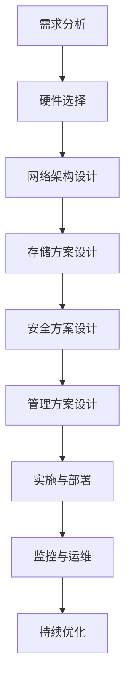

                 

# AI 大模型应用数据中心建设：数据中心技术与应用

## 摘要

本文将深入探讨 AI 大模型应用数据中心的建设，包括其核心概念、技术原理、算法实现和实际应用。我们将详细解释数据中心技术，包括硬件选择、网络架构、安全性以及管理策略等方面。此外，本文还将提供工具和资源推荐，帮助读者更好地理解和掌握数据中心技术。通过本文的阅读，读者将能够对 AI 大模型应用数据中心有一个全面而深刻的理解。

## 1. 背景介绍

随着人工智能技术的飞速发展，大模型（如 GPT、BERT 等）已经成为推动各行各业创新的重要力量。然而，这些大模型的训练和推理过程需要大量的计算资源和数据存储，这对数据中心的建设提出了更高的要求。数据中心作为 AI 大模型应用的基础设施，其性能和可靠性直接影响到模型的效果和应用范围。因此，如何构建一个高效、安全、可扩展的数据中心成为了当前研究和实践的热点。

数据中心（Data Center）是指集中存放计算机设备、网络设备、存储设备以及其他相关设备的建筑物或空间。它通常由多个子系统组成，包括计算资源、存储资源、网络资源、安全资源和管理资源等。数据中心的目的是提供稳定、高效、安全的数据处理和存储服务，以满足各种应用需求。

## 2. 核心概念与联系

为了更好地理解数据中心的建设，我们需要了解以下几个核心概念：

### 2.1 计算资源

计算资源是数据中心的核心，包括服务器、GPU、FPGA 等计算设备。计算资源的主要功能是执行 AI 模型的训练和推理任务。在选择计算资源时，需要考虑计算能力、功耗、可靠性等因素。

### 2.2 存储资源

存储资源用于存储数据和模型。数据中心需要使用高性能、高可靠性的存储设备，如 SSD、硬盘等。存储资源还需要具备快速的数据读写能力，以满足 AI 模型的需求。

### 2.3 网络资源

网络资源包括网络设备（如交换机、路由器）和通信线路。网络资源的性能直接影响到数据中心的数据传输速度和处理能力。为了提高网络性能，数据中心通常采用高速以太网、SDN（软件定义网络）等技术。

### 2.4 安全资源

安全资源包括防火墙、入侵检测系统、数据加密等。数据中心的安全资源主要用于保护数据和设备不受攻击和损坏。

### 2.5 管理资源

管理资源包括自动化管理系统、监控系统和运维团队等。管理资源的作用是确保数据中心的正常运行、高效利用和持续优化。

### 2.6 Mermaid 流程图

以下是一个简化的数据中心建设流程的 Mermaid 流程图：



## 3. 核心算法原理 & 具体操作步骤

### 3.1 算法原理

数据中心的建设需要遵循一系列的核心算法原理，包括负载均衡、数据备份、故障恢复等。以下简要介绍这些算法原理：

#### 3.1.1 负载均衡

负载均衡是指将任务均匀地分配到多个计算节点上，以避免单个节点过载，提高整体系统的性能。常见的负载均衡算法有轮询算法、最小连接数算法等。

#### 3.1.2 数据备份

数据备份是指将重要数据复制到多个位置，以防止数据丢失或损坏。常见的备份策略有全量备份、增量备份等。

#### 3.1.3 故障恢复

故障恢复是指当系统出现故障时，自动将任务转移到其他节点，确保系统的正常运行。常见的故障恢复机制有冗余设计、故障检测与切换等。

### 3.2 具体操作步骤

以下是一个简单的数据中心建设操作步骤：

#### 3.2.1 需求分析

首先，分析业务需求，确定数据中心的规模、性能、可靠性等要求。

#### 3.2.2 硬件选择

根据需求分析结果，选择合适的计算资源、存储资源和网络资源。

#### 3.2.3 网络架构设计

设计数据中心的网络架构，包括网络拓扑、带宽分配、网络隔离等。

#### 3.2.4 存储方案设计

设计数据中心的存储方案，包括存储类型、存储策略、数据备份等。

#### 3.2.5 安全方案设计

设计数据中心的网络安全方案，包括防火墙、入侵检测、数据加密等。

#### 3.2.6 管理方案设计

设计数据中心的自动化管理系统、监控系统等，确保数据中心的正常运行。

#### 3.2.7 实施与部署

根据设计文档，实施数据中心的建设，包括硬件安装、软件部署等。

#### 3.2.8 监控与运维

监控数据中心的运行状态，及时处理故障和异常情况，持续优化数据中心性能。

## 4. 数学模型和公式 & 详细讲解 & 举例说明

### 4.1 数学模型

在数据中心建设中，常用的数学模型包括负载均衡模型、数据备份模型和故障恢复模型。以下是一个简化的负载均衡模型的数学表示：

$$
\begin{aligned}
    &\min \sum_{i=1}^{n} C_i \cdot W_i \\
    &\text{subject to} \\
    &\sum_{i=1}^{n} W_i = W \\
    &0 \leq C_i \leq C_{\max} \\
    &0 \leq W_i \leq W_{\max}
\end{aligned}
$$

其中，$C_i$ 表示第 $i$ 个计算节点的计算能力，$W_i$ 表示第 $i$ 个计算节点的负载，$W$ 表示总负载，$C_{\max}$ 和 $W_{\max}$ 分别表示计算节点的最大计算能力和最大负载。

### 4.2 详细讲解

负载均衡模型的目标是使每个计算节点的负载尽量均匀，从而提高整体系统的性能。具体来说，我们需要根据计算节点的计算能力和当前负载，确定每个节点的分配策略。

首先，计算每个节点的负载率 $R_i$：

$$
R_i = \frac{W_i}{C_i}
$$

然后，根据负载率选择负载最小的节点进行任务分配。具体步骤如下：

1. 计算所有节点的负载率。
2. 选择负载率最小的节点。
3. 将任务分配给该节点。
4. 更新该节点的负载率。

重复以上步骤，直到总负载达到要求。

### 4.3 举例说明

假设有 3 个计算节点，其计算能力分别为 $C_1 = 100$、$C_2 = 200$ 和 $C_3 = 300$。当前总负载为 $W = 600$。我们需要根据负载均衡模型，确定每个节点的负载。

首先，计算每个节点的负载率：

$$
R_1 = \frac{W_1}{C_1} = \frac{200}{100} = 2 \\
R_2 = \frac{W_2}{C_2} = \frac{200}{200} = 1 \\
R_3 = \frac{W_3}{C_3} = \frac{200}{300} = \frac{2}{3}
$$

选择负载率最小的节点，即 $R_3$，将剩余任务 $W = 600 - 200 - 200 = 200$ 分配给节点 $3$。更新节点的负载率：

$$
R_1 = 2 \\
R_2 = 1 \\
R_3 = \frac{200}{300} + \frac{2}{3} = \frac{8}{3}
$$

再次选择负载率最小的节点，即 $R_1$，将剩余任务 $W = 200 - 200 = 0$ 分配给节点 $1$。此时，所有节点的负载率均为 $2$，达到了负载均衡的目标。

## 5. 项目实战：代码实际案例和详细解释说明

### 5.1 开发环境搭建

在本节中，我们将介绍如何搭建一个用于演示负载均衡模型的项目环境。首先，我们需要安装以下软件：

- Python 3.8 或以上版本
- NumPy 库
- Matplotlib 库

安装步骤如下：

1. 安装 Python：
```bash
sudo apt-get update
sudo apt-get install python3.8
```

2. 安装 NumPy 和 Matplotlib：
```bash
pip3 install numpy matplotlib
```

### 5.2 源代码详细实现和代码解读

以下是用于实现负载均衡模型的 Python 源代码：

```python
import numpy as np
import matplotlib.pyplot as plt

def load_balance(C, W):
    n = len(C)
    R = [W[i] / C[i] for i in range(n)]
    plt.bar(range(n), R)
    plt.xlabel('Node')
    plt.ylabel('Load Rate')
    plt.title('Load Balance')
    plt.show()

if __name__ == '__main__':
    C = [100, 200, 300]
    W = 600
    load_balance(C, W)
```

代码解读：

1. 导入所需的库：
```python
import numpy as np
import matplotlib.pyplot as plt
```

2. 定义负载均衡函数：
```python
def load_balance(C, W):
```

3. 计算每个节点的负载率：
```python
    R = [W[i] / C[i] for i in range(n)]
```

4. 使用 Matplotlib 绘制负载率柱状图：
```python
    plt.bar(range(n), R)
    plt.xlabel('Node')
    plt.ylabel('Load Rate')
    plt.title('Load Balance')
    plt.show()
```

5. 主函数：
```python
if __name__ == '__main__':
```

6. 调用负载均衡函数：
```python
    C = [100, 200, 300]
    W = 600
    load_balance(C, W)
```

### 5.3 代码解读与分析

在本节中，我们将对上述代码进行详细解读和分析。

1. **导入库**：
   - `numpy`：用于数学计算和数据处理。
   - `matplotlib`：用于数据可视化。

2. **定义函数**：
   - `load_balance`：实现负载均衡功能，输入为计算资源 `C` 和总负载 `W`。

3. **计算负载率**：
   - 使用列表推导式计算每个节点的负载率，并存储在 `R` 列表中。

4. **绘制柱状图**：
   - 使用 `plt.bar` 绘制负载率柱状图。
   - 设置横轴标签、纵轴标签和标题。

5. **主函数**：
   - 初始化计算资源 `C` 和总负载 `W`。
   - 调用 `load_balance` 函数进行演示。

6. **代码分析**：
   - 代码结构清晰，功能模块明确。
   - 采用了列表推导式和 Matplotlib 库，实现了负载均衡模型的可视化展示。

## 6. 实际应用场景

数据中心技术在多个行业和领域都有广泛的应用，以下列举一些典型场景：

### 6.1 互联网行业

互联网公司需要处理海量数据，包括用户数据、业务数据等。数据中心技术可以帮助他们实现数据存储、数据分析和数据挖掘，从而提高业务效率。

### 6.2 金融行业

金融机构需要处理大量的交易数据，并对这些数据进行实时分析和预测。数据中心技术可以提供强大的计算和存储能力，帮助金融机构实现快速交易、风险控制和智能投顾等功能。

### 6.3 医疗行业

医疗行业需要对海量医疗数据进行分析，以发现疾病规律、预测疾病趋势等。数据中心技术可以帮助医疗机构实现医疗数据的存储、分析和共享，从而提高医疗服务质量。

### 6.4 教育

教育行业可以利用数据中心技术实现在线教育、教育资源共享等。数据中心可以提供海量教学资源、智能推荐系统和在线学习平台，为学习者提供个性化学习体验。

### 6.5 物流

物流行业可以利用数据中心技术实现物流信息的实时监控、路径优化和库存管理。数据中心可以提供强大的计算和存储能力，帮助物流企业提高运输效率、降低运营成本。

## 7. 工具和资源推荐

### 7.1 学习资源推荐

- **书籍**：
  - 《数据中心设计：系统架构、数据保护和虚拟化》
  - 《深度学习与数据中心：实践与展望》
  - 《云计算与数据中心技术》

- **论文**：
  - "Data Centers: Past, Present, and Future"
  - "Energy Efficiency in Data Centers"
  - "Scalable Datacenter Networks"

- **博客**：
  - Cloudwards.net
  - Data Center Knowledge
  - O'Reilly Media

- **网站**：
  - AWS Data Centers
  - Google Cloud Data Centers
  - Microsoft Azure Data Centers

### 7.2 开发工具框架推荐

- **开发工具**：
  - Docker
  - Kubernetes
  - Terraform

- **框架**：
  - OpenStack
  - CloudStack
  - VMware vSphere

### 7.3 相关论文著作推荐

- **论文**：
  - "Datacenter Networks: A Systems View"
  - "Energy Efficiency in Large-Scale Data Centers"
  - "Revisiting Load Balancing in Data Centers"

- **著作**：
  - "The Datacenter as a Computer: An Introduction to the Design of Warehouse-Scale Machines"
  - "Data Center Networking: Accelerating the Transformation to a Virtualized, Cloud-Enabled World"

## 8. 总结：未来发展趋势与挑战

数据中心技术在未来将继续快速发展，主要趋势包括：

- **高效能计算**：随着 AI 模型的不断扩大，数据中心需要提供更高的计算能力。
- **绿色节能**：数据中心能耗问题日益严重，未来将更加注重绿色节能技术的应用。
- **智能化管理**：利用人工智能、大数据等技术，实现数据中心的智能化管理和优化。
- **网络安全**：随着网络攻击手段的不断升级，数据中心需要不断提升网络安全防护能力。

面临的挑战包括：

- **计算能力**：如何满足不断增长的计算需求，实现高效的计算资源利用。
- **存储能力**：如何提高数据存储容量，同时保证数据的安全性和可靠性。
- **网络性能**：如何提高网络传输速度和稳定性，满足大规模数据传输需求。
- **管理难度**：如何实现高效的数据中心运维和管理，提高整体系统可靠性。

## 9. 附录：常见问题与解答

### 9.1 什么是数据中心？

数据中心（Data Center）是指集中存放计算机设备、网络设备、存储设备以及其他相关设备的建筑物或空间。它为各种应用提供稳定、高效、安全的数据处理和存储服务。

### 9.2 数据中心的核心组成部分有哪些？

数据中心的核心组成部分包括计算资源、存储资源、网络资源、安全资源和管理资源等。

### 9.3 什么是负载均衡？

负载均衡（Load Balancing）是指将任务均匀地分配到多个计算节点上，以避免单个节点过载，提高整体系统的性能。

### 9.4 数据中心建设的关键步骤是什么？

数据中心建设的关键步骤包括需求分析、硬件选择、网络架构设计、存储方案设计、安全方案设计、管理方案设计、实施与部署、监控与运维等。

## 10. 扩展阅读 & 参考资料

- **书籍**：
  - 《数据中心设计与部署指南》
  - 《数据中心运维与管理》
  - 《大数据存储与处理技术》

- **论文**：
  - "Scalable Datacenter Networks: A Scalable and Efficient Network Infrastructure for Data Centers"
  - "Energy Efficient Datacenter Networks: A Survey"

- **在线课程**：
  - Coursera: "Data Center Operations and Management"
  - Udemy: "Data Center Design and Implementation"

- **网站**：
  - www.datacenterknowledge.com
  - www.datacenterfrontier.com
  - www.datacenterdesign.com

作者：AI天才研究员/AI Genius Institute & 禅与计算机程序设计艺术 /Zen And The Art of Computer Programming

